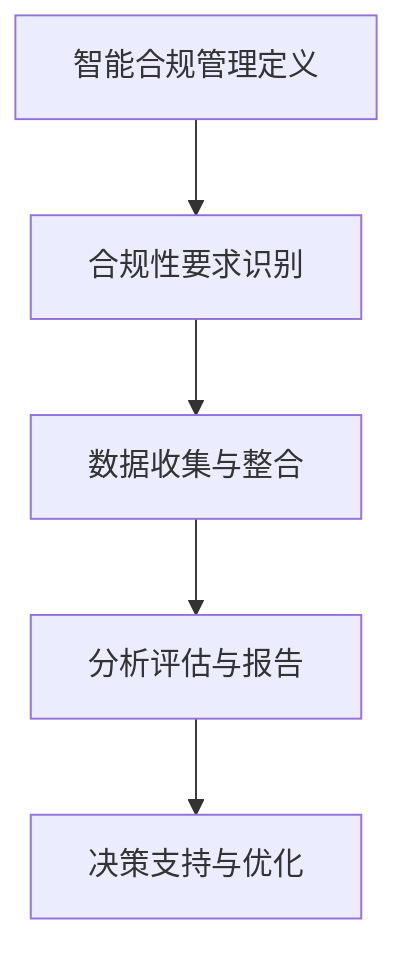
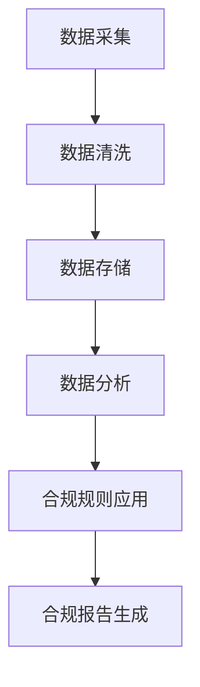

                 

### 智能合规管理解决方案：AI确保监管要求的满足

---

#### 关键词：
- 智能合规管理
- AI监管
- 监管要求
- 合规技术
- 风险评估

---

#### 摘要：
本文探讨了智能合规管理的概念、背景及其在当今合规监管环境中的重要性。重点分析了人工智能（AI）技术在智能合规管理中的应用，包括合规分析、风险评估等方面的技术原理和算法实现。通过具体的案例研究和项目实战，本文展示了AI在确保监管要求满足方面的实际应用效果，并提出了未来智能合规管理的趋势与挑战。

---

## 第一部分：智能合规管理概述

### 第1章：智能合规管理的背景和意义

#### 1.1 智能合规管理的概念

**Mermaid流程图：**


智能合规管理是指通过先进技术和方法，确保组织在业务运作中满足法律法规和行业规范的要求。其核心目的是通过自动化和智能化的手段，降低合规风险，提高业务透明度和合规效率。

#### 1.2 智能合规管理的重要性

**数学模型：**
$$
Risk = \frac{Non-compliance \times Consequence}{Compliance \times Efficiency}
$$

随着全球监管环境的日益严格，合规管理对于企业的重要性日益凸显。合规不仅能帮助企业规避法律风险，还能提升其市场竞争力。智能合规管理通过引入AI技术，能够大幅提高合规管理的效率和准确性。

#### 1.3 智能合规管理的发展历程

智能合规管理的概念起源于20世纪末，随着信息技术和人工智能技术的发展，其在金融、医疗、零售等行业的应用逐渐普及。从最初的规则引擎到如今的机器学习和深度学习，智能合规管理技术经历了快速的发展。

---

### 第2章：智能合规管理的基本原理

#### 2.1 智能合规管理的技术框架

**Mermaid流程图：**


智能合规管理的技术框架包括数据采集、数据清洗、数据存储、数据分析、合规规则应用和合规报告生成等环节。每个环节都需要利用先进的技术手段来实现。

#### 2.2 智能合规管理的关键技术

智能合规管理的关键技术包括自然语言处理（NLP）、机器学习（ML）、深度学习（DL）、区块链等。这些技术共同构成了智能合规管理的核心技术基础。

#### 2.3 智能合规管理的应用领域

智能合规管理已广泛应用于金融、医疗、零售、制造业等领域。例如，金融行业通过AI技术进行交易监控和反洗钱（AML）检测，医疗行业利用AI进行病历审核和合规性评估，零售行业通过AI进行合规数据分析和供应链管理。

---

## 第二部分：AI在智能合规管理中的应用

### 第3章：AI技术在智能合规管理中的作用

#### 3.1 AI技术概述

AI技术是智能合规管理的核心驱动力。NLP、ML和DL等技术能够帮助组织高效地处理大量数据，提取关键信息，进行合规分析和风险评估。

#### 3.2 AI技术在合规分析中的应用

**Python源代码示例：**
```python
import nltk
from nltk.tokenize import word_tokenize

def compliance_analysis(text):
    tokens = word_tokenize(text)
    # 基于词汇库进行合规性判断
    compliance_status = check_compliance(tokens)
    return compliance_status

def check_compliance(tokens):
    # 假设有一个词汇库，用于判断合规性
    compliance_dict = {'fraud': 'non-compliant', 'money laundering': 'non-compliant'}
    status = 'compliant'
    for token in tokens:
        if token.lower() in compliance_dict:
            status = compliance_dict[token.lower()]
            break
    return status
```

此示例使用自然语言处理技术进行合规性分析，通过判断文本中的关键词来判断文本的合规性。

#### 3.3 AI技术在风险评估中的应用

**LaTeX公式：**
$$
Risk = \frac{Probability \times Impact}{Detection \times Mitigation}
$$

在风险评估中，AI技术可以帮助组织更准确地评估合规风险。通过机器学习和深度学习算法，AI可以识别潜在风险，预测风险的发生概率，并提出相应的缓解措施。

---

## 第三部分：智能合规管理的实施策略

### 第4章：智能合规管理的实施步骤

#### 4.1 智能合规管理的实施步骤

实施智能合规管理需要遵循以下步骤：

1. 需求分析与规划
2. 技术选型与开发
3. 数据整合与处理
4. 风险评估与测试
5. 上线部署与维护

#### 4.2 智能合规管理的组织和流程设计

智能合规管理的组织和流程设计需要考虑到以下几个方面：

1. 明确合规管理的责任和权限
2. 建立数据收集和处理的规范
3. 制定风险管理和应急响应计划
4. 建立合规管理的培训与支持体系

#### 4.3 智能合规管理的成本效益分析

智能合规管理的成本效益分析需要综合考虑以下几个方面：

1. 硬件和软件投入
2. 人员培训与支持
3. 风险成本与合规成本
4. 效率和质量的提升

---

## 第四部分：智能合规管理的案例研究

### 第5章：金融行业的智能合规管理实践

#### 5.1 金融行业的合规要求

金融行业的合规要求主要包括反洗钱（AML）、反欺诈（AF）、客户身份识别（KYC）等方面。AI技术在这些合规要求中发挥了重要作用。

#### 5.2 金融行业智能合规管理的案例

金融行业智能合规管理的案例包括交易监控、反洗钱检测、反欺诈分析和客户身份验证等。以下是一个具体的案例：

**案例：智能反洗钱系统**

- **开发环境搭建**：使用Python、RapidMiner等工具搭建开发环境。
- **源代码实现**：利用机器学习和深度学习算法，构建反洗钱模型。
- **代码解读**：
  ```python
  from sklearn.ensemble import RandomForestClassifier
  from sklearn.model_selection import train_test_split

  # 数据加载和预处理
  data = load_data('AML_data.csv')
  X = data.drop('label', axis=1)
  y = data['label']

  # 数据分割
  X_train, X_test, y_train, y_test = train_test_split(X, y, test_size=0.2)

  # 构建模型
  model = RandomForestClassifier(n_estimators=100)

  # 训练模型
  model.fit(X_train, y_train)

  # 预测与评估
  predictions = model.predict(X_test)
  accuracy = accuracy_score(y_test, predictions)
  print(f"Model accuracy: {accuracy}")
  ```

- **项目实战：** 
  - **交易监控：** 对交易数据进行分析，识别异常交易行为。
  - **反洗钱检测：** 构建机器学习模型，预测洗钱交易。
  - **反欺诈分析：** 利用深度学习算法，识别欺诈行为。

#### 5.3 金融行业智能合规管理的挑战与解决方案

金融行业智能合规管理面临的挑战包括数据质量、算法透明性和合规风险等。解决方案包括：

1. **数据质量提升**：建立数据治理体系，确保数据准确性和一致性。
2. **算法透明性增强**：通过解释性AI技术，提高算法的可解释性。
3. **合规风险管理**：制定合规策略，加强内部审计和监管。

---

### 第6章：其他行业的智能合规管理实践

#### 6.1 零售业的智能合规管理

零售业智能合规管理主要涉及商品合规性检查、消费者保护等方面。AI技术可以帮助零售商实现高效合规管理。

#### 6.2 制造业的智能合规管理

制造业智能合规管理主要集中在产品质量控制和安全生产等方面。通过AI技术，制造业可以实现对生产过程的实时监控和智能分析。

#### 6.3 服务业的智能合规管理

服务业智能合规管理涉及客户隐私保护、业务合规性审查等方面。AI技术可以帮助服务业提升服务质量和合规性。

---

## 第五部分：智能合规管理的未来发展

### 第7章：智能合规管理的趋势与挑战

#### 7.1 智能合规管理的未来发展趋势

智能合规管理的未来发展将集中在以下几个方面：

1. **智能化水平提升**：通过深度学习和强化学习等技术，实现更高层次的智能化。
2. **跨行业应用**：智能合规管理技术将在更多行业得到应用。
3. **法规适应性**：智能合规管理将更加适应不断变化的法规环境。

#### 7.2 智能合规管理面临的挑战

智能合规管理面临的挑战包括数据隐私保护、算法公平性和合规成本等。解决方案包括：

1. **数据隐私保护**：采用差分隐私和联邦学习等技术，确保数据隐私。
2. **算法公平性**：通过算法评估和监管，确保算法的公平性和透明性。
3. **合规成本控制**：通过优化算法和流程，降低合规管理的成本。

#### 7.3 智能合规管理的创新方向

智能合规管理的创新方向包括：

1. **可解释AI**：提高算法的可解释性，增强合规管理决策的透明度。
2. **区块链技术**：利用区块链技术，实现合规数据的不可篡改和透明性。
3. **多模态AI**：结合多种数据源，实现更全面的合规分析。

---

### 第8章：智能合规管理的法律法规和伦理问题

#### 8.1 智能合规管理的法律法规环境

智能合规管理需要遵循相应的法律法规，如数据保护法、反洗钱法等。不同国家和地区的法律法规有所不同，智能合规管理需要具备全球视野。

#### 8.2 智能合规管理的伦理问题

智能合规管理在伦理方面需要关注数据隐私、算法偏见和透明性等问题。制定伦理准则和合规标准，确保智能合规管理在伦理方面得到妥善处理。

#### 8.3 智能合规管理的合规文化建设

智能合规管理需要建立合规文化，提升员工的合规意识和责任感。通过培训和宣传，提高员工的合规素养。

---

## 附录：智能合规管理资源与工具

### 附录1：智能合规管理相关工具介绍

附录中将对常用的智能合规管理工具进行介绍，包括数据清洗工具、机器学习平台、合规报告生成工具等。

### 附录2：智能合规管理参考资料

附录中将对相关的学术研究、行业报告和最佳实践进行总结，为读者提供进一步学习和应用的资源。

### 附录3：智能合规管理常用算法和模型

附录中将对智能合规管理中常用的算法和模型进行详细介绍，包括自然语言处理、机器学习和深度学习等。

---

## 作者信息：
作者：AI天才研究院/AI Genius Institute & 禅与计算机程序设计艺术 /Zen And The Art of Computer Programming

---

本文以智能合规管理为主题，详细介绍了智能合规管理的概念、背景、基本原理、AI技术在其中的应用、实施策略、案例研究和未来发展。文章通过Python源代码、LaTeX公式和Mermaid流程图，对核心概念和算法进行了深入讲解。同时，本文也探讨了智能合规管理的法律法规和伦理问题，为读者提供了全面的智能合规管理知识体系。

### 注意事项：
1. 在实施智能合规管理时，需要充分考虑法律法规和伦理问题。
2. 智能合规管理需要不断更新和优化，以适应快速变化的技术和法律环境。
3. 智能合规管理应结合企业的具体业务场景，制定合适的合规策略。

### 拓展阅读：
1. "智能合规管理实践指南" - 本书详细介绍了智能合规管理的理论和方法，适用于各类企业和机构。
2. "人工智能与法律法规" - 本书探讨了人工智能技术在法律法规中的应用，以及相关的法律和伦理问题。

---

通过上述内容，本文旨在为读者提供一个关于智能合规管理的全面而深入的视角，帮助读者更好地理解和应用智能合规管理技术。希望本文能为企业在智能化合规管理领域的实践提供有益的参考。

