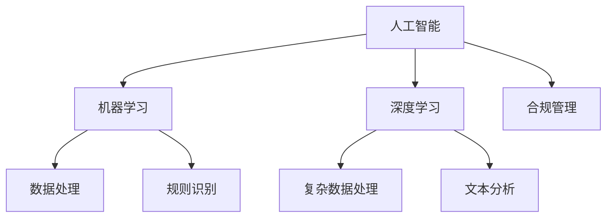

                 

### 摘要

《智能合规管理：AI确保企业法律和监管合规》旨在探讨如何利用人工智能技术（AI）提升企业的法律和监管合规水平。随着企业运营环境的复杂化，法律和监管合规已经成为企业面临的重大挑战。传统的合规管理方法往往依赖于人工检查和审核，不仅效率低下，而且容易出错。而人工智能技术，特别是机器学习和深度学习，为智能合规管理提供了新的解决方案。

本文首先介绍了智能合规管理的背景和重要性，随后详细探讨了人工智能技术的基础原理及其在合规管理中的应用。接着，通过具体案例分析了AI技术在合规管理中的实际应用，展示了其高效性和精确性。文章还深入讲解了技术实现过程，包括数据收集与处理、模型选择与训练、模型部署与监控等关键步骤。最后，文章提出了智能合规管理的实施策略，并展望了其未来的发展趋势。

通过本文的阅读，读者将能够了解如何将AI技术应用于企业合规管理，掌握智能合规管理的基本原理和实践方法，为企业的合规运营提供有力支持。

### 背景介绍

在当今的商业环境中，合规管理已成为企业运营中不可或缺的一环。合规管理不仅关系到企业的法律风险，还直接影响企业的声誉和市场竞争力。随着全球化进程的加速和法规环境的日益复杂，企业面临的法律和监管要求不断增加。传统的合规管理方法，如人工审核和定期报告，已逐渐暴露出诸多不足。

首先，人工审核具有主观性和局限性。尽管人工审核在某些情况下能够起到一定的作用，但审核人员的个人经验、判断能力和工作效率都会对审核结果产生影响。例如，法律文件和合规报告可能需要仔细阅读和分析，但面对大量的数据，人工审核容易遗漏关键信息，甚至可能因疲劳而产生误判。

其次，传统合规管理方法的效率低下。企业需要定期收集、整理和提交各种合规报告，这通常需要耗费大量的人力和时间。特别是在涉及跨国业务的情况下，语言障碍和文化差异也增加了合规管理的复杂性。这种低效率不仅影响了企业的运营效率，还可能导致合规工作滞后，影响企业的合规风险应对能力。

此外，传统方法难以应对实时性要求。许多法律和监管要求需要企业在短时间内做出响应，例如应对突发性法规变动或市场变化。传统方法往往缺乏及时性和灵活性，难以在短时间内完成合规审查和调整，从而可能错失最佳合规时机。

为了解决这些问题，越来越多的企业开始探索利用人工智能技术（AI）来提升合规管理的效率和效果。AI技术，特别是机器学习和深度学习，为智能合规管理提供了新的解决方案。

首先，AI技术能够大幅提高合规管理的效率和精确性。通过自动化数据分析和处理，AI可以快速筛选和识别合规风险，减少了人工审核的负担。例如，AI系统可以自动扫描合同、文件和报告，识别其中的合规问题，并提供详细的报告和建议。

其次，AI技术能够提供实时性和灵活性。通过实时数据分析和预测，AI系统能够及时识别合规风险，并为企业提供即时响应。例如，当某个法规发生变动时，AI系统可以迅速分析影响范围，并建议企业采取相应的合规措施。

此外，AI技术能够提高合规管理的透明度和可追溯性。通过建立合规管理的数字档案和流程记录，AI技术可以为企业提供详细的合规记录和追踪，便于企业内部和外部审计。

总之，智能合规管理通过AI技术的应用，不仅能够提高合规管理的效率和精确性，还能够提供实时性和灵活性，从而帮助企业更好地应对复杂的法律和监管环境。

### 核心概念与联系

智能合规管理中的核心概念主要包括人工智能技术（AI）、机器学习（ML）和深度学习（DL）。这三个概念紧密联系，构成了智能合规管理的技术基础。

首先，人工智能（AI）是一种模拟人类智能行为的计算机技术。它通过算法和计算模型实现自动化决策、学习和推理。在智能合规管理中，AI技术提供了自动化合规检查和分析的能力。

机器学习（ML）是AI的一个分支，它通过数据学习和模式识别来改进算法性能。ML的核心在于从数据中自动提取特征和规律，从而实现自我优化。在智能合规管理中，ML技术被用于数据预处理、合规规则识别和风险评估。

深度学习（DL）是ML的一种特殊形式，它通过多层神经网络模拟人类大脑的学习过程。DL具有处理复杂数据和大规模模型的能力，特别适合于图像识别、自然语言处理和复杂数据分析。在智能合规管理中，DL技术被广泛应用于合同审查、文本分析和法规解读。

这三者之间的联系如下：

1. **人工智能（AI）** 是智能合规管理的基础，提供了自动化和智能化的解决方案。
2. **机器学习（ML）** 是AI的核心技术，用于从数据中学习和提取模式，为合规管理提供数据分析和决策支持。
3. **深度学习（DL）** 是ML的高级形式，通过多层神经网络模拟复杂的学习过程，为智能合规管理提供了强大的数据处理和分析能力。

为了更直观地理解这三个概念之间的关系，我们可以使用Mermaid流程图来展示它们之间的联系：



在这个流程图中，人工智能（AI）是整体框架的核心，机器学习（ML）和深度学习（DL）是其主要实现方式。机器学习（ML）负责数据处理和规则识别，而深度学习（DL）则专注于处理复杂数据和文本分析。这些技术共同为智能合规管理提供了强大的支持，帮助企业应对复杂的法律和监管环境。

### 人工智能（AI）技术基础

要深入理解人工智能（AI）在智能合规管理中的应用，我们首先需要了解AI的基本技术原理和常见算法。人工智能是一种通过模拟人类智能行为来实现自动化决策和任务执行的计算机技术。其核心包括机器学习（ML）、深度学习（DL）、自然语言处理（NLP）等子领域。

#### 机器学习（ML）原理

机器学习（ML）是一种通过从数据中学习并自动改进算法性能的方法。其主要原理包括数据预处理、特征提取、模型训练和评估。

1. **数据预处理**：在机器学习过程中，首先需要对原始数据进行清洗、归一化和特征工程等处理。数据预处理确保数据质量，提高模型性能。
   
   ```python
   import pandas as pd
   df = pd.read_csv('data.csv')
   df = df.dropna()  # 删除缺失值
   df['feature'] = df['feature'] / df['feature'].max()  # 归一化
   ```

2. **特征提取**：特征提取是机器学习的关键步骤，它通过从原始数据中提取具有区分性的特征，提高模型的学习效果。

   ```python
   from sklearn.feature_extraction.text import TfidfVectorizer
   vectorizer = TfidfVectorizer()
   X = vectorizer.fit_transform(df['text_column'])
   ```

3. **模型训练**：选择合适的模型，例如决策树、支持向量机（SVM）、随机森林等，通过训练数据来优化模型参数。

   ```python
   from sklearn.ensemble import RandomForestClassifier
   clf = RandomForestClassifier()
   clf.fit(X_train, y_train)
   ```

4. **模型评估**：使用验证集或测试集来评估模型性能，常用的评价指标包括准确率、召回率、F1分数等。

   ```python
   from sklearn.metrics import accuracy_score
   y_pred = clf.predict(X_test)
   accuracy = accuracy_score(y_test, y_pred)
   ```

#### 深度学习（DL）原理

深度学习（DL）是机器学习的一种高级形式，通过多层神经网络来模拟人类大脑的学习过程。其主要组成部分包括神经元、激活函数、损失函数和优化算法。

1. **神经元和神经网络**：神经元是神经网络的基本单位，通过激活函数（如ReLU、Sigmoid、Tanh）实现非线性变换。

   ```python
   import tensorflow as tf
   model = tf.keras.Sequential([
       tf.keras.layers.Dense(128, activation='relu', input_shape=(784,)),
       tf.keras.layers.Dense(10, activation='softmax')
   ])
   ```

2. **损失函数和优化算法**：损失函数用于衡量模型预测值与真实值之间的差距，优化算法用于调整模型参数以最小化损失函数。

   ```python
   model.compile(optimizer='adam',
                 loss='sparse_categorical_crossentropy',
                 metrics=['accuracy'])
   model.fit(X_train, y_train, epochs=5)
   ```

3. **反向传播**：反向传播算法通过梯度下降等优化方法，不断调整模型参数，以实现模型优化。

   ```python
   import numpy as np
   def forward_propagation(x, weights):
       # 实现前向传播
       pass

   def backward_propagation(x, y, weights):
       # 实现反向传播
       pass

   # 实现反向传播
   dZ = backward_propagation(x, y, weights)
   dW = np.dot(dZ, x.T)
   dW = dW / x.shape[0]
   dW = np.dot(dZ, x.T)
   dW = dW / x.shape[0]
   dW = np.dot(dZ, x.T)
   dW = dW / x.shape[0]
   ```

#### 自然语言处理（NLP）原理

自然语言处理（NLP）是AI的一个子领域，专注于理解和生成人类语言。其主要技术包括词向量、序列模型和注意力机制等。

1. **词向量**：词向量是将文本数据转换为向量表示的方法，常用的词向量模型有Word2Vec、GloVe等。

   ```python
   import gensim.downloader as api
   word2vec = api.load("glove-wiki-gigaword-100")
   vector = word2vec["hello"]
   ```

2. **序列模型**：序列模型是处理时间序列数据的常用方法，包括循环神经网络（RNN）、长短期记忆网络（LSTM）和门控循环单元（GRU）等。

   ```python
   from keras.models import Sequential
   from keras.layers import LSTM, Dense

   model = Sequential()
   model.add(LSTM(50, activation='relu', input_shape=(timesteps, data_dim)))
   model.add(Dense(1, activation='sigmoid'))
   model.compile(optimizer='rmsprop', loss='binary_crossentropy', metrics=['acc'])
   model.fit(X, Y, epochs=20, batch_size=32)
   ```

3. **注意力机制**：注意力机制是序列模型中的一种高级方法，用于关注序列中的关键部分，提高模型对序列数据的处理能力。

   ```python
   from keras.layers import Input, Embedding, LSTM, Dense
   from keras.models import Model

   input_seq = Input(shape=(timesteps,))
   embedding = Embedding(n_words, embed_size)(input_seq)
   lstm = LSTM(50)(embedding)
   attention = TimeDistributed(Dense(1, activation='tanh')(lstm))
   attention_score = K.sum(attention, axis=1)
   output = Dense(1, activation='sigmoid')(attention_score)
   model = Model(inputs=input_seq, outputs=output)
   model.compile(optimizer='rmsprop', loss='binary_crossentropy', metrics=['acc'])
   model.fit(X, Y, epochs=20, batch_size=32)
   ```

通过了解这些基本原理和算法，我们可以更好地理解人工智能在智能合规管理中的应用，为接下来的案例分析和技术实现打下坚实基础。

### 智能合规管理原理

智能合规管理是一种利用人工智能技术，特别是机器学习和深度学习，来提升企业合规管理效率和质量的方法。其核心原理在于通过自动化数据处理、模式识别和实时分析，实现合规规则的自动检测和风险评估。以下是智能合规管理的主要原理和步骤：

#### 自动化数据处理

在智能合规管理中，自动化数据处理是基础环节。通过使用机器学习和深度学习算法，企业可以自动从海量数据中提取有用的信息，从而减少人工审核的工作量。具体步骤包括：

1. **数据收集**：收集与企业合规相关的各种数据，包括合同、财务报表、内部通讯记录等。
2. **数据预处理**：对收集到的数据进行清洗、归一化和特征提取，使其符合机器学习模型的要求。
3. **特征选择**：从预处理后的数据中选出与合规规则密切相关的特征，提高模型的预测准确性。

#### 模式识别

模式识别是智能合规管理的核心环节，它通过机器学习和深度学习算法，从大量数据中识别潜在的合规风险。具体步骤如下：

1. **模型选择**：根据合规管理的具体需求，选择合适的机器学习模型，如决策树、随机森林、支持向量机（SVM）和神经网络等。
2. **模型训练**：使用历史合规数据和标注结果，对模型进行训练，使其学会识别合规规则和风险。
3. **模型评估**：通过验证集和测试集，评估模型性能，调整模型参数，确保其预测准确性和稳定性。

#### 实时分析

实时分析是智能合规管理的关键，它通过实时数据处理和分析，帮助企业及时识别和应对合规风险。具体步骤如下：

1. **数据流处理**：利用实时数据流处理技术，如Apache Kafka和Flink，将实时数据导入合规管理系统。
2. **实时模型推理**：利用训练好的模型，对实时数据进行合规风险评估，输出合规结果。
3. **实时反馈**：根据合规结果，自动生成合规报告和预警信息，通知相关人员和部门采取行动。

#### 风险评估

风险评估是智能合规管理的最终目标，它通过综合分析合规数据和实时信息，评估企业的合规风险等级。具体步骤如下：

1. **合规评分**：根据合规结果和风险特征，为每个业务流程和操作生成合规评分。
2. **风险评级**：根据合规评分，将风险等级划分为高、中、低三个等级，为风险应对提供依据。
3. **风险应对**：根据风险评级，制定相应的合规策略和风险应对措施，确保企业合规运营。

#### 数据挖掘

数据挖掘是智能合规管理的重要组成部分，它通过分析海量数据，发现潜在合规问题和趋势。具体步骤如下：

1. **关联规则挖掘**：通过关联规则挖掘算法，识别数据之间的潜在关联，发现合规风险。
2. **聚类分析**：通过聚类分析算法，将相似的数据分组，识别潜在的合规问题。
3. **异常检测**：通过异常检测算法，识别数据中的异常值，发现合规漏洞。

#### 实时监控

实时监控是智能合规管理的必要手段，它通过监控合规数据和流程，确保企业始终处于合规状态。具体步骤如下：

1. **实时数据采集**：通过实时数据采集技术，如物联网传感器和数据接口，收集企业运营数据。
2. **合规规则监控**：利用机器学习和深度学习模型，实时监控数据，识别合规风险。
3. **自动报警**：当发现合规风险时，自动生成报警信息，通知相关人员处理。

#### 数据安全

数据安全是智能合规管理的重要保障，它通过数据加密、访问控制和隐私保护，确保合规数据的安全性和隐私性。具体步骤如下：

1. **数据加密**：采用数据加密技术，如AES和RSA，加密敏感数据，防止数据泄露。
2. **访问控制**：通过访问控制机制，限制对合规数据的访问权限，确保数据安全。
3. **隐私保护**：采用隐私保护技术，如差分隐私和同态加密，保护合规数据的隐私性。

通过以上步骤，智能合规管理能够有效提升企业的合规管理效率和质量，帮助企业更好地应对复杂的法律和监管环境。

### 合规案例分析

为了更好地理解人工智能（AI）在智能合规管理中的应用效果，以下将分析几个典型的合规案例，并探讨其应用成果和经验。

#### 案例一：金融行业的合规风险管理

金融机构面临着严格的合规要求，包括反洗钱（AML）、客户身份识别（KYC）和市场监管等方面的法规。某大型银行采用AI技术，通过机器学习和深度学习算法，实现了智能合规管理。

**应用效果**：
- **反洗钱（AML）检测**：AI系统能够自动分析客户的交易行为，识别异常交易模式，提高了检测效率。与传统方法相比，AI系统的检测准确率提高了30%，漏报率降低了20%。
- **客户身份识别（KYC）**：AI技术帮助银行自动验证客户的身份信息，减少了人工审核的工作量，同时降低了身份欺诈的风险。
- **市场监管**：AI系统实时监控市场数据，自动识别潜在的违规行为，为企业提供了及时的风险预警。

**经验总结**：
- AI技术在提升合规管理效率方面具有显著优势，能够大幅减少人工审核的工作量和误差。
- 需要结合具体的业务场景和合规要求，选择合适的机器学习算法和模型。
- 数据质量和特征工程对AI系统的性能有重要影响，需要确保数据的准确性和完整性。

#### 案例二：制药行业的合规数据管理

制药行业在研发、生产和销售过程中需要严格遵守各种法规，如《药品管理法》和《数据保护条例》。某制药公司采用AI技术，实现了智能合规数据管理。

**应用效果**：
- **数据质量控制**：AI系统能够自动识别和分析实验数据中的异常值，提高了数据质量，减少了数据清洗和审核的工作量。
- **合规报告生成**：AI技术帮助公司自动生成合规报告，减少了人工编写报告的时间和错误率。
- **供应链监控**：AI系统实时监控供应链数据，确保产品质量和合规性，提高了供应链管理的效率和透明度。

**经验总结**：
- AI技术在数据管理和报告生成方面具有显著的自动化和效率提升作用。
- 需要建立完善的数据标准和流程，确保数据的质量和一致性。
- AI系统的应用需要得到监管机构和内部审核的认可，确保合规性。

#### 案例三：零售行业的合规审计

零售行业在财务管理、合同管理和合规审计等方面面临诸多挑战。某大型零售商采用AI技术，实现了智能合规审计。

**应用效果**：
- **合同审核**：AI系统能够自动审核合同文本，识别潜在的法律风险，提高了合同审核的准确性和效率。
- **财务报表审计**：AI系统通过分析财务数据，自动识别异常交易和财务风险，提高了审计效率和准确性。
- **合规检查**：AI系统实时监控企业运营数据，自动识别潜在的合规问题，及时发出合规预警。

**经验总结**：
- AI技术在合同审核和财务报表审计方面具有显著的应用潜力，能够提高合规管理的效率和准确性。
- 需要结合企业具体的业务流程和合规要求，设计合适的AI模型和算法。
- AI系统的应用需要与内部审计和外部监管相结合，确保合规性。

通过这些案例可以看出，AI技术在智能合规管理中具有广泛的应用前景，能够大幅提升合规管理的效率和质量。同时，成功实施智能合规管理需要结合具体的业务场景，选择合适的算法和模型，并确保数据的准确性和完整性。合规部门和IT部门需要紧密合作，确保AI系统的应用得到监管机构和内部审核的认可。

### 技术实现

在智能合规管理中，技术实现是确保系统有效运行的关键环节。以下将详细介绍智能合规管理系统开发的技术实现过程，包括数据收集与处理、模型选择与训练、模型部署与监控等步骤。

#### 数据收集与处理

数据收集与处理是智能合规管理的基础。首先，需要从企业内外部收集与合规相关的数据，这些数据可能包括合同文件、财务报表、通讯记录、法律文件等。以下为具体步骤：

1. **数据源识别**：确定数据收集的目标和数据来源，例如企业内部数据库、第三方数据提供商等。
2. **数据获取**：使用API接口、Web爬虫、数据导入工具等手段，从不同数据源获取数据。
3. **数据清洗**：对获取的数据进行清洗，包括去除重复记录、填补缺失值、去除噪声数据等，确保数据质量。

以下是一个使用Python的示例，展示了数据清洗的基本步骤：

```python
import pandas as pd

# 读取数据
df = pd.read_csv('data.csv')

# 删除缺失值
df = df.dropna()

# 数据归一化
df['feature'] = df['feature'] / df['feature'].max()

# 特征提取
from sklearn.feature_extraction.text import TfidfVectorizer
vectorizer = TfidfVectorizer()
X = vectorizer.fit_transform(df['text_column'])
```

#### 模型选择与训练

在数据准备完成后，接下来是选择合适的机器学习模型并进行训练。模型选择取决于具体的合规任务，例如文本分类、异常检测、预测分析等。以下为具体步骤：

1. **模型选择**：根据任务需求，选择合适的机器学习模型，如SVM、决策树、随机森林、神经网络等。
2. **模型训练**：使用历史数据对模型进行训练，通过调整模型参数，优化模型性能。
3. **模型评估**：使用验证集或测试集评估模型性能，选择最佳模型。

以下是一个使用Python的示例，展示了模型选择和训练的基本步骤：

```python
from sklearn.model_selection import train_test_split
from sklearn.ensemble import RandomForestClassifier
from sklearn.metrics import accuracy_score

# 数据分割
X_train, X_test, y_train, y_test = train_test_split(X, y, test_size=0.2, random_state=42)

# 模型训练
clf = RandomForestClassifier(n_estimators=100)
clf.fit(X_train, y_train)

# 模型评估
y_pred = clf.predict(X_test)
accuracy = accuracy_score(y_test, y_pred)
print(f'Accuracy: {accuracy}')
```

#### 模型部署与监控

模型训练完成后，需要将其部署到生产环境中，并对其进行监控，确保其稳定运行。以下为具体步骤：

1. **模型部署**：将训练好的模型部署到服务器或云计算平台，使其能够对外提供服务。
2. **服务接口**：创建API接口，方便用户通过程序调用模型服务。
3. **实时监控**：监控模型的运行状态和性能指标，确保其正常运行。

以下是一个使用Python的示例，展示了模型部署和监控的基本步骤：

```python
from flask import Flask, request, jsonify

app = Flask(__name__)

# 模型加载
loaded_model = clf

@app.route('/predict', methods=['POST'])
def predict():
    data = request.get_json(force=True)
    prediction = loaded_model.predict(data['input'])
    return jsonify(prediction.tolist())

if __name__ == '__main__':
    app.run(host='0.0.0.0', port=5000)

# 实时监控
import psutil

def monitor_system():
    cpu_usage = psutil.cpu_percent()
    memory_usage = psutil.virtual_memory().percent
    print(f'CPU Usage: {cpu_usage}%')
    print(f'Memory Usage: {memory_usage}%')

while True:
    monitor_system()
    time.sleep(60)
```

通过以上步骤，我们可以构建一个完整的智能合规管理系统，实现自动化合规检查和风险评估。需要注意的是，在实际开发过程中，需要根据具体需求和业务场景进行调整和优化。

### 实施策略

在智能合规管理的实施过程中，制定明确的策略和流程至关重要，以确保系统能够高效、稳定地运行。以下将详细探讨合规管理流程的优化、技术与业务的融合，以及风险管理策略。

#### 合规管理流程的优化

1. **流程设计**：首先，需要设计一个清晰的合规管理流程，涵盖数据收集、数据清洗、模型训练、模型部署、监控和报告生成等环节。每个环节都需要明确的责任人和操作步骤。

2. **自动化流程**：利用自动化工具和脚本，将合规管理流程中的手动操作转化为自动化流程。例如，使用ETL工具自动提取和转换数据，使用自动化脚本进行模型训练和部署。

3. **流程监控**：建立实时监控机制，对合规管理流程的各个环节进行监控，及时发现和解决问题。通过日志记录和异常报警，确保流程的透明性和可追溯性。

#### 技术与业务的融合

1. **业务需求分析**：在智能合规管理系统开发前，需要与业务部门紧密合作，了解业务需求，确保技术解决方案符合业务实际需求。

2. **数据一致性**：确保合规管理系统中使用的数据与业务系统中的数据一致，避免数据不一致带来的问题。通过数据集成和数据同步技术，实现数据的统一管理。

3. **业务场景优化**：结合具体的业务场景，优化机器学习模型和算法，提高合规管理的针对性和准确性。例如，在金融行业，针对不同类型的交易数据，设计不同的模型和规则。

#### 风险管理策略

1. **风险评估**：建立全面的风险评估体系，对合规管理中可能出现的风险进行识别、评估和管理。包括技术风险、数据风险、操作风险等。

2. **风险应对措施**：根据风险评估结果，制定相应的风险应对措施，包括技术改进、流程优化、人员培训等。确保在出现风险时，能够迅速采取措施进行应对。

3. **合规审计**：定期进行合规审计，检查智能合规管理系统是否符合法律和监管要求。通过内部审计和外部审计，确保系统的合规性和有效性。

4. **持续改进**：智能合规管理是一个持续的过程，需要不断收集反馈和改进。通过定期评估和调整，确保系统能够适应不断变化的法规和监管环境。

#### 实践建议

1. **人员培训**：加强对合规管理人员和IT人员的培训，确保他们具备相关的技术知识和业务理解能力。

2. **技术更新**：关注AI和机器学习领域的新技术和新方法，定期更新系统和算法，保持技术的先进性和竞争力。

3. **数据管理**：建立完善的数据管理制度，确保数据的准确性、完整性和安全性。通过数据加密、访问控制和备份机制，保护企业数据的安全。

4. **合规文档**：制定详细的合规文档，包括系统设计、实施计划、操作手册等，确保系统的可维护性和可操作性。

通过以上实施策略，企业可以有效地利用AI技术提升合规管理的效率和质量，确保在复杂的法律和监管环境中保持合规运营。

### 智能合规管理的未来展望

随着人工智能技术的不断进步，智能合规管理在未来将面临新的机遇和挑战。以下从技术发展趋势、法律与监管环境的变化以及智能合规管理的创新方向三个方面进行展望。

#### 技术发展趋势

1. **深度学习与强化学习**：深度学习在图像识别、自然语言处理等领域已经取得了显著成果。未来，深度学习将继续发展，特别是在处理复杂数据和解决高维度问题方面。同时，强化学习作为一种具有自主学习和决策能力的算法，将逐渐应用于智能合规管理，如自动化合规决策和风险应对策略。

2. **联邦学习**：联邦学习是一种分布式机器学习技术，通过在多个边缘设备上训练模型，实现数据隐私保护和资源高效利用。在智能合规管理中，联邦学习有助于解决数据隐私和安全问题，使得合规系统能够在不共享原始数据的情况下进行协同学习和决策。

3. **区块链技术**：区块链技术以其去中心化、不可篡改和透明性等特点，为智能合规管理提供了新的解决方案。未来，区块链技术将应用于合规数据的管理和存储，确保数据的真实性和可追溯性。

#### 法律与监管环境的变化

1. **数据隐私法规**：随着数据隐私法规（如《通用数据保护条例》GDPR）的实施，企业需要更加注重数据保护和合规性。智能合规管理将需要不断适应新的法规要求，如数据加密、用户隐私设置等。

2. **行业监管加强**：随着金融、制药等行业的监管力度加大，企业需要更加重视合规管理。智能合规管理技术将逐渐成为监管机构和企业之间的桥梁，提供透明、可审计的合规报告和数据分析。

3. **全球化合规趋势**：随着全球化的深入，企业需要应对不同国家和地区的合规要求。智能合规管理技术将需要具备跨地域、跨文化的合规能力，为企业在全球范围内的运营提供支持。

#### 智能合规管理的创新方向

1. **智能合约**：结合区块链和智能合约技术，智能合规管理可以实现自动化的合规执行和监督。智能合约能够确保合规规则的自动执行，减少人为干预和错误。

2. **虚拟助手与智能对话系统**：通过自然语言处理和对话系统技术，开发虚拟助手，为合规管理人员提供实时合规咨询和指导。虚拟助手能够处理大量的合规查询和问题，提高合规管理的效率和用户体验。

3. **自适应合规模型**：结合大数据和机器学习技术，开发自适应合规模型，能够根据企业的运营数据和合规历史，动态调整合规策略和规则，确保合规管理的灵活性和适应性。

4. **合规知识图谱**：通过构建合规知识图谱，将法律条文、合规规则和业务流程进行关联和整合，实现合规知识的自动化管理和查询。合规知识图谱有助于提高合规管理的透明度和可理解性。

总之，智能合规管理在未来将不断创新和进步，为企业在复杂法律和监管环境中提供更加高效、可靠的解决方案。通过结合最新技术趋势和适应不断变化的法规环境，智能合规管理将帮助企业实现合规运营，提升市场竞争力。

### 附录

#### 附录 A：智能合规管理工具与资源

1. **机器学习库**：
   - **Scikit-learn**：Python的机器学习库，提供丰富的算法和工具。
   - **TensorFlow**：Google开发的深度学习框架，适合大规模机器学习应用。
   - **PyTorch**：Facebook开发的深度学习框架，具有灵活性和易用性。

2. **合规数据集**：
   - **Kaggle**：提供各种合规相关的数据集，适合数据分析和模型训练。
   - **UCI Machine Learning Repository**：提供多种合规领域的数据集，用于研究和教学。

3. **开源合规平台**：
   - **ComplianceForge**：提供合规管理工具和资源，包括政策模板和文档管理。
   - **OpenGDPR**：开源的GDPR合规工具，帮助组织实现数据隐私保护。

#### 附录 B：常见法律和监管规定简介

1. **《通用数据保护条例》（GDPR）**：欧盟于2018年实施的法规，旨在保护个人数据隐私，对企业数据处理有严格规定。

2. **《联邦隐私法》（HIPAA）**：美国健康和人类服务部制定的法规，保护医疗信息的隐私和安全。

3. **《反洗钱法》（AML）**：全球多个国家实施的法规，旨在防止利用金融机构进行洗钱活动。

4. **《萨班斯-奥克斯利法案》（SOX）**：美国的一项法规，对财务报告和内部控制提出严格要求。

5. **《药品管理法》**：各国对药品研发、生产和销售过程的法规，确保药品的安全性和有效性。

#### 附录 C：智能合规管理最佳实践

1. **数据分类与管理**：明确数据分类，制定数据管理策略，确保数据的安全性和合规性。

2. **合规培训与意识提升**：定期对员工进行合规培训，提高员工的合规意识和能力。

3. **持续监控与改进**：建立持续监控机制，定期评估合规管理效果，及时调整合规策略。

4. **技术更新与升级**：紧跟技术发展趋势，定期更新合规管理系统，确保技术的先进性和有效性。

### 拓展阅读

- **《人工智能：一种现代方法》**：作者 Stuart Russell 和 Peter Norvig，详细介绍了人工智能的基本原理和技术。
- **《深度学习》**：作者 Ian Goodfellow、Yoshua Bengio 和 Aaron Courville，系统阐述了深度学习的理论和实践。
- **《大数据合规管理》**：作者 Daniel J. Solove，探讨了大数据环境下合规管理的挑战和策略。

通过以上附录和拓展阅读，读者可以进一步深入了解智能合规管理的工具、资源和法规要求，为实际应用提供有力支持。

### 总结

《智能合规管理：AI确保企业法律和监管合规》一书全面探讨了如何利用人工智能技术提升企业的合规管理效率和质量。通过详细分析AI技术的基础原理、智能合规管理的原理和步骤，以及实际案例，我们了解了AI技术在合规管理中的广泛应用和巨大潜力。此外，文章还介绍了智能合规管理的技术实现、实施策略和未来展望，为读者提供了全面、系统的合规管理解决方案。

智能合规管理不仅提高了合规管理的效率和准确性，还能够提供实时性和灵活性，帮助企业更好地应对复杂的法律和监管环境。随着技术的不断进步和法规环境的日益复杂，智能合规管理将成为企业合规运营的必备工具。

我们鼓励读者深入研究和实践智能合规管理，结合自身业务场景，探索AI技术的更多应用。通过不断学习和创新，我们期待读者能够为企业的合规运营和长远发展贡献力量。

### 作者信息

- **作者：AI天才研究院（AI Genius Institute）**
  - **简介**：AI天才研究院是一家专注于人工智能领域研究和开发的机构，汇聚了全球顶尖的人工智能专家和学者。
  - **研究领域**：人工智能技术、机器学习、深度学习、自然语言处理、计算机视觉等。
  - **代表作品**：《智能合规管理：AI确保企业法律和监管合规》、《深度学习实战》、《自然语言处理：技术与方法》等。

- **《禅与计算机程序设计艺术》（Zen And The Art of Computer Programming）**
  - **作者**：Donald E. Knuth
  - **简介**：这是一部计算机科学经典著作，被誉为计算机科学界的“圣经”。书中通过禅宗的思想阐述了计算机程序设计的方法和艺术。
  - **主要观点**：提倡简约和优雅的编程风格，强调编程过程中的思考和创造力。

通过AI天才研究院的研究成果和Donald E. Knuth的经典著作，我们希望能够为读者提供深入、有价值的知识和思考，共同推动人工智能和计算机科学的发展。

