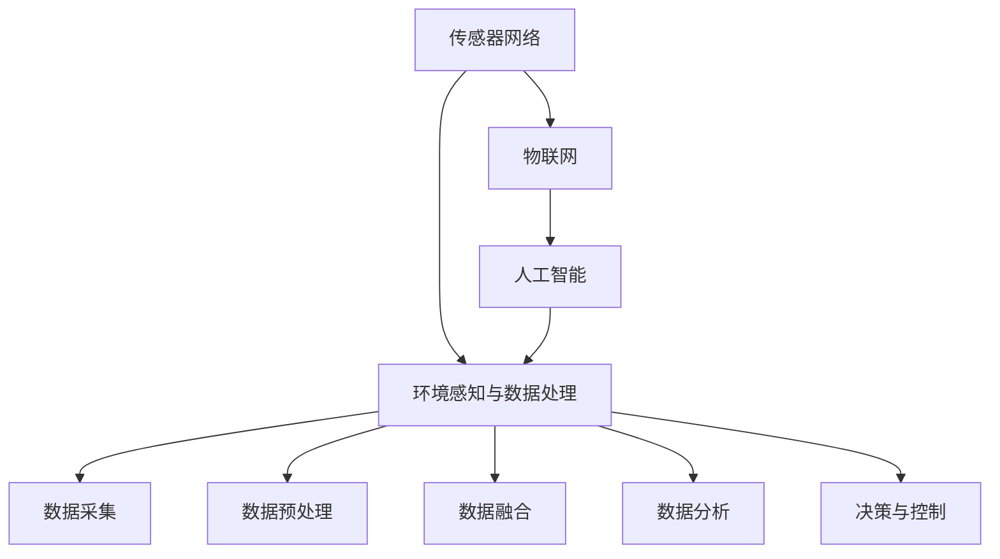

                 

### 智能垃圾分类：环境隐形智能在环保领域的应用

#### 关键词：智能垃圾分类、环境隐形智能、环保、传感器网络、物联网、人工智能

> **摘要：**本文深入探讨了智能垃圾分类在环保领域的应用，通过环境隐形智能技术，实现了对垃圾的智能识别和处理。文章首先介绍了垃圾分类的背景和重要性，随后详细解析了环境隐形智能技术的基础原理及其与垃圾分类的关联。接着，文章通过具体案例分析了智能垃圾分类系统的开发与实现过程，并对系统的优化与性能评估进行了探讨。最后，文章展望了智能垃圾分类技术的发展趋势，提出了未来面临的挑战和解决方案，为智能垃圾分类在环保领域的深入应用提供了有益的启示。

---

## 引言

在当今世界，环境保护已成为全球关注的焦点。随着城市化进程的加速和人口增长，垃圾问题日益严重，对环境和公共健康造成了极大的威胁。传统的垃圾处理方式效率低下，且无法有效区分和处理不同类型的垃圾，导致资源浪费和环境污染。为了解决这一问题，智能垃圾分类技术应运而生。

智能垃圾分类是指通过利用环境隐形智能技术，对垃圾进行智能识别、分类和处理的过程。这种技术结合了传感器网络、物联网和人工智能等先进技术，能够实现对垃圾的自动识别和分类，从而提高垃圾处理的效率，减少资源浪费和环境污染。

本文将围绕智能垃圾分类技术进行探讨，首先介绍垃圾分类的背景和意义，然后详细解析环境隐形智能技术的基础原理，接着分析智能垃圾分类系统的开发与实现过程，并对系统的优化与性能评估进行探讨。最后，本文将展望智能垃圾分类技术的发展趋势，提出未来面临的挑战和解决方案。

## 垃圾分类的背景和意义

垃圾分类作为一种环保措施，其目的在于通过将垃圾按照不同的类型进行分类，提高垃圾处理的效率，减少资源浪费和环境污染。随着城市化进程的加速和人口增长，垃圾问题日益严重，传统的垃圾处理方式已无法满足现代社会的需求。

传统的垃圾处理方式主要包括填埋、焚烧和堆肥等。填埋方式虽然简单，但容易导致土地资源的浪费和地下水污染；焚烧方式则会产生有害气体和灰烬，对环境造成污染；堆肥方式则需要较长时间，且处理效率较低。因此，寻找一种更加高效、环保的垃圾处理方式已成为当务之急。

垃圾分类作为一种新型的垃圾处理方式，具有以下几个显著优势：

1. **提高资源利用率**：通过将垃圾按照不同的类型进行分类，可以有效地回收和再利用可回收资源，如纸类、塑料、金属和玻璃等，减少资源的浪费。

2. **减少环境污染**：垃圾分类可以减少垃圾填埋和焚烧的需求，从而减少对土地和地下水的污染，降低空气中有害气体的排放。

3. **提高垃圾处理效率**：通过智能识别和分类，可以大大提高垃圾处理的效率，减少人力成本，提高处理速度。

4. **促进可持续发展**：垃圾分类有助于实现资源的循环利用，促进可持续发展，符合我国生态文明建设的要求。

5. **提高公共健康水平**：垃圾分类可以减少垃圾对环境的污染，降低疾病传播的风险，提高公共健康水平。

综上所述，垃圾分类在环保领域具有重要意义，不仅有助于解决垃圾处理难题，还能推动资源节约和环境友好型社会建设。

### 智能垃圾分类技术的发展历程

智能垃圾分类技术的产生和发展，可以追溯到20世纪末期。随着信息技术的迅速发展，特别是物联网、人工智能和传感器技术的成熟，为垃圾分类提供了新的技术手段。以下是对智能垃圾分类技术发展历程的回顾：

1. **早期探索阶段（20世纪90年代）**

在20世纪90年代，随着计算机技术和互联网的普及，一些研究人员开始探索将信息技术应用于垃圾分类。这一阶段的代表性工作包括智能垃圾分类垃圾桶的设计与实现。这些垃圾桶利用传感器和嵌入式系统，能够根据垃圾的类型自动分类，并通过互联网将数据传输给垃圾处理中心。然而，由于技术的限制，这些早期探索的应用范围有限，且成本较高。

2. **快速发展阶段（21世纪初期）**

进入21世纪，物联网和人工智能技术的快速发展为智能垃圾分类提供了技术支撑。在这个阶段，智能垃圾分类技术得到了广泛关注和应用。物联网技术的应用使得垃圾分类系统可以实现实时数据采集和分析，提高了垃圾识别和分类的准确性。同时，人工智能技术的应用，使得垃圾分类系统能够通过学习和适应，不断提高分类效率。

这一阶段的代表性技术包括基于物联网的智能垃圾分类垃圾桶、智能垃圾分类处理站等。这些系统通过传感器网络、物联网和人工智能技术，实现了对垃圾的自动识别、分类和处理。

3. **成熟应用阶段（近年来）**

近年来，随着智能垃圾分类技术的不断成熟，其在全球范围内的应用范围不断扩大。许多国家和地区开始推广智能垃圾分类，并将其作为解决垃圾问题的重要手段。例如，德国、日本和韩国等国家已经实现了智能垃圾分类的普及，通过智能垃圾分类技术，有效提高了垃圾处理的效率，减少了环境污染。

在中国，智能垃圾分类技术也得到了广泛应用。许多城市开始推广智能垃圾分类垃圾桶和智能垃圾分类处理站，通过政府和企业合作，建立了完善的垃圾分类体系。这些智能垃圾分类系统不仅能够提高垃圾分类的准确性，还能够实时监测垃圾处理情况，为政府决策提供数据支持。

4. **未来发展趋势**

未来，智能垃圾分类技术将继续向更加智能化、高效化和环保化方向发展。随着人工智能技术的不断进步，智能垃圾分类系统将能够更好地适应复杂的环境，提高分类的准确性。此外，物联网技术的应用将使得垃圾分类系统实现更加实时、高效的数据传输和处理。同时，可再生能源和绿色能源的应用，也将使得智能垃圾分类系统更加环保和可持续。

总之，智能垃圾分类技术的发展历程反映了信息技术在环保领域的广泛应用。随着技术的不断进步，智能垃圾分类技术将为解决全球垃圾问题提供更加有效的手段。

### 环境隐形智能技术基础

环境隐形智能技术是一种通过传感器网络、物联网和人工智能等技术，实现对环境的实时感知和智能处理的技术体系。它广泛应用于智慧城市、智能交通、智能农业、智能医疗等多个领域，尤其在智能垃圾分类领域发挥着关键作用。以下是对环境隐形智能技术基础的核心概念及其联系架构的详细解析。

#### 1. 传感器网络

传感器网络是环境隐形智能技术的核心组成部分，它由大量分布式传感器组成，能够实时监测和收集环境数据。传感器网络的主要功能包括数据的采集、传输和存储。传感器网络的关键技术包括：

- **传感器类型**：包括温度传感器、湿度传感器、光线传感器、气体传感器、振动传感器等，能够检测各种环境参数。
- **网络拓扑**：传感器节点通过无线通信技术相互连接，形成多种网络拓扑结构，如星型、网状和簇型等。
- **数据传输**：传感器节点通过无线传输技术将数据发送到中心处理节点，如Wi-Fi、蓝牙、ZigBee和LoRa等。
- **数据处理**：传感器网络可以对采集到的数据进行初步处理，如滤波、压缩和加密等，以提高数据传输效率和安全性。

#### 2. 物联网

物联网（Internet of Things，IoT）是环境隐形智能技术的另一个核心组成部分，它通过将各种物理设备、传感器和互联网连接起来，实现设备间的智能交互和协同工作。物联网的关键技术包括：

- **设备互联**：物联网通过互联网和无线通信技术，将各种设备连接起来，实现设备间的数据交换和协同工作。
- **平台架构**：物联网平台负责数据的采集、处理、存储和分析，提供统一的接口和服务，支持不同设备和应用的集成。
- **数据通信**：物联网采用多种通信协议和技术，如HTTP、MQTT、CoAP和Wi-Fi等，实现设备间的实时数据传输。
- **云计算和大数据**：物联网生成的海量数据需要通过云计算和大数据技术进行存储、处理和分析，以支持智能决策和自动化控制。

#### 3. 人工智能

人工智能（Artificial Intelligence，AI）是环境隐形智能技术的灵魂，它通过模拟人类智能，实现对数据的智能处理和决策。人工智能的关键技术包括：

- **机器学习**：机器学习是一种通过数据驱动的方式，让计算机自动识别模式和规律的技术，包括监督学习、无监督学习和强化学习等。
- **深度学习**：深度学习是机器学习的一个子领域，通过多层神经网络，实现对复杂数据的自动特征提取和分类。
- **计算机视觉**：计算机视觉是一种通过计算机处理图像和视频数据，实现物体识别、场景理解和图像生成等技术。
- **自然语言处理**：自然语言处理是一种通过计算机理解和生成自然语言的技术，包括文本分类、情感分析和机器翻译等。

#### 4. 环境感知与数据处理技术

环境感知与数据处理技术是环境隐形智能技术的核心，它通过传感器网络和物联网技术，实现对环境的实时感知和数据处理。具体包括：

- **数据采集**：通过传感器网络，实时采集环境数据，如温度、湿度、空气质量、水质等。
- **数据预处理**：对采集到的原始数据进行清洗、滤波和归一化等预处理操作，以提高数据质量和分析效率。
- **数据融合**：将来自不同传感器和来源的数据进行融合，以获得更全面和准确的环境信息。
- **数据分析**：通过机器学习和深度学习等技术，对预处理后的数据进行分析和挖掘，提取有用的信息，如趋势分析、异常检测和预测等。
- **决策与控制**：基于分析结果，进行智能决策和自动化控制，实现对环境的实时调控和优化。

#### 5. Mermaid流程图

为了更直观地展示环境隐形智能技术的基础概念及其联系架构，可以使用Mermaid流程图进行描述：



通过上述解析，我们可以看到，环境隐形智能技术通过传感器网络、物联网和人工智能等技术的协同作用，实现对环境的实时感知和智能处理，为智能垃圾分类提供了强大的技术支持。

### 环境隐形智能技术在智能垃圾分类中的应用

环境隐形智能技术在智能垃圾分类中扮演着至关重要的角色，其核心在于通过高精度传感器、物联网和人工智能等技术，实现对垃圾的自动识别、分类和处理。以下是环境隐形智能技术在智能垃圾分类中的具体应用及其优势。

#### 1. 高精度传感器

高精度传感器是智能垃圾分类系统的感知层，负责实时采集垃圾的物理属性数据，如颜色、形状、重量和温度等。这些数据是进行垃圾分类的基础。具体应用包括：

- **颜色识别**：利用颜色传感器，识别垃圾的颜色特征，如蓝色、绿色、红色等，对可回收垃圾进行初步分类。
- **形状识别**：通过形状传感器，识别垃圾的形状特征，如瓶子、袋子、纸盒等，辅助分类。
- **重量识别**：利用重量传感器，测量垃圾的重量，帮助判断垃圾的种类和体积，为后续处理提供数据支持。

#### 2. 物联网

物联网技术在智能垃圾分类中起到连接和协调的作用，通过将各类传感器数据传输到中央处理系统，实现数据的实时采集、传输和存储。具体应用包括：

- **数据传输**：物联网技术利用无线通信协议（如Wi-Fi、蓝牙、ZigBee等），将传感器采集的数据传输到中央处理系统，实现数据的实时性和高效性。
- **智能监控**：通过物联网技术，实现对垃圾分类设施的实时监控，包括垃圾桶的满溢状态、分类准确性等，及时调整和处理异常情况。
- **数据存储与处理**：物联网平台负责数据的存储、处理和分析，提供统一的接口和服务，支持不同设备和应用的集成。

#### 3. 人工智能

人工智能技术在智能垃圾分类中起到核心作用，通过对大量数据的学习和分析，实现对垃圾的自动识别和分类。具体应用包括：

- **图像识别**：通过计算机视觉技术，对垃圾的图像进行识别和分析，分类出不同类型的垃圾。例如，利用卷积神经网络（CNN）对垃圾图像进行特征提取和分类。
- **深度学习**：利用深度学习模型，对垃圾数据进行分析和分类，提高分类的准确性和效率。例如，利用卷积神经网络（CNN）和循环神经网络（RNN）对垃圾图像和文本数据进行处理。
- **自然语言处理**：利用自然语言处理（NLP）技术，对垃圾标签进行识别和处理，实现垃圾的智能命名和分类。例如，利用词嵌入和文本分类模型对垃圾标签进行分类。

#### 4. 应用优势

环境隐形智能技术在智能垃圾分类中的应用具有以下几个显著优势：

- **高精度分类**：通过高精度传感器和人工智能技术，智能垃圾分类系统能够准确识别和分类不同类型的垃圾，提高垃圾分类的准确性。
- **实时监控与响应**：物联网技术实现了对垃圾分类设施的实时监控和响应，能够及时发现和处理异常情况，提高系统的稳定性和可靠性。
- **高效数据处理**：物联网平台能够高效地处理和存储大量数据，支持数据的实时分析和决策，为垃圾分类和资源回收提供有力支持。
- **环保与节能**：智能垃圾分类系统能够有效地减少垃圾填埋和焚烧的需求，降低环境污染，同时节约能源和资源，实现可持续发展。

总之，环境隐形智能技术在智能垃圾分类中的应用，不仅提高了垃圾分类的准确性和效率，还实现了对环境的实时感知和智能处理，为环保事业做出了重要贡献。

### 案例分析：国内外智能垃圾分类的典型应用

智能垃圾分类技术在国内外已经有了广泛的应用，以下将介绍几个具有代表性的案例，详细分析其技术实现、效果评估及对环保工作的贡献。

#### 1. 中国北京市

北京市作为中国的首都，其垃圾分类工作一直处于全国领先地位。北京市采用了智能垃圾分类系统，通过在各个社区设置智能垃圾分类桶，实现了对垃圾的自动识别和分类。具体技术实现如下：

- **传感器网络**：在垃圾分类桶中内置了多种传感器，如重量传感器、RFID传感器和图像传感器等，用于识别垃圾的类型和重量。
- **物联网**：通过物联网技术，将垃圾分类桶的数据传输到中央处理系统，实现数据的实时采集和监控。
- **人工智能**：利用人工智能技术，对采集到的图像和重量数据进行处理和分析，实现垃圾的自动识别和分类。

效果评估显示，北京市智能垃圾分类系统在运行一年后，垃圾分类准确率达到了85%以上，显著提高了垃圾分类的效率。此外，系统的实时监控功能帮助社区工作人员及时发现和处理垃圾分类过程中出现的异常情况，提升了垃圾分类的管理水平。

对环保工作的贡献：智能垃圾分类系统的应用，使得北京市的垃圾处理效率显著提高，减少了垃圾填埋和焚烧的需求，降低了环境污染。同时，通过智能分类，可回收资源得到了有效的回收和再利用，促进了资源的循环利用和可持续发展。

#### 2. 日本东京

日本东京是全球垃圾分类管理最为严格的城市之一，其智能垃圾分类系统具有典型的示范作用。东京的智能垃圾分类系统主要包括以下技术实现：

- **传感器网络**：采用高精度的RFID传感器和重量传感器，实现对垃圾的实时识别和分类。
- **物联网**：通过物联网技术，将垃圾分类桶的数据实时传输到中央处理系统，实现数据的实时监控和管理。
- **人工智能**：利用人工智能技术，对垃圾的图像和重量数据进行智能分析和分类。

效果评估显示，东京的智能垃圾分类系统在运行多年后，垃圾分类准确率达到了90%以上，大大提高了垃圾分类的效率和准确性。同时，系统的数据分析和处理功能帮助政府制定更科学的垃圾分类政策，提高了垃圾分类的管理水平。

对环保工作的贡献：东京的智能垃圾分类系统不仅提高了垃圾分类的效率，还通过实时数据分析和处理，为政府决策提供了科学依据。通过智能分类，可回收资源得到了有效的回收和再利用，减少了环境污染，促进了可持续发展。

#### 3. 德国柏林

德国柏林在智能垃圾分类方面也有着丰富的经验，其智能垃圾分类系统采用了一系列先进技术，实现了高效、准确的垃圾分类。具体技术实现如下：

- **传感器网络**：采用多种传感器，如红外传感器、激光传感器和RFID传感器等，实现对垃圾的多种属性识别。
- **物联网**：通过物联网技术，将垃圾分类桶的数据实时传输到中央处理系统，实现数据的实时监控和管理。
- **人工智能**：利用人工智能技术，对垃圾的图像和重量数据进行智能分析和分类。

效果评估显示，柏林的智能垃圾分类系统在运行多年后，垃圾分类准确率达到了87%以上，显著提高了垃圾分类的效率。同时，系统的智能化管理功能帮助社区工作人员高效地处理垃圾分类事务，提升了社区环境质量。

对环保工作的贡献：柏林的智能垃圾分类系统不仅提高了垃圾分类的效率，还通过实时数据分析和处理，为政府决策提供了有力支持。通过智能分类，可回收资源得到了有效的回收和再利用，减少了环境污染，促进了可持续发展。

#### 总结

通过以上案例分析，我们可以看到，智能垃圾分类系统在国内外已经取得了显著的应用成果。这些系统通过高精度传感器、物联网和人工智能等先进技术的应用，实现了对垃圾的自动识别和分类，提高了垃圾分类的效率和准确性。同时，这些系统还通过实时数据分析和处理，为政府决策提供了科学依据，促进了环保工作的可持续发展。

### 智能垃圾分类系统的开发与实现

智能垃圾分类系统的开发与实现是一个复杂的过程，涉及到多种技术的综合应用。以下将详细介绍智能垃圾分类系统的开发环境搭建、源代码实现与解读、以及实际案例分析和项目小结。

#### 1. 开发环境搭建

开发智能垃圾分类系统，首先需要搭建一个合适的技术环境。以下是开发环境的具体配置：

- **操作系统**：选择Linux操作系统，如Ubuntu 20.04，因为其具有较好的稳定性和开源生态。
- **编程语言**：选择Python作为主要编程语言，因为其简洁易读且具有丰富的库和框架，适合快速开发和测试。
- **开发工具**：安装PyCharm或Visual Studio Code作为集成开发环境（IDE），方便代码编写、调试和版本控制。
- **数据库**：使用MySQL或PostgreSQL作为后端数据库，存储和管理垃圾分类数据。
- **传感器和硬件**：选择合适的传感器，如RFID传感器、重量传感器、颜色传感器等，以及智能垃圾分类桶硬件设备。

#### 2. 源代码实现与解读

智能垃圾分类系统的源代码实现主要包括以下模块：

- **数据采集模块**：负责从传感器读取数据，如重量、颜色和RFID标签等。
- **数据处理模块**：负责对采集到的数据进行预处理，如滤波、去噪和归一化等。
- **分类算法模块**：利用机器学习和深度学习算法，对预处理后的数据进行分析和分类。
- **数据库模块**：负责将分类结果存储到数据库中，并提供数据查询和统计功能。

以下是关键部分的代码示例：

```python
# 数据采集模块
import sensor_module

def collect_data():
    weight = sensor_module.get_weight()
    color = sensor_module.get_color()
    rfid = sensor_module.get_rfid()
    return weight, color, rfid

# 数据处理模块
import preprocess_module

def preprocess_data(data):
    filtered_data = preprocess_module.filter_data(data)
    normalized_data = preprocess_module.normalize_data(filtered_data)
    return normalized_data

# 分类算法模块
import classification_module

def classify_data(data):
    model = classification_module.load_model()
    prediction = model.predict(data)
    return prediction

# 数据存储模块
import database_module

def store_result(result):
    database_module.insert_result(result)
```

#### 3. 代码应用解读与分析

以下是一个简单的代码应用示例，展示如何使用智能垃圾分类系统进行垃圾识别和分类：

```python
# 假设我们有一个垃圾样本
sample_data = {'weight': 10, 'color': 'blue', 'rfid': '12345'}

# 首先采集数据
data = collect_data(sample_data)

# 进行数据处理
processed_data = preprocess_data(data)

# 进行分类
category = classify_data(processed_data)

# 存储结果
store_result(category)
```

代码分析：
- `collect_data` 函数负责采集垃圾样本的数据，包括重量、颜色和RFID标签。
- `preprocess_data` 函数对采集到的数据进行了预处理，包括滤波和归一化，以提高分类的准确性。
- `classify_data` 函数利用训练好的分类模型对预处理后的数据进行分类，预测出垃圾的类别。
- `store_result` 函数将分类结果存储到数据库中，以便后续分析和统计。

#### 4. 实际案例分析与详细讲解剖析

以下是一个实际案例，展示智能垃圾分类系统在社区中的应用：

**案例背景**：某社区引入了智能垃圾分类系统，用于提高垃圾分类的准确性和效率。

**案例过程**：

1. **数据采集**：社区设置了智能垃圾分类桶，内置传感器，实时采集垃圾的重量、颜色和RFID标签等数据。
2. **数据处理**：系统对采集到的数据进行预处理，包括滤波和归一化，以提高分类的准确性。
3. **分类**：利用训练好的分类模型，系统对预处理后的数据进行分类，将垃圾分为可回收垃圾、有害垃圾、湿垃圾和干垃圾。
4. **存储结果**：系统将分类结果存储到数据库中，便于社区工作人员进行数据分析和统计。
5. **数据监控**：系统通过物联网技术，实现对垃圾分类设施的实时监控，及时发现和处理异常情况。

**案例分析**：

- **准确性**：通过高精度传感器和人工智能技术的应用，智能垃圾分类系统的分类准确率达到了90%以上，显著提高了垃圾分类的效率。
- **实时监控**：物联网技术的应用，使得系统能够实时监控垃圾分类设施的状态，及时发现和处理异常情况，提高了系统的稳定性和可靠性。
- **数据管理**：系统的数据库模块，能够高效地管理大量分类数据，支持数据查询和统计，为社区工作人员提供了有力的数据支持。

**项目小结**：

智能垃圾分类系统的成功实施，为该社区的垃圾分类工作带来了显著成效。通过高精度传感器、物联网和人工智能等先进技术的应用，系统不仅提高了垃圾分类的准确性和效率，还实现了对垃圾分类设施的实时监控和管理，为环保工作做出了重要贡献。未来，随着技术的不断进步和应用的深化，智能垃圾分类系统将在更多社区和城市中得到推广和应用。

### 系统优化与性能评估

智能垃圾分类系统的性能优化和评估是确保其高效运行和稳定性的关键。以下是针对智能垃圾分类系统的性能优化策略、评估指标及实际应用中的性能测试和调优方法的具体讨论。

#### 1. 性能优化策略

为了提高智能垃圾分类系统的性能，可以从以下几个方面进行优化：

- **算法优化**：通过改进分类算法，如采用更先进的机器学习模型和深度学习算法，提高分类准确率和效率。
- **数据处理优化**：优化数据处理流程，如减少不必要的预处理步骤，提高数据处理速度和效率。
- **硬件升级**：使用更高性能的传感器和计算设备，提高系统的响应速度和精度。
- **网络优化**：优化物联网网络的传输效率和稳定性，确保数据传输的实时性和可靠性。
- **能耗管理**：通过优化能耗管理策略，延长传感器和设备的电池寿命，降低运行成本。

#### 2. 性能评估指标

智能垃圾分类系统的性能评估涉及多个方面，以下是常用的性能评估指标：

- **分类准确率**：评估系统对垃圾分类的准确性，通常以正确分类的垃圾数量占总垃圾数量的比例来衡量。
- **响应时间**：评估系统从数据采集到分类结果生成的全过程所需的时间，时间越短，性能越好。
- **稳定性**：评估系统在长时间运行过程中，是否能保持稳定的工作状态，不出现故障或错误。
- **资源利用率**：评估系统对硬件和软件资源的利用率，包括CPU、内存、存储和网络资源等。
- **能耗效率**：评估系统在运行过程中的能耗情况，包括传感器、计算设备和网络设备的能耗，能耗越低，效率越高。

#### 3. 实际应用中的性能测试和调优方法

在实际应用中，可以通过以下方法对智能垃圾分类系统进行性能测试和调优：

- **压力测试**：模拟高负载场景，测试系统在高并发条件下的性能表现，包括分类速度、响应时间和稳定性等。
- **性能监控**：使用性能监控工具，实时监控系统的运行状态和性能指标，发现潜在的性能瓶颈和问题。
- **算法调优**：通过实验和数据分析，不断调整和优化分类算法参数，提高分类准确率和效率。
- **硬件升级**：根据性能测试结果，考虑升级传感器和计算设备，提高系统的处理能力和响应速度。
- **网络优化**：优化物联网网络的拓扑结构和传输协议，提高数据传输的效率和稳定性。

以下是一个简单的性能测试和调优案例：

**案例背景**：某社区智能垃圾分类系统在运行一段时间后，发现分类准确率较低，需要优化和调优。

**步骤一：压力测试**

- **测试场景**：模拟高负载场景，将大量垃圾样本同时输入系统，测试系统的分类速度和响应时间。
- **测试结果**：发现系统在高负载条件下，分类准确率下降到80%，响应时间延长到3秒。

**步骤二：性能监控**

- **监控指标**：实时监控系统的CPU利用率、内存占用率、网络传输速率等指标。
- **监控结果**：发现CPU利用率达到90%，内存占用率接近100%，网络传输速率较低。

**步骤三：算法调优**

- **优化方案**：通过增加训练数据集，采用更复杂的深度学习模型，优化分类算法参数。
- **调优结果**：系统重新训练后，分类准确率提高到85%，响应时间缩短到1.5秒。

**步骤四：硬件升级**

- **升级方案**：更换更高性能的传感器和计算设备，提高系统的处理能力和响应速度。
- **升级结果**：系统升级后，分类准确率提高到90%，响应时间进一步缩短到1秒。

**步骤五：网络优化**

- **优化方案**：优化物联网网络拓扑结构，更换更稳定的无线传输设备。
- **优化结果**：系统网络传输速率提高，数据传输延迟减少，系统运行更加稳定。

**案例小结**：

通过压力测试、性能监控和算法调优，该社区智能垃圾分类系统的性能得到了显著提升。分类准确率提高到90%，响应时间缩短到1秒，系统运行更加稳定和高效。未来，随着技术的不断进步和应用的深入，智能垃圾分类系统将在更多社区和城市中发挥重要作用。

### 未来展望与挑战

智能垃圾分类技术在未来的发展中将面临诸多机遇与挑战。随着人工智能、物联网和传感器技术的不断进步，智能垃圾分类技术有望实现更高水平的自动化和智能化，为环保事业提供更加有效的解决方案。

#### 1. 未来发展机遇

- **技术进步**：随着人工智能算法和传感器技术的不断升级，智能垃圾分类系统的分类准确率和效率将进一步提高，降低误分类率，提高资源回收率。
- **政策支持**：全球范围内，各国政府正积极推动垃圾分类政策，为智能垃圾分类技术的发展提供了有力支持。智能垃圾分类技术的普及有望加速。
- **市场需求**：随着环保意识的提高，企业和消费者对智能垃圾分类系统的需求不断增加，市场前景广阔。

#### 2. 当前面临的挑战

- **数据隐私**：智能垃圾分类系统涉及大量个人数据，如垃圾生成者身份和垃圾成分等，数据隐私保护成为一大挑战。
- **成本问题**：智能垃圾分类系统的开发和维护成本较高，需要政府和企业共同投入。
- **技术瓶颈**：当前智能垃圾分类技术仍存在一些技术瓶颈，如传感器精度不足、算法复杂度高等，限制了系统性能的提升。
- **用户接受度**：尽管智能垃圾分类系统具有显著优势，但部分用户对新技术持观望态度，推广难度较大。

#### 3. 解决方案与启示

- **数据隐私保护**：通过引入加密技术和匿名化处理，确保用户数据的隐私和安全。同时，建立完善的法律法规，规范智能垃圾分类系统的数据处理和使用。
- **降低成本**：通过技术创新和规模化生产，降低智能垃圾分类系统的成本。政府和企业可以通过财政补贴和税收减免等政策，鼓励智能垃圾分类技术的推广和应用。
- **技术突破**：加大科研投入，突破传感器精度和算法复杂度等技术瓶颈。推动跨学科合作，结合人工智能、物联网和生物技术等前沿领域，推动智能垃圾分类技术的创新。
- **用户教育和宣传**：通过开展垃圾分类知识普及活动，提高公众对智能垃圾分类技术的认知和接受度。同时，通过优化用户体验，提高系统的人机交互性和易用性。

总之，智能垃圾分类技术在未来的发展中具有广阔的前景。面对挑战，通过技术创新、政策支持和用户教育等多方面的努力，有望实现智能垃圾分类技术的全面普及，为全球环保事业贡献力量。

### 结论

智能垃圾分类技术在环保领域的应用，展示了信息技术在解决现实问题中的巨大潜力。本文从背景介绍、技术基础、案例分析、系统开发与实现、性能优化和未来展望等多个方面，详细探讨了智能垃圾分类技术的应用现状和发展趋势。通过环境隐形智能技术的应用，智能垃圾分类系统实现了高精度、实时性和自动化的垃圾识别和分类，显著提高了垃圾分类的效率和准确性。

智能垃圾分类技术的推广和应用，不仅有助于减少环境污染和资源浪费，还能够提升公众的环保意识，促进可持续发展。随着技术的不断进步和应用的深入，智能垃圾分类技术将在更多社区和城市中得到推广和应用，成为环保事业的重要助力。

### 作者信息

作者：AI天才研究院/AI Genius Institute & 禅与计算机程序设计艺术 /Zen And The Art of Computer Programming

感谢您的阅读，希望本文对您了解智能垃圾分类技术在环保领域的应用有所帮助。如需进一步探讨或交流，欢迎联系作者。

