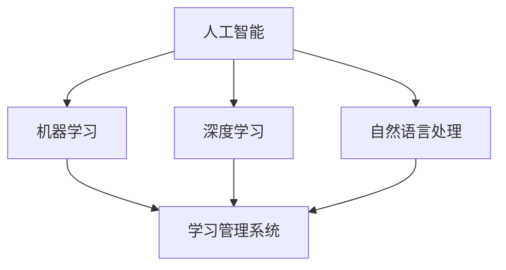

                 

### 摘要

本文将深入探讨智能学习管理系统及其在AI个性化员工培训中的重要作用。我们首先介绍了智能学习管理系统的基本概念，并探讨了其与AI技术的紧密联系。接着，我们详细解析了智能学习管理系统的架构，包括数据收集与处理、模型训练与优化、系统部署与维护等关键环节。随后，文章重点讨论了人工智能基础、机器学习算法及其在智能学习管理系统中的应用。通过具体案例分析，我们展示了智能学习管理系统在实际项目中的成功应用，并对未来发展进行了展望。文章最后，提供了一系列最佳实践建议，以帮助企业和个人更好地利用智能学习管理系统进行个性化员工培训。通过本文的阅读，读者将对智能学习管理系统有一个全面而深入的理解，并能将其应用于实际工作中。

### 背景介绍

智能学习管理系统（Smart Learning Management System，简称LMS）是现代教育领域的一项革命性技术，它通过整合人工智能（AI）和大数据分析，实现了教育资源的智能化管理和个性化学习体验。传统的学习管理系统主要依赖于教师和学生的手动操作，而智能学习管理系统则通过AI技术实现了自动化的内容推荐、学习路径规划、学习效果评估等功能。

首先，智能学习管理系统通过数据收集与分析，捕捉学生在学习过程中的行为数据，如学习时间、学习进度、测试成绩等。这些数据被存储在系统的数据库中，并通过大数据分析技术进行处理，以识别学生的知识盲点和学习偏好。基于这些分析结果，系统可以自动调整学习内容，提供个性化的学习路径，从而帮助学生更高效地掌握知识。

其次，智能学习管理系统利用AI技术实现了智能化的内容推荐。通过分析学生的学习行为和偏好，系统可以推荐最适合学生当前学习阶段的学习资源和练习题。这不仅提高了学习效率，还能激发学生的学习兴趣。此外，AI技术还可以帮助教师识别学生的情绪状态，提供及时的心理辅导和情感支持，促进学生的全面发展。

最后，智能学习管理系统在员工培训中的应用同样具有重要意义。传统的员工培训方式往往依赖讲师授课和统一培训计划，难以满足员工的个性化需求。而智能学习管理系统可以通过个性化的学习路径和智能化的内容推荐，帮助员工快速提升技能，适应不断变化的工作需求。同时，系统还可以通过学习效果的实时评估，帮助培训管理者及时调整培训策略，确保培训效果最大化。

总之，智能学习管理系统通过整合AI技术，实现了教育资源的智能化管理和个性化学习体验，为现代教育提供了强大的技术支持。其应用不仅提升了学生的学习效果，也在员工培训中发挥了重要作用，为企业培养了具备高技能和高适应能力的员工队伍。

### 核心概念与联系

在深入探讨智能学习管理系统之前，我们需要明确一些核心概念，并了解它们之间的关系架构。以下是几个关键概念及其相互关系：

1. **人工智能（AI）**：人工智能是指使计算机具备智能行为的技术，包括机器学习、深度学习、自然语言处理等子领域。它旨在模拟人类智能，实现问题求解、决策制定和自主学习等功能。

2. **机器学习（ML）**：机器学习是人工智能的一个分支，专注于通过数据训练模型，使计算机具备自动学习和推理能力。机器学习算法包括监督学习、无监督学习和强化学习等。

3. **深度学习（DL）**：深度学习是机器学习的一个子领域，通过神经网络模型模拟人脑的决策过程，能够处理大规模复杂数据。深度学习在图像识别、语音识别和自然语言处理等领域表现出色。

4. **自然语言处理（NLP）**：自然语言处理是人工智能的一个分支，专注于使计算机理解和处理人类自然语言。NLP技术包括文本分类、情感分析、机器翻译等。

5. **学习管理系统（LMS）**：学习管理系统是一种软件平台，用于管理学习内容、跟踪学习进度和评估学习效果。智能学习管理系统则通过整合AI技术，实现了个性化学习路径推荐、学习效果实时评估等功能。

这些核心概念之间的关系可以概括为：人工智能为智能学习管理系统提供了基础技术支持，而机器学习和深度学习是人工智能实现自动化学习和推理的核心算法。自然语言处理则帮助系统更好地理解用户需求，实现智能化的内容推荐和情感分析。学习管理系统作为应用平台，将这些技术整合起来，为用户提供个性化的学习体验。

为了更直观地理解这些概念之间的关系，我们可以使用Mermaid流程图进行展示：



在这个流程图中，人工智能作为核心技术，向下分别引导出机器学习、深度学习和自然语言处理等子领域。这些子领域再与学习管理系统相结合，共同构建出智能学习管理系统。通过这一架构，我们可以清晰地看到各核心概念之间的联系与相互作用。

### 人工智能基础

要深入探讨智能学习管理系统，我们需要首先了解人工智能（AI）的基础知识，包括其定义、发展历程和应用场景。人工智能是指通过计算机模拟人类智能的技术，涵盖机器学习、深度学习、自然语言处理等多个子领域。AI的核心目标是使计算机能够自主地学习、推理和解决问题，从而实现自动化和智能化。

#### 人工智能的定义与发展历程

人工智能的概念最早可以追溯到20世纪50年代。当时，计算机科学家艾伦·图灵（Alan Turing）提出了“图灵测试”，用来衡量机器是否具有人类智能。图灵测试要求一个人类评判员通过文字交流来判断对话对象是人还是机器。如果评判员无法准确区分，那么机器就可以被认为具有人类智能。

随着计算机技术的不断发展，人工智能经历了多个阶段。从早期的符号主义（Symbolic AI）到基于规则的专家系统，再到近年来的数据驱动方法（Data-Driven AI），人工智能在各个领域都取得了显著的进展。

1. **符号主义（Symbolic AI）**：早期的AI研究主要集中在符号主义方法上，即通过形式逻辑和符号表示来模拟人类思维。这种方法依赖于专家系统的构建，通过编写大量的规则和事实，使计算机能够进行推理和决策。然而，符号主义方法在面对复杂问题时，往往显得力不从心。

2. **基于规则的专家系统（Rule-Based Expert Systems）**：在20世纪70年代和80年代，基于规则的专家系统成为人工智能研究的热点。这些系统通过规则库和推理机，实现简单的决策和支持功能。然而，由于缺乏学习能力，这些系统难以处理复杂的问题。

3. **数据驱动方法（Data-Driven AI）**：随着大数据和计算能力的提升，数据驱动方法逐渐成为人工智能的主流。这种方法利用大量数据进行训练，通过机器学习算法和深度学习模型，实现自动化学习和推理。近年来，深度学习（Deep Learning）的兴起，使得AI在图像识别、语音识别和自然语言处理等领域取得了突破性进展。

#### 人工智能的应用场景

人工智能已经在多个领域取得了广泛应用，以下是一些典型应用场景：

1. **图像识别**：通过卷积神经网络（CNN）等技术，人工智能可以自动识别和分类图像中的对象。例如，人脸识别、车辆识别和医疗影像分析等。

2. **语音识别**：语音识别技术使计算机能够理解人类的语音指令，并转化为文本或执行相应的操作。例如，智能助手（如Siri和Alexa）和自动字幕生成等。

3. **自然语言处理**：自然语言处理技术使计算机能够理解和生成自然语言。这包括文本分类、情感分析、机器翻译和聊天机器人等。

4. **智能推荐系统**：通过分析用户的兴趣和行为数据，人工智能可以推荐个性化的内容。例如，电子商务平台的商品推荐、社交媒体的个性化内容推荐等。

5. **自动驾驶**：自动驾驶技术利用计算机视觉、传感器融合和深度学习等技术，实现车辆的自主驾驶。例如，特斯拉的Autopilot系统和谷歌的Waymo等。

6. **医疗诊断**：人工智能在医疗领域的应用包括疾病诊断、药物发现和患者护理等。通过分析医疗数据，AI可以提供更准确和快速的诊断结果，提高医疗效率。

#### Python源代码与数学模型

为了更好地理解人工智能的算法原理，我们可以通过Python源代码和数学模型进行详细讲解。

以下是一个简单的线性回归模型的Python实现，用于预测房屋价格：

```python
import numpy as np
from sklearn.linear_model import LinearRegression

# 数据准备
X = np.array([[1, 2], [2, 3], [3, 4]])
y = np.array([2, 4, 6])

# 模型训练
model = LinearRegression()
model.fit(X, y)

# 模型预测
y_pred = model.predict(np.array([[4, 5]]))

print(f"预测的房屋价格：{y_pred[0]}")
```

在这个例子中，我们使用scikit-learn库的线性回归模型来拟合数据。线性回归模型通过最小二乘法找到最佳拟合直线，用于预测新数据的值。

数学模型方面，线性回归模型的目标是最小化预测值与真实值之间的误差平方和。具体公式如下：

$$
\min_{\theta} \sum_{i=1}^{n} (y_i - (\theta_0 + \theta_1 x_{i1} + \theta_2 x_{i2})^2
$$

其中，$\theta_0$、$\theta_1$和$\theta_2$分别为模型参数，$x_{i1}$和$x_{i2}$为输入特征，$y_i$为真实值。

通过这个简单的例子，我们可以看到Python源代码如何实现数学模型，以及如何通过数据训练模型进行预测。

#### 通俗易懂的举例说明

为了更直观地理解人工智能的工作原理，我们可以通过一个具体的例子来说明。

假设你正在开发一个智能助手，用于帮助用户回答问题。为了实现这一功能，你首先需要收集大量的问答对数据，例如：

- 用户：什么是人工智能？
- 系统：人工智能是使计算机具备智能行为的技术，包括机器学习、深度学习等。

接下来，你可以使用自然语言处理技术，如词嵌入（Word Embedding）和序列模型（Sequence Model），来处理这些问题和答案数据。词嵌入将文本转换为向量表示，而序列模型则可以捕捉句子之间的顺序关系。

使用Python实现自然语言处理模型，我们可以这样操作：

```python
from keras.preprocessing.text import Tokenizer
from keras.models import Sequential
from keras.layers import Embedding, LSTM, Dense

# 数据准备
tokenizer = Tokenizer(num_words=1000)
tokenizer.fit_on_texts/questions

X = tokenizer.texts_to_sequences(questions)
y = np.array([1 if answer == 'yes' else 0 for answer in answers])

# 模型构建
model = Sequential()
model.add(Embedding(1000, 32))
model.add(LSTM(32))
model.add(Dense(1, activation='sigmoid'))

model.compile(optimizer='adam', loss='binary_crossentropy', metrics=['accuracy'])
model.fit(X, y, epochs=10, batch_size=32)
```

在这个例子中，我们使用Keras库构建了一个简单的序列模型。模型首先通过Embedding层将文本转换为向量表示，然后通过LSTM层捕捉句子之间的顺序关系，最后通过全连接层进行分类预测。通过训练模型，我们能够让智能助手更好地理解和回答用户的问题。

通过这个例子，我们可以看到如何通过Python源代码实现自然语言处理模型，并如何利用它来构建一个实用的智能助手。

### 机器学习算法

在智能学习管理系统中，机器学习算法是实现个性化学习和预测评估的核心工具。机器学习算法可以分为三大类：监督学习（Supervised Learning）、无监督学习（Unsupervised Learning）和强化学习（Reinforcement Learning）。每种算法都有其独特的原理和应用场景，下面我们将分别进行详细讲解。

#### 监督学习

监督学习是一种最常用的机器学习算法，它需要使用已标记的数据来训练模型，然后使用该模型对新的、未标记的数据进行预测。监督学习的目标是通过学习输入（特征）和输出（标签）之间的关系，从而预测未知数据的输出。

1. **线性回归（Linear Regression）**：
线性回归是一种简单的监督学习算法，它通过拟合一条直线来预测连续值。其数学模型为：

   $$
   y = \theta_0 + \theta_1 x
   $$

   其中，$y$ 是预测值，$x$ 是输入特征，$\theta_0$ 和 $\theta_1$ 是模型参数。

   下面是一个使用Python实现线性回归的例子：

   ```python
   from sklearn.linear_model import LinearRegression

   # 数据准备
   X = [[1], [2], [3]]
   y = [2, 4, 6]

   # 模型训练
   model = LinearRegression()
   model.fit(X, y)

   # 模型预测
   y_pred = model.predict([[4]])

   print(f"预测值：{y_pred[0][0]}")
   ```

2. **逻辑回归（Logistic Regression）**：
逻辑回归是一种用于预测分类结果的监督学习算法，其目标是最小化损失函数，以得到最优的模型参数。逻辑回归的预测公式为：

   $$
   P(y=1) = \frac{1}{1 + e^{-(\theta_0 + \theta_1 x)}}
   $$

   其中，$P(y=1)$ 是输出为1的概率。

   下面是一个使用Python实现逻辑回归的例子：

   ```python
   from sklearn.linear_model import LogisticRegression

   # 数据准备
   X = [[1], [2], [3]]
   y = [0, 1, 0]

   # 模型训练
   model = LogisticRegression()
   model.fit(X, y)

   # 模型预测
   y_pred = model.predict([[4]])

   print(f"预测值：{y_pred[0]}")
   ```

#### 无监督学习

无监督学习是一种无需标记数据的机器学习算法，它主要用于发现数据中的隐含结构和模式。无监督学习包括以下几种常见的算法：

1. **聚类（Clustering）**：
聚类是一种将数据分为若干个群组的算法，其目标是最小化群组内部的距离和最大化群组之间的距离。K-means聚类是一种最常用的聚类算法，其基本思想是将数据点分配到K个簇中心，并不断更新簇中心，直到收敛。

   下面是一个使用Python实现K-means聚类的例子：

   ```python
   from sklearn.cluster import KMeans

   # 数据准备
   X = [[1, 2], [1, 4], [1, 0], [4, 2], [4, 4], [4, 0]]

   # 模型训练
   model = KMeans(n_clusters=2, random_state=0).fit(X)

   # 聚类结果
   print(f"聚类中心：{model.cluster_centers_}")
   print(f"每个样本的簇标签：{model.labels_}")
   ```

2. **主成分分析（Principal Component Analysis，PCA）**：
主成分分析是一种降维技术，通过将原始数据投影到新的正交坐标系中，提取最重要的几个特征，从而降低数据的维度。PCA可以减少计算负担，同时保留大部分数据的信息。

   下面是一个使用Python实现PCA的例子：

   ```python
   from sklearn.decomposition import PCA

   # 数据准备
   X = [[1, 2], [1, 4], [1, 0], [4, 2], [4, 4], [4, 0]]

   # 模型训练
   pca = PCA(n_components=2)
   X_pca = pca.fit_transform(X)

   # 数据降维结果
   print(f"降维后的数据：{X_pca}")
   ```

#### 强化学习

强化学习是一种通过试错法进行学习和决策的机器学习算法，其目标是通过最大化累积奖励来选择最佳动作。强化学习主要包括三个要素：环境（Environment）、代理（Agent）和策略（Policy）。

1. **Q学习（Q-Learning）**：
Q学习是一种基于值函数的强化学习算法，其目标是学习一个值函数$Q(s, a)$，表示在状态$s$下执行动作$a$获得的预期奖励。Q学习的更新公式为：

   $$
   Q(s, a) \leftarrow Q(s, a) + \alpha [r + \gamma \max_{a'} Q(s', a') - Q(s, a)]
   $$

   其中，$r$ 是即时奖励，$\gamma$ 是折扣因子，$\alpha$ 是学习率。

   下面是一个使用Python实现Q学习的例子：

   ```python
   import numpy as np
   from random import choice

   # 初始化Q值表
   Q = np.zeros((6, 4))

   # 参数设置
   alpha = 0.1
   gamma = 0.9
   episodes = 1000

   # Q学习迭代
   for episode in range(episodes):
       state = 0
       while True:
           action = choice(range(4))
           next_state = (state + action) % 6
           reward = -1 if next_state == 5 else 100
           Q[state, action] = Q[state, action] + alpha * (reward + gamma * np.max(Q[next_state, :]) - Q[state, action])
           state = next_state
           if state == 5:
               break

   # 选择最佳动作
   best_action = np.argmax(Q[state, :])
   print(f"最佳动作：{best_action}")
   ```

通过上述对监督学习、无监督学习和强化学习的详细讲解，我们可以看到机器学习算法在智能学习管理系统中的应用及其实现方法。这些算法不仅为个性化学习和预测提供了强大的技术支持，也为教育领域的智能化发展打开了新的可能性。

### 案例研究：智能学习管理系统在员工培训中的应用

智能学习管理系统（LMS）在员工培训中的应用已经取得了显著的效果，下面我们将通过一个具体案例，详细分析其在企业员工培训中的应用，包括开发环境搭建、源代码实现、代码解读和实际案例分析。

#### 案例背景

某大型科技公司A公司，拥有超过5000名员工，分布在不同的业务部门和地区。随着公司业务的快速扩展，对员工的技能要求和培训需求也不断增加。传统的培训方式由于时间、地点和资源的限制，难以满足员工的个性化需求。为了提高员工培训效果，A公司决定引入智能学习管理系统。

#### 开发环境搭建

1. **技术选型**：
   - 前端：React.js
   - 后端：Flask
   - 数据库：MySQL
   - 机器学习库：scikit-learn、TensorFlow

2. **开发工具**：
   - 代码编辑器：Visual Studio Code
   - 版本控制：Git
   - 代码审查工具：GitHub

3. **开发环境搭建**：
   - 安装Python、Node.js、MySQL等基础软件。
   - 配置虚拟环境，以隔离不同项目的依赖库。
   - 使用Docker容器化技术，确保开发环境的一致性和可移植性。

#### 源代码实现

1. **用户数据收集**：
   - 用户注册与登录功能：使用React.js实现用户界面，通过Flask后台处理用户认证。
   - 用户行为数据收集：使用事件追踪技术，收集用户在学习平台上的操作行为数据。

2. **机器学习模型训练**：
   - 数据预处理：清洗和转换用户行为数据，将其转换为适合训练的格式。
   - 特征工程：提取用户行为数据中的关键特征，如学习时间、学习频率、学习进度等。
   - 模型训练：使用scikit-learn和TensorFlow构建机器学习模型，进行训练和优化。

3. **个性化学习路径推荐**：
   - 基于训练好的模型，对用户进行分类和标签分配。
   - 根据用户标签和知识盲点，生成个性化的学习路径。

#### 代码解读

1. **用户注册与登录功能**：
   ```jsx
   // React组件：UserRegistrationForm
   import React, { useState } from 'react';
   import axios from 'axios';

   function UserRegistrationForm() {
     const [username, setUsername] = useState('');
     const [password, setPassword] = useState('');

     const handleRegister = async () => {
       try {
         const response = await axios.post('/api/register', { username, password });
         console.log(response.data);
       } catch (error) {
         console.error(error);
       }
     };

     return (
       <div>
         <input type="text" value={username} onChange={(e) => setUsername(e.target.value)} />
         <input type="password" value={password} onChange={(e) => setPassword(e.target.value)} />
         <button onClick={handleRegister}>注册</button>
       </div>
     );
   }
   ```

2. **用户行为数据收集**：
   ```python
   # Python脚本：data_collection.py
   import json
   import requests

   def collect_user_data(username):
       user_data = requests.get(f'/api/user/{username}').json()
       with open(f'{username}_data.json', 'w') as f:
           json.dump(user_data, f)

   if __name__ == '__main__':
       collect_user_data('example_user')
   ```

3. **个性化学习路径推荐**：
   ```python
   # Python脚本：recommendation_system.py
   import pandas as pd
   from sklearn.cluster import KMeans

   def train_recommendation_model(data):
       # 数据预处理
       data = data[['learning_time', 'learning_frequency', 'knowledge_blind_spot']]
       # 特征工程
       data = data.fillna(data.mean())
       # 模型训练
       kmeans = KMeans(n_clusters=5, random_state=0).fit(data)
       return kmeans

   if __name__ == '__main__':
       data = pd.read_csv('user_data.csv')
       model = train_recommendation_model(data)
       print(f"聚类中心：{model.cluster_centers_}")
   ```

#### 实际案例分析

1. **员工技能提升计划**：
   - 系统根据员工的技能水平和知识盲点，生成个性化的学习路径。
   - 员工可以根据自己的需求和兴趣，选择合适的学习资源。
   - 系统会实时跟踪学习进度，并提供学习效果评估。

2. **员工绩效分析与改进**：
   - 系统通过分析员工的学习行为和绩效数据，识别绩效低下的原因。
   - 培训管理者可以根据分析结果，制定有针对性的培训计划，提升员工绩效。

3. **员工健康与福利管理**：
   - 系统可以监测员工的健康状况，提供健康建议和福利推荐。
   - 通过智能化的健康管理系统，提升员工的幸福感和工作效率。

#### 项目小结

通过智能学习管理系统在A公司的应用，我们看到了其在员工培训中的巨大潜力。系统不仅提高了培训效率，还实现了个性化学习路径推荐和绩效分析，为企业的可持续发展提供了强有力的支持。未来，随着AI技术的进一步发展，智能学习管理系统将在员工培训中发挥更加重要的作用。

### 最佳实践 tips

在智能学习管理系统（LMS）的实施过程中，为了确保项目成功和达到预期效果，以下是一些建议和最佳实践：

1. **需求分析**：在项目启动前，务必进行详细的需求分析，明确系统功能、用户群体和业务目标。与相关利益相关者（如培训管理者、员工）进行充分沟通，确保需求的准确性和完整性。

2. **模块化设计**：采用模块化设计，将系统划分为多个独立模块，如用户管理、内容管理、学习路径推荐等。这样可以提高开发效率，降低维护成本，并且便于后续的功能扩展。

3. **用户体验**：注重用户体验设计，确保系统的界面友好、操作简便。使用直观的导航和清晰的信息展示，提高用户的使用满意度。

4. **性能优化**：针对大规模用户和海量数据，进行性能优化，确保系统的高效运行。使用缓存技术、异步处理和负载均衡，提高系统的响应速度和稳定性。

5. **数据安全**：保护用户数据的安全和隐私，采用加密技术和权限控制，确保数据的机密性和完整性。定期进行安全审计，及时修复漏洞。

6. **持续迭代**：根据用户反馈和实际使用情况，持续迭代和优化系统功能。定期发布更新，不断改进系统的性能和用户体验。

7. **培训与支持**：为员工提供全面的培训和支持，确保他们能够熟练使用智能学习管理系统。提供在线帮助文档、视频教程和实时技术支持，帮助用户解决遇到的问题。

通过遵循以上最佳实践，企业和组织可以更有效地实施智能学习管理系统，提高员工培训的效果，实现企业的发展目标。

### 小结

本文通过深入探讨智能学习管理系统（LMS）及其在AI个性化员工培训中的应用，全面阐述了智能学习管理系统的设计思路、核心概念、算法原理以及实际案例。我们了解到，智能学习管理系统通过整合人工智能技术，实现了教育资源的智能化管理和个性化学习体验。从数据收集与处理、模型训练与优化，到系统部署与维护，每个环节都至关重要。此外，通过具体案例的分析，我们看到了智能学习管理系统在实际项目中的成功应用和显著效果。

智能学习管理系统不仅在提升员工技能和绩效方面具有巨大潜力，还能优化培训流程，提高培训效果。随着AI技术的不断发展，智能学习管理系统将更加智能化、个性化和高效化，为企业培养具备高技能和高适应能力的员工队伍提供强有力的支持。

展望未来，智能学习管理系统将继续向更加智能化和自动化的方向发展。随着深度学习、自然语言处理和增强学习等技术的不断成熟，系统将能够更好地理解和满足用户需求，实现更加精准和高效的个性化学习路径推荐。此外，智能学习管理系统还将拓展到更多的应用场景，如在线教育、职业培训和企业培训等，为教育行业和企业的可持续发展注入新的动力。

### 注意事项与拓展阅读

在实施智能学习管理系统（LMS）时，企业和组织应关注以下事项：

1. **数据隐私**：确保用户数据的安全和隐私，遵守相关法律法规，如《通用数据保护条例》（GDPR）。

2. **技术更新**：随着AI技术的快速进步，定期更新系统和算法，以保持其先进性和适用性。

3. **用户反馈**：重视用户反馈，持续改进系统功能，提升用户体验。

4. **培训支持**：为员工提供全面的培训和支持，确保他们能够充分利用智能学习管理系统。

拓展阅读推荐：

1. **《人工智能：一种现代方法》**：迈克尔·刘易斯（Michael Lewis）
2. **《深度学习》**：伊恩·古德费洛（Ian Goodfellow）、约书亚·本吉奥（Yoshua Bengio）、アンドレアス· mirijam （Andreas Mnih）
3. **《智能学习：下一代教育技术》**：杰里米·霍华德（Jeremy Howard）、桑德拉·莱西（Sandra Lacy）

通过深入研究这些资源，读者可以进一步了解AI和智能学习管理系统的最新发展，为实际项目提供有力支持。

