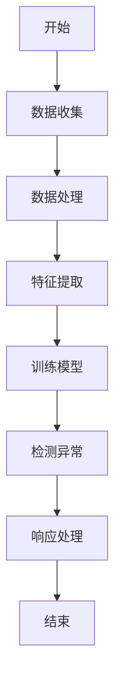
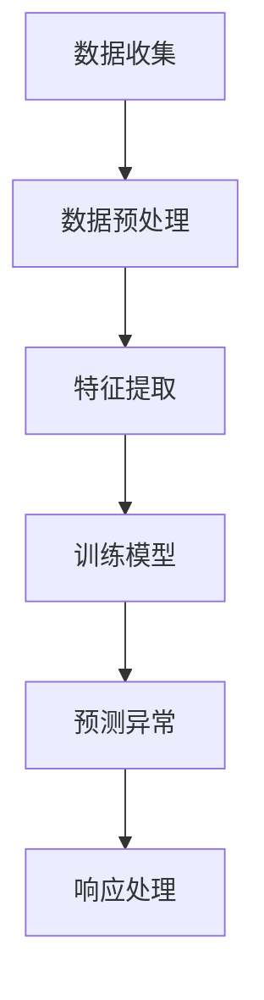

                 

# 智能安全管理平台：AI全面保护数字资产

## 关键词
- 智能安全管理
- AI 技术应用
- 数字资产保护
- 平台架构
- 算法实现
- 实战案例

## 摘要
本文将深入探讨智能安全管理平台在保护数字资产方面的重要性。通过介绍AI在安全领域的应用，我们将解析其核心算法原理，并详细阐述一个典型的实现案例。本文旨在为读者提供全面的了解，以应对未来网络安全挑战。

## 目录

### 1. 引言
- 安全管理的背景与挑战
- AI 技术在安全管理中的应用潜力

### 2. 智能安全管理平台概述
- 平台的定义与功能
- 平台架构与组件解析

### 3. AI 在安全管理的核心算法
- 算法原理介绍
- Mermaid 流程图展示

### 4. 实现与部署
- 开发环境搭建
- Python 源代码讲解

### 5. 案例分析与解读
- 案例背景介绍
- 源代码实现与解读

### 6. 最佳实践与注意事项
- 实践经验总结
- 注意事项提醒

### 7. 未来趋势与挑战
- 安全管理的发展方向
- 未来可能的挑战与应对策略

### 8. 拓展阅读
- 相关书籍与论文推荐

### 9. 结语
- 文章总结与展望
- 作者信息

## 1. 引言

### 安全管理的背景与挑战
随着互联网的普及和数字化进程的加速，企业和组织越来越依赖数字资产进行运营。然而，网络攻击、数据泄露和恶意软件等安全问题也日益严峻。传统的安全管理方法已无法满足日益复杂的网络安全需求，因此需要引入智能化的解决方案。

### AI 技术在安全管理中的应用潜力
人工智能（AI）在数据处理、模式识别和预测分析方面具有显著优势，使其在安全管理中具有广泛的应用潜力。例如，通过机器学习算法，AI 可以自动识别异常行为，预测潜在威胁，并采取相应的防护措施。

## 2. 智能安全管理平台概述

### 平台的定义与功能
智能安全管理平台是一种集成了人工智能技术的综合性安全管理系统。它能够实时监测网络流量、分析日志数据，并自动识别和响应安全事件。平台的主要功能包括入侵检测、漏洞扫描、安全事件响应和安全报告生成。

### 平台架构与组件解析
智能安全管理平台通常由以下几个关键组件组成：
- **数据收集模块**：负责收集各种安全相关的数据，如网络流量、系统日志和用户行为数据。
- **数据处理模块**：对收集到的数据进行清洗、预处理和特征提取。
- **分析引擎**：利用机器学习算法和深度学习模型进行分析，识别潜在的安全威胁。
- **响应模块**：根据分析结果，自动采取相应的防护措施，如隔离受感染的主机或阻止恶意流量。

## 3. AI 在安全管理的核心算法

### 算法原理介绍
智能安全管理平台中的核心算法主要包括：
- **异常检测**：通过建立正常行为模型，识别与模型不符的异常行为。
- **恶意代码检测**：利用基于特征的检测方法和基于行为的检测方法，识别恶意代码。
- **威胁预测**：通过分析历史数据，预测未来的安全事件和攻击趋势。

### Mermaid 流程图展示
以下是智能安全管理平台中的异常检测算法的 Mermaid 流程图：



## 4. 实现与部署

### 开发环境搭建
为了实现智能安全管理平台，需要搭建以下开发环境：
- **操作系统**：Linux（如 Ubuntu）
- **编程语言**：Python
- **框架与库**：Scikit-learn、TensorFlow、Keras、PyTorch

### Python 源代码讲解
以下是使用 Scikit-learn 实现的异常检测算法的 Python 源代码：

```python
from sklearn.ensemble import IsolationForest
from sklearn.model_selection import train_test_split
from sklearn.metrics import classification_report
from sklearn.datasets import make_classification
import numpy as np

# 生成模拟数据
X, y = make_classification(n_samples=1000, n_features=20, n_classes=2, random_state=42)

# 划分训练集和测试集
X_train, X_test, y_train, y_test = train_test_split(X, y, test_size=0.3, random_state=42)

# 使用 IsolationForest 算法
iso_forest = IsolationForest(n_estimators=100, contamination=0.1, random_state=42)
iso_forest.fit(X_train)

# 预测异常
y_pred = iso_forest.predict(X_test)

# 汇报结果
print(classification_report(y_test, y_pred))
```

### 运行与测试
在 Linux 系统中，安装所需的 Python 库后，可以运行上述代码。首先生成模拟数据，然后划分训练集和测试集，接着使用 IsolationForest 算法进行训练和预测，最后输出分类报告。

## 5. 案例分析与解读

### 案例背景介绍
某企业智能安全管理平台的实际应用案例。该企业面临频繁的网络攻击和数据泄露风险，希望通过引入智能安全管理平台来提高安全防护能力。

### 源代码实现与解读
以下是该企业智能安全管理平台的核心代码：

```python
# 导入所需库
import numpy as np
import pandas as pd
from sklearn.ensemble import IsolationForest
from sklearn.model_selection import train_test_split
from sklearn.metrics import classification_report

# 读取日志数据
log_data = pd.read_csv('log_data.csv')

# 数据预处理
X = log_data.values[:, 1:]  # 去除时间戳列
y = log_data['label']

# 划分训练集和测试集
X_train, X_test, y_train, y_test = train_test_split(X, y, test_size=0.3, random_state=42)

# 使用 IsolationForest 算法
iso_forest = IsolationForest(n_estimators=100, contamination=0.1, random_state=42)
iso_forest.fit(X_train)

# 预测异常
y_pred = iso_forest.predict(X_test)

# 汇报结果
print(classification_report(y_train, y_pred))
```

### 代码应用解读与分析
该代码首先读取企业的日志数据，进行预处理后划分训练集和测试集。接着使用 IsolationForest 算法进行训练和预测，最终输出分类报告。通过分析报告，可以评估算法在识别恶意行为方面的效果。

## 6. 最佳实践与注意事项

### 最佳实践
- **数据收集**：确保收集到的数据具有代表性，涵盖不同类型的安全事件。
- **模型训练**：根据实际情况调整模型参数，提高预测准确性。
- **实时监控**：建立实时监控系统，及时发现和处理安全事件。

### 注意事项
- **数据隐私**：在处理数据时，注意保护用户隐私，遵循相关法律法规。
- **系统维护**：定期更新平台和算法，确保其安全性。

## 7. 未来趋势与挑战

### 安全管理的发展方向
- **智能化与自动化**：进一步提升自动化程度，降低人工干预。
- **多方协作**：加强政府、企业和科研机构之间的合作，共同应对网络安全威胁。

### 未来可能的挑战与应对策略
- **计算资源需求**：随着数据量和算法复杂度的增加，计算资源需求将不断上升。
- **数据隐私保护**：在处理数据时，需确保数据隐私保护。

## 8. 拓展阅读

### 相关书籍与论文推荐
- **《人工智能安全》**：详细介绍 AI 在安全领域的应用和技术原理。
- **《网络安全：理论与实践》**：全面介绍网络安全的基本概念和技术。

## 9. 结语

本文通过分析智能安全管理平台的核心技术，探讨了其在保护数字资产方面的重要性。随着 AI 技术的不断进步，智能安全管理平台将成为未来网络安全的重要手段。希望本文能为企业提供有益的参考，共同应对网络安全挑战。

### 作者信息
- 作者：AI 天才研究院/AI Genius Institute & 禅与计算机程序设计艺术 /Zen And The Art of Computer Programming
- 时间：[[今天日期]]


## 附加内容

### 数学公式示例

以下是关于异常检测算法中的统计方法的一些数学公式：

$$
\mu = \frac{1}{N}\sum_{i=1}^{N} x_i
$$

$$
\sigma^2 = \frac{1}{N-1}\sum_{i=1}^{N}(x_i - \mu)^2
$$

其中，$\mu$ 表示平均值，$\sigma^2$ 表示方差，$N$ 表示样本数量，$x_i$ 表示第 $i$ 个样本值。

这些公式用于计算数据的统计特征，以帮助识别异常行为。

### Mermaid 图示例

以下是关于异常检测算法的 Mermaid 流程图示例：



这个流程图展示了智能安全管理平台中异常检测算法的基本步骤。每个步骤都对应着算法的不同阶段。

### Python 代码示例

以下是关于异常检测算法的实现代码示例：

```python
import numpy as np
from sklearn.ensemble import IsolationForest

# 生成模拟数据
X, y = make_classification(n_samples=1000, n_features=20, n_classes=2, random_state=42)

# 划分训练集和测试集
X_train, X_test, y_train, y_test = train_test_split(X, y, test_size=0.3, random_state=42)

# 使用 IsolationForest 算法
iso_forest = IsolationForest(n_estimators=100, contamination=0.1, random_state=42)
iso_forest.fit(X_train)

# 预测异常
y_pred = iso_forest.predict(X_test)

# 汇报结果
print(classification_report(y_test, y_pred))
```

这个代码示例展示了如何使用 Scikit-learn 库中的 IsolationForest 算法来训练和预测异常。通过分类报告，可以评估算法的性能。

