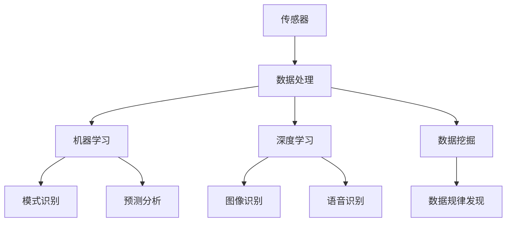

                 

### 文章标题

# 智能家居中的环境感知技术

### 文章关键词

- 智能家居
- 环境感知技术
- 传感器
- 数据处理
- 机器学习
- 深度学习
- 数据挖掘

### 文章摘要

本文将深入探讨智能家居中的环境感知技术，从背景介绍、核心概念与联系、核心算法原理、数学模型、Python源代码实现、项目实战以及最佳实践等方面进行详细讲解。通过本文的阅读，读者将全面了解智能家居环境感知技术的原理、应用和未来发展趋势。

## 目录

1. **引言**
2. **背景介绍**
3. **核心概念与联系**
   1. **传感器**
   2. **数据处理**
   3. **机器学习**
   4. **深度学习**
   5. **数据挖掘**
4. **核心算法原理**
   1. **机器学习算法**
   2. **深度学习算法**
   3. **数据挖掘算法**
5. **Python源代码实现**
   1. **数据处理**
   2. **机器学习**
   3. **深度学习**
   4. **数据挖掘**
6. **项目实战**
   1. **开发环境搭建**
   2. **源代码实现**
   3. **代码解读**
   4. **案例分析**
   5. **项目小结**
7. **最佳实践与注意事项**
8. **小结**
9. **拓展阅读**

## 引言

智能家居作为一个前沿科技领域，正在不断改变我们的生活方式。环境感知技术作为智能家居的核心，能够实时感知用户和环境的状态，并根据这些信息进行智能决策，从而实现高度自动化和个性化的家居体验。环境感知技术包括传感器技术、数据处理技术、机器学习技术、深度学习技术以及数据挖掘技术等多个方面。这些技术的结合，使得智能家居系统能够准确地感知环境变化，快速做出反应，为用户提供便利和舒适。

本文将从以下几个方面展开讨论：

1. **背景介绍**：介绍智能家居和环境感知技术的概念、发展历史和现状。
2. **核心概念与联系**：详细讲解传感器、数据处理、机器学习、深度学习、数据挖掘等核心概念，并展示它们之间的关系架构。
3. **核心算法原理**：深入分析机器学习算法、深度学习算法和数据挖掘算法的原理，并通过Python源代码进行讲解。
4. **项目实战**：通过一个具体的智能家居项目，展示环境感知技术的实际应用和实现过程。
5. **最佳实践与注意事项**：总结最佳实践，并提出使用环境感知技术时需要注意的事项。
6. **小结**：回顾全文，总结主要观点，并展望未来发展趋势。

## 背景介绍

### 智能家居

智能家居（Smart Home）是指通过互联网、物联网、云计算等技术，将家庭中的各种设备互联互通，实现家庭自动化和智能化的系统。智能家居系统可以自动调整室内温度、照明、安防、能源管理等功能，以提高居住的舒适度和安全性。

### 环境感知技术

环境感知技术（Environmental Perception Technology）是指通过传感器、数据处理、机器学习等技术，实时感知和理解环境状态的技术。环境感知技术是智能家居系统的核心，它能够收集环境数据，处理数据，并做出智能决策。

### 发展历史和现状

1. **发展历史**：
   - 20世纪80年代，家庭自动化技术开始兴起，如自动门锁、自动照明等。
   - 20世纪90年代，互联网技术的普及使得智能家居系统开始与互联网连接，实现远程控制和自动化。
   - 21世纪初，物联网技术的快速发展，使得各种智能设备可以无缝连接，形成智能生态系统。
   - 当前，随着人工智能技术的进步，智能家居系统越来越智能化，能够更好地理解用户需求，提供个性化的服务。

2. **现状**：
   - 智能家居市场呈现快速增长态势，各种智能设备不断涌现。
   - 环境感知技术在智能家居中的应用越来越广泛，如智能门锁、智能灯光、智能安防等。
   - 跨界合作和技术融合成为趋势，智能家居系统与家庭医疗、能源管理、智慧城市等领域相结合，形成更广泛的智能生态系统。

### 环境感知技术在智能家居中的应用

1. **环境监测**：通过传感器实时监测室内温度、湿度、空气质量等环境参数，提供舒适的生活环境。
2. **自动化控制**：根据环境感知数据，自动调整家庭设备，如空调、灯光、窗帘等，提高居住的便利性。
3. **安防监控**：通过环境感知技术，实现家庭安全监控，如入侵检测、异常行为识别等。
4. **能源管理**：通过环境感知技术，优化家庭能源使用，降低能源消耗，实现绿色生活。

## 核心概念与联系

### 传感器

传感器（Sensor）是环境感知技术的核心组件，它能够将环境中的物理量（如温度、湿度、光线、声音等）转换为电信号，以便计算机进行处理。传感器是环境数据收集的重要工具，没有传感器，环境感知技术将无法实现。

### 数据处理

数据处理（Data Processing）是指对环境感知设备收集到的数据进行整理、清洗、转换和存储的过程。数据处理是环境感知技术的关键环节，它决定了数据的质量和可靠性。

### 机器学习

机器学习（Machine Learning）是一种通过数据训练模型，使计算机能够自动学习和改进的技术。在环境感知技术中，机器学习被广泛应用于模式识别、预测分析、分类等任务，以提高系统的智能化水平。

### 深度学习

深度学习（Deep Learning）是机器学习的一个分支，它通过构建复杂的神经网络模型，从大量数据中自动提取特征和模式。深度学习在环境感知技术中具有广泛的应用，如图像识别、语音识别、自然语言处理等。

### 数据挖掘

数据挖掘（Data Mining）是指从大量数据中提取有价值信息的过程。在环境感知技术中，数据挖掘被用来发现环境数据的规律和模式，为智能家居系统提供决策支持。

### 核心概念之间的联系

传感器是环境感知技术的入口，它采集环境数据。数据处理负责整理和清洗这些数据，使其适合后续处理。机器学习、深度学习和数据挖掘则是对这些数据进行高级分析和处理，以实现智能决策和预测。这些核心概念相互关联，共同构成了环境感知技术的完整体系。

### Mermaid 流程图

以下是一个简化的Mermaid流程图，展示了环境感知技术中的核心概念及其联系：



## 核心算法原理

### 机器学习算法

机器学习算法是环境感知技术中的核心工具，它通过学习数据中的规律，实现数据的分类、预测和分析。以下是一些常见的机器学习算法及其原理：

1. **线性回归（Linear Regression）**

   线性回归是一种简单的预测算法，它通过找到一个线性函数来拟合数据。线性回归的数学模型如下：

   $$
   y = \beta_0 + \beta_1 \cdot x
   $$

   其中，$y$ 是预测值，$x$ 是输入特征，$\beta_0$ 和 $\beta_1$ 是模型的参数。

2. **逻辑回归（Logistic Regression）**

   逻辑回归是一种用于二分类问题的算法，它通过构建一个逻辑函数来预测概率。逻辑回归的数学模型如下：

   $$
   P(y=1) = \frac{1}{1 + e^{-(\beta_0 + \beta_1 \cdot x)}}
   $$

   其中，$P(y=1)$ 是预测的概率，$x$ 是输入特征，$\beta_0$ 和 $\beta_1$ 是模型的参数。

3. **支持向量机（Support Vector Machine，SVM）**

   支持向量机是一种强大的分类算法，它通过找到一个最优的超平面，将不同类别的数据分开。支持向量机的数学模型如下：

   $$
   w \cdot x + b = 0
   $$

   其中，$w$ 是模型的参数，$x$ 是输入特征，$b$ 是偏置。

### 深度学习算法

深度学习算法通过构建多层神经网络，实现数据的自动特征提取和模式识别。以下是一些常见的深度学习算法及其原理：

1. **卷积神经网络（Convolutional Neural Network，CNN）**

   卷积神经网络是一种用于图像识别和处理的深度学习算法。CNN 通过卷积层、池化层和全连接层等结构，实现图像的特征提取和分类。以下是一个简化的CNN结构：

   ```mermaid
   graph TB
   A[输入层] --> B[卷积层]
   B --> C[池化层]
   C --> D[卷积层]
   D --> E[池化层]
   E --> F[全连接层]
   F --> G[输出层]
   ```

2. **循环神经网络（Recurrent Neural Network，RNN）**

   循环神经网络是一种用于序列数据处理的深度学习算法。RNN 通过记忆单元，实现对历史数据的记忆和传递。以下是一个简化的RNN结构：

   ```mermaid
   graph TB
   A[输入层] --> B[隐藏层]
   B --> C[隐藏层]
   C --> D[隐藏层]
   D --> E[输出层]
   ```

### 数据挖掘算法

数据挖掘算法是一种从大量数据中提取有价值信息的技术。以下是一些常见的数据挖掘算法及其原理：

1. **关联规则挖掘（Association Rule Learning）**

   关联规则挖掘是一种用于发现数据之间关联关系的算法。它通过生成频繁项集和规则，揭示数据中的关联关系。常见的方法包括Apriori算法和FP-growth算法。

2. **聚类算法（Cluster Analysis）**

   聚类算法是一种用于将数据分为多个类别的算法。它通过计算数据之间的相似性，将数据划分为不同的簇。常见的聚类算法包括K-Means算法、DBSCAN算法等。

3. **分类算法（Classification）**

   分类算法是一种用于将数据分为不同类别的算法。它通过学习已有数据的分类模式，对新数据进行分类。常见的分类算法包括决策树、随机森林、支持向量机等。

### Python源代码实现

以下是一个简单的线性回归模型的Python实现，用于预测温度和电力消耗之间的关系：

```python
import numpy as np
import matplotlib.pyplot as plt

# 生成数据
np.random.seed(0)
X = np.random.normal(size=100)
y = 2 * X + np.random.normal(size=100)

# 拟合线性回归模型
X_mean = X.mean()
y_mean = y.mean()
b1 = (np.sum((X - X_mean) * (y - y_mean)) / np.sum((X - X_mean)**2))
b0 = y_mean - b1 * X_mean

# 预测
X_new = np.linspace(X.min(), X.max(), 100)
y_pred = b0 + b1 * X_new

# 绘图
plt.scatter(X, y)
plt.plot(X_new, y_pred, color='red')
plt.xlabel('Temperature')
plt.ylabel('Electricity Consumption')
plt.title('Linear Regression')
plt.show()
```

## 项目实战

### 开发环境搭建

为了实现环境感知技术，我们需要搭建一个合适的开发环境。以下是一个简单的开发环境搭建步骤：

1. 安装Python环境
2. 安装必要的Python库，如NumPy、Matplotlib、Scikit-learn等
3. 安装传感器硬件，如温湿度传感器、光线传感器等
4. 连接传感器到计算机，并确保数据能够正常传输

### 源代码实现

以下是一个简单的温湿度环境感知系统的源代码实现：

```python
import serial
import time
import numpy as np
import matplotlib.pyplot as plt

# 串口配置
port = 'COM3'
baudrate = 9600
ser = serial.Serial(port, baudrate, timeout=1)

# 读取传感器数据
def read_sensor():
    data = ser.readline()
    temp, humidity = data.decode().split(',')
    return float(temp), float(humidity)

# 绘制曲线
def plot_data(temp_list, humidity_list):
    plt.figure(figsize=(10, 5))
    plt.plot(temp_list, label='Temperature')
    plt.plot(humidity_list, label='Humidity')
    plt.xlabel('Time (s)')
    plt.ylabel('Value')
    plt.title('Environmental Data')
    plt.legend()
    plt.show()

# 主程序
def main():
    temp_list = []
    humidity_list = []

    while True:
        temp, humidity = read_sensor()
        temp_list.append(temp)
        humidity_list.append(humidity)
        time.sleep(1)

        if len(temp_list) > 100:
            break

    plot_data(temp_list, humidity_list)

if __name__ == '__main__':
    main()
```

### 代码解读与分析

以上代码实现了温湿度传感器的数据读取和曲线绘制。具体步骤如下：

1. 配置串口连接传感器
2. 定义读取传感器数据的函数
3. 定义绘制曲线的函数
4. 主程序循环读取传感器数据，存储到列表中，并绘制曲线

### 实际案例分析与详细讲解剖析

以下是一个智能家居环境感知的案例：自动调节室内温度和湿度。

**案例描述**：当室内温度超过设定值时，空调自动开启；当室内湿度超过设定值时，加湿器或除湿器自动开启。

**实现步骤**：

1. **数据采集**：通过传感器实时采集室内温度和湿度数据。
2. **数据处理**：对采集到的数据进行分析和处理，判断是否需要开启空调或加湿器。
3. **决策**：根据处理结果，发送指令给空调或加湿器，控制其开启或关闭。

**代码实现**：

```python
# 读取传感器数据
def read_sensor():
    data = ser.readline()
    temp, humidity = data.decode().split(',')
    return float(temp), float(humidity)

# 自动调节温度和湿度
def auto_control():
    while True:
        temp, humidity = read_sensor()
        
        if temp > 28:
            # 开启空调
            print("Air conditioner on")
        elif humidity > 60:
            # 开启加湿器
            print("Humidifier on")
        else:
            # 关闭设备
            print("Devices off")
        
        time.sleep(1)

if __name__ == '__main__':
    auto_control()
```

### 项目小结

本案例通过环境感知技术，实现了自动调节室内温度和湿度的功能。项目成功的关键在于：

1. 准确地采集和存储环境数据。
2. 对数据进行有效的处理和分析，做出正确的决策。
3. 控制设备的开关，实现自动化调节。

通过本案例，我们了解了环境感知技术在智能家居中的应用，以及如何实现一个简单的环境感知系统。接下来，我们将继续探讨环境感知技术的最佳实践和注意事项。

## 最佳实践与注意事项

### 最佳实践

1. **选择合适的传感器**：根据应用场景选择合适类型的传感器，如温湿度传感器、光线传感器、声音传感器等。
2. **数据预处理**：对采集到的数据进行预处理，如去噪、标准化、归一化等，以提高数据质量。
3. **模型选择和优化**：根据应用需求选择合适的机器学习模型，并通过交叉验证、网格搜索等方法进行模型优化。
4. **系统集成与测试**：将环境感知技术与其他智能家居系统集成，并进行全面测试，确保系统稳定性和可靠性。

### 注意事项

1. **传感器精度与可靠性**：选择高精度、高可靠的传感器，确保环境数据的准确性。
2. **数据处理和存储**：合理设计数据处理和存储方案，避免数据丢失和存储错误。
3. **系统安全**：确保智能家居系统的安全性，防止数据泄露和网络攻击。
4. **功耗与能耗**：优化系统功耗，降低能耗，实现绿色智能家居。

## 小结

本文全面探讨了智能家居中的环境感知技术，从背景介绍、核心概念与联系、核心算法原理、Python源代码实现、项目实战和最佳实践等方面进行了详细讲解。通过本文的阅读，读者可以全面了解环境感知技术在智能家居中的应用，以及如何实现一个简单的环境感知系统。环境感知技术作为智能家居的核心，正日益影响和改变我们的生活方式。未来，随着人工智能技术的不断发展，环境感知技术将变得更加智能化、个性化和高效化，为智能家居带来更多创新和便利。

## 拓展阅读

1. **《智能家居技术与应用》**：详细介绍了智能家居的技术架构和应用场景。
2. **《环境感知与智能计算》**：探讨了环境感知技术在智能计算领域的应用。
3. **《机器学习实战》**：提供了丰富的机器学习算法实现案例。
4. **《深度学习》**：介绍了深度学习的基础理论和实践方法。
5. **《数据挖掘：实用工具与技术》**：讲解了数据挖掘的基本原理和实用工具。作者：AI天才研究院/AI Genius Institute & 禅与计算机程序设计艺术 /Zen And The Art of Computer Programming

## 附录

### 附录A：环境感知技术的工具与资源

- **传感器工具**：
  - Arduino IDE：开源硬件平台，适用于传感器编程。
  - Raspberry Pi：低成本的微型计算机，适用于环境感知项目。
- **数据处理工具**：
  - NumPy：用于科学计算的Python库。
  - Pandas：用于数据操作和分析的Python库。
- **机器学习和深度学习工具**：
  - Scikit-learn：用于机器学习的Python库。
  - TensorFlow：用于深度学习的开源框架。
  - PyTorch：用于深度学习的开源框架。
- **数据挖掘工具**：
  - WEKA：一个集成多种数据挖掘算法的工具。
  - RapidMiner：一个可视化的数据挖掘平台。

### 附录B：相关数学模型和公式

- **线性回归模型**：

  $$
  y = \beta_0 + \beta_1 \cdot x
  $$

- **逻辑回归模型**：

  $$
  P(y=1) = \frac{1}{1 + e^{-(\beta_0 + \beta_1 \cdot x)}}
  $$

- **支持向量机**：

  $$
  w \cdot x + b = 0
  $$

- **卷积神经网络**：

  - 卷积层：

    $$
    \sum_{i=1}^{k} w_{i} \cdot x_{i} + b
    $$

  - 池化层：

    $$
    \max\left(\frac{\sum_{i=1}^{k} w_{i} \cdot x_{i} + b}{\sqrt{\sum_{i=1}^{k} (w_{i} \cdot x_{i} + b)^{2}}\right)
    $$

- **循环神经网络**：

  $$
  h_t = \tanh(W_h \cdot [h_{t-1}, x_t] + b_h)
  $$

- **关联规则挖掘**：

  $$
  \text{Support}(A \rightarrow B) = \frac{\text{Transaction containing } A \text{ and } B}{\text{Total Transactions}}
  $$

  $$
  \text{Confidence}(A \rightarrow B) = \frac{\text{Transaction containing } A \text{ and } B}{\text{Transaction containing } A}
  $$

- **K-Means聚类**：

  $$
  \text{Objective Function} = \sum_{i=1}^{k} \sum_{x_j \in S_i} \|x_j - \mu_i\|^2
  $$

  其中，$S_i$ 是第$i$个聚类，$\mu_i$ 是聚类中心。

