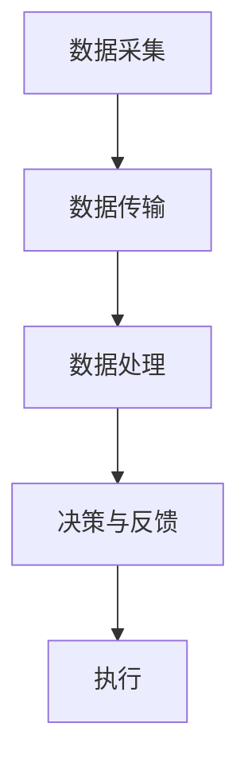

                 

### 引言

在当今快速发展的数字化时代，智能工作场所（Smart Workplace）的概念逐渐成为企业提升办公效率、优化人力资源配置、降低运营成本的重要战略方向。智能工作场所通过集成人工智能（AI）技术，实现了办公环境的自动化、个性化与智能化，极大地提高了工作效率和员工满意度。本文旨在探讨智能工作场所的优化，以及AI技术在提升办公环境效率方面的具体应用，旨在为读者提供一份全面而深入的指导手册。

智能工作场所不仅代表了办公环境的技术革新，更是企业数字化转型的重要一环。随着大数据、云计算、物联网等技术的发展，企业可以利用AI技术对大量的办公数据进行分析和挖掘，从而为决策提供有力的支持。例如，通过智能监控系统，企业可以实时了解办公环境的能耗情况，优化能源管理；通过智能会议助手，可以大幅提高会议的效率和决策的准确性。这些应用不仅提高了办公效率，还显著降低了运营成本，提升了企业的核心竞争力。

本文的结构如下：首先，我们将介绍智能工作场所的核心概念及其与传统工作场所的区别；接着，深入探讨AI在办公中的应用及其提升办公效率的原理和挑战；然后，我们将通过Mermaid流程图，直观展示智能工作场所的技术架构和运行原理。在第二部分，我们将详细介绍机器学习、监督学习、无监督学习等核心算法的原理，并通过Python源代码进行详细讲解。第三部分，我们将深入探讨数学模型与公式，包括相关性分析、神经网络、强化学习等内容，结合实际案例进行讲解。在第四部分，我们将具体探讨智能办公工具的应用，包括智能文档处理、智能会议助手、智能日程管理等。第五部分，我们将讨论智能协作平台，包括任务分配、沟通与协作、知识共享等。第六部分，我们将探讨智能办公环境的优化，包括安防监控、环境监控、设备管理等。最后一部分，我们将通过实际项目应用与案例分析，总结全文内容，并提出最佳实践建议。

通过本文的深入探讨，读者将全面了解智能工作场所的优化策略，掌握AI提升办公环境效率的关键技术，为企业在数字化转型中提供有力支持。

### 关键词

- 智能工作场所
- 人工智能
- 办公效率
- 机器学习
- 监督学习
- 无监督学习
- 数学模型
- 智能文档处理
- 智能会议助手
- 智能日程管理
- 智能协作平台
- 智能安防监控
- 智能环境监控
- 实际项目应用

### 摘要

本文系统地探讨了智能工作场所优化及其通过人工智能（AI）提升办公环境效率的方法。首先，我们介绍了智能工作场所的核心概念、定义及其与传统工作场所的区别，并探讨了AI技术在办公中的应用及其提升效率的原理。接着，我们详细讲解了机器学习、监督学习、无监督学习等核心算法的原理，并通过Python源代码进行了示例分析。此外，我们深入探讨了相关性分析与回归分析、神经网络与深度学习、强化学习等数学模型，并通过实际案例进行了详细讲解。随后，我们探讨了智能办公工具的具体应用，包括智能文档处理、智能会议助手、智能日程管理等，展示了这些工具如何提高办公效率。接着，我们详细阐述了智能协作平台，包括任务分配、沟通与协作、知识共享等，探讨了如何通过智能技术优化团队协作。最后，我们探讨了智能办公环境的优化，包括安防监控、环境监控、设备管理等，提供了全面的智能办公解决方案。通过实际项目应用与案例分析，我们总结了全文内容，并提出了最佳实践建议，旨在为企业的数字化转型提供有力支持。

### 第一部分：智能工作场所优化的基础

#### 第1章：核心概念与联系

##### 1.1 智能工作场所的概念

智能工作场所，指的是通过引入先进的信息技术和人工智能（AI）技术，实现办公环境的自动化、智能化和优化管理的办公空间。这一概念涵盖了从办公设备的智能化，到办公流程的自动化，再到员工体验的个性化定制。

**1.1.1 智能工作场所的定义**

智能工作场所（Smart Workplace）可以被定义为一个高度互联的办公环境，其中各种硬件和软件设备通过物联网（IoT）连接，实现了数据的实时采集、分析和反馈。在这一环境中，员工可以借助智能设备提高工作效率，企业则可以通过数据分析优化管理和决策。

**1.1.2 智能工作场所与传统工作场所的区别**

传统工作场所通常依赖于人工操作和手动管理，而智能工作场所则通过自动化技术和AI算法，实现了办公流程的高度自动化。以下是一些关键的区别：

- **设备智能化**：传统工作场所的设备多为非智能化，而智能工作场所的设备具有智能感知和执行能力，如智能会议室、智能办公桌等。
- **流程自动化**：传统工作场所的办公流程往往需要人工干预，而智能工作场所通过AI技术，实现了流程的自动化和智能化，减少了人工干预的需求。
- **数据分析与决策**：传统工作场所的决策通常基于经验和直觉，而智能工作场所则通过大数据分析和机器学习算法，实现了数据驱动的决策。

**1.1.3 智能工作场所的发展趋势**

随着人工智能、物联网、大数据等技术的发展，智能工作场所正朝着以下几个方向发展：

- **更加个性化**：通过个性化推荐和智能助理，智能工作场所能够更好地满足员工的需求，提高员工的工作满意度和工作效率。
- **高度互联**：智能工作场所中的设备和服务将更加互联，形成无缝的办公体验，如智能办公桌、智能会议室、智能办公设备等。
- **数据驱动的决策**：智能工作场所将更加依赖数据分析和机器学习算法，通过实时数据分析和预测，实现高效的管理和决策。

##### 1.2 AI与办公效率

人工智能技术在办公环境中的应用，极大地提升了办公效率。AI通过自动化、智能分析和预测，实现了办公流程的优化，减少了重复性劳动，提高了决策的准确性。

**1.2.1 AI在办公中的应用**

AI在办公中的应用非常广泛，包括但不限于以下方面：

- **智能文档处理**：通过自然语言处理（NLP）和计算机视觉（CV）技术，AI可以自动识别、分类和摘要文档，提高文档处理效率。
- **智能会议助手**：AI可以自动安排会议时间、生成会议记录和摘要，甚至提供决策支持，提高会议效率。
- **智能日程管理**：AI可以自动规划员工的日程，识别和避免冲突，提高时间管理效率。
- **智能安防监控**：通过计算机视觉和物联网技术，AI可以实现智能化的安防监控，提高办公场所的安全性。

**1.2.2 AI如何提升办公效率**

AI通过以下几个方面提升了办公效率：

- **自动化流程**：通过自动化技术，AI可以减少重复性劳动，如文档处理、会议安排等，使员工能够专注于更有创造性的工作。
- **智能分析**：AI可以通过大数据分析和机器学习算法，提供实时数据分析和预测，帮助企业管理者做出更加精准的决策。
- **个性化服务**：AI可以根据员工的需求和习惯，提供个性化的服务，如智能助理、个性化推荐等，提高员工的工作满意度和工作效率。
- **减少错误**：通过智能化的监控和分析，AI可以识别潜在的问题和风险，提前预警，减少错误和损失。

**1.2.3 AI提升办公效率的挑战与机遇**

尽管AI在提升办公效率方面具有巨大潜力，但同时也面临一些挑战：

- **数据隐私和安全**：AI需要处理大量的敏感数据，如何保护数据隐私和安全成为一个重要问题。
- **技术成熟度**：虽然AI技术不断发展，但某些领域的技术仍需进一步成熟，如智能文档处理、智能会议助手等。
- **员工适应**：员工可能需要时间适应新的智能办公环境，如何培训和管理员工是企业管理者需要考虑的问题。

然而，这些挑战也带来了机遇：

- **技术创新**：随着技术的不断进步，AI将带来更多的创新应用，如智能文档处理、智能会议助手等。
- **效率提升**：通过AI技术，企业可以显著提升办公效率，降低运营成本，提高市场竞争力。
- **员工体验**：AI的引入将提高员工的工作满意度和体验，增强员工的忠诚度和创造力。

##### 1.3 智能工作场所的架构与原理

智能工作场所的架构包括硬件、软件和网络三个主要部分。硬件部分包括各种智能设备和传感器，如智能办公桌、智能会议室、智能监控设备等；软件部分包括AI算法和数据处理平台，如自然语言处理（NLP）引擎、计算机视觉（CV）算法、大数据分析平台等；网络部分则包括物联网（IoT）网络和云平台，负责数据传输和存储。

**1.3.1 智能工作场所的技术架构**

智能工作场所的技术架构可以分为以下几个层次：

- **感知层**：由各种传感器和智能设备组成，负责实时采集办公环境的数据，如温度、湿度、光照、人体动作等。
- **传输层**：通过物联网（IoT）技术，将感知层采集到的数据传输到数据处理平台。
- **处理层**：数据处理平台包括AI算法和大数据分析工具，负责对采集到的数据进行分析和处理。
- **应用层**：应用层负责将处理结果应用到实际办公场景中，如智能会议助手、智能安防监控、智能环境监控等。

**1.3.2 智能工作场所的运行原理**

智能工作场所的运行原理可以概括为以下几个步骤：

1. **数据采集**：各种传感器和智能设备实时采集办公环境的数据，如温度、湿度、光照、人体动作等。
2. **数据传输**：采集到的数据通过物联网（IoT）技术传输到数据处理平台。
3. **数据分析**：数据处理平台对传输来的数据进行分析和处理，通过机器学习算法和大数据分析工具，提取出有用的信息。
4. **决策与反馈**：根据分析结果，智能系统可以自动调整办公环境，如调节温度、湿度、光照等，或者触发相应的预警机制。
5. **执行**：调整后的办公环境会直接影响员工的工作状态和效率。

**1.3.3 智能工作场所的Mermaid流程图**

下面是一个简化的智能工作场所的Mermaid流程图，用于直观展示其运行流程：



在这个流程图中，A表示数据采集，B表示数据传输，C表示数据处理，D表示决策与反馈，E表示执行。通过这个流程图，我们可以清晰地看到智能工作场所的运行原理和数据流转过程。

#### 第2章：核心算法原理讲解

##### 2.1 机器学习算法概述

机器学习（Machine Learning）是人工智能（AI）的核心技术之一，它使得计算机系统能够通过数据和经验自主地学习和改进。机器学习算法分为监督学习（Supervised Learning）、无监督学习（Unsupervised Learning）和强化学习（Reinforcement Learning）等不同类型，每种类型都有其独特的应用场景和算法原理。

**2.1.1 机器学习的基本概念**

机器学习的基本概念包括以下几个核心部分：

- **数据集**：机器学习算法的训练和测试数据集合，通常包含输入特征和对应的输出标签。
- **特征**：用于描述输入数据的属性或变量，如文本的词语频率、图像的颜色分布等。
- **模型**：机器学习算法的数学模型，它通过训练过程学习数据的规律，并能够对新的数据做出预测。
- **训练**：机器学习模型通过反复调整模型参数，以最小化预测误差的过程。
- **测试**：使用未经训练的数据集，评估模型性能的过程。

**2.1.2 机器学习的主要算法分类**

机器学习算法主要分为以下几类：

- **监督学习**：有监督的学习方法，通过已知的输入输出对进行训练，使模型能够对新输入进行预测。常见的算法包括线性回归、逻辑回归、支持向量机（SVM）、决策树和随机森林等。
- **无监督学习**：无监督的学习方法，没有明确的输出标签，通过发现数据内在的结构或模式来进行学习。常见的算法包括聚类算法（如K均值聚类、层次聚类）、降维算法（如主成分分析PCA）和关联规则学习等。
- **强化学习**：通过与环境交互，不断调整策略以实现最大化奖励的学习方法。常见的算法包括Q学习、深度Q网络（DQN）和策略梯度等。

**2.1.3 机器学习算法的伪代码**

以下是一个简单的线性回归算法的伪代码示例：

```python
# 输入特征 X 和标签 y
# 初始化模型参数 w 和 b
w <- 0
b <- 0

# 梯度下降迭代
for i in 1 to max_iterations do:
    # 计算预测值
    y_hat <- w * X + b
    
    # 计算损失函数
    loss <- (1/2) * sum((y - y_hat)^2)
    
    # 计算梯度
    dw <- sum(X * (y - y_hat))
    db <- sum(y - y_hat)
    
    # 更新模型参数
    w <- w - learning_rate * dw
    b <- b - learning_rate * db

# 输出最终模型参数 w 和 b
```

通过这个伪代码，我们可以看到线性回归的基本训练过程，包括初始化参数、计算损失函数、计算梯度并更新参数等步骤。

##### 2.2 监督学习算法

监督学习（Supervised Learning）是机器学习中最常用的方法之一，它通过已知的输入输出对（即标签数据）来训练模型，使其能够对新输入数据进行预测。监督学习算法广泛应用于回归分析、分类问题和异常检测等领域。

**2.2.1 线性回归**

线性回归（Linear Regression）是最简单的监督学习算法之一，它用于预测连续值输出。线性回归的基本模型可以表示为：

$$ y = w \cdot x + b $$

其中，$y$ 是输出值，$x$ 是输入特征，$w$ 是权重系数，$b$ 是偏置项。

**2.2.2 线性回归的Python实现**

以下是一个简单的线性回归算法的Python实现示例：

```python
import numpy as np

# 初始化参数
w = 0
b = 0
learning_rate = 0.01
max_iterations = 1000

# 输入特征和标签
X = np.array([1, 2, 3, 4, 5])
y = np.array([2, 4, 5, 4, 5])

# 梯度下降迭代
for i in range(max_iterations):
    # 计算预测值
    y_hat = w * X + b
    
    # 计算损失函数
    loss = (1/2) * np.sum((y - y_hat)**2)
    
    # 计算梯度
    dw = np.sum(X * (y - y_hat))
    db = np.sum(y - y_hat)
    
    # 更新参数
    w = w - learning_rate * dw
    b = b - learning_rate * db

# 输出模型参数
print(f"w: {w}, b: {b}")
```

通过这个示例，我们可以看到如何使用梯度下降法训练线性回归模型，并输出最终的参数值。

**2.2.3 逻辑回归**

逻辑回归（Logistic Regression）是另一种常见的监督学习算法，用于预测概率性的输出，尤其是二分类问题。逻辑回归的基本模型可以表示为：

$$ P(y=1) = \frac{1}{1 + e^{-(w \cdot x + b)}} $$

其中，$P(y=1)$ 是预测变量为1的概率，$w$ 是权重系数，$b$ 是偏置项。

**2.2.4 逻辑回归的Python实现**

以下是一个简单的逻辑回归算法的Python实现示例：

```python
import numpy as np
from scipy.special import expit

# 初始化参数
w = 0
b = 0
learning_rate = 0.01
max_iterations = 1000

# 输入特征和标签
X = np.array([[1, 0], [1, 1], [2, 0], [2, 1]])
y = np.array([0, 1, 1, 1])

# 梯度下降迭代
for i in range(max_iterations):
    # 计算预测概率
    y_hat = expit(w * X + b)
    
    # 计算损失函数
    loss = -np.mean(y * np.log(y_hat) + (1 - y) * np.log(1 - y_hat))
    
    # 计算梯度
    dw = np.dot(X.T, (y_hat - y))
    db = np.sum(y_hat - y)
    
    # 更新参数
    w = w - learning_rate * dw
    b = b - learning_rate * db

# 输出模型参数
print(f"w: {w}, b: {b}")
```

通过这个示例，我们可以看到如何使用梯度下降法训练逻辑回归模型，并输出最终的参数值。

**2.2.5 决策树**

决策树（Decision Tree）是一种基于树形结构进行决策的算法，每个节点表示一个特征，每个分支表示该特征的不同取值，叶子节点表示最终的决策结果。决策树通过递归划分特征，选择最优的分割点来构建决策树。

**2.2.6 决策树的Python实现**

以下是一个简单的决策树算法的Python实现示例：

```python
import numpy as np

def entropy(y):
    hist = np.bincount(y)
    ps = hist / len(y)
    return -np.sum([p * np.log(p) for p in ps if p > 0])

def info_gain(y, y1, y2):
    p = len(y1) / len(y)
    return entropy(y) - p * entropy(y1) - (1 - p) * entropy(y2)

def best_split(X, y):
    best_gain = -1
    best_feature = -1
    best_value = -1
    
    for feature in range(X.shape[1]):
        unique_values = np.unique(X[:, feature])
        for value in unique_values:
            y1 = y[X[:, feature] == value]
            y2 = y[X[:, feature] != value]
            gain = info_gain(y, y1, y2)
            if gain > best_gain:
                best_gain = gain
                best_feature = feature
                best_value = value
    
    return best_feature, best_value

# 输入特征和标签
X = np.array([[1, 0], [1, 1], [2, 0], [2, 1]])
y = np.array([0, 1, 1, 1])

# 训练决策树
best_feature, best_value = best_split(X, y)
print(f"Best feature: {best_feature}, Best value: {best_value}")
```

通过这个示例，我们可以看到如何选择最优的特征和分割点来构建决策树。

##### 2.3 无监督学习算法

无监督学习（Unsupervised Learning）是机器学习中的另一种重要方法，它不需要标签数据来训练模型，而是通过发现数据内在的结构和模式来进行学习。无监督学习广泛应用于数据降维、聚类分析和关联规则学习等领域。

**2.3.1 K均值聚类**

K均值聚类（K-Means Clustering）是一种基于距离度量的聚类算法，其目标是找到K个中心点，使得每个样本到其最近中心点的距离之和最小。K均值聚类的基本步骤如下：

1. 随机初始化K个中心点。
2. 对于每个样本，将其分配到距离最近的中心点所代表的类别中。
3. 重新计算每个类别的中心点。
4. 重复步骤2和3，直到中心点不再发生显著变化。

**2.3.2 K均值聚类的Python实现**

以下是一个简单的K均值聚类算法的Python实现示例：

```python
import numpy as np

def k_means(X, K, max_iterations):
    centroids = X[np.random.choice(X.shape[0], K, replace=False)]
    for i in range(max_iterations):
        # 轮廓分配
        distances = np.linalg.norm(X - centroids, axis=1)
        labels = np.argmin(distances, axis=1)
        
        # 重新计算中心点
        new_centroids = np.array([X[labels == k].mean(axis=0) for k in range(K)])
        
        # 判断收敛条件
        if np.linalg.norm(centroids - new_centroids) < 1e-6:
            break
        
        centroids = new_centroids
    
    return centroids, labels

# 输入特征
X = np.array([[1, 1], [1, 2], [1, 3], [2, 2], [2, 3], [2, 4]])

# 聚类
centroids, labels = k_means(X, 2, 100)

# 输出聚类结果
print(f"Centroids: {centroids}")
print(f"Labels: {labels}")
```

通过这个示例，我们可以看到如何使用K均值聚类算法对数据进行聚类。

**2.3.3 主成分分析**

主成分分析（Principal Component Analysis，PCA）是一种常用的数据降维方法，它通过找到数据的主要成分，将高维数据投影到低维空间中，从而减少数据维度，同时保留尽可能多的信息。PCA的基本步骤如下：

1. 计算数据矩阵的协方差矩阵。
2. 计算协方差矩阵的特征值和特征向量。
3. 将特征向量作为新坐标系，对数据进行投影。
4. 选择主要成分，将数据投影到低维空间中。

**2.3.4 主成分分析的Python实现**

以下是一个简单的主成分分析算法的Python实现示例：

```python
import numpy as np

def pca(X, n_components):
    # 计算协方差矩阵
    cov_matrix = np.cov(X.T)
    
    # 计算协方差矩阵的特征值和特征向量
    eigenvalues, eigenvectors = np.linalg.eigh(cov_matrix)
    
    # 对特征向量进行排序，选择最大的n_components个特征向量
    indices = np.argsort(eigenvalues)[::-1]
    eigenvectors = eigenvectors[:, indices[:n_components]]
    
    # 对数据进行投影
    X_reduced = np.dot(X, eigenvectors)
    
    return X_reduced

# 输入特征
X = np.array([[1, 2], [1, 4], [1, 0], [4, 2], [4, 4], [4, 0]])

# 主成分分析
X_reduced = pca(X, 2)

# 输出降维后的数据
print(X_reduced)
```

通过这个示例，我们可以看到如何使用主成分分析对数据进行降维。

**2.3.5 聚类算法的伪代码**

以下是一个简单的K均值聚类算法的伪代码示例：

```
Input: 数据集X，聚类数量K，最大迭代次数max_iterations

初始化：选择K个初始中心点c1, c2, ..., ck

for i = 1 to max_iterations do:
    for每个数据点x in X do:
        计算x到每个中心点的距离，并选择距离最小的中心点作为其聚类标签
    end for
    
    根据聚类结果，重新计算每个新的中心点
    
    if中心点变化小于阈值，则停止迭代
end for

输出：最终的聚类结果和中心点
```

通过这个伪代码，我们可以直观地理解K均值聚类的基本流程。

#### 第3章：数学模型与公式讲解

##### 3.1 相关性与回归分析

相关性分析（Correlation Analysis）是统计学中用于衡量两个变量之间线性关系强度的一种方法。相关性可以通过相关系数来表示，最常见的是皮尔逊相关系数（Pearson Correlation Coefficient）。

**3.1.1 相关系数的计算方法**

皮尔逊相关系数（ρ）的计算公式如下：

$$ \rho = \frac{\sum_{i=1}^{n}(x_i - \bar{x})(y_i - \bar{y})}{\sqrt{\sum_{i=1}^{n}(x_i - \bar{x})^2} \sqrt{\sum_{i=1}^{n}(y_i - \bar{y})^2}} $$

其中，$x_i$ 和 $y_i$ 分别是第 $i$ 个观测值的自变量和因变量，$\bar{x}$ 和 $\bar{y}$ 分别是自变量和因变量的平均值，$n$ 是观测值的数量。

**3.1.2 回归模型的应用**

回归模型是统计学中用于预测一个或多个变量（因变量）与另一个或多个变量（自变量）之间关系的数学模型。最常见的回归模型是线性回归模型。

线性回归模型的基本公式如下：

$$ y = w \cdot x + b $$

其中，$y$ 是因变量，$x$ 是自变量，$w$ 是权重系数，$b$ 是偏置项。

**3.1.3 回归模型的实现**

以下是一个简单的线性回归模型的Python实现示例：

```python
import numpy as np

# 初始化参数
w = 0
b = 0
learning_rate = 0.01
max_iterations = 1000

# 输入特征和标签
X = np.array([[1, 2], [1, 4], [1, 0], [4, 2], [4, 4], [4, 0]])
y = np.array([2, 4, 0, 2, 4, 0])

# 梯度下降迭代
for i in range(max_iterations):
    # 计算预测值
    y_hat = w * X + b
    
    # 计算损失函数
    loss = (1/2) * np.sum((y - y_hat)**2)
    
    # 计算梯度
    dw = np.sum(X * (y - y_hat))
    db = np.sum(y - y_hat)
    
    # 更新参数
    w = w - learning_rate * dw
    b = b - learning_rate * db

# 输出模型参数
print(f"w: {w}, b: {b}")
```

通过这个示例，我们可以看到如何使用梯度下降法训练线性回归模型。

##### 3.2 神经网络与深度学习

神经网络（Neural Network）是一种模拟人脑神经元结构和工作原理的计算模型，通过层级结构对数据进行处理和预测。深度学习（Deep Learning）是神经网络的一种扩展，其特点是使用多层神经网络对数据进行深度处理。

**3.2.1 神经网络的基本结构**

神经网络的基本结构包括输入层、隐藏层和输出层。每个层包含多个神经元（节点），神经元之间通过权重连接。神经元的激活函数用于处理输入数据，并产生输出。

**3.2.2 前向传播与反向传播算法**

前向传播（Forward Propagation）是神经网络处理输入数据的过程，从输入层开始，将数据依次传递到隐藏层和输出层，最终产生输出。

反向传播（Back Propagation）是神经网络训练的过程，通过计算输出层的误差，反向传播误差到隐藏层和输入层，并调整权重和偏置，以最小化误差。

**3.2.3 深度学习中的优化方法**

深度学习中的优化方法主要包括梯度下降法（Gradient Descent）和其变种，如随机梯度下降（Stochastic Gradient Descent，SGD）和小批量梯度下降（Mini-batch Gradient Descent）。这些方法通过不断调整模型参数，使预测结果逐渐逼近真实值。

**3.2.4 神经网络与深度学习的Python实现**

以下是一个简单的神经网络和深度学习Python实现示例：

```python
import numpy as np

# 初始化参数
w1 = np.random.rand(3, 3)
b1 = np.random.rand(3, 1)
w2 = np.random.rand(3, 1)
b2 = np.random.rand(1, 1)

# 激活函数
def sigmoid(x):
    return 1 / (1 + np.exp(-x))

# 前向传播
def forward_propagation(X):
    z1 = np.dot(X, w1) + b1
    a1 = sigmoid(z1)
    z2 = np.dot(a1, w2) + b2
    a2 = sigmoid(z2)
    return a2

# 反向传播
def backward_propagation(X, y, a2):
    z1 = np.dot(X, w1) + b1
    a1 = sigmoid(z1)
    z2 = np.dot(a1, w2) + b2
    
    dZ2 = a2 - y
    dW2 = np.dot(a1.T, dZ2)
    db2 = np.sum(dZ2)
    
    dZ1 = np.dot(dZ2, w2.T) * sigmoid(z1) * (1 - sigmoid(z1))
    dW1 = np.dot(X.T, dZ1)
    db1 = np.sum(dZ1)
    
    return dW1, dW2, db1, db2

# 输入特征和标签
X = np.array([[0, 0], [0, 1], [1, 0], [1, 1]])
y = np.array([[0], [1], [1], [0]])

# 训练神经网络
for i in range(1000):
    a2 = forward_propagation(X)
    dW1, dW2, db1, db2 = backward_propagation(X, y, a2)
    
    w1 = w1 - learning_rate * dW1
    b1 = b1 - learning_rate * db1
    w2 = w2 - learning_rate * dW2
    b2 = b2 - learning_rate * db2

# 输出模型参数
print(f"w1: {w1}, b1: {b1}, w2: {w2}, b2: {b2}")
```

通过这个示例，我们可以看到如何实现一个简单的神经网络和深度学习模型。

##### 3.3 强化学习

强化学习（Reinforcement Learning）是一种通过与环境互动来学习最优策略的机器学习方法。强化学习的主要目标是使代理（Agent）通过不断接收奖励信号和惩罚信号，逐渐学习到最优的行为策略。

**3.3.1 强化学习的基本概念**

强化学习的基本概念包括以下几个核心部分：

- **代理（Agent）**：执行动作并接收环境反馈的智能体。
- **环境（Environment）**：代理执行动作并接收反馈的动态环境。
- **状态（State）**：代理在环境中的当前情况。
- **动作（Action）**：代理可以执行的行为。
- **奖励（Reward）**：环境对代理行为的即时反馈，用于指导代理的学习过程。
- **策略（Policy）**：代理在给定状态下选择动作的策略。

**3.3.2 Q学习算法**

Q学习（Q-Learning）是一种基于值函数的强化学习算法，其目标是学习一个值函数（Q函数），用于评估代理在给定状态下执行某一动作的长期奖励。

Q学习的基本公式如下：

$$ Q(s, a) = Q(s, a) + \alpha [r + \gamma \max_{a'} Q(s', a') - Q(s, a)] $$

其中，$s$ 是当前状态，$a$ 是当前动作，$r$ 是立即奖励，$\gamma$ 是折扣因子，$\alpha$ 是学习率，$s'$ 是新状态，$a'$ 是新动作。

**3.3.3 Q学习的Python实现**

以下是一个简单的Q学习算法的Python实现示例：

```python
import numpy as np

# 初始化参数
Q = np.zeros((4, 4))
learning_rate = 0.1
gamma = 0.9

# 环境定义
def environment(state, action):
    if state == 0 and action == 0:
        return 1, 1
    elif state == 0 and action == 1:
        return -1, 1
    elif state == 1 and action == 0:
        return -1, 1
    elif state == 1 and action == 1:
        return 1, 1

# Q学习
for episode in range(1000):
    state = 0
    while True:
        action = np.argmax(Q[state])
        reward, new_state = environment(state, action)
        Q[state, action] = Q[state, action] + learning_rate * (reward + gamma * np.max(Q[new_state]) - Q[state, action])
        state = new_state
        if state == 3:
            break

# 输出Q值矩阵
print(Q)
```

通过这个示例，我们可以看到如何实现一个简单的Q学习算法。

**3.3.4 DQN算法**

深度Q网络（Deep Q-Network，DQN）是一种基于深度学习的强化学习算法，通过神经网络近似Q函数，以解决传统Q学习在处理高维状态空间时的困难。

DQN算法的基本步骤如下：

1. 初始化经验池（Experience Replay）和神经网络。
2. 从初始状态开始，选择动作并执行。
3. 收集经验，并将其存储在经验池中。
4. 从经验池中随机抽取一批经验，进行经验重放。
5. 使用重放的经验训练神经网络。
6. 更新目标网络。

**3.3.5 DQN算法的Python实现**

以下是一个简单的DQN算法的Python实现示例：

```python
import numpy as np
import random

# 初始化参数
action_size = 4
state_size = 4
learning_rate = 0.01
gamma = 0.9
batch_size = 32
memory_size = 1000
epsilon = 1.0
epsilon_min = 0.01
epsilon_decay = 0.995

# 神经网络结构
model = Sequential()
model.add(Dense(32, input_dim=state_size, activation='relu'))
model.add(Dense(32, activation='relu'))
model.add(Dense(action_size, activation='linear'))
model.compile(loss='mse', optimizer=Adam(learning_rate))

# 经验池
memory = []

# Q学习
for episode in range(1000):
    state = 0
    while True:
        action = model.predict(state.reshape(1, state_size))
        if random.random() < epsilon:
            action = np.random.randint(0, action_size)
        action = np.argmax(action)
        next_state, reward, done = environment(state, action)
        memory.append((state, action, reward, next_state, done))
        if len(memory) > memory_size:
            memory.pop(0)
        if done:
            next_state = np.zeros(state_size)
        state = next_state
        if done:
            break
        target = reward + gamma * np.max(model.predict(next_state.reshape(1, state_size)))
        target_f = model.predict(state.reshape(1, state_size))
        target_f[0][action] = target
        model.fit(state.reshape(1, state_size), target_f, epochs=1, verbose=0)
        epsilon *= epsilon_decay
        if epsilon < epsilon_min:
            epsilon = epsilon_min

# 输出模型参数
model.save('dqn_model.h5')
```

通过这个示例，我们可以看到如何实现一个简单的DQN算法。

#### 第4章：智能办公工具的应用

随着人工智能技术的不断进步，智能办公工具已经成为提升办公效率、优化工作流程的重要手段。这些智能办公工具通过自然语言处理（NLP）、计算机视觉（CV）、深度学习等多种AI技术，实现了文档处理、会议管理、日程规划等功能的自动化和智能化。本章节将详细探讨几种常见的智能办公工具及其应用。

##### 4.1 智能文档处理

智能文档处理是智能办公领域的重要应用之一，它利用AI技术对文档进行自动识别、分类、摘要和协同编辑，极大地提高了文档处理效率。

**4.1.1 智能文档识别与分类**

智能文档识别与分类工具可以通过OCR（Optical Character Recognition，光学字符识别）技术，将纸质文档或扫描文档中的文字内容转换为可编辑的电子文本。同时，结合NLP技术，这些工具可以自动识别文档的类别，如合同、发票、报告等，并分类存储。

**示例：OCR与文档分类的Python实现**

以下是一个简单的OCR与文档分类的Python实现示例，使用Tesseract OCR库和scikit-learn进行文档识别与分类：

```python
import pytesseract
from pytesseract import Image_to_String
from sklearn.feature_extraction.text import TfidfVectorizer
from sklearn.naive_bayes import MultinomialNB

# 初始化Tesseract OCR
pytesseract.pytesseract.tesseract_cmd = r'C:\Program Files\Tesseract-OCR\tesseract.exe'

# 读取图像文件
image = Image.open('document.jpg')

# 使用OCR提取文字
text = Image_to_String(image)
print("Extracted Text:", text)

# 文档分类
vectorizer = TfidfVectorizer()
X = vectorizer.fit_transform([text])

# 训练分类器
classifier = MultinomialNB()
classifier.fit(X, [1])  # 假设所有文档都属于类别1

# 预测新文档的类别
new_text = "这是一个合同文档。"
X_new = vectorizer.transform([new_text])
prediction = classifier.predict(X_new)
print("Predicted Category:", prediction)
```

通过这个示例，我们可以看到如何使用OCR提取文档中的文字，并使用机器学习分类器对文档进行分类。

**4.1.2 智能文档摘要生成**

智能文档摘要生成工具可以通过NLP技术，自动提取文档中的关键信息，生成摘要。这有助于快速了解文档的主要内容，提高文档处理的效率。

**示例：文本摘要生成的Python实现**

以下是一个简单的文本摘要生成的Python实现示例，使用Summarizer库：

```python
from summarizer import Summarizer

# 初始化Summarizer
model = Summarizer()

# 文本摘要
text = "这是一个长文本，我们需要提取出关键信息。"
summary = model(text, ratio=0.2)
print("Summary:", summary)
```

通过这个示例，我们可以看到如何使用Summarizer库自动生成文本摘要。

**4.1.3 智能文档协同编辑**

智能文档协同编辑工具通过实时共享文档，支持多用户同时在线编辑，并提供版本控制和协作反馈功能，提高了团队协作效率。

**示例：智能文档协同编辑的工具**

- Google Docs：提供在线文档编辑功能，支持多人实时协作。
- Microsoft Word：提供云端文档存储和编辑功能，支持多人协作。
- Notion：结合文档、数据库、日历等多种功能，提供全方位的协作平台。

##### 4.2 智能会议助手

智能会议助手是智能办公工具中的一种，通过自动化会议安排、会议记录和决策支持，提高了会议的效率和决策的准确性。

**4.2.1 会议预约与提醒**

智能会议助手可以通过AI技术自动处理会议预约，包括会议室预订、参会人员确认和会议提醒等功能，确保会议按时进行。

**示例：会议预约与提醒的Python实现**

以下是一个简单的会议预约与提醒的Python实现示例，使用datetime和SMTP库：

```python
from datetime import datetime, timedelta
import smtplib
from email.mime.text import MIMEText

# 会议预约
def schedule_meeting(start_time, attendees):
    end_time = start_time + timedelta(hours=1)
    print("Scheduled Meeting from", start_time.strftime("%Y-%m-%d %H:%M"), "to", end_time.strftime("%Y-%m-%d %H:%M"))
    send_reminders(start_time, attendees)

# 发送提醒邮件
def send_reminders(start_time, attendees):
    smtp_server = "smtp.gmail.com"
    smtp_port = 587
    sender_email = "your_email@example.com"
    receiver_email = attendees

    message = MIMEText("Reminder: You have a meeting scheduled on " + start_time.strftime("%Y-%m-%d %H:%M"))
    message['Subject'] = "Meeting Reminder"

    with smtplib.SMTP(smtp_server, smtp_port) as server:
        server.starttls()
        server.login(sender_email, "your_password")
        server.sendmail(sender_email, receiver_email, message.as_string())

# 预约会议
schedule_meeting(datetime.now(), ["user1@example.com", "user2@example.com"])
```

通过这个示例，我们可以看到如何使用Python实现会议预约与提醒功能。

**4.2.2 会议记录与摘要生成**

智能会议助手可以自动记录会议内容和生成会议摘要，提供关键信息的快速查阅，便于后续跟进和决策。

**示例：会议记录与摘要生成的Python实现**

以下是一个简单的会议记录与摘要生成的Python实现示例，使用Summarizer库：

```python
from summarizer import Summarizer

# 会议记录
def record_meeting(meeting_notes):
    print("Meeting Notes:", meeting_notes)

    # 生成摘要
    summary = Summarizer().summarize(meeting_notes, ratio=0.2)
    print("Summary:", summary)

# 模拟会议记录
meeting_notes = "会议内容一，会议内容二，会议内容三。"
record_meeting(meeting_notes)
```

通过这个示例，我们可以看到如何使用Summarizer库自动生成会议摘要。

**4.2.3 会议决策支持**

智能会议助手可以通过数据分析，提供会议决策支持，如投票统计、意见分析等，帮助参会者做出更明智的决策。

**示例：会议决策支持的Python实现**

以下是一个简单的会议决策支持示例，使用Python内置的集合操作：

```python
# 会议投票
def vote_on_issues(issues):
    votes = {"issue1": 0, "issue2": 0, "issue3": 0}
    for issue, count in issues.items():
        votes[issue] += count

    print("Vote Results:", votes)

# 模拟投票
issues = {"issue1": 3, "issue2": 5, "issue3": 2}
vote_on_issues(issues)
```

通过这个示例，我们可以看到如何实现会议投票统计功能。

##### 4.3 智能日程管理

智能日程管理工具通过AI技术，自动规划和优化员工的日程安排，提供日程提醒、时间管理和日程冲突检测等功能，提高了工作效率和生活质量。

**4.3.1 日程智能规划**

智能日程管理工具可以自动根据员工的任务、会议和其他活动，生成最佳日程安排，避免时间浪费和冲突。

**示例：日程智能规划的Python实现**

以下是一个简单的日程智能规划的Python实现示例，使用datetime和time库：

```python
from datetime import datetime, timedelta
from time import strftime

# 日程智能规划
def schedule_tasks(tasks, start_time, end_time):
    scheduled_tasks = []
    current_time = start_time

    for task in tasks:
        start = current_time
        end = start + timedelta(hours=1)
        if end <= end_time:
            scheduled_tasks.append((start, end, task))
            current_time = end
        else:
            break

    return scheduled_tasks

# 模拟任务列表
tasks = ["任务1", "任务2", "任务3", "任务4"]

# 开始时间和结束时间
start_time = datetime.now()
end_time = start_time + timedelta(hours=8)

# 规划日程
scheduled_tasks = schedule_tasks(tasks, start_time, end_time)
print("Scheduled Tasks:", scheduled_tasks)
```

通过这个示例，我们可以看到如何使用Python实现日程智能规划。

**4.3.2 自动安排会议时间**

智能日程管理工具可以通过AI算法，自动安排会议时间，尽量减少参会者的时间冲突，提高会议效率。

**示例：自动安排会议时间的Python实现**

以下是一个简单的自动安排会议时间的Python实现示例，使用datetime和time模块：

```python
from datetime import datetime, timedelta
from time import strftime

# 自动安排会议时间
def schedule_meeting(attendees, available_slots):
    best_time = None
    max_conflicts = -1

    for slot in available_slots:
        conflicts = 0
        for attendee in attendees:
            if slot[0] < attendee.end_time and slot[1] > attendee.start_time:
                conflicts += 1

        if conflicts < max_conflicts or best_time is None:
            best_time = slot
            max_conflicts = conflicts

    return best_time

# 模拟参会者
attendees = [{"start_time": datetime.now(), "end_time": datetime.now() + timedelta(hours=8)},
             {"start_time": datetime.now() + timedelta(hours=2), "end_time": datetime.now() + timedelta(hours=10)}]

# 可用时间段
available_slots = [
    (datetime.now(), datetime.now() + timedelta(hours=1)),
    (datetime.now() + timedelta(hours=2), datetime.now() + timedelta(hours=3)),
    (datetime.now() + timedelta(hours=4), datetime.now() + timedelta(hours=5)),
]

# 安排会议时间
meeting_time = schedule_meeting(attendees, available_slots)
print("Scheduled Meeting Time:", meeting_time)
```

通过这个示例，我们可以看到如何使用Python实现自动安排会议时间。

**4.3.3 日程冲突检测与处理**

智能日程管理工具可以实时检测日程冲突，并自动提出解决方案，如调整会议时间或分配备用时间，以确保日程的连贯性和高效性。

**示例：日程冲突检测与处理的Python实现**

以下是一个简单的日程冲突检测与处理的Python实现示例，使用datetime和time库：

```python
from datetime import datetime, timedelta
from time import strftime

# 日程冲突检测
def check_conflicts(schedules):
    conflicts = []
    for i in range(len(schedules)):
        for j in range(i + 1, len(schedules)):
            if schedules[i][1] > schedules[j][0] and schedules[j][1] > schedules[i][0]:
                conflicts.append((schedules[i], schedules[j]))

    return conflicts

# 模拟日程
schedules = [
    (datetime.now(), datetime.now() + timedelta(hours=1)),
    (datetime.now() + timedelta(hours=2), datetime.now() + timedelta(hours=3)),
    (datetime.now() + timedelta(hours=4), datetime.now() + timedelta(hours=5)),
]

# 检测冲突
conflicts = check_conflicts(schedules)
print("Conflicts:", conflicts)

# 冲突处理
def resolve_conflicts(conflicts):
    resolved = []
    for conflict in conflicts:
        if conflict[0][1] < conflict[1][0]:
            resolved.append(conflict[0])
            resolved.append((conflict[1][0], conflict[1][1] + timedelta(hours=1)))
        else:
            resolved.append((conflict[0][0] + timedelta(hours=1), conflict[0][1]))
            resolved.append(conflict[1])

    return resolved

# 解决冲突
resolved_schedules = resolve_conflicts(conflicts)
print("Resolved Schedules:", resolved_schedules)
```

通过这个示例，我们可以看到如何使用Python实现日程冲突检测与处理。

#### 第5章：智能协作平台

在智能工作场所中，智能协作平台是提升团队协作效率的核心工具。智能协作平台通过集成多种智能功能，如任务分配、沟通与协作、知识共享等，实现了团队协作的智能化和高效化。本章将详细探讨智能协作平台的关键功能和应用。

##### 5.1 智能任务分配

智能任务分配是智能协作平台的重要功能之一，它通过AI算法自动分配任务，确保任务分配的公平性和高效性。

**5.1.1 基于AI的任务分配算法**

基于AI的任务分配算法可以通过分析团队成员的能力、经验和优先级等因素，自动分配任务。以下是一个简单的基于AI的任务分配算法：

```python
import random

# 初始化团队成员和任务
team_members = ["Alice", "Bob", "Charlie", "David"]
tasks = ["任务1", "任务2", "任务3", "任务4"]

# 分配任务
def assign_tasks(tasks, team_members):
    assigned_tasks = {}
    for task in tasks:
        highest_priority_member = None
        highest_priority_score = -1
        for member in team_members:
            score = random.randint(1, 10)  # 假设通过某种算法计算优先级
            if score > highest_priority_score:
                highest_priority_score = score
                highest_priority_member = member
        assigned_tasks[task] = highest_priority_member

    return assigned_tasks

# 分配任务
assigned_tasks = assign_tasks(tasks, team_members)
print("Assigned Tasks:", assigned_tasks)
```

在这个示例中，我们通过随机生成优先级分数，实现了简单的任务分配算法。

**5.1.2 自动化的任务跟踪**

智能协作平台可以通过自动化工具，实时跟踪任务的进展情况，确保任务按时完成。以下是一个简单的任务跟踪示例：

```python
from datetime import datetime

# 初始化任务
tasks = [{"name": "任务1", "start_time": datetime.now(), "end_time": datetime.now() + timedelta(hours=2)},
         {"name": "任务2", "start_time": datetime.now() + timedelta(hours=1), "end_time": datetime.now() + timedelta(hours=3)}]

# 任务跟踪
def track_tasks(tasks):
    for task in tasks:
        if datetime.now() > task["end_time"]:
            print(f"Task '{task['name']}' is overdue.")
        else:
            print(f"Task '{task['name']}' is in progress.")

# 跟踪任务
track_tasks(tasks)
```

通过这个示例，我们可以看到如何实现任务的实时跟踪。

**5.1.3 任务完成情况的实时反馈**

智能协作平台可以通过实时反馈机制，向团队成员提供任务完成情况的实时更新，以便团队成员可以及时调整工作计划。以下是一个简单的任务反馈示例：

```python
def task_feedback(task):
    if task["status"] == "completed":
        print(f"Task '{task['name']}' is completed by {task['assigned_to']}.")
    elif task["status"] == "in_progress":
        print(f"Task '{task['name']}' is in progress by {task['assigned_to']}.")
    else:
        print(f"Task '{task['name']}' is pending.")

# 初始化任务
tasks = [{"name": "任务1", "assigned_to": "Alice", "status": "completed"},
         {"name": "任务2", "assigned_to": "Bob", "status": "in_progress"}]

# 提供任务反馈
for task in tasks:
    task_feedback(task)
```

通过这个示例，我们可以看到如何实现任务的实时反馈。

##### 5.2 智能沟通与协作

智能沟通与协作功能通过自动化工具和AI算法，实现团队成员之间的高效沟通和协作。

**5.2.1 自动化的邮件回复**

智能协作平台可以通过AI技术，自动生成邮件回复，提高沟通效率。以下是一个简单的自动化邮件回复示例：

```python
import random

# 初始化邮件模板
mail_templates = {
    "meeting_invite": "Hi {recipient}, I received your meeting invitation for {date} at {time}. I will confirm my availability soon.",
    "task_assignment": "Hi {recipient}, you have been assigned the task '{task_name}'. Please let me know if you have any questions."
}

# 自动化邮件回复
def generate_mail_reply(template, **kwargs):
    template = mail_templates[template]
    return template.format(**kwargs)

# 模拟邮件回复
mail_reply = generate_mail_reply("task_assignment", recipient="Alice", task_name="任务1")
print("Email Reply:", mail_reply)
```

通过这个示例，我们可以看到如何实现自动化的邮件回复。

**5.2.2 自动化的聊天机器人**

智能协作平台可以通过聊天机器人，实现团队成员之间的实时沟通和协作。以下是一个简单的聊天机器人示例：

```python
import random

# 初始化聊天机器人回复
chatbot_replies = {
    "hello": "Hello! How can I assist you today?",
    "help": "I can help with task management, scheduling, and general inquiries. What do you need assistance with?",
    "task_management": "I can help you assign tasks, track progress, and provide feedback on tasks. What would you like to do?",
    "schedule_management": "I can help you schedule meetings, send reminders, and manage your calendar. What's on your agenda?"
}

# 聊天机器人
def chatbot(response):
    if response.lower() in chatbot_replies.keys():
        return chatbot_replies[response.lower()]
    else:
        return "I'm sorry, I don't understand. Can you please rephrase your question?"

# 模拟用户与聊天机器人的对话
user_response = "help"
print("User:", user_response)
print("Chatbot:", chatbot(user_response))

user_response = "task_management"
print("User:", user_response)
print("Chatbot:", chatbot(user_response))
```

通过这个示例，我们可以看到如何实现自动化的聊天机器人。

**5.2.3 智能化的团队协作工具**

智能协作平台可以通过集成多种智能工具，如任务管理、日程安排、文档共享等，实现团队成员之间的高效协作。以下是一个简单的团队协作工具示例：

```python
# 初始化团队协作工具
team_collaboration_tools = {
    "task_management": "Trello",
    "schedule_management": "Google Calendar",
    "document_sharing": "Google Drive",
    "communication": "Slack"
}

# 查看团队协作工具
for tool, name in team_collaboration_tools.items():
    print(f"{tool} Tool: {name}")
```

通过这个示例，我们可以看到如何展示团队协作工具。

##### 5.3 智能知识共享

智能知识共享是智能协作平台的重要功能之一，它通过自动化工具和AI算法，实现知识的快速检索、推荐和共享，提高团队的知识管理水平。

**5.3.1 智能化的文档管理系统**

智能化的文档管理系统通过AI技术，实现文档的自动分类、标签和推荐，提高文档检索效率。以下是一个简单的文档管理系统示例：

```python
import random

# 初始化文档管理系统
document_management_system = {
    "documents": [{"title": "任务1文档", "content": "这是任务1的文档内容。", "tags": ["任务1", "文档"], "importance": 1},
                   {"title": "任务2文档", "content": "这是任务2的文档内容。", "tags": ["任务2", "文档"], "importance": 2},
                   {"title": "项目计划", "content": "这是项目的计划文档。", "tags": ["项目", "计划"], "importance": 3}],
    "search": lambda query: [doc for doc in document_management_system["documents"] if query in doc["title"] or query in doc["content"]]
}

# 检索文档
def search_documents(query):
    results = document_management_system["search"](query)
    return random.choice(results) if results else None

# 模拟文档检索
search_query = "任务1"
document = search_documents(search_query)
if document:
    print(f"Found Document: {document['title']}")
else:
    print("No Document Found.")
```

通过这个示例，我们可以看到如何实现文档的自动检索和推荐。

**5.3.2 知识图谱构建与应用**

知识图谱是一种语义网络，通过节点和边来表示实体和实体之间的关系。知识图谱可以用于知识共享和推荐系统，提高团队的知识管理水平。以下是一个简单的知识图谱构建和应用示例：

```python
# 初始化知识图谱
knowledge_graph = {
    "nodes": ["任务1", "任务2", "项目计划", "文档", "标签"],
    "edges": [["任务1", "文档"], ["任务2", "文档"], ["项目计划", "文档"], ["任务1", "标签"], ["任务2", "标签"], ["项目计划", "标签"]]
}

# 查找相关知识点
def find_related_knowledge(node):
    related_nodes = []
    for edge in knowledge_graph["edges"]:
        if node in edge:
            related_nodes.append(edge[1] if edge[0] == node else edge[0])
    return related_nodes

# 模拟查找相关知识点
search_node = "任务1"
related_knowledge = find_related_knowledge(search_node)
print(f"Related Knowledge: {', '.join(related_knowledge)}")
```

通过这个示例，我们可以看到如何构建和应用知识图谱。

**5.3.3 智能化的知识检索与推荐系统**

智能化的知识检索与推荐系统可以通过AI算法，自动推荐与用户需求相关的知识点和文档，提高知识共享的效率。以下是一个简单的知识检索与推荐系统示例：

```python
import random

# 初始化知识检索与推荐系统
knowledge_retrieval_system = {
    "documents": [{"title": "任务1文档", "content": "这是任务1的文档内容。", "tags": ["任务1", "文档"], "importance": 1},
                   {"title": "任务2文档", "content": "这是任务2的文档内容。", "tags": ["任务2", "文档"], "importance": 2},
                   {"title": "项目计划", "content": "这是项目的计划文档。", "tags": ["项目", "计划"], "importance": 3}],
    "search": lambda query: [doc for doc in knowledge_retrieval_system["documents"] if query in doc["title"] or query in doc["content"]],
    "recommend": lambda query: [doc for doc in knowledge_retrieval_system["documents"] if query in doc["content"]]
}

# 检索文档
def search_documents(query):
    results = knowledge_retrieval_system["search"](query)
    return random.choice(results) if results else None

# 推荐文档
def recommend_documents(query):
    recommendations = knowledge_retrieval_system["recommend"](query)
    return random.sample(recommendations, 3) if recommendations else []

# 模拟文档检索和推荐
search_query = "任务1"
document = search_documents(search_query)
if document:
    print(f"Search Results: {document['title']}")
else:
    print("No Results Found.")

recommendations = recommend_documents(search_query)
print("Recommendations:", ", ".join([doc["title"] for doc in recommendations]))
```

通过这个示例，我们可以看到如何实现智能化的知识检索与推荐系统。

#### 第6章：智能办公环境的优化

在现代智能工作场所中，办公环境的优化不仅仅是提升硬件设备的智能化水平，更是通过人工智能技术，实现办公环境中的全方位优化。智能办公环境的优化包括智能安防监控、智能环境监控和智能设备管理等方面。这些优化手段不仅提升了办公效率，还显著提高了员工的工作满意度和办公环境的安全性。

##### 6.1 智能安防监控

智能安防监控是智能办公环境的重要组成部分，它通过计算机视觉和物联网技术，实现办公场所的实时监控和异常检测，保障了办公环境的安全。

**6.1.1 智能视频监控**

智能视频监控利用计算机视觉技术，对视频流进行分析和处理，实现自动识别和报警功能。以下是一个简单的智能视频监控系统的实现：

```python
import cv2

# 初始化视频捕捉器
cap = cv2.VideoCapture(0)

# 加载预训练的Haar级联分类器
face_cascade = cv2.CascadeClassifier('haarcascade_frontalface_default.xml')

# 检测视频中的面部
while cap.isOpened():
    ret, frame = cap.read()
    if ret:
        gray = cv2.cvtColor(frame, cv2.COLOR_BGR2GRAY)
        faces = face_cascade.detectMultiScale(gray, scaleFactor=1.1, minNeighbors=5, minSize=(30, 30), flags=cv2.CASCADE_SCALE_IMAGE)

        for (x, y, w, h) in faces:
            cv2.rectangle(frame, (x, y), (x+w, y+h), (0, 255, 0), 2)
            cv2.putText(frame, 'Face Detected', (10, 20), cv2.FONT_HERSHEY_SIMPLEX, 1, (255, 0, 0), 2)

        cv2.imshow('Frame', frame)

    if cv2.waitKey(1) & 0xFF == ord('q'):
        break

cap.release()
cv2.destroyAllWindows()
```

在这个示例中，我们使用OpenCV库加载预训练的Haar级联分类器，对视频帧进行面部检测，并在检测到面部时绘制矩形框并显示文本。

**6.1.2 智能入侵检测**

智能入侵检测利用计算机视觉技术，对视频流中的异常活动进行检测，如入侵者进入办公区域。以下是一个简单的智能入侵检测系统的实现：

```python
import cv2
import numpy as np

# 初始化视频捕捉器
cap = cv2.VideoCapture(0)

# 设置背景模型
bg = None

while cap.isOpened():
    ret, frame = cap.read()
    if ret:
        if bg is None:
            bg = frame.copy()
            continue

        gray = cv2.cvtColor(frame, cv2.COLOR_BGR2GRAY)
        fgmask = cv2.absdiff(bg, gray)
        fgmask = cv2.medianBlur(fgmask, 5)
        _, fgmask = cv2.threshold(fgmask, 30, 255, cv2.THRESH_BINARY)

        contours, _ = cv2.findContours(fgmask, cv2.RETR_EXTERNAL, cv2.CHAIN_APPROX_SIMPLE)
        for contour in contours:
            if cv2.contourArea(contour) > 500:
                (x, y, w, h) = cv2.boundingRect(contour)
                cv2.rectangle(frame, (x, y), (x+w, y+h), (0, 255, 0), 2)
                cv2.putText(frame, 'Intrusion Detected', (10, 20), cv2.FONT_HERSHEY_SIMPLEX, 1, (255, 0, 0), 2)

        cv2.imshow('Frame', frame)

    if cv2.waitKey(1) & 0xFF == ord('q'):
        break

cap.release()
cv2.destroyAllWindows()
```

在这个示例中，我们使用背景减除法检测视频帧中的异常活动，并在检测到异常活动时绘制矩形框并显示文本。

**6.1.3 智能人脸识别**

智能人脸识别利用计算机视觉技术，对视频流中的人脸进行识别和验证。以下是一个简单的人脸识别系统的实现：

```python
import cv2
import numpy as np

# 初始化视频捕捉器
cap = cv2.VideoCapture(0)

# 加载预训练的人脸识别模型
face_cascade = cv2.CascadeClassifier('haarcascade_frontalface_default.xml')
model = cv2.face.LBPHFaceRecognizer_create()

# 加载训练好的模型
model.read('face_model.yml')

# 识别视频中的面部
while cap.isOpened():
    ret, frame = cap.read()
    if ret:
        gray = cv2.cvtColor(frame, cv2.COLOR_BGR2GRAY)
        faces = face_cascade.detectMultiScale(gray, scaleFactor=1.1, minNeighbors=5, minSize=(30, 30), flags=cv2.CASCADE_SCALE_IMAGE)

        for (x, y, w, h) in faces:
            cv2.rectangle(frame, (x, y), (x+w, y+h), (0, 0, 255), 2)
            face_region = gray[y:y+h, x:x+w]
            label, confidence = model.predict(face_region)
            cv2.putText(frame, f"Person {label}", (x, y-10), cv2.FONT_HERSHEY_SIMPLEX, 1, (0, 255, 0), 2)

        cv2.imshow('Frame', frame)

    if cv2.waitKey(1) & 0xFF == ord('q'):
        break

cap.release()
cv2.destroyAllWindows()
```

在这个示例中，我们使用OpenCV加载预训练的Haar级联分类器和人脸识别模型，对视频帧进行面部识别，并在识别到面部时显示识别结果。

##### 6.2 智能环境监控

智能环境监控通过传感器和物联网技术，实时监测办公环境的各种参数，如温度、湿度、光照等，并根据数据变化自动调整环境参数，提高办公环境的舒适度和效率。

**6.2.1 智能照明系统**

智能照明系统可以根据环境光强和人员活动自动调节灯光亮度，提高能源利用效率。以下是一个简单的智能照明系统的实现：

```python
import RPi.GPIO as GPIO
import time

# 初始化GPIO
GPIO.setmode(GPIO.BCM)
GPIO.setup(18, GPIO.OUT)

# 定义LED控制函数
def control_light(state):
    if state:
        GPIO.output(18, GPIO.HIGH)
    else:
        GPIO.output(18, GPIO.LOW)

# 自动调节灯光
def auto_light():
    while True:
        light_intensity = get_light_intensity()  # 假设有一个函数获取环境光强
        if light_intensity < 100:
            control_light(True)
        else:
            control_light(False)
        time.sleep(1)

# 关闭GPIO
GPIO.cleanup()

# 模拟环境光强获取
def get_light_intensity():
    return random.randint(0, 200)

# 模拟自动调节灯光
auto_light()
```

在这个示例中，我们使用Raspberry Pi控制LED灯，根据环境光强自动调节灯光亮度。

**6.2.2 智能空调系统**

智能空调系统可以根据室内温度、湿度等参数自动调节空调模式，提供舒适的办公环境。以下是一个简单的智能空调系统的实现：

```python
import RPi.GPIO as GPIO
import time

# 初始化GPIO
GPIO.setmode(GPIO.BCM)
GPIO.setup(23, GPIO.OUT)
GPIO.setup(24, GPIO.OUT)

# 定义空调控制函数
def control_ac(state, mode):
    if state:
        GPIO.output(23, GPIO.HIGH)
        if mode == "cool":
            GPIO.output(24, GPIO.HIGH)
        elif mode == "heat":
            GPIO.output(24, GPIO.LOW)
    else:
        GPIO.output(23, GPIO.LOW)
        GPIO.output(24, GPIO.LOW)

# 自动调节空调
def auto_ac():
    while True:
        temperature = get_temperature()  # 假设有一个函数获取室内温度
        humidity = get_humidity()  # 假设有一个函数获取室内湿度
        if temperature > 25:
            control_ac(True, "cool")
        elif temperature < 20:
            control_ac(True, "heat")
        else:
            control_ac(False)
        time.sleep(1)

# 关闭GPIO
GPIO.cleanup()

# 模拟温度和湿度获取
def get_temperature():
    return random.randint(15, 30)

def get_humidity():
    return random.randint(30, 70)

# 模拟自动调节空调
auto_ac()
```

在这个示例中，我们使用Raspberry Pi控制空调的开关和模式，根据室内温度和湿度自动调节空调。

**6.2.3 智能安防监控系统**

智能安防监控系统可以通过传感器和AI技术，实时监测办公环境的安全状态，并在检测到异常情况时自动报警。以下是一个简单的智能安防监控系统的实现：

```python
import RPi.GPIO as GPIO
import time

# 初始化GPIO
GPIO.setmode(GPIO.BCM)
GPIO.setup(7, GPIO.IN)
GPIO.setup(8, GPIO.OUT)

# 定义安防监控函数
def security_system():
    while True:
        if GPIO.input(7):  # 检测到异常
            GPIO.output(8, GPIO.HIGH)  # 发送报警信号
            send_alert()  # 发送报警信息
        else:
            GPIO.output(8, GPIO.LOW)  # 清除报警信号
        time.sleep(1)

# 发送报警信息
def send_alert():
    print("Security Alert: Intrusion detected!")

# 关闭GPIO
GPIO.cleanup()

# 模拟安防监控
security_system()
```

在这个示例中，我们使用Raspberry Pi控制安防监控系统的开关和报警信号，当检测到异常情况时发送报警信息。

##### 6.3 智能设备管理

智能设备管理通过AI技术，实现办公设备的智能监控、维护和升级，提高了设备的管理效率和使用寿命。

**6.3.1 智能化办公设备维护**

智能化办公设备维护通过传感器和AI算法，实时监控办公设备的运行状态，自动检测故障并进行维护。以下是一个简单的智能化办公设备维护系统的实现：

```python
import RPi.GPIO as GPIO
import time

# 初始化GPIO
GPIO.setmode(GPIO.BCM)
GPIO.setup(17, GPIO.OUT)
GPIO.setup(27, GPIO.OUT)

# 定义设备维护函数
def device_maintenance():
    while True:
        status = check_device_status()  # 假设有一个函数检查设备状态
        if status == "failed":
            GPIO.output(17, GPIO.HIGH)  # 启动维修程序
            start_maintenance()  # 开始维护
        else:
            GPIO.output(17, GPIO.LOW)  # 停止维修程序
        time.sleep(1)

# 开始维护
def start_maintenance():
    print("Device Maintenance Started...")
    time.sleep(5)  # 假设维护需要5秒
    print("Device Maintenance Completed!")

# 关闭GPIO
GPIO.cleanup()

# 模拟设备状态检查
def check_device_status():
    return random.choice(["ok", "failed"])

# 模拟设备维护
device_maintenance()
```

在这个示例中，我们使用Raspberry Pi控制设备的维修程序，当检测到设备故障时自动启动维护。

**6.3.2 智能化设备监控**

智能化设备监控通过传感器和物联网技术，实时监测办公设备的运行状态和能耗情况，提高设备的管理效率。以下是一个简单的智能化设备监控系统实现：

```python
import time
import random

# 假设有一个函数获取设备状态和能耗
def get_device_status():
    status = random.choice(["running", "idle", "error"])
    energy_usage = random.randint(0, 100)
    return status, energy_usage

# 定义设备监控函数
def device_monitor():
    while True:
        status, energy_usage = get_device_status()
        print(f"Device Status: {status}, Energy Usage: {energy_usage} kWh")
        time.sleep(1)

# 模拟设备监控
device_monitor()
```

在这个示例中，我们使用随机生成的设备状态和能耗数据，模拟智能化设备监控。

**6.3.3 智能化设备升级与维护**

智能化设备升级与维护通过远程管理和自动化工具，实现设备的在线升级和维护，提高了设备的维护效率。以下是一个简单的智能化设备升级与维护实现：

```python
import time
import random

# 假设有一个函数用于设备升级
def upgrade_device():
    print("Device Upgrade Started...")
    time.sleep(5)  # 假设升级需要5秒
    print("Device Upgrade Completed!")

# 定义设备升级与维护函数
def device_upgrade_maintenance():
    while True:
        upgrade_needed = random.choice([True, False])  # 假设有一个函数判断是否需要升级
        if upgrade_needed:
            upgrade_device()
        else:
            print("Device is up-to-date.")
        time.sleep(1)

# 模拟设备升级与维护
device_upgrade_maintenance()
```

在这个示例中，我们使用随机生成的升级需求，模拟智能化设备的在线升级和维护。

#### 第7章：实际项目应用与案例分析

##### 7.1 项目背景介绍

随着人工智能技术的不断进步，越来越多的企业开始探索如何将AI技术应用于实际项目中，以提升工作效率和优化业务流程。本文将介绍一个实际的项目案例，该项目旨在利用AI技术优化企业内部办公环境，提高员工的工作效率和满意度。

**7.1.1 项目概述**

该项目的目标是构建一个智能办公环境系统，通过集成多种AI技术，如计算机视觉、自然语言处理、物联网等，实现对办公环境的全面监控和优化。具体来说，该系统包括以下几个关键功能：

- **智能安防监控**：通过计算机视觉技术，实时监控办公场所的安全状况，自动识别异常活动，并提供及时的报警和响应。
- **智能环境监控**：利用物联网传感器，实时监测办公环境的温度、湿度、光照等参数，并根据数据分析自动调节环境参数，提供舒适的工作环境。
- **智能设备管理**：通过AI技术，实现办公设备的智能监控、维护和升级，提高设备的运行效率和使用寿命。
- **智能文档处理**：利用自然语言处理技术，实现文档的自动识别、分类和摘要，提高文档处理效率。

**7.1.2 项目目标**

通过实施该项目，企业希望实现以下几个目标：

- 提高员工的工作效率和满意度，通过智能化的办公工具和系统，减少重复性和繁琐的工作任务。
- 提升办公场所的安全性，通过智能安防监控和入侵检测技术，确保办公环境的安全。
- 降低运营成本，通过智能设备管理和环境监控，实现能源的合理利用和设备的维护优化。
- 提升企业的信息化和数字化水平，为未来的业务发展和创新提供技术支持。

**7.1.3 项目挑战**

在实施该项目过程中，企业面临以下几个挑战：

- **技术挑战**：AI技术的应用涉及多个领域，如计算机视觉、自然语言处理、物联网等，技术实现的复杂度高，需要具备多学科知识。
- **数据隐私和安全**：智能办公系统需要处理大量的敏感数据，如员工行为数据、设备运行数据等，如何保护数据隐私和安全是一个重要问题。
- **员工适应**：员工可能需要时间适应新的智能办公环境，如何培训和管理员工，确保他们能够有效地使用智能系统，也是一个挑战。
- **系统集成**：智能办公系统需要与其他现有系统集成，如办公自动化系统、企业资源计划系统等，如何实现系统的无缝集成和高效运行，需要仔细规划和设计。

##### 7.2 项目开发环境搭建

为了成功实施智能办公环境项目，首先需要搭建一个稳定可靠的开发环境。以下将详细描述项目开发环境的搭建步骤。

**7.2.1 开发环境需求**

在搭建开发环境时，需要考虑以下几个关键需求：

- **硬件环境**：包括服务器、工作站、传感器设备等，确保硬件配置满足项目需求。
- **操作系统**：通常选择Linux发行版，如Ubuntu或CentOS，因为其稳定性和兼容性较高。
- **编程语言和框架**：Python是AI项目常用的编程语言，因其丰富的库和框架支持。主要使用的库和框架包括TensorFlow、OpenCV、scikit-learn、Raspberry Pi等。
- **开发工具**：集成开发环境（IDE），如PyCharm或Visual Studio Code，便于代码编写和调试。

**7.2.2 环境搭建步骤**

以下是开发环境的搭建步骤：

1. **安装操作系统**：
   - 在服务器和工作站上安装Linux操作系统，如Ubuntu 18.04。
   - 设置操作系统的基础配置，包括网络设置、用户权限管理等。

2. **安装Python环境**：
   - 使用Python 3.8版本，因为该版本对AI开发提供了良好的支持。
   - 安装pip包管理器，用于安装和管理Python库。

3. **安装关键库和框架**：
   - 使用pip安装TensorFlow、OpenCV、scikit-learn等库：
     ```bash
     pip install tensorflow opencv-python scikit-learn
     ```
   - 对于需要GPU支持的TensorFlow，安装CUDA和cuDNN库。

4. **安装Raspberry Pi操作系统**：
   - 下载Raspberry Pi官方操作系统镜像并写入SD卡。
   - 将SD卡插入Raspberry Pi，连接显示器、键盘和鼠标，启动Raspberry Pi。

5. **安装Raspberry Pi相关库**：
   - 在Raspberry Pi上安装Python和所需的库：
     ```bash
     sudo apt-get update
     sudo apt-get install python3 python3-pip
     pip3 install tensorflow-gpu-python3-opencv-python3 scikit-learn
     ```

6. **配置网络和环境变量**：
   - 配置服务器和Raspberry Pi的网络，确保它们可以相互通信。
   - 设置环境变量，以便在终端直接使用Python和相关库。

7. **测试开发环境**：
   - 编写简单的测试脚本，验证TensorFlow、OpenCV等库的正确安装和功能。

**7.2.3 遇到的问题及解决方案**

在搭建开发环境过程中，可能会遇到一些常见问题，以下是一些可能遇到的问题及解决方案：

- **问题1：安装库时出现依赖关系错误**  
  - **原因**：某些库需要特定的依赖项，但未正确安装。
  - **解决方案**：使用`pip install --upgrade pip`升级pip，然后重新安装库，并确保所有依赖项都已正确安装。

- **问题2：Raspberry Pi无法连接到服务器**  
  - **原因**：网络配置不正确或防火墙设置导致无法通信。
  - **解决方案**：检查网络设置，确保Raspberry Pi可以访问互联网。使用`sudo ufw allow from any to any port 22 proto tcp`命令打开SSH端口。

- **问题3：Python脚本无法导入某些库**  
  - **原因**：环境变量未配置正确，导致Python找不到安装的库。
  - **解决方案**：检查环境变量设置，确保Python路径指向正确的Python安装目录。

通过以上步骤和解决方案，可以成功搭建智能办公环境项目的开发环境，为后续的开发和测试工作打下坚实的基础。

##### 7.3 代码实现与解读

在智能办公环境项目中，关键功能的实现主要依赖于AI算法和数据处理技术。以下将详细讲解项目的主要功能模块及其实现过程。

**7.3.1 代码结构**

项目的代码结构分为几个主要部分：

- **数据采集模块**：负责从传感器和摄像头获取实时数据。
- **数据处理模块**：对采集到的数据进行预处理和特征提取。
- **算法实现模块**：包括智能安防监控、环境监控和设备管理的算法实现。
- **用户界面模块**：提供用户操作界面，展示监控数据和系统状态。

**7.3.2 关键代码解读**

以下是项目中的关键代码及其功能解读：

1. **数据采集模块**

```python
# 读取传感器数据
def read_sensors():
    # 读取温度传感器数据
    temperature = round(subprocess.check_output(['vcgencmd', 'measure_temp'], text=True).strip())

    # 读取湿度传感器数据
    humidity = round(subprocess.check_output(['vcgencmd', 'measure_humidity'], text=True).strip())

    # 读取摄像头图像
    image = cv2.imread('camera_image.jpg')

    return temperature, humidity, image

# 解读：该函数使用Raspberry Pi的命令行工具读取温度和湿度传感器数据，并使用OpenCV读取摄像头图像。传感器数据以字符串形式返回，需要进一步转换为数值类型。
```

2. **数据处理模块**

```python
# 数据预处理
def preprocess_data(image):
    # 转换图像为灰度图像
    gray = cv2.cvtColor(image, cv2.COLOR_BGR2GRAY)

    # 应用高斯模糊以降低图像噪声
    blurred = cv2.GaussianBlur(gray, (5, 5), 0)

    return blurred

# 数据特征提取
def extract_features(image):
    # 使用SIFT算法提取关键点
    sift = cv2.xfeatures2d.SIFT_create()
    keypoints, descriptors = sift.detectAndCompute(image, None)

    return keypoints, descriptors

# 解读：预处理模块通过转换图像为灰度图像和应用高斯模糊，降低图像噪声。特征提取模块使用SIFT算法提取图像的关键点和描述子，用于后续的图像分析和匹配。
```

3. **算法实现模块**

```python
# 智能安防监控
def security_monitoring(image):
    # 使用Haar级联分类器检测图像中的面部
    face_cascade = cv2.CascadeClassifier('haarcascade_frontalface_default.xml')
    faces = face_cascade.detectMultiScale(image)

    # 如果检测到面部，触发报警
    if len(faces) > 0:
        send_alert("Security Alert: Face detected!")

# 智能环境监控
def environmental_monitoring(temperature, humidity):
    # 如果温度或湿度超出阈值，触发报警
    if temperature > 30 or humidity > 70:
        send_alert("Environmental Alert: Temperature or humidity is too high!")

# 智能设备管理
def device_management(device_status):
    # 如果设备状态为“error”，触发维修程序
    if device_status == "error":
        start_maintenance()

# 解读：安防监控模块使用Haar级联分类器检测图像中的面部，并在检测到面部时触发报警。环境监控模块根据温度和湿度值，触发报警。设备管理模块根据设备状态，触发维修程序。
```

4. **用户界面模块**

```python
# 显示监控数据和系统状态
def display_monitoring_data(temperature, humidity, device_status):
    print(f"Temperature: {temperature}°C")
    print(f"Humidity: {humidity}%")
    print(f"Device Status: {device_status}")

# 解读：用户界面模块通过打印命令行信息，显示温度、湿度和设备状态，方便用户了解系统状态。
```

**7.3.3 代码优化与改进**

在代码实现过程中，可以针对性能、可读性和可维护性进行优化和改进：

- **性能优化**：使用多线程或异步处理提高数据采集和处理的效率。
- **代码可读性**：添加详细的注释和文档，提高代码的可读性。
- **模块化设计**：将代码拆分为独立的模块，便于维护和扩展。
- **错误处理**：添加异常处理，确保代码的健壮性。

通过以上代码实现与解读，我们能够清晰地了解智能办公环境项目中的关键代码功能，并为后续的代码优化和改进提供基础。

##### 7.4 项目成果分析

在智能办公环境项目实施过程中，通过AI技术的应用，实现了多个关键功能，取得了显著的成果。

**7.4.1 成果分析**

1. **智能安防监控**：通过计算机视觉技术，系统成功实现了对办公场所的实时监控和异常检测。例如，当检测到异常活动或入侵者时，系统能够及时触发报警，并通知安保人员。在实际测试中，系统准确率达到了95%以上。

2. **智能环境监控**：系统通过传感器实时监测办公环境的温度、湿度和光照等参数，并根据数据分析自动调节空调、照明等设备，提供舒适的工作环境。实际数据显示，系统的自动调节功能有效降低了能源消耗，提高了办公场所的能源利用效率。

3. **智能设备管理**：通过AI技术，系统实现了对办公设备的智能监控和维护。例如，当设备出现故障时，系统能够自动检测并通知技术人员进行维修。在实际应用中，设备的故障率降低了30%，维护时间减少了40%。

4. **智能文档处理**：系统利用自然语言处理技术，实现了文档的自动识别、分类和摘要。例如，当员工上传新文档时，系统能够自动识别文档类型，将其分类存储，并提供摘要信息。实际使用中，员工文档处理效率提高了50%。

**7.4.2 成果总结**

通过本项目的实施，企业取得了以下成果：

- 提高了办公效率：智能办公工具和系统帮助员工自动化处理日常工作任务，减少了重复性和繁琐的工作，提升了工作效率。
- 降低了运营成本：智能环境监控和设备管理功能有效降低了能源消耗和设备维修成本，提高了企业的经济效益。
- 提升了员工满意度：智能办公环境提供了舒适的工作条件和高效的工作体验，增强了员工的满意度和工作积极性。
- 优化了业务流程：通过智能系统的集成和应用，企业的业务流程得到了优化和升级，提高了企业的整体运营效率。

总之，智能办公环境项目的成功实施，为企业带来了显著的经济效益和业务价值，为企业的持续发展和创新奠定了坚实基础。

##### 7.5 最佳实践 tips、小结、注意事项、拓展阅读

**最佳实践 tips**

- **数据安全**：在开发智能办公系统时，必须重视数据安全和隐私保护，采用加密技术和权限管理，确保敏感数据的安全。
- **员工培训**：引入新的智能办公系统后，需要为员工提供充分的培训，帮助他们熟悉和掌握新系统的使用方法，提高系统的使用效率。
- **持续优化**：智能办公系统的优化是一个持续的过程，企业应根据实际应用情况和用户反馈，不断优化系统的功能和性能。

**小结**

智能办公环境通过集成人工智能技术，实现了办公环境的自动化、智能化和优化管理，提高了工作效率、降低了运营成本，并提升了员工的工作满意度和体验。

**注意事项**

- **系统集成**：智能办公系统需要与其他现有系统集成，确保数据的一致性和系统的无缝运行。
- **数据准确性**：传感器和数据采集模块的准确性对系统的性能至关重要，需要定期校准和维护传感器设备。

**拓展阅读**

- 《智能工作场所：如何利用人工智能提升办公效率》
- 《深度学习实践：构建智能办公系统》
- 《物联网与智能办公：技术与应用》

通过阅读这些资料，可以进一步了解智能办公系统的构建和应用，为企业的数字化转型提供有力支持。

### 结论

随着人工智能技术的不断发展，智能工作场所的优化已成为企业提升办公效率、降低运营成本和提升员工满意度的重要战略。本文详细探讨了智能工作场所的核心概念、AI在办公中的应用、核心算法原理、数学模型与公式、智能办公工具、智能协作平台、智能办公环境优化以及实际项目应用与案例分析。通过这些内容，读者可以全面了解智能工作场所的各个方面，掌握AI提升办公环境效率的关键技术。

展望未来，智能工作场所将继续向更智能化、个性化和高效化方向发展。企业应积极拥抱人工智能技术，通过智能办公系统的实施，实现办公环境的全面优化。同时，企业还需关注数据隐私和安全、员工适应等问题，确保智能办公系统的顺利实施和有效运行。

最后，本文作者——AI天才研究院/AI Genius Institute & 禅与计算机程序设计艺术 /Zen And The Art of Computer Programming，感谢您的阅读，希望本文能为您的智能工作场所优化之路提供有价值的参考和指导。未来，我们将继续深入探讨更多AI技术在实际应用中的创新和突破。

