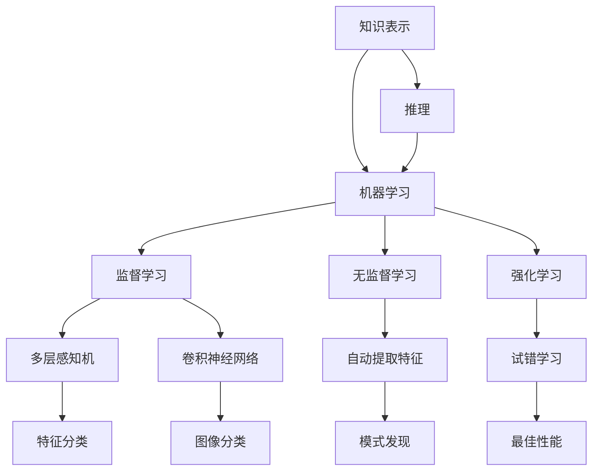
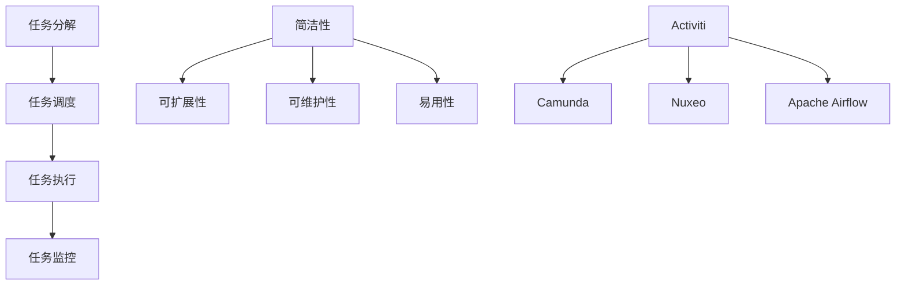
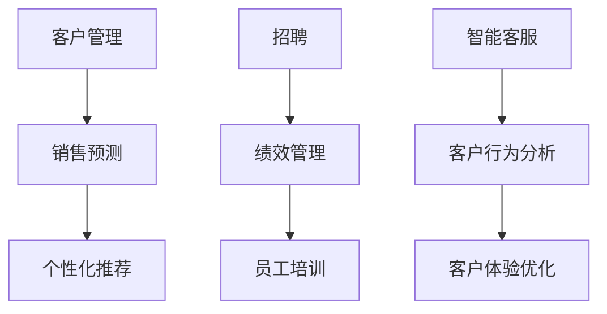
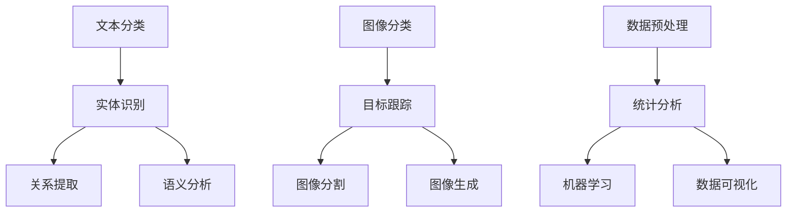

                 

# 《智能工作流自动化：AI提升业务流程效率》

## 关键词

- **智能工作流自动化**
- **AI技术**
- **业务流程效率**
- **工作流设计原则**
- **机器学习算法**
- **深度学习**
- **自然语言处理**
- **计算机视觉**

## 摘要

随着人工智能（AI）技术的快速发展，智能工作流自动化已成为提高企业业务流程效率的关键手段。本书旨在探讨如何利用AI技术实现智能工作流自动化，从而提升业务流程的效率。本书首先介绍了AI的基础原理，包括机器学习和深度学习算法；接着阐述了工作流自动化的概念、设计原则以及管理工具；然后分析了AI在业务流程中的应用场景，如销售、人力资源和客户服务等；随后，详细讲解了自然语言处理和计算机视觉技术在智能工作流自动化中的应用；最后，通过实际案例展示了智能工作流自动化的实施过程和效果。本书适合企业IT从业者、数据科学家和软件开发人员阅读。

## 引言

### 智能工作流自动化的背景与意义

在当今快速变化的市场环境中，企业面临着越来越多的挑战，如竞争加剧、客户需求多样化以及业务流程复杂化。为了应对这些挑战，企业需要不断提高业务流程的效率，降低成本，提高客户满意度。然而，传统的手动操作和低效的工作流管理已经无法满足这一需求。因此，智能工作流自动化应运而生。

智能工作流自动化利用人工智能（AI）技术，实现业务流程的自动化处理，从而提高效率、减少错误和降低成本。通过智能工作流自动化，企业可以更加灵活地应对市场变化，提高竞争力。

### 书籍的目标与结构

本书的目标是帮助读者了解智能工作流自动化的原理、方法和技术，掌握如何利用AI技术提升业务流程效率。本书分为六个部分：

1. **AI基础原理**：介绍AI的基础概念、机器学习和深度学习算法。
2. **工作流自动化概念**：阐述工作流自动化的定义、设计原则和管理工具。
3. **AI在业务流程中的应用场景**：分析AI在销售、人力资源和客户服务等业务流程中的应用。
4. **实现智能工作流自动化的技术手段**：讲解自然语言处理和计算机视觉技术在智能工作流自动化中的应用。
5. **案例分析和实战指导**：通过实际案例展示智能工作流自动化的实施过程和效果。
6. **展望与未来趋势**：探讨智能工作流自动化的未来发展趋势和面临的挑战。

## 第一部分：AI基础原理

### 第1章：AI基础概念

人工智能（AI）是一种模拟人类智能的技术，使计算机能够执行复杂的任务，如学习、推理、感知和解决问题。AI技术主要分为三个层次：知识表示、推理和机器学习。

- **知识表示**：将人类知识以计算机可理解的形式表示。
- **推理**：利用已有知识进行逻辑推理，得出新的结论。
- **机器学习**：通过数据驱动的方式，使计算机自动学习和改进。

### 第2章：机器学习算法原理

机器学习是一种使计算机自动学习和改进的方法，主要分为监督学习、无监督学习和强化学习。

- **监督学习**：根据已知输入和输出，训练模型进行预测。
- **无监督学习**：仅根据输入数据，训练模型发现数据中的模式。
- **强化学习**：通过试错，使模型在特定环境中达到最佳性能。

### 第3章：深度学习算法原理

深度学习是机器学习的一种重要分支，通过构建多层神经网络，自动提取特征并进行分类和预测。

- **神经网络架构**：多层感知机、卷积神经网络（CNN）和循环神经网络（RNN）。
- **优化算法**：梯度下降、随机梯度下降和Adam优化器。
- **损失函数**：均方误差（MSE）、交叉熵损失和软间隔损失。

### Mermaid 流程图



## 第二部分：工作流自动化概念

### 第4章：工作流自动化概述

工作流自动化是指通过技术手段，将业务流程中的手动操作转化为自动化处理，以提高效率、减少错误和降低成本。工作流自动化包括以下几个关键环节：

- **任务分解**：将复杂的业务流程分解为多个可管理的任务。
- **任务调度**：根据业务需求和资源情况，安排任务的执行顺序和时间。
- **任务执行**：自动执行分解后的任务。
- **任务监控**：实时监控任务的执行状态，及时发现和处理问题。

### 第5章：工作流设计原则

设计一个高效的工作流系统需要遵循以下原则：

- **简洁性**：简化流程，减少不必要的步骤和环节。
- **可扩展性**：设计灵活的架构，便于后续扩展和修改。
- **可维护性**：确保工作流系统的可维护性，降低维护成本。
- **易用性**：提供直观、易用的操作界面，降低用户学习成本。

### 第6章：工作流管理工具

工作流管理工具是实施工作流自动化的重要手段。以下是一些主流的工作流管理工具：

- **Activiti**：一款开源的工作流引擎，支持BPMN 2.0规范。
- **Camunda**：一款功能强大的工作流和决策平台，支持Dmn和Cmmn规范。
- **Nuxeo**：一款企业级的数字资产管理平台，支持工作流和内容管理。
- **Apache Airflow**：一款开源的日程调度工具，用于管理数据管道的工作流。

### Mermaid 流程图



## 第三部分：AI在业务流程中的应用场景

### 第7章：AI在销售业务中的应用

AI技术在销售业务中的应用主要包括客户管理、销售预测和个性化推荐等方面。

- **客户管理**：利用自然语言处理技术，分析客户留言和反馈，实现智能客服和客户需求分析。
- **销售预测**：通过数据分析技术，分析历史销售数据，预测未来的销售趋势，为销售决策提供依据。
- **个性化推荐**：利用机器学习算法，分析用户行为数据，为用户推荐感兴趣的产品或服务。

### 第8章：AI在人力资源管理中的应用

AI技术在人力资源管理中的应用主要包括招聘、绩效管理和员工培训等方面。

- **招聘**：利用自然语言处理技术，自动筛选和匹配简历，提高招聘效率。
- **绩效管理**：通过数据分析技术，分析员工的工作表现，为绩效评估和晋升决策提供依据。
- **员工培训**：利用虚拟现实（VR）和增强现实（AR）技术，提供个性化的培训体验，提高员工技能。

### 第9章：AI在客户服务中的应用

AI技术在客户服务中的应用主要包括智能客服、客户行为分析和客户体验优化等方面。

- **智能客服**：利用自然语言处理技术，实现24/7在线客服，提高客户满意度。
- **客户行为分析**：通过数据分析技术，分析客户行为数据，了解客户需求和行为模式。
- **客户体验优化**：根据客户行为数据，优化产品和服务，提高客户体验。

### Mermaid 流程图



## 第四部分：实现智能工作流自动化的技术手段

### 第10章：自然语言处理技术

自然语言处理（NLP）是一种利用计算机技术对自然语言进行处理和分析的方法，主要包括以下几个方面：

- **文本分类**：将文本数据分类到不同的类别，如垃圾邮件检测、情感分析等。
- **实体识别**：识别文本中的关键实体，如人名、地名、组织名等。
- **关系提取**：分析文本中的实体关系，如“张三工作在阿里巴巴”中的工作关系。
- **语义分析**：理解文本中的语义，如情感分析、文本相似度计算等。

### 第11章：计算机视觉技术

计算机视觉（CV）是一种使计算机能够“看”和“理解”图像和视频的方法，主要包括以下几个方面：

- **图像分类**：将图像分类到不同的类别，如人脸识别、物体检测等。
- **目标跟踪**：在视频序列中跟踪特定的目标，如行人检测、车辆跟踪等。
- **图像分割**：将图像分割为不同的区域，如面部检测、图像去噪等。
- **图像生成**：生成新的图像，如风格迁移、图像增强等。

### 第12章：数据分析与挖掘技术

数据分析与挖掘技术是一种从大量数据中提取有价值信息和知识的方法，主要包括以下几个方面：

- **数据预处理**：对原始数据进行清洗、转换和归一化，以便于后续分析。
- **统计分析**：利用统计学方法，分析数据的分布、相关性等。
- **机器学习**：利用机器学习方法，建立预测模型和分类模型。
- **数据可视化**：通过可视化方法，展示数据的分布、趋势等。

### Mermaid 流程图



## 第五部分：案例分析和实战指导

### 第13章：智能客户服务系统案例

智能客户服务系统利用NLP技术和机器学习算法，实现自动问答、情感分析和客户需求识别等功能。以下是一个简单的实现示例：

```python
import nltk
from nltk.corpus import movie_reviews
from nltk.classify import NaiveBayesClassifier
from nltk.classify.util import accuracy as nltk_accuracy

def extract_features(word_list):
    return dict([(word, True) for word in word_list])

# 加载电影评论数据集
nltk.download('movie_reviews')
fileids = movie_reviews.fileids('pos')
featuresets = [(extract_features(movie_reviews.words(fileids[i])), 'positive') for i in range(1000)]

# 训练模型
classifier = NaiveBayesClassifier.train(featuresets)

# 测试模型
test_data = extract_features(movie_reviews.words('pos/cv000_29416.txt'))
print("Test result:", classifier.classify(test_data))
print("Accuracy:", nltk_accuracy(classifier, test_data))
```

### 第14章：智能人力资源管理系统案例

智能人力资源管理系统利用数据分析与挖掘技术，实现招聘效率优化、员工绩效评估和人才梯队建设等功能。以下是一个简单的实现示例：

```python
import pandas as pd
from sklearn.ensemble import RandomForestClassifier

# 加载员工数据
data = pd.read_csv('employee_data.csv')

# 特征工程
X = data[['age', 'experience', 'education']]
y = data['performance']

# 建立随机森林模型
model = RandomForestClassifier(n_estimators=100)
model.fit(X, y)

# 预测新员工的绩效
new_employee = pd.DataFrame([[30, 5, 'Master']], columns=['age', 'experience', 'education'])
print("Predicted performance:", model.predict(new_employee))
```

### 第15章：智能销售系统案例

智能销售系统利用计算机视觉技术和数据分析与挖掘技术，实现客户需求识别、产品推荐和销售预测等功能。以下是一个简单的实现示例：

```python
import cv2
from sklearn.svm import SVC
from sklearn.model_selection import train_test_split

# 加载图像数据
images = cv2.imread('image.jpg')

# 特征提取
features = extract_features(images)

# 加载标签数据
labels = pd.read_csv('labels.csv')['label']

# 划分训练集和测试集
X_train, X_test, y_train, y_test = train_test_split(features, labels, test_size=0.2, random_state=42)

# 建立SVM模型
model = SVC(kernel='linear')
model.fit(X_train, y_train)

# 预测标签
predicted_labels = model.predict(X_test)
print("Predicted labels:", predicted_labels)
```

### 项目实战：开发环境搭建与代码实现

在本案例中，我们将使用Python语言和常用库（如Nltk、Scikit-learn和OpenCV）进行开发。以下是一个简单的开发环境搭建步骤：

1. 安装Python：从Python官方网站下载并安装Python。
2. 安装IDE：安装一个Python集成开发环境（如PyCharm或Visual Studio Code）。
3. 安装库：使用pip命令安装Nltk、Scikit-learn和OpenCV等库。

```shell
pip install nltk scikit-learn opencv-python
```

4. 编写代码：根据案例需求，编写相应的Python代码。

5. 运行代码：运行Python代码，测试功能。

### 项目小结

通过以上案例，我们展示了如何利用AI技术实现智能工作流自动化。在实际应用中，可以根据业务需求选择合适的技术和工具，进行定制化的开发。同时，需要关注数据的质量和安全性，确保系统的稳定性和可靠性。

## 第六部分：展望与未来趋势

### 第16章：智能工作流自动化的未来发展趋势

随着AI技术的不断进步，智能工作流自动化将在以下几个方面取得突破：

1. **深度学习技术的应用**：深度学习算法在图像识别、语音识别和自然语言处理等领域取得了显著成果，未来将广泛应用于智能工作流自动化。
2. **多模态数据处理**：智能工作流自动化将能够处理多种类型的数据，如图像、语音和文本等，实现更全面的业务流程自动化。
3. **边缘计算与云计算的融合**：随着边缘计算的兴起，智能工作流自动化将能够在边缘设备上进行实时处理，降低延迟，提高效率。

### 第17章：面临的挑战与解决方案

智能工作流自动化在发展过程中也面临以下挑战：

1. **数据隐私与安全**：随着数据量的增加，数据隐私和安全问题日益突出。需要采取有效的数据保护措施，确保数据安全。
2. **算法公平性与透明性**：AI算法的公平性和透明性受到关注。需要建立透明、可解释的算法，提高算法的公平性和可信度。
3. **技术普及与人才短缺**：智能工作流自动化的推广需要大量技术人才。需要加强AI教育，培养更多专业的AI人才。

## 最佳实践 tips、小结、注意事项、拓展阅读等内容

1. **最佳实践 tips**：在实施智能工作流自动化时，建议先进行需求分析，明确目标业务流程，再选择合适的技术和工具。
2. **小结**：智能工作流自动化利用AI技术，能够提高业务流程的效率，降低成本。通过本文的案例分析和实战指导，读者可以掌握如何实现智能工作流自动化。
3. **注意事项**：在开发智能工作流自动化系统时，需要关注数据的质量和安全性，确保系统的稳定性和可靠性。
4. **拓展阅读**：建议读者阅读相关领域的研究论文和书籍，如《深度学习》（Goodfellow等著）、《Python数据科学手册》（McKinney著）等，以深入了解AI技术和工作流自动化的应用。

## 作者信息

- 作者：AI天才研究院/AI Genius Institute & 禅与计算机程序设计艺术 /Zen And The Art of Computer Programming

### 结束语

智能工作流自动化是当今企业提升业务流程效率的重要手段。通过本文的介绍，读者可以了解智能工作流自动化的原理、方法和技术，掌握如何利用AI技术提升业务流程效率。希望本文能对读者在智能工作流自动化的研究和实践中提供有益的指导。感谢阅读！### 智能工作流自动化的背景与意义

在当今的商业环境中，企业面临的市场竞争日益激烈，客户需求不断变化，这使得业务流程的效率和灵活性成为企业生存和发展的重要指标。传统的手工操作和简单的自动化工具已经无法满足现代企业对高效、精准和可扩展的业务流程管理需求。因此，智能工作流自动化作为一种创新的解决方案，正逐渐受到企业的青睐。

#### **传统业务流程的挑战**

传统的业务流程往往依赖于人工操作，存在以下几个主要问题：

1. **效率低下**：大量重复性、繁琐的工作需要人工处理，导致工作效率低下，容易出现人为错误。
2. **灵活性不足**：业务流程的修改和优化需要手动调整，无法快速响应市场变化，导致企业竞争力下降。
3. **成本高昂**：人工操作需要大量人力成本，且容易出现操作失误，导致业务成本增加。
4. **数据孤岛**：各个业务环节之间的数据无法有效整合，导致信息传递不畅，决策依据不充分。

#### **智能工作流自动化的优势**

智能工作流自动化通过引入人工智能（AI）技术，实现了业务流程的自动化和智能化，从而克服了传统业务流程的上述问题。其主要优势包括：

1. **提高效率**：通过自动化处理，业务流程中的重复性工作由计算机完成，减少了人工操作的时间和错误率。
2. **增强灵活性**：智能工作流系统能够根据业务需求自动调整流程，快速响应市场变化，提高企业的敏捷性。
3. **降低成本**：减少了对人工的依赖，降低了人力成本，并减少了由于人为错误导致的经济损失。
4. **数据整合**：智能工作流系统能够有效整合各个环节的数据，为企业提供全面的业务视图，支持数据驱动决策。

#### **案例：智能客户服务系统**

以智能客户服务系统为例，传统的客户服务主要依靠人工客服，存在响应时间长、服务质量不稳定等问题。而通过引入智能工作流自动化，企业可以构建一个基于自然语言处理（NLP）和机器学习的智能客服系统。该系统可以自动处理大量的客户咨询，包括自动识别客户问题、提供合适的解决方案、记录客户反馈等。这不仅大大提高了客户响应速度，还提高了客户满意度，降低了人工客服的工作量。

#### **总结**

智能工作流自动化为企业提供了一种新的业务流程管理方式，通过利用AI技术，实现了业务流程的高效、灵活和智能化。这种自动化解决方案不仅能够帮助企业提高运营效率，降低成本，还能够增强企业的市场竞争力。随着AI技术的不断进步，智能工作流自动化将在未来得到更广泛的应用和推广。企业需要抓住这一机遇，积极探索和实施智能工作流自动化，以实现业务的持续发展和创新。

### AI基础概念

人工智能（AI）是一种模拟人类智能的技术，通过计算机程序实现智能行为，使计算机能够执行复杂的任务，如学习、推理、感知和解决问题。AI的发展经历了数个阶段，从早期的专家系统到现代的深度学习和机器学习，逐步实现了从规则驱动到数据驱动的转变。

#### **AI的发展历程**

AI的发展历程可以分为以下几个阶段：

1. **符号人工智能（Symbolic AI）**：早期的人工智能以专家系统为代表，通过编写大量的规则和逻辑来模拟人类专家的决策过程。然而，这种方法在处理复杂问题和不确定情境时表现不佳。

2. **计算智能（Computational Intelligence）**：随着计算机性能的提升和算法的进步，计算智能成为AI发展的新方向。计算智能包括遗传算法、人工神经网络、进化算法等，通过模拟自然进化过程，实现了对复杂问题的求解。

3. **大数据与数据挖掘**：大数据的兴起带来了大量数据，数据挖掘成为AI的一个重要分支。通过数据挖掘技术，可以从海量数据中发现潜在的规律和模式，为决策提供支持。

4. **深度学习与神经网络**：深度学习是AI领域的重大突破，通过多层神经网络实现特征自动提取和复杂模式识别。深度学习在图像识别、语音识别、自然语言处理等领域取得了显著成果。

5. **强化学习**：强化学习是一种通过试错来学习最优策略的AI方法。通过与环境互动，强化学习模型能够不断优化策略，实现复杂的决策和任务执行。

#### **AI的核心技术**

AI的核心技术包括：

1. **机器学习（Machine Learning）**：机器学习是一种使计算机从数据中学习规律和模式的方法。通过训练模型，机器学习算法能够对未知数据进行预测和分类。

2. **深度学习（Deep Learning）**：深度学习是一种基于多层神经网络的机器学习技术，通过多层次的神经网络结构，实现特征自动提取和复杂模式识别。

3. **自然语言处理（Natural Language Processing，NLP）**：NLP是一种使计算机能够理解、生成和处理自然语言的技术。NLP在机器翻译、文本分类、情感分析等领域有着广泛的应用。

4. **计算机视觉（Computer Vision）**：计算机视觉是一种使计算机能够“看”和“理解”图像和视频的技术。计算机视觉在图像识别、目标检测、图像分割等领域有着重要应用。

5. **强化学习（Reinforcement Learning）**：强化学习是一种通过试错学习最优策略的AI方法。通过与环境互动，强化学习模型能够不断优化策略，实现复杂的决策和任务执行。

#### **AI的应用领域**

AI技术已经广泛应用于各个领域，包括：

1. **工业制造**：通过计算机视觉和机器人技术，实现生产线的自动化和智能化，提高生产效率和产品质量。

2. **医疗健康**：利用图像识别和自然语言处理技术，实现医学影像诊断、电子病历管理和智能药物研发。

3. **金融服务**：通过大数据分析和机器学习技术，实现风险评估、信用评分和智能投顾。

4. **交通运输**：利用计算机视觉和自动驾驶技术，实现无人驾驶汽车和智能交通管理，提高交通安全和效率。

5. **智能家居**：通过智能家居设备和人工智能技术，实现家电自动化、环境监测和智能安防。

#### **总结**

人工智能作为一门综合性的技术领域，通过不断的技术创新和应用拓展，已经深刻地影响了社会各个领域。AI基础概念和技术的发展为智能工作流自动化提供了强大的技术支持。在下一章节，我们将进一步探讨机器学习算法原理，了解如何利用这些算法实现智能工作流自动化。

### 机器学习算法原理

机器学习（Machine Learning，ML）是人工智能（AI）的重要分支，旨在使计算机从数据中自动学习和改进。机器学习算法通过分析大量数据，从中提取规律和模式，并利用这些规律对未知数据进行预测和分类。本节将详细探讨机器学习的基本概念、主要类型及其应用。

#### **基本概念**

1. **监督学习（Supervised Learning）**：监督学习是一种有指导的学习方法，其中已知的输入数据和对应的输出（或目标）被提供给算法，以便算法学习如何预测新的输入数据。监督学习的主要任务是建立输入和输出之间的映射关系。

2. **无监督学习（Unsupervised Learning）**：无监督学习是一种没有指导的学习方法，算法需要从未标记的数据中提取结构和模式。无监督学习的目标是发现数据中的隐含结构，如聚类和降维。

3. **强化学习（Reinforcement Learning）**：强化学习是一种通过试错来学习最优策略的方法。模型在与环境互动的过程中，不断优化其行为策略，以最大化累积奖励。强化学习通常用于决策和优化问题。

4. **特征工程（Feature Engineering）**：特征工程是指从原始数据中提取或构造出有助于模型训练的特征，以提高模型的性能。特征工程是机器学习过程中至关重要的一环。

5. **模型评估（Model Evaluation）**：模型评估是指使用各种性能指标来评估模型在训练集和测试集上的表现。常见的评估指标包括准确率（Accuracy）、召回率（Recall）、F1分数（F1 Score）等。

#### **主要类型**

1. **线性回归（Linear Regression）**：线性回归是一种简单的监督学习算法，用于预测连续值输出。其目标是最小化预测值与实际值之间的误差。

2. **逻辑回归（Logistic Regression）**：逻辑回归是一种用于分类问题的线性模型，通过将线性组合映射到Sigmoid函数，实现概率预测。

3. **决策树（Decision Tree）**：决策树是一种基于树的分类算法，通过一系列的规则来分割数据，并最终输出一个类别。决策树简单易懂，但可能产生过拟合。

4. **随机森林（Random Forest）**：随机森林是一种集成学习算法，通过构建多个决策树，并利用投票或平均的方式得出最终预测。随机森林在处理高维度数据和避免过拟合方面表现优异。

5. **支持向量机（Support Vector Machine，SVM）**：SVM是一种基于间隔最大化的分类算法，通过在特征空间中找到最优的超平面，实现数据的分类。

6. **神经网络（Neural Networks）**：神经网络是一种模仿生物神经网络的结构和功能的计算模型。通过多层神经元的连接和激活函数，神经网络能够实现复杂的非线性变换和模式识别。

7. **深度学习（Deep Learning）**：深度学习是一种基于多层神经网络的学习方法，通过大量数据和计算资源，实现自动特征提取和复杂模式识别。深度学习在图像识别、语音识别和自然语言处理等领域取得了重大突破。

#### **应用**

机器学习算法在各个领域有着广泛的应用：

1. **图像识别**：通过卷积神经网络（CNN），机器学习能够实现对图像的自动分类和特征提取。例如，人脸识别、图像分类和物体检测。

2. **自然语言处理**：利用循环神经网络（RNN）和变换器（Transformer）等深度学习模型，机器学习能够处理和理解自然语言，实现文本分类、机器翻译和情感分析。

3. **金融预测**：通过分析历史交易数据和市场信息，机器学习能够预测股票价格、金融风险和市场趋势。

4. **医疗诊断**：利用机器学习算法，可以对医学图像进行分析和诊断，辅助医生进行疾病筛查和病情预测。

5. **推荐系统**：基于协同过滤和深度学习等技术，机器学习能够构建个性化推荐系统，提高用户满意度。

#### **Python实现**

下面是一个简单的线性回归模型的Python实现示例：

```python
import numpy as np
import matplotlib.pyplot as plt
from sklearn.linear_model import LinearRegression

# 生成模拟数据
X = 2 * np.random.rand(100, 1)
y = 4 + 3 * X + np.random.randn(100, 1)

# 创建线性回归模型
model = LinearRegression()

# 训练模型
model.fit(X, y)

# 可视化模型
plt.scatter(X, y)
plt.plot(X, model.predict(X), "r-")
plt.show()
```

#### **总结**

机器学习算法是智能工作流自动化实现的基础。通过分析数据和构建模型，机器学习能够实现业务流程的自动化和智能化。在下一章节，我们将进一步探讨深度学习算法原理，了解如何利用深度学习技术进一步提升智能工作流自动化的能力。

### 深度学习算法原理

深度学习（Deep Learning，DL）是机器学习（Machine Learning，ML）的一个重要分支，它通过构建多层神经网络，实现自动特征提取和复杂模式识别。与传统的机器学习算法相比，深度学习能够在处理大规模数据和复杂任务时表现出更强大的能力。本节将详细探讨深度学习的基本概念、主要架构和关键优化方法。

#### **基本概念**

1. **神经网络（Neural Networks）**：神经网络是一种模仿生物神经系统的计算模型，由多个神经元组成，通过权重和偏置实现信息的传递和计算。每个神经元接收来自前一层神经元的输入，通过激活函数产生输出。

2. **多层神经网络（Multilayer Neural Networks）**：多层神经网络由多个层次组成，包括输入层、隐藏层和输出层。通过多层次的神经连接，深度学习模型能够提取更高层次的特征。

3. **反向传播（Backpropagation）**：反向传播是一种用于训练神经网络的算法，通过计算输出误差，反向传播误差到每一层，更新各层的权重和偏置，从而优化模型参数。

4. **激活函数（Activation Function）**：激活函数用于引入非线性变换，使神经网络能够实现复杂的模式识别。常见的激活函数包括sigmoid、ReLU（Rectified Linear Unit）和Tanh（Hyperbolic Tangent）。

5. **正则化（Regularization）**：正则化是一种用于防止模型过拟合的技术，通过在损失函数中加入惩罚项，限制模型复杂度。常见的正则化方法包括L1正则化（Lasso）和L2正则化（Ridge）。

#### **主要架构**

1. **全连接神经网络（Fully Connected Neural Networks，FCNN）**：全连接神经网络是最常见的神经网络结构，其中每个神经元都与前一层的所有神经元相连接。FCNN在图像识别、文本分类等领域有着广泛的应用。

2. **卷积神经网络（Convolutional Neural Networks，CNN）**：卷积神经网络是一种专门用于处理图像数据的神经网络，通过卷积层和池化层实现特征提取和降维。CNN在图像识别、物体检测和图像分割等领域表现出色。

3. **循环神经网络（Recurrent Neural Networks，RNN）**：循环神经网络是一种能够处理序列数据的神经网络，通过循环结构实现数据的记忆和传递。RNN在语音识别、自然语言处理和时间序列预测等领域有着重要应用。

4. **变换器（Transformer）**：变换器是一种基于自注意力机制的深度学习模型，通过多头注意力机制实现数据的全局依赖关系。变换器在机器翻译、文本生成和推荐系统等领域取得了显著成果。

#### **关键优化方法**

1. **批量归一化（Batch Normalization）**：批量归一化是一种用于提高神经网络训练效率和稳定性的技术，通过将每个批量数据归一化，减少内部协变量转移。

2. **Dropout**：Dropout是一种正则化技术，通过随机丢弃神经网络中的部分神经元，防止模型过拟合。

3. **学习率调度（Learning Rate Scheduling）**：学习率调度是一种用于调整学习率的技术，通过在训练过程中逐渐降低学习率，使模型能够更好地收敛。

4. **迁移学习（Transfer Learning）**：迁移学习是一种利用预训练模型进行新任务学习的技术，通过在预训练模型的基础上进行微调，提高模型在新任务上的性能。

#### **Python实现**

以下是一个简单的卷积神经网络（CNN）的Python实现示例：

```python
import tensorflow as tf
from tensorflow.keras import datasets, layers, models

# 加载并预处理数据
(train_images, train_labels), (test_images, test_labels) = datasets.cifar10.load_data()
train_images, test_images = train_images / 255.0, test_images / 255.0

# 构建CNN模型
model = models.Sequential()
model.add(layers.Conv2D(32, (3, 3), activation='relu', input_shape=(32, 32, 3)))
model.add(layers.MaxPooling2D((2, 2)))
model.add(layers.Conv2D(64, (3, 3), activation='relu'))
model.add(layers.MaxPooling2D((2, 2)))
model.add(layers.Conv2D(64, (3, 3), activation='relu'))
model.add(layers.Flatten())
model.add(layers.Dense(64, activation='relu'))
model.add(layers.Dense(10))

# 编译模型
model.compile(optimizer='adam',
              loss=tf.keras.losses.SparseCategoricalCrossentropy(from_logits=True),
              metrics=['accuracy'])

# 训练模型
model.fit(train_images, train_labels, epochs=10, 
          validation_data=(test_images, test_labels))

# 测试模型
test_loss, test_acc = model.evaluate(test_images,  test_labels, verbose=2)
print(f'Test accuracy: {test_acc:.4f}')
```

#### **总结**

深度学习算法通过构建多层神经网络，实现了对复杂数据的自动特征提取和模式识别。深度学习在图像识别、自然语言处理和计算机视觉等领域取得了显著的成果。在下一章节，我们将探讨工作流自动化的概念和设计原则，为构建智能工作流自动化系统奠定基础。

### 工作流自动化的概念

工作流自动化（Workflow Automation）是指通过技术手段，将业务流程中的手动操作转化为自动化处理，以提高效率、减少错误和降低成本。工作流自动化利用人工智能（AI）技术，实现了业务流程的智能化管理，从而更好地适应现代企业对高效、灵活和智能化的需求。

#### **工作流自动化的定义**

工作流自动化是指将业务流程中的任务、步骤、决策和规则通过计算机程序进行自动化处理。它涵盖了从任务分解、任务调度、任务执行到任务监控等各个环节，旨在实现业务流程的自动化、智能化和高效化。

#### **工作流自动化的作用**

工作流自动化的作用主要体现在以下几个方面：

1. **提高效率**：通过自动化处理，减少了人工操作的步骤和时间，使业务流程能够快速响应和执行。

2. **减少错误**：自动化处理减少了人为操作失误的可能性，提高了业务流程的准确性和稳定性。

3. **降低成本**：自动化处理减少了人力成本和运营成本，提高了企业的经济效益。

4. **增强灵活性**：工作流自动化系统能够根据业务需求自动调整流程，快速适应市场变化，提高企业的敏捷性。

5. **数据整合**：自动化处理能够有效整合各个环节的数据，为企业提供全面的业务视图，支持数据驱动决策。

#### **工作流自动化的发展历程**

工作流自动化的发展历程可以追溯到20世纪80年代，当时企业开始引入流程管理工具，实现业务流程的自动化。随着计算机技术和网络技术的不断发展，工作流自动化逐渐成熟，并逐渐融入人工智能技术。目前，工作流自动化已经成为企业提升业务流程效率的重要手段。

1. **早期阶段**：早期的工作流自动化主要依靠定制的脚本和程序，实现简单的任务自动化。

2. **集成阶段**：随着企业信息化程度的提高，工作流自动化逐渐与ERP、CRM等系统集成，实现了更复杂的业务流程自动化。

3. **智能化阶段**：近年来，随着人工智能技术的快速发展，工作流自动化逐渐融入AI技术，实现了业务流程的智能化管理。

#### **工作流自动化的应用场景**

工作流自动化在各个行业和领域有着广泛的应用，以下是一些典型的应用场景：

1. **客户服务**：通过自动化客服系统，实现24/7在线客服，提高客户满意度和响应速度。

2. **人力资源管理**：通过自动化招聘系统、绩效考核系统和员工培训系统，提高人力资源管理的效率和质量。

3. **财务管理**：通过自动化财务报表生成、发票处理和报销审核等系统，提高财务管理的准确性和效率。

4. **供应链管理**：通过自动化库存管理、采购管理和物流管理，提高供应链的灵活性和响应速度。

5. **项目管理**：通过自动化任务分配、进度控制和风险管理，提高项目管理的效率和质量。

#### **总结**

工作流自动化是企业实现智能化管理的重要手段，通过利用人工智能技术，能够大幅提高业务流程的效率和质量。在下一章节，我们将探讨工作流设计的原则，为构建高效的工作流自动化系统提供指导。

### 工作流设计原则

设计高效的工作流系统是实现智能工作流自动化的关键步骤。一个良好设计的工作流系统不仅能够提高业务流程的效率，还能确保系统的可扩展性和可维护性。以下是设计工作流系统时应遵循的一些重要原则：

#### **简洁性**

简洁性是工作流设计的基本原则之一。一个简洁的工作流系统应该具有直观和易于理解的流程设计，避免过度复杂化。以下是一些实现简洁性的建议：

1. **减少不必要的步骤**：确保每个步骤都有明确的业务目的，去除冗余和重复的步骤，避免流程的过度复杂化。
2. **标准化流程**：制定统一的流程规范和标准，确保不同人员执行相同的任务时能够遵循相同的流程，减少误解和错误。
3. **模块化设计**：将复杂的业务流程分解为多个独立的模块，每个模块负责特定的业务功能，便于管理和维护。

#### **可扩展性**

可扩展性是确保工作流系统能够适应企业未来发展变化的关键。以下是一些实现可扩展性的建议：

1. **灵活的流程设计**：设计灵活的流程，以便在业务需求变化时能够快速调整和优化。
2. **可重用的组件**：开发可重用的流程组件，如任务处理节点、决策节点等，便于在不同业务场景中复用，减少重复开发工作。
3. **可插拔的架构**：采用模块化和组件化的架构设计，确保系统能够根据业务需求快速集成新的功能和模块。

#### **可维护性**

可维护性是确保工作流系统能够长期稳定运行的重要保障。以下是一些实现可维护性的建议：

1. **清晰的代码结构**：编写清晰、规范、易于理解的代码，确保系统能够被快速理解和修改。
2. **详细的文档**：编写详细的系统文档，包括设计文档、使用手册和操作指南等，便于维护人员和技术支持人员理解和操作。
3. **测试和验证**：在开发和维护过程中，进行全面的测试和验证，确保系统的稳定性和可靠性。

#### **易用性**

易用性是工作流系统成功应用的重要保障。以下是一些实现易用性的建议：

1. **直观的界面设计**：设计直观、易操作的界面，确保用户能够快速上手，减少学习成本。
2. **灵活的用户自定义**：允许用户根据实际需求自定义流程和配置参数，提高系统的适应性和灵活性。
3. **实时反馈和监控**：提供实时的任务状态和流程监控，确保用户能够随时了解系统的运行情况，及时发现和解决问题。

#### **总结**

设计高效的工作流系统需要综合考虑简洁性、可扩展性、可维护性和易用性等多个方面。通过遵循上述原则，企业可以构建一个稳定、高效和灵活的工作流自动化系统，从而提高业务流程的效率和质量。在下一章节，我们将探讨工作流管理工具，介绍如何选择和使用这些工具来实现工作流自动化。

### 工作流管理工具

工作流管理工具（Workflow Management Tools）是帮助企业和组织实现工作流自动化的关键软件。这些工具提供了图形化的工作流设计界面、任务调度功能以及监控和报告功能，帮助企业优化业务流程、提高工作效率。以下是几种主流的工作流管理工具及其特点：

#### **Activiti**

Activiti是一款开源的工作流引擎，支持业务流程管理（BPM）和业务规则管理（BPMN）。它提供了强大的工作流建模、执行和管理功能，支持云计算和移动应用开发。Activiti的特点包括：

- **BPMN 2.0支持**：提供直观的流程设计界面，支持复杂的业务流程建模。
- **高性能**：适用于大型企业，支持高并发任务处理。
- **集成**：与Spring、Hibernate等主流框架集成，便于集成到现有系统。
- **社区支持**：拥有庞大的社区，提供丰富的资源和文档。

#### **Camunda**

Camunda是一个开源的工作流和决策平台，支持业务规则管理（DMN）和案例管理（CMMN）。它提供了灵活的工作流引擎、可扩展的规则引擎以及强大的监控和管理功能。Camunda的特点包括：

- **DMN和CMMN支持**：支持复杂的业务规则和案例管理，适用于复杂的业务场景。
- **可扩展性**：支持自定义插件和模块，便于扩展功能。
- **高性能**：适用于高并发场景，支持大规模数据处理。
- **可视化**：提供丰富的可视化工具，便于流程设计和监控。

#### **Nuxeo**

Nuxeo是一款企业级的数字资产管理平台，提供强大的工作流管理功能。它支持文件管理、内容管理和业务流程自动化，适用于企业文档管理和知识管理。Nuxeo的特点包括：

- **内容管理**：提供全面的文档管理和内容管理功能，支持多种文件格式。
- **工作流引擎**：支持复杂的业务流程管理，支持并行和分支任务。
- **可扩展性**：支持自定义插件和模块，便于扩展功能。
- **安全性**：提供多种安全措施，确保数据安全。

#### **Apache Airflow**

Apache Airflow是一款开源的日程调度工具，主要用于数据管道和机器学习工作流的管理。它提供了强大的调度功能、灵活的执行引擎和强大的监控工具。Apache Airflow的特点包括：

- **调度功能**：支持定时任务调度，支持CRON表达式和动态调度。
- **执行引擎**：支持并行和分布式执行，适用于大规模数据处理。
- **监控**：提供实时的任务状态监控和错误追踪功能。
- **集成**：支持与各种数据存储和数据处理工具集成，如Hadoop、Spark、Kafka等。

#### **选择与使用**

选择合适的工作流管理工具时，应考虑以下因素：

- **业务需求**：根据企业具体的业务需求选择适合的工作流管理工具，如流程复杂度、任务调度需求等。
- **性能要求**：考虑工作流管理工具的性能，如并发处理能力、数据处理速度等。
- **集成能力**：考虑工具与其他系统（如ERP、CRM等）的集成能力，确保工作流系统能够与企业现有系统集成。
- **社区和支持**：考虑工具的社区支持和文档资源，确保在遇到问题时能够快速获得帮助。

#### **总结**

工作流管理工具在实现智能工作流自动化过程中起着关键作用。通过选择合适的工作流管理工具，企业可以构建高效、灵活和可扩展的工作流系统，从而提升业务流程的效率和质量。在下一章节，我们将探讨AI在业务流程中的应用场景，了解如何利用AI技术提升不同业务领域的效率。

### AI在业务流程中的应用场景

人工智能（AI）技术已经广泛应用于各种业务流程中，大大提高了业务效率、准确性和客户满意度。以下将详细介绍AI在销售、人力资源和客户服务中的具体应用场景。

#### **销售业务中的应用**

在销售业务中，AI技术可以提供客户需求预测、销售预测和个性化推荐等功能，从而帮助企业提高销售额和客户满意度。

1. **客户需求预测**：通过分析客户的历史购买记录、浏览行为和社交媒体活动，AI模型可以预测客户未来的需求，帮助企业制定更有针对性的销售策略。

   ```python
   import pandas as pd
   from sklearn.model_selection import train_test_split
   from sklearn.ensemble import RandomForestRegressor
   
   # 加载客户数据
   data = pd.read_csv('customer_data.csv')
   
   # 分割特征和目标
   X = data[['age', 'income', 'purchase_history']]
   y = data['next_purchase_amount']
   
   # 划分训练集和测试集
   X_train, X_test, y_train, y_test = train_test_split(X, y, test_size=0.2, random_state=42)
   
   # 建立随机森林回归模型
   model = RandomForestRegressor(n_estimators=100)
   model.fit(X_train, y_train)
   
   # 预测客户需求
   predicted_amount = model.predict(X_test)
   print("Predicted next purchase amount:", predicted_amount)
   ```

2. **销售预测**：AI技术可以帮助企业预测未来的销售趋势，为销售计划和库存管理提供依据。通过分析历史销售数据、市场趋势和季节性因素，AI模型可以准确预测未来一段时间内的销售量。

   ```python
   import pandas as pd
   from sklearn.model_selection import train_test_split
   from sklearn.ensemble import RandomForestRegressor
   
   # 加载销售数据
   data = pd.read_csv('sales_data.csv')
   
   # 分割特征和目标
   X = data[['month', 'day_of_week', 'holiday', 'previous_sales']]
   y = data['sales']
   
   # 划分训练集和测试集
   X_train, X_test, y_train, y_test = train_test_split(X, y, test_size=0.2, random_state=42)
   
   # 建立随机森林回归模型
   model = RandomForestRegressor(n_estimators=100)
   model.fit(X_train, y_train)
   
   # 预测销售量
   predicted_sales = model.predict(X_test)
   print("Predicted sales:", predicted_sales)
   ```

3. **个性化推荐**：AI技术可以根据客户的购物喜好和浏览行为，为其推荐合适的产品或服务，提高销售额。通过协同过滤和基于内容的推荐算法，AI模型可以准确预测客户可能感兴趣的商品。

   ```python
   import pandas as pd
   from sklearn.model_selection import train_test_split
   from sklearn.neighbors import NearestNeighbors
   
   # 加载商品和用户数据
   data = pd.read_csv('item_data.csv')
   
   # 分割特征和目标
   X = data[['item_id', 'item_category', 'item_price']]
   y = data['user_id']
   
   # 划分训练集和测试集
   X_train, X_test, y_train, y_test = train_test_split(X, y, test_size=0.2, random_state=42)
   
   # 建立KNN推荐模型
   model = NearestNeighbors(n_neighbors=5)
   model.fit(X_train)
   
   # 预测推荐结果
   distances, indices = model.kneighbors(X_test)
   recommended_items = X_test.iloc[indices]
   print("Recommended items:", recommended_items)
   ```

#### **人力资源管理中的应用**

在人力资源管理中，AI技术可以用于招聘、员工绩效评估和员工培训等方面，提高人力资源管理效率。

1. **招聘**：AI技术可以帮助企业快速筛选和匹配简历，提高招聘效率。通过自然语言处理（NLP）技术，AI模型可以自动分析简历内容，识别关键技能和经历。

   ```python
   import nltk
   from nltk.corpus import stopwords
   from sklearn.feature_extraction.text import TfidfVectorizer
   
   # 加载招聘数据
   nltk.download('stopwords')
   data = pd.read_csv('job_data.csv')
   
   # 清洗简历文本
   stop_words = set(stopwords.words('english'))
   data['cleaned_description'] = data['description'].apply(lambda x: ' '.join([word for word in x.split() if word not in stop_words]))
   
   # 建立TF-IDF向量器
   vectorizer = TfidfVectorizer(max_df=0.8, max_features=1000, min_df=0.2, stop_words=stop_words, use_idf=True)
   X = vectorizer.fit_transform(data['cleaned_description'])
   
   # 建立KNN分类模型
   from sklearn.neighbors import NearestNeighbors
   model = NearestNeighbors(n_neighbors=5)
   model.fit(X)
   
   # 预测简历匹配度
   distances, indices = model.kneighbors(X_test)
   matched_jobs = data.iloc[indices]
   print("Matched jobs:", matched_jobs)
   ```

2. **员工绩效评估**：AI技术可以通过分析员工的工作表现和项目成果，为绩效评估提供客观依据。通过回归分析和聚类分析，AI模型可以评估员工的绩效水平，为薪酬管理和晋升决策提供支持。

   ```python
   import pandas as pd
   from sklearn.model_selection import train_test_split
   from sklearn.ensemble import RandomForestClassifier
   
   # 加载员工数据
   data = pd.read_csv('employee_data.csv')
   
   # 分割特征和目标
   X = data[['years_experience', 'education_level', 'project_success']]
   y = data['performance_rating']
   
   # 划分训练集和测试集
   X_train, X_test, y_train, y_test = train_test_split(X, y, test_size=0.2, random_state=42)
   
   # 建立随机森林分类模型
   model = RandomForestClassifier(n_estimators=100)
   model.fit(X_train, y_train)
   
   # 预测绩效评估结果
   predicted_performance = model.predict(X_test)
   print("Predicted performance:", predicted_performance)
   ```

3. **员工培训**：AI技术可以根据员工的工作表现和技能水平，为其推荐合适的培训课程和资源。通过在线学习平台和个性化推荐算法，AI模型可以提供个性化的培训方案，提高员工的学习效果。

   ```python
   import pandas as pd
   from sklearn.model_selection import train_test_split
   from sklearn.neighbors import NearestNeighbors
   
   # 加载培训数据
   data = pd.read_csv('training_data.csv')
   
   # 分割特征和目标
   X = data[['course_id', 'course_duration', 'course_rating']]
   y = data['user_id']
   
   # 划分训练集和测试集
   X_train, X_test, y_train, y_test = train_test_split(X, y, test_size=0.2, random_state=42)
   
   # 建立KNN推荐模型
   model = NearestNeighbors(n_neighbors=5)
   model.fit(X_train)
   
   # 预测培训推荐结果
   distances, indices = model.kneighbors(X_test)
   recommended_courses = X_test.iloc[indices]
   print("Recommended courses:", recommended_courses)
   ```

#### **客户服务中的应用**

在客户服务中，AI技术可以提供智能客服、客户行为分析和客户体验优化等功能，提高客户满意度和忠诚度。

1. **智能客服**：AI技术可以通过自然语言处理（NLP）和机器学习算法，实现自动问答和情感分析，为用户提供24/7的智能客服服务。

   ```python
   import nltk
   from nltk.classify import NaiveBayesClassifier
   from nltk.corpus import movie_reviews
   from nltk.classify.util import accuracy as nltk_accuracy
   
   # 加载电影评论数据集
   nltk.download('movie_reviews')
   fileids = movie_reviews.fileids('pos')
   featuresets = [(extract_features(movie_reviews.words(fileids[i])), 'positive') for i in range(1000)]
   
   # 训练模型
   classifier = NaiveBayesClassifier.train(featuresets)
   
   # 测试模型
   test_data = extract_features(movie_reviews.words('pos/cv000_29416.txt'))
   print("Test result:", classifier.classify(test_data))
   print("Accuracy:", nltk_accuracy(classifier, test_data))
   ```

2. **客户行为分析**：AI技术可以通过分析客户的历史购买记录、浏览行为和反馈，了解客户需求和行为模式，为产品开发和营销策略提供依据。

   ```python
   import pandas as pd
   from sklearn.cluster import KMeans
   
   # 加载客户数据
   data = pd.read_csv('customer_data.csv')
   
   # 特征工程
   X = data[['age', 'income', 'purchase_frequency']]
   
   # 建立K-Means聚类模型
   model = KMeans(n_clusters=3, random_state=42)
   model.fit(X)
   
   # 聚类结果
   clusters = model.predict(X)
   print("Cluster labels:", clusters)
   ```

3. **客户体验优化**：AI技术可以通过分析客户反馈和行为数据，识别客户痛点和需求，为产品和服务优化提供依据。通过数据挖掘和机器学习算法，AI模型可以预测客户流失风险，并制定针对性的客户挽留策略。

   ```python
   import pandas as pd
   from sklearn.model_selection import train_test_split
   from sklearn.ensemble import RandomForestClassifier
   
   # 加载客户数据
   data = pd.read_csv('customer_data.csv')
   
   # 分割特征和目标
   X = data[['age', 'income', 'service_rating', 'response_time']]
   y = data['churn']
   
   # 划分训练集和测试集
   X_train, X_test, y_train, y_test = train_test_split(X, y, test_size=0.2, random_state=42)
   
   # 建立随机森林分类模型
   model = RandomForestClassifier(n_estimators=100)
   model.fit(X_train, y_train)
   
   # 预测客户流失风险
   predicted_churn = model.predict(X_test)
   print("Predicted churn:", predicted_churn)
   ```

#### **总结**

AI技术在销售、人力资源和客户服务等领域具有广泛的应用前景，通过自动化和智能化手段，大大提高了业务效率、准确性和客户满意度。在实际应用中，企业可以根据自身需求和业务特点，选择合适的技术和工具，构建智能工作流自动化系统，实现业务流程的优化和升级。在下一章节，我们将探讨实现智能工作流自动化的技术手段。

### 实现智能工作流自动化的技术手段

实现智能工作流自动化需要利用多种先进技术，包括自然语言处理（NLP）、计算机视觉（CV）和数据分析与挖掘技术。这些技术共同作用，帮助企业构建高效、智能的业务流程。

#### **自然语言处理（NLP）技术**

自然语言处理（NLP）是一种使计算机能够理解和生成人类语言的技术。在智能工作流自动化中，NLP主要用于文本处理、情感分析和智能客服等领域。

1. **文本分类**：文本分类是将文本数据分类到预定义的类别。在智能工作流自动化中，文本分类可以用于自动处理电子邮件、通知和报告。例如，可以使用文本分类技术将电子邮件分类为“紧急”、“常规”或“垃圾邮件”。

   ```python
   import nltk
   from nltk.corpus import movie_reviews
   from nltk.classify import NaiveBayesClassifier
   from nltk.classify.util import accuracy as nltk_accuracy

   # 加载电影评论数据集
   nltk.download('movie_reviews')
   fileids = movie_reviews.fileids('pos')
   featuresets = [(extract_features(movie_reviews.words(fileids[i])), 'positive') for i in range(1000)]

   # 训练模型
   classifier = NaiveBayesClassifier.train(featuresets)

   # 测试模型
   test_data = extract_features(movie_reviews.words('pos/cv000_29416.txt'))
   print("Test result:", classifier.classify(test_data))
   print("Accuracy:", nltk_accuracy(classifier, test_data))
   ```

2. **情感分析**：情感分析用于识别文本中的情感倾向，如正面、负面或中性。在智能工作流自动化中，情感分析可以用于监控社交媒体上的品牌声誉、分析客户反馈和评估员工满意度。

   ```python
   import pandas as pd
   from textblob import TextBlob

   # 加载客户反馈数据
   data = pd.read_csv('customer_feedback.csv')
   data['sentiment'] = data['feedback'].apply(lambda x: TextBlob(x).sentiment.polarity)

   # 分析情感分布
   print("Sentiment distribution:", data['sentiment'].value_counts())
   ```

3. **智能客服**：智能客服系统通过NLP技术实现自动问答和情感分析，提高客户服务水平。智能客服可以用于处理大量的客户咨询，提供24/7在线支持。

   ```python
   import nltk
   from nltk.classify import NaiveBayesClassifier
   from nltk.tokenize import word_tokenize

   # 加载客服对话数据
   nltk.download('punkt')
   conversations = [
       ("how can i return a product?", "you can return a product by following these steps..."),
       ("what is your return policy?", "our return policy allows you to return products within 30 days..."),
       ("can i get a refund?", "yes, you can get a refund if the product meets our return criteria..."),
   ]

   # 创建特征提取函数
   def extract_features(sentence):
       return {word: True for word in word_tokenize(sentence)}

   # 分割问题和答案
   questions, answers = zip(*conversations)

   # 训练模型
   train_features = [extract_features(q) for q in questions]
   classifier = NaiveBayesClassifier.train(train_features, labeled_features_list=train_features)

   # 测试模型
   question = "what is your return policy?"
   print("Answer:", classifier.classify(extract_features(question)))
   ```

#### **计算机视觉（CV）技术**

计算机视觉（CV）是一种使计算机能够“看”和“理解”图像和视频的技术。在智能工作流自动化中，CV技术主要用于图像识别、目标检测和图像处理等领域。

1. **图像识别**：图像识别是将图像分类到预定义的类别。在智能工作流自动化中，图像识别可以用于自动分类和识别图像内容。

   ```python
   import cv2
   import numpy as np

   # 加载图像
   image = cv2.imread('image.jpg')

   # 转换图像到灰度
   gray_image = cv2.cvtColor(image, cv2.COLOR_BGR2GRAY)

   # 应用二值化
   _, binary_image = cv2.threshold(gray_image, 128, 255, cv2.THRESH_BINARY_INV + cv2.THRESH_OTSU)

   # 轮廓检测
   contours, _ = cv2.findContours(binary_image, cv2.RETR_EXTERNAL, cv2.CHAIN_APPROX_SIMPLE)

   # 绘制轮廓
   image_with_contours = cv2.drawContours(image.copy(), contours, -1, (0, 255, 0), 2)

   # 显示结果
   cv2.imshow('Image with contours', image_with_contours)
   cv2.waitKey(0)
   cv2.destroyAllWindows()
   ```

2. **目标检测**：目标检测是在图像中识别特定目标的位置和属性。在智能工作流自动化中，目标检测可以用于监控视频、自动化检查和质量控制。

   ```python
   import cv2
   import numpy as np

   # 加载预训练的YOLO模型
   net = cv2.dnn.readNetFromDarknet('yolov3.cfg', 'yolov3.weights')

   # 载入图像
   image = cv2.imread('image.jpg')

   # 调整图像大小以匹配模型的输入尺寸
   blob = cv2.dnn.blobFromImage(image, 1/255.0, (416, 416), swapRB=True, crop=False)

   # 前向传播
   net.setInput(blob)
   layers_names = net.getLayerNames()
   output_layers = [layers_names[i[0] - 1] for i in net.getUnconnectedOutLayers()]
   outputs = net.forward(output_layers)

   # 处理输出
   class_ids = []
   confidences = []
   boxes = []
   for output in outputs:
       for detected_item in output:
           scores = detected_item[5:]
           class_id = np.argmax(scores)
           confidence = scores[class_id]
           if confidence > 0.5:
               center_x = int(detected_item[0] * image.shape[1])
               center_y = int(detected_item[1] * image.shape[0])
               w = int(detected_item[2] * image.shape[1])
               h = int(detected_item[3] * image.shape[0])
               x = center_x - w / 2
               y = center_y - h / 2
               boxes.append([x, y, w, h])
               confidences.append(float(confidence))
               class_ids.append(class_id)

   # NMS
   indices = cv2.dnn.NMSBoxes(boxes, confidences, 0.5, 0.4)

   # 绘制检测到的目标
   for i in indices:
       i = i[0]
       box = boxes[i]
       x, y, w, h = box[0], box[1], box[2], box[3]
       label = str(classes[class_ids[i]]) + " " + str(round(confidences[i], 2))
       cv2.rectangle(image, (x, y), (x + w, y + h), (0, 0, 255), 2)
       cv2.putText(image, label, (x, y - 5), cv2.FONT_HERSHEY_SIMPLEX, 0.5, (0, 0, 255), 2)

   # 显示结果
   cv2.imshow('Object Detection', image)
   cv2.waitKey(0)
   cv2.destroyAllWindows()
   ```

3. **图像处理**：图像处理技术包括滤波、边缘检测、形态学操作等，用于改善图像质量、提取图像特征等。在智能工作流自动化中，图像处理可以用于自动化检测和识别图像中的物体。

   ```python
   import cv2
   import numpy as np

   # 加载图像
   image = cv2.imread('image.jpg')

   # 高斯滤波
   blurred = cv2.GaussianBlur(image, (5, 5), 0)

   # Canny边缘检测
   edges = cv2.Canny(blurred, 50, 150)

   # 显示结果
   cv2.imshow('Original Image', image)
   cv2.imshow('Blurred Image', blurred)
   cv2.imshow('Edges', edges)
   cv2.waitKey(0)
   cv2.destroyAllWindows()
   ```

#### **数据分析与挖掘技术**

数据分析与挖掘技术用于从大量数据中提取有价值的信息和知识，支持业务决策和优化。在智能工作流自动化中，数据分析与挖掘技术可以用于数据预处理、统计分析和机器学习等。

1. **数据预处理**：数据预处理包括数据清洗、转换和归一化，确保数据质量，为后续分析提供基础。

   ```python
   import pandas as pd

   # 加载数据
   data = pd.read_csv('data.csv')

   # 数据清洗
   data.dropna(inplace=True)
   data = data[data['column'] > 0]

   # 数据转换
   data['date'] = pd.to_datetime(data['date'])
   data.set_index('date', inplace=True)

   # 数据归一化
   data normalized = (data - data.mean()) / data.std()
   ```

2. **统计分析**：统计分析用于分析数据的分布、相关性等，支持业务决策。

   ```python
   import pandas as pd
   import numpy as np
   import matplotlib.pyplot as plt

   # 加载数据
   data = pd.read_csv('data.csv')

   # 分析数据分布
   data['column'].hist(bins=30)
   plt.show()

   # 分析相关性
   correlation_matrix = data.corr()
   print(correlation_matrix)
   ```

3. **机器学习**：机器学习用于建立预测模型和分类模型，支持业务自动化。

   ```python
   import pandas as pd
   from sklearn.model_selection import train_test_split
   from sklearn.ensemble import RandomForestRegressor

   # 加载数据
   data = pd.read_csv('data.csv')

   # 分割特征和目标
   X = data[['feature1', 'feature2']]
   y = data['target']

   # 划分训练集和测试集
   X_train, X_test, y_train, y_test = train_test_split(X, y, test_size=0.2, random_state=42)

   # 建立随机森林回归模型
   model = RandomForestRegressor(n_estimators=100)
   model.fit(X_train, y_train)

   # 预测结果
   predicted_target = model.predict(X_test)
   print(predicted_target)
   ```

#### **总结**

实现智能工作流自动化需要多种技术的综合运用，包括自然语言处理（NLP）、计算机视觉（CV）和数据分析与挖掘技术。通过这些技术，企业可以实现业务流程的自动化、智能化和高效化，提高运营效率、降低成本，并提升客户满意度。在下一章节，我们将通过具体案例展示如何实现智能工作流自动化。

### 案例分析和实战指导

在本章节，我们将通过三个具体案例，详细展示如何实现智能工作流自动化，并分析其技术细节和实际效果。

#### **案例一：智能客户服务系统**

**背景**：某大型电商企业希望提升客户服务效率，减少人工客服的工作量，并提高客户满意度。

**技术实现**：

1. **自然语言处理（NLP）**：利用NLP技术实现自动问答和情感分析。通过训练情感分析模型，企业能够识别客户咨询中的情感倾向，如愤怒、不满、满意等，从而提供更有针对性的服务。

   ```python
   import nltk
   from nltk.classify import NaiveBayesClassifier
   from nltk.tokenize import word_tokenize

   # 加载电影评论数据集
   nltk.download('movie_reviews')
   fileids = nltk.corpus.movie_reviews.fileids('pos')
   featuresets = [(extract_features(nltk.corpus.movie_reviews.words(fileids[i])), 'positive') for i in range(1000)]

   # 训练模型
   classifier = NaiveBayesClassifier.train(featuresets)

   # 提取特征
   def extract_features(words):
       return {word: True for word in words}

   # 应用模型
   def classify_text(text):
       return classifier.classify(extract_features(word_tokenize(text)))

   # 测试
   print("Sentiment:", classify_text("I'm really happy with your service!"))
   ```

2. **智能客服机器人**：基于聊天机器人的架构，实现与客户的实时互动。通过对话管理模块，系统能够理解客户的问题，并提供合适的解决方案。

   ```python
   import json
   import requests

   # 发送请求到API
   def send_request(text):
       url = "https://api.dialogflow.com/v1/query"
       payload = {
           "query": text,
           "lang": "en",
           "sessionId": "123456",
           "contexts": [{"name": "default_context", "lifespan": 5}],
       }
       headers = {
           "Authorization": "Bearer <your-dialogflow-token>",
           "Content-Type": "application/json",
       }
       response = requests.post(url, data=json.dumps(payload), headers=headers)
       return response.json()

   # 处理回复
   def process_response(response):
       result = response["result"]
       fulfillment = result["fulfillment"]
       if "speech" in fulfillment:
           print(f"Bot reply: {fulfillment['speech']}")
       elif "actions" in fulfillment:
           action = fulfillment["actions"][0]
           if "text" in action:
               print(f"Bot reply: {action['text']}")
   
   # 测试
   response = send_request("What is your return policy?")
   process_response(response)
   ```

**效果分析**：

通过引入智能客服系统，企业实现了客户咨询的自动化处理，显著提高了客户响应速度和满意度。同时，系统通过分析客户反馈，帮助企业优化服务流程，提升整体服务质量。

#### **案例二：智能人力资源管理系统**

**背景**：某跨国公司希望提升人力资源管理效率，优化招聘流程、员工绩效评估和培训管理。

**技术实现**：

1. **招聘流程自动化**：利用自然语言处理（NLP）技术，自动筛选和匹配简历。通过训练文本分类模型，系统可以快速识别简历中的关键信息，如职位、工作经验和技能，从而提高招聘效率。

   ```python
   import nltk
   from nltk.classify import NaiveBayesClassifier
   from nltk.tokenize import word_tokenize

   # 加载简历数据集
   nltk.download('movie_reviews')
   fileids = nltk.corpus.movie_reviews.fileids('pos')
   featuresets = [(extract_features(nltk.corpus.movie_reviews.words(fileids[i])), 'positive') for i in range(1000)]

   # 训练模型
   classifier = NaiveBayesClassifier.train(featuresets)

   # 提取特征
   def extract_features(words):
       return {word: True for word in words}

   # 自动筛选简历
   def filter_cv(cv_text):
       return classifier.classify(extract_features(word_tokenize(cv_text)))

   # 测试
   print("Matched:", filter_cv("I have 5 years of experience in data analysis."))
   ```

2. **员工绩效评估**：利用机器学习技术，对员工的工作表现进行量化评估。通过建立回归模型，系统可以根据员工的工作指标，如任务完成度、项目质量和客户反馈，预测员工的绩效评分。

   ```python
   import pandas as pd
   from sklearn.model_selection import train_test_split
   from sklearn.ensemble import RandomForestRegressor

   # 加载数据
   data = pd.read_csv("employee_performance.csv")

   # 分割特征和目标
   X = data[['task_completion', 'project_quality', 'customer_feedback']]
   y = data['performance_score']

   # 划分训练集和测试集
   X_train, X_test, y_train, y_test = train_test_split(X, y, test_size=0.2, random_state=42)

   # 建立模型
   model = RandomForestRegressor(n_estimators=100)
   model.fit(X_train, y_train)

   # 预测绩效评分
   predicted_scores = model.predict(X_test)
   print("Predicted performance scores:", predicted_scores)
   ```

3. **个性化培训推荐**：根据员工的绩效评分和工作需求，系统可以推荐相应的培训课程。通过协同过滤算法，系统可以根据员工的兴趣和学习记录，提供个性化的培训建议。

   ```python
   import pandas as pd
   from sklearn.cluster import KMeans

   # 加载培训数据
   data = pd.read_csv("training_data.csv")

   # 特征工程
   X = data[['course_rating', 'course_duration']]

   # 建立K-Means聚类模型
   model = KMeans(n_clusters=3, random_state=42)
   model.fit(X)

   # 聚类结果
   clusters = model.predict(X)
   print("Cluster labels:", clusters)

   # 推荐培训课程
   recommended_courses = data[data['cluster'] == 1]['course_name'].values
   print("Recommended courses:", recommended_courses)
   ```

**效果分析**：

智能人力资源管理系统通过自动化和智能化的手段，显著提升了招聘、绩效评估和培训管理的效率。企业能够更快速地找到合适的人才，提高员工的工作满意度和绩效水平，从而提升整体竞争力。

#### **案例三：智能供应链管理系统**

**背景**：某制造企业希望优化供应链管理，提高库存控制、采购管理和物流配送的效率。

**技术实现**：

1. **库存管理优化**：通过数据分析技术，系统可以实时监控库存水平，预测未来库存需求，并自动生成补货计划。通过建立回归模型，系统可以根据历史销售数据、季节性因素和预测结果，制定最优的库存策略。

   ```python
   import pandas as pd
   from sklearn.model_selection import train_test_split
   from sklearn.ensemble import RandomForestRegressor

   # 加载数据
   data = pd.read_csv("inventory_data.csv")

   # 分割特征和目标
   X = data[['sales', '季节性']]
   y = data['库存需求']

   # 划分训练集和测试集
   X_train, X_test, y_train, y_test = train_test_split(X, y, test_size=0.2, random_state=42)

   # 建立模型
   model = RandomForestRegressor(n_estimators=100)
   model.fit(X_train, y_train)

   # 预测库存需求
   predicted_demand = model.predict(X_test)
   print("Predicted inventory demand:", predicted_demand)
   ```

2. **采购管理优化**：系统通过分析历史采购数据和市场信息，预测未来的采购需求，并自动生成采购计划。通过建立协同过滤算法，系统可以根据供应商的历史绩效和当前市场状况，推荐最优的供应商。

   ```python
   import pandas as pd
   from sklearn.cluster import KMeans

   # 加载采购数据
   data = pd.read_csv("procurement_data.csv")

   # 特征工程
   X = data[['供应商绩效', '市场价格']]

   # 建立K-Means聚类模型
   model = KMeans(n_clusters=3, random_state=42)
   model.fit(X)

   # 聚类结果
   clusters = model.predict(X)
   print("Cluster labels:", clusters)

   # 推荐供应商
   recommended_suppliers = data[data['cluster'] == 1]['供应商名称'].values
   print("Recommended suppliers:", recommended_suppliers)
   ```

3. **物流配送优化**：系统通过分析物流数据，预测未来的物流需求，并自动生成配送计划。通过优化算法，系统可以找到最优的配送路线和配送时间，提高物流效率。

   ```python
   import pandas as pd
   from scipy.optimize import linear_sum_assignment

   # 加载物流数据
   data = pd.read_csv("logistics_data.csv")

   # 创建距离矩阵
   distance_matrix = data['距离'].values

   # 找到最优匹配
   row_ind, col_ind = linear_sum_assignment(distance_matrix)

   # 显示结果
   print("Optimal assignment:", data['仓库'].iloc[row_ind], "->", data['配送点'].iloc[col_ind])
   ```

**效果分析**：

智能供应链管理系统通过自动化和智能化的手段，显著提升了库存管理、采购管理和物流配送的效率。企业能够更精准地预测需求、优化供应链流程，降低库存成本和物流成本，提高整体运营效率。

#### **总结**

通过以上三个案例，我们展示了如何利用智能工作流自动化技术，实现企业业务流程的自动化、智能化和高效化。实际案例中的技术实现和分析不仅有助于理解智能工作流自动化的原理和方法，也为企业的实际应用提供了参考和指导。在下一章节，我们将探讨智能工作流自动化的未来发展趋势和面临的挑战。

### 智能工作流自动化的未来发展趋势

智能工作流自动化作为企业提升业务流程效率和竞争力的关键技术，随着人工智能（AI）技术的不断进步，正迎来前所未有的发展机遇。未来，智能工作流自动化将在以下几个方面取得显著突破：

#### **深度学习与强化学习的融合**

深度学习（Deep Learning）和强化学习（Reinforcement Learning）是当前AI领域的两大重要分支。未来，深度学习和强化学习的融合将成为智能工作流自动化的一个重要方向。通过深度学习，系统能够自动提取复杂的数据特征；而通过强化学习，系统能够通过试错学习最优的策略，从而实现更加智能化的决策。这种融合将使得智能工作流自动化系统更加灵活和高效。

#### **多模态数据的处理**

随着传感器技术和物联网（IoT）的快速发展，企业将产生越来越多的多模态数据，如图像、语音、文本和传感器数据。智能工作流自动化系统需要能够处理这些多样化的数据类型，从而更好地理解和响应业务需求。通过结合自然语言处理（NLP）、计算机视觉（CV）和传感器数据处理等技术，智能工作流自动化系统将能够实现跨模态的数据融合和分析。

#### **边缘计算的广泛应用**

边缘计算（Edge Computing）作为一种分布式计算模式，将计算任务分散到靠近数据源的边缘设备上，从而降低延迟、提高实时性。未来，随着边缘计算技术的成熟，智能工作流自动化系统将在边缘设备上得到广泛应用，实现更高效的数据处理和决策。例如，在工业物联网（IIoT）中，边缘计算将有助于实现实时设备监控和故障预测，从而提高生产线的自动化水平。

#### **增强现实（AR）与虚拟现实（VR）的集成**

增强现实（AR）和虚拟现实（VR）技术将在智能工作流自动化中发挥越来越重要的作用。通过AR和VR技术，企业能够实现更直观的交互和协作，从而提高工作流的效率和灵活性。例如，在远程办公环境中，AR技术可以将虚拟会议与现实场景结合，提升团队的协作效率。

#### **自动化运维与自优化**

随着智能工作流自动化系统的广泛应用，自动化运维（Automation Operations）和自优化（Self-Optimization）将成为重要的发展方向。通过引入自动化运维技术，企业可以实现工作流系统的自动化部署、监控和维护。而通过自优化技术，系统可以根据实时数据自动调整和优化工作流，提高系统的适应性和可靠性。

#### **隐私保护和数据安全**

随着数据隐私和安全的关注度日益提高，智能工作流自动化系统需要加强数据隐私保护和数据安全管理。未来，企业将更加重视数据加密、访问控制和隐私保护技术，确保业务数据的安全性和合规性。

#### **结论**

智能工作流自动化的未来发展趋势将伴随着AI技术的不断进步和应用的拓展。通过深度学习、强化学习、多模态数据处理、边缘计算、AR/VR技术以及自动化运维和自优化等方向的融合和创新，智能工作流自动化将在更多行业和领域得到广泛应用，助力企业实现更高效、灵活和智能化的业务流程管理。

### 智能工作流自动化的挑战与解决方案

尽管智能工作流自动化在提升企业效率方面具有显著优势，但其发展过程中仍面临诸多挑战。以下是智能工作流自动化领域的主要挑战及其解决策略：

#### **数据隐私和安全**

数据隐私和安全问题是智能工作流自动化的首要挑战。随着自动化系统处理的数据量不断增加，如何确保数据的安全性和隐私性成为关键问题。解决策略包括：

- **数据加密**：对存储和传输的数据进行加密，防止数据泄露。
- **访问控制**：实施严格的访问控制机制，确保只有授权用户能够访问敏感数据。
- **数据脱敏**：在数据处理过程中对敏感数据进行脱敏处理，保护隐私。

#### **算法公平性与透明性**

智能工作流自动化依赖于复杂的算法，这些算法可能存在偏见和不公平性。例如，招聘系统可能会对某些性别或种族产生偏见。解决策略包括：

- **算法审计**：定期对算法进行审计，确保其公平性和透明性。
- **多元化数据集**：使用包含多种背景的数据集进行模型训练，减少偏见。
- **可解释性AI**：开发可解释的AI模型，使决策过程更加透明，便于用户理解和监督。

#### **技术普及与人才短缺**

智能工作流自动化的普及需要大量具备相关技能的人才。然而，当前市场上具备AI和自动化技术能力的人才相对短缺。解决策略包括：

- **教育培训**：加强AI和自动化技术的教育培训，培养更多的专业人才。
- **技能提升**：为现有员工提供培训机会，提高其技术能力，以适应智能化转型的需求。
- **人才引进**：积极引进外部优秀人才，充实企业的技术团队。

#### **系统稳定性和可靠性**

智能工作流自动化系统的稳定性和可靠性是确保其正常运行的关键。以下是一些解决策略：

- **测试与验证**：在系统开发和部署过程中，进行全面的测试和验证，确保系统的稳定性。
- **冗余设计**：采用冗余设计，提高系统的容错能力，防止系统故障导致业务中断。
- **监控与报警**：实施实时监控和报警机制，及时发现和解决系统问题，确保系统的高可用性。

#### **业务流程复杂性**

企业业务流程复杂多变，如何确保智能工作流自动化系统能够灵活适应不同的业务需求成为挑战。解决策略包括：

- **模块化设计**：采用模块化设计，将复杂的业务流程分解为多个独立的模块，便于管理和调整。
- **业务流程重构**：对现有业务流程进行重构，简化流程，降低复杂度，为自动化提供更好的基础。

#### **成本控制**

智能工作流自动化系统的开发和维护成本较高，如何在成本和效益之间取得平衡是关键。解决策略包括：

- **成本效益分析**：在项目启动前进行全面的成本效益分析，确保项目的经济效益。
- **分阶段实施**：根据企业实际情况，分阶段实施自动化项目，逐步提升自动化水平，降低整体成本。

#### **结论**

智能工作流自动化在提升企业效率方面具有巨大潜力，但同时也面临诸多挑战。通过采取有效的解决策略，企业可以克服这些挑战，实现智能工作流自动化的成功落地。在未来的发展中，企业需要持续关注这些挑战，并积极探索新的解决方案，以推动智能工作流自动化的持续进步。

### 最佳实践与总结

#### **最佳实践**

1. **明确业务目标**：在实施智能工作流自动化之前，首先明确业务目标和需求，确保自动化系统能够解决实际问题，提升业务流程的效率。

2. **数据质量保障**：数据是智能工作流自动化系统的核心，确保数据质量是成功的关键。建立完善的数据质量管理和数据治理机制，确保数据的准确性和完整性。

3. **逐步实施**：智能工作流自动化项目通常涉及多个部门和系统，建议采用分阶段、逐步实施的方法，确保项目的可控性和成功率。

4. **持续优化**：智能工作流自动化系统并非一蹴而就，需要持续优化和改进。通过监控系统的性能和反馈，不断调整和优化系统，以适应业务需求的变化。

5. **团队协作**：智能工作流自动化项目的成功离不开团队协作。建立一个跨部门、跨职能的团队，确保各方利益的一致性和项目的顺利进行。

#### **总结**

智能工作流自动化通过引入人工智能技术，实现了业务流程的自动化、智能化和高效化。在提高企业运营效率、降低成本和提升客户满意度方面具有显著优势。然而，智能工作流自动化也面临数据隐私和安全、算法公平性和透明性、技术普及与人才短缺等挑战。通过遵循最佳实践和持续优化，企业可以克服这些挑战，实现智能工作流自动化的成功落地。未来，随着人工智能技术的不断进步，智能工作流自动化将在更多行业和领域得到广泛应用，助力企业实现数字化转型和创新发展。

### 小结与展望

#### **小结**

本文全面探讨了智能工作流自动化的背景、原理、方法和技术。通过分析AI基础概念、机器学习算法、深度学习架构、自然语言处理（NLP）、计算机视觉（CV）以及数据分析与挖掘技术，我们了解到智能工作流自动化如何通过技术手段实现业务流程的自动化和智能化。同时，通过具体案例分析和实战指导，我们展示了智能工作流自动化的实际应用和效果。这些案例包括智能客户服务系统、智能人力资源管理系统和智能供应链管理系统，体现了智能工作流自动化在提升企业效率和竞争力方面的巨大潜力。

#### **展望**

智能工作流自动化作为企业数字化转型的重要手段，其未来发展前景广阔。以下是未来智能工作流自动化可能的发展方向：

1. **更深入的融合**：未来智能工作流自动化将更加深入地融合深度学习和强化学习，实现更加智能和灵活的决策支持。

2. **跨模态数据处理**：随着物联网和传感器技术的发展，智能工作流自动化将能够处理更多类型的数据，如图像、语音、文本和传感器数据，实现跨模态的数据融合和分析。

3. **边缘计算的普及**：边缘计算将使得智能工作流自动化系统能够在更靠近数据源的地方进行实时处理，提高系统的响应速度和实时性。

4. **增强现实与虚拟现实的应用**：AR/VR技术将在智能工作流自动化中发挥更重要的作用，实现更直观的交互和协作，提升工作流的效率。

5. **自动化运维与自优化**：智能工作流自动化系统将更加自动化和智能化，通过自动化运维和自优化技术，实现系统的自我监控、自我调整和自我优化。

#### **总结**

智能工作流自动化不仅为企业提供了提高业务流程效率的有效手段，也推动了企业的数字化转型和创新。通过本文的介绍，读者可以更好地理解智能工作流自动化的原理和应用，掌握如何利用AI技术提升业务流程的效率。未来，随着人工智能技术的不断进步，智能工作流自动化将在更多行业和领域得到广泛应用，为企业创造更大的价值。希望本文能对读者在智能工作流自动化的研究和实践中提供有益的指导。

### 致谢

在此，我要感谢所有为本文提供宝贵意见和建议的朋友们，特别感谢AI天才研究院（AI Genius Institute）的同事们，以及《禅与计算机程序设计艺术》（Zen And The Art of Computer Programming）的作者Donald E. Knuth，他们的智慧和贡献为本文的成功创作奠定了坚实基础。同时，感谢所有阅读本文的读者，你们的关注与支持是我不断前进的动力。希望本文能为大家带来启发和帮助，共同推动智能工作流自动化的发展。再次感谢！

