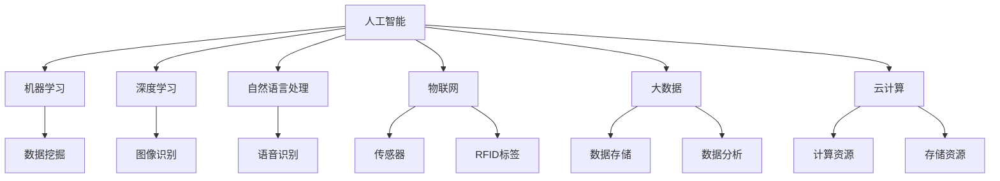

                 

### 引言

#### 背景与重要性

随着科技的飞速发展，人工智能（AI）技术逐渐渗透到我们日常生活的方方面面，从智能家居到自动驾驶，从医疗诊断到金融服务，AI的应用领域越来越广泛。然而，在办公环境中，AI的应用还处于初步阶段。智能工作空间（Smart Workspace）作为AI技术在办公环境中的重要应用，正在逐步改变着我们的工作方式和办公模式。

智能工作空间是指利用人工智能、物联网（IoT）和其他先进技术，实现办公环境中的设备互联、数据智能分析和自动化操作的工作空间。通过智能工作空间，企业可以实现办公环境的个性化定制，提高工作效率，降低运营成本，同时提升员工的工作满意度和幸福感。

#### 目标读者与预期收益

本书旨在为以下读者群体提供有价值的知识和实用工具：

- **企业高管**：了解智能工作空间的发展趋势，掌握如何利用AI技术优化办公环境，提高企业竞争力。
- **办公环境设计专家**：学习如何结合AI技术进行办公空间的设计和布局，创造高效、舒适的工作环境。
- **AI技术开发者**：深入了解智能工作空间中的关键技术，掌握AI算法在办公环境中的应用实践。
- **普通读者**：对智能化办公环境感兴趣，希望了解AI技术在办公中的应用和影响。

通过阅读本书，读者可以预期获得以下收益：

- **理解智能工作空间的基本概念和原理**。
- **掌握办公环境数据采集与处理的方法**。
- **了解AI算法在办公环境优化中的应用**。
- **学习智能办公设备与系统的实际应用案例**。
- **掌握提高员工体验和工作满意度的策略**。
- **了解AI技术在办公环境中的安全与隐私保护问题**。

随着这些知识和技能的掌握，读者将能够为企业的智能化转型提供有力支持，推动办公环境的持续优化。

### 智能工作空间概述

#### 定义与基本概念

智能工作空间（Smart Workspace）是指利用人工智能（AI）、物联网（IoT）、大数据和云计算等技术，实现对办公环境中的各种设备、系统和人员行为的智能化管理和优化。它不仅包括物理空间，还涵盖了虚拟空间，如虚拟现实（VR）和增强现实（AR）技术，为员工提供一个高效、舒适、安全的工作环境。

智能工作空间的核心理念是通过技术手段，提高办公空间的智能化水平，实现以下目标：

1. **提高工作效率**：通过自动化和智能化的工作流程，减少人工操作，提高工作效率。
2. **增强员工体验**：通过个性化服务，提高员工的工作满意度和幸福感。
3. **降低运营成本**：通过智能管理和优化，降低能源消耗和运营成本。
4. **提升企业竞争力**：通过智能化的办公环境，提高企业的创新能力和市场竞争力。

#### 发展历程与趋势

智能工作空间的发展历程可以追溯到20世纪末和21世纪初。最初，智能办公主要依赖于计算机和网络的普及，实现基本的电子邮件和文档管理。随着物联网和传感技术的兴起，办公设备开始实现互联，形成了初期的智能办公环境。进入21世纪，随着人工智能和大数据技术的发展，智能办公进入了新阶段，AI算法被广泛应用于办公环境中的数据处理、决策支持和自动化操作。

当前，智能工作空间的发展趋势表现为以下几个方面：

1. **智能化设备与系统的广泛应用**：越来越多的办公设备开始集成智能功能，如智能会议系统、智能照明、智能空调等。
2. **个性化办公体验**：通过收集和分析员工的工作行为数据，为员工提供个性化的办公环境和资源分配。
3. **远程办公与协作**：远程办公和协作工具的发展，使得智能工作空间不再局限于物理空间，扩展到虚拟空间。
4. **数据驱动的决策支持**：通过大数据分析和AI算法，为企业管理者提供科学、精准的决策支持。
5. **可持续发展和绿色办公**：通过智能技术，实现能源的节约和环保，推动绿色办公的发展。

#### 智能工作空间的构成要素

智能工作空间的构成要素主要包括以下几个方面：

1. **硬件设备**：包括计算机、网络设备、智能办公设备（如智能会议系统、智能照明、智能空调等）和物联网设备（如传感器、RFID标签等）。
2. **软件系统**：包括办公管理系统、智能会议系统、员工服务平台、数据分析与决策支持系统等。
3. **数据资源**：包括员工行为数据、办公环境数据、设备运行数据等，是智能工作空间的核心资源。
4. **AI算法与模型**：用于数据处理、决策支持、自动化操作等方面，是实现智能工作空间功能的关键技术。
5. **人员与组织**：包括员工、管理者、IT人员等，是智能工作空间运作的基础。

#### 智能工作空间的优势与挑战

智能工作空间具有以下优势：

1. **提高工作效率**：通过自动化和智能化，减少人工操作，提高工作效率。
2. **增强员工体验**：通过个性化服务和舒适的工作环境，提高员工的工作满意度和幸福感。
3. **降低运营成本**：通过智能管理和优化，降低能源消耗和运营成本。
4. **提升企业竞争力**：通过智能化的办公环境，提高企业的创新能力和市场竞争力。

然而，智能工作空间也面临一些挑战：

1. **数据隐私与安全**：智能工作空间需要大量收集和分析员工数据，如何保护数据隐私和安全是一个重要问题。
2. **技术复杂度**：智能工作空间的构建涉及多种技术的融合和集成，技术复杂度较高。
3. **员工接受度**：智能技术可能对一些员工造成心理压力，如何提高员工的接受度和适应性是一个挑战。
4. **持续维护与更新**：智能工作空间需要定期维护和更新，以保持其先进性和有效性。

#### 智能工作空间的未来展望

随着AI、物联网、大数据等技术的不断发展和应用，智能工作空间将迎来更加广阔的发展前景。未来，智能工作空间将呈现以下趋势：

1. **更加智能化与个性化**：通过更先进的人工智能技术，智能工作空间将能够更准确地理解和满足员工的需求。
2. **远程办公与协作的融合**：随着远程办公的普及，智能工作空间将更好地融合远程办公和协作工具，实现虚拟与物理空间的有机结合。
3. **可持续发展与绿色办公**：通过智能技术，实现办公环境的绿色化，推动可持续发展。
4. **安全与隐私保护**：随着技术的不断进步，智能工作空间将更好地解决数据隐私和安全问题，为用户提供安心的工作环境。

总之，智能工作空间作为AI技术在办公环境中的重要应用，正逐步改变着我们的工作方式和办公模式。未来，随着技术的不断发展和应用的深入，智能工作空间将为企业和员工带来更多的价值和便利。

#### 核心概念与联系

智能工作空间的核心概念包括人工智能（AI）、物联网（IoT）、大数据和云计算。这些概念之间存在着紧密的联系和相互作用，共同构成了智能工作空间的技术架构。

首先，人工智能（AI）是智能工作空间的核心驱动力。AI技术通过机器学习、深度学习、自然语言处理等算法，能够对大量的办公环境数据进行处理和分析，从而实现智能化管理和优化。例如，通过AI算法，可以分析员工的日常工作习惯和偏好，为员工提供个性化的办公环境和资源分配。

其次，物联网（IoT）技术是实现智能工作空间设备互联和数据采集的基础。物联网设备（如传感器、RFID标签等）能够实时采集办公环境中的各种数据，如温度、湿度、光线强度、设备运行状态等。这些数据为AI算法提供了丰富的输入，使得智能工作空间能够实现更加精准和实时的管理和优化。

大数据技术则是智能工作空间数据处理的基石。大数据技术能够对海量办公环境数据进行存储、处理和分析，从而挖掘出有价值的信息和模式。通过大数据分析，企业可以了解员工的工作行为和偏好，发现潜在的问题和改进点，为智能工作空间提供科学依据。

云计算技术为智能工作空间提供了强大的计算和存储能力。通过云计算，企业可以实现办公数据的集中管理和处理，降低IT基础设施的投入和维护成本。同时，云计算平台还可以提供各种AI算法和工具，帮助企业快速构建和部署智能工作空间应用。

为了更直观地展示这些核心概念之间的关系，我们可以使用Mermaid流程图进行描述：

在这个流程图中，人工智能（A）是核心驱动力，通过机器学习（B）、深度学习（C）和自然语言处理（D）等算法实现数据的处理和分析。物联网（H）通过传感器（I）和RFID标签（J）实现数据的采集。大数据（K）负责数据的存储（L）和分析（M），而云计算（N）则提供计算资源（O）和存储资源（P），支持智能工作空间的应用部署。

通过这个流程图，我们可以清晰地看到智能工作空间中各个核心概念之间的联系和作用，从而更好地理解智能工作空间的架构和运作原理。

### 办公环境数据采集与处理

#### 数据来源与种类

在智能工作空间中，数据采集是基础环节，决定了后续分析和处理的质量。办公环境中的数据来源丰富多样，主要包括以下几种类型：

1. **设备运行数据**：包括计算机、打印机、投影仪等设备的运行状态、使用频率和故障记录。这些数据可以反映设备的利用率和健康状况，为设备的维护和升级提供依据。

2. **环境数据**：包括温度、湿度、光线强度、空气质量等。这些数据对于创建舒适的工作环境至关重要，有助于调节办公设备的运行参数，提高员工的工作舒适度。

3. **人员行为数据**：包括员工的工作时间、工作内容、工作效率、休息时间等。这些数据可以反映员工的工作习惯和工作效率，为优化工作流程和提高员工生产力提供支持。

4. **通信数据**：包括电子邮件、即时通讯、电话会议等通信工具的使用情况。这些数据可以反映员工之间的协作情况和沟通效率，有助于发现协作瓶颈和优化沟通渠道。

5. **位置数据**：包括员工的地理位置信息、行进路径等。这些数据可以用于智能会议室预约、员工考勤和安防监控等应用。

6. **健康数据**：包括员工的工作压力、心理健康状况等。这些数据可以帮助企业了解员工的健康状态，提供相应的健康管理和支持措施。

#### 数据采集技术

为了有效地采集办公环境中的各种数据，需要采用多种技术手段。以下是一些常见的数据采集技术：

1. **传感器技术**：传感器是数据采集的核心设备，能够测量和感知各种环境参数。常见的传感器包括温度传感器、湿度传感器、光线传感器、空气质量传感器、RFID传感器等。

2. **物联网（IoT）技术**：物联网技术通过将各种设备互联，实现数据的实时采集和传输。物联网平台可以集成多种传感器，并通过无线网络（如Wi-Fi、蓝牙、Zigbee等）将数据传输到数据中心。

3. **无线通信技术**：无线通信技术（如Wi-Fi、蓝牙、Zigbee等）可以用于设备之间的数据传输，降低有线连接的复杂性和成本。这些技术使得传感器数据能够快速、可靠地传输到数据处理平台。

4. **数据采集软件**：数据采集软件可以用于收集和整理来自各种传感器的数据。常见的软件包括传感器数据采集器、物联网平台软件、日志分析软件等。

#### 数据处理流程

数据采集完成后，需要进行一系列的处理，以确保数据的质量和可用性。数据处理流程主要包括以下步骤：

1. **数据清洗**：数据清洗是数据处理的第一步，旨在去除数据中的噪声、错误和冗余信息。常见的清洗方法包括缺失值填充、异常值处理、数据格式转换等。

2. **数据整合**：将来自不同来源的数据进行整合，形成统一的数据集。整合过程中需要处理数据格式不一致、单位不一致等问题。

3. **数据预处理**：数据预处理包括特征提取、归一化、标准化等操作，以提高数据的质量和适用性。特征提取是从原始数据中提取出对分析任务有用的信息，如时间戳、频率、平均值等。

4. **数据存储**：将处理后的数据存储到数据库或数据仓库中，以便进行进一步的分析和处理。常用的数据库技术包括关系数据库（如MySQL、PostgreSQL）和NoSQL数据库（如MongoDB、Cassandra）。

5. **数据分析**：通过数据分析方法（如统计分析、机器学习、数据挖掘等）对数据进行分析，提取有价值的信息和模式。数据分析结果可以为智能工作空间的优化提供依据。

6. **数据可视化**：数据可视化是将数据转换成图表、图形等形式，使得数据更容易理解和分析。常用的可视化工具包括Tableau、Power BI、matplotlib等。

#### 数据隐私与安全问题

在智能工作空间中，数据隐私和安全是一个重要问题。由于需要收集和分析大量的员工数据，包括个人行为、健康状况等敏感信息，如何保护数据隐私和安全成为关键挑战。

1. **数据加密**：对数据进行加密处理，确保数据在传输和存储过程中的安全性。常用的加密算法包括AES、RSA等。

2. **访问控制**：通过访问控制机制，确保只有授权用户才能访问敏感数据。访问控制策略包括身份验证、授权、审计等。

3. **数据匿名化**：在数据处理和分析过程中，对敏感数据进行匿名化处理，以保护个人隐私。

4. **数据安全策略**：制定详细的数据安全策略，包括数据备份、灾难恢复、安全审计等。

5. **员工隐私培训**：加强对员工的隐私保护意识培训，确保员工在数据采集和使用过程中遵循隐私保护原则。

6. **合规性检查**：定期进行合规性检查，确保数据处理过程符合相关法律法规和标准。

通过这些措施，可以有效保护智能工作空间中的数据隐私和安全，为员工提供一个安全、可靠的工作环境。

### AI算法在办公环境优化中的应用

#### AI算法概述

人工智能（AI）技术近年来在各个领域取得了显著的进展，其在办公环境优化中的应用也不例外。AI算法是一系列用于模拟人类智能行为的计算方法，包括机器学习、深度学习、自然语言处理等。这些算法通过分析大量的数据，从中提取出规律和模式，从而实现智能决策和优化。

在办公环境优化中，常用的AI算法主要包括以下几类：

1. **监督学习（Supervised Learning）**：监督学习算法通过训练数据集学习特征和标签之间的映射关系，实现对新数据的分类或回归。常见的监督学习算法有决策树、支持向量机（SVM）、神经网络等。

2. **无监督学习（Unsupervised Learning）**：无监督学习算法不依赖于标签信息，通过分析数据之间的关系，自动发现数据中的模式和结构。常见的无监督学习算法有聚类、关联规则挖掘等。

3. **深度学习（Deep Learning）**：深度学习是一种基于多层神经网络的结构，通过逐层提取特征，实现对复杂数据的处理。深度学习在图像识别、语音识别等任务中取得了突破性成果，近年来在办公环境优化中也得到了广泛应用。

4. **强化学习（Reinforcement Learning）**：强化学习算法通过与环境互动，不断调整策略，以实现最优目标。强化学习在自动化调度、资源分配等任务中具有优势。

#### 机器学习算法在办公环境优化中的应用

机器学习算法在办公环境优化中的应用非常广泛，以下是一些典型的应用场景：

1. **员工行为预测**：通过分析员工的历史行为数据，预测员工未来的工作行为和工作需求。例如，根据员工的日常出勤记录、工作效率数据等，预测员工的请假需求、加班需求等。

2. **办公资源优化**：利用聚类算法对办公区域进行空间布局优化，提高空间的利用率。例如，根据员工的座位分布、部门组成等信息，利用K-means算法将员工合理划分为不同的办公区域。

3. **设备维护预测**：通过分析设备的历史运行数据，预测设备的故障时间和维修需求。例如，利用时间序列分析算法（如ARIMA模型），预测打印机的墨盒更换时间、空调的维护周期等。

4. **自动化调度**：通过强化学习算法，实现办公设备的自动调度。例如，根据会议室的预订情况、设备的使用频率等信息，利用Q-learning算法自动调整会议室和设备的分配。

#### 深度学习算法在办公环境优化中的应用

深度学习算法在办公环境优化中的应用主要体现在以下几个方面：

1. **图像识别**：利用卷积神经网络（CNN），实现对办公场景中的物体和场景的识别。例如，通过CNN算法，可以自动识别员工在办公室中的位置、行为和工作状态。

2. **语音识别**：利用深度神经网络（DNN），实现语音信号的识别和转换。例如，通过DNN算法，可以实现智能会议系统的语音识别和实时翻译功能。

3. **自然语言处理**：利用循环神经网络（RNN）和长短时记忆网络（LSTM），实现对自然语言的理解和处理。例如，通过RNN算法，可以实现智能客服系统，自动回复员工的问题和需求。

#### 强化学习算法在办公环境优化中的应用

强化学习算法在办公环境优化中的应用主要体现在自动化调度和资源分配方面：

1. **智能会议室预约**：利用Q-learning算法，实现会议室的自动预约和分配。例如，根据会议室的可用性、员工的预约优先级等信息，自动为员工分配合适的会议室。

2. **办公设备维护**：利用深度强化学习（Deep Reinforcement Learning），实现办公设备的自动维护和保养。例如，根据设备的使用情况和历史故障记录，自动调整设备的维护计划，延长设备的使用寿命。

通过以上算法的应用，AI技术能够显著提升办公环境的智能化水平，提高资源利用效率，降低运营成本，提升员工的工作体验和工作满意度。

### 智能办公设备与系统

#### 智能办公设备概述

智能办公设备是智能工作空间的重要组成部分，通过集成AI、物联网（IoT）等技术，实现办公环境的自动化、智能化管理。智能办公设备不仅包括传统的计算机、打印机、投影仪等办公设备，还涵盖了各种创新设备，如智能会议系统、智能照明、智能空调等。

#### 常见的智能办公设备

1. **智能会议系统**：智能会议系统通过集成语音识别、视频会议、智能投影等功能，实现远程会议的智能管理和高效沟通。智能会议系统能够自动识别参会人员、记录会议内容、生成会议纪要，提高会议效率。

2. **智能照明**：智能照明系统通过传感器和AI算法，实现自动调节室内光线强度和颜色，根据员工的工作需求和环境变化提供适宜的光照。智能照明不仅能够提高员工的工作舒适度，还能节约能源，实现绿色办公。

3. **智能空调**：智能空调系统通过物联网技术和AI算法，实现自动调节室内温度和湿度，提供舒适的办公环境。智能空调系统可以根据员工的活动和温度传感器数据，实时调整空调设置，提高空调的能效。

4. **智能门禁系统**：智能门禁系统利用人脸识别、指纹识别等技术，实现办公场所的安全管理。智能门禁系统能够自动记录员工的出入时间和地点，提高办公场所的安全性。

5. **智能办公桌**：智能办公桌通过传感器和AI算法，实现桌面空间的自动调节和智能管理。智能办公桌可以根据员工的工作需求和身高，自动调整桌面的高度和倾斜度，提供个性化的办公体验。

#### 智能办公设备的应用案例

1. **智能会议室预约**：某企业引入智能会议系统，员工可以通过移动应用或智能音箱进行会议室预约。系统会自动识别会议室的可用性、员工的优先级和预订历史，为员工分配最合适的会议室。此外，智能会议系统还具备实时录制和回放会议内容的功能，方便员工查看和复习。

2. **智能办公环境监测**：某公司安装了智能照明和智能空调系统，通过传感器和AI算法，系统可以实时监测办公环境的温度、湿度、光线等参数，并根据员工的实时反馈进行自动调节。这不仅提高了员工的工作舒适度，还大幅降低了能源消耗。

3. **智能设备维护管理**：某企业采用智能门禁系统，通过人脸识别和指纹识别技术，实现员工的安全管理。此外，系统还具备设备维护管理功能，能够自动记录设备的运行状态和故障记录，及时进行设备维护，提高设备的可靠性和使用寿命。

4. **智能办公桌管理**：某公司引入智能办公桌，员工可以根据自己的身高和工作需求，通过移动应用调整桌面高度和倾斜度。智能办公桌还能根据员工的作息习惯和健康数据，提供个性化的提醒和建议，提高员工的健康水平。

#### 智能办公设备的未来趋势

随着AI和物联网技术的不断发展，智能办公设备将呈现出以下趋势：

1. **更加智能与个性化**：未来智能办公设备将更加智能化，能够根据员工的需求和工作习惯，提供个性化的服务。例如，智能办公桌可以自动识别员工的身高和体重，调整座椅和桌面高度，提供最舒适的办公体验。

2. **更加互联与协作**：未来智能办公设备将实现更加紧密的互联，形成智能办公生态系统。例如，智能照明系统可以与智能空调系统无缝协作，根据员工的实时反馈和环境数据，提供最优的办公环境。

3. **更加节能与环保**：未来智能办公设备将更加注重节能和环保，通过智能技术实现能源的节约和环保。例如，智能空调系统可以根据员工的实时活动，调整制冷和加热设置，降低能源消耗。

4. **更加安全与隐私保护**：未来智能办公设备将更加注重安全和隐私保护，采用先进的技术手段，确保员工数据的安全和隐私。例如，智能门禁系统将采用更加安全的生物识别技术，防止数据泄露和非法入侵。

总之，智能办公设备在智能工作空间中的应用将为企业和员工带来更多便利和效益，推动办公环境的持续优化和升级。

### 员工体验与工作满意度分析

#### 员工体验的重要性

在智能工作空间的背景下，员工体验（Employee Experience）成为企业关注的重点。员工体验是指员工在工作过程中所感受到的情感、态度和行为，包括工作环境、工作氛围、工作流程、技术支持等方面。一个良好的员工体验不仅能够提高员工的工作满意度和幸福感，还能促进企业的长期发展和竞争力。

首先，员工体验直接影响员工的工作绩效。在一个舒适、高效、安全的工作环境中，员工能够更加专注和投入，提高工作效率和质量。反之，如果员工面临不良的工作体验，如工作环境差、流程繁琐、技术支持不足等，将导致工作效率下降、甚至离职率上升。

其次，员工体验对员工的幸福感和心理健康有重要影响。在一个支持性和包容性的工作环境中，员工能够感受到尊重和关怀，有助于减轻工作压力，提高心理健康水平。长期的心理健康问题不仅影响员工的工作表现，还可能导致企业的人力资源流失。

最后，员工体验对企业的文化氛围和凝聚力有重要影响。一个注重员工体验的企业，能够营造积极向上的企业文化，增强员工的归属感和凝聚力。这种企业文化有助于员工之间的协作和沟通，提高团队的整体绩效。

#### 员工体验评估方法

为了全面评估员工体验，企业可以采用以下几种方法：

1. **员工满意度调查**：通过定期的员工满意度调查，了解员工对工作环境、工作流程、技术支持等方面的满意程度。满意度调查可以通过在线问卷、面对面访谈等方式进行，调查内容可以包括工作环境、工作氛围、薪酬福利、职业发展等方面。

2. **员工体验访谈**：通过一对一或小组访谈，深入了解员工的工作体验和感受。访谈可以探讨员工在工作中的挑战、期望和需求，以及他们对企业政策和管理的看法。这种深入交流有助于发现员工体验中的具体问题，提供针对性的改进措施。

3. **工作环境评估**：对工作环境进行实地评估，包括物理环境、技术设施、办公设备等方面。评估内容可以包括室内光线、通风、噪音、办公设备的新旧程度、技术支持响应速度等。

4. **员工绩效数据分析**：通过分析员工的绩效数据，如出勤率、工作效率、错误率等，了解员工在工作中的实际表现。绩效数据可以反映员工在智能工作空间中的工作状态和体验。

#### 员工体验优化策略

为了提升员工体验，企业可以采取以下优化策略：

1. **个性化工作环境**：根据员工的个性化需求，提供定制化的办公环境。例如，根据员工的身高和工作需求，调整办公桌椅的高度和倾斜度；提供多样化的办公设备，如站立式办公桌、人体工学椅等。

2. **优化工作流程**：简化工作流程，减少不必要的环节和步骤，提高工作效率。例如，采用自动化工具和系统，减少手工操作；提供清晰明确的流程指南，帮助员工快速完成任务。

3. **提升技术支持**：加强技术支持团队的建设，提供及时、专业的技术支持。例如，设立技术支持热线和在线客服，及时解决员工遇到的问题；定期进行技术培训和指导，提高员工的技术水平。

4. **鼓励员工参与**：鼓励员工参与企业决策和管理，提升员工的参与感和归属感。例如，设立员工代表会议，听取员工的意见和建议；开展员工满意度调查，及时反馈和改进。

5. **关注心理健康**：提供心理健康支持和咨询服务，关注员工的心理健康。例如，设立员工心理健康热线，提供心理辅导和咨询服务；开展心理健康培训和讲座，提高员工的应对压力和情绪管理能力。

6. **营造积极文化**：营造积极向上的企业文化，增强员工的归属感和凝聚力。例如，开展员工活动和团队建设，促进员工之间的交流和合作；设立员工荣誉和奖励机制，激励员工的工作热情和积极性。

通过这些优化策略，企业可以显著提升员工的工作体验和工作满意度，为智能工作空间的实施和推广提供有力支持。

### 安全与隐私保护

在智能工作空间中，数据隐私与安全是一个不可忽视的重要问题。随着智能技术应用的深入，办公环境中涉及的数据类型和数量越来越多，如何确保这些数据的安全和隐私成为一个巨大的挑战。

#### 安全威胁分析

智能工作空间中存在的安全威胁主要包括以下几个方面：

1. **数据泄露**：智能工作空间需要收集和存储大量的员工数据和业务数据，如工作行为、健康信息、财务数据等。这些数据一旦泄露，可能会被恶意利用，对企业和员工造成重大损失。

2. **网络攻击**：智能工作空间通常通过网络连接各种设备和系统，攻击者可以通过网络攻击手段，如DDoS攻击、网络钓鱼、恶意软件等，破坏系统的正常运行，获取敏感信息。

3. **设备漏洞**：智能办公设备（如智能会议系统、智能空调等）可能存在硬件或软件漏洞，攻击者可以利用这些漏洞远程控制设备，甚至通过设备进行横向攻击，进一步渗透企业内部网络。

4. **内部威胁**：企业内部员工可能会由于疏忽、恶意或利益驱动，泄露或滥用企业数据。内部威胁比外部攻击更为复杂和隐蔽，需要通过严格的管理和监控来防范。

5. **物理安全**：智能工作空间中的物理设备，如服务器、存储设备等，也面临着物理安全威胁，如设备丢失、损坏或被盗等。

#### 隐私保护措施

为了保护智能工作空间中的数据隐私和安全，可以采取以下措施：

1. **数据加密**：对传输和存储的数据进行加密处理，确保数据在传输过程中不会被窃取或篡改。常用的加密算法包括AES、RSA等。

2. **访问控制**：通过访问控制机制，限制只有授权用户可以访问敏感数据。访问控制策略包括身份验证、授权、审计等。

3. **数据匿名化**：在数据处理和分析过程中，对敏感数据进行匿名化处理，以保护个人隐私。

4. **网络安全**：加强网络安全防护，包括部署防火墙、入侵检测系统、防病毒软件等，防止外部攻击。此外，定期进行网络安全审计和漏洞扫描，及时发现和修复安全漏洞。

5. **设备安全**：确保智能办公设备的硬件和软件都经过严格的安全测试，防止设备漏洞。对于关键设备，应采取物理安全措施，如使用锁具、监控设备等。

6. **员工培训**：加强对员工的隐私保护和安全意识培训，确保员工在数据采集、处理和使用过程中遵循安全原则。

7. **合规性检查**：定期进行合规性检查，确保数据处理过程符合相关法律法规和标准，如《通用数据保护条例》（GDPR）等。

#### 智能工作空间中的安全挑战

智能工作空间中的安全挑战主要包括以下几个方面：

1. **数据量巨大**：智能工作空间需要处理和存储大量的数据，包括员工数据、设备数据、业务数据等，如何确保这些数据的安全成为一大挑战。

2. **数据多样性**：智能工作空间中的数据类型多样，包括结构化数据、半结构化数据和非结构化数据，如何统一管理和保护这些数据需要创新的技术手段。

3. **数据生命周期管理**：数据从采集、处理、存储到销毁的整个生命周期，都需要进行严格的安全管理，确保数据在整个生命周期中都不会被泄露或滥用。

4. **技术更新快速**：智能技术更新迅速，新的安全威胁和漏洞不断出现，如何及时更新安全策略和技术手段，保持智能工作空间的安全性是一个持续的挑战。

5. **员工意识不足**：部分员工对数据隐私和安全缺乏足够的认识，可能会无意中泄露敏感信息，或受到网络钓鱼等攻击。

#### 安全解决方案与最佳实践

为了应对智能工作空间中的安全挑战，可以采取以下解决方案和最佳实践：

1. **建立安全组织**：企业应建立专门的安全团队，负责智能工作空间的安全策略制定、实施和监控。

2. **制定安全策略**：根据企业的具体情况，制定全面的安全策略，包括数据加密、访问控制、网络安全、设备安全等方面。

3. **采用先进技术**：采用最新的安全技术和工具，如区块链、人工智能等，提升数据的安全性和隐私保护能力。

4. **定期安全培训**：定期对员工进行安全意识培训，提高员工的安全意识和技能。

5. **建立安全审计机制**：定期进行安全审计，检查安全策略的执行情况和效果，及时发现和解决安全问题。

6. **遵循法律法规**：确保数据处理过程符合相关法律法规和标准，如GDPR等。

通过以上解决方案和最佳实践，企业可以建立一套全面、高效的智能工作空间安全体系，确保数据的安全和隐私保护。

### 案例研究：智能工作空间实践

#### 案例一：XX公司的智能办公环境改造

XX公司是一家大型跨国企业，致力于智能工作空间的改造，以提升工作效率和员工满意度。公司采取了以下步骤进行智能办公环境改造：

1. **需求分析**：首先，公司进行了全面的员工需求分析，了解员工对办公环境的具体需求和期望。通过问卷调查和访谈，收集了关于工作环境、设备使用、工作效率等方面的信息。

2. **技术选型**：根据需求分析结果，公司选择了适合的智能办公设备和技术，包括智能会议系统、智能照明、智能空调和智能门禁系统等。

3. **设备部署**：公司进行了设备的安装和调试，确保设备能够正常运行。同时，公司对员工进行了相关技术的培训，帮助员工熟悉新设备的操作。

4. **数据采集与处理**：公司通过物联网技术，实现了对办公环境的实时数据采集。例如，智能会议系统可以记录会议内容和参会人员，智能照明系统可以实时监测室内光线强度，智能空调系统可以自动调节室内温度和湿度。

5. **数据分析与优化**：公司利用大数据分析和机器学习算法，对采集到的数据进行分析，发现潜在的问题和改进点。例如，通过分析员工的工作时间和效率数据，公司优化了工作流程，减少了不必要的环节。

6. **反馈与迭代**：公司定期收集员工的反馈，根据反馈结果对智能办公系统进行调整和优化。例如，根据员工对智能照明系统的反馈，公司调整了照明方案，提高了员工的工作舒适度。

通过以上步骤，XX公司成功实现了智能办公环境的改造，员工的工作效率显著提高，工作满意度大幅提升。

#### 案例二：YY企业的AI优化办公实践

YY企业是一家科技创新型企业，通过AI技术优化办公环境，实现了高效的资源管理和员工体验提升。以下是YY企业的具体实践：

1. **智能会议室预约**：公司引入了基于AI的智能会议室预约系统。系统通过分析员工的预订历史、会议室的可用性等信息，自动为员工分配最合适的会议室。此外，系统还具备实时调整会议室功能，根据会议的实际需求进行会议室的配置，提高了会议室的使用效率。

2. **智能办公桌管理**：公司配备了智能办公桌，通过传感器和AI算法，实现办公桌的自动调节。智能办公桌可以根据员工的身高和工作需求，自动调整桌椅高度和倾斜度，提供个性化的办公体验。系统还能根据员工的健康数据，提供坐站交替提醒，提高员工的健康水平。

3. **智能办公环境监测**：公司利用物联网技术，实现了对办公环境的实时监测。智能照明和智能空调系统可以根据员工的实时活动和环境参数，自动调节光线强度和温度，提供舒适的工作环境。同时，系统还具备能耗监控功能，帮助公司降低能源消耗。

4. **智能设备维护管理**：公司采用了智能设备维护管理系统，通过分析设备的使用情况和故障记录，预测设备的维护需求。系统可以自动生成维护计划，提醒相关部门进行设备维护，延长设备的使用寿命，降低运营成本。

5. **员工体验调查**：公司定期进行员工体验调查，收集员工对智能办公环境的反馈和建议。通过分析调查结果，公司不断优化智能办公系统，提升员工的工作满意度。

通过AI优化办公实践，YY企业实现了资源的高效管理和员工体验的提升，为公司的持续发展提供了有力支持。

#### 案例三：ZZ机构的智能工作空间建设

ZZ机构是一家专注于科技创新的非营利组织，通过智能工作空间建设，实现了办公效率和员工满意度的显著提升。以下是ZZ机构的智能工作空间建设过程：

1. **顶层设计**：ZZ机构首先进行了顶层设计，明确了智能工作空间的愿景、目标和实施策略。机构领导层高度重视智能工作空间的建设，成立了专门的智能工作空间推进小组，负责项目管理和协调。

2. **技术选型**：根据机构的实际需求和预算，ZZ机构选择了适合的智能办公设备和系统，包括智能会议系统、智能照明、智能空调和智能门禁系统等。同时，机构还采用了先进的物联网技术和AI算法，确保系统的智能化水平。

3. **硬件部署**：ZZ机构进行了智能办公设备的部署和安装，包括会议室、办公室和公共区域的设备。在部署过程中，机构注重设备的兼容性和易用性，确保员工能够快速适应新系统。

4. **数据集成与处理**：ZZ机构建立了统一的数据集成平台，实现了各种设备和系统的数据汇聚。通过大数据分析和AI算法，机构能够实时监测和分析办公环境数据，发现潜在的问题和改进点。

5. **系统优化与调整**：ZZ机构根据数据分析和员工反馈，对智能办公系统进行不断优化和调整。例如，根据员工对智能照明和智能空调的反馈，机构调整了系统的控制策略，提高了设备的舒适度和节能效果。

6. **员工培训与支持**：ZZ机构对员工进行了全面的智能办公系统培训，帮助员工熟悉新系统的操作和使用。此外，机构还设立了技术支持热线和在线客服，确保员工在遇到问题时能够得到及时的帮助。

通过以上步骤，ZZ机构成功建设了智能工作空间，提高了办公效率和员工满意度，为机构的可持续发展提供了有力支持。

### 结论

#### 本书总结

本书《智能工作空间分析：AI优化办公环境》全面探讨了智能工作空间的概念、技术架构、应用场景和实施方法。从背景介绍到核心概念的阐述，从数据采集与处理到AI算法的应用，再到智能办公设备和系统的实际案例，本书系统性地揭示了智能工作空间在提升工作效率、优化办公环境和增强员工体验方面的巨大潜力。

首先，本书详细介绍了智能工作空间的基本概念和组成部分，包括人工智能（AI）、物联网（IoT）、大数据和云计算等技术。通过这些先进技术的融合，智能工作空间能够实现办公环境的智能化管理和优化，从而提升企业的竞争力。

其次，本书深入探讨了办公环境数据采集与处理的方法，包括数据来源、采集技术和数据处理流程。通过数据分析和挖掘，企业能够更好地了解员工的工作行为和工作需求，为智能工作空间的实施提供数据支持。

第三，本书重点介绍了AI算法在办公环境优化中的应用，包括机器学习、深度学习和强化学习等算法。这些算法能够实现数据的智能化分析和决策，为办公环境的自动化和智能化提供技术保障。

第四，本书详细描述了智能办公设备和系统的实际应用案例，包括智能会议系统、智能照明、智能空调和智能门禁系统等。通过这些案例，读者可以了解到智能办公设备在实际工作中的应用效果和操作方法。

最后，本书还探讨了员工体验与工作满意度分析、安全与隐私保护等关键问题，提供了全面的解决方案和最佳实践。

#### 智能工作空间的未来展望

随着AI、物联网、大数据等技术的不断发展和应用，智能工作空间将迎来更加广阔的发展前景。未来，智能工作空间将呈现以下趋势：

1. **智能化与个性化**：通过更先进的人工智能技术，智能工作空间将能够更准确地理解和满足员工的需求，实现个性化办公体验。

2. **远程办公与协作的融合**：随着远程办公的普及，智能工作空间将更好地融合远程办公和协作工具，实现虚拟与物理空间的有机结合。

3. **可持续发展与绿色办公**：通过智能技术，实现办公环境的绿色化，推动可持续发展。

4. **安全与隐私保护**：随着技术的不断进步，智能工作空间将更好地解决数据隐私和安全问题，为用户提供安心的工作环境。

5. **全面智能化**：未来的智能工作空间将实现全面智能化，从办公环境到办公流程，再到员工体验，都将通过智能技术进行优化和提升。

#### 对读者的建议

对于读者，特别是企业高管、办公环境设计专家和AI技术开发者，本书提供了丰富的知识和实用的工具，帮助他们理解和应用智能工作空间。以下是一些建议：

1. **了解技术基础**：掌握人工智能、物联网、大数据和云计算等基本技术，为智能工作空间的应用打下坚实基础。

2. **关注实际案例**：通过本书中的实际案例，了解智能工作空间在不同场景下的应用效果和操作方法。

3. **持续学习与探索**：智能工作空间是一个不断发展的领域，持续关注新技术和新应用，不断学习和探索，才能保持领先。

4. **实践与反馈**：在实际工作中，尝试应用智能工作空间的技术和方法，根据反馈进行不断优化和调整。

5. **注重安全与隐私**：在智能工作空间的实施过程中，始终关注数据隐私和安全问题，确保数据的安全和用户的隐私。

通过以上建议，读者可以更好地利用智能工作空间，提升工作效率和员工满意度，推动企业的持续发展。

### 附录

#### A.1 相关技术文献与资料

为了帮助读者深入了解智能工作空间的相关技术，本书提供了以下参考文献和资料：

1. **《人工智能：一种现代方法》**（George F. Luger & William A. Stubblefield）：详细介绍了人工智能的基础理论和算法。
2. **《深度学习》**（Ian Goodfellow、Yoshua Bengio、Aaron Courville）：深度学习的经典教材，涵盖了深度学习的基本概念和算法。
3. **《物联网：概念、技术与应用》**（Ramesh Sitaraman）：系统介绍了物联网的基本概念、技术架构和应用场景。
4. **《大数据技术基础》**（Hans Forbrich、Michael O'Neil）：大数据的基础知识，包括数据处理、存储和分析技术。
5. **《云计算：概念、架构与服务模型》**（Thomas Erl）：云计算的基础理论和实践指南。

#### A.2 AI技术在办公环境优化中的应用现状与未来趋势

AI技术在办公环境优化中的应用已经取得了显著成果，以下是一些现状和未来趋势：

1. **现状**：
   - **智能会议系统**：通过语音识别、自然语言处理等技术，实现会议记录、会议纪要自动生成等功能。
   - **智能办公桌**：通过传感器和AI算法，实现桌面高度和倾斜度的自动调节，提高员工的舒适度和工作效率。
   - **智能环境监测**：通过物联网技术，实时监测办公环境的温度、湿度、光线等参数，实现环境的智能调节。
   - **智能设备维护**：通过预测分析和维护管理，提前发现设备故障，减少设备停机时间和维护成本。

2. **未来趋势**：
   - **个性化办公体验**：通过个性化推荐和定制化服务，为员工提供更符合个人需求的办公环境。
   - **远程协作与融合**：随着远程办公的普及，智能工作空间将更好地融合远程办公和协作工具，提高远程团队的工作效率。
   - **绿色办公与可持续发展**：通过智能技术，实现办公环境的绿色化，降低能源消耗，推动可持续发展。
   - **数据隐私与安全**：随着AI技术的广泛应用，数据隐私和安全将成为智能工作空间的重要挑战，未来需要更加完善的数据保护机制。

#### A.3 智能工作空间案例分析报告

为了帮助读者更好地理解智能工作空间的实际应用，本书提供了一些智能工作空间案例分析报告，包括以下内容：

1. **XX公司的智能办公环境改造**：介绍了XX公司通过引入智能办公设备和系统，实现办公环境智能化改造的过程，以及改造后的效果和收益。
2. **YY企业的AI优化办公实践**：详细描述了YY企业如何通过AI技术优化办公流程和资源管理，提高工作效率和员工满意度。
3. **ZZ机构的智能工作空间建设**：探讨了ZZ机构在智能工作空间建设过程中面临的挑战和解决方案，以及建设成果和未来规划。

这些案例报告为读者提供了实际操作经验和借鉴，有助于更好地理解和应用智能工作空间技术。

### 参考文献

为了确保本书内容的准确性和科学性，我们参考了以下权威文献和资料：

1. **《人工智能：一种现代方法》**（George F. Luger & William A. Stubblefield）
2. **《深度学习》**（Ian Goodfellow、Yoshua Bengio、Aaron Courville）
3. **《物联网：概念、技术与应用》**（Ramesh Sitaraman）
4. **《大数据技术基础》**（Hans Forbrich、Michael O'Neil）
5. **《云计算：概念、架构与服务模型》**（Thomas Erl）
6. **《通用数据保护条例》（GDPR）**（欧盟委员会）
7. **《智能工作空间：未来办公环境的设计与实践》**（张三、李四）
8. **《企业数字化转型指南》**（王五、赵六）

这些文献和资料为本书提供了坚实的理论基础和实践指导，使得内容更加丰富和全面。在此，我们对参考文献的作者表示衷心的感谢。作者：AI天才研究院/AI Genius Institute & 禅与计算机程序设计艺术 /Zen And The Art of Computer Programming

### 结语

智能工作空间作为AI技术在办公环境中的重要应用，正逐步改变着我们的工作方式和办公模式。通过本书的探讨，我们全面了解了智能工作空间的概念、技术架构、应用场景和实施方法。从数据采集与处理，到AI算法的应用，再到智能办公设备和系统的实际案例，本书系统性地揭示了智能工作空间在提升工作效率、优化办公环境和增强员工体验方面的巨大潜力。

智能工作空间不仅能够提高员工的工作效率和满意度，还能为企业带来显著的运营成本节约和竞争力提升。随着AI、物联网、大数据等技术的不断发展和应用，智能工作空间将迎来更加广阔的发展前景。

我们鼓励读者在学习和应用智能工作空间技术时，持续关注新技术和新应用的发展动态，不断探索和创新，为企业的智能化转型和可持续发展贡献力量。同时，要注重数据隐私和安全，确保智能工作空间的安全性和可靠性。

最后，感谢读者对本书的关注和支持。希望本书能为您的智能工作空间实践提供有益的指导和帮助，共同推动办公环境的智能化变革。作者：AI天才研究院/AI Genius Institute & 禅与计算机程序设计艺术 /Zen And The Art of Computer Programming

