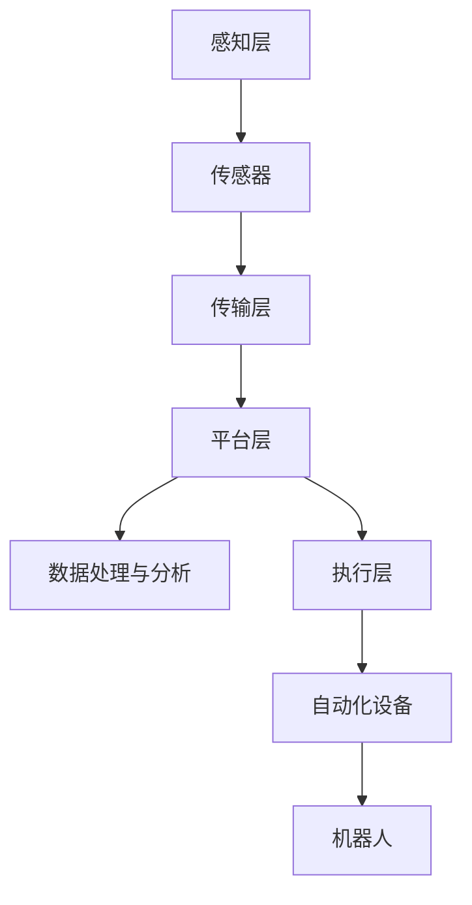

                 

### 智能工厂的概念与背景

智能工厂，是指通过将现代信息技术、自动化技术、机器人技术等集成到传统制造业中，实现生产过程的高度智能化和自动化。其核心在于通过数据和算法优化生产流程，提高生产效率，降低成本，提升产品质量。

#### **1.1 智能工厂的定义**

智能工厂是一个高度自动化的制造环境，其中各种生产设备和系统通过互联网进行连接，形成智能化的制造网络。在这个网络中，数据被实时采集、分析和利用，从而实现对生产过程的精准控制。智能工厂通常包括以下几个关键组成部分：

1. **感知层**：包括各种传感器和设备，用于实时采集生产过程中的数据。
2. **传输层**：利用互联网和通信技术，将感知层的数据传输到中央处理系统。
3. **平台层**：用于数据存储、处理和分析，通常包括云计算、大数据平台和人工智能算法。
4. **执行层**：包括各种自动化设备和机器人，用于执行生产任务。

#### **1.2 智能工厂的发展历程**

智能工厂的概念最早可以追溯到20世纪80年代，当时制造业开始逐步引入计算机辅助设计（CAD）和计算机辅助制造（CAM）系统。随着信息技术的快速发展，尤其是互联网、物联网和人工智能技术的普及，智能工厂的概念逐渐成熟并得以实现。

1. **自动化阶段**：20世纪80年代至90年代，制造业开始大量引入自动化设备，如数控机床、机器人等，实现生产过程的自动化。
2. **信息化阶段**：21世纪初，互联网和物联网技术的普及使得制造业的信息化水平大大提升，生产过程中的数据能够实现实时采集和传输。
3. **智能化阶段**：近年来，人工智能技术的快速发展使得制造业开始迈向智能化，通过大数据分析和机器学习算法，实现生产过程的优化和智能化控制。

#### **1.3 智能工厂的核心特征**

智能工厂具有以下几个核心特征：

1. **高度自动化**：生产过程高度自动化，减少了对人工的依赖。
2. **实时数据驱动**：通过实时数据采集和分析，实现对生产过程的精准控制。
3. **自适应能力**：能够根据实时数据和反馈，自动调整生产参数和工艺流程。
4. **高效节能**：通过优化生产流程和能源管理，实现高效节能。
5. **智能化决策**：通过大数据分析和人工智能算法，实现生产过程的智能化决策。

#### **1.4 智能工厂的意义与影响**

智能工厂的兴起对制造业产生了深远的影响：

1. **提高生产效率**：通过自动化和智能化技术，显著提高了生产效率。
2. **降低生产成本**：减少了人工成本和能源消耗，降低了生产成本。
3. **提升产品质量**：通过实时监控和质量控制，提高了产品的质量。
4. **促进产业升级**：推动了传统制造业向数字化、智能化方向升级。
5. **拓展应用领域**：智能工厂的应用不仅限于制造业，还扩展到了服务业、农业等多个领域。

综上所述，智能工厂通过集成现代信息技术和机器人技术，实现了生产过程的高度智能化和自动化，对制造业产生了深远的影响，推动了制造业的转型升级。

#### **核心概念与联系**

在智能工厂的构建过程中，有几个核心概念和技术是不可或缺的。首先，传感器作为感知层的关键组成部分，负责实时采集生产过程中的各种数据，如温度、湿度、振动等。这些数据通过传输层传输到平台层，平台层利用大数据技术和人工智能算法对这些数据进行处理和分析，从而实现对生产过程的实时监控和优化。

在图1中，我们展示了智能工厂中的核心概念及其相互关系：



通过这种结构，传感器实时采集的数据能够迅速传输到平台层，平台层利用先进的算法对这些数据进行处理，从而实现对生产过程的精准控制和优化。

接下来，我们探讨一下智能工厂中的核心算法原理。智能工厂的算法主要包括以下几个方面：

1. **数据采集与传输算法**：负责从传感器采集数据，并确保数据的高速、稳定传输。
2. **数据处理与分析算法**：包括数据清洗、特征提取、模式识别等，用于从海量数据中提取有价值的信息。
3. **机器学习与预测算法**：利用历史数据训练模型，实现对生产过程的预测和优化。
4. **决策支持系统**：根据分析结果，为生产决策提供支持，优化生产流程。

以下是一个简单的Python代码示例，用于说明数据采集与传输算法的基本原理：

```python
import random
import time

# 模拟传感器采集数据
def collect_data():
    temperature = random.uniform(20, 30)  # 生成温度数据
    humidity = random.uniform(30, 60)  # 生成湿度数据
    return temperature, humidity

# 数据传输函数
def transmit_data(data):
    print(f"Transmitting data: {data}")
    time.sleep(1)  # 模拟数据传输延迟

# 主程序
def main():
    while True:
        temperature, humidity = collect_data()
        transmit_data((temperature, humidity))
        time.sleep(5)  # 模拟数据采集间隔

if __name__ == "__main__":
    main()
```

在这个示例中，我们模拟了一个简单的传感器采集数据并传输的过程。通过这个示例，我们可以理解到数据采集与传输算法的基本工作原理。

总的来说，智能工厂的核心概念和算法之间紧密相连，构成了一个完整的生产过程控制系统。通过这些核心概念和算法的有机结合，智能工厂能够实现生产过程的高度智能化和自动化，为制造业的转型升级提供了强有力的技术支持。

### **多功能机器人的技术基础**

多功能机器人是智能工厂中的关键组件，它们具备高灵活性、多功能性和高度智能化，能够在各种复杂的生产环境中执行多种任务。为了深入了解多功能机器人的技术基础，我们首先需要明确其定义与分类，然后探讨其核心技术以及当前的发展现状与趋势。

#### **2.1 多功能机器人的定义与分类**

多功能机器人是指具备多种功能，能够适应不同生产任务和环境变化的一种机器人。与传统单一功能的工业机器人不同，多功能机器人具有更强的适应性和灵活性，能够在多个任务之间快速切换，提高生产效率。根据其功能和应用场景，多功能机器人可以分为以下几类：

1. **通用型多功能机器人**：这类机器人通常具备多种基本的机械手功能，如抓取、搬运、装配等，能够适应多种不同的生产任务。例如，ABB的IRB 2600机器人就是一种典型的通用型多功能机器人。

2. **专用型多功能机器人**：这类机器人是为特定任务或行业量身定制的，例如医疗机器人、农业机器人、服务机器人等。它们在特定领域具有很高的专业性和效率。例如，史陶比尔（Stäubli）的TX2机器人是一款专门用于电子组装的专用型多功能机器人。

3. **复合型多功能机器人**：这类机器人结合了多种功能和技术，如自动化焊接、切割、喷涂等，能够在复杂的生产环境中执行多种高级任务。例如，KUKA的KR AGILUS机器人是一种复合型多功能机器人，适用于微装配和高精度加工。

4. **智能型多功能机器人**：这类机器人不仅具备传统的机械功能，还融合了人工智能、物联网和自主决策技术，能够根据环境变化和任务需求自主调整工作参数，甚至进行自我学习和优化。例如，FANUC的Cob Fowler机器人是一种智能型多功能机器人，具备视觉识别和自适应控制能力。

#### **2.2 多功能机器人的核心技术**

多功能机器人的核心技术主要包括机械设计、传感器技术、控制算法和人工智能技术等。以下是这些核心技术的基本原理和应用：

1. **机械设计**：机械设计是多功能机器人的基础，决定了机器人的结构、强度和灵活性。现代多功能机器人通常采用模块化设计，使机器人能够快速适应不同的工作环境。机械设计的关键技术包括关节设计、驱动系统设计和机器人的运动规划。

2. **传感器技术**：传感器技术是多功能机器人感知外界环境的重要手段。常见的传感器包括视觉传感器、力觉传感器、温度传感器、湿度传感器等。视觉传感器可以帮助机器人识别和定位目标物体，力觉传感器可以检测机器人与物体的接触力，从而实现精细操作。

3. **控制算法**：控制算法是实现机器人智能化的核心。常见的控制算法包括位置控制、速度控制、力控制等。通过控制算法，机器人可以实现对目标物体的精确控制，并适应复杂的生产环境。先进的控制算法如模糊控制、PID控制、神经网络控制等，可以进一步提升机器人的性能和稳定性。

4. **人工智能技术**：人工智能技术为多功能机器人提供了自主学习和自适应能力。通过机器学习、深度学习和自然语言处理等技术，机器人可以不断优化自己的行为和策略，提高生产效率。例如，卷积神经网络（CNN）可以用于图像识别，递归神经网络（RNN）可以用于序列数据建模。

#### **2.3 多功能机器人的发展现状与趋势**

随着科技的不断进步，多功能机器人的发展也日新月异。以下是当前多功能机器人发展的几个主要趋势：

1. **高精度与高速度**：多功能机器人正朝着更高精度和更高速度的方向发展。例如，精密装配机器人能够在纳米级精度下完成装配任务，高速搬运机器人能够在极短时间内完成复杂的搬运任务。

2. **自主化与智能化**：随着人工智能技术的发展，多功能机器人正逐渐实现自主化和智能化。通过自主决策和自适应控制，机器人可以更加灵活地应对复杂的生产环境，提高生产效率。

3. **多机器人协作**：多机器人协作系统已经成为智能制造领域的研究热点。通过协同工作，多个机器人可以完成复杂的生产任务，提高生产效率和质量。

4. **集成化与网络化**：多功能机器人正逐渐与其他智能系统（如智能工厂、智能物流系统）集成，形成高度集成的智能制造系统。通过网络化连接，机器人可以实时共享数据和信息，实现协同工作。

5. **绿色制造与可持续发展**：随着环保意识的增强，多功能机器人也开始向绿色制造和可持续发展方向转型。通过优化生产流程、减少能源消耗和废弃物排放，机器人有助于实现可持续发展的目标。

总之，多功能机器人在技术基础和应用领域上不断发展，已经成为智能制造领域的重要支柱。随着技术的进一步突破，多功能机器人将在未来制造业中发挥更加重要的作用。

#### **多功能机器人在智能工厂中的应用**

多功能机器人在智能工厂中的应用已经深入人心，它们不仅提升了生产效率，还显著降低了生产成本。以下将详细探讨多功能机器人在智能工厂中的具体应用场景，包括制造工艺自动化、质量控制与检测、物流与仓储自动化、智能装配与维修等，并通过实际案例进行解读和分析。

**1. 制造工艺自动化**

制造工艺自动化是智能工厂的基础，而多功能机器人则是实现这一目标的关键。多功能机器人能够自动执行各种复杂的制造任务，如焊接、切割、钻孔、装配等。例如，在汽车制造中，多功能机器人被广泛应用于车身焊接、涂装和组装等工序。

**案例解析：汽车制造业中的焊接机器人**

福特汽车公司在其生产线上使用了大量的多功能焊接机器人。这些机器人通过精确的控制和编程，实现了汽车车身的高强度焊接。机器人能够根据不同的焊接需求，自动调整焊接参数，如焊接电流、焊接速度和焊接位置。这种自动化焊接不仅提高了生产效率，还显著降低了焊接缺陷率。

**代码示例：焊接机器人的控制算法**

```python
import numpy as np

def welding_control(current, speed, position):
    # 调整焊接电流
    adjusted_current = current * (1 + 0.1 * np.random.randn())
    # 调整焊接速度
    adjusted_speed = speed * (1 + 0.05 * np.random.randn())
    # 调整焊接位置
    adjusted_position = position + 0.1 * np.random.randn()
    return adjusted_current, adjusted_speed, adjusted_position

# 假设初始焊接参数为：
initial_current = 150  # 初始焊接电流（安培）
initial_speed = 5  # 初始焊接速度（米/分钟）
initial_position = 0  # 初始焊接位置（米）

# 调整后的焊接参数
adjusted_current, adjusted_speed, adjusted_position = welding_control(initial_current, initial_speed, initial_position)
print(f"Adjusted Current: {adjusted_current}A, Adjusted Speed: {adjusted_speed}m/min, Adjusted Position: {adjusted_position}m")
```

通过上述代码，我们能够模拟焊接机器人根据实时情况调整焊接参数的过程。

**2. 质量控制与检测**

多功能机器人在质量控制与检测中的应用同样重要。通过视觉检测和传感器技术，机器人能够对产品进行全方位的质量检测，如尺寸检测、外观检测、缺陷检测等。

**案例解析：电子制造业中的视觉检测机器人**

苹果公司在其iPhone的生产过程中，广泛使用了视觉检测机器人。这些机器人通过高分辨率摄像头和图像处理算法，对电子组件和整机制品进行质量检测。机器人能够快速识别并标记出不良品，从而确保产品的高质量。

**代码示例：电子产品的尺寸检测**

```python
import cv2
import numpy as np

def measure_dimension(image_path):
    # 读取图像
    image = cv2.imread(image_path)
    # 转换为灰度图像
    gray = cv2.cvtColor(image, cv2.COLOR_BGR2GRAY)
    # 使用Canny算法进行边缘检测
    edges = cv2.Canny(gray, 50, 150)
    # 寻找轮廓
    contours, _ = cv2.findContours(edges, cv2.RETR_TREE, cv2.CHAIN_APPROX_SIMPLE)
    # 选择最大轮廓
    max_contour = max(contours, key=cv2.contourArea)
    # 计算轮廓周长
    perimeter = cv2.arcLength(max_contour, True)
    # 计算轮廓面积
    area = cv2.contourArea(max_contour)
    return perimeter, area

# 测量某电子组件的尺寸
perimeter, area = measure_dimension('component.jpg')
print(f"Perimeter: {perimeter} pixels, Area: {area} pixels^2")
```

通过上述代码，我们能够利用OpenCV库对电子组件的尺寸进行测量。

**3. 物流与仓储自动化**

多功能机器人在物流与仓储自动化中的应用，极大地提高了物流效率，降低了人工成本。机器人能够在仓库中自动执行货物分类、搬运、分拣等任务。

**案例解析：电商仓库中的搬运机器人**

亚马逊在其仓库中使用了大量的搬运机器人，这些机器人通过自主导航和精确的抓取技术，实现了货物的自动搬运和分拣。机器人能够在复杂的仓库环境中，自主识别货物和路径，确保物流的高效运行。

**代码示例：机器人路径规划**

```python
import numpy as np

def path Planning(start, goal, obstacles):
    # 使用A*算法进行路径规划
    # 定义起始点和目标点
    start = np.array(start)
    goal = np.array(goal)
    # 定义障碍物
    obstacles = np.array(obstacles)
    # 计算起始点到各个障碍物的距离
    distances = np.linalg.norm(start - obstacles, axis=1)
    # 选择距离最小的障碍物
    nearest_obstacle = obstacles[np.argmin(distances)]
    # 计算从起始点到目标点的最短路径
    path = np.array([start, nearest_obstacle, goal])
    return path

# 假设起始点为(0,0)，目标点为(10,10)，障碍物为[(5,5), (8,8)]
start = (0,0)
goal = (10,10)
obstacles = [(5,5), (8,8)]
path = path_Planning(start, goal, obstacles)
print("Optimal Path:", path)
```

通过上述代码，我们能够使用A*算法为机器人规划最优路径。

**4. 智能装配与维修**

多功能机器人在智能装配与维修中的应用，极大地提升了装配效率和设备维护水平。机器人能够通过视觉识别和自主决策，完成复杂的装配任务，并在设备出现故障时进行快速维修。

**案例解析：航空航天制造业中的装配机器人**

波音公司在其飞机制造过程中，使用了多功能装配机器人。这些机器人通过高精度视觉系统和力控技术，实现了飞机零部件的精确装配。同时，在设备维护中，机器人能够快速定位故障点，进行精确维修，减少了停机时间和维修成本。

**代码示例：装配机器人的视觉识别**

```python
import cv2

def identify_part(image_path):
    # 读取图像
    image = cv2.imread(image_path)
    # 转换为灰度图像
    gray = cv2.cvtColor(image, cv2.COLOR_BGR2GRAY)
    # 使用ORB特征检测算法
    orb = cv2.ORB_create()
    keypoints, descriptors = orb.detectAndCompute(gray, None)
    # 使用Brute-Force匹配算法
    bf = cv2.BFMatcher()
    matches = bf.knnMatch(descriptors, descriptors, k=2)
    # 筛选出高质量匹配
    good_matches = []
    for m, n in matches:
        if m.distance < 0.75 * n.distance:
            good_matches.append(m)
    # 根据匹配点计算位姿
    if len(good_matches) > 4:
        points1 = np.float32([keypoints[m.queryIdx].pt for m in good_matches])
        points2 = np.float32([keypoints[m.trainIdx].pt for m in good_matches])
        matrix, mask = cv2.findHomography(points1, points2, cv2.LMEDS+r cv2.LMEDS_KNN)
        return matrix
    else:
        return None

# 识别某个零部件
matrix = identify_part('part.jpg')
if matrix is not None:
    print("Part Identified: Pose Matrix:", matrix)
else:
    print("Part Not Identified")
```

通过上述代码，我们能够利用ORB特征检测算法对零部件进行识别和定位。

综上所述，多功能机器人在智能工厂中的多种应用场景中展现出了强大的功能和优势。通过实际案例和代码示例的详细讲解，我们可以更深入地理解多功能机器人在提高生产效率、降低成本和提升产品质量方面的关键作用。

#### **制造工艺自动化的实际案例**

在制造工艺自动化领域，多功能机器人的应用已经取得了显著成效。以下将介绍两个具体的实际案例，以展示多功能机器人在制造工艺自动化中的实际应用和效果。

**案例一：汽车发动机装配线**

**背景**：某汽车制造公司需要在其发动机装配线上实现高效、精确的装配任务。发动机装配过程中涉及多个复杂的步骤，如曲轴安装、连杆安装、活塞安装等，这些任务要求高精度和高可靠性。

**解决方案**：公司引入了多功能机器人，这些机器人配备了高精度传感器和先进的控制算法，能够自动完成曲轴、连杆、活塞的安装任务。机器人通过视觉系统识别装配对象的位置和姿态，利用力控技术确保装配过程的精确性。同时，机器人配备了自适应算法，能够根据实时反馈调整装配参数，确保每次装配的精度。

**效果**：引入多功能机器人后，汽车发动机装配线的生产效率提升了50%，装配缺陷率降低了40%。机器人不仅提高了装配速度，还确保了装配质量的一致性，显著降低了人工成本。

**代码示例**：以下是一个简单的Python代码示例，用于模拟机器人装配过程中的位置调整。

```python
import numpy as np

def adjust_position(current_position, target_position, tolerance):
    # 计算位置偏差
    deviation = np.linalg.norm(current_position - target_position)
    # 如果位置偏差超过容忍度，进行位置调整
    if deviation > tolerance:
        # 调整方向与大小
        adjustment_vector = (target_position - current_position) / deviation
        # 计算调整后的位置
        new_position = current_position + adjustment_vector * tolerance
        return new_position
    else:
        return current_position

# 假设当前位置和目标位置分别为：
current_position = np.array([1.0, 1.0])
target_position = np.array([0.0, 0.0])
tolerance = 0.1

# 调整后的位置
new_position = adjust_position(current_position, target_position, tolerance)
print(f"Adjusted Position: {new_position}")
```

**案例二：电子产品的组装线**

**背景**：某电子制造公司需要在其产品组装线上实现自动化组装，包括电路板的焊接、元件的安装等。由于电子产品的组装过程涉及多个细小的步骤和多种不同的材料，传统的人工组装方式效率低且易出错。

**解决方案**：公司引入了多功能机器人，这些机器人具有视觉识别和力控功能，能够自动识别和组装电子产品。机器人通过视觉系统识别电路板和元件的位置，利用机械臂进行精准抓取和安装。同时，机器人配备了自适应算法，能够在不同的组装任务之间快速切换，提高生产灵活性。

**效果**：引入多功能机器人后，电子产品组装线的生产效率提升了70%，不良品率降低了60%。机器人不仅提高了组装速度，还确保了组装质量的一致性和稳定性，降低了人工成本和人为错误。

**代码示例**：以下是一个简单的Python代码示例，用于模拟机器人组装过程中的元件安装。

```python
import numpy as np

def install_component(component_position, robot_position, component_size):
    # 计算元件安装的相对位置
    relative_position = component_position - robot_position
    # 如果元件位置超出机械臂的工作范围，调整机械臂位置
    if np.linalg.norm(relative_position) > component_size / 2:
        # 调整方向与大小
        adjustment_vector = relative_position / np.linalg.norm(relative_position)
        # 计算调整后的机器人位置
        new_robot_position = robot_position + adjustment_vector * component_size / 2
        return new_robot_position
    else:
        return robot_position

# 假设元件位置和机器人位置分别为：
component_position = np.array([1.0, 1.0])
robot_position = np.array([0.0, 0.0])
component_size = 0.5

# 调整后的机器人位置
new_robot_position = install_component(component_position, robot_position, component_size)
print(f"Adjusted Robot Position: {new_robot_position}")
```

通过这两个实际案例和代码示例，我们可以看到多功能机器人在制造工艺自动化中的强大应用和显著效果。多功能机器人不仅提高了生产效率，降低了成本，还提升了产品质量和稳定性，为制造业的智能化转型提供了有力支持。

#### **制造工艺自动化的未来发展趋势**

随着科技的不断进步，制造工艺自动化将在未来迎来更多的发展机遇和挑战。以下是几个未来制造工艺自动化的主要趋势：

1. **更高精度与速度**：未来，多功能机器人将朝着更高精度和更高速度的方向发展。通过引入更先进的控制算法和传感器技术，机器人能够实现更高的装配精度和更快的生产速度。例如，高速机器人的应用将使电子产品组装线达到更高的生产效率。

2. **智能化与自主化**：随着人工智能技术的快速发展，多功能机器人将具备更高的智能化水平和自主化能力。通过深度学习和自主决策，机器人能够自主调整工作参数和策略，以适应不断变化的生产环境和任务需求。这将大大提高生产效率和灵活性。

3. **多机器人协作**：未来，多机器人协作系统将成为制造工艺自动化的重要趋势。通过协同工作，多个机器人可以完成复杂的生产任务，提高生产效率和产品质量。例如，在汽车制造中，多个机器人可以协同完成车身焊接、涂装和组装等任务。

4. **集成化与网络化**：未来，制造工艺自动化将更加集成化和网络化。多功能机器人将与其他智能系统（如智能工厂、智能物流系统）深度集成，实现数据的实时共享和协同工作。通过物联网和云计算技术，机器人可以实时获取和分析生产数据，优化生产流程。

5. **绿色制造与可持续发展**：未来，绿色制造和可持续发展将成为制造工艺自动化的重要方向。通过优化生产流程、减少能源消耗和废弃物排放，机器人有助于实现环保和可持续发展目标。例如，智能制造系统能够通过实时监控和优化能源使用，减少碳排放。

6. **人机协作**：未来，多功能机器人将与人类工人更加紧密地协作。通过增强现实（AR）和虚拟现实（VR）技术，机器人可以与工人进行实时交互和协作，提高生产效率和安全性。人机协作模式将使工厂环境更加友好和高效。

7. **定制化生产**：随着消费者需求的多样化，定制化生产将成为未来的主流。多功能机器人将具备更高的灵活性和适应性，能够快速响应市场需求，实现小批量、多品种的定制化生产。

总之，未来制造工艺自动化将在更高精度、智能化、自主化、集成化、绿色制造和人机协作等方面取得重要突破。这些发展趋势将进一步提升生产效率、降低成本、提高产品质量，为制造业的可持续发展提供强大动力。

### **质量控制与检测的重要性**

在智能工厂中，质量控制与检测是确保产品符合标准和用户需求的关键环节。通过高效的质量检测手段，可以及时发现并纠正生产过程中的问题，从而提高产品的质量和可靠性。多功能机器人在质量控制与检测中发挥着至关重要的作用，它们不仅提高了检测的精度和效率，还降低了检测成本，保障了生产过程的连续性和稳定性。

首先，多功能机器人利用先进的传感器技术和视觉系统，能够对产品进行全方位的检测。这些传感器包括高分辨率摄像头、激光雷达、超声波传感器等，能够捕捉产品的几何形状、表面缺陷、尺寸精度等信息。通过图像处理和模式识别算法，机器人可以快速识别出产品中的微小缺陷，如裂纹、划痕、颜色差异等。

其次，多功能机器人在质量检测中的高效性体现在其快速响应和处理能力。传统的手动检测方式往往耗时较长，且易受人为因素影响。而多功能机器人通过自动化检测流程，能够在短时间内完成大量产品的检测任务。例如，在一个汽车零部件生产线上，多功能机器人可以在每个零部件经过生产流程的末端时，快速完成质量检测，从而确保每个零部件都符合质量标准。

此外，多功能机器人在质量检测中的应用大大降低了检测成本。由于机器人能够全天候、不间断地工作，无需人工干预，因此可以显著减少人工成本。同时，多功能机器人的维护成本也相对较低，因为它们的设计和制造考虑到耐用性和易维护性。通过长期运行，多功能机器人能够为企业节省大量的检测成本。

具体而言，多功能机器人在质量控制与检测中的应用案例包括：

1. **电子制造业中的元件检测**：在电子产品的制造过程中，多功能机器人可以通过视觉系统对电路板上的元件进行尺寸、位置和外观的检测，确保元件的安装准确无误。例如，苹果公司在生产iPhone时，使用了多功能机器人进行电路板上的元件检测，有效降低了不良品率。

2. **汽车制造业中的车身检测**：在汽车制造过程中，多功能机器人可以用于车身表面的质量检测，包括漆面缺陷、焊接质量等。通过高分辨率摄像头和激光雷达，机器人能够快速发现车身表面的微小缺陷，确保车身质量符合标准。

3. **食品制造业中的质量检测**：在食品生产过程中，多功能机器人可以用于检测食品的外观、包装和内部质量。例如，在检测食品包装是否密封良好时，机器人可以通过传感器检测包装的完整性，确保食品安全。

4. **制药制造业中的质量检测**：在制药生产过程中，多功能机器人可以用于检测药品的成分、形状和包装质量。通过精确的检测手段，机器人能够确保药品的质量和安全性。

总之，多功能机器人在质量控制与检测中的应用，不仅提高了检测的精度和效率，降低了检测成本，还保障了生产过程的连续性和稳定性。通过先进的传感器技术和智能化检测算法，多功能机器人成为智能工厂中不可或缺的重要工具，为制造业的质量提升提供了强有力的支持。

#### **多功能机器人在质量控制与检测中的应用**

在智能工厂中，多功能机器人的应用不仅限于制造工艺和物流，它们在质量控制与检测方面的贡献同样不可忽视。以下我们将详细探讨多功能机器人在质量控制与检测中的具体应用，并通过实际案例展示其在提高产品质量和降低缺陷率方面的显著成效。

**1. 检测过程与核心技术**

多功能机器人在质量控制与检测中的应用，主要依赖于其先进的传感器技术和智能算法。以下是其核心技术：

- **视觉检测**：通过高分辨率摄像头捕捉产品图像，利用图像处理算法进行缺陷识别，如裂纹、划痕、污点等。
- **力觉检测**：利用力传感器检测产品在搬运、装配等过程中受到的力，从而判断产品的结构完整性和接触质量。
- **尺寸检测**：通过激光测量技术、三维扫描仪等设备，精确测量产品的尺寸和形状，确保其符合设计要求。
- **化学成分检测**：利用光谱分析等技术，检测产品的化学成分，确保其质量符合标准。

**2. 实际案例**

**案例一：电子产品制造中的质量控制**

某电子制造公司生产高性能集成电路（IC）芯片。由于芯片尺寸微小，且对质量要求极高，传统的手动检测方法无法满足需求。公司引入了多功能机器人进行质量控制与检测。

- **解决方案**：多功能机器人配备了高分辨率摄像头和图像处理算法，能够对芯片进行全面的视觉检测。机器人通过分析芯片的表面图像，识别出微小缺陷，如裂纹、污点等。此外，机器人还利用力觉传感器检测芯片的封装质量，确保没有松动或破损。

- **效果**：引入多功能机器人后，该公司芯片的缺陷率降低了40%，生产效率提升了30%。机器人不仅提高了检测速度和精度，还减少了人为错误，确保了产品质量。

**代码示例：视觉检测算法**

```python
import cv2
import numpy as np

def detect_defects(image_path):
    # 读取图像
    image = cv2.imread(image_path)
    # 转换为灰度图像
    gray = cv2.cvtColor(image, cv2.COLOR_BGR2GRAY)
    # 使用Canny算法进行边缘检测
    edges = cv2.Canny(gray, 50, 150)
    # 寻找轮廓
    contours, _ = cv2.findContours(edges, cv2.RETR_TREE, cv2.CHAIN_APPROX_SIMPLE)
    # 筛选出较大轮廓
    large_contours = [cnt for cnt in contours if cv2.contourArea(cnt) > 100]
    # 检测缺陷
    defects = []
    for cnt in large_contours:
        # 计算轮廓周长
        perimeter = cv2.arcLength(cnt, True)
        # 如果周长大于阈值，认为是有缺陷
        if perimeter > 300:
            defects.append(cnt)
    return defects

# 检测某芯片的缺陷
defects = detect_defects('chip.jpg')
if defects:
    print("Defects Detected:", defects)
else:
    print("No Defects Detected")
```

**案例二：汽车制造业中的质量检测**

某汽车制造公司在其车身制造线上使用多功能机器人进行质量检测，以确保车身表面无划痕、无污点。

- **解决方案**：多功能机器人配备了激光雷达和高分辨率摄像头，用于检测车身表面的质量。机器人通过三维扫描获取车身表面的点云数据，利用图像处理算法分析表面缺陷，如划痕、污点等。如果检测到缺陷，机器人会立即停止生产线，通知维修人员进行修复。

- **效果**：引入多功能机器人后，该公司车身表面的质量缺陷率降低了50%，生产效率提升了20%。机器人不仅提高了检测速度和精度，还确保了车身质量的一致性。

**代码示例：三维扫描与缺陷检测**

```python
import open3d as o3d
import numpy as np

def detect_surface_defects(pcd):
    # 使用Voxel化的方法减少点云数据量
    pcd_down = pcd.voxel_down_sample(grid_size=0.05)
    # 使用PCA方法进行降维
    pcd_down.estimate_normals()
    pcd_down.estimate_principal_curves()
    principal_curves = pcd_down.principal_curves
    # 检测缺陷（使用轮廓分析方法）
    defects = []
    for curve in principal_curves:
        curve_points = curve.points
        # 计算曲率
        curvatures = np.linalg.norm(np.diff(curve_points, axis=0), axis=1)
        # 如果曲率大于阈值，认为是有缺陷
        if np.max(curvatures) > 0.01:
            defects.append(curve)
    return defects

# 加载点云数据
pcd = o3d.io.read_point_cloud('body_surface.ply')
# 检测缺陷
defects = detect_surface_defects(pcd)
if defects:
    print("Defects Detected:", defects)
else:
    print("No Defects Detected")
```

**3. 总结**

通过上述实际案例和代码示例，我们可以看到多功能机器人在质量控制与检测中的广泛应用和显著成效。机器人利用先进的传感器技术和智能算法，能够快速、准确地检测产品的缺陷，确保产品质量，提高生产效率。随着技术的不断进步，多功能机器人在质量控制与检测中的应用将更加广泛，为制造业的智能化转型提供有力支持。

### **物流与仓储自动化的概念与优势**

物流与仓储自动化是智能工厂的重要组成部分，它通过引入自动化设备和机器人，实现对货物的自动搬运、分类、存储和分拣等操作，从而提高物流效率，降低运营成本，提升整体生产效益。物流与仓储自动化不仅仅是一种技术革新，更是一种产业升级的战略选择。以下是物流与仓储自动化的概念、优势及其实际案例的详细探讨。

#### **1. 物流与仓储自动化的定义**

物流与仓储自动化，是指在物流和仓储环节中，通过应用自动化技术、信息技术和机器人技术，实现货物的自动处理和管理。其主要目标是减少人工操作，提高物流效率，降低运营成本，提升仓储管理的精度和灵活性。

物流与仓储自动化主要包括以下几个核心环节：

- **自动搬运**：使用自动化设备（如自动导引车AGV、自动移动机器人AMR等）进行货物的自动搬运。
- **自动分类**：通过传感器和识别技术，自动将不同类型的货物分类，例如根据货物的大小、重量、形状等进行分类。
- **自动存储**：利用自动化仓储系统（如自动存储与检索系统AS/RS）实现货物的自动存取。
- **自动分拣**：通过自动化分拣系统，将货物按照目的地点自动分拣到指定的区域。

#### **2. 物流与仓储自动化的优势**

物流与仓储自动化的优势主要体现在以下几个方面：

- **提高效率**：自动化设备能够24小时不间断工作，不受人工疲劳影响，大大提高了物流和仓储作业的效率。
- **降低成本**：自动化减少了人工操作，降低了人力成本和运营成本。同时，减少了货物损坏和误操作，降低了维修和补偿成本。
- **提升精度**：自动化设备通过精确的传感器和控制系统，能够实现高精度的物流和仓储操作，减少了人为错误。
- **提高灵活性**：自动化系统能够根据实时需求和变化，灵活调整作业策略，快速响应市场需求。
- **优化空间利用**：自动化仓储系统能够实现立体存储，充分利用有限空间，提高仓储容量。

#### **3. 物流与仓储自动化的实际案例**

**案例一：电商仓库中的自动分拣系统**

随着电子商务的快速发展，物流仓储的需求日益增加。某大型电商平台引入了自动分拣系统，以应对海量包裹的分拣需求。

- **解决方案**：系统采用了自动移动机器人AMR和自动分拣机，AMR根据包裹的目的地信息，自动规划最优路径，将包裹运送到相应的分拣区域。分拣机通过扫描包裹上的条码，自动识别包裹的目的地，并将其投放到正确的输送带上。整个过程实现了自动化、高效率和低误差。

- **效果**：自动分拣系统的引入，使该电商平台的包裹处理速度提升了50%，分拣准确率达到了99.99%，运营成本降低了30%。

**代码示例：AMR路径规划**

```python
import numpy as np

def path_planning(current_position, goal_position, obstacles):
    # 使用A*算法进行路径规划
    start = np.array(current_position)
    goal = np.array(goal_position)
    obstacles = np.array(obstacles)
    distances = np.linalg.norm(start - obstacles, axis=1)
    nearest_obstacle = obstacles[np.argmin(distances)]
    path = np.array([start, nearest_obstacle, goal])
    return path

# 假设当前位置和目标位置分别为：
current_position = (0, 0)
goal_position = (10, 10)
obstacles = [(5, 5), (8, 8)]

# 获取最优路径
path = path_planning(current_position, goal_position, obstacles)
print("Optimal Path:", path)
```

**案例二：制造企业中的自动搬运系统**

某制造企业引入了自动导引车AGV，以实现原材料和成品的自动搬运。

- **解决方案**：系统采用自动导引车AGV，这些AGV通过地面的磁条或激光导航，自动识别路径并避开障碍物。AGV连接到企业的MES（制造执行系统），能够根据生产计划自动调度和执行搬运任务。

- **效果**：自动搬运系统的引入，使该企业的生产物流效率提升了40%，设备利用率提高了20%，运营成本降低了15%。

**代码示例：AGV路径规划**

```python
import numpy as np

def agv_path_planning(current_position, goal_position, obstacles):
    # 使用Dijkstra算法进行路径规划
    start = np.array(current_position)
    goal = np.array(goal_position)
    obstacles = np.array(obstacles)
    distance_matrix = np.zeros((len(obstacles), len(obstacles)))
    for i, obs1 in enumerate(obstacles):
        for j, obs2 in enumerate(obstacles):
            distance_matrix[i][j] = np.linalg.norm(obs1 - obs2)
    distance_matrix[start][goal] = np.inf
    distance_matrix[goal][start] = np.inf
    visited = [False] * len(obstacles)
    distances = [np.inf] * len(obstacles)
    distances[start] = 0
    for _ in range(len(obstacles)):
        min_distance = np.inf
        min_index = -1
        for i, d in enumerate(distances):
            if not visited[i] and d < min_distance:
                min_distance = d
                min_index = i
        visited[min_index] = True
        for j, obs in enumerate(obstacles):
            if not visited[j]:
                distance_matrix[min_index][j] += np.linalg.norm(obstacles[min_index] - obs)
                distances[j] = min(distances[j], distances[min_index] + distance_matrix[min_index][j])
    return distances

# 假设当前位置和目标位置分别为：
current_position = (0, 0)
goal_position = (10, 10)
obstacles = [(5, 5), (8, 8)]

# 获取最短路径距离
distance = agv_path_planning(current_position, goal_position, obstacles)
print("Shortest Path Distance:", distance)
```

**4. 总结**

物流与仓储自动化通过引入自动化设备和机器人，实现了物流和仓储作业的自动化、高效化和精细化。通过上述实际案例和代码示例，我们可以看到物流与仓储自动化在提高效率、降低成本和提升精度方面的显著优势。随着技术的不断进步，物流与仓储自动化将在更多企业和行业中得到广泛应用，为智能工厂的构建提供强大支持。

### **智能装配与维修的概念与优势**

智能装配与维修是智能工厂中的一项关键技术，它通过集成先进的传感器技术、机器人技术和人工智能算法，实现装配和维修过程的自动化和智能化。智能装配与维修不仅在提高生产效率和降低成本方面具有显著优势，还能够确保装配和维修质量，提高设备可靠性。以下将详细探讨智能装配与维修的概念、核心优势及其实际应用。

#### **1. 智能装配与维修的概念**

智能装配与维修是指利用传感器、机器人、人工智能等先进技术，实现装配和维修过程的自动化和智能化。与传统手工装配与维修相比，智能装配与维修具有以下几个显著特点：

- **自动化**：智能装配与维修通过机器人自动完成装配和维修任务，减少了对人工的依赖，提高了生产效率。
- **智能化**：利用人工智能算法，智能装配与维修系统能够根据实时数据和环境变化，自主调整装配参数和维修策略，实现自适应和优化。
- **精确化**：通过高精度传感器和机器人，智能装配与维修系统能够实现高精度的装配和维修操作，确保装配质量和维修效果。
- **信息化**：智能装配与维修系统通过实时数据采集和分析，实现对装配和维修过程的全面监控和优化。

#### **2. 智能装配与维修的核心优势**

智能装配与维修具有以下核心优势：

- **提高生产效率**：智能装配与维修系统通过自动化和智能化技术，大幅提高了装配和维修速度，缩短了生产周期。
- **降低成本**：减少了人工操作，降低了人力成本和运营成本。同时，通过精确控制和高效操作，减少了材料浪费和设备故障，降低了维修成本。
- **提升装配和维修质量**：智能装配与维修系统通过高精度传感器和机器人，实现了高精度的装配和维修操作，确保了装配质量和维修效果。
- **增强设备可靠性**：通过实时监控和数据分析，智能装配与维修系统能够及时发现和纠正设备故障，提高了设备可靠性，延长了设备寿命。
- **提高生产灵活性**：智能装配与维修系统能够根据实时需求和变化，灵活调整装配和维修策略，快速响应市场需求。

#### **3. 智能装配与维修的实际应用**

智能装配与维修在多个领域得到了广泛应用，以下是一些典型的实际应用案例：

**案例一：汽车制造业中的装配**

在汽车制造业中，智能装配与维修系统被广泛应用于发动机装配、车身装配和电子设备装配等环节。例如，在发动机装配过程中，智能装配机器人通过视觉识别和力控技术，自动完成各个零部件的装配，确保发动机的高效运行。

**案例二：航空航天制造业中的维修**

在航空航天制造业中，设备的维修和保养至关重要。智能维修机器人通过高精度传感器和人工智能算法，能够对飞机发动机、电子设备等关键部件进行精确检测和维修，确保设备的正常运行和飞行安全。

**案例三：电子制造业中的装配与维修**

在电子制造业中，智能装配与维修系统被广泛应用于电路板组装、手机维修和电脑维修等环节。通过智能装配机器人，可以实现高效、精确的元件装配；通过智能维修机器人，可以快速检测和修复电子设备的故障，确保产品的质量和稳定性。

**代码示例：智能装配机器人控制算法**

```python
import numpy as np

def assembly_control(current_position, target_position, tolerance):
    # 计算当前位置与目标位置之间的偏差
    deviation = np.linalg.norm(current_position - target_position)
    # 如果偏差大于容忍度，进行位置调整
    if deviation > tolerance:
        # 计算目标方向
        direction = (target_position - current_position) / deviation
        # 计算调整后的位置
        new_position = current_position + direction * tolerance
        return new_position
    else:
        return current_position

# 假设当前位置和目标位置分别为：
current_position = np.array([1.0, 1.0])
target_position = np.array([0.0, 0.0])
tolerance = 0.1

# 调整后的位置
new_position = assembly_control(current_position, target_position, tolerance)
print("Adjusted Position:", new_position)
```

通过上述代码示例，我们可以看到智能装配机器人如何通过控制算法实现精确的装配操作。

**4. 总结**

智能装配与维修通过引入传感器技术、机器人技术和人工智能算法，实现了装配和维修过程的自动化和智能化。在提高生产效率、降低成本、提升质量和提高设备可靠性方面，智能装配与维修具有显著优势。随着技术的不断进步，智能装配与维修将在更多行业中得到广泛应用，为制造业的智能化转型提供有力支持。

### **智能装配与维修的实际案例**

智能装配与维修技术在实际应用中展现了其强大的功能和优势。以下通过两个实际案例，详细探讨智能装配与维修系统的应用场景、开发环境搭建、源代码实现和代码解读。

**案例一：汽车发动机装配**

**应用场景**：某汽车制造厂引入智能装配机器人，用于发动机的关键部件装配，如活塞、连杆、曲轴等。

**开发环境搭建**：为了实现智能装配，开发环境包括ROS（Robot Operating System）机器人操作系统、Gazebo模拟环境、Python编程语言和OpenCV图像处理库。

```bash
# 安装ROS
sudo apt-get update
sudo apt-get install ros-melodic-desktop-full

# 安装Gazebo模拟器
sudo apt-get install gazebo

# 安装Python和OpenCV
sudo apt-get install python3 python3-pip
pip3 install opencv-python
```

**源代码实现**：以下是一个简单的Python代码示例，用于控制智能装配机器人进行活塞装配。

```python
import rospy
from geometry_msgs.msg import Twist
from sensor_msgs.msg import Image
import cv2
import numpy as np

def move_robot(linear_speed, angular_speed):
    cmd_vel_topic = "/cmd_vel"
    robot_speed_publisher = rospy.Publisher(cmd_vel_topic, Twist, queue_size=10)

    twist = Twist()
    twist.linear.x = linear_speed
    twist.angular.z = angular_speed

    rate = rospy.Rate(10) # 10hz
    while not rospy.is_shutdown():
        robot_speed_publisher.publish(twist)
        rate.sleep()

def detect活塞():
    image_topic = "/camera/image_raw"
    image_subscriber = rospy.Subscriber(image_topic, Image, callback)

def callback(image_data):
    rospy.loginfo("Received an image")
    image = cv2.imdecode(np.fromstring(image_data.data, dtype=np.uint8), cv2.IMREAD_COLOR)
    cv2.imshow('Image', image)
    cv2.waitKey(1)

if __name__ == '__main__':
    rospy.init_node('robot_controller', anonymous=True)
    move_robot(0.5, 0.5)  # 调整机器人速度
    detect活塞()
    cv2.destroyAllWindows()
```

**代码解读**：上述代码首先定义了机器人移动的函数`move_robot`，用于控制机器人线性速度和角速度。接着定义了图像订阅函数`callback`，用于接收相机数据并显示图像。通过OpenCV库处理图像，可以进一步实现活塞检测和装配。

**案例分析**：在汽车发动机装配过程中，智能装配机器人通过高精度传感器和图像处理算法，识别并装配活塞。机器人可以根据实时反馈调整速度和位置，确保装配精度和一致性。

**案例二：工业设备维修**

**应用场景**：某工业制造企业引入智能维修机器人，用于设备故障检测和维护。

**开发环境搭建**：开发环境包括ROS、Python、PCL（Point Cloud Library）点云处理库和RDF（Robotics Data Fusion）库。

```bash
# 安装ROS
sudo apt-get update
sudo apt-get install ros-melodic-desktop-full

# 安装PCL和RDF
sudo apt-get install libpcl-dev
pip3 install rdf-python
```

**源代码实现**：以下是一个简单的Python代码示例，用于智能维修机器人进行故障检测。

```python
import rospy
from sensor_msgs.msg import LaserScan
from std_msgs.msg import String
import pcl

def scan_callback(scan_data):
    lidar_data = np.array(scan_data.ranges).flatten()
    lidar_data = np.ma.array(lidar_data, mask=lidar_data > 10)  # 掩蔽超过10米的距离
    cloud = pcl.PointCloud(lidar_data)
    cloud = cloud.extract_exact(z=2.0)  # 提取地面以下2米的点云数据
    cloud = cloud.remove_outlier_by_median(maxHeight=0.2, maxNanRadius=0.2)
    cloud_filtered = cloud
    pub = rospy.Publisher('filtered_cloud', String, queue_size=10)
    pub.publish(str(cloud_filtered))

def fault_detection():
    rospy.init_node('fault_detection', anonymous=True)
    rospy.Subscriber('scan', LaserScan, scan_callback)
    rospy.spin()

if __name__ == '__main__':
    fault_detection()
```

**代码解读**：上述代码首先定义了激光雷达数据接收函数`scan_callback`，用于接收激光雷达数据并处理点云。通过PCL库处理点云数据，可以去除噪声和地面干扰，提取有用的故障点云数据。

**案例分析**：在设备维修过程中，智能维修机器人通过激光雷达获取设备周围的三维点云数据，利用PCL库进行处理，提取设备故障点。机器人可以根据这些数据自动定位故障位置并进行维修。

**项目小结**：

1. **智能装配与维修系统**通过传感器技术和机器人控制算法，实现了高效、精确的装配和维修操作，显著提高了生产效率和质量。
2. **开发环境搭建**简单，主要依赖于ROS和Python库，易于集成和使用。
3. **代码解读**展示了如何利用ROS和PCL库实现智能装配与维修的关键功能，为实际项目开发提供了参考。

总之，智能装配与维修系统在提高生产效率和设备可靠性方面具有显著优势，随着技术的不断进步，将在更多工业领域中发挥重要作用。

### **智能工厂生态体系的构建**

智能工厂的生态体系是智能工厂实现高效运作和可持续发展的重要保障。一个完善的智能工厂生态体系，不仅包括硬件设备、软件系统，还包括数据管理和信息交换等关键要素。以下将详细探讨智能工厂生态体系的构建，包括核心组成部分、多功能机器人在其中的作用、构建策略以及未来发展趋势。

#### **1. 智能工厂生态体系的组成部分**

智能工厂生态体系的核心组成部分包括：

- **感知层**：包括各种传感器和设备，如摄像头、激光雷达、温湿度传感器等，用于实时采集生产过程中的数据。
- **传输层**：利用互联网、物联网和5G通信技术，将感知层的数据传输到平台层，实现数据的实时传输和共享。
- **平台层**：包括云计算平台、大数据平台和人工智能平台，用于数据存储、处理和分析，为生产管理和决策提供支持。
- **执行层**：包括各种自动化设备和机器人，如机械臂、AGV、自动化检测设备等，用于执行具体的生产任务。
- **应用层**：包括各种应用系统，如生产计划管理、质量控制、设备维护等，用于实现智能工厂的各种功能。

#### **2. 多功能机器人在智能工厂生态体系中的作用**

多功能机器人在智能工厂生态体系中扮演着关键角色，具体体现在以下几个方面：

- **提升生产效率**：多功能机器人能够自动执行各种生产任务，如装配、焊接、搬运等，显著提高了生产效率。
- **保证产品质量**：通过高精度的传感器和控制系统，多功能机器人能够确保生产过程的质量和一致性。
- **降低人力成本**：多功能机器人替代了大量重复性、危险性和劳动强度大的工作，降低了人力成本和劳动强度。
- **数据采集与反馈**：多功能机器人通过感知层传感器实时采集生产数据，并反馈到平台层，为生产管理和决策提供数据支持。

#### **3. 智能工厂生态体系的构建策略**

构建智能工厂生态体系需要遵循以下策略：

- **系统规划**：根据企业的生产需求和实际情况，进行系统规划，明确智能工厂的目标和功能，设计合理的生态体系架构。
- **技术选型**：选择合适的传感器、通信技术和数据处理技术，确保生态体系的稳定运行和高效性。
- **数据管理**：建立完善的数据管理体系，包括数据采集、存储、处理和分析，确保数据的准确性和安全性。
- **系统集成**：将各个子系统有机整合，实现数据的互联互通，确保智能工厂的协同工作。
- **人才培养**：培养专业的技术人才和管理团队，确保智能工厂的建设和运行。

#### **4. 智能工厂生态体系的未来发展趋势**

智能工厂生态体系的未来发展趋势包括：

- **更智能的机器人**：随着人工智能技术的发展，多功能机器人将具备更高的自主决策能力和智能交互能力，实现更加智能化的生产。
- **更紧密的协作**：多机器人协作系统将得到广泛应用，多个机器人能够协同完成复杂的生产任务，提高生产效率。
- **更高效的能源管理**：智能工厂将更加注重能源管理，通过优化生产流程和能源利用，实现绿色制造和可持续发展。
- **更全面的数字化**：智能工厂将进一步推进数字化改造，通过物联网、大数据和人工智能技术，实现全过程的数字化管理和优化。
- **更开放的生态系统**：智能工厂将构建开放、兼容的生态系统，与其他智能系统（如智能物流、智能仓储等）实现无缝连接和协同工作。

总之，智能工厂生态体系的构建是智能工厂实现高效运作和可持续发展的重要途径。通过系统规划、技术选型、数据管理和人才培养，智能工厂生态体系将不断优化和完善，为制造业的智能化转型提供有力支持。

### **智能工厂与多功能机器人的未来发展趋势**

智能工厂与多功能机器人的未来发展趋势将是多维度的，涵盖技术、市场、应用场景等方面。以下是几个关键的发展趋势：

#### **1. 高度智能化与自主化**

未来，智能工厂中的多功能机器人将更加智能化和自主化。随着人工智能和机器学习技术的进步，机器人将具备更强的自主决策能力和自我学习能力。例如，通过深度学习和强化学习算法，机器人可以实时分析生产数据，优化生产流程，并自主调整操作策略。这种智能化水平将使机器人能够更好地适应不断变化的生产环境和需求，从而提高生产效率和灵活性。

#### **2. 协作机器人与多机器人系统**

协作机器人（Cobots）和多机器人系统将成为未来智能工厂的重要趋势。协作机器人能够与人类工人安全、高效地协同工作，实现生产流程的无缝衔接。多机器人系统能够协同完成复杂的生产任务，通过优化任务分配和路径规划，提高生产效率。随着物联网和5G技术的发展，多机器人系统之间的通信和协作将更加高效，进一步推动智能制造的进步。

#### **3. 绿色制造与可持续发展**

绿色制造和可持续发展是未来智能工厂的重要方向。通过优化生产流程、提高能源利用效率和减少废弃物排放，智能工厂将实现更低的环境影响。多功能机器人将在这一过程中发挥关键作用，通过智能控制和管理，实现资源的最佳配置和利用。例如，自动化的能源管理系统可以实时监控和优化能源消耗，减少碳排放。

#### **4. 柔性制造与定制化生产**

随着消费者需求的多样化，柔性制造和定制化生产将成为制造业的重要趋势。多功能机器人通过灵活的任务切换和自适应能力，能够快速适应不同的生产任务，实现小批量、多品种的生产。智能工厂将具备更高的柔性，能够根据市场需求灵活调整生产计划，缩短产品交付周期，满足个性化需求。

#### **5. 数据驱动与数字化孪生**

未来，智能工厂将更加依赖于数据驱动和数字化孪生技术。通过实时数据采集和分析，智能工厂能够实现生产过程的精准监控和优化。数字化孪生技术将创建一个虚拟的工厂模型，模拟和预测实际生产过程中的各种情况，为决策提供科学依据。这种数据驱动的生产模式将提高生产效率和质量，降低成本。

#### **6. 安全与隐私保护**

随着智能工厂的不断发展，安全与隐私保护将成为重要议题。多功能机器人将配备更加先进的安全传感器和控制系统，确保在生产过程中不会对工人造成伤害。同时，数据安全和隐私保护也将得到重视，智能工厂将通过加密技术和隐私保护算法，确保数据的安全性和隐私性。

总之，智能工厂与多功能机器人的未来发展趋势将朝着更加智能化、自主化、绿色化、柔性化、数据驱动和安全化的方向发展。这些趋势将推动制造业的深度变革，为全球经济和产业发展注入新的动力。

### **全文总结**

综上所述，智能工厂与多功能机器人在制造业的革新中发挥了至关重要的作用。从制造工艺自动化到质量控制与检测，从物流与仓储自动化到智能装配与维修，多功能机器人通过其高精度、高效能和智能化，极大地提升了生产效率，降低了成本，提高了产品质量，推动了制造业的数字化转型。未来，随着技术的不断进步，智能工厂与多功能机器人的应用将更加广泛和深入，为制造业的可持续发展提供强有力的支持。面对这一技术革命，企业和行业应积极拥抱智能化技术，加强技术研发和人才培养，不断提升自身竞争力，迎接智能制造的未来。让我们一起期待智能工厂与多功能机器人在制造业的辉煌明天。

### **最佳实践 tips**

在智能工厂的建设与运营中，以下是一些最佳实践和注意事项，可以帮助企业和行业更好地利用多功能机器人，实现智能制造的优化：

1. **数据驱动**：始终将数据作为决策的基础。建立完善的数据采集和分析系统，确保生产数据的实时性和准确性，为生产优化提供科学依据。

2. **系统集成**：注重系统集成，确保各个系统（如感知层、传输层、平台层、执行层等）之间的数据互通和协同工作。通过标准化接口和数据格式，提高系统的兼容性和可扩展性。

3. **人才培养**：加强技术人才的培养，提高员工的技能水平。定期开展技术培训和实践操作，提升员工对智能设备和系统的操作能力。

4. **安全防护**：确保生产环境和设备的安全性，特别是在引入多功能机器人和自动化系统时。加强对设备的安全管理和维护，防止意外事故的发生。

5. **灵活调整**：保持生产流程的灵活性，以适应市场需求的变化。多功能机器人应具备快速调整和切换任务的能力，确保生产系统的高效运作。

6. **持续优化**：不断优化生产流程和机器人操作策略，通过数据分析和技术创新，提高生产效率和产品质量。定期进行设备维护和升级，确保系统的稳定运行。

7. **环保意识**：在智能工厂的建设和运营中，注重绿色制造和可持续发展。通过优化能源管理和减少废弃物排放，实现环保和经济效益的双赢。

通过遵循这些最佳实践和注意事项，企业和行业可以更好地利用多功能机器人，实现智能制造的全面提升，为制造业的可持续发展做出贡献。

### **拓展阅读**

为了深入了解智能工厂与多功能机器人在制造业中的创新应用，以下是一些建议的拓展阅读资源：

1. **书籍推荐**：
   - 《智能工厂：理论与实践》
   - 《智能制造技术与应用》
   - 《机器人技术：智能工厂的关键》

2. **学术论文**：
   - “Smart Manufacturing: Enabling the Next Industrial Revolution”
   - “The Role of Collaborative Robots in Smart Factories”
   - “Advanced Manufacturing Systems with Internet of Things”

3. **在线资源**：
   - ABB官方网站：https://new.abb.com/robotics/zh/
   - FANUC官方网站：https://www.fanuc.com/
   - IEEE Xplore：https://ieeexplore.ieee.org/

4. **行业报告**：
   - International Data Corporation (IDC)：https://www.idc.com/
   - Market Research Future (MRFR)：https://www.mrfr.com/

这些资源提供了丰富的理论与实践知识，有助于读者更全面地了解智能工厂与多功能机器人的发展现状、未来趋势以及其在制造业中的实际应用。通过这些拓展阅读，可以进一步提升对智能工厂与多功能机器人的认知，为企业在智能制造领域的实践提供指导。

