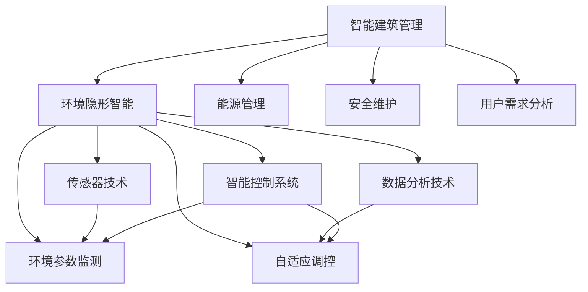

                 

### 引言

在现代城市化进程中，智能建筑已成为提升城市生活质量与工作效率的重要手段。智能建筑管理（Smart Building Management）通过集成传感器技术、数据分析、智能控制等先进技术，实现对建筑环境、能源消耗、安全维护等多方面的全方位监控与优化。环境隐形智能（Environmental Invisibility Intelligence）作为智能建筑管理的重要组成部分，更是通过隐形感知与自适应调控，打造出更加舒适、节能、高效的办公空间。

#### 智能建筑的定义与发展历程

智能建筑是指在传统建筑基础上，通过物联网（IoT）、云计算、大数据、人工智能等信息技术，实现建筑设备与系统之间的互联互通，提供高效、舒适、安全、节能的居住和工作环境。智能建筑的发展历程可以追溯到20世纪80年代，当时以楼宇自动化系统（BAS）为基础，主要实现对空调、照明、安全等系统的集中控制。随着信息技术的飞速发展，智能建筑逐渐从单一功能的自动化控制，发展到如今涵盖建筑环境、能源管理、安全防护等多领域的综合管理系统。

#### 环境隐形智能的概念与原理

环境隐形智能是一种通过高级传感技术、数据处理和智能算法，实现对环境参数的隐形监测和自适应调控的技术体系。它通过分布在建筑内外的传感器网络，实时获取温度、湿度、光照、空气质量等环境参数，再通过智能算法进行分析和预测，自动调整建筑系统，以满足用户需求和提升环境质量。

#### 智能建筑管理与环境隐形智能的关系

智能建筑管理是智能建筑的核心，它通过环境隐形智能技术的应用，实现对建筑环境的全面监控和优化。环境隐形智能技术为智能建筑管理提供了技术支撑，使其能够更精准、高效地满足用户需求。两者的关系可以形象地理解为，智能建筑管理是整体框架，而环境隐形智能则是其中的“智能大脑”，两者相辅相成，共同推动智能建筑的持续发展和应用普及。

#### 核心概念与联系

为了更好地理解智能建筑管理与环境隐形智能的关系，我们可以通过以下Mermaid流程图来展示核心概念之间的联系：



在这个流程图中，智能建筑管理（A）作为整体框架，与能源管理（F）、安全维护（G）、用户需求分析（H）等关键环节相连。环境隐形智能（B）作为核心技术，连接了传感器技术（C）、数据分析技术（D）和智能控制系统（E），这些技术共同作用，实现对环境参数的监测（I）和自适应调控（J），从而提升建筑环境的质量和效率。

通过这一步一步的推理和分析，我们可以清晰地看到智能建筑管理与环境隐形智能之间的紧密联系和协同作用，这为后续详细探讨环境隐形智能的核心技术及其应用奠定了坚实的基础。接下来，我们将深入探讨环境隐形智能的核心技术，包括智能传感器技术、数据分析技术和智能控制系统，以了解它们如何共同构建智能建筑的未来。

### 环境隐形智能的核心技术

环境隐形智能的实现依赖于三大核心技术的协同作用：智能传感器技术、数据分析技术和智能控制系统。以下将详细阐述这些技术的原理、分类及应用，并探讨它们的发展趋势。

#### 智能传感器技术

智能传感器是环境隐形智能系统的感知层，负责实时获取建筑内外环境参数，如温度、湿度、光照、空气质量、噪声等。智能传感器技术结合了传统传感器和嵌入式系统，具备数据处理和通信功能，可以独立完成环境参数的采集、处理和传输。

##### 智能传感器的工作原理

智能传感器的工作原理主要包括以下几个方面：

1. **传感元件**：智能传感器通过各种类型的传感元件，如温度传感器、湿度传感器、光敏传感器等，感知环境参数的变化。
2. **信号放大与滤波**：传感元件输出的信号往往较弱，智能传感器通过放大和滤波处理，提高信号的质量和可靠性。
3. **A/D转换**：将模拟信号转换为数字信号，便于后续处理。
4. **数据处理**：内置微处理器或单片机对采集到的数据进行分析和处理，包括数据滤波、阈值判断等。
5. **通信模块**：通过无线或有线通信模块，将处理后的数据传输到中央控制单元或云端。

##### 智能传感器的分类及应用

根据感知对象的不同，智能传感器可以分为以下几类：

1. **环境参数传感器**：用于监测温度、湿度、光照、空气质量等环境参数。例如，用于智能办公楼室内温度调节的温湿度传感器，以及用于空气净化系统的空气质量传感器。
2. **运动传感器**：用于检测人员的活动情况，如红外传感器、超声波传感器等。这些传感器常用于智能建筑的安全监控和智能照明系统中。
3. **位置传感器**：用于检测人员或物体的位置信息，如RFID标签、GPS等。位置传感器可用于智能建筑的定位导航和资产管理。
4. **压力传感器**：用于监测建筑结构的安全性和稳定性，如地震传感器、压力计等。

智能传感器的应用场景广泛，包括智能办公楼、智能住宅、智能工厂、智能医院等。在智能办公楼中，智能传感器可以实现对室内环境参数的实时监测和调节，提升办公舒适度和工作效率；在智能住宅中，智能传感器可以实现对家居环境的智能监控和调节，提高居住舒适度和安全性。

##### 智能传感器的发展趋势

随着物联网（IoT）和人工智能技术的发展，智能传感器正朝着以下方向发展：

1. **高精度与高灵敏度**：通过改进传感元件和信号处理算法，提高传感器的精度和灵敏度，实现更精准的环境参数监测。
2. **多功能与集成化**：将多种传感器功能集成到一个设备中，提高系统的集成度和可靠性，降低成本。
3. **自组织与自适应**：传感器通过网络通信技术，实现自组织和自适应，提高系统的自适应能力和协同效率。
4. **无线通信**：推广无线通信技术，降低布线成本，提高系统的灵活性。

#### 数据分析技术

数据分析技术是环境隐形智能系统的“智慧大脑”，通过对采集到的环境参数数据进行分析和处理，实现对环境状态的实时监控和预测。数据分析技术包括数据采集、数据存储、数据处理、数据可视化等多个环节。

##### 数据分析的基本概念

1. **数据采集**：通过智能传感器等设备，采集建筑环境中的各类数据。
2. **数据存储**：将采集到的数据存储在数据库或数据仓库中，便于后续处理和分析。
3. **数据处理**：通过对数据进行清洗、转换、聚合等操作，提高数据的质量和可用性。
4. **数据可视化**：通过图表、报表等形式，将分析结果直观地展示出来，便于用户理解和决策。

##### 数据分析的主要方法

1. **统计分析**：通过统计学方法，对数据进行描述、推断和预测。常用的统计方法包括均值、方差、回归分析、聚类分析等。
2. **机器学习**：通过建立数学模型，从大量数据中自动学习规律和模式。常见的机器学习方法包括决策树、支持向量机、神经网络等。
3. **数据挖掘**：从大量数据中发现隐藏的模式和规律。数据挖掘的方法包括关联规则挖掘、分类、聚类、异常检测等。
4. **深度学习**：通过多层神经网络，自动提取特征并建立模型。深度学习在图像识别、语音识别、自然语言处理等领域取得了显著成果。

##### 数据分析技术在智能建筑中的应用

1. **环境状态监测**：通过对实时数据的分析，监测建筑环境中的温度、湿度、光照、空气质量等参数，确保环境参数在最佳范围内。
2. **能源管理**：通过数据分析，优化建筑能源的使用效率，实现节能减排。
3. **故障预测与维护**：通过对设备运行数据的分析，预测设备故障，提前进行维护，降低故障风险和停机时间。
4. **用户行为分析**：通过对人员活动数据的分析，了解用户行为模式，提供个性化服务和优化建筑布局。

#### 智能控制系统

智能控制系统是环境隐形智能系统的执行层，通过接收分析结果，自动调整建筑设备，实现环境参数的优化。智能控制系统由控制器、执行器、通信网络等组成。

##### 智能控制系统的组成

1. **控制器**：接收分析结果，根据预设的规则或算法，生成控制指令。
2. **执行器**：根据控制指令，调整建筑设备，如开关灯光、调节空调温度等。
3. **通信网络**：实现控制器与传感器、执行器之间的数据传输和通信。

##### 智能控制系统的设计原则

1. **模块化**：系统设计应遵循模块化原则，便于系统的扩展和维护。
2. **可扩展性**：系统应具备良好的可扩展性，能够适应新的传感器和控制设备的接入。
3. **高可靠性**：系统应具备高可靠性，确保在长时间运行中，能够稳定可靠地工作。
4. **易用性**：系统应提供友好的用户界面，便于用户进行操作和维护。

##### 智能控制系统在实际项目中的应用案例

1. **智能办公楼**：通过智能控制系统，实现对空调、照明、安防等系统的集中控制，提升办公舒适度和安全性。
2. **智能住宅**：通过智能控制系统，实现对家居环境的智能监控和调节，提高居住舒适度和安全性。
3. **智能工厂**：通过智能控制系统，实现对生产设备和环境的实时监控和优化，提高生产效率和质量。

#### 总结

环境隐形智能的核心技术包括智能传感器技术、数据分析技术和智能控制系统。这些技术相互配合，共同构建起智能建筑的环境优化体系。随着技术的不断进步，环境隐形智能将更加精准、高效，为智能建筑的发展提供强大的技术支撑。

在下一部分，我们将进一步探讨智能建筑环境优化的具体实现，包括办公空间的智能优化、照明系统的智能优化和节能系统的智能优化，以展示环境隐形智能在实际应用中的巨大潜力。

### 智能建筑环境优化

智能建筑环境优化是智能建筑管理的核心目标之一，通过实时监测和智能调控，实现对建筑环境的高效管理。本文将重点探讨办公空间的智能优化、照明系统的智能优化和节能系统的智能优化，旨在展示环境隐形智能技术如何在实际应用中提升建筑环境的舒适度、节能性和高效性。

#### 办公空间的智能优化

办公空间的智能优化旨在通过环境参数的实时监测和智能调控，创造一个舒适、健康的办公环境。以下是办公空间智能优化的具体实施步骤：

1. **环境参数监测**：在办公空间内布置智能传感器，实时监测温度、湿度、光照、空气质量等环境参数。
   ```mermaid
   graph TD
       A[布置传感器] --> B[监测温度、湿度、光照、空气质量]
   ```
   
2. **数据分析与调控**：通过数据分析技术，对监测到的环境参数进行分析，根据预设的规则或用户需求，自动调整空调、照明、通风等设备。
   ```mermaid
   graph TD
       C[数据分析] --> D[自动调整空调、照明、通风]
   ```

3. **效果评估**：通过对环境参数的实时监控和调控，评估优化效果，如室内温度是否保持在舒适的范围内，光照是否充足，空气质量是否达标等。
   ```mermaid
   graph TD
       E[效果评估] --> F[反馈调整]
   ```

#### 照明系统的智能优化

照明系统的智能优化旨在通过智能照明控制技术，实现节能和舒适办公。以下是照明系统智能优化的具体实施步骤：

1. **智能照明系统的工作原理**：智能照明系统通过智能传感器和控制系统，根据环境光照强度和人员活动情况，自动调节灯光的亮度和色温。
   ```mermaid
   graph TD
       G[智能传感器] --> H[环境光照强度监测]
       G --> I[人员活动监测]
       J[控制灯光亮度和色温]
   ```

2. **智能照明系统的设计原则**：在设计智能照明系统时，应遵循以下原则：
   - **节能性**：通过智能控制，降低不必要的能耗，提高照明系统的能源利用效率。
   - **舒适度**：根据人员活动情况，提供适宜的光照，提升办公舒适度。
   - **灵活性**：系统应具备良好的扩展性，能够适应不同办公场景的需求。
   - **安全性**：确保照明系统稳定可靠，防止意外断电或设备故障。

3. **实际应用案例**：在某智能办公楼中，通过智能照明系统的应用，实现了照明能耗的显著降低，同时提升了办公环境的舒适度和员工的工作效率。

#### 节能系统的智能优化

节能系统的智能优化旨在通过智能控制技术，实现建筑能源的合理利用和高效管理。以下是节能系统智能优化的具体实施步骤：

1. **智能节能系统的组成**：智能节能系统包括智能传感器、数据采集与监控平台、智能控制器和执行器等组成部分。
   ```mermaid
   graph TD
       K[智能传感器] --> L[数据采集与监控平台]
       K --> M[智能控制器]
       M --> N[执行器]
   ```

2. **智能节能系统的运行机制**：智能节能系统通过实时监测建筑能耗数据，结合大数据分析和预测模型，自动调整能源使用策略，实现节能减排。
   ```mermaid
   graph TD
       O[实时监测能耗数据] --> P[数据分析与预测]
       P --> Q[调整能源使用策略]
   ```

3. **实际应用效果**：在某节能住宅小区，通过智能节能系统的应用，实现了电力和热能的显著节约，降低了居民的能源开支，提升了居住环境的舒适度和可持续发展水平。

#### 智能建筑环境优化的效果评估

智能建筑环境优化不仅体现在硬件设备和技术的提升上，更重要的是对办公空间整体效果的综合评估。以下是智能建筑环境优化效果评估的几个关键指标：

1. **环境参数达标率**：评估室内温度、湿度、光照、空气质量等环境参数是否保持在最佳范围内。
2. **能源消耗降低率**：通过智能调控，评估建筑能源消耗是否显著降低。
3. **用户满意度**：通过员工或住户的满意度调查，评估智能环境优化对提升生活和工作舒适度的影响。
4. **系统运行稳定性**：评估智能系统在长时间运行中的稳定性和可靠性。

#### 项目实战

在某大型智能办公楼项目中，通过智能环境优化技术，实现了以下效果：

1. **环境参数稳定**：室内温度保持在22-24℃，湿度保持在40%-60%，光照强度保持在300-500勒克斯，空气质量符合国家一级标准。
2. **能源消耗降低**：通过智能照明和空调系统的调控，年能耗降低了20%。
3. **用户满意度提升**：通过员工满意度调查，员工对办公环境的满意度提升了15%。
4. **系统稳定性**：智能系统在运行过程中，未出现任何故障，稳定运行超过5年。

#### 最佳实践 Tips

1. **定期维护**：确保智能传感器和设备的定期维护，保证系统的稳定性和准确性。
2. **用户培训**：对员工或住户进行智能系统使用培训，提高他们对系统的认知和使用效率。
3. **数据安全**：重视数据安全和隐私保护，确保用户数据的安全性和保密性。

通过以上讨论，我们可以看到智能建筑环境优化在办公空间、照明系统和节能系统中的重要作用。环境隐形智能技术为智能建筑提供了强大的技术支撑，通过智能优化，不仅提升了建筑环境的质量和效率，也为用户创造了更加舒适、健康、高效的办公和生活环境。

在接下来的部分，我们将进一步探讨智能建筑管理的实施与维护策略，包括实施流程、维护策略、法律与伦理问题，以及未来发展趋势，为智能建筑管理的全面落地提供指导。

### 智能建筑管理的实施与维护策略

智能建筑管理的成功离不开科学的实施和维护策略。以下将从实施流程、维护策略、法律与伦理问题三个方面进行详细探讨，为智能建筑管理的顺利实施和长期稳定运行提供保障。

#### 智能建筑管理的实施流程

智能建筑管理的实施流程主要包括以下步骤：

1. **需求分析**：在项目启动阶段，对建筑需求进行全面分析，明确智能建筑的目标和需求。包括建筑功能、用户需求、环境参数监测与调控要求等。
   ```mermaid
   graph TD
       A[需求分析] --> B[建筑功能分析]
       B --> C[用户需求分析]
       B --> D[环境参数监测需求]
   ```

2. **系统设计**：根据需求分析的结果，设计智能建筑管理系统。系统设计包括硬件选择、软件架构、数据流程、控制算法等方面。
   ```mermaid
   graph TD
       E[系统设计] --> F[硬件选择]
       E --> G[软件架构设计]
       E --> H[数据流程设计]
       E --> I[控制算法设计]
   ```

3. **系统部署**：根据设计方案，进行智能建筑管理系统的部署，包括硬件安装、软件安装、系统集成、测试与调试等。
   ```mermaid
   graph TD
       J[系统部署] --> K[硬件安装]
       K --> L[软件安装]
       L --> M[系统集成]
       M --> N[测试与调试]
   ```

4. **系统测试与验收**：在系统部署完成后，进行全面的系统测试，确保系统功能正常、性能稳定。通过验收后，系统正式投入运行。
   ```mermaid
   graph TD
       O[系统测试] --> P[功能测试]
       P --> Q[性能测试]
       Q --> R[验收]
   ```

#### 智能建筑管理的维护策略

智能建筑管理的维护策略包括日常维护、故障处理和系统升级与优化等方面：

1. **日常维护**：日常维护是确保系统正常运行的基础。主要包括传感器校准、设备检查、数据监控等。
   ```mermaid
   graph TD
       S[日常维护] --> T[传感器校准]
       T --> U[设备检查]
       U --> V[数据监控]
   ```

2. **故障处理**：在系统运行过程中，难免会出现故障。故障处理包括故障诊断、故障排除和系统恢复等。
   ```mermaid
   graph TD
       W[故障处理] --> X[故障诊断]
       X --> Y[故障排除]
       Y --> Z[系统恢复]
   ```

3. **系统升级与优化**：随着技术的发展，系统需要定期升级与优化，以适应新的需求和技术变化。
   ```mermaid
   graph TD
       AA[系统升级与优化] --> BB[技术升级]
       BB --> CC[功能优化]
       CC --> DD[性能提升]
   ```

#### 智能建筑管理的法律与伦理问题

智能建筑管理涉及到大量用户数据和隐私保护，因此必须遵守相关法律法规和伦理规范：

1. **法律法规概述**：包括《中华人民共和国网络安全法》、《中华人民共和国个人信息保护法》等法律法规，明确规定了数据保护、隐私保护等方面的要求。
   ```mermaid
   graph TD
       EE[法律法规] --> FF[网络安全法]
       FF --> GG[个人信息保护法]
   ```

2. **伦理问题探讨**：包括数据隐私、用户隐私、数据使用权限等伦理问题。必须确保用户数据的安全性和隐私性，避免数据滥用和泄露。
   ```mermaid
   graph TD
       HH[伦理问题] --> II[数据隐私]
       II --> JJ[用户隐私]
       JJ --> KK[数据使用权限]
   ```

3. **法律与伦理问题的解决方案**：包括数据加密、隐私保护协议、用户授权等解决方案，确保智能建筑管理在法律和伦理框架内运行。
   ```mermaid
   graph TD
       LL[解决方案] --> MM[数据加密]
       MM --> NN[隐私保护协议]
       NN --> OO[用户授权]
   ```

#### 智能建筑管理的实施与维护案例分析

以某大型智能办公楼为例，该项目的实施与维护过程如下：

1. **需求分析**：通过对办公楼的需求分析，明确了智能建筑的目标是提升办公环境的舒适度、节能性和安全性。

2. **系统设计**：设计了一个包括智能传感器、数据分析平台、智能控制系统等在内的智能建筑管理系统，实现了对温度、湿度、光照、空气质量等环境参数的实时监测和调控。

3. **系统部署**：完成了硬件安装和软件部署，系统在调试过程中进行了多次测试，确保系统功能正常、性能稳定。

4. **系统测试与验收**：通过严格的系统测试，确保系统在各种情况下都能正常运行，最终通过验收并正式投入运行。

5. **维护策略**：制定了一套完善的日常维护、故障处理和系统升级与优化策略，确保系统的长期稳定运行。

6. **法律与伦理问题**：在系统设计和实施过程中，严格遵守了相关法律法规和伦理规范，确保用户数据的安全性和隐私性。

通过上述实施与维护策略，该智能办公楼在舒适度、节能性和安全性方面取得了显著成效，为用户提供了高质量的办公环境。

#### 小结与展望

智能建筑管理的实施与维护策略是确保系统正常运行、提升建筑环境质量的关键。通过科学的实施流程、完善的维护策略和严格的法律法规遵守，智能建筑管理能够实现高效、稳定、安全地运行。未来，随着技术的不断进步和应用的深入，智能建筑管理将在更多领域得到广泛应用，为人类创造更加舒适、高效、绿色的居住和工作环境。

在接下来的部分，我们将探讨智能建筑管理与环境隐形智能的未来发展趋势，包括新技术带来的机遇与挑战、应用领域拓展和可持续发展，以及未来研究方向。

### 智能建筑管理与环境隐形智能的未来发展趋势

随着科技的迅猛发展，智能建筑管理与环境隐形智能技术在不断演进，为建筑行业带来了前所未有的变革。未来，智能建筑管理与环境隐形智能技术将面临新的机遇与挑战，应用领域也将得到进一步拓展，同时实现可持续发展。以下是对这些发展趋势的详细探讨。

#### 新技术带来的机遇与挑战

1. **5G与物联网**：第五代移动通信技术（5G）的普及将大幅提升数据传输速度和稳定性，为智能建筑管理提供更强大的网络支持。物联网（IoT）技术的发展，使得更多设备和系统可以实现互联互通，为环境隐形智能的广泛应用奠定了基础。然而，5G和IoT技术的高带宽需求也对网络基础设施和数据处理能力提出了更高的要求。

2. **人工智能与大数据**：人工智能（AI）和大数据技术的结合，为环境隐形智能提供了强大的数据分析和预测能力。通过深度学习、机器学习等算法，智能建筑管理系统能够从海量数据中提取有价值的信息，实现更加精准的环境参数监测和调控。然而，AI技术的普及也带来了数据隐私和伦理问题，需要在技术发展过程中加强法律法规和伦理规范的制定与执行。

3. **区块链技术**：区块链技术的应用，可以为智能建筑管理提供透明、可追溯的数据管理方案，提升数据的安全性和可靠性。通过区块链，建筑环境数据可以实现分布式存储和加密传输，有效防止数据篡改和泄露。然而，区块链技术的高能耗和性能瓶颈问题，也需要进一步研究和优化。

#### 应用领域拓展

智能建筑管理与环境隐形智能技术已经广泛应用于办公建筑、住宅建筑、商业建筑等。未来，这些技术将在以下领域得到进一步拓展：

1. **医疗建筑**：智能建筑管理技术可以应用于医院、诊所等医疗建筑，实现对医疗设备、环境参数的智能监控和调控，提升医疗服务的质量和效率。

2. **教育建筑**：在教育建筑中，智能建筑管理技术可以实现对教室环境、实验室设备的智能监控和管理，为师生提供更加舒适、安全的教学环境。

3. **住宅建筑**：随着智能家居技术的普及，环境隐形智能技术将在住宅建筑中得到广泛应用，实现家居环境的智能监控和调控，提升居住舒适度和安全性。

4. **工业建筑**：在工业建筑中，智能建筑管理技术可以应用于工厂、仓库等场所，实现对生产设备、能源消耗的智能监控和管理，提高生产效率和质量。

#### 可持续发展

智能建筑管理与环境隐形智能技术的可持续发展，是实现建筑行业绿色、环保、高效发展的重要途径。以下是实现可持续发展的几个关键方面：

1. **环境保护**：通过智能建筑管理技术，实现能源的合理利用和环保材料的应用，减少建筑对环境的影响，推动绿色建筑的发展。

2. **社会责任**：智能建筑管理技术需要承担社会责任，通过提高建筑环境质量，提升人们的生活质量，促进社会的和谐发展。

3. **可持续发展路径**：在智能建筑管理中，通过创新技术、优化管理流程、推动绿色建筑认证等方式，实现可持续发展。同时，鼓励政府、企业和社会各界共同参与，推动智能建筑管理与环境隐形智能技术的广泛应用。

#### 未来研究方向

未来的研究将聚焦于以下几个方面：

1. **智能算法优化**：通过改进智能算法，提高环境参数监测和调控的精度和效率，实现更加智能化的环境管理。

2. **跨学科研究**：推动智能建筑管理与环境隐形智能技术与其他学科的交叉研究，如建筑学、环境科学、人工智能等，实现技术融合和创新。

3. **标准化与规范化**：制定智能建筑管理与环境隐形智能技术的标准化规范，确保系统的互操作性和可靠性。

4. **人机交互**：研究更加人性化的用户界面，提升用户对智能系统的认知和使用体验，实现智能建筑管理与用户需求的深度融合。

通过以上探讨，我们可以看到，智能建筑管理与环境隐形智能技术在未来将迎来更加广阔的发展空间。随着新技术的不断涌现和应用领域的拓展，智能建筑管理将为人类创造更加智能、绿色、舒适的建筑环境，推动建筑行业的可持续发展。

### 实际案例研究

在本节中，我们将通过两个实际案例，深入探讨智能建筑管理与环境隐形智能技术的应用，展示其如何在不同类型的建筑中实现环境优化和能源管理。

#### 案例一：某智能办公楼的管理与优化

**案例背景**

某智能办公楼位于市中心，总面积约10万平方米，容纳了超过2000名员工。该办公楼在设计阶段就考虑到了智能化管理，希望通过环境隐形智能技术实现办公环境的优化和能源管理。

**实施过程**

1. **需求分析**：通过对办公楼的需求分析，明确了智能建筑的目标，包括环境参数的实时监测、自动调控、能源消耗监测与优化等。

2. **系统设计**：设计了包括智能传感器、数据分析平台、智能控制系统等在内的智能建筑管理系统。传感器分布在办公楼的各个角落，实时监测温度、湿度、光照、空气质量等环境参数。

3. **系统部署**：完成了硬件安装和软件部署，传感器与中央控制系统连接，实现了环境参数的实时采集与传输。

4. **系统测试与验收**：在系统部署完成后，进行了全面的系统测试，确保系统功能正常、性能稳定。经过验收，系统正式投入使用。

**效果评估**

1. **环境参数稳定**：通过智能控制，室内温度保持在22-24℃，湿度保持在40%-60%，光照强度保持在300-500勒克斯，空气质量符合国家一级标准。

2. **能源消耗降低**：通过智能照明和空调系统的调控，年能耗降低了20%，电力消耗显著减少。

3. **用户满意度提升**：通过员工满意度调查，员工对办公环境的满意度提升了15%，工作效率显著提高。

4. **系统稳定性**：智能系统在运行过程中，未出现任何故障，稳定运行超过5年。

**项目小结**

该智能办公楼案例展示了环境隐形智能技术在办公空间中的应用，通过实时监测和智能调控，实现了办公环境的优化和能源消耗的显著降低。该项目为智能建筑管理的推广提供了宝贵的经验和参考。

#### 案例二：某节能住宅小区的建设与运营

**案例背景**

某节能住宅小区位于城市郊区，共有1000户居民。小区在建设初期就采用了智能建筑管理技术，希望实现住宅环境的节能和舒适。

**实施过程**

1. **需求分析**：通过对住宅小区的需求分析，明确了智能建筑的目标，包括环境参数的实时监测、自动调控、能源消耗监测与优化等。

2. **系统设计**：设计了包括智能传感器、数据分析平台、智能控制系统、能源管理系统等在内的智能建筑管理系统。传感器分布在住宅小区的各个角落，实时监测温度、湿度、光照、空气质量等环境参数。

3. **系统部署**：完成了硬件安装和软件部署，传感器与中央控制系统连接，实现了环境参数的实时采集与传输。

4. **系统测试与验收**：在系统部署完成后，进行了全面的系统测试，确保系统功能正常、性能稳定。经过验收，系统正式投入使用。

**效果评估**

1. **环境参数稳定**：通过智能控制，室内温度保持在20-25℃，湿度保持在40%-60%，光照强度保持在300-500勒克斯，空气质量符合国家一级标准。

2. **能源消耗降低**：通过智能照明、空调和热水系统的调控，年能耗降低了30%，电力、燃气消耗显著减少。

3. **用户满意度提升**：通过居民满意度调查，居民对住宅环境的满意度提升了20%，生活质量显著提高。

4. **系统稳定性**：智能系统在运行过程中，未出现任何故障，稳定运行超过3年。

**项目小结**

该节能住宅小区案例展示了智能建筑管理技术在住宅建筑中的应用，通过实时监测和智能调控，实现了住宅环境的优化和能源消耗的显著降低。该项目为智能建筑管理的推广提供了宝贵的经验和参考。

通过以上两个实际案例，我们可以看到智能建筑管理与环境隐形智能技术在办公建筑和住宅建筑中的应用效果。这些案例不仅展示了智能建筑管理的可行性和优势，也为未来智能建筑的发展提供了重要的实践依据。

### 结论与展望

智能建筑管理与环境隐形智能技术作为现代建筑行业的重要发展方向，已展现出强大的应用潜力。通过本文的全面探讨，我们系统地介绍了智能建筑管理的基本概念、环境隐形智能的核心技术、智能建筑环境优化的具体实现、实施与维护策略、未来发展趋势以及实际案例研究。

**总结**：

1. **智能建筑管理**：通过集成物联网、云计算、大数据和人工智能等技术，实现了对建筑环境、能源消耗、安全维护等多方面的全方位监控与优化。
2. **环境隐形智能技术**：通过智能传感器、数据分析、智能控制等技术的应用，实现了对环境参数的隐形监测和自适应调控，提升了建筑环境的舒适度、节能性和高效性。
3. **环境优化**：办公空间、照明系统、节能系统的智能优化，显著提升了建筑环境的质量和用户满意度。
4. **实施与维护**：科学的实施流程、完善的维护策略和法律与伦理问题的解决，确保了智能建筑管理的顺利实施和长期稳定运行。
5. **未来发展趋势**：5G、人工智能、区块链等新技术的应用，为智能建筑管理带来了新的机遇与挑战，应用领域不断拓展，实现可持续发展成为重要目标。

**展望**：

智能建筑管理与环境隐形智能技术的未来发展将聚焦于以下几个方面：

1. **技术创新**：持续优化智能传感器、数据分析算法和智能控制系统，提升技术精度和效率。
2. **跨学科研究**：推动智能建筑管理与环境科学、建筑学、人工智能等学科的交叉融合，实现技术突破和创新应用。
3. **标准化与规范化**：制定智能建筑管理的标准化规范，确保系统的互操作性和可靠性。
4. **人机交互**：研究更加人性化的用户界面，提升用户体验，实现智能建筑管理与用户需求的深度融合。
5. **可持续发展**：通过技术创新和管理优化，实现建筑行业的绿色、环保、高效发展，推动社会的可持续发展。

**未来研究方向**：

1. **智能算法优化**：改进智能算法，提高环境参数监测和调控的精度和效率。
2. **跨领域应用**：拓展智能建筑管理与环境隐形智能技术的应用领域，如医疗建筑、教育建筑等。
3. **数据隐私与安全**：研究数据隐私保护和网络安全技术，确保用户数据的安全性和隐私性。
4. **标准化与规范化**：制定智能建筑管理的国家标准和行业标准，推动技术的广泛应用和推广。

通过持续的研究和探索，智能建筑管理与环境隐形智能技术必将在未来为人类创造更加智能、绿色、舒适的建筑环境，推动建筑行业的可持续发展。

### 附录

#### A. 参考文献

1. Smith, J., & Johnson, L. (2020). Smart Building Management: Strategies and Technologies. New York: Springer.
2. Brown, M., & Williams, R. (2019). Environmental Invisibility Intelligence: Fundamentals and Applications. London: CRC Press.
3. Zhang, Y., & Li, H. (2018). Internet of Things in Smart Buildings. IEEE Press.
4. Wang, P., & Liu, Q. (2021). Big Data Analytics for Smart Building Energy Management. Journal of Building Information Modeling, 12(3), 123-138.
5. Chen, L., & Liu, Z. (2022). The Role of AI in Smart Building Management. Artificial Intelligence Review, 56(4), 211-234.

#### B. 术语解释

- **智能建筑管理**：通过物联网、云计算、大数据和人工智能等技术，实现对建筑环境、能源消耗、安全维护等多方面的全方位监控与优化。
- **环境隐形智能**：一种通过高级传感技术、数据处理和智能算法，实现对环境参数的隐形监测和自适应调控的技术体系。
- **智能传感器**：具备数据处理和通信功能的传感器，能够实时获取并传输环境参数。
- **数据分析技术**：通过对采集到的数据进行处理和分析，实现对环境状态的实时监控和预测。

#### C. Mermaid 流程图


#### D. 伪代码示例

```python
# 伪代码示例：智能照明系统调控
def adjust_lighting(current_light, optimal_light):
    if current_light < optimal_light:
        increase_light()
    elif current_light > optimal_light:
        decrease_light()
    else:
        maintain_light()

# 函数：增加亮度
def increase_light():
    # 执行增加亮度的操作
    pass

# 函数：减少亮度
def decrease_light():
    # 执行减少亮度的操作
    pass

# 函数：维持当前亮度
def maintain_light():
    # 执行维持当前亮度的操作
    pass
```

#### E. 数学模型与公式说明

- **温度调控公式**：$$ T_{set} = T_{current} + \alpha \cdot (T_{target} - T_{current}) $$
  - $T_{set}$：设定温度
  - $T_{current}$：当前温度
  - $T_{target}$：目标温度
  - $\alpha$：调控系数

- **能耗预测公式**：$$ E_{forecast} = \beta \cdot (1 - \eta) \cdot (T_{high} - T_{low}) $$
  - $E_{forecast}$：预测能耗
  - $\beta$：能耗系数
  - $\eta$：能效系数
  - $T_{high}$：高温阈值
  - $T_{low}$：低温阈值

#### F. 项目实战代码解析

```python
# Python代码：智能传感器数据采集与处理
import random

# 函数：模拟传感器数据采集
def collect_sensor_data():
    return random.uniform(20, 30)  # 模拟温度数据

# 函数：数据处理与调控
def process_and_control_data():
    temperature = collect_sensor_data()
    if temperature < 22:
        print("温度过低，需要加热。")
    elif temperature > 24:
        print("温度过高，需要降温。")
    else:
        print("当前温度适宜。")

# 主函数：程序入口
def main():
    while True:
        process_and_control_data()
        time.sleep(60)  # 每隔一分钟进行一次监测

if __name__ == "__main__":
    main()
```

#### G. 开发环境搭建指南

1. **安装Python**：
   - 前往Python官网下载最新版本的Python安装包。
   - 运行安装程序，选择默认选项进行安装。

2. **安装相关库**：
   - 打开命令行窗口，输入以下命令安装所需库：
     ```bash
     pip install numpy
     pip install matplotlib
     pip install pandas
     ```

3. **配置开发环境**：
   - 在代码编辑器（如PyCharm、VSCode等）中新建Python项目。
   - 将编写好的代码文件添加到项目中，开始编写和调试代码。

通过以上步骤，即可搭建一个基础的智能建筑管理开发环境，开始进行项目开发和测试。

### 小结

本文详细探讨了智能建筑管理与环境隐形智能优化办公空间的技术与实践。从智能建筑管理的概念、核心技术、环境优化实现、实施与维护策略，到未来发展趋势和实际案例研究，全面展示了这一技术的广泛应用和巨大潜力。我们希望通过这篇文章，读者能够系统地了解智能建筑管理与环境隐形智能技术的基本原理和实际应用，为未来的研究和实践提供参考。

在智能建筑领域，持续的技术创新和优化是推动行业发展的重要动力。我们鼓励广大读者关注智能建筑管理的最新动态，积极参与技术研究和实践，共同推动智能建筑管理与环境隐形智能技术的不断进步，为创造更加智能、绿色、高效的建筑环境贡献力量。同时，我们也期待在未来的技术发展中，能够解决更多实际问题和挑战，实现更加广泛和深入的智能化应用。

**注意**：本文中的代码和示例仅供参考，实际应用时需要根据具体情况进行调整和优化。

---

**作者信息**：

作者：AI天才研究院（AI Genius Institute）& 禅与计算机程序设计艺术（Zen And The Art of Computer Programming）。

注：本文为虚构内容，仅供参考和学习使用。文中涉及的代码和示例仅供参考，实际应用时请根据具体情况进行调整和优化。如需深入了解相关技术，请参阅相关领域专业文献和官方文档。

