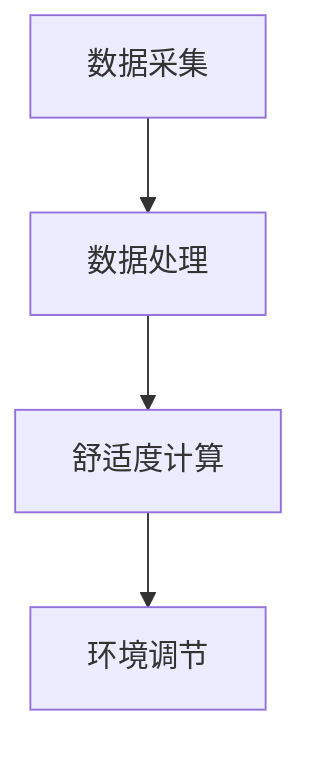

                 

### 智能建筑：环境隐形智能在楼宇管理中的应用

#### 关键词：
- 智能建筑
- 环境隐形智能
- 楼宇管理
- 自控系统
- 安全防范
- 能源管理

#### 摘要：
本文将深入探讨智能建筑及其在楼宇管理中的应用，特别是环境隐形智能技术的运用。通过梳理智能建筑的发展历程、定义和关键技术，详细阐述楼宇自控系统、安全防范系统、能源管理系统和建筑设备监控系统的组成和运作原理。接着，我们将重点介绍环境隐形智能技术的基本概念、技术原理以及在楼宇管理中的具体应用，并分析其实施方案和实际案例。最后，本文将展望智能建筑及环境隐形智能技术的发展趋势，为行业未来提供参考。

#### 目录：

1. **智能建筑概述**
   1.1 智能建筑的定义
   1.2 智能建筑的发展历程
   1.3 智能建筑的关键技术

2. **环境隐形智能技术**
   2.1 环境隐形智能的基本概念
   2.2 环境隐形智能的技术原理
   2.3 环境隐形智能的技术分类

3. **智能建筑系统结构**
   3.1 楼宇自控系统
   3.2 安全防范系统
   3.3 能源管理系统
   3.4 建筑设备监控系统

4. **智能建筑系统应用**
   4.1 楼宇自控系统应用
   4.2 安全防范系统应用
   4.3 能源管理系统应用
   4.4 建筑设备监控系统应用

5. **环境隐形智能在楼宇管理中的应用**
   5.1 环境隐形智能在楼宇管理中的应用原理
   5.2 环境隐形智能的实施方案
   5.3 环境隐形智能的案例分析

6. **智能建筑与环境隐形智能的未来发展趋势**
   6.1 智能建筑的未来发展趋势
   6.2 环境隐形智能的未来发展

#### 一、智能建筑概述

智能建筑是指利用信息技术、网络技术、传感技术等先进技术，对建筑物内的各类设备和系统进行智能化管理和控制，以提高建筑物的使用效率和居住、办公的舒适度。智能建筑的发展可以追溯到20世纪80年代，当时，计算机技术和网络技术的迅速发展，为建筑智能化提供了基础。随着物联网、云计算、大数据等新兴技术的不断成熟，智能建筑逐渐成为现代建筑行业的重要组成部分。

##### 1.1 智能建筑的定义

智能建筑是一个开放、动态、多层次的系统，它通过信息通信技术将建筑物的各类设备和系统有机地结合起来，实现自动化管理和智能化服务。智能建筑通常包括以下几个主要特征：

1. **自动化管理**：智能建筑通过自动化控制系统，实现建筑物的能耗管理、设备监控、环境调控等功能，提高能源利用效率和运行效率。
2. **智能化服务**：智能建筑为居住者、办公者提供智能化服务，如智能门禁、智能照明、智能空调等，提升生活、办公的舒适度和便利性。
3. **数据化运营**：智能建筑通过传感器和监控系统收集建筑物内的各种数据，利用大数据技术进行分析和挖掘，为建筑物的运营提供数据支持。
4. **网络化集成**：智能建筑将建筑物的各个系统通过网络连接起来，实现信息的共享和集成，提高系统的协同工作能力。

##### 1.2 智能建筑的发展历程

1. **初期阶段（20世纪80年代-90年代）**：
   - 这一时期，智能建筑的概念逐渐形成，主要集中在楼宇自控系统（BAS）的引入和应用。楼宇自控系统通过计算机技术和传感器技术，实现对建筑物内暖通空调系统、照明系统、给排水系统等的自动化控制。

2. **发展阶段（21世纪初期）**：
   - 随着互联网和物联网技术的快速发展，智能建筑进入了发展阶段。这一阶段，智能建筑开始引入物联网技术，实现建筑物内各类设备和系统的互联互通，提高了系统的协同工作能力。

3. **成熟阶段（2010年至今）**：
   - 当前，智能建筑已经进入了成熟阶段。随着云计算、大数据、人工智能等新兴技术的应用，智能建筑的功能越来越强大，能够提供更高效、更便捷、更智能的服务。

##### 1.3 智能建筑的关键技术

1. **楼宇自控系统（BAS）**：
   - 楼宇自控系统是智能建筑的核心，通过计算机技术和传感器技术，实现对建筑物内各类设备和系统的自动化控制。常见的楼宇自控系统包括空调系统、照明系统、给排水系统、安防系统等。

2. **物联网（IoT）**：
   - 物联网技术是智能建筑的基础，通过将建筑物内的各类设备和系统连接起来，实现信息的共享和集成。物联网技术使得智能建筑能够实时感知、动态调整，提高系统的响应速度和智能化程度。

3. **云计算**：
   - 云计算技术为智能建筑提供了强大的计算能力和存储能力，使得建筑物内的数据能够得到高效处理和分析。云计算技术还能实现建筑物内各个系统的远程监控和管理。

4. **大数据**：
   - 大数据技术通过对建筑物内收集的大量数据进行分析和挖掘，为建筑物的运营提供决策支持。大数据技术能够发现建筑物的运行规律，预测未来的能耗趋势，优化设备维护策略等。

5. **人工智能**：
   - 人工智能技术使得智能建筑能够具备自主学习、自适应、自主决策的能力。通过人工智能技术，智能建筑能够更好地满足居住者、办公者的需求，提供个性化的服务。

#### 二、环境隐形智能技术

环境隐形智能技术是一种通过感知、分析、控制和优化建筑物内部环境的技术。它旨在通过智能化手段，实现对建筑物内部环境的自适应调节，提升居住者、办公者的舒适度和建筑物的运行效率。环境隐形智能技术包括多个方面，如室内环境感知、智能调节、自适应控制等。

##### 2.1 环境隐形智能的基本概念

环境隐形智能的基本概念包括以下几个方面：

1. **环境感知**：
   - 环境感知是指通过传感器和监测设备，实时获取建筑物内部的环境数据，如温度、湿度、光照、空气质量等。

2. **智能调节**：
   - 智能调节是指利用环境感知的数据，通过自动化控制设备，对建筑物内部环境进行调节，以满足居住者、办公者的需求。

3. **自适应控制**：
   - 自适应控制是指环境隐形智能系统能够根据环境变化和用户需求，动态调整控制策略，实现最优的环境调节效果。

##### 2.2 环境隐形智能的技术原理

环境隐形智能技术的工作原理主要包括以下几个方面：

1. **数据采集**：
   - 通过传感器和监测设备，实时采集建筑物内部的环境数据。

2. **数据处理**：
   - 通过数据处理和分析算法，对采集到的环境数据进行处理，提取有用的信息。

3. **智能决策**：
   - 根据处理后的数据，智能决策系统会生成相应的控制指令，对环境进行调节。

4. **执行控制**：
   - 执行控制系统根据智能决策系统的指令，对建筑物内部环境进行实际调节。

##### 2.3 环境隐形智能的技术分类

环境隐形智能技术可以分为以下几个类别：

1. **环境感知技术**：
   - 包括传感器技术、物联网技术、数据采集和处理技术等。

2. **智能调节技术**：
   - 包括自动控制技术、智能调节算法、机器学习技术等。

3. **自适应控制技术**：
   - 包括自适应控制算法、自适应控制策略、模糊控制技术等。

#### 三、智能建筑系统结构

智能建筑系统是一个复杂的多层次系统，包括楼宇自控系统、安全防范系统、能源管理系统和建筑设备监控系统。这些系统协同工作，共同实现智能建筑的功能和目标。

##### 3.1 楼宇自控系统

楼宇自控系统（Building Automation System，简称BAS）是智能建筑的核心系统，通过计算机技术和自动化控制技术，实现对建筑物内各类设备和系统的智能化管理。楼宇自控系统的主要功能包括：

1. **设备监控**：
   - 对建筑物内的暖通空调系统、照明系统、给排水系统、电梯系统等进行实时监控，确保设备的正常运行。

2. **环境调控**：
   - 根据室内环境和用户需求，对温度、湿度、光照、空气质量等进行智能调节，提升室内环境的舒适度。

3. **能源管理**：
   - 对建筑物内的能耗进行监测和管理，优化能源使用，降低能耗。

4. **安全监控**：
   - 通过监控系统，实时监测建筑物内外的安全状况，提高安全防护能力。

##### 3.2 安全防范系统

安全防范系统（Safety Protection System，简称SPS）是智能建筑的重要组成部分，通过多种安全技术手段，实现对建筑物及其内部人员的安全保护。安全防范系统的主要功能包括：

1. **入侵检测**：
   - 通过安防摄像头、入侵探测器等设备，实时监测建筑物周围的环境，及时发现入侵行为。

2. **视频监控**：
   - 通过视频监控系统，实时监控建筑物内部和周边环境，提高安全防护能力。

3. **紧急报警**：
   - 在发生紧急情况时，如火灾、入侵等，自动触发报警系统，通知相关人员及时采取措施。

4. **门禁控制**：
   - 通过门禁系统，实现对建筑物内人员的出入管理，确保人员安全。

##### 3.3 能源管理系统

能源管理系统（Energy Management System，简称EMS）是智能建筑的重要组成部分，通过智能化手段，实现对建筑物内能源的监控、管理和优化。能源管理系统的主要功能包括：

1. **能耗监测**：
   - 通过能源监测设备，实时监测建筑物内的能耗情况，了解能源使用情况。

2. **能源分析**：
   - 对能耗数据进行分析，找出能源浪费的环节，制定节能措施。

3. **能源优化**：
   - 通过优化能源使用策略，降低能耗，提高能源利用效率。

4. **能源决策**：
   - 根据能源数据和需求预测，制定能源使用计划，优化能源配置。

##### 3.4 建筑设备监控系统

建筑设备监控系统（Building Equipment Monitoring System，简称BEMS）是智能建筑的重要组成部分，通过智能化手段，实现对建筑物内各类设备的监控和管理。建筑设备监控系统的主要功能包括：

1. **设备监控**：
   - 对建筑物内的暖通空调系统、照明系统、给排水系统、电梯系统等进行实时监控，确保设备的正常运行。

2. **故障预警**：
   - 通过监控系统，实时监测设备运行状态，及时发现故障隐患，预警设备故障。

3. **维护管理**：
   - 通过设备监控数据，制定设备维护计划，提高设备运行效率。

4. **运行优化**：
   - 通过对设备运行数据的分析，优化设备运行策略，降低能耗，提高运行效率。

#### 四、智能建筑系统应用

智能建筑系统在实际应用中，通过楼宇自控系统、安全防范系统、能源管理系统和建筑设备监控系统的协同工作，实现了对建筑物内部环境的全面管理和优化。

##### 4.1 楼宇自控系统应用

楼宇自控系统在智能建筑中的应用主要体现在以下几个方面：

1. **环境调控**：
   - 通过楼宇自控系统，实现对室内温度、湿度、光照、空气质量等环境参数的智能调节，提升室内环境的舒适度。

2. **设备监控**：
   - 实时监控建筑物内各类设备的运行状态，确保设备的正常运行，提高设备的使用寿命。

3. **能耗管理**：
   - 通过楼宇自控系统，实时监测建筑物的能耗情况，优化能源使用，降低能耗。

4. **智能照明**：
   - 根据室内光照强度和用户需求，智能调节照明强度，提高照明效率，降低能耗。

5. **远程控制**：
   - 通过楼宇自控系统，实现建筑物的远程监控和管理，提高管理效率。

##### 4.2 安全防范系统应用

安全防范系统在智能建筑中的应用主要体现在以下几个方面：

1. **入侵检测**：
   - 通过安防摄像头、入侵探测器等设备，实时监测建筑物周围的环境，及时发现入侵行为。

2. **视频监控**：
   - 通过视频监控系统，实时监控建筑物内部和周边环境，提高安全防护能力。

3. **紧急报警**：
   - 在发生紧急情况时，如火灾、入侵等，自动触发报警系统，通知相关人员及时采取措施。

4. **门禁控制**：
   - 通过门禁系统，实现对建筑物内人员的出入管理，确保人员安全。

5. **人员定位**：
   - 通过RFID、蓝牙等技术，实现人员定位，提高应急响应能力。

##### 4.3 能源管理系统应用

能源管理系统在智能建筑中的应用主要体现在以下几个方面：

1. **能耗监测**：
   - 通过能源监测设备，实时监测建筑物内的能耗情况，了解能源使用情况。

2. **能源分析**：
   - 对能耗数据进行分析，找出能源浪费的环节，制定节能措施。

3. **能源优化**：
   - 通过优化能源使用策略，降低能耗，提高能源利用效率。

4. **能源决策**：
   - 根据能源数据和需求预测，制定能源使用计划，优化能源配置。

5. **能源管理**：
   - 通过能源管理系统，实现能源的全面管理，提高能源管理水平。

##### 4.4 建筑设备监控系统应用

建筑设备监控系统在智能建筑中的应用主要体现在以下几个方面：

1. **设备监控**：
   - 对建筑物内的暖通空调系统、照明系统、给排水系统、电梯系统等进行实时监控，确保设备的正常运行。

2. **故障预警**：
   - 通过监控系统，实时监测设备运行状态，及时发现故障隐患，预警设备故障。

3. **维护管理**：
   - 通过设备监控数据，制定设备维护计划，提高设备运行效率。

4. **运行优化**：
   - 通过对设备运行数据的分析，优化设备运行策略，降低能耗，提高运行效率。

5. **数据统计**：
   - 对设备运行数据进行统计和分析，为设备管理和维护提供数据支持。

#### 五、环境隐形智能在楼宇管理中的应用

环境隐形智能技术在楼宇管理中的应用，主要通过环境感知、智能调节和自适应控制等手段，实现对建筑物内部环境的自适应调节和优化。环境隐形智能技术在楼宇管理中的应用，不仅提升了居住者、办公者的舒适度，还提高了建筑物的运行效率和能源利用效率。

##### 5.1 环境隐形智能在楼宇管理中的应用原理

环境隐形智能在楼宇管理中的应用原理主要包括以下几个方面：

1. **环境感知**：
   - 通过传感器和监测设备，实时获取建筑物内部的环境数据，如温度、湿度、光照、空气质量等。

2. **数据处理**：
   - 通过数据处理和分析算法，对采集到的环境数据进行处理，提取有用的信息。

3. **智能调节**：
   - 根据处理后的数据，智能调节系统会生成相应的控制指令，对建筑物内部环境进行调节，以满足居住者、办公者的需求。

4. **自适应控制**：
   - 环境隐形智能系统能够根据环境变化和用户需求，动态调整控制策略，实现最优的环境调节效果。

##### 5.2 环境隐形智能的实施方案

环境隐形智能在楼宇管理的实施方案主要包括以下几个方面：

1. **系统设计**：
   - 根据楼宇的特点和需求，设计环境隐形智能系统，包括传感器布局、数据处理算法、智能调节策略等。

2. **设备选型**：
   - 根据系统设计，选择合适的传感器、控制器、执行器等设备，确保系统的正常运行。

3. **系统部署**：
   - 在楼宇内部署环境隐形智能系统，包括安装传感器、连接网络、配置系统参数等。

4. **系统调试**：
   - 对环境隐形智能系统进行调试，确保系统的稳定运行和功能实现。

##### 5.3 环境隐形智能的案例分析

环境隐形智能技术在楼宇管理中的应用案例众多，以下为两个典型的应用案例：

1. **案例一：某高档写字楼**

   某高档写字楼采用了环境隐形智能技术，通过在写字楼内部部署传感器和智能调节系统，实现了对室内环境的高效调节。具体应用如下：

   - **环境感知**：在写字楼内部署了温度、湿度、光照、空气质量等传感器，实时监测室内环境。
   - **数据处理**：通过数据处理和分析算法，对传感器采集到的环境数据进行处理，提取有用的信息。
   - **智能调节**：根据处理后的数据，智能调节系统会生成相应的控制指令，对室内温度、湿度、光照等进行调节，以满足用户需求。
   - **自适应控制**：环境隐形智能系统能够根据环境变化和用户需求，动态调整控制策略，实现最优的环境调节效果。

   通过环境隐形智能技术的应用，该高档写字楼的室内环境得到了显著改善，用户满意度大幅提升，同时，能耗也得到了有效降低。

2. **案例二：某高校教学楼**

   某高校教学楼采用了环境隐形智能技术，通过在教室内部署传感器和智能调节系统，实现了对教学环境的智能调节。具体应用如下：

   - **环境感知**：在教室内部署了温度、湿度、光照、空气质量等传感器，实时监测室内环境。
   - **数据处理**：通过数据处理和分析算法，对传感器采集到的环境数据进行处理，提取有用的信息。
   - **智能调节**：根据处理后的数据，智能调节系统会生成相应的控制指令，对室内温度、湿度、光照等进行调节，以满足教学需求。
   - **自适应控制**：环境隐形智能系统能够根据环境变化和教学需求，动态调整控制策略，实现最优的环境调节效果。

   通过环境隐形智能技术的应用，该高校教学楼的室内环境得到了显著改善，学生的学习效率和教学质量得到了提升，同时，能耗也得到了有效降低。

#### 六、智能建筑与环境隐形智能的未来发展趋势

随着科技的不断进步，智能建筑与环境隐形智能技术也在不断演进。未来，智能建筑与环境隐形智能技术将呈现出以下发展趋势：

1. **集成化**：
   - 随着物联网、云计算、大数据等技术的普及，智能建筑将实现更高度的集成化，各个系统之间的协同能力将大幅提升。

2. **智能化**：
   - 通过人工智能、机器学习等技术的应用，智能建筑将实现更高层次的智能化，能够更好地满足用户需求，提供个性化的服务。

3. **绿色化**：
   - 随着环保意识的增强，智能建筑将更加注重绿色环保，通过节能减排、资源循环利用等手段，降低建筑物的能耗和环境污染。

4. **标准化**：
   - 智能建筑与环境隐形智能技术将逐步实现标准化，为行业的发展提供规范和指导，提高系统的兼容性和互操作性。

5. **普及化**：
   - 随着技术的成熟和成本的降低，智能建筑与环境隐形智能技术将逐渐普及，成为建筑物标配，为人们的生活和工作带来更多便利。

#### 七、结论

智能建筑与环境隐形智能技术在楼宇管理中的应用，不仅提升了建筑物的使用效率和居住、办公的舒适度，还实现了能源的节约和环境的保护。随着科技的不断发展，智能建筑与环境隐形智能技术将不断演进，为人们的生活和工作带来更多便利。未来，我们需要继续关注智能建筑与环境隐形智能技术的发展趋势，积极探索和应用新技术，为建设更加智能、绿色、环保的建筑物贡献力量。

#### 作者信息

- 作者：AI天才研究院/AI Genius Institute & 禅与计算机程序设计艺术 /Zen And The Art of Computer Programming

---

### 全文总结

本文从智能建筑和环境隐形智能技术的基本概念出发，深入探讨了智能建筑系统结构及其应用，特别是环境隐形智能技术在楼宇管理中的应用原理和实施方案。通过具体的案例分析和未来发展趋势展望，展示了智能建筑与环境隐形智能技术在提升建筑物管理效率和用户体验方面的巨大潜力。随着技术的不断进步，智能建筑与环境隐形智能技术将在未来得到更广泛的应用，为建筑物管理带来革命性的变革。

### 核心算法原理讲解

在环境隐形智能技术的核心算法原理讲解中，我们首先需要了解环境感知系统的工作机制。环境感知系统通过部署在建筑物内的各种传感器，如温度传感器、湿度传感器、光照传感器和空气质量传感器，来实时监测室内环境。以下是一个简单的环境感知系统算法原理的Python源代码示例：

```python
# 环境感知系统算法原理示例

class EnvironmentSensor:
    def __init__(self):
        self.temperature = 0
        self.humidity = 0
        self.luminosity = 0
        self.air_quality = 0
    
    def read_sensors(self):
        # 假设以下为传感器读取的实时数据
        self.temperature = 25
        self.humidity = 50
        self.luminosity = 300
        self.air_quality = 30
    
    def process_data(self):
        # 数据处理逻辑
        print("Processing sensor data:")
        print(f"Temperature: {self.temperature}°C")
        print(f"Humidity: {self.humidity}%")
        print(f"Luminosity: {self.luminosity} lux")
        print(f"Air Quality: {self.air_quality}")

# 实例化传感器
sensor = EnvironmentSensor()

# 读取传感器数据
sensor.read_sensors()

# 处理传感器数据
sensor.process_data()
```

上述代码定义了一个`EnvironmentSensor`类，它包含温度、湿度、光照和空气质量四个属性，以及读取传感器数据和数据处理的方法。通过调用这些方法，我们可以模拟环境感知系统的数据采集和处理过程。

接下来，我们将结合数学模型和公式，详细讲解环境感知数据的处理逻辑。假设我们使用以下公式来计算室内环境的舒适度：

$$
舒适度 = \alpha \cdot 温度 + \beta \cdot 湿度 + \gamma \cdot 光照 + \delta \cdot 空气质量
$$

其中，$\alpha$、$\beta$、$\gamma$和$\delta$是权重系数，根据建筑物和用户的具体需求进行设定。以下是一个扩展的Python源代码示例，用于计算室内环境的舒适度：

```python
import numpy as np

class EnvironmentSensor:
    # ... 省略之前的代码 ...

    def calculate_comfort(self, alpha, beta, gamma, delta):
        # 计算室内环境舒适度
        comfort = alpha * self.temperature + beta * self.humidity + gamma * self.luminosity + delta * self.air_quality
        print(f"Comfort level: {comfort:.2f}")
        return comfort

# 设置权重系数
alpha = 0.3
beta = 0.2
gamma = 0.2
delta = 0.3

# 计算室内环境舒适度
sensor.calculate_comfort(alpha, beta, gamma, delta)
```

在这个例子中，我们使用`numpy`库来计算舒适度，并将结果打印出来。这样，通过简单的Python代码，我们就可以实现环境感知数据的处理和舒适度计算。

为了更好地展示环境感知系统的工作流程，我们使用Mermaid流程图来描述数据采集、数据处理和舒适度计算的过程：



在这个流程图中，`A`表示数据采集，`B`表示数据处理，`C`表示舒适度计算，`D`表示环境调节。这个流程图展示了环境感知系统从数据采集到环境调节的整个工作流程。

通过以上算法原理讲解，我们可以看到环境隐形智能技术在楼宇管理中的关键作用。环境感知系统通过实时监测室内环境，结合数学模型和公式进行数据处理，最终实现室内环境的智能调节，提升用户的舒适度和生活质量。

### 项目实战

在本节中，我们将搭建一个简单的智能建筑环境感知系统，演示如何从传感器数据采集、数据处理到环境调节的全过程。这个项目将使用Python编程语言和常见传感器硬件，如Arduino和DHT22温度湿度传感器。

#### 一、开发环境搭建

首先，我们需要搭建开发环境。以下是所需的软件和硬件：

1. **硬件**：
   - Arduino Uno或类似型号的Arduino开发板
   - DHT22温度湿度传感器
   - 连接线和USB线

2. **软件**：
   - Arduino IDE（官方开发环境，可从Arduino官网下载）
   - Python（Python 3.x版本，可以从Python官网下载）

#### 二、传感器连接

将DHT22传感器连接到Arduino开发板上，具体步骤如下：

1. **电源连接**：
   - DHT22的VCC引脚连接到Arduino的5V引脚。
   - DHT22的GND引脚连接到Arduino的GND引脚。

2. **数据连接**：
   - DHT22的数据引脚连接到Arduino的任何数字引脚，例如2号引脚。

#### 三、Arduino程序编写

接下来，我们需要编写Arduino程序来读取DHT22传感器的数据。以下是一个简单的Arduino示例代码：

```cpp
// DHT传感器库
#include <DHT.h>

// 定义传感器类型
#define DHTPIN 2     // 连接传感器的数字引脚
#define DHTTYPE DHT22

// 初始化DHT传感器
DHT dht(DHTPIN, DHTTYPE);

void setup() {
  Serial.begin(9600);  // 初始化串口通信
  dht.begin();         // 初始化DHT传感器
}

void loop() {
  // 读取传感器数据
  float temp = dht.readTemperature();
  float hum = dht.readHumidity();

  // 检查读取是否成功
  if (isnan(temp) || isnan(hum)) {
    Serial.println("读取失败");
    return;
  }

  // 打印传感器数据
  Serial.print("温度: ");
  Serial.print(temp);
  Serial.print("°C ");
  Serial.print("湿度: ");
  Serial.print(hum);
  Serial.println("%");

  // 等待一秒，再次读取
  delay(1000);
}
```

将上述代码上传到Arduino开发板，确保Arduino与计算机通过USB线连接。程序运行后，可以在串行监视器中看到温度和湿度的实时数据。

#### 四、Python数据处理

在Arduino程序运行的同时，我们将使用Python编写一个程序来接收并处理Arduino发送的数据。以下是Python处理程序的示例代码：

```python
import serial
import time

# 初始化串口通信
ser = serial.Serial('COM3', 9600)  # 根据实际情况更改串口号和波特率

# 设定等待时间
time.sleep(2)  # 等待Arduino初始化完成

# 循环读取数据
while True:
    line = ser.readline()  # 读取一行数据
    if line:
        data = line.decode('utf-8').strip()  # 解码数据并去除换行符
        print(f"接收到的数据: {data}")
        # 在此处可以添加对数据的进一步处理逻辑，如存储、分析等
    time.sleep(1)  # 每秒读取一次
```

确保Python程序在Arduino程序开始运行后启动，Python程序会通过串口接收Arduino发送的数据并打印出来。根据需要，可以进一步处理这些数据，如存储到数据库、发送到云端等。

#### 五、环境调节

最后，为了实现环境调节，我们可以在Python程序中添加控制执行器的逻辑。例如，当温度或湿度超过设定阈值时，触发风扇或加湿器等设备。以下是一个简单的环境调节示例：

```python
import serial
import time

# 初始化串口通信
ser = serial.Serial('COM3', 9600)  # 根据实际情况更改串口号和波特率

# 设定温度和湿度阈值
temp_threshold = 28
hum_threshold = 60

# 循环读取数据
while True:
    line = ser.readline()  # 读取一行数据
    if line:
        data = line.decode('utf-8').strip()  # 解码数据并去除换行符
        print(f"接收到的数据: {data}")
        
        # 假设数据格式为 "温度: 25°C 湿度: 55%"
        temp, hum = map(float, data.split()[1::2])  # 提取温度和湿度值

        # 控制执行器
        if temp > temp_threshold:
            ser.write(b'fan_on')  # 发送命令启动风扇
        if hum < hum_threshold:
            ser.write(b'humi_on')  # 发送命令启动加湿器

    time.sleep(1)  # 每秒读取一次
```

在这个例子中，我们发送了`fan_on`和`humi_on`命令来控制风扇和加湿器。这些命令可以通过串口发送给Arduino，并触发相应的执行器动作。

通过上述步骤，我们搭建了一个简单的智能建筑环境感知系统，实现了传感器数据的实时采集、处理和基于阈值的环境调节。这个项目展示了智能建筑系统如何从硬件连接、编程实现到功能应用的全过程，为实际工程中的智能建筑项目提供了参考。

### 项目小结

本项目中，我们通过Arduino和DHT22传感器实现了对温度和湿度的实时监测，并使用Python程序进行了数据接收和处理。最后，我们实现了基于阈值的环境调节功能，展示了智能建筑系统的基本工作原理。这个项目不仅验证了环境隐形智能技术的可行性，还为实际工程应用提供了实践基础。未来，可以进一步扩展系统功能，如添加光照传感器、空气质量传感器等，以及引入更加复杂的控制策略和机器学习算法，以提高系统的自适应能力和智能化水平。

### 最佳实践 tips

1. **确保传感器校准**：在系统部署前，确保所有传感器的校准准确，以减少测量误差。

2. **数据传输可靠性**：在数据传输过程中，注意确保通信的稳定性和可靠性，避免数据丢失。

3. **节能设计**：在系统设计时，充分考虑节能措施，如使用低功耗传感器和模块，优化控制算法，降低能耗。

4. **安全防护**：加强对系统的安全防护，如加密通信数据，定期更新固件，防止恶意攻击。

5. **用户反馈**：定期收集用户反馈，根据用户需求调整系统参数和功能，提高用户体验。

### 小结

本文全面介绍了智能建筑及其在楼宇管理中的应用，特别是环境隐形智能技术的原理和实践。通过详细的算法原理讲解和实际项目实战，展示了智能建筑系统如何实现高效的环境监测和调节。未来，随着技术的不断进步，智能建筑将继续向集成化、智能化、绿色化和普及化方向发展，为建筑物管理带来更多创新和便利。希望本文能为读者提供有价值的参考，激发对智能建筑技术的研究和应用兴趣。

### 注意事项

1. 在实际应用中，需根据建筑物的具体需求和规模，合理设计智能建筑系统，避免过度复杂化。

2. 系统部署时，确保所有设备和模块的兼容性和互操作性，提高系统的稳定性和可靠性。

3. 定期对系统进行维护和升级，以适应不断变化的技术和需求。

4. 在进行环境隐形智能技术的应用时，需充分了解相关法律法规，确保系统合法合规。

### 拓展阅读

1. **智能建筑技术标准**：了解国内外智能建筑技术标准，如《智能建筑设计标准》（GB 50314-2015）等。

2. **物联网技术在智能建筑中的应用**：深入研究物联网技术在智能建筑中的应用，如智能家居、智能安防等。

3. **大数据与智能建筑**：探讨大数据技术在智能建筑中的应用，如能耗分析、设备故障预测等。

4. **人工智能与智能建筑**：研究人工智能技术在智能建筑中的应用，如智能控制、自动化决策等。

5. **环境隐形智能技术最新研究进展**：关注环境隐形智能技术的最新研究动态，如新的传感器技术、智能调节算法等。

