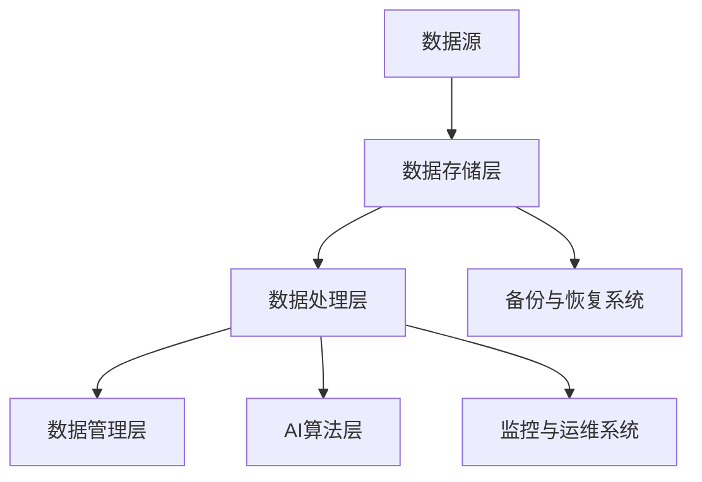

                 

# 智能数据湖治理：构建AI友好数据生态

> 关键词：智能数据湖、AI友好数据生态、数据治理、数据湖架构、AI算法应用

> 摘要：本文将深入探讨智能数据湖治理的重要性，并详细分析如何构建一个AI友好的数据生态。我们将从基础概念、技术实现和项目实践三个方面，逐步展开讨论，旨在为读者提供一个全面且实用的指南。

## 基础概念

### 1.1 智能数据湖的定义

智能数据湖是一种新兴的数据管理架构，旨在为人工智能（AI）和其他数据密集型应用提供高效的存储和处理能力。与传统的数据仓库不同，数据湖采用一种扁平化的架构，可以存储大量的原始数据，包括结构化、半结构化和非结构化数据。这种灵活性使得数据湖能够更好地适应现代数据驱动的业务需求。

### 1.2 智能数据湖的架构

智能数据湖通常由三个主要层次组成：数据存储层、数据处理层和数据管理层。

- **数据存储层**：负责存储海量数据，包括关系型数据库、NoSQL数据库和对象存储系统。
- **数据处理层**：提供数据清洗、转换、聚合和分析等功能，常见的技术包括ETL（提取、转换、加载）、批处理和实时流处理。
- **数据管理层**：确保数据的质量、安全性和合规性，包括元数据管理、数据治理和数据权限控制。

### 1.3 智能数据湖的优势与挑战

智能数据湖的优势在于其灵活性和扩展性，可以支持复杂的数据分析和实时决策。然而，这也带来了一些挑战，如数据的质量、安全性和隐私保护。因此，治理数据湖成为了一个关键问题。

## 技术实现

### 2.1 智能数据湖架构设计

设计一个智能数据湖需要考虑多个方面，包括数据存储、数据处理和数据管理。以下是一个基本的智能数据湖架构设计：



### 2.2 AI算法在数据湖中的应用

AI算法在智能数据湖中发挥着重要作用，可以用于数据清洗、特征工程和模型训练等环节。以下是一个简单的AI算法应用示例：

```python
import pandas as pd
from sklearn.ensemble import RandomForestClassifier

# 加载数据
data = pd.read_csv('data.csv')

# 数据预处理
X = data.drop('target', axis=1)
y = data['target']

# 特征工程
# ...（包括特征选择、特征转换等）

# 模型训练
model = RandomForestClassifier()
model.fit(X, y)

# 模型评估
accuracy = model.score(X, y)
print(f"模型准确率：{accuracy:.2f}")
```

### 2.3 智能数据湖系统优化

为了确保智能数据湖的高性能和可扩展性，需要对其进行优化。以下是一些常见的优化策略：

- **数据分层存储**：根据数据的访问频率和重要性进行分层存储。
- **数据压缩与加密**：采用合适的压缩算法和数据加密技术，提高存储效率和安全性。
- **查询优化**：使用索引、缓存和查询重写等技术，提高查询效率。

## 项目实践

### 3.1 智能数据湖项目规划与实施

一个成功的智能数据湖项目需要科学的规划和严格的实施。以下是项目规划与实施的基本步骤：

1. **需求分析**：明确项目目标、数据需求和性能要求。
2. **技术选型**：选择合适的技术栈和工具。
3. **数据采集**：构建数据采集系统，确保数据的完整性和准确性。
4. **数据清洗**：使用ETL工具清洗数据，去除重复项、填补缺失值等。
5. **数据存储**：根据数据类型和访问模式选择合适的存储方案。
6. **数据处理**：进行数据转换、聚合和分析，为AI算法提供高质量的数据集。
7. **AI算法应用**：开发和应用AI算法，实现数据驱动的决策支持。
8. **监控与运维**：建立监控系统，确保系统的稳定性和安全性。

### 3.2 案例分析

#### 案例一：构建金融行业智能数据湖

某金融公司希望通过构建智能数据湖来提升风险管理能力。以下是该项目的主要步骤：

1. **需求分析**：确定风险管理的核心指标，如违约率、资产回报率等。
2. **技术选型**：选择Hadoop、Spark等大数据处理框架，以及NoSQL数据库如HBase。
3. **数据采集**：接入公司内部和外部的金融数据，包括交易记录、信用评级等。
4. **数据清洗**：使用ETL工具清洗和转换数据，确保数据质量。
5. **数据存储**：将清洗后的数据存储在Hadoop分布式文件系统（HDFS）和HBase中。
6. **数据处理**：使用Spark进行数据转换和聚合，为风险管理模型提供数据支持。
7. **AI算法应用**：开发基于机器学习的信用风险评估模型，提高预测准确率。
8. **监控与运维**：建立监控体系，实时跟踪数据湖的性能和安全性。

#### 案例二：智能数据湖在零售行业中的应用

某零售企业希望通过智能数据湖来优化库存管理和客户体验。以下是该项目的主要步骤：

1. **需求分析**：明确库存管理的核心指标，如库存周转率、缺货率等。
2. **技术选型**：选择Amazon S3作为数据存储，AWS Glue进行数据处理，AWS Sagemaker进行AI算法训练。
3. **数据采集**：接入企业内部的库存数据和客户交易数据。
4. **数据清洗**：使用AWS Glue清洗和转换数据，确保数据质量。
5. **数据存储**：将清洗后的数据存储在Amazon S3中。
6. **数据处理**：使用AWS Glue和AWS Lambda进行数据转换和实时处理。
7. **AI算法应用**：开发基于深度学习的库存预测模型，提高库存周转率。
8. **监控与运维**：使用AWS CloudWatch监控数据湖的性能和安全。

#### 案例三：智能数据湖在医疗领域的实践

某医疗机构希望通过智能数据湖来提升疾病预测和治疗效果。以下是该项目的主要步骤：

1. **需求分析**：明确疾病预测和治疗效果评估的核心指标，如疾病发生率、治疗效果等。
2. **技术选型**：选择Google Cloud Storage作为数据存储，Google Cloud Dataproc进行数据处理，Google Cloud AutoML进行AI算法训练。
3. **数据采集**：接入医疗机构内部的医疗数据和患者数据。
4. **数据清洗**：使用Google Cloud Dataform清洗和转换数据，确保数据质量。
5. **数据存储**：将清洗后的数据存储在Google Cloud Storage中。
6. **数据处理**：使用Google Cloud Dataproc进行批处理和实时处理。
7. **AI算法应用**：开发基于深度学习的疾病预测模型和治疗效果评估模型。
8. **监控与运维**：使用Google Cloud Monitoring监控数据湖的性能和安全。

### 3.3 项目小结

通过以上案例，我们可以看到智能数据湖在金融、零售和医疗等行业的广泛应用。成功构建智能数据湖的关键在于科学的规划、合理的技术选型和高效的数据治理。同时，需要注重监控与运维，确保数据湖的稳定性和安全性。

### 3.4 最佳实践 tips

- **数据分层存储**：根据数据的访问模式和重要性进行分层存储，提高数据访问效率。
- **数据加密**：使用加密技术保护数据的安全性和隐私。
- **数据治理**：建立完善的数据治理体系，确保数据的质量和合规性。
- **持续集成与部署**：采用CI/CD流程，快速迭代和部署数据湖系统。

### 3.5 小结与注意事项

本文从基础概念、技术实现和项目实践三个方面，详细探讨了智能数据湖治理和构建AI友好数据生态的方法。需要注意的是，智能数据湖的建设需要综合考虑技术、业务和用户体验等多方面因素，以确保项目的成功实施。

### 3.6 拓展阅读

- **《大数据架构：设计与构建大数据系统》**：详细介绍了大数据系统的架构设计方法和最佳实践。
- **《深度学习：全面指南》**：提供了深度学习的全面教程，包括理论基础和实际应用。
- **《数据治理：理论与实践》**：探讨了数据治理的重要性和实施方法。

## 作者信息

作者：AI天才研究院/AI Genius Institute & 禅与计算机程序设计艺术 /Zen And The Art of Computer Programming

