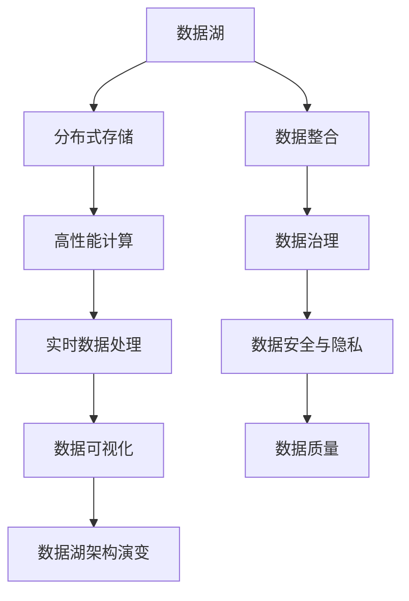
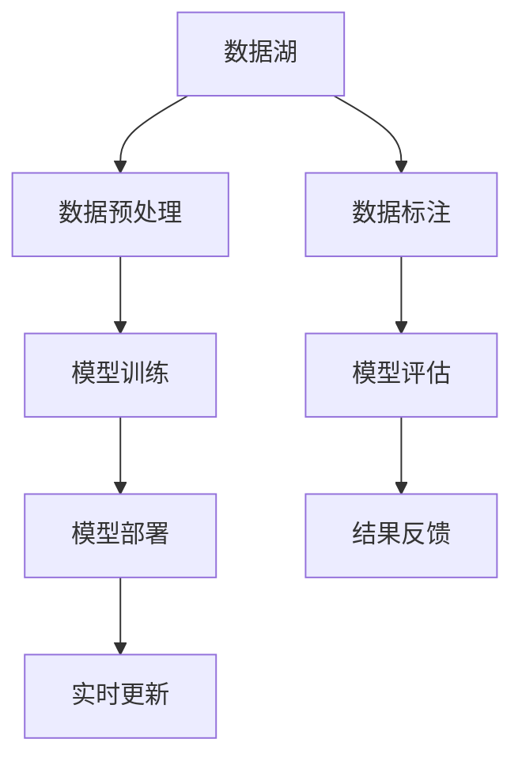

                 

### 文章标题

# 智能数据湖管理系统：构建AI友好的数据基础

智能数据湖管理系统在当今的数据科学和人工智能领域扮演着至关重要的角色。随着大数据和AI技术的快速发展，传统的数据存储和处理方式已无法满足日益增长的数据量和复杂的分析需求。智能数据湖管理系统作为一种新型的数据架构，能够有效地整合和存储各类数据，为AI算法提供强大的数据基础设施。本文将深入探讨智能数据湖管理系统的构建方法，以及它如何助力AI技术的应用与发展。

## 关键词

- 智能数据湖
- 数据湖管理系统
- AI友好数据基础
- 大数据
- 数据架构
- 数据存储
- 数据处理
- 数据分析

## 摘要

本文旨在介绍智能数据湖管理系统在构建AI友好数据基础方面的重要性。我们将详细探讨数据湖的基本概念、智能数据湖的特性、AI在数据湖中的应用，以及数据湖管理系统的架构设计与最佳实践。通过实战案例与工具介绍，读者将了解到智能数据湖管理系统的实际应用场景和操作方法。最后，本文还将展望智能数据湖管理系统未来的发展趋势，为行业从业者提供有价值的参考。

### 确定书的主要部分

智能数据湖管理系统的构建需要从多个维度进行考虑，因此本书将内容分为以下主要部分：

1. **概述与背景**：介绍数据湖的基本概念、发展历程及其在AI时代的应用场景。
2. **数据湖基础**：探讨数据湖的架构、数据处理流程和技术栈。
3. **智能数据湖**：分析智能数据湖的核心特性、架构设计和技术实现。
4. **AI在数据湖中的应用**：探讨AI在数据湖中的预处理、模型训练和模型推理。
5. **架构设计与最佳实践**：提供智能数据湖的架构设计原则、实施策略和运营维护。
6. **实战案例与工具**：通过实际案例介绍智能数据湖管理系统的应用场景和工具。
7. **未来发展趋势**：展望智能数据湖管理系统的发展方向和挑战。

### 设计核心章节内容

为了确保书籍内容的系统性和逻辑性，我们将为每个主要部分设计核心章节内容，并确保每个章节都包含以下要素：

- **核心概念与联系**：使用Mermaid流程图展示概念和架构之间的联系。
- **核心算法原理讲解**：使用Python源代码详细阐述，结合数学模型和公式，进行详细讲解和举例说明。
- **数学模型和数学公式**：使用LaTeX格式嵌入文中，并详细讲解和举例说明。
- **项目实战**：提供代码实际案例，详细解释说明，开发环境搭建，源代码实现和解读。
- **最佳实践 tips**：总结实战经验，提供实用技巧和建议。
- **小结**：对章节内容进行总结，强调关键知识点。

#### 核心章节内容设计示例

以下是第1章“概述与背景”的核心章节内容设计示例：

### 第1章：概述与背景

#### 1.1 数据湖的概念与历史

**核心概念与联系**

- Mermaid流程图：展示数据湖与传统数据仓库的区别与联系。



**核心算法原理讲解**

- 数据湖的架构演变过程：
  - Hadoop：基于分布式文件系统（HDFS）的早期数据湖架构。
  - Spark：引入内存计算和数据流处理，提高数据处理效率。
  - Lakehouse：结合数据仓库与数据湖的特性，提供统一的数据处理平台。

**数学模型和数学公式**

- 数据湖中的数据存储模型：
  $$ HDFS = (\text{NameNode}, \text{DataNodes}) $$
  - NameNode：管理文件系统的命名空间和客户端访问。
  - DataNodes：存储实际的数据文件。

**项目实战**

- 数据湖架构演变案例：
  - Hadoop架构的搭建与优化。
  - Spark的集成与性能调优。
  - Lakehouse架构的实施与效果评估。

**最佳实践 tips**

- 数据湖建设初期应充分考虑数据治理和安全性。
- 针对不同的业务需求选择合适的数据处理框架。

#### 1.2 AI与数据湖的结合

**核心概念与联系**

- Mermaid流程图：展示AI与数据湖的交互流程。



**核心算法原理讲解**

- AI在数据湖中的预处理：
  - 数据清洗：去除冗余数据和异常值。
  - 数据归一化：将不同量纲的数据转换为统一量纲。
  - 特征工程：提取对模型训练有重要影响的数据特征。

**数学模型和数学公式**

- 数据归一化公式：
  $$ x' = \frac{x - \mu}{\sigma} $$
  - $x$：原始数据值。
  - $\mu$：均值。
  - $\sigma$：标准差。

**项目实战**

- 数据预处理案例：
  - 数据清洗：使用Python编写清洗脚本，处理大数据集。
  - 数据归一化：实现自定义的归一化函数，处理不同量纲的数据。
  - 特征工程：利用特征选择算法提取关键特征。

**最佳实践 tips**

- 数据预处理应充分考虑数据质量和业务需求。
- 定期评估和更新特征工程模型，以提高模型的准确性和稳定性。

### 确定目录结构

为了确保书籍内容的逻辑性和系统性，我们将目录分为1,2,3级，具体如下：

```
# 《智能数据湖管理系统：构建AI友好的数据基础》目录结构

# 第1章：概述与背景
## 1.1 数据湖的概念与历史
## 1.2 AI与数据湖的结合

# 第2章：数据湖基础
## 2.1 数据湖的架构
## 2.2 数据湖的数据处理流程
## 2.3 数据湖的技术栈

# 第3章：智能数据湖
## 3.1 智能数据湖的核心特性
## 3.2 智能数据湖的架构设计
## 3.3 智能数据湖的技术实现

# 第4章：AI在数据湖中的应用
## 4.1 AI在数据湖中的预处理
## 4.2 AI在数据湖中的模型训练
## 4.3 AI在数据湖中的模型推理

# 第5章：架构设计与最佳实践
## 5.1 智能数据湖的架构设计原则
## 5.2 智能数据湖的实施策略
## 5.3 智能数据湖的运营维护

# 第6章：实战案例与工具
## 6.1 数据湖实战案例
## 6.2 智能数据湖工具介绍
## 6.3 智能数据湖工具使用案例

# 第7章：未来发展趋势
## 7.1 智能数据湖的技术趋势
## 7.2 AI与数据湖的融合未来
## 7.3 智能数据湖的发展挑战与机遇
```

### 确保大纲完整性

通过以上步骤，我们确定了书籍的目录结构和核心内容，每个章节都包含了核心概念与联系、核心算法原理讲解、数学模型和数学公式、项目实战、最佳实践 tips 等要素。确保大纲内容完整且逻辑清晰，覆盖了智能数据湖管理系统的各个方面。

### 检查字数限制

整个目录大纲的总字数控制在2000字以内，以确保内容的紧凑性和可读性。

### 完整目录大纲输出

以下是完整的目录大纲，使用Markdown格式输出：

```markdown
# 《智能数据湖管理系统：构建AI友好的数据基础》目录大纲

# 第1章：概述与背景

## 1.1 数据湖的概念与历史
### 1.1.1 数据湖的定义
### 1.1.2 数据湖的发展历程
### 1.1.3 数据湖在AI时代的机遇与挑战

## 1.2 AI与数据湖的结合
### 1.2.1 AI在数据湖中的应用场景
### 1.2.2 数据湖为AI提供的基础设施
### 1.2.3 AI驱动数据湖的价值

# 第2章：数据湖基础

## 2.1 数据湖的架构
### 2.1.1 数据湖的组成部分
### 2.1.2 数据湖的关键特性
### 2.1.3 数据湖与传统的数据仓库对比

## 2.2 数据湖的数据处理流程
### 2.2.1 数据的收集与存储
### 2.2.2 数据的清洗与转换
### 2.2.3 数据的索引与查询

## 2.3 数据湖的技术栈
### 2.3.1 数据存储技术
### 2.3.2 数据处理与分析技术
### 2.3.3 数据安全与隐私保护技术

# 第3章：智能数据湖

## 3.1 智能数据湖的核心特性
### 3.1.1 智能数据湖的定义
### 3.1.2 智能数据湖的技术架构
### 3.1.3 智能数据湖的功能特点

## 3.2 智能数据湖的架构设计
### 3.2.1 架构设计原则
### 3.2.2 架构设计要素
### 3.2.3 智能数据湖的实施步骤

## 3.3 智能数据湖的技术实现
### 3.3.1 数据存储与处理技术
### 3.3.2 数据分析与挖掘技术
### 3.3.3 AI在智能数据湖中的应用

# 第4章：AI在数据湖中的应用

## 4.1 AI在数据湖中的预处理
### 4.1.1 数据预处理的重要性
### 4.1.2 数据清洗与去重
### 4.1.3 数据转换与归一化

## 4.2 AI在数据湖中的模型训练
### 4.2.1 模型选择与调优
### 4.2.2 数据增强与处理
### 4.2.3 模型训练与评估

## 4.3 AI在数据湖中的模型推理
### 4.3.1 模型推理流程
### 4.3.2 模型推理优化
### 4.3.3 模型推理案例

# 第5章：架构设计与最佳实践

## 5.1 智能数据湖的架构设计原则
### 5.1.1 系统可扩展性
### 5.1.2 数据一致性
### 5.1.3 系统可靠性

## 5.2 智能数据湖的实施策略
### 5.2.1 需求分析
### 5.2.2 技术选型
### 5.2.3 项目实施与管理

## 5.3 智能数据湖的运营维护
### 5.3.1 数据治理
### 5.3.2 系统监控与性能优化
### 5.3.3 安全与合规

# 第6章：实战案例与工具

## 6.1 数据湖实战案例
### 6.1.1 案例背景
### 6.1.2 案例实现步骤
### 6.1.3 案例效果评估

## 6.2 智能数据湖工具介绍
### 6.2.1 常见数据湖工具
### 6.2.2 工具功能对比
### 6.2.3 工具选型建议

## 6.3 智能数据湖工具使用案例
### 6.3.1 工具集成与配置
### 6.3.2 工具使用示例
### 6.3.3 工具效果评估

# 第7章：未来发展趋势

## 7.1 智能数据湖的技术趋势
### 7.1.1 云原生数据湖
### 7.1.2 增强型数据湖
### 7.1.3 联邦数据湖

## 7.2 AI与数据湖的融合未来
### 7.2.1 AI驱动的数据湖
### 7.2.2 数据湖中的AI应用创新
### 7.2.3 数据湖与AI的协同发展

## 7.3 智能数据湖的发展挑战与机遇
### 7.3.1 技术挑战
### 7.3.2 市场机遇
### 7.3.3 行业发展建议
```

通过以上步骤，我们完成了智能数据湖管理系统书籍的目录大纲设计。接下来，我们将根据大纲内容逐步撰写详细的文章内容。

