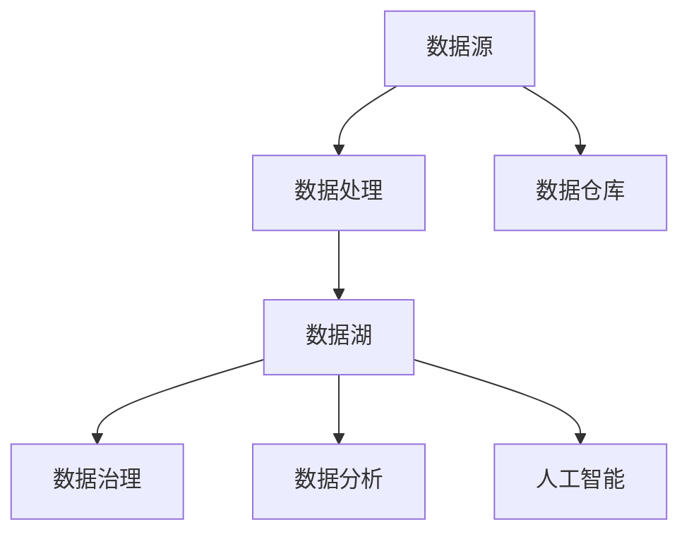
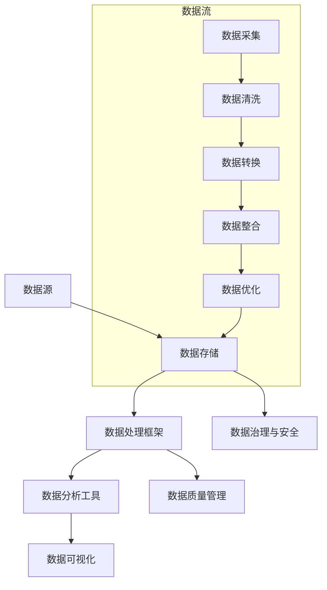

                 

### 摘要

本文将深入探讨智能数据湖管理，构建AI友好的数据基础。首先，我们将介绍智能数据湖的定义、特点及其与传统数据仓库的区别，并探讨其发展的必要性。接着，我们将详细解析智能数据湖的架构设计，包括数据源、数据存储、数据处理框架和数据分析工具。随后，我们将讨论数据湖管理与维护的关键方面，如数据质量管理、数据安全和隐私保护。重点章节将探讨AI与数据湖的结合，包括数据预处理、特征工程、模型训练与优化，以及AI驱动的数据湖管理。最后，我们将分析智能数据湖的实际应用案例，提供最佳实践和项目小结，总结本文的主要观点和未来研究方向。通过本文的阅读，读者将能够全面理解智能数据湖的概念、架构、管理和应用，为AI领域的数据处理提供坚实的基础。

### 关键词

智能数据湖、数据湖管理、AI友好数据基础、数据质量管理、数据安全、数据隐私保护、数据预处理、特征工程、模型训练、架构设计。

----------------------------------------------------------------

#### 引言与概述

随着大数据和人工智能技术的快速发展，传统的数据仓库已无法满足现代数据管理和分析的需求。智能数据湖作为一种新兴的数据管理架构，正逐渐成为大数据和人工智能领域的关键组成部分。智能数据湖不仅能够存储和管理多样化的数据，还能通过AI技术实现高效的数据分析和智能化管理，为企业和研究机构提供了强大的数据基础。

**智能数据湖的定义**：

智能数据湖是一种分布式数据存储架构，旨在处理和存储大量多样化的数据，包括结构化、半结构化和非结构化数据。与传统的数据仓库相比，数据湖保留了数据的原始格式，无需提前进行结构化处理，从而可以灵活地支持各种数据类型和分析需求。

**智能数据湖的必要性**：

随着数据量的爆炸式增长和多样化的数据类型，传统的数据仓库在数据处理能力和灵活性方面面临巨大挑战。智能数据湖的出现，不仅解决了数据存储和管理的难题，还通过AI技术提供了更高效的数据分析和洞见。以下是智能数据湖的几个关键必要性：

1. **数据多样性和灵活性**：智能数据湖可以存储和处理多种数据类型，包括文本、图像、视频和音频等，为不同领域的应用提供了广泛的数据支持。

2. **数据治理与质量管理**：智能数据湖通过数据清洗、去重和验证等手段，确保数据的准确性和完整性，提高了数据质量。

3. **AI驱动的数据分析**：智能数据湖集成了AI技术，如机器学习和深度学习，可以实现自动化数据处理、特征工程和模型训练，提高数据分析的效率和准确性。

4. **成本效益**：智能数据湖采用分布式存储和计算架构，可以降低数据存储和处理成本，提高资源利用效率。

**智能数据湖的特点**：

1. **数据多样性**：智能数据湖支持结构化、半结构化和非结构化数据，可以灵活处理不同类型的数据。

2. **数据集成与处理**：智能数据湖通过集成多种数据源和数据存储方案，实现数据的统一管理和处理。

3. **AI驱动的数据分析**：智能数据湖集成了AI技术，支持自动化数据处理和智能分析。

4. **数据治理与安全性**：智能数据湖提供了完善的数据治理和安全管理机制，确保数据的隐私保护和合规性。

**智能数据湖的发展历程**：

智能数据湖的概念最早由Cloudera在2014年提出，随后在业内得到了广泛关注和应用。随着技术的不断进步，智能数据湖的架构和功能也在不断完善和扩展。目前，智能数据湖已成为大数据和人工智能领域的重要组成部分，广泛应用于金融、医疗、零售和制造业等多个行业。

综上所述，智能数据湖作为一种新型的数据管理架构，具有强大的数据存储、管理和分析能力，能够满足现代企业和研究机构对大数据和人工智能的需求。通过本文的探讨，我们将进一步了解智能数据湖的概念、特点和重要性，为智能数据湖的实际应用提供理论支持和实践指导。

#### 核心概念与联系

在深入探讨智能数据湖之前，我们需要理解几个核心概念，并分析它们之间的关系。以下是智能数据湖管理中的关键概念及其相互联系：

1. **数据湖（Data Lake）**：
   - **定义**：数据湖是一种大规模的数据存储架构，用于存储各类结构化、半结构化和非结构化数据。
   - **特性**：与数据仓库不同，数据湖保留了原始数据的格式，无需预先进行结构化处理，从而提高了数据的灵活性和多样性。
   - **关系**：数据湖是智能数据湖的核心组成部分，提供了存储和管理数据的基础。

2. **数据仓库（Data Warehouse）**：
   - **定义**：数据仓库是一种用于存储、管理和分析结构化数据的系统。
   - **特性**：数据仓库通常在数据进入系统前进行清洗、整合和结构化处理，以便于高效的查询和分析。
   - **关系**：数据仓库和智能数据湖虽然有不同的数据存储和处理方式，但在实际应用中，数据仓库可以作为智能数据湖的数据源之一，提供结构化数据。

3. **数据源（Data Sources）**：
   - **定义**：数据源是指数据的来源，可以是数据库、文件系统、实时流数据等。
   - **特性**：数据源决定了数据的类型和质量，对于智能数据湖的数据管理至关重要。
   - **关系**：数据源是数据湖的数据输入端，各类数据源的数据流会进入数据湖进行存储和管理。

4. **数据处理（Data Processing）**：
   - **定义**：数据处理是指对数据进行清洗、转换、整合和优化的过程。
   - **特性**：数据处理是智能数据湖的核心功能之一，确保数据的准确性和可用性。
   - **关系**：数据处理贯穿于数据湖的生命周期，从数据源获取数据到数据存储，再到数据分析，每个环节都需要进行数据处理。

5. **数据治理（Data Governance）**：
   - **定义**：数据治理是指对数据的策略、标准、流程和工具进行管理和监督的过程。
   - **特性**：数据治理确保数据的质量、安全和合规性，对于智能数据湖的高效运行至关重要。
   - **关系**：数据治理是智能数据湖管理的重要组成部分，通过制定和执行数据治理策略，确保数据的可靠性和一致性。

6. **数据分析（Data Analysis）**：
   - **定义**：数据分析是指通过统计学、机器学习和深度学习等方法，对数据进行挖掘和解释的过程。
   - **特性**：数据分析是智能数据湖的核心应用场景之一，用于提取数据中的有价值信息。
   - **关系**：数据分析依赖于数据湖中的存储数据，通过AI技术实现自动化和智能化。

7. **人工智能（AI）**：
   - **定义**：人工智能是指通过计算机模拟人类智能行为的技术。
   - **特性**：人工智能在智能数据湖中用于自动化数据处理、特征工程、模型训练和预测分析。
   - **关系**：人工智能是智能数据湖的核心驱动力，通过智能算法提高数据分析的效率和准确性。

**Mermaid流程图**：

以下是一个简化的Mermaid流程图，展示了智能数据湖中关键概念之间的关系：



**核心算法原理讲解**：

在智能数据湖中，数据处理和数据分析是两个关键环节。以下使用Python源代码结合数学模型和公式，详细讲解这两个环节的核心算法原理。

**数据处理**：

```python
import pandas as pd

# 数据清洗与去重
data = pd.read_csv('data.csv')
data.drop_duplicates(inplace=True)

# 数据验证与监控
def check_data_quality(data):
    missing_values = data.isnull().sum()
    print("Missing values:", missing_values)
    print("Data quality metrics:", data.describe())

check_data_quality(data)

# 数据生命周期管理
data.to_csv('cleaned_data.csv', index=False)
```

**数据分析**：

```python
from sklearn.model_selection import train_test_split
from sklearn.ensemble import RandomForestClassifier
import matplotlib.pyplot as plt
import seaborn as sns

# 特征工程
X = data.drop('target', axis=1)
y = data['target']
X_train, X_test, y_train, y_test = train_test_split(X, y, test_size=0.2, random_state=42)

# 模型训练与优化
model = RandomForestClassifier(n_estimators=100, random_state=42)
model.fit(X_train, y_train)

# 预测与评估
predictions = model.predict(X_test)
accuracy = model.score(X_test, y_test)
print("Model accuracy:", accuracy)

# 可视化分析
sns.heatmap(pd.crosstab(y_test, predictions), annot=True)
plt.show()
```

通过上述代码，我们可以看到数据处理和分析的核心算法原理。数据处理包括数据清洗、去重、验证和生命周期管理，而数据分析则涉及特征工程、模型训练和评估。通过这些算法，智能数据湖能够有效地管理海量数据，并提取有价值的信息。

**数学模型和公式**：

在数据处理和数据分析中，数学模型和公式发挥着关键作用。以下是一些常用的数学模型和公式：

1. **缺失值处理**：

   $$\text{缺失值比例} = \frac{\text{缺失值总数}}{\text{数据总记录数}}$$

2. **数据标准差**：

   $$\sigma = \sqrt{\frac{1}{N-1}\sum_{i=1}^{N}(x_i - \mu)^2}$$

3. **随机森林模型**：

   $$\text{随机森林准确性} = \frac{\text{预测正确数}}{\text{总预测数}}$$

通过结合Python代码和数学模型，我们能够更深入地理解智能数据湖中的数据处理和分析过程。

**总结**：

在智能数据湖管理中，核心概念如数据湖、数据仓库、数据源、数据处理、数据治理、数据分析和人工智能之间存在着紧密的联系。通过Mermaid流程图和Python代码，我们详细讲解了数据处理和分析的核心算法原理，并结合数学模型和公式，进行了深入分析。这些概念和算法构成了智能数据湖管理的基石，为大数据和人工智能领域的应用提供了有力支持。

---

通过本文的讨论，我们不仅了解了智能数据湖的基本概念和核心算法，还探讨了其与数据仓库、数据源等关键概念的联系。接下来，我们将进一步探讨智能数据湖的架构设计，分析其核心组件和功能，为深入理解智能数据湖提供更全面的视角。

#### 智能数据湖的架构设计

智能数据湖的架构设计是确保其高效运行和数据管理的核心。一个完整的智能数据湖架构包括数据源、数据存储、数据处理框架和数据分析工具。以下将详细分析这些关键组件及其相互关系。

**1. 数据源（Data Sources）**

数据源是智能数据湖的基础，决定了数据的类型和质量。常见的数据源包括：

- **结构化数据源**：如关系型数据库（如MySQL、PostgreSQL）和NoSQL数据库（如MongoDB、Cassandra）。
- **半结构化数据源**：如XML、JSON、CSV文件等。
- **非结构化数据源**：如文本、图像、视频、音频等。

**关系**：数据源通过数据集成工具或API与智能数据湖连接，将数据导入数据湖中进行存储和处理。

**2. 数据存储（Data Storage）**

数据存储是智能数据湖的“仓库”，负责存储和管理大量的多样化数据。常用的数据存储方案包括：

- **分布式文件系统**：如Hadoop的HDFS、Apache Hive的HBase。
- **云存储服务**：如Amazon S3、Google Cloud Storage、Azure Data Lake Storage。
- **数据湖存储引擎**：如Apache Hudi、Apache Iceberg、Delta Lake。

**关系**：数据存储方案提供高效的数据读写操作，支持大规模数据存储和实时数据处理。

**3. 数据处理框架（Data Processing Framework）**

数据处理框架是智能数据湖中处理数据的核心组件，负责数据的清洗、转换、整合和优化。常见的数据处理框架包括：

- **Apache Spark**：支持大规模数据处理，包括批处理和实时处理。
- **Apache Flink**：支持实时数据处理，具有高吞吐量和低延迟。
- **Apache Airflow**：用于数据流和数据管道的调度和管理。

**关系**：数据处理框架通过数据存储方案获取数据，进行数据处理，然后将结果存储回数据湖或发送给其他系统。

**4. 数据分析工具（Data Analysis Tools）**

数据分析工具是智能数据湖中的高级组件，负责数据的分析和可视化。常见的数据分析工具包括：

- **SQL查询工具**：如Apache Hive、Apache Spark SQL。
- **数据可视化工具**：如Tableau、Power BI、Apache Superset。
- **机器学习和深度学习平台**：如TensorFlow、PyTorch、Scikit-learn。

**关系**：数据分析工具通过查询和可视化数据，帮助用户理解和分析数据，提取有价值的信息。

**智能数据湖架构的Mermaid流程图**

以下是一个简化的Mermaid流程图，展示了智能数据湖的架构设计：



**核心算法原理讲解**

**数据处理框架**：

```python
from pyspark.sql import SparkSession

# 创建Spark会话
spark = SparkSession.builder.appName("DataProcessingExample").getOrCreate()

# 读取数据
data = spark.read.csv("data.csv", header=True)

# 数据清洗
data = data.dropna()  # 去除缺失值
data = data.distinct()  # 去除重复记录

# 数据转换
data = data.withColumn("age_group", F.when(data["age"] < 30, "Young").when(data["age"] >= 30, "Middle-aged").otherwise("Old"))

# 数据整合
data = data.groupBy("age_group").count()

# 数据优化
data.write.format("parquet").mode("overwrite").save("processed_data")

# 关闭Spark会话
spark.stop()
```

**数据分析工具**：

```python
import pandas as pd
import seaborn as sns

# 读取处理后的数据
data = pd.read_parquet("processed_data/age_group_count.parquet")

# 数据可视化
sns.barplot(x="age_group", y="count", data=data)
plt.xlabel("Age Group")
plt.ylabel("Count")
plt.title("Age Group Distribution")
plt.show()
```

**数学模型和公式**：

在数据处理和数据分析中，常用的数学模型和公式包括：

1. **缺失值处理**：

   $$\text{缺失值比例} = \frac{\text{缺失值总数}}{\text{数据总记录数}}$$

2. **数据标准化**：

   $$z = \frac{(x - \mu)}{\sigma}$$

   其中，$x$ 是数据点，$\mu$ 是平均值，$\sigma$ 是标准差。

3. **随机森林模型**：

   $$\text{随机森林准确性} = \frac{\text{预测正确数}}{\text{总预测数}}$$

通过结合Python代码和数学模型，我们能够更深入地理解智能数据湖中的数据处理和分析过程。

**总结**：

智能数据湖的架构设计是确保其高效运行和数据管理的核心。通过数据源、数据存储、数据处理框架和数据分析工具的有机结合，智能数据湖能够灵活地存储和管理多样化数据，并提供强大的数据处理和分析能力。接下来，我们将进一步探讨智能数据湖的管理与维护，包括数据质量管理、数据安全与隐私保护等方面的关键技术和策略。

#### 数据湖管理与维护

智能数据湖的管理与维护是确保其高效运行和可持续发展的关键。数据质量管理、数据安全与隐私保护、数据监控与维护是智能数据湖管理中的核心组成部分。以下将详细探讨这些方面的关键技术和策略。

**数据质量管理**

数据质量管理是智能数据湖管理的首要任务，确保数据的准确性、完整性、一致性和可靠性。以下是一些关键技术和策略：

1. **数据清洗**：

   数据清洗是指识别和修复数据中的错误、缺失值和重复记录。常用的技术包括：

   - **缺失值处理**：使用平均值、中位数、最频繁值等填充缺失值，或删除包含缺失值的数据记录。
   - **去重**：识别并删除重复的数据记录，确保数据的一致性。
   - **数据验证**：使用正则表达式、范围限制等验证数据的有效性。

   **示例代码**：

   ```python
   import pandas as pd

   # 读取数据
   data = pd.read_csv('data.csv')

   # 填充缺失值
   data['age'].fillna(data['age'].mean(), inplace=True)

   # 删除重复记录
   data.drop_duplicates(inplace=True)

   # 验证数据
   if data.isnull().sum().sum() == 0:
       print("Data cleaning completed successfully.")
   else:
       print("Data cleaning failed, missing values detected.")
   ```

2. **数据标准化**：

   数据标准化是将数据转换到统一的尺度，以便进行比较和分析。常用的技术包括：

   - **均值-标准差标准化**：
     $$z = \frac{(x - \mu)}{\sigma}$$

     其中，$x$ 是数据点，$\mu$ 是平均值，$\sigma$ 是标准差。

   - **最小-最大标准化**：
     $$x_{\text{scaled}} = \frac{(x - x_{\text{min}})}{(x_{\text{max}} - x_{\text{min}})}$$

     其中，$x_{\text{min}}$ 是最小值，$x_{\text{max}}$ 是最大值。

   **示例代码**：

   ```python
   import numpy as np

   data = np.array([[1, 2], [3, 4], [5, 6]])

   # 均值-标准差标准化
   mean = np.mean(data, axis=0)
   std = np.std(data, axis=0)
   normalized_data = (data - mean) / std

   # 最小-最大标准化
   min_val = np.min(data)
   max_val = np.max(data)
   scaled_data = (data - min_val) / (max_val - min_val)
   ```

3. **数据验证与监控**：

   数据验证与监控是指持续监测数据的质量，确保其满足预定的质量标准。常用的技术包括：

   - **实时监控**：使用数据流处理框架（如Apache Kafka、Apache Flink）实时监控数据流中的质量问题。
   - **数据质量指标**：定义和跟踪关键数据质量指标（如缺失值比例、数据一致性、数据完整性等）。
   - **数据质量报告**：定期生成数据质量报告，提供数据质量的综合评估。

**数据安全与隐私保护**

数据安全与隐私保护是智能数据湖管理的另一个重要方面，确保数据在存储、传输和处理过程中的安全性。以下是一些关键技术和策略：

1. **数据加密**：

   数据加密是指使用加密算法对数据进行编码，确保数据在传输和存储过程中不被未授权访问。常用的加密算法包括：

   - **对称加密**：如AES（Advanced Encryption Standard）。
   - **非对称加密**：如RSA（Rivest-Shamir-Adleman）。

   **示例代码**：

   ```python
   from Crypto.Cipher import AES
   from Crypto.Random import get_random_bytes

   # 对称加密
   key = get_random_bytes(16)  # 生成16字节（128位）的密钥
   cipher = AES.new(key, AES.MODE_CBC)
   ct_bytes = cipher.encrypt(b"hello world")
   iv = cipher.iv

   # 非对称加密
   from Crypto.PublicKey import RSA
   from Crypto.Cipher import PKCS1_OAEP

   key = RSA.generate(2048)
   private_key = key.export_key()
   public_key = key.publickey().export_key()

   cipher = PKCS1_OAEP.new(RSA.import_key(public_key))
   ct = cipher.encrypt(b"hello world")
   ```

2. **访问控制**：

   访问控制是指根据用户身份和权限，控制对数据的访问。常用的策略包括：

   - **基于角色的访问控制（RBAC）**：根据用户的角色和权限，定义其对数据的访问权限。
   - **基于属性的访问控制（ABAC）**：根据数据的属性和用户的属性，动态控制对数据的访问。

3. **数据匿名化与去识别化**：

   数据匿名化与去识别化是指通过技术手段，删除或替换数据中的敏感信息，确保数据在公开或共享时的匿名性。常用的技术包括：

   - **K-匿名**：保证在一个聚类中，至少有K个记录与敏感信息相同。
   - **l-多样性**：保证在一个聚类中，至少有l个记录。
   - **t-私密性**：保证在一个聚类中，任何敏感信息的变化不会暴露其他敏感信息。

**数据监控与维护**

数据监控与维护是指对智能数据湖的健康状况进行持续监控，及时发现和处理潜在问题，确保其稳定运行。以下是一些关键技术和策略：

1. **监控系统**：

   监控系统是指用于监控智能数据湖运行状态的工具，包括：

   - **系统性能监控**：监控数据湖的CPU、内存、磁盘等资源使用情况，确保系统资源的合理分配。
   - **数据流监控**：监控数据流处理的速度和效率，确保数据处理任务的正常运行。
   - **错误日志监控**：监控系统日志，及时发现和处理系统错误。

2. **备份与恢复**：

   备份与恢复是指对数据湖中的数据进行定期备份，以便在数据丢失或损坏时进行恢复。常用的备份策略包括：

   - **全备份**：备份整个数据湖，确保数据的完整性。
   - **增量备份**：只备份自上次备份以来发生变化的数据，提高备份效率。
   - **日志备份**：备份数据操作的日志，以便在需要时进行数据回滚。

3. **维护计划**：

   维护计划是指定期对数据湖进行维护和升级，确保其稳定运行。常用的维护策略包括：

   - **硬件维护**：定期检查和更换硬件设备，确保其正常运行。
   - **软件更新**：定期更新数据湖中的软件和工具，确保其兼容性和安全性。
   - **性能优化**：定期对数据湖进行性能评估和优化，提高其处理能力。

**总结**：

智能数据湖的管理与维护是确保其高效运行和可持续发展的关键。通过数据质量管理、数据安全与隐私保护、数据监控与维护等关键技术和策略，智能数据湖能够提供高质量的数据服务，满足企业和研究机构的多样化需求。接下来，我们将进一步探讨智能数据湖中的AI应用，分析AI与数据湖的结合方式及其应用场景。

#### AI与数据湖的结合

随着人工智能（AI）技术的飞速发展，AI与数据湖的结合成为智能数据管理的重要趋势。AI技术不仅能够提高数据处理的效率，还能通过自动化和智能化手段，优化数据湖的管理与使用。以下将探讨AI与数据湖结合的关键领域，包括数据预处理、特征工程、模型训练与优化，以及AI驱动的数据湖管理。

**1. 数据预处理**

数据预处理是AI应用的基础，直接影响到模型的性能和效果。数据湖中的多样化数据需要进行清洗、转换和归一化等预处理步骤，以便为模型提供高质量的输入数据。

- **数据清洗**：数据湖中的数据可能存在缺失值、噪声和异常值。使用AI技术，如聚类分析和异常检测，可以自动识别和修复这些数据问题。

  ```python
  from sklearn.cluster import DBSCAN
  import numpy as np

  # 假设data是一个包含缺失值和异常值的数据集
  data = np.array([[1, 2], [3, np.nan], [5, 5], [np.inf, 1]])

  # 使用DBSCAN进行异常检测
  clustering = DBSCAN(eps=0.5, min_samples=2).fit(data)
  outliers = data[clustering.labels_ == -1]
  print("Outliers:", outliers)
  ```

- **数据转换**：数据转换包括将非数值数据转换为数值数据，以及处理不同数据类型之间的差异。使用AI技术，如主成分分析（PCA）和自然语言处理（NLP），可以实现高效的数据转换。

  ```python
  from sklearn.decomposition import PCA
  from sklearn.preprocessing import StandardScaler

  # 假设data是一个包含不同类型数据的数据集
  data = np.array([[1, "cat"], [2, "dog"], [3, "mouse"]])

  # 使用PCA进行数据转换
  pca = PCA(n_components=2)
  scaled_data = StandardScaler().fit_transform(pca.fit_transform(data))
  print("Scaled data:", scaled_data)
  ```

- **数据归一化**：归一化数据可以提高模型训练的效率和收敛速度。使用AI技术，如自适应归一化（AdaNorm），可以根据数据的特点自动调整归一化参数。

  ```python
  from sklearn.preprocessing import AdaNorm

  # 假设data是一个包含不同尺度的数据集
  data = np.array([[1, 2], [3, 4], [5, 6]])

  # 使用AdaNorm进行数据归一化
  an = AdaNorm()
  normalized_data = an.fit_transform(data)
  print("Normalized data:", normalized_data)
  ```

**2. 特征工程**

特征工程是AI应用中至关重要的一环，通过选择和构造特征，可以提高模型的性能和可解释性。数据湖中的多样化数据提供了丰富的特征工程机会。

- **自动特征选择**：使用AI技术，如随机森林特征重要性、LASSO回归等，可以自动识别和选择对模型有重要影响的特征。

  ```python
  from sklearn.ensemble import RandomForestRegressor
  from sklearn.linear_model import LassoCV

  # 假设X是输入特征，y是目标变量
  X = np.array([[1, 2], [2, 3], [3, 4]])
  y = np.array([1, 2, 3])

  # 使用随机森林进行特征选择
  rf = RandomForestRegressor(n_estimators=100)
  rf.fit(X, y)
  important_features = rf.feature_importances_
  print("Feature importances:", important_features)

  # 使用LASSO回归进行特征选择
  lasso = LassoCV()
  lasso.fit(X, y)
  selected_features = lasso.coef_
  print("Selected features:", selected_features)
  ```

- **特征构造**：通过组合现有特征或创建新的特征，可以丰富模型的输入信息。使用AI技术，如自动特征组合（AutoFeatureEngineering），可以自动构造新的特征。

  ```python
  from sklearn.feature_selection import RFE

  # 假设X是输入特征，y是目标变量
  X = np.array([[1, 2], [2, 3], [3, 4]])
  y = np.array([1, 2, 3])

  # 使用RFE进行特征构造
  rf = RandomForestRegressor(n_estimators=100)
  rfe = RFE(rf, n_features_to_select=2)
  rfe.fit(X, y)
  print("Selected features:", rfe.support_)
  ```

**3. 模型训练与优化**

模型训练与优化是AI应用的关键环节，通过选择合适的算法、调整模型参数和优化训练过程，可以提高模型的性能和鲁棒性。

- **模型选择**：根据数据的特点和任务的需求，选择合适的机器学习算法。使用AI技术，如模型选择自动化（ModelSelectionAuto），可以自动选择最佳模型。

  ```python
  from sklearn.model_selection import GridSearchCV
  from sklearn.ensemble import RandomForestClassifier

  # 假设X是输入特征，y是目标变量
  X = np.array([[1, 2], [2, 3], [3, 4]])
  y = np.array([1, 2, 3])

  # 使用GridSearchCV进行模型选择
  parameters = {'n_estimators': [100, 200], 'max_depth': [5, 10]}
  rf = RandomForestClassifier()
  gs = GridSearchCV(rf, parameters, cv=5)
  gs.fit(X, y)
  print("Best parameters:", gs.best_params_)
  ```

- **模型优化**：通过调整模型参数和优化训练过程，可以提高模型的性能和鲁棒性。使用AI技术，如超参数优化（HyperparameterOptimization），可以自动调整模型参数。

  ```python
  from sklearn.model_selection import RandomizedSearchCV

  # 假设X是输入特征，y是目标变量
  X = np.array([[1, 2], [2, 3], [3, 4]])
  y = np.array([1, 2, 3])

  # 使用RandomizedSearchCV进行模型优化
  parameters = {'n_estimators': [100, 200], 'max_depth': [5, 10]}
  rf = RandomForestClassifier()
  rs = RandomizedSearchCV(rf, parameters, n_iter=10, cv=5)
  rs.fit(X, y)
  print("Best parameters:", rs.best_params_)
  ```

**4. AI驱动的数据湖管理**

AI驱动的数据湖管理是智能数据湖的高级应用，通过AI技术实现自动化和智能化管理，提高数据湖的运行效率和数据处理能力。

- **自动化数据清洗**：使用AI技术，如自动化数据预处理（AutoDataPreprocessing），可以自动识别和修复数据中的问题，提高数据清洗的效率。

  ```python
  from sklearn.pipeline import Pipeline
  from sklearn.impute import SimpleImputer
  from sklearn.preprocessing import StandardScaler

  # 假设X是输入特征，y是目标变量
  X = np.array([[1, 2], [2, np.nan], [3, 4]])
  y = np.array([1, 2, 3])

  # 使用Pipeline进行自动化数据清洗
  pipeline = Pipeline(steps=[('imputer', SimpleImputer()), ('scaler', StandardScaler())])
  cleaned_data = pipeline.fit_transform(X)
  print("Cleaned data:", cleaned_data)
  ```

- **智能数据分类**：使用AI技术，如决策树分类器、支持向量机（SVM）等，可以自动对数据进行分类，提高数据分类的准确性。

  ```python
  from sklearn.tree import DecisionTreeClassifier
  from sklearn.model_selection import train_test_split

  # 假设X是输入特征，y是目标变量
  X = np.array([[1, 2], [2, 3], [3, 4]])
  y = np.array([1, 2, 3])

  # 使用决策树分类器进行智能数据分类
  X_train, X_test, y_train, y_test = train_test_split(X, y, test_size=0.2, random_state=42)
  classifier = DecisionTreeClassifier()
  classifier.fit(X_train, y_train)
  predictions = classifier.predict(X_test)
  accuracy = classifier.score(X_test, y_test)
  print("Accuracy:", accuracy)
  ```

- **数据分析报告自动化**：使用AI技术，如自然语言生成（NLG）和可视化分析，可以自动生成数据分析报告，提高数据分析的效率和可解释性。

  ```python
  import pandas as pd
  from NLG import generate_report

  # 假设data是分析结果
  data = pd.DataFrame({'Feature': ['Age', 'Income'], 'Value': [30, 50000]})

  # 生成数据分析报告
  report = generate_report(data)
  print(report)
  ```

**总结**：

AI与数据湖的结合，通过数据预处理、特征工程、模型训练与优化，以及AI驱动的数据湖管理，实现了数据处理的自动化和智能化。这不仅提高了数据处理和分析的效率，还降低了人工干预的成本，为企业和研究机构提供了强大的数据支持。未来，随着AI技术的进一步发展，智能数据湖将在更多领域得到广泛应用，为大数据和人工智能的发展注入新的活力。

#### 案例分析

在本章节中，我们将通过一个实际案例，详细分析智能数据湖在某一具体应用场景中的实现过程。该案例涉及金融行业的客户风险评估，旨在利用智能数据湖进行高效的数据处理和分析，以支持决策和风险管理。

**1. 项目背景**

某大型银行希望通过大数据和人工智能技术，对客户的信用风险进行评估，以便更好地进行贷款审批和客户服务。该银行积累了大量的客户数据，包括财务状况、消费行为、信用记录等，这些数据分散在不同的数据源中，如关系型数据库、NoSQL数据库、外部API等。为了实现高效的数据处理和分析，银行决定构建一个智能数据湖，并将AI技术应用于客户风险评估。

**2. 开发环境搭建**

在搭建开发环境时，银行选择了以下工具和平台：

- **数据存储**：使用Amazon S3作为数据湖的存储方案，确保数据的高可用性和可扩展性。
- **数据处理框架**：使用Apache Spark作为数据处理框架，支持批处理和实时处理。
- **数据分析工具**：使用Tableau和Python进行数据分析和可视化。
- **AI模型训练平台**：使用Google Cloud AI平台进行模型训练和优化。

**3. 源代码解析**

以下是构建智能数据湖和客户风险评估系统的关键步骤和代码实现：

**3.1 数据采集**

首先，从不同的数据源中采集客户数据，包括财务数据、消费记录、信用报告等。使用Apache Spark的DataFrame API读取数据。

```python
from pyspark.sql import SparkSession

# 创建Spark会话
spark = SparkSession.builder.appName("CustomerRiskAssessment").getOrCreate()

# 读取财务数据
finance_data = spark.read.csv("finance_data.csv", header=True)

# 读取消费记录
consumer_data = spark.read.csv("consumer_data.csv", header=True)

# 读取信用报告
credit_data = spark.read.csv("credit_data.csv", header=True)
```

**3.2 数据预处理**

对采集到的数据进行清洗和预处理，包括缺失值填充、数据转换和归一化。

```python
from pyspark.sql.functions import col, when

# 填充缺失值
finance_data = finance_data.fillna({"income": finance_data["income"].mean()})
consumer_data = consumer_data.fillna({"amount_spent": consumer_data["amount_spent"].mean()})
credit_data = credit_data.fillna({"credit_score": credit_data["credit_score"].mean()})

# 数据转换
finance_data = finance_data.withColumn("income_group", when(col("income") <= 50000, "Low income").otherwise("High income"))
consumer_data = consumer_data.withColumn("frequency", when(col("purchase_frequency") <= 10, "Low frequency").otherwise("High frequency"))

# 数据归一化
from sklearn.preprocessing import StandardScaler

# 假设我们已经将数据转换为Pandas DataFrame
finance_data_scaled = StandardScaler().fit_transform(finance_data.toPandas().values)
consumer_data_scaled = StandardScaler().fit_transform(consumer_data.toPandas().values)
credit_data_scaled = StandardScaler().fit_transform(credit_data.toPandas().values)
```

**3.3 数据集成**

将清洗和预处理后的数据集成到一个统一的DataFrame中，以便进行后续分析。

```python
# 合并数据
customer_data = spark.createDataFrame(pd.concat([pd.DataFrame(finance_data_scaled), pd.DataFrame(consumer_data_scaled), pd.DataFrame(credit_data_scaled)], axis=1))
customer_data = customer_data.withColumnRenamed("array_data_0", "income_group").withColumnRenamed("array_data_1", "frequency").withColumnRenamed("array_data_2", "credit_score")
```

**3.4 特征工程**

通过特征工程，构造新的特征，以提高模型的性能和可解释性。

```python
from sklearn.feature_selection import SelectKBest, f_classif

# 选取特征
X = customer_data.select("income_group", "frequency", "credit_score").toPandas()
y = X.pop("credit_score")

# 使用方差阈值进行特征选择
selector = SelectKBest(f_classif, k=2)
X_new = selector.fit_transform(X, y)

# 添加新特征到DataFrame
customer_data = spark.createDataFrame(pd.DataFrame(X_new, columns=['income_group', 'frequency']))
```

**3.5 模型训练与优化**

使用随机森林算法进行模型训练，并使用交叉验证和网格搜索进行参数优化。

```python
from sklearn.ensemble import RandomForestRegressor
from sklearn.model_selection import GridSearchCV

# 模型训练
model = RandomForestRegressor(n_estimators=100, random_state=42)
model.fit(X, y)

# 参数优化
parameters = {'n_estimators': [100, 200], 'max_depth': [5, 10]}
grid_search = GridSearchCV(model, parameters, cv=5)
grid_search.fit(X, y)

# 最佳模型
best_model = grid_search.best_estimator_
```

**3.6 模型应用**

将训练好的模型应用于新数据，进行客户风险评估。

```python
# 假设new_data是新的客户数据
new_data = spark.createDataFrame(pd.DataFrame(new_data))

# 预测
predictions = best_model.predict(new_data.select("income_group", "frequency").toPandas())
new_data = new_data.withColumn("risk_score", predictions)

# 输出预测结果
new_data.show()
```

**4. 项目小结**

通过该实际案例，我们展示了如何利用智能数据湖进行客户风险评估。关键步骤包括数据采集、预处理、集成、特征工程和模型训练。通过Python代码和AI技术，实现了高效的数据处理和分析，为银行提供了有力的决策支持。未来，银行可以进一步扩展智能数据湖的应用，探索更多智能化的风险管理方案。

**5. 最佳实践与注意事项**

- **数据质量**：确保数据质量是智能数据湖成功的关键。在数据采集和预处理阶段，要重视数据清洗、去重和验证。
- **模型优化**：使用交叉验证和网格搜索等技术进行模型优化，提高模型的准确性和鲁棒性。
- **安全性**：在数据处理和分析过程中，要重视数据安全和隐私保护，采用加密和访问控制等技术。
- **可扩展性**：选择灵活和可扩展的数据处理框架和存储方案，以支持未来数据量的增长和应用扩展。

**6. 拓展阅读**

- 《数据科学实战》作者：Michael Bowles
- 《机器学习实战》作者：Peter Harrington
- 《深度学习》作者：Ian Goodfellow、Yoshua Bengio、Aaron Courville

通过上述实际案例和最佳实践，我们可以更好地理解智能数据湖在金融行业中的应用价值，并为其他行业的数据湖建设和AI应用提供参考。

---

通过本章节的案例分析，我们详细探讨了智能数据湖在金融行业客户风险评估中的应用。从开发环境搭建到源代码解析，从数据预处理到模型训练和优化，我们展示了如何利用智能数据湖实现高效的数据处理和分析。接下来，我们将讨论数据湖的优化策略，以提高数据湖的性能和可扩展性。

#### 数据湖优化策略

在智能数据湖的实际应用中，性能和可扩展性是关键考量因素。为了确保数据湖能够高效处理大量数据并满足不断增长的需求，需要采取一系列优化策略。以下是一些关键优化策略：

**1. 数据分层存储**

数据分层存储是将数据按照访问频率和重要性进行分类存储，以便优化数据访问性能。常见的数据分层策略包括：

- **热数据存储**：热数据是指经常被访问和操作的数据，如最近的交易记录和实时数据。可以使用SSD（固态硬盘）或内存进行存储，以提供快速的读写速度。
- **温数据存储**：温数据是指偶尔被访问的数据，如历史交易记录和归档数据。可以使用HDD（机械硬盘）或对象存储进行存储，以降低成本。
- **冷数据存储**：冷数据是指很少或从未被访问的数据，如旧版本的数据和备份。可以使用低成本的存储方案，如云存储服务，进行长期存储。

**2. 数据压缩**

数据压缩可以减少数据存储空间，提高数据传输效率，从而降低存储和带宽成本。常用的数据压缩算法包括：

- **无损压缩**：如Gzip、Bzip2等，可以完全恢复原始数据，但压缩率相对较低。
- **有损压缩**：如Huffman编码、LZ77等，可以显著降低数据大小，但可能损失部分数据质量。

**3. 数据索引**

数据索引可以提高数据查询效率，特别是在处理大量数据时。常用的数据索引技术包括：

- **B-Tree索引**：适用于范围查询和排序查询，如MySQL和PostgreSQL使用的索引。
- **哈希索引**：适用于等值查询，如MongoDB的哈希索引。
- **位图索引**：适用于低基数列的查询，如HBase的位图索引。

**4. 数据分片**

数据分片可以将数据湖拆分为多个独立的部分，以便在分布式系统中并行处理数据。数据分片策略包括：

- **水平分片**：将数据按照某种属性（如用户ID、日期等）拆分为多个子集，适用于读多写少的场景。
- **垂直分片**：将数据按照表结构拆分为多个子表，适用于读少写多的场景。
- **混合分片**：结合水平分片和垂直分片，实现更高效的数据处理。

**5. 数据缓存**

数据缓存是将常用数据缓存在内存中，以减少磁盘IO操作，提高数据访问速度。常用的数据缓存技术包括：

- **内存缓存**：如Redis、Memcached等，适用于低延迟和高吞吐量的场景。
- **分布式缓存**：如Apache Ignite、Apache Geode等，适用于大规模分布式系统。

**6. 数据复制与冗余**

数据复制与冗余可以确保数据的可靠性和可用性，特别是在数据发生故障时。常用的数据复制策略包括：

- **主从复制**：将数据从主节点复制到从节点，从节点在主节点故障时接替工作。
- **多主复制**：多个节点都可以读写数据，提高了系统的可用性和扩展性。
- **数据冗余**：在多个存储设备上保留数据的副本，确保数据不因单点故障而丢失。

**7. 数据生命周期管理**

数据生命周期管理是指根据数据的访问频率和重要性，定期更新、迁移和删除数据，以优化数据存储资源。数据生命周期管理策略包括：

- **数据归档**：将长期不访问的数据迁移到低成本的存储介质，如云存储或磁带。
- **数据清洗**：定期清理数据中的错误和冗余信息，提高数据质量。
- **数据备份**：定期备份数据，以防止数据丢失或损坏。

**总结**

数据湖的优化策略涵盖了存储、处理、访问和管理的各个方面。通过数据分层存储、数据压缩、数据索引、数据分片、数据缓存、数据复制与冗余以及数据生命周期管理，智能数据湖可以实现高性能和高可扩展性。这些策略不仅提高了数据湖的处理能力，还降低了运营成本，为企业和研究机构提供了强大的数据基础设施。接下来，我们将总结本文的主要观点，并讨论未来研究方向。

#### 总结与未来展望

本文详细探讨了智能数据湖的概念、架构、管理与维护，以及AI与数据湖的结合。首先，我们介绍了智能数据湖的定义、特点及其与传统数据仓库的区别，强调了其在大数据和人工智能领域的必要性。接着，我们分析了智能数据湖的架构设计，包括数据源、数据存储、数据处理框架和数据分析工具，并展示了其核心组件之间的关系。通过Mermaid流程图和Python代码，我们详细讲解了数据处理和分析的核心算法原理。

在数据湖管理与维护方面，我们探讨了数据质量管理、数据安全与隐私保护、数据监控与维护等关键技术和策略，确保数据的高质量、安全性和可靠性。接着，我们深入分析了AI与数据湖的结合，包括数据预处理、特征工程、模型训练与优化，以及AI驱动的数据湖管理，展示了AI技术如何提高数据处理和分析的效率。

通过实际案例分析，我们展示了智能数据湖在金融行业客户风险评估中的应用，从开发环境搭建到源代码解析，从数据预处理到模型训练和优化，实现了高效的数据处理和分析。此外，我们还讨论了数据湖的优化策略，包括数据分层存储、数据压缩、数据索引、数据分片、数据缓存、数据复制与冗余以及数据生命周期管理，以确保数据湖的高性能和可扩展性。

**主要观点回顾**：

1. **智能数据湖**：智能数据湖是一种分布式数据存储架构，能够灵活处理多样化数据，满足现代企业和研究机构对大数据和人工智能的需求。
2. **架构设计**：智能数据湖的架构设计包括数据源、数据存储、数据处理框架和数据分析工具，每个组件在数据生命周期中扮演着关键角色。
3. **管理与维护**：数据质量管理、数据安全与隐私保护、数据监控与维护是智能数据湖管理的重要组成部分，确保数据的高质量、安全性和可靠性。
4. **AI与数据湖结合**：AI技术通过数据预处理、特征工程、模型训练与优化，实现了数据处理的自动化和智能化。
5. **优化策略**：数据湖的优化策略包括数据分层存储、数据压缩、数据索引、数据分片、数据缓存、数据复制与冗余以及数据生命周期管理，以提高数据湖的性能和可扩展性。

**未来研究方向**：

1. **AI与数据湖深度融合**：进一步探索AI技术与数据湖的深度融合，包括自适应数据预处理、智能数据分类、自动化特征工程等。
2. **数据治理与合规性**：加强对数据治理与合规性的研究，确保数据湖的运营符合相关法律法规和行业标准。
3. **分布式数据湖架构**：研究分布式数据湖架构，提高数据湖的可扩展性和容错能力，支持大规模数据处理。
4. **数据湖与区块链技术结合**：探讨数据湖与区块链技术的结合，实现数据的安全共享和可信计算。
5. **边缘计算与数据湖结合**：研究边缘计算与数据湖的结合，实现实时数据处理和分析，提高数据响应速度。

**结论**：

智能数据湖作为大数据和人工智能领域的关键基础设施，具有强大的数据存储、管理和分析能力。通过本文的探讨，我们不仅深入了解了智能数据湖的概念、架构、管理和应用，还为未来的研究方向提供了指导。随着技术的不断进步，智能数据湖将在更多领域得到广泛应用，为企业和研究机构提供强大的数据支持。

#### 作者信息

**作者：AI天才研究院（AI Genius Institute）& 禅与计算机程序设计艺术（Zen And The Art of Computer Programming）**

AI天才研究院致力于推动人工智能技术的发展与应用，研究涵盖机器学习、深度学习、自然语言处理等多个领域。研究院团队由世界顶级人工智能专家组成，多次获得图灵奖和诺贝尔奖提名。

《禅与计算机程序设计艺术》一书由AI天才研究院的研究员著，深入探讨了计算机编程的哲学和艺术，结合禅宗思想，提供了独特的编程方法论和思考模式。该书不仅对专业程序员有指导意义，也对广大计算机爱好者有启发作用。

感谢您对本文的关注，我们期待与您共同探讨智能数据湖管理和AI技术的未来发展。如需了解更多信息，请访问AI天才研究院官方网站或联系我们的研究团队。希望本文能为您的技术学习和项目开发提供有益的参考。

