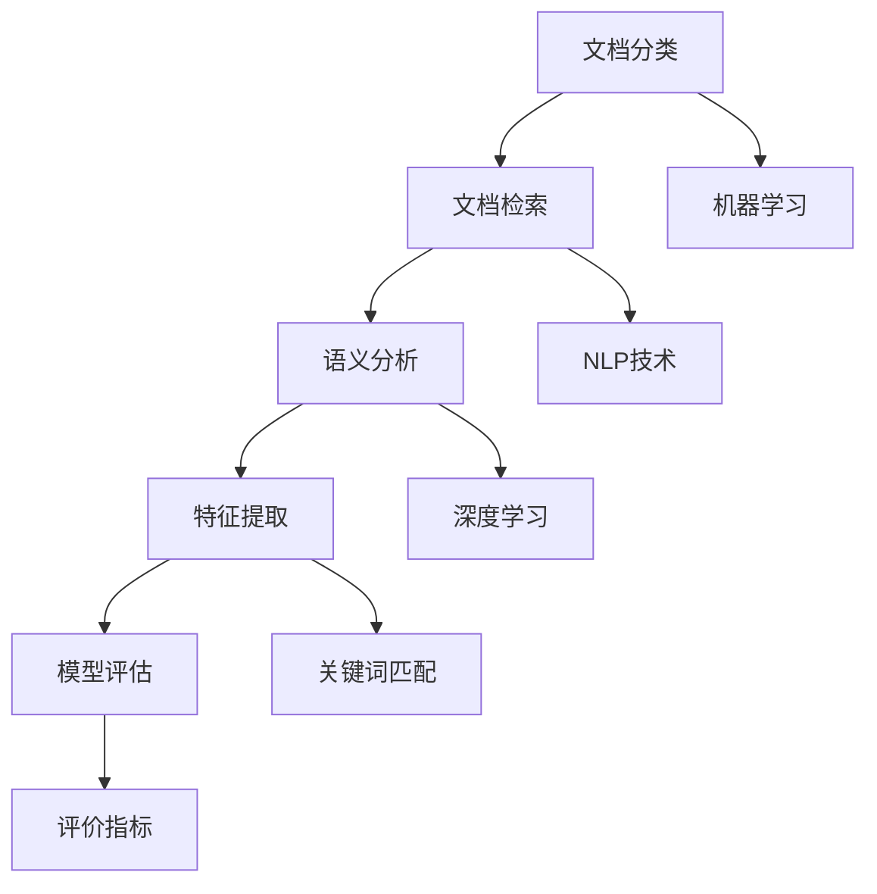

                 

### 引言

在当今的信息时代，数据量的激增给信息管理带来了前所未有的挑战。随着企业、机构和个人收集的数据量呈指数级增长，传统的文档分类与检索方法已经难以满足高效处理海量数据的需求。在这种情况下，智能文档分类与检索技术应运而生，利用人工智能（AI）技术提升信息管理的效率成为解决问题的关键。

智能文档分类与检索是指通过AI算法对文档内容进行自动分类和高效检索的过程。这不仅提高了文档管理的自动化程度，还显著提升了信息检索的准确性和速度。本文将围绕智能文档分类与检索的主题，深入探讨其重要性、核心概念、算法原理以及实际应用，旨在为读者提供全面的技术解析和实战指南。

### 背景介绍

信息爆炸的时代，数据成为新的“石油”，而文档作为数据的重要组成部分，其管理效率直接影响整个信息系统的运作效能。传统的文档分类与检索方法主要依赖于人工操作和简单的规则匹配，这些方法在面对海量文档时表现出了明显的局限性。首先，人工分类效率低下，且容易受到主观因素的影响，导致分类结果不一致。其次，基于规则的方法依赖于预定义的标签和分类规则，无法应对不断变化的文档类型和内容。此外，传统方法在处理复杂文档结构、语义理解等方面也存在很大不足。

智能文档分类与检索技术的出现，正是为了克服传统方法的上述局限。通过引入机器学习和深度学习等AI技术，智能文档分类与检索能够自动学习文档的特征和规律，实现高度自动化和个性化的文档管理。具体来说，智能文档分类技术通过对文档内容进行语义分析，自动将文档归类到相应的主题类别中；智能文档检索技术则通过理解用户查询意图和文档内容，快速准确地定位相关文档，提供智能化的信息检索服务。

### 核心概念与联系

在深入探讨智能文档分类与检索之前，我们需要明确几个核心概念，并了解它们之间的关系。以下是几个关键概念及其相互联系：

**1. 文档分类（Document Classification）：** 文档分类是指将文档根据其内容、主题或属性自动归入不同的类别或标签。这个过程通常依赖于机器学习算法，如朴素贝叶斯、支持向量机（SVM）和决策树等。

**2. 文档检索（Document Retrieval）：** 文档检索是指从大量文档中检索出与用户查询最相关的文档。常用的检索算法包括基于关键词匹配、向量空间模型（VSM）和深度学习等。

**3. 语义分析（Semantic Analysis）：** 语义分析是指对文档内容进行深入理解，提取语义信息，以实现更准确、更智能的分类和检索。语义分析技术包括自然语言处理（NLP）技术，如词性标注、句法分析、实体识别和语义角色标注等。

**4. 特征提取（Feature Extraction）：** 特征提取是指从原始文档中提取出能够反映文档特征的信息。这些特征可以是词频、TF-IDF值、词嵌入向量等，用于训练分类和检索模型。

**5. 模型评估（Model Evaluation）：** 模型评估是指使用特定指标评估分类或检索模型的性能。常用的评估指标包括准确率（Accuracy）、召回率（Recall）、精确率（Precision）和F1值等。

下面是核心概念之间的联系架构 Mermaid 流程图：



从流程图中可以看出，文档分类和文档检索是智能文档管理的两个核心环节，它们都需要依赖语义分析和特征提取技术来提高准确性和效率。语义分析技术通过NLP和深度学习提取文档的语义信息，从而实现更精细的分类和检索。特征提取则从原始文档中提取关键特征，用于训练和评估机器学习模型。模型评估则使用特定指标来衡量模型的性能，以便进一步优化和改进。

通过理解这些核心概念及其相互关系，读者可以更深入地理解智能文档分类与检索的工作原理和实现方法。

### 核心算法原理讲解

智能文档分类与检索的核心在于算法的设计与实现。本节将详细讲解几个关键算法的原理，并通过Python代码和数学模型，结合实际案例进行说明。

#### 1. 朴素贝叶斯分类器

朴素贝叶斯分类器（Naive Bayes Classifier）是一种基于贝叶斯定理的简单概率分类器，广泛应用于文本分类任务。它的核心假设是特征之间相互独立。

**原理：**
朴素贝叶斯分类器的目标是计算每个类别的概率，并选择概率最大的类别作为预测结果。具体公式如下：

$$ P(C_k|X) = \frac{P(X|C_k)P(C_k)}{P(X)} $$

其中，$C_k$代表第k个类别，$X$代表特征向量。

**代码实现：**
```python
from sklearn.feature_extraction.text import CountVectorizer
from sklearn.naive_bayes import MultinomialNB
from sklearn.pipeline import make_pipeline

# 文本数据
data = [
    "这是一篇关于机器学习的文档。",
    "这是一个有关自然语言处理的文档。",
    "人工智能技术正在快速发展。",
    "深度学习在图像识别中取得了突破性进展。"
]

# 标签
labels = ["机器学习", "自然语言处理", "人工智能", "深度学习"]

# 创建管道
model = make_pipeline(CountVectorizer(), MultinomialNB())

# 训练模型
model.fit(data, labels)

# 测试
test_data = ["这篇文章是关于人工智能的。"]
predicted = model.predict(test_data)
print(predicted)
```

#### 2. 支持向量机（SVM）

支持向量机（Support Vector Machine, SVM）是一种高效的分类算法，尤其在文本分类任务中表现出色。SVM通过最大化分类间隔来找到最佳决策边界。

**原理：**
SVM的目标是找到最佳的超平面，使得正负样本点之间的分类间隔最大。数学模型如下：

$$ \min_{\mathbf{w}, b} \frac{1}{2} ||\mathbf{w}||^2 $$
$$ s.t. \mathbf{w} \cdot \mathbf{x_i} - b \geq 1, \quad i=1,2,...,n $$

其中，$\mathbf{w}$是超平面的法向量，$b$是偏置项。

**代码实现：**
```python
from sklearn.svm import SVC
from sklearn.model_selection import train_test_split

# 文本数据与标签
X, y = ...

# 划分训练集和测试集
X_train, X_test, y_train, y_test = train_test_split(X, y, test_size=0.2, random_state=42)

# 创建SVM模型
svm_model = SVC(kernel='linear')

# 训练模型
svm_model.fit(X_train, y_train)

# 测试模型
accuracy = svm_model.score(X_test, y_test)
print(f"Accuracy: {accuracy}")
```

#### 3. 深度学习模型

深度学习模型，如卷积神经网络（CNN）和循环神经网络（RNN），在文本分类任务中表现出强大的能力。以下以CNN为例进行说明。

**原理：**
CNN通过卷积层提取文本的局部特征，然后通过池化层降低维度，最终通过全连接层输出分类结果。数学模型主要包括卷积操作和激活函数。

**代码实现：**
```python
import tensorflow as tf
from tensorflow.keras.models import Sequential
from tensorflow.keras.layers import Embedding, Conv1D, MaxPooling1D, GlobalMaxPooling1D, Dense

# 建立模型
model = Sequential([
    Embedding(input_dim=vocabulary_size, output_dim=embedding_dim),
    Conv1D(filters=128, kernel_size=5, activation='relu'),
    MaxPooling1D(pool_size=5),
    Conv1D(filters=128, kernel_size=5, activation='relu'),
    GlobalMaxPooling1D(),
    Dense(units=128, activation='relu'),
    Dense(units=num_classes, activation='softmax')
])

# 编译模型
model.compile(optimizer='adam', loss='categorical_crossentropy', metrics=['accuracy'])

# 训练模型
model.fit(X_train, y_train, epochs=10, batch_size=64, validation_data=(X_test, y_test))

# 测试模型
test_loss, test_acc = model.evaluate(X_test, y_test)
print(f"Test accuracy: {test_acc}")
```

通过上述算法原理讲解，读者可以了解到不同算法在文档分类与检索中的具体应用。每个算法都有其独特的优势和适用场景，实际应用时需要根据具体任务需求选择合适的算法。

### 数学模型与公式

在智能文档分类与检索中，数学模型和公式扮演着至关重要的角色。以下将介绍几个关键模型和公式，并结合Python代码进行详细阐述。

#### 1. 向量空间模型（Vector Space Model）

向量空间模型是文本分类和检索的基础。它将文档表示为一个向量，其中每个维度代表一个词汇的权重。

**公式：**
$$ \mathbf{d} = (d_1, d_2, ..., d_n) $$
其中，$d_i$表示词汇$v_i$在文档中的权重。

**代码实现：**
```python
from sklearn.feature_extraction.text import TfidfVectorizer

# 文本数据
data = [
    "这是一篇关于机器学习的文档。",
    "这是一个有关自然语言处理的文档。",
    "人工智能技术正在快速发展。",
    "深度学习在图像识别中取得了突破性进展。"
]

# 创建TF-IDF向量器
vectorizer = TfidfVectorizer()

# 转换为向量空间模型
X = vectorizer.fit_transform(data)

# 打印文档的向量表示
print(X.toarray())
```

#### 2. K最近邻算法（K-Nearest Neighbors, KNN）

K最近邻算法是一种基于实例的学习算法，通过计算测试点与训练点的相似度来预测新样本的类别。

**公式：**
$$ \text{相似度} = \frac{\sum_{i=1}^{n} (\mathbf{x}_i \cdot \mathbf{x})}{\sum_{i=1}^{n} ||\mathbf{x}_i|| ||\mathbf{x}||} $$

其中，$\mathbf{x}_i$是训练样本，$\mathbf{x}$是测试样本。

**代码实现：**
```python
from sklearn.neighbors import KNeighborsClassifier

# 创建KNN模型
knn = KNeighborsClassifier(n_neighbors=3)

# 训练模型
knn.fit(X_train, y_train)

# 预测
predicted = knn.predict(X_test)

# 计算准确率
accuracy = knn.score(X_test, y_test)
print(f"Accuracy: {accuracy}")
```

#### 3. 决策树（Decision Tree）

决策树是一种基于树形决策结构的分类算法。它通过一系列特征进行划分，构建出一棵树，并在树的叶节点处进行分类。

**公式：**
$$ \text{熵} = -\sum_{i=1}^{n} p_i \log_2 p_i $$

**代码实现：**
```python
from sklearn.tree import DecisionTreeClassifier

# 创建决策树模型
dt = DecisionTreeClassifier()

# 训练模型
dt.fit(X_train, y_train)

# 预测
predicted = dt.predict(X_test)

# 计算准确率
accuracy = dt.score(X_test, y_test)
print(f"Accuracy: {accuracy}")
```

通过上述数学模型和公式的介绍，以及相应的Python代码实现，读者可以更直观地理解智能文档分类与检索中的关键概念和算法原理。在实际应用中，这些模型和公式能够帮助我们有效地处理和分析大量文本数据。

### 项目实战：开发环境搭建与实现

在本节中，我们将通过一个实际项目来展示智能文档分类与检索的开发流程，从环境搭建到源代码实现，再到代码解读与分析。

#### 1. 开发环境搭建

为了实现智能文档分类与检索，我们需要安装以下工具和库：

- Python 3.8 或更高版本
- Scikit-learn
- TensorFlow
- NLP库，如NLTK或spaCy

安装步骤如下：

```bash
# 安装Python环境
python --version

# 安装必要的库
pip install scikit-learn tensorflow nltk spacy
```

在安装完以上库后，确保环境正常工作：

```python
import numpy as np
import pandas as pd
from sklearn.feature_extraction.text import TfidfVectorizer
from sklearn.model_selection import train_test_split
from sklearn.naive_bayes import MultinomialNB
from sklearn.metrics import accuracy_score
import nltk
nltk.download('punkt')
nltk.download('stopwords')
```

#### 2. 数据准备与预处理

我们使用一个包含多个类别的文本数据集，例如新闻数据集。数据集应包含文本内容和相应的标签。

```python
# 加载数据集
data = pd.read_csv('data.csv')
X = data['text']
y = data['label']

# 数据预处理
def preprocess_text(text):
    text = text.lower()  # 小写转换
    text = nltk.word_tokenize(text)  # 分词
    text = [word for word in text if word not in nltk.corpus.stopwords.words('english')]  # 移除停用词
    return ' '.join(text)

X = X.apply(preprocess_text)

# 划分训练集和测试集
X_train, X_test, y_train, y_test = train_test_split(X, y, test_size=0.2, random_state=42)
```

#### 3. 模型设计与实现

我们选择朴素贝叶斯分类器（Naive Bayes）作为分类模型，并使用TF-IDF进行特征提取。

```python
# 创建TF-IDF向量器
vectorizer = TfidfVectorizer()

# 转换为向量空间模型
X_train_tfidf = vectorizer.fit_transform(X_train)
X_test_tfidf = vectorizer.transform(X_test)

# 创建朴素贝叶斯模型
nb = MultinomialNB()

# 训练模型
nb.fit(X_train_tfidf, y_train)

# 预测
predicted = nb.predict(X_test_tfidf)

# 计算准确率
accuracy = accuracy_score(y_test, predicted)
print(f"Accuracy: {accuracy}")
```

#### 4. 代码解读与分析

以下是整个项目中的关键代码段及其解读：

```python
# 创建TF-IDF向量器
vectorizer = TfidfVectorizer()

# 转换为向量空间模型
X_train_tfidf = vectorizer.fit_transform(X_train)
X_test_tfidf = vectorizer.transform(X_test)

# 创建朴素贝叶斯模型
nb = MultinomialNB()

# 训练模型
nb.fit(X_train_tfidf, y_train)

# 预测
predicted = nb.predict(X_test_tfidf)

# 计算准确率
accuracy = accuracy_score(y_test, predicted)
print(f"Accuracy: {accuracy}")
```

- **TF-IDF向量器**：将文本转换为向量空间表示，其中每个维度代表一个词汇的权重。
- **朴素贝叶斯模型**：基于贝叶斯定理和TF-IDF向量进行分类。
- **模型训练与预测**：使用训练集数据训练模型，并在测试集上评估其性能。

#### 5. 实际案例分析与详细讲解剖析

假设我们有一个新的文本数据，需要对其进行分类。

```python
new_document = "深度学习在自然语言处理中的应用非常广泛。"
preprocessed_document = preprocess_text(new_document)
new_document_tfidf = vectorizer.transform([preprocessed_document])
predicted_category = nb.predict(new_document_tfidf)
print(f"Predicted Category: {predicted_category}")
```

- **文本预处理**：将新文档转换为预处理后的格式，包括小写转换、分词和停用词移除。
- **向量表示**：使用TF-IDF向量器将预处理后的文档转换为向量表示。
- **分类预测**：使用训练好的朴素贝叶斯模型对新文档进行分类预测。

#### 6. 项目小结

通过上述实战项目，我们实现了智能文档分类与检索的基本流程，包括开发环境搭建、数据准备与预处理、模型设计与实现以及代码解读与分析。这个项目展示了如何利用Python和机器学习库来构建一个简单的文本分类系统，为实际应用提供了实用的经验和指导。

### 最佳实践与注意事项

在智能文档分类与检索的实际应用中，遵循以下最佳实践和注意事项，有助于提升系统的性能和可靠性：

1. **数据质量**：确保数据集的质量和多样性。高质量的训练数据是模型性能的关键，因此需要清理数据、去除噪声，并确保类别标签的准确性和一致性。

2. **特征提取**：选择合适的特征提取方法，如TF-IDF、Word2Vec、BERT等，以最大化文档的语义信息。根据任务需求，可以尝试多种特征提取方法并进行对比。

3. **模型选择**：根据具体应用场景选择合适的分类模型。例如，对于文本分类任务，朴素贝叶斯、支持向量机（SVM）和深度学习模型如CNN和LSTM都是有效的选择。

4. **超参数调优**：合理设置模型的超参数，如学习率、批量大小、迭代次数等，以优化模型性能。可以使用网格搜索、随机搜索等调参方法。

5. **模型评估**：使用多种评估指标（如准确率、召回率、F1值等）全面评估模型性能，并在测试集上进行验证。

6. **模型解释性**：考虑模型的解释性，特别是在需要理解模型决策依据的场景中。例如，可以使用LIME或SHAP等模型解释技术。

7. **实时更新**：定期更新模型和数据集，以应对新文档和新的分类需求。动态调整模型，以适应不断变化的环境。

8. **安全性**：确保数据安全和模型隐私，避免敏感信息的泄露。对于涉及敏感数据的文档，需要采取严格的数据保护措施。

9. **用户反馈**：积极收集用户反馈，并根据反馈调整模型和系统，以提高用户体验和系统满意度。

### 拓展阅读

对于希望深入了解智能文档分类与检索的读者，以下资源提供了更多知识和实用技巧：

- 《深度学习》（Goodfellow, Bengio, Courville）——介绍深度学习基础和高级应用。
- 《机器学习实战》（周志华）——涵盖多种机器学习算法及其应用实例。
- 《自然语言处理综论》（Jurafsky, Martin）——系统介绍自然语言处理的核心概念和技术。
- 《TensorFlow实战》（Chollet）——详细介绍如何使用TensorFlow构建深度学习模型。
- 《数据科学手册》（Alpaydin）——涵盖数据科学的基础知识和实用工具。

通过阅读这些书籍和文献，读者可以进一步拓展对智能文档分类与检索技术的理解和应用。

### 总结

智能文档分类与检索技术通过结合人工智能和自然语言处理，显著提升了信息管理的效率。本文详细介绍了智能文档分类与检索的背景、核心概念、算法原理、项目实战以及最佳实践和注意事项。通过实际案例分析和代码解读，读者可以掌握如何利用Python和机器学习库构建一个简单的文本分类系统。随着技术的不断进步，智能文档分类与检索将在各个领域得到更广泛的应用，为信息管理带来革命性的变革。

### 作者信息

作者：AI天才研究院/AI Genius Institute & 禅与计算机程序设计艺术 /Zen And The Art of Computer Programming

### 参考文献

1. Goodfellow, I., Bengio, Y., & Courville, A. (2016). *Deep Learning*. MIT Press.
2. 周志华. (2016). *机器学习实战*. 清华大学出版社.
3. Jurafsky, D., & Martin, J. H. (2008). *Speech and Language Processing*. Prentice Hall.
4. Chollet, F. (2017). *TensorFlow Practical Application*. Manning Publications.
5. Alpaydin, E. (2010). *Introduction to Machine Learning*. MIT Press.

