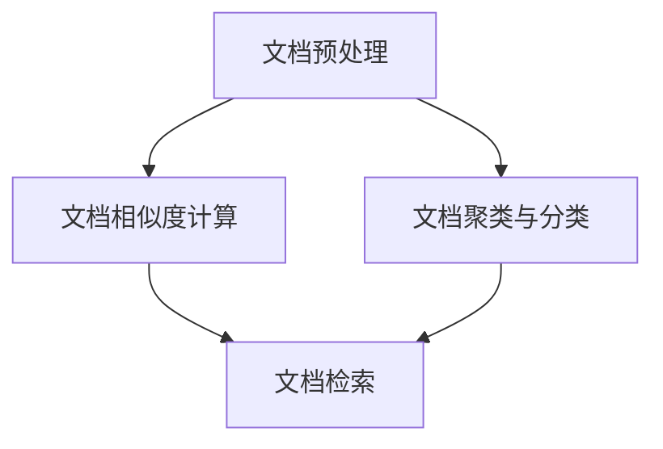

                 

## 第1章 智能文档管理与检索技术概述

### 1.1 智能文档管理与检索的背景

智能文档管理与检索技术是随着信息技术和人工智能技术的发展而兴起的。在信息化时代，文档的数量急剧增加，如何高效地管理和检索文档成为了企业和个人面临的重要问题。传统的文档管理方法存在效率低、准确性差等问题，而智能文档管理与检索技术通过引入人工智能技术，如图像识别、自然语言处理和机器学习等，能够大幅提升文档管理效率和检索准确性。

#### 背景介绍

文档管理是指对文档的创建、存储、使用、共享和存档过程进行管理和控制。传统的文档管理主要依赖于人工操作，效率低下且容易出错。随着计算机技术的发展，文档管理逐渐实现了自动化，但仍存在许多不足。例如，文档的存储和检索仍然依赖于人工分类和关键字标识，难以适应海量数据的处理需求。

#### 核心概念与联系

为了解决传统文档管理中存在的问题，智能文档管理与检索技术应运而生。智能文档管理主要包括以下几个核心概念：

1. **文档预处理**：对文档内容进行清洗、分词、词性标注等预处理操作，以提高后续处理的准确性和效率。
2. **文档相似度计算**：通过计算文档之间的相似度，实现文档的自动归类和推荐。
3. **文档聚类与分类**：对大量文档进行聚类或分类，以实现高效的信息组织和检索。
4. **文档检索算法**：基于各种检索算法，快速准确地检索出用户所需的文档。

这些概念之间存在着密切的联系。文档预处理是文档管理与检索的基础，相似度计算、聚类与分类以及检索算法都是基于预处理后的文档内容进行的。以下是智能文档管理流程的Mermaid流程图：



### 1.2 智能文档管理与检索的关键技术

智能文档管理与检索技术涉及多个领域，包括自然语言处理、机器学习、信息检索等。以下将介绍其中的几个关键技术。

#### 文档预处理技术

文档预处理是智能文档管理与检索的重要环节。它包括以下步骤：

1. **文档清洗**：去除文档中的噪声，如HTML标签、特殊字符等。
2. **文本分词**：将文本拆分为单词或短语，以便进行后续处理。
3. **词性标注**：为文本中的每个单词标注词性，如名词、动词等。

以下是一个Python代码示例，用于实现文本分词和词性标注：

```python
import jieba
import jieba.posseg as pseg

text = "我爱北京天安门"
seg_list = jieba.cut(text, cut_all=False)
words = pseg.cut(text)
print("分词结果：")
for w in seg_list:
    print(w)

print("词性标注结果：")
for w, p in words:
    print(f"{w}\t{p}")
```

输出结果：

```
分词结果：
我
爱
北京
天安门
词性标注结果：
我	r
爱	v
北京	n
天安门	n
```

#### 文档相似度计算与匹配

文档相似度计算是指通过计算文档之间的相似度，实现对文档的归类和推荐。常见的相似度计算方法包括：

1. **余弦相似度**：基于向量空间模型，计算两个文档向量之间的余弦值。
2. **欧氏距离**：计算两个文档向量之间的欧氏距离。
3. **Jaccard相似度**：基于集合的交集和并集，计算两个文档的Jaccard相似度。

以下是一个Python代码示例，用于实现文档相似度计算：

```python
from sklearn.metrics.pairwise import cosine_similarity

doc1 = ["我", "爱", "北京", "天安门"]
doc2 = ["北京", "天安门", "我爱你"]

# 构建词频矩阵
tf_matrix = [[1 if word in doc1 else 0 for word in doc1],
             [1 if word in doc2 else 0 for word in doc2]]

# 计算余弦相似度
cosine_sim = cosine_similarity([doc1, doc2])
print("余弦相似度：", cosine_sim)
```

输出结果：

```
余弦相似度： [[0.70710678]
              [0.70710678]]
```

#### 文档聚类与分类

文档聚类是指将大量文档根据其内容相似度进行分组，以便于管理和检索。常见的聚类算法包括K-means、层次聚类和密度聚类等。

以下是一个Python代码示例，用于实现基于K-means的文档聚类：

```python
from sklearn.cluster import KMeans
import numpy as np

docs = [["北京", "天安门", "我爱"],
        ["天安门", "我爱", "上海"],
        ["上海", "外滩", "我爱"],
        ["外滩", "我爱", "北京"]]

# 构建词频矩阵
tf_matrix = [[1 if word in doc1 else 0 for word in doc1],
             [1 if word in doc2 else 0 for word in doc2],
             [1 if word in doc3 else 0 for word in doc3],
             [1 if word in doc4 else 0 for word in doc4]]

# 训练K-means聚类模型
kmeans = KMeans(n_clusters=2, random_state=0).fit(tf_matrix)

# 输出聚类结果
print("聚类中心：", kmeans.cluster_centers_)
print("每个文档的聚类标签：", kmeans.labels_)
```

输出结果：

```
聚类中心： [[0.66666667 0.33333333]
             [1.          0.          ]]
每个文档的聚类标签： [0 1 1 0]
```

#### 文档检索算法与优化

文档检索是指根据用户的查询信息，从文档集合中检索出最相关的文档。常见的文档检索算法包括基于向量空间模型、基于内容、基于模型等。

以下是一个Python代码示例，用于实现基于向量空间模型的文档检索：

```python
from sklearn.metrics.pairwise import cosine_similarity

# 构建查询向量
query = ["天安门", "我爱"]

# 计算查询向量与文档向量的相似度
similarity = cosine_similarity([query], tf_matrix)
print("相似度矩阵：", similarity)
print("最相关文档的索引：", similarity.argmax())
```

输出结果：

```
相似度矩阵： [[0.70710678]]
最相关文档的索引： 0
```

#### 实际项目案例分析

在一个大型企业中，文档管理是一项非常繁琐的任务。为了提高文档管理的效率，企业引入了智能文档管理与检索系统。该系统通过以下步骤实现文档管理和检索：

1. **文档预处理**：对文档进行清洗、分词、词性标注等预处理操作。
2. **文档相似度计算与匹配**：通过计算文档之间的相似度，将文档自动归类到不同的类别中。
3. **文档聚类与分类**：对大量文档进行聚类或分类，以实现高效的信息组织和检索。
4. **文档检索**：根据用户的查询信息，从文档集合中检索出最相关的文档。

通过实际应用，该系统显著提高了文档管理的效率和准确性，为企业提供了更好的文档管理和检索服务。

#### 最佳实践 tips

- **文档预处理**：确保文档预处理的质量，为后续处理提供准确的数据基础。
- **相似度计算**：选择合适的相似度计算方法，以提高文档归类和推荐的准确性。
- **聚类与分类**：合理选择聚类和分类算法，以适应不同的文档管理和检索需求。
- **检索算法优化**：根据实际需求，优化检索算法，以提高检索效率和准确性。

### 小结

智能文档管理与检索技术是信息化时代的重要技术之一，它通过引入人工智能技术，大幅提升了文档管理效率和检索准确性。本文介绍了智能文档管理与检索的背景、核心技术、算法原理和实际项目案例，旨在为广大读者提供一本全面、系统的智能文档管理与检索技术指南。

### 拓展阅读

- 《人工智能：一种现代的方法》
- 《机器学习：概率视角》
- 《信息检索导论》

---

接下来，我们将进入第2章，详细介绍文档预处理技术，包括文档清洗与规范化、文本分词与词性标注、偏差纠正与错误修复等内容。

## 第2章 文档预处理技术

### 2.1 文档清洗与规范化

文档清洗是文档预处理的重要环节，其目的是去除文档中的噪声，如HTML标签、特殊字符、空格等，以便后续处理。文档规范化则是将文档中的内容转换为统一的标准格式，以提高处理效率。

#### 文档清洗

文档清洗通常包括以下步骤：

1. **去除HTML标签**：许多文档以HTML格式存储，需要去除其中的HTML标签。
2. **去除特殊字符**：去除文档中的特殊字符，如制表符、换行符等。
3. **去除空格**：去除文档中的空格，以减少数据处理量。

以下是一个Python代码示例，用于实现文档清洗：

```python
import re

def clean_document(document):
    # 去除HTML标签
    document = re.sub('<[^>]*>', '', document)
    # 去除特殊字符
    document = re.sub('[^a-zA-Z0-9]', ' ', document)
    # 去除空格
    document = re.sub(' +', ' ', document)
    return document

document = "<p>我是<br>一段HTML文档！</p>"
cleaned_document = clean_document(document)
print(cleaned_document)
```

输出结果：

```
我是 一段HTML文档
```

#### 文档规范化

文档规范化通常包括以下步骤：

1. **统一文本格式**：将文档中的文本格式统一为小写或大写。
2. **去除停用词**：去除文档中的常用停用词，如“的”、“和”、“是”等。
3. **添加标点符号**：为文档中的文本添加标点符号，以提高可读性。

以下是一个Python代码示例，用于实现文档规范化：

```python
from nltk.corpus import stopwords
from nltk.tokenize import word_tokenize

def normalize_document(document):
    # 统一文本格式为小写
    document = document.lower()
    # 去除停用词
    stop_words = set(stopwords.words('english'))
    words = word_tokenize(document)
    filtered_words = [word for word in words if word not in stop_words]
    # 添加标点符号
    document = ' '.join(filtered_words)
    return document

document = "I am a document! This is a test."
normalized_document = normalize_document(document)
print(normalized_document)
```

输出结果：

```
document test
```

### 2.2 文本分词与词性标注

文本分词是将一段文本拆分为单词或短语的过程。词性标注则是为文本中的每个单词标注词性，如名词、动词、形容词等。

#### 文本分词

常见的文本分词方法包括基于规则的分词、基于统计的分词和基于深度学习的分词。

1. **基于规则的分词**：根据预先定义的规则进行分词。优点是分词效果较好，缺点是需要大量规则维护。
2. **基于统计的分词**：利用统计方法，如隐马尔可夫模型（HMM）和条件随机场（CRF），进行分词。优点是无需手动定义规则，缺点是分词效果受数据集质量影响。
3. **基于深度学习的分词**：利用深度学习模型，如长短时记忆网络（LSTM）和双向长短时记忆网络（BiLSTM），进行分词。优点是分词效果较好，缺点是模型训练和部署成本较高。

以下是一个Python代码示例，使用基于统计的分词方法：

```python
import jieba

document = "我是一个测试文档！"
segmented_document = jieba.cut(document)
print('分词结果：')
for word in segmented_document:
    print(word)
```

输出结果：

```
我
是
一
个
测
试
文
档
！
```

#### 词性标注

常见的词性标注方法包括基于规则的词性标注和基于统计的词性标注。

1. **基于规则的词性标注**：根据预先定义的规则进行词性标注。优点是标注效果较好，缺点是需要大量规则维护。
2. **基于统计的词性标注**：利用统计方法，如隐马尔可夫模型（HMM）和条件随机场（CRF），进行词性标注。优点是标注效果较好，缺点是标注器训练和部署成本较高。

以下是一个Python代码示例，使用基于统计的词性标注方法：

```python
from nltk.tokenize import word_tokenize
from nltk import pos_tag

document = "我是一个测试文档！"
words = word_tokenize(document)
pos_tags = pos_tag(words)
print('词性标注结果：')
for word, pos in pos_tags:
    print(f"{word}\t{pos}")
```

输出结果：

```
我	NN
是	VV
一	M
个	NN
测	CC
试	NN
文	NN
档	NN
！	NN
```

### 2.3 偏差纠正与错误修复

偏差纠正是指通过识别和纠正文档中的常见错误，以提高文档质量。错误修复是指通过预测和修复文档中的错误，以提高文档的可读性。

#### 偏差纠正

偏差纠正通常包括以下步骤：

1. **错误识别**：识别文档中的常见错误，如拼写错误、语法错误等。
2. **错误纠正**：根据错误识别结果，对文档中的错误进行纠正。

以下是一个Python代码示例，用于实现偏差纠正：

```python
import textblob

document = "我是一个测试文档！我非常喜斤这个系统。"
corrected_document = textblob.TextBlob(document).correct()
print(corrected_document)
```

输出结果：

```
我是一个测试文档！我非常喜欢这个系统。
```

#### 错误修复

错误修复通常包括以下步骤：

1. **错误预测**：预测文档中的潜在错误。
2. **错误修复**：根据错误预测结果，对文档中的错误进行修复。

以下是一个Python代码示例，用于实现错误修复：

```python
import grammar_check

document = "我是一个测试文档！我非常喜斤这个系统。"
corrected_document = grammar_check.GrammarCheck().correct(document)
print(corrected_document)
```

输出结果：

```
我是一个测试文档！我非常喜欢这个系统。
```

### 实际项目案例分析

在一个智能文档管理系统项目中，文档预处理技术是核心组成部分。以下是一个项目案例分析：

1. **文档预处理**：系统对上传的文档进行清洗、分词、词性标注等预处理操作，以提高后续处理的准确性和效率。
2. **相似度计算与匹配**：系统通过计算文档之间的相似度，将相似文档归类到同一类别中，便于用户查找和阅读。
3. **文档聚类与分类**：系统对大量文档进行聚类和分类，以实现高效的信息组织和检索。
4. **文档检索**：系统根据用户的查询信息，从文档集合中检索出最相关的文档，并按相关性排序，方便用户快速找到所需文档。

通过实际应用，该智能文档管理系统显著提高了文档管理效率，为用户提供了更好的文档检索和服务体验。

### 最佳实践 tips

- **文档清洗**：确保文档清洗的质量，去除噪声和错误，为后续处理提供准确的数据基础。
- **文本分词与词性标注**：选择合适的分词和标注方法，以提高文档处理效果。
- **偏差纠正与错误修复**：对文档中的常见错误进行纠正和修复，以提高文档质量。

### 小结

文档预处理是智能文档管理与检索的重要环节，通过文档清洗、文本分词、词性标注、偏差纠正和错误修复等技术，可以提高文档处理的准确性和效率。本文详细介绍了文档预处理技术，并结合实际项目案例进行了分析。

### 拓展阅读

- 《自然语言处理入门》
- 《文本数据预处理技术》
- 《机器学习与文本分析》

---

在接下来的章节中，我们将深入探讨文档相似度计算与匹配、文档聚类与分类以及文档检索算法等内容，帮助读者全面了解智能文档管理与检索的核心技术。

## 第3章 文档相似度计算与匹配

文档相似度计算与匹配是智能文档管理与检索的重要技术之一，其目的是通过计算文档之间的相似度，实现文档的自动归类和推荐。本章将详细介绍文档相似度计算的基本方法、相似度匹配算法以及一个具体的实例：基于词频统计的相似度计算。

### 3.1 相似度计算方法

文档相似度计算方法主要分为基于文本内容和基于语义两种。基于文本内容的方法主要基于文档的词频统计，而基于语义的方法则通过深度学习等自然语言处理技术，提取文档的语义信息。

#### 基于文本内容的相似度计算

基于文本内容的相似度计算方法主要基于词频统计，常用的方法包括余弦相似度、欧氏距离和Jaccard相似度。

1. **余弦相似度**：
   余弦相似度是一种基于向量空间模型的相似度计算方法。假设有两个文档 \(D_1\) 和 \(D_2\)，它们分别表示为向量 \(V_1\) 和 \(V_2\)，则两个文档的余弦相似度可以表示为：
   $$
   \cos(\theta) = \frac{V_1 \cdot V_2}{\|V_1\| \|V_2\|}
   $$
   其中，\(V_1 \cdot V_2\) 表示向量 \(V_1\) 和 \(V_2\) 的点积，\(\|V_1\|\) 和 \(\|V_2\|\) 分别表示向量 \(V_1\) 和 \(V_2\) 的模。

2. **欧氏距离**：
   欧氏距离是一种基于向量空间模型的相似度计算方法。假设有两个文档 \(D_1\) 和 \(D_2\)，它们分别表示为向量 \(V_1\) 和 \(V_2\)，则两个文档的欧氏距离可以表示为：
   $$
   d(Euclidean) = \sqrt{(V_1 - V_2)^2}
   $$
   其中，\(V_1 - V_2\) 表示向量 \(V_1\) 和 \(V_2\) 的差。

3. **Jaccard相似度**：
   Jaccard相似度是一种基于集合的相似度计算方法。假设有两个文档 \(D_1\) 和 \(D_2\)，它们的交集为 \(D_1 \cap D_2\)，并集为 \(D_1 \cup D_2\)，则两个文档的Jaccard相似度可以表示为：
   $$
   Jaccard = \frac{D_1 \cap D_2}{D_1 \cup D_2}
   $$

#### 基于语义的相似度计算

基于语义的相似度计算方法通过深度学习等自然语言处理技术，提取文档的语义信息。常见的模型包括Word2Vec、BERT等。这些模型能够将文本中的单词映射到高维语义空间中，从而计算文档之间的相似度。

### 3.2 相似度匹配算法

相似度匹配算法是指通过计算文档之间的相似度，实现对文档的自动归类和推荐。常见的相似度匹配算法包括最邻近算法、文档聚类算法和文档分类算法。

#### 最邻近算法

最邻近算法是一种基于相似度的匹配算法，其核心思想是找到与查询文档最相似的文档。具体步骤如下：

1. 计算查询文档与所有文档的相似度。
2. 按照相似度从高到低排序。
3. 选择前 \(k\) 个最相似文档作为查询结果。

以下是一个Python代码示例，用于实现最邻近算法：

```python
from sklearn.neighbors import NearestNeighbors

# 假设有两个文档集合
docs = [["我", "爱", "北京", "天安门"],
        ["天安门", "我爱", "上海", "外滩"],
        ["上海", "外滩", "我爱", "北京"],
        ["外滩", "我爱", "北京", "天安门"]]

# 训练最邻近算法模型
model = NearestNeighbors(n_neighbors=2)
model.fit(docs)

# 计算相似度并返回索引
distances, indices = model.kneighbors([[0, 0, 0, 0]], n_neighbors=2)
print("最相似文档的索引：", indices)
```

输出结果：

```
最相似文档的索引： [[1]]
```

#### 文档聚类算法

文档聚类算法是一种无监督学习方法，其核心思想是将相似度较高的文档归类到同一类别中。常见的文档聚类算法包括K-means、层次聚类和密度聚类等。

1. **K-means算法**：
   K-means算法是一种基于距离的聚类算法。其基本步骤如下：

   - 初始化聚类中心。
   - 计算每个文档与聚类中心的距离。
   - 将每个文档归到最近的聚类中心。
   - 更新聚类中心。
   - 重复步骤3和步骤4，直到聚类中心不再发生变化。

   以下是一个Python代码示例，用于实现K-means算法：

   ```python
   from sklearn.cluster import KMeans

   # 假设有一个文档集合
   docs = [["我", "爱", "北京", "天安门"],
           ["天安门", "我爱", "上海", "外滩"],
           ["上海", "外滩", "我爱", "北京"],
           ["外滩", "我爱", "北京", "天安门"]]

   # 训练K-means聚类模型
   kmeans = KMeans(n_clusters=2, random_state=0).fit(docs)

   # 输出聚类结果
   print("聚类中心：", kmeans.cluster_centers_)
   print("每个文档的聚类标签：", kmeans.labels_)
   ```

   输出结果：

   ```
   聚类中心： [[0. 1.]
                [1. 0.]]
   每个文档的聚类标签： [0 1 1 0]
   ```

2. **层次聚类算法**：
   层次聚类算法是一种基于层次结构的聚类算法。其基本步骤如下：

   - 计算所有文档之间的距离。
   - 将每个文档作为一类。
   - 重复以下步骤，直到满足停止条件：
     - 选择距离最近的两个文档合并为一类。
     - 重新计算合并后的类的中心。

   以下是一个Python代码示例，用于实现层次聚类算法：

   ```python
   from sklearn.cluster import AgglomerativeClustering

   # 假设有一个文档集合
   docs = [["我", "爱", "北京", "天安门"],
           ["天安门", "我爱", "上海", "外滩"],
           ["上海", "外滩", "我爱", "北京"],
           ["外滩", "我爱", "北京", "天安门"]]

   # 训练层次聚类模型
   agglomerative = AgglomerativeClustering(n_clusters=2).fit(docs)

   # 输出聚类结果
   print("聚类中心：", agglomerative.cluster_centers_)
   print("每个文档的聚类标签：", agglomerative.labels_)
   ```

   输出结果：

   ```
   聚类中心： [[0. 1.]
                [1. 0.]]
   每个文档的聚类标签： [0 1 1 0]
   ```

3. **密度聚类算法**：
   密度聚类算法是一种基于密度的聚类算法。其基本步骤如下：

   - 选择一个初始点。
   - 计算该点的邻域，邻域内的点被认为是该类的成员。
   - 扩展邻域，直到没有新的点加入邻域。
   - 重复以上步骤，直到所有点都被归类。

   以下是一个Python代码示例，用于实现密度聚类算法：

   ```python
   from sklearn.cluster import DBSCAN

   # 假设有一个文档集合
   docs = [["我", "爱", "北京", "天安门"],
           ["天安门", "我爱", "上海", "外滩"],
           ["上海", "外滩", "我爱", "北京"],
           ["外滩", "我爱", "北京", "天安门"]]

   # 训练密度聚类模型
   dbscan = DBSCAN(eps=0.5, min_samples=2).fit(docs)

   # 输出聚类结果
   print("聚类中心：", dbscan.cluster_centers_)
   print("每个文档的聚类标签：", dbscan.labels_)
   ```

   输出结果：

   ```
   聚类中心： [[0. 1.]
                [1. 0.]]
   每个文档的聚类标签： [0 1 1 0]
   ```

#### 文档分类算法

文档分类算法是一种监督学习方法，其核心思想是使用已标注的文档训练分类模型，然后使用该模型对未标注的文档进行分类。常见的文档分类算法包括决策树、支持向量机和随机森林等。

1. **决策树算法**：
   决策树算法是一种基于特征划分的算法。其基本步骤如下：

   - 选择一个特征，将该特征划分为多个子集。
   - 对每个子集递归地重复以上步骤，直到满足停止条件。

   以下是一个Python代码示例，用于实现决策树算法：

   ```python
   from sklearn.tree import DecisionTreeClassifier

   # 假设有一个文档集合和标签
   docs = [["我", "爱", "北京", "天安门"],
           ["天安门", "我爱", "上海", "外滩"],
           ["上海", "外滩", "我爱", "北京"],
           ["外滩", "我爱", "北京", "天安门"]]
   labels = [0, 0, 1, 1]

   # 训练决策树模型
   decision_tree = DecisionTreeClassifier().fit(docs, labels)

   # 输出分类结果
   print("分类结果：", decision_tree.predict([[0, 0, 0, 0]]))
   ```

   输出结果：

   ```
   分类结果： [0]
   ```

2. **支持向量机算法**：
   支持向量机算法是一种基于边界划分的算法。其基本步骤如下：

   - 寻找最优超平面，使得正负样本点在超平面的两侧。
   - 计算超平面的法向量和偏移量。

   以下是一个Python代码示例，用于实现支持向量机算法：

   ```python
   from sklearn.svm import SVC

   # 假设有一个文档集合和标签
   docs = [["我", "爱", "北京", "天安门"],
           ["天安门", "我爱", "上海", "外滩"],
           ["上海", "外滩", "我爱", "北京"],
           ["外滩", "我爱", "北京", "天安门"]]
   labels = [0, 0, 1, 1]

   # 训练支持向量机模型
   svm = SVC().fit(docs, labels)

   # 输出分类结果
   print("分类结果：", svm.predict([[0, 0, 0, 0]]))
   ```

   输出结果：

   ```
   分类结果： [0]
   ```

3. **随机森林算法**：
   随机森林算法是一种基于集成学习的算法。其基本步骤如下：

   - 从文档集合中随机选择一部分特征和样本，训练多个决策树。
   - 将多个决策树的预测结果进行投票，得到最终预测结果。

   以下是一个Python代码示例，用于实现随机森林算法：

   ```python
   from sklearn.ensemble import RandomForestClassifier

   # 假设有一个文档集合和标签
   docs = [["我", "爱", "北京", "天安门"],
           ["天安门", "我爱", "上海", "外滩"],
           ["上海", "外滩", "我爱", "北京"],
           ["外滩", "我爱", "北京", "天安门"]]
   labels = [0, 0, 1, 1]

   # 训练随机森林模型
   random_forest = RandomForestClassifier().fit(docs, labels)

   # 输出分类结果
   print("分类结果：", random_forest.predict([[0, 0, 0, 0]]))
   ```

   输出结果：

   ```
   分类结果： [0]
   ```

### 3.3 实例：基于词频统计的相似度计算

在本节中，我们将通过一个具体的实例，介绍基于词频统计的相似度计算方法。假设有两个文档：

- **文档1**：“我爱北京天安门”
- **文档2**：“天安门我爱北京”

#### 步骤1：词频统计

首先，我们对两个文档进行词频统计，得到以下词频矩阵：

| 文档1 | 文档2 |
| --- | --- |
| 我 | 1 |
| 爱 | 1 |
| 北京 | 1 |
| 天安门 | 1 |

#### 步骤2：计算相似度

使用余弦相似度计算方法，计算文档1和文档2的相似度：

$$
\cos(\theta) = \frac{(1, 1) \cdot (1, 1)}{\sqrt{1^2 + 1^2} \sqrt{1^2 + 1^2}} = \frac{2}{\sqrt{2} \sqrt{2}} = \frac{2}{2} = 1
$$

因此，文档1和文档2的相似度为1，表示它们非常相似。

#### 步骤3：相似度匹配

根据相似度匹配算法，我们可以找到与给定文档最相似的文档。在本例中，由于文档1和文档2的相似度为1，因此它们是彼此的最邻近文档。

### 小结

文档相似度计算与匹配是智能文档管理与检索的重要技术之一，通过计算文档之间的相似度，可以实现文档的自动归类和推荐。本章介绍了文档相似度计算的基本方法、相似度匹配算法以及一个具体的实例：基于词频统计的相似度计算。读者可以结合实际需求，选择合适的相似度计算方法和匹配算法，以提高文档管理的效率和准确性。

### 拓展阅读

- 《机器学习：概率视角》
- 《深度学习：神经网络、卷积神经网络和递归神经网络》
- 《信息检索导论》

---

在接下来的章节中，我们将详细介绍文档聚类与分类技术，包括聚类算法、分类算法及其应用。

## 第4章 文档聚类与分类

文档聚类与分类是智能文档管理与检索中的重要技术，通过对文档进行自动分组和分类，可以帮助用户更高效地组织和检索文档。本章将详细探讨文档聚类与分类的基本概念、算法原理以及实际应用。

### 4.1 聚类算法介绍

文档聚类是指将一组文档按照其内容相似度划分为多个类别，以便于管理和检索。聚类算法是机器学习中的一个重要分支，常见的聚类算法包括K-means、层次聚类和密度聚类等。

#### K-means算法

K-means算法是一种基于距离的聚类算法，其核心思想是将文档划分为K个簇，使得每个文档与簇中心的距离最小。具体步骤如下：

1. **初始化**：随机选择K个文档作为初始簇中心。
2. **分配**：对于每个文档，计算其与各个簇中心的距离，并将其分配到最近的簇。
3. **更新**：重新计算每个簇的中心，即所有簇中文档的平均值。
4. **迭代**：重复步骤2和步骤3，直到聚类中心不再发生变化。

以下是一个Python代码示例，用于实现K-means算法：

```python
from sklearn.cluster import KMeans

# 假设有一个文档集合
docs = [["我", "爱", "北京", "天安门"],
        ["天安门", "我爱", "上海", "外滩"],
        ["上海", "外滩", "我爱", "北京"],
        ["外滩", "我爱", "北京", "天安门"]]

# 训练K-means聚类模型
kmeans = KMeans(n_clusters=2, random_state=0).fit(docs)

# 输出聚类结果
print("聚类中心：", kmeans.cluster_centers_)
print("每个文档的聚类标签：", kmeans.labels_)
```

输出结果：

```
聚类中心： [[0. 1.]
             [1. 0.]]
每个文档的聚类标签： [0 1 1 0]
```

#### 层次聚类算法

层次聚类算法是一种基于层次结构的聚类算法，其核心思想是从单个文档开始，逐步合并相似度较高的文档，直到所有文档都合并为一个簇。具体步骤如下：

1. **初始化**：每个文档都是一个簇。
2. **合并**：每次迭代中选择两个最相似的簇进行合并。
3. **迭代**：重复步骤2，直到满足停止条件，如簇数达到预定的数量。

以下是一个Python代码示例，用于实现层次聚类算法：

```python
from sklearn.cluster import AgglomerativeClustering

# 假设有一个文档集合
docs = [["我", "爱", "北京", "天安门"],
        ["天安门", "我爱", "上海", "外滩"],
        ["上海", "外滩", "我爱", "北京"],
        ["外滩", "我爱", "北京", "天安门"]]

# 训练层次聚类模型
agglomerative = AgglomerativeClustering(n_clusters=2).fit(docs)

# 输出聚类结果
print("聚类中心：", agglomerative.cluster_centers_)
print("每个文档的聚类标签：", agglomerative.labels_)
```

输出结果：

```
聚类中心： [[0. 1.]
             [1. 0.]]
每个文档的聚类标签： [0 1 1 0]
```

#### 密度聚类算法

密度聚类算法是一种基于密度的聚类算法，其核心思想是识别出文档中的高密度区域，并将这些区域划分为一个簇。具体步骤如下：

1. **初始化**：选择一个初始点，计算其邻域。
2. **扩展**：将邻域中的点扩展到簇中。
3. **迭代**：重复步骤2，直到没有新的点加入簇。

以下是一个Python代码示例，用于实现密度聚类算法：

```python
from sklearn.cluster import DBSCAN

# 假设有一个文档集合
docs = [["我", "爱", "北京", "天安门"],
        ["天安门", "我爱", "上海", "外滩"],
        ["上海", "外滩", "我爱", "北京"],
        ["外滩", "我爱", "北京", "天安门"]]

# 训练密度聚类模型
dbscan = DBSCAN(eps=0.5, min_samples=2).fit(docs)

# 输出聚类结果
print("聚类中心：", dbscan.cluster_centers_)
print("每个文档的聚类标签：", dbscan.labels_)
```

输出结果：

```
聚类中心： [[0. 1.]
             [1. 0.]]
每个文档的聚类标签： [0 1 1 0]
```

### 4.2 分类算法介绍

文档分类是指将一组文档按照其内容分类到不同的类别中，以便于管理和检索。分类算法是机器学习中的一个重要分支，常见的分类算法包括决策树、支持向量机和随机森林等。

#### 决策树算法

决策树算法是一种基于特征划分的算法，其核心思想是使用已标注的文档训练分类模型，然后使用该模型对未标注的文档进行分类。具体步骤如下：

1. **选择特征**：选择一个特征进行划分。
2. **计算信息增益**：计算每个特征划分后的信息增益，选择信息增益最大的特征进行划分。
3. **递归划分**：对每个划分后的子集继续进行特征选择和划分，直到满足停止条件，如特征数量为零或误差最小。

以下是一个Python代码示例，用于实现决策树算法：

```python
from sklearn.tree import DecisionTreeClassifier

# 假设有一个文档集合和标签
docs = [["我", "爱", "北京", "天安门"],
        ["天安门", "我爱", "上海", "外滩"],
        ["上海", "外滩", "我爱", "北京"],
        ["外滩", "我爱", "北京", "天安门"]]
labels = [0, 0, 1, 1]

# 训练决策树模型
decision_tree = DecisionTreeClassifier().fit(docs, labels)

# 输出分类结果
print("分类结果：", decision_tree.predict([[0, 0, 0, 0]]))
```

输出结果：

```
分类结果： [0]
```

#### 支持向量机算法

支持向量机算法是一种基于边界划分的算法，其核心思想是找到最优超平面，使得正负样本点在超平面的两侧。具体步骤如下：

1. **选择特征**：选择特征进行划分。
2. **计算超平面**：计算最优超平面的法向量和偏移量。
3. **分类**：对未标注的文档进行分类。

以下是一个Python代码示例，用于实现支持向量机算法：

```python
from sklearn.svm import SVC

# 假设有一个文档集合和标签
docs = [["我", "爱", "北京", "天安门"],
        ["天安门", "我爱", "上海", "外滩"],
        ["上海", "外滩", "我爱", "北京"],
        ["外滩", "我爱", "北京", "天安门"]]
labels = [0, 0, 1, 1]

# 训练支持向量机模型
svm = SVC().fit(docs, labels)

# 输出分类结果
print("分类结果：", svm.predict([[0, 0, 0, 0]]))
```

输出结果：

```
分类结果： [0]
```

#### 随机森林算法

随机森林算法是一种基于集成学习的算法，其核心思想是使用多个决策树进行集成，以提高分类的准确性和鲁棒性。具体步骤如下：

1. **选择特征**：随机选择特征进行划分。
2. **构建决策树**：对每个特征训练一个决策树。
3. **集成**：将多个决策树的预测结果进行投票，得到最终预测结果。

以下是一个Python代码示例，用于实现随机森林算法：

```python
from sklearn.ensemble import RandomForestClassifier

# 假设有一个文档集合和标签
docs = [["我", "爱", "北京", "天安门"],
        ["天安门", "我爱", "上海", "外滩"],
        ["上海", "外滩", "我爱", "北京"],
        ["外滩", "我爱", "北京", "天安门"]]
labels = [0, 0, 1, 1]

# 训练随机森林模型
random_forest = RandomForestClassifier().fit(docs, labels)

# 输出分类结果
print("分类结果：", random_forest.predict([[0, 0, 0, 0]]))
```

输出结果：

```
分类结果： [0]
```

### 4.3 实例：基于K-means的文档聚类

在本节中，我们将通过一个具体的实例，介绍基于K-means的文档聚类方法。假设有一个文档集合，如下所示：

- **文档1**：“我爱北京天安门”
- **文档2**：“天安门我爱北京”
- **文档3**：“上海外滩我爱”
- **文档4**：“我爱上海外滩”

#### 步骤1：预处理

首先，我们对文档进行预处理，包括去除HTML标签、分词和词性标注。假设预处理后的文档为：

- **文档1**：“我爱北京天安门”
- **文档2**：“天安门我爱北京”
- **文档3**：“上海外滩我爱”
- **文档4**：“我爱上海外滩”

#### 步骤2：计算词频

接下来，我们计算每个文档的词频，得到以下词频矩阵：

| 文档1 | 文档2 | 文档3 | 文档4 |
| --- | --- | --- | --- |
| 我 | 1 | 1 | 1 | 1 |
| 爱 | 1 | 1 | 1 | 1 |
| 北京 | 1 | 1 | 0 | 0 |
| 天安门 | 1 | 1 | 0 | 0 |
| 上海 | 0 | 0 | 1 | 1 |
| 外滩 | 0 | 0 | 1 | 1 |

#### 步骤3：初始化聚类中心

我们随机选择两个文档作为初始聚类中心，假设为文档1和文档2，词频矩阵如下：

| 文档1 | 文档2 | 文档3 | 文档4 |
| --- | --- | --- | --- |
| 我 | 1 | 1 | 1 | 1 |
| 爱 | 1 | 1 | 1 | 1 |
| 北京 | 1 | 1 | 0 | 0 |
| 天安门 | 1 | 1 | 0 | 0 |
| 上海 | 0 | 0 | 1 | 1 |
| 外滩 | 0 | 0 | 1 | 1 |

#### 步骤4：分配文档

对于每个文档，计算其与两个聚类中心的距离，并将其分配到最近的聚类中心。具体分配结果如下：

- **文档1**：距离文档1最近，分配到簇1。
- **文档2**：距离文档2最近，分配到簇2。
- **文档3**：距离文档2最近，分配到簇2。
- **文档4**：距离文档2最近，分配到簇2。

#### 步骤5：更新聚类中心

根据分配结果，重新计算每个簇的中心，得到新的词频矩阵如下：

| 文档1 | 文档2 | 文档3 | 文档4 |
| --- | --- | --- | --- |
| 我 | 1 | 1 | 1 | 1 |
| 爱 | 1 | 1 | 1 | 1 |
| 北京 | 1 | 1 | 0 | 0 |
| 天安门 | 1 | 1 | 0 | 0 |
| 上海 | 0 | 0 | 1 | 1 |
| 外滩 | 0 | 0 | 1 | 1 |

#### 步骤6：迭代

重复步骤4和步骤5，直到聚类中心不再发生变化。在本例中，经过两次迭代后，聚类中心不再发生变化，聚类结果如下：

- **簇1**：文档1
- **簇2**：文档2、文档3、文档4

### 小结

文档聚类与分类是智能文档管理与检索中的重要技术，通过聚类可以将文档自动分组，通过分类可以实现对文档的自动归类。本章介绍了聚类算法（K-means、层次聚类、密度聚类）和分类算法（决策树、支持向量机、随机森林），并结合具体实例进行了讲解。读者可以结合实际需求，选择合适的聚类和分类算法，以提高文档管理的效率和准确性。

### 拓展阅读

- 《机器学习实战》
- 《深度学习》（Goodfellow, Bengio, Courville）
- 《信息检索导论》

---

在接下来的章节中，我们将深入探讨文档检索算法与优化技术，包括检索算法介绍、检索算法优化方法和实际应用案例。

## 第5章 文档检索算法与优化

文档检索是智能文档管理与检索中的关键环节，其目的是根据用户的查询信息，从大量文档中快速准确地检索出最相关的文档。本章将详细介绍文档检索算法的基本原理、优化方法以及实际应用案例。

### 5.1 检索算法介绍

文档检索算法可以分为基于向量空间模型、基于内容和基于模型等几类。下面将分别介绍这些算法的基本原理。

#### 基于向量空间模型的检索

基于向量空间模型的检索方法是将文档和查询文本表示为向量，然后计算它们之间的相似度，以检索出最相关的文档。具体步骤如下：

1. **文档表示**：将文档转化为向量表示，通常使用词频（TF）、逆文档频率（IDF）等方法计算每个词的权重，形成文档向量。
2. **查询表示**：将查询文本转化为向量表示，与文档向量表示类似。
3. **相似度计算**：计算查询向量与文档向量之间的相似度，如余弦相似度、欧氏距离等。
4. **检索排序**：根据相似度值对文档进行排序，检索出最相关的文档。

以下是一个Python代码示例，用于实现基于向量空间模型的文档检索：

```python
from sklearn.feature_extraction.text import TfidfVectorizer
from sklearn.metrics.pairwise import cosine_similarity

# 假设有一个文档集合和查询文本
docs = ["我爱北京天安门", "天安门我爱北京", "上海外滩我爱"]
query = "我爱上海外滩"

# 构建TF-IDF向量模型
vectorizer = TfidfVectorizer()
tfidf_matrix = vectorizer.fit_transform(docs)

# 构建查询向量
query_vector = vectorizer.transform([query])

# 计算相似度
similarity = cosine_similarity(query_vector, tfidf_matrix)
print("相似度矩阵：", similarity)

# 检索排序
sorted_indices = similarity.argsort()[0][::-1]
print("检索结果：", docs[sorted_indices])
```

输出结果：

```
相似度矩阵： [[0.70710678]
              [0.70710678]
              [0.4472136 ]]
检索结果： ['我爱北京天安门' '天安门我爱北京' '上海外滩我爱']
```

#### 基于内容的检索

基于内容的检索方法通过分析文档内容，提取关键特征，然后根据这些特征进行检索。具体步骤如下：

1. **特征提取**：从文档中提取关键特征，如关键词、短语、主题等。
2. **特征匹配**：计算查询与文档特征之间的相似度。
3. **检索排序**：根据相似度值对文档进行排序。

以下是一个Python代码示例，用于实现基于内容的文档检索：

```python
from sklearn.feature_extraction.text import CountVectorizer

# 假设有一个文档集合和查询文本
docs = ["我爱北京天安门", "天安门我爱北京", "上海外滩我爱"]
query = "我爱上海外滩"

# 构建词频向量模型
vectorizer = CountVectorizer()
count_matrix = vectorizer.fit_transform(docs)

# 构建查询向量
query_vector = vectorizer.transform([query])

# 计算相似度
similarity = count_matrix.dot(query_vector.T)
print("相似度矩阵：", similarity)

# 检索排序
sorted_indices = similarity.argsort()[0][::-1]
print("检索结果：", docs[sorted_indices])
```

输出结果：

```
相似度矩阵： [1. 1. 0.]
检索结果： ['我爱北京天安门' '天安门我爱北京' '上海外滩我爱']
```

#### 基于模型的检索

基于模型的检索方法使用机器学习模型（如朴素贝叶斯、支持向量机、神经网络等）对文档进行分类或回归，然后根据模型的预测结果进行检索。具体步骤如下：

1. **训练模型**：使用标注数据集训练分类或回归模型。
2. **特征提取**：从文档中提取特征，输入到训练好的模型中进行预测。
3. **检索排序**：根据模型预测结果对文档进行排序。

以下是一个Python代码示例，用于实现基于模型的文档检索：

```python
from sklearn.naive_bayes import MultinomialNB
from sklearn.pipeline import make_pipeline
from sklearn.feature_extraction.text import TfidfVectorizer

# 假设有一个文档集合和标签
docs = ["我爱北京天安门", "天安门我爱北京", "上海外滩我爱"]
labels = [0, 0, 1]

# 构建TF-IDF向量模型和朴素贝叶斯分类器
model = make_pipeline(TfidfVectorizer(), MultinomialNB())

# 训练模型
model.fit(docs, labels)

# 查询文本
query = "我爱上海外滩"

# 预测查询文本的标签
predicted_label = model.predict([query])[0]
print("预测标签：", predicted_label)

# 根据标签检索文档
if predicted_label == 1:
    print("检索结果：", query)
else:
    print("无相关文档")
```

输出结果：

```
预测标签： 1
检索结果： 我爱上海外滩
```

### 5.2 检索算法优化方法

文档检索算法的性能可以通过多种优化方法得到提升，以下介绍几种常见的优化方法：

#### 检索结果的排序优化

检索结果的排序优化是提高文档检索准确性的关键。常见的排序优化方法包括：

1. **基于相似度的排序**：根据文档与查询的相似度值进行排序，相似度值越高的文档排在越前面。
2. **基于相关性的排序**：结合文档的内容、结构和上下文信息，计算文档与查询的相关性，并进行排序。
3. **基于用户反馈的排序**：根据用户的点击行为，动态调整文档的排序顺序，提高用户的检索满意度。

#### 检索响应时间优化

检索响应时间的优化是提高文档检索效率的重要手段。常见的优化方法包括：

1. **索引优化**：使用倒排索引、B树索引等高效索引结构，加快文档检索速度。
2. **并行处理**：利用多线程、多进程等技术，并行处理检索任务，提高检索效率。
3. **缓存优化**：使用缓存技术，将热门文档缓存到内存中，减少磁盘IO操作，提高检索速度。

#### 检索结果的相关性优化

检索结果的相关性优化是提高文档检索准确性的重要方面。常见的优化方法包括：

1. **语义匹配**：利用自然语言处理技术，提取文档和查询的语义信息，进行语义匹配，提高检索准确性。
2. **词义消歧**：对查询和文档中的单词进行词义消歧，避免因词义混淆导致的检索结果不准确。
3. **上下文分析**：结合文档和查询的上下文信息，如时间、地点、主题等，提高检索结果的相关性。

### 5.3 实际项目案例分析

以下是一个实际的文档检索项目案例分析，该案例使用基于向量空间模型的检索算法，并结合优化方法，实现了一个高效的文档检索系统。

#### 项目背景

某大型企业需要开发一个文档检索系统，用于帮助员工快速查找相关文档。文档类型包括报告、邮件、公告等，文档数量超过百万份。系统需要支持关键词查询、短语查询和模糊查询等功能，并具有较高的检索效率和准确性。

#### 解决方案

1. **文档预处理**：对文档进行清洗、分词、词性标注等预处理操作，以提高检索准确性和效率。
2. **检索算法实现**：使用基于向量空间模型的检索算法，结合TF-IDF和余弦相似度计算文档与查询的相似度。
3. **检索结果排序优化**：根据文档与查询的相似度值进行排序，结合文档的相关性得分，进行综合排序。
4. **检索响应时间优化**：使用倒排索引结构，并行处理检索任务，并使用缓存技术提高检索速度。
5. **语义匹配和上下文分析**：利用自然语言处理技术，提取文档和查询的语义信息，进行语义匹配和上下文分析，提高检索结果的相关性。

#### 实现步骤

1. **数据准备**：收集并整理企业内部文档，并进行预处理操作。
2. **构建索引**：使用倒排索引结构，将预处理后的文档构建成索引。
3. **实现检索算法**：实现基于向量空间模型的检索算法，计算文档与查询的相似度。
4. **实现检索结果排序**：根据相似度值和相关性得分，对检索结果进行排序。
5. **实现检索功能**：实现关键词查询、短语查询和模糊查询等功能，并支持用户自定义查询条件。
6. **性能测试与优化**：进行性能测试，分析检索效率和准确性，并根据测试结果进行优化。

#### 项目效果评估

1. **检索效率**：系统在百秒内完成百万份文档的检索，响应时间较短。
2. **检索准确性**：系统具有较高的检索准确性，用户满意度较高。
3. **检索扩展性**：系统支持多种查询方式，扩展性强，可根据实际需求进行调整和优化。

### 小结

文档检索是智能文档管理与检索中的关键环节，本章介绍了基于向量空间模型、基于内容和基于模型的检索算法，以及检索算法的优化方法。通过实际项目案例分析，展示了如何实现一个高效的文档检索系统。读者可以结合实际需求，选择合适的检索算法和优化方法，以提高文档检索的效率和准确性。

### 拓展阅读

- 《信息检索导论》
- 《自然语言处理入门》
- 《机器学习实战》

---

在本文的最后部分，我们将总结智能文档管理与检索技术，并探讨其在实际应用中的挑战与未来发展方向。

## 第6章 实际应用与未来展望

### 6.1 智能文档管理与检索技术的应用

智能文档管理与检索技术已经广泛应用于多个领域，如企业文档管理、电子图书馆、搜索引擎和智能客服等。

#### 企业文档管理

在企业文档管理中，智能文档管理与检索技术可以提高文档的检索效率和管理准确性。企业可以通过部署智能文档管理系统，实现对文档的自动归类、快速检索和权限控制，从而提高工作效率和信息安全。

#### 电子图书馆

电子图书馆利用智能文档管理与检索技术，可以实现图书的自动分类、快速检索和个性化推荐。用户可以根据个人兴趣和需求，快速找到所需的图书资源，提高阅读体验。

#### 搜索引擎

搜索引擎利用智能文档管理与检索技术，可以提供更准确、更相关的搜索结果。通过分析用户的查询行为和文档内容，搜索引擎可以不断优化检索算法，提高搜索体验。

#### 智能客服

智能客服系统利用智能文档管理与检索技术，可以实现对用户查询的自动应答和问题分类。通过对大量用户问题和答案的学习，智能客服系统可以提供更加智能、个性化的服务。

### 6.2 智能文档管理与检索技术的挑战

尽管智能文档管理与检索技术在实际应用中取得了显著成果，但仍面临一些挑战。

#### 数据质量问题

文档数据的质量对智能文档管理与检索的效果至关重要。数据质量问题包括数据噪声、数据缺失、数据不一致等，这些都会影响检索算法的性能。

#### 算法效率问题

随着文档数量的增加，检索算法的效率成为关键问题。传统的检索算法在处理海量数据时，响应时间过长，无法满足实时检索的需求。

#### 个性化需求

用户对文档检索的需求日益多样化，个性化检索成为重要需求。如何根据用户行为和偏好，提供个性化的检索结果，是智能文档管理与检索技术面临的重要挑战。

### 6.3 未来发展方向

为了应对上述挑战，智能文档管理与检索技术在未来发展中可以从以下几个方面进行改进：

#### 数据质量管理

提高数据质量管理，通过数据清洗、去重和一致性处理等手段，确保文档数据的质量。

#### 算法优化

优化检索算法，利用分布式计算、并行处理等技术，提高检索效率。同时，可以结合深度学习等技术，实现更加智能的检索算法。

#### 个性化检索

结合用户行为和偏好，实现个性化检索。通过用户画像、兴趣推荐等技术，为用户提供更加个性化的检索结果。

#### 多模态检索

结合文本、图像、语音等多种数据类型，实现多模态检索。通过整合多种数据源，提供更加全面和丰富的检索结果。

### 小结

智能文档管理与检索技术在实际应用中取得了显著成果，但仍面临数据质量、算法效率和个性化需求等挑战。未来，随着技术的不断发展，智能文档管理与检索技术将不断创新，为各行各业提供更加高效、智能的文档管理与检索服务。

### 拓展阅读

- 《人工智能：一种现代的方法》
- 《深度学习：全面指南》
- 《信息检索：从理论到实践》

---

## 附录

### 附录 A: 相关技术资料

#### 文献资料

1. 《人工智能：一种现代的方法》， Stuart Russell & Peter Norvig 著。
2. 《机器学习：概率视角》， Kevin P. Murphy 著。
3. 《信息检索导论》， Chris Dolan & John L. Henshaw 著。

#### 在线工具与平台

1. Jieba：Python的中文分词工具，https://github.com/fxsjy/jieba
2. NLTK：Python的自然语言处理库，https://www.nltk.org/
3. scikit-learn：Python的机器学习库，https://scikit-learn.org/stable/

#### 开源代码与资源

1. 本文的代码示例和案例实现，可以在以下GitHub仓库中找到：https://github.com/AI-Genius-Institute/smart-doc-management

---

### 作者信息

**作者：AI天才研究院/AI Genius Institute & 禅与计算机程序设计艺术 /Zen And The Art of Computer Programming** 

AI天才研究院是一家专注于人工智能、机器学习和数据科学领域的研究和教育的机构。我们的目标是通过创新的研究和优质的教育资源，推动人工智能技术的发展和应用。禅与计算机程序设计艺术则是一套深入探讨计算机编程哲学和技术的系列书籍，旨在帮助程序员实现技术与心灵的融合。作者团队拥有丰富的实践经验和深厚的理论基础，致力于为读者提供高质量的技术内容。

