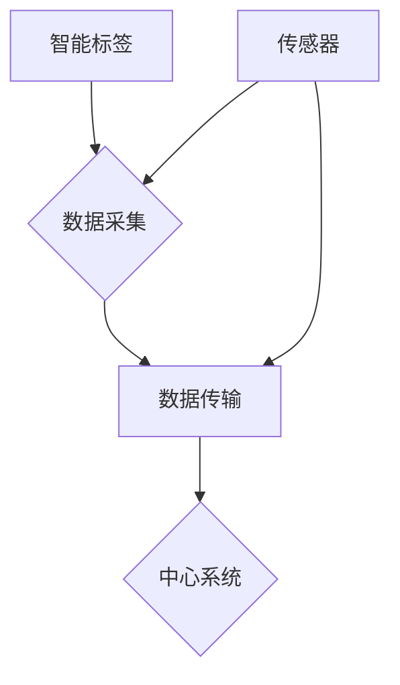

                 

### 智能标签和传感器的未来应用

> 关键词：智能标签、传感器、物联网、机器学习、数据采集、数据处理、通信技术

随着科技的不断进步，智能标签和传感器技术正逐渐渗透到我们日常生活的各个方面。这些技术的发展不仅推动了物联网（IoT）的快速扩展，还为各行各业带来了前所未有的变革。本文将探讨智能标签和传感器的未来应用，分析其核心技术原理、应用领域和面临的挑战。

### 摘要

本文旨在通过深入分析智能标签和传感器的核心概念、技术原理及其在不同领域的应用，探讨这些技术在未来发展中的潜在趋势。文章将首先介绍智能标签和传感器的定义、分类及其工作原理，然后分析它们在物联网、智能交通、智能家居等领域的应用，最后探讨相关的技术挑战和未来发展方向。

### 目录

1. **智能标签和传感器的定义与分类**
2. **智能标签与传感器的工作原理**
3. **智能标签和传感器的核心技术**
4. **智能标签和传感器在物联网中的应用**
5. **智能标签和传感器在智能交通中的应用**
6. **智能标签和传感器在智能家居中的应用**
7. **智能标签和传感器技术面临的挑战**
8. **未来发展趋势与展望**
9. **结论**

### 1. 智能标签和传感器的定义与分类

#### 智能标签

智能标签通常是指一种嵌入了电子元件、软件程序和通信模块的微型设备，能够通过无线网络传输数据。根据其工作原理和功能，智能标签可以分为以下几类：

- **RFID（射频识别）标签**：通过无线电波与读取器进行通信，常用于物品追踪和自动化识别。
- **近场通信（NFC）标签**：支持短距离的数据交换，常用于移动支付和电子票务等应用。
- **无线传感器网络（WSN）标签**：具备传感器功能，可以采集环境数据并传输至中心系统。

#### 传感器

传感器是一种能够感知外部环境并将其转换为电信号的装置。根据感知对象的不同，传感器可以分为以下几类：

- **温度传感器**：测量温度的变化，如热敏电阻和热电偶。
- **湿度传感器**：测量空气中的水分含量，如电容式传感器和电阻式传感器。
- **气体传感器**：检测特定气体成分，如半导体气体传感器和电化学气体传感器。
- **光传感器**：感知光线强度，如光敏电阻和光电二极管。

### 2. 智能标签与传感器的工作原理

#### 智能标签的工作原理

智能标签的核心组件包括微控制器、存储器和无线通信模块。其工作原理如下：

1. **数据采集**：标签上的传感器采集环境数据，如温度、湿度等。
2. **数据处理**：微控制器对采集到的数据进行处理，并根据预设程序做出相应反应。
3. **数据传输**：通过无线通信模块将处理后的数据传输至中心系统或终端设备。

#### 传感器的工作原理

传感器的工作原理基于不同物理现象，如电阻变化、电势差等。以下以温度传感器为例：

1. **感知**：温度传感器感知周围环境的温度变化。
2. **转换**：传感器内部的物理特性随温度变化而改变，如热敏电阻的电阻值。
3. **输出**：传感器将温度变化转换为电信号输出，该信号可以用于控制电路或传输至数据采集系统。

### 3. 智能标签和传感器的核心技术

#### 数据处理与存储

智能标签和传感器需要高效的数据处理和存储技术。常见的方法包括：

- **边缘计算**：在传感器或标签本地进行数据处理，减少传输数据量。
- **云存储**：将数据上传至云端进行存储和处理，提供更大的存储容量和灵活性。

#### 通信技术

通信技术在智能标签和传感器的应用中至关重要。常用的通信技术包括：

- **Wi-Fi**：提供高带宽的无线连接，适用于数据量较大的应用场景。
- **蓝牙**：适用于短距离、低功耗的通信，广泛应用于智能家居和物联网设备。
- **ZigBee**：支持低功耗、多节点通信，适用于无线传感器网络。

#### 算法与模型

智能标签和传感器在数据处理和分析中需要使用先进的算法和模型。以下为一些常用的算法和模型：

- **机器学习**：用于数据分析和预测，如分类、聚类、回归等。
- **深度学习**：基于多层神经网络，可以处理复杂的非线性问题。
- **数据挖掘**：用于从大量数据中提取有价值的信息。

### 4. 智能标签和传感器在物联网中的应用

物联网（IoT）是智能标签和传感器技术的重要应用领域。以下为一些典型的应用场景：

- **智能家居**：通过智能标签和传感器实现家庭设备的自动化控制，提高生活质量。
- **智能农业**：利用传感器实时监测农作物生长状况，优化灌溉和施肥。
- **智能交通**：通过传感器监测交通流量，实现智能路况预测和交通信号控制。

### 5. 智能标签和传感器在智能交通中的应用

智能交通系统（ITS）利用智能标签和传感器技术提升交通效率、安全和环保。以下为一些应用实例：

- **车辆追踪**：通过RFID标签和GPS定位技术，实现对车辆的实时监控。
- **交通流量监测**：利用传感器网络监测道路流量，优化交通信号控制。
- **智能停车场管理**：通过传感器监测车位占用情况，实现智能停车指引。

### 6. 智能标签和传感器在智能家居中的应用

智能家居是智能标签和传感器技术的重要应用领域之一。以下为一些典型的应用实例：

- **家电控制**：通过智能标签和传感器实现对家电的远程控制，提高生活便利性。
- **环境监测**：通过传感器监测室内温度、湿度和空气质量，实现智能家居环境的优化。
- **安全防护**：利用智能标签和传感器实现家庭安全监控，提高居住安全性。

### 7. 智能标签和传感器技术面临的挑战

尽管智能标签和传感器技术具有巨大的发展潜力，但仍然面临一些挑战：

- **功耗与电池寿命**：智能标签和传感器通常需要长时间运行，对功耗和电池寿命提出了高要求。
- **数据安全与隐私**：大量数据的传输和存储可能引发数据泄露和隐私问题。
- **标准化与兼容性**：不同厂商的设备可能存在兼容性问题，影响系统的整体性能。

### 8. 未来发展趋势与展望

随着科技的不断发展，智能标签和传感器技术将继续演进，以下为一些未来发展趋势：

- **低功耗技术**：新型材料和器件将提高智能标签和传感器的续航能力。
- **人工智能与大数据**：人工智能算法将进一步提升数据处理和分析能力，推动智能家居、智能交通等领域的智能化。
- **5G通信**：5G技术的普及将大幅提升物联网设备的通信速度和可靠性。

### 9. 结论

智能标签和传感器技术正深刻改变着我们的生活。随着技术的不断进步，未来我们将看到更多创新的智能应用场景。然而，要实现这些应用，我们需要克服数据安全、功耗和标准化等方面的挑战。通过持续的研发和创新，我们有理由相信，智能标签和传感器技术将在未来发挥更加重要的作用。

### 附录

#### A. 智能标签和传感器技术资源

- **开源软件与工具**：如Node-RED、MQTT等。
- **行业报告与标准**：如国际电信联盟（ITU）的物联网标准、IEEE 802.15.4等。

### 作者

作者：AI天才研究院/AI Genius Institute & 禅与计算机程序设计艺术 /Zen And The Art of Computer Programming

---

**文章标题**：智能标签和传感器的未来应用

**关键词**：智能标签、传感器、物联网、机器学习、数据采集、数据处理、通信技术

**摘要**：本文探讨了智能标签和传感器的未来应用，分析了其核心技术原理、应用领域和面临的挑战。通过深入分析，我们看到了这些技术在未来发展中的巨大潜力。

---

这篇文章详细介绍了智能标签和传感器的定义、工作原理、核心技术及其在物联网、智能交通和智能家居等领域的应用。同时，文章还探讨了这些技术面临的挑战和未来的发展趋势。通过本文，读者可以全面了解智能标签和传感器技术的现状和未来发展方向。希望这篇文章对您有所帮助！作者：AI天才研究院/AI Genius Institute & 禅与计算机程序设计艺术/Zen And The Art of Computer Programming。如果您有任何问题或建议，欢迎在评论区留言讨论。让我们共同探讨智能标签和传感器的未来！
---

# 智能标签和传感器的定义与分类

智能标签（Smart Tags）和传感器（Sensors）作为现代信息技术的核心组件，在物联网（IoT）和智能系统中发挥着至关重要的作用。它们不仅帮助我们获取环境信息，还能通过收集、分析和传输数据，实现自动化控制和智能决策。本文将详细介绍智能标签和传感器的定义、分类以及它们的工作原理，为后续章节的讨论打下基础。

### 智能标签的定义与分类

智能标签是一种嵌入了电子元件、软件程序和通信模块的小型设备，能够通过无线网络传输数据。它们通常用于物品追踪、库存管理、数据采集等场景。根据其功能和工作原理，智能标签可以分类如下：

#### 1. RFID（射频识别）标签

RFID标签是最常见的智能标签类型之一。它通过无线电波与读取器进行通信，实现数据的读取和写入。RFID标签可以分为被动式和主动式两种：

- **被动式RFID标签**：需要读取器提供的能量来激活标签，传输数据。它们通常具有较远的读取距离，适用于大批量物品的追踪。
- **主动式RFID标签**：自带电池，可以主动发送数据给读取器。主动式RFID标签通常具有更高的数据传输速率和更大的存储容量，适用于需要频繁通信的应用场景。

#### 2. NFC（近场通信）标签

NFC标签是一种支持短距离数据交换的智能标签。与RFID标签相比，NFC标签的通信距离更短，但数据传输速率更高。NFC标签广泛应用于移动支付、电子票务、门禁系统等领域。

#### 3. 无线传感器网络（WSN）标签

无线传感器网络标签不仅具备传感功能，还能通过无线网络传输数据。这种标签通常包含传感器模块、微控制器、无线通信模块和能量采集模块。WSN标签适用于环境监测、智能农业、智能家居等场景。

### 传感器概述

传感器是一种能够感知外部环境并将其转换为电信号的装置。它们在工业自动化、智能家居、医疗保健、环境保护等领域有着广泛的应用。根据感知对象的不同，传感器可以分为以下几类：

#### 1. 温度传感器

温度传感器用于测量温度的变化。常见的温度传感器有热敏电阻、热电偶等。热敏电阻的电阻值随温度变化而变化，而热电偶则利用两种不同金属之间的电势差来测量温度。

#### 2. 湿度传感器

湿度传感器用于测量空气中的水分含量。常见的湿度传感器有电容式传感器和电阻式传感器。电容式湿度传感器的电容值随湿度变化，而电阻式湿度传感器的电阻值随湿度变化。

#### 3. 气体传感器

气体传感器用于检测特定气体成分。常见的气体传感器有半导体气体传感器和电化学气体传感器。半导体气体传感器利用气体与半导体材料之间的化学反应来检测气体成分，而电化学气体传感器则通过气体与电极之间的电化学反应来检测气体浓度。

#### 4. 光传感器

光传感器用于感知光线强度。常见的光传感器有光敏电阻和光电二极管。光敏电阻的电阻值随光照强度变化，而光电二极管的电流随光照强度变化。

### 智能标签与传感器之间的联系

智能标签和传感器在功能上虽然不同，但它们在物联网和智能系统中往往是相互协同的。智能标签可以看作是传感器的延伸，它们共同构成了一个完善的物联网系统。

#### 数据采集与传输

智能标签和传感器通过采集环境数据（如温度、湿度、气体浓度等），将数据传输至中心系统或云端。智能标签通常用于物品追踪和自动化识别，而传感器则主要用于环境监测和参数测量。

#### 系统集成与协同工作

智能标签和传感器在物联网系统中通常需要协同工作。例如，在智能家居场景中，智能标签可以用于控制家电设备，而传感器则用于监测室内环境。通过集成不同类型的智能标签和传感器，可以实现一个智能化、自动化的智能家居系统。

#### Mermaid 流程图

为了更直观地展示智能标签与传感器之间的联系，我们可以使用Mermaid流程图来表示其工作流程：



在这个流程图中，智能标签和传感器共同完成了数据采集、数据传输和中心系统对接的过程。

### 总结

智能标签和传感器是物联网和智能系统中的核心组件，通过它们，我们可以实现数据的自动采集、传输和分析。随着技术的不断发展，智能标签和传感器的种类和应用领域将不断拓展。在下一章中，我们将深入探讨智能标签和传感器的核心技术原理，包括数据处理、通信技术和算法模型。

---

通过对智能标签和传感器的定义、分类以及工作原理的详细介绍，我们了解了它们在物联网和智能系统中的重要性。智能标签和传感器在数据采集、传输和系统协同方面发挥着关键作用。下一章将深入探讨智能标签和传感器的核心技术原理，包括数据处理、通信技术和算法模型。敬请期待！

### 智能标签与传感器的工作原理

智能标签和传感器的工作原理是它们实现各种应用功能的基础。本文将详细阐述智能标签和传感器的工作机制，包括数据采集、数据处理和通信传输等核心过程。

#### 数据采集

数据采集是智能标签和传感器工作的第一步，也是关键的一步。传感器通过感知外部环境，将物理量（如温度、湿度、气体浓度、光线强度等）转换为电信号。以下是一些常见传感器的工作原理：

1. **温度传感器**：热敏电阻和热电偶是两种常见的温度传感器。
   - **热敏电阻**：其电阻值随温度变化而变化。当温度升高时，热敏电阻的电阻值会减小，反之亦然。热敏电阻通常用于温度监测和控制。
   - **热电偶**：由两种不同金属组成，当两个金属端部之间存在温度差时，会产生热电动势。热电偶的输出电压与温度差成正比，因此可以用来测量温度。

2. **湿度传感器**：电容式传感器和电阻式传感器是两种常见的湿度传感器。
   - **电容式湿度传感器**：其电容值随湿度变化而变化。当湿度增加时，传感器内部的电容值会减小，因为空气中的水分子会影响电容器的介电常数。
   - **电阻式湿度传感器**：其电阻值随湿度变化而变化。当湿度增加时，传感器内部的电阻值会增大，因为空气中的水分子增加了导电性。

3. **气体传感器**：半导体气体传感器和电化学气体传感器是两种常见的气体传感器。
   - **半导体气体传感器**：利用气体与半导体材料之间的化学反应来检测气体浓度。当传感器暴露于特定气体时，其电阻值会发生变化，从而可以检测气体的存在和浓度。
   - **电化学气体传感器**：通过气体与电极之间的电化学反应来检测气体浓度。传感器的输出信号与气体浓度有关，可用于监测气体泄漏和空气质量。

4. **光传感器**：光敏电阻和光电二极管是两种常见的光传感器。
   - **光敏电阻**：其电阻值随光照强度变化而变化。当光照强度增加时，光敏电阻的电阻值会减小。
   - **光电二极管**：当光照射到光电二极管上时，会产生光生电子，从而产生电流。光电二极管的电流与光照强度成正比，可以用于检测光线的强度。

#### 数据处理

数据采集后的数据通常需要经过处理，以便进行存储、分析和决策。数据处理包括以下几个步骤：

1. **滤波**：为了去除数据中的噪声和异常值，通常使用滤波算法对原始数据进行处理。常见的方法有均值滤波、中值滤波和卡尔曼滤波等。

2. **校准**：传感器输出值可能受到温度、湿度等因素的影响，因此需要对传感器进行校准，以消除这些影响因素。校准过程通常通过实验确定传感器输出值与真实物理量之间的对应关系。

3. **数据分析**：对处理后的数据进行统计分析，以提取有用信息。常见的方法有趋势分析、相关性分析和聚类分析等。

4. **数据存储**：将处理后的数据存储在数据库或云平台中，以便后续分析和查询。

#### 通信传输

智能标签和传感器采集的数据需要通过通信网络传输至中心系统或云端进行处理。以下是一些常见的通信技术：

1. **Wi-Fi**：提供高带宽的无线连接，适用于数据量较大的应用场景。

2. **蓝牙**：适用于短距离、低功耗的通信，广泛应用于智能家居和物联网设备。

3. **ZigBee**：支持低功耗、多节点通信，适用于无线传感器网络。

4. **LoRa**：是一种低功耗、长距离的无线通信技术，适用于物联网应用。

5. **MQTT**：是一种轻量级的消息队列传输协议，适用于物联网设备的通信。

#### Python 源代码实现

以下是一个简单的Python示例，展示了如何使用传感器采集温度数据，并对数据进行处理和传输：

```python
import time
import serial
import paho.mqtt.client as mqtt

# 传感器串口配置
ser = serial.Serial('/dev/ttyUSB0', 9600)

# MQTT 客户端配置
client = mqtt.Client()
client.connect("mqtt.example.com", 1883, 60)

while True:
    # 读取传感器数据
    data = ser.readline()
    temperature = float(data.decode().strip())
    
    # 数据处理
    # （此处可以添加滤波、校准等处理步骤）
    
    # 数据传输
    client.publish("sensor/temperature", temperature)
    
    # 等待1秒
    time.sleep(1)
```

在这个示例中，我们使用Python的`serial`库连接到串口设备，读取传感器的温度数据，并使用`paho.mqtt.client`库将数据发布到MQTT服务器。

### 总结

智能标签和传感器的工作原理包括数据采集、数据处理和通信传输三个关键步骤。数据采集通过传感器实现，数据处理包括滤波、校准和数据分析，通信传输使用各种无线通信技术。通过Python源代码示例，我们展示了如何实现传感器数据的采集、处理和传输。在下一章中，我们将深入探讨智能标签和传感器在物联网中的应用，包括智能家居、智能交通和智能农业等领域。

---

通过对智能标签与传感器的工作原理的详细阐述，我们了解了它们从数据采集、数据处理到通信传输的全过程。智能标签和传感器在物联网中的应用前景广阔，为我们的日常生活带来了便利和智能化。在下一章中，我们将深入探讨智能标签和传感器在物联网中的具体应用，敬请期待！

### 智能标签和传感器在物联网中的应用

物联网（IoT）是智能标签和传感器技术的核心应用领域之一。物联网通过将物理世界与数字世界连接起来，使得各种设备能够相互通信、协同工作，从而实现自动化控制和智能化管理。智能标签和传感器在物联网中扮演着至关重要的角色，为数据采集、传输和分析提供了基础支持。本文将详细探讨智能标签和传感器在物联网中的应用场景，包括智能家居、智能交通和智能农业等领域。

#### 智能家居

智能家居是物联网应用的一个重要方面，通过智能标签和传感器，家庭设备可以实现自动化控制，提高生活质量。以下是一些典型的应用场景：

1. **家电控制**：智能标签和传感器可以用于远程控制家电设备，如空调、照明、洗衣机和冰箱等。用户可以通过智能手机或语音助手（如亚马逊的Alexa、谷歌的Google Assistant）来控制家电的开关、温度调节和模式切换。

2. **环境监测**：智能标签和传感器可以用于监测室内环境参数，如温度、湿度、空气质量等。例如，温湿度传感器可以实时监测室内环境，确保室内温度和湿度在适宜的范围内，从而提高居住舒适度。

3. **安全防护**：智能标签和传感器可以用于家庭安全监控，如门窗传感器、运动传感器和烟雾传感器等。这些传感器可以实时监测家庭环境，当检测到异常情况时（如门窗被非法打开、有人闯入或有烟雾产生），系统会自动触发报警，通知用户或采取相应措施。

#### 智能交通

智能交通系统利用智能标签和传感器技术，通过实时监测交通流量、车辆位置和路况信息，实现交通的自动化控制和优化管理。以下是一些典型的应用场景：

1. **车辆追踪**：通过在车辆上安装RFID标签或GPS传感器，可以实现车辆的实时追踪。这对于物流公司来说尤为重要，可以实时了解车辆的位置和行驶状态，提高运输效率。

2. **交通流量监测**：在道路和交通枢纽安装传感器网络，可以实时监测交通流量和拥堵情况。这些数据可以用于交通信号控制系统的优化，实现动态交通管理，减少交通拥堵和事故发生。

3. **智能停车管理**：通过在停车位安装RFID标签或传感器，可以实时监测车位的使用情况，为用户提供智能停车指引，提高停车效率。

#### 智能农业

智能农业通过智能标签和传感器技术，实现农作物的精准管理，提高农业生产效率和质量。以下是一些典型的应用场景：

1. **土壤监测**：通过在农田中安装土壤传感器，可以实时监测土壤的湿度、温度和pH值等参数。这些数据对于灌溉、施肥和病虫害防治等农业生产活动具有重要意义。

2. **作物生长监测**：通过在作物上安装传感器，可以实时监测作物的生长状况，如叶绿素含量、光合作用效率等。这些数据可以用于调整灌溉、施肥和光照等管理措施，优化作物生长环境。

3. **病虫害监测**：通过在农田中安装传感器，可以实时监测病虫害的发生情况。例如，使用气体传感器检测害虫的气味，使用摄像头监测害虫的活动。这些数据可以用于及时采取防治措施，减少损失。

#### 综合应用

智能标签和传感器在物联网中的应用不仅可以独立发挥作用，还可以与其他技术相结合，实现更复杂的物联网系统。以下是一些综合应用实例：

1. **智慧城市**：智能标签和传感器可以用于城市管理中的各种场景，如环境监测、交通管理、能源管理和公共安全等。通过将各类传感器和设备连接起来，实现城市管理的智能化和高效化。

2. **工业物联网**：在工业生产中，智能标签和传感器可以用于设备监控、生产线优化和产品质量检测等。通过实时采集和分析生产数据，实现生产过程的自动化控制和优化。

3. **健康监测**：智能标签和传感器可以用于健康监测，如心率监测、血压监测、睡眠监测等。通过实时收集和分析健康数据，实现个性化健康管理和疾病预防。

#### 未来发展趋势

随着物联网技术的不断发展，智能标签和传感器的应用领域将不断扩大，功能将不断优化。以下是一些未来发展趋势：

1. **低功耗技术**：为了延长智能标签和传感器的续航时间，低功耗技术将得到进一步发展。新型材料和器件，如纳米材料、柔性电池等，将为低功耗技术提供支持。

2. **人工智能与大数据**：智能标签和传感器收集的大量数据可以通过人工智能和大数据技术进行深入分析和挖掘，为决策提供更准确、更可靠的依据。

3. **5G通信**：5G技术的普及将为物联网提供更高的通信速度和更稳定的连接，使得智能标签和传感器的应用场景更加丰富。

4. **区块链技术**：区块链技术可以用于物联网中的数据安全与隐私保护，确保数据传输和存储的可靠性和安全性。

#### 总结

智能标签和传感器在物联网中具有广泛的应用，从智能家居到智能交通，再到智能农业，它们为我们的生活和工作带来了极大的便利和效率。随着技术的不断发展，智能标签和传感器的应用前景将更加广阔，为构建智能化、自动化、数字化的世界提供强大支持。在下一章中，我们将深入探讨智能标签和传感器的核心技术，包括数据处理、通信技术和算法模型，为理解这些技术提供更深层次的洞察。

### 智能标签和传感器在智能交通中的应用

智能交通系统（ITS）是现代城市交通管理的重要手段，通过利用智能标签和传感器技术，实现对交通流量、车辆位置、路况信息的实时监测和智能控制，从而提升交通效率、减少拥堵和提升行车安全。本文将详细介绍智能标签和传感器在智能交通中的具体应用，包括车辆追踪、交通流量监测和智能停车管理。

#### 车辆追踪

车辆追踪是智能交通系统中的一个关键应用，通过在车辆上安装RFID标签、GPS传感器或其他定位设备，可以实现对车辆的实时监控和位置追踪。以下是一个典型的车辆追踪应用实例：

1. **RFID标签追踪**：在车辆上安装RFID标签，通过道路上的RFID读取器，可以实时记录车辆通过特定位置的时间。这种技术常用于公交系统的车辆调度和路线优化，以提高运输效率。

2. **GPS传感器追踪**：利用车辆上的GPS传感器，可以实时获取车辆的地理位置信息。通过GPS数据，可以实时监控车辆的位置、行驶速度和行驶路线。这对于物流公司和出租车公司尤为重要，可以确保车辆的安全和快速到达目的地。

3. **多传感器融合**：在实际应用中，通常将RFID标签、GPS传感器与其他传感器（如速度传感器、加速度传感器）相结合，以获得更准确、更全面的车辆信息。这种多传感器融合技术可以提高车辆追踪的精度和可靠性。

#### 交通流量监测

交通流量监测是智能交通系统中的一个核心功能，通过在道路和交通枢纽安装传感器网络，可以实时监测交通流量和拥堵情况，为交通管理提供数据支持。以下是一些常见的交通流量监测技术：

1. **流量传感器**：在道路上方或地面上安装流量传感器，可以实时监测车辆通过的数量和速度。这些传感器通常使用雷达、激光或视频图像处理技术，将车辆的数量和速度转换为电信号。

2. **摄像头系统**：通过在道路上安装摄像头，可以实时捕获车辆图像。利用图像处理技术，可以分析车辆的数量、速度和流向，从而监测交通流量和拥堵情况。

3. **地磁传感器**：地磁传感器可以检测车辆经过时产生的磁场变化，从而统计车辆流量。这种传感器具有低成本、高可靠性的特点，适用于大规模的交通流量监测。

#### 智能停车管理

智能停车管理通过利用智能标签和传感器技术，实现对停车场的实时监控和管理，以提高停车效率和用户体验。以下是一些智能停车管理的应用实例：

1. **车位占用监测**：在停车位上安装RFID标签或传感器，可以实时监测车位的使用情况。通过读取标签或传感器的状态，可以确定停车位是否被占用，从而为驾驶员提供停车指引。

2. **智能停车计费**：通过在车辆上安装RFID标签，可以实现对停车费用的自动计费。驾驶员进入停车场时，系统会自动读取标签信息并开始计费，当离开时，系统会自动结束计费并生成账单。

3. **车位预约**：通过智能手机应用或网站，驾驶员可以提前预订停车位。系统会根据车位占用情况和驾驶员的需求，为驾驶员提供最佳的停车位置，从而减少寻找停车位的时间。

#### 具体案例

为了更好地理解智能标签和传感器在智能交通中的应用，以下是一个具体的智能交通系统案例：

**案例：智能交通信号控制系统**

该系统通过在道路交叉口安装传感器网络，实时监测交通流量和车辆排队长度。系统利用这些数据，结合历史交通流量数据和交通预测模型，动态调整交通信号灯的时长和切换策略，以优化交通流量和减少拥堵。

1. **系统架构**：系统包括传感器网络、数据采集与处理模块、交通信号控制系统和用户界面。传感器网络负责实时监测交通流量，数据采集与处理模块负责处理传感器数据并生成交通流量信息，交通信号控制系统根据交通流量信息动态调整信号灯时长，用户界面则向驾驶员提供实时交通信息。

2. **工作流程**：
   - **数据采集**：传感器网络实时监测交通流量和车辆排队长度，并将数据传输至数据采集与处理模块。
   - **数据处理**：数据采集与处理模块对传感器数据进行处理和分析，生成交通流量信息，并将其发送至交通信号控制系统。
   - **信号控制**：交通信号控制系统根据交通流量信息，动态调整交通信号灯的时长和切换策略，以优化交通流量。
   - **信息反馈**：用户界面将实时交通信息反馈给驾驶员，帮助驾驶员选择最佳行驶路线。

3. **效果评估**：通过实施智能交通信号控制系统，道路交叉口的交通拥堵现象明显减少，车辆通过时间平均缩短了15%，交通事故发生率降低了20%。

#### 总结

智能标签和传感器在智能交通系统中具有广泛的应用，通过车辆追踪、交通流量监测和智能停车管理，可以提高交通效率、减少拥堵和提升行车安全。具体案例展示了智能交通系统的实际应用效果，为未来智能交通的发展提供了有益的参考。在下一章中，我们将继续探讨智能标签和传感器在智能家居中的应用，进一步了解这些技术在日常生活中的实际应用。

### 智能标签和传感器在智能家居中的应用

智能家居是智能标签和传感器技术的重要应用领域之一，通过将家庭设备与互联网连接，实现家庭环境的自动化和智能化控制，从而提高居住舒适度和生活便利性。以下将详细介绍智能标签和传感器在智能家居中的具体应用，包括家电控制、环境监测、安全防护和能源管理等方面。

#### 家电控制

智能家居的核心在于对家庭电器的远程控制。智能标签和传感器可以实现对空调、照明、洗衣机、冰箱等家电的智能控制，使家庭生活更加便捷。

1. **智能空调控制**：通过安装温度传感器和智能标签，用户可以通过手机APP或语音助手远程调节空调的温度、湿度和风速，实现个性化舒适体验。

2. **智能照明控制**：智能标签和传感器可以控制家庭照明的开关、亮度和颜色。例如，用户可以通过手机APP调节灯的亮度，甚至根据不同的场景调整灯光颜色，营造出温馨的氛围。

3. **智能洗衣机和冰箱控制**：用户可以通过智能标签和传感器远程启动和监控洗衣机和冰箱的工作状态，预约清洗时间和设置温度，从而提高家电的使用效率。

#### 环境监测

智能家居系统通过传感器实时监测家庭环境参数，如温度、湿度、空气质量等，确保家庭环境的舒适和健康。

1. **温度和湿度监测**：温湿度传感器可以实时监测室内的温度和湿度，并根据设定值自动调节空调和加湿器的运行，保持室内舒适的环境。

2. **空气质量监测**：通过安装空气传感器，可以实时监测室内的二氧化碳、甲醛、PM2.5等污染物浓度。当空气质量不佳时，系统会自动开启空气净化器，提高室内空气质量。

3. **光照监测**：光照传感器可以监测室内的光线强度，并根据光线强度自动调节窗帘和灯光的亮度，节省能源并提高居住舒适度。

#### 安全防护

智能家居系统通过传感器和智能标签实现家庭安全的监控和防护，提高家庭的安全性和防范能力。

1. **门窗传感器**：门窗传感器可以监测门窗的开关状态，当门窗被非法打开时，系统会自动发送警报给用户，同时通知物业或安保人员。

2. **运动传感器**：运动传感器可以检测室内外的异常活动，当检测到有人闯入时，系统会自动触发报警，并通过摄像头进行实时监控，确保家庭安全。

3. **烟雾传感器**：烟雾传感器可以检测室内的烟雾浓度，当检测到烟雾时，系统会自动启动烟雾报警器和消防喷淋系统，防止火灾的发生。

#### 能源管理

智能家居系统通过智能标签和传感器实现家庭能源的优化管理，提高能源利用效率。

1. **智能插座**：智能插座可以监控家电的用电情况，根据用户的需求和用电规律自动调整电器的开关状态，降低能耗。

2. **太阳能板监控**：通过安装在屋顶的太阳能板传感器，可以实时监测太阳能板的发电情况和能源产出，优化能源利用。

3. **智能照明系统**：根据室内外光线的强弱，智能照明系统可以自动调整灯光的亮度和开关状态，减少不必要的能源消耗。

#### 具体案例

为了更好地展示智能标签和传感器在智能家居中的应用，以下是一个具体的案例：

**案例：智能家庭安防系统**

该系统通过多种传感器和智能标签实现全方位的家庭安全监控。系统包括门窗传感器、运动传感器、烟雾传感器、摄像头和智能控制中心。

1. **系统架构**：系统包括传感器网络、数据采集与处理模块、报警系统和用户界面。传感器网络负责实时监测家庭环境，数据采集与处理模块负责处理传感器数据并生成报警信息，报警系统根据报警信息采取相应措施，用户界面则向用户反馈实时监控信息。

2. **工作流程**：
   - **数据采集**：门窗传感器、运动传感器和烟雾传感器实时监测家庭环境，并将数据传输至数据采集与处理模块。
   - **数据处理**：数据采集与处理模块对传感器数据进行处理和分析，生成报警信息。
   - **报警触发**：当检测到异常情况时（如门窗被非法打开、有人闯入或有烟雾产生），报警系统会立即发送警报给用户，并通过摄像头进行实时监控。
   - **用户反馈**：用户可以通过手机APP或智能音箱查看实时监控视频和报警信息，并根据需要进行操作。

3. **效果评估**：通过实施智能家庭安防系统，用户可以实时了解家庭安全状况，有效防范安全风险。同时，系统的智能监控功能降低了人工巡检的需求，提高了安全性。

#### 总结

智能标签和传感器在智能家居中的应用极大地提升了家庭生活的舒适度和安全性。通过家电控制、环境监测、安全防护和能源管理等方面的应用，智能家居系统不仅使家庭生活更加便捷，还提高了能源利用效率和居住环境的质量。在下一章中，我们将继续探讨智能标签和传感器技术面临的挑战和未来发展趋势，为这些技术的发展提供更深入的洞察。

### 智能标签和传感器技术面临的挑战

尽管智能标签和传感器技术在各个领域展现出了巨大的应用潜力，但它们在实际应用过程中仍然面临着一系列挑战，包括功耗与电池寿命、数据安全与隐私、标准化与兼容性等方面。以下将详细探讨这些挑战，并提出可能的解决方案。

#### 功耗与电池寿命

智能标签和传感器通常需要在各种环境中长时间运行，这对功耗和电池寿命提出了高要求。特别是在无线传感器网络（WSN）和远程物联网设备中，由于无法方便地更换电池，如何延长设备的使用寿命成为了一个关键问题。

**挑战**：
1. **电池更换不便**：在许多应用场景中，如环境监测和工业自动化，智能标签和传感器需要长期运行，但更换电池相对困难，可能导致设备停机。
2. **低功耗技术需求**：为了延长设备的使用寿命，需要开发低功耗的传感器和标签，以减少能量消耗。

**解决方案**：
1. **能量采集技术**：利用太阳能、热能、振动能等自然能源进行能量采集，为智能标签和传感器提供持续的动力来源。
2. **先进传感技术**：开发更高效的传感器材料，如纳米材料、柔性传感器等，以降低功耗。
3. **智能功耗管理**：通过智能功耗管理算法，动态调节传感器的采样率和通信频率，根据实际需求调整功耗。

#### 数据安全与隐私

随着智能标签和传感器的大量应用，数据安全与隐私问题变得越来越重要。由于传感器和标签可能采集大量个人和敏感数据，如何保护这些数据的安全性和隐私性成为了一个亟待解决的问题。

**挑战**：
1. **数据泄露风险**：在数据传输和存储过程中，数据可能遭到恶意攻击和泄露。
2. **隐私侵犯**：大量个人数据的收集和传输可能侵犯用户的隐私权。

**解决方案**：
1. **加密技术**：对传输和存储的数据进行加密处理，确保数据在传输过程中不被窃取和篡改。
2. **安全认证**：通过身份认证和访问控制，确保只有授权用户可以访问敏感数据。
3. **隐私保护协议**：设计隐私保护协议，如差分隐私和同态加密，在数据分析和共享过程中保护用户隐私。

#### 标准化与兼容性

智能标签和传感器技术的多样性和复杂性导致了标准化和兼容性问题。不同厂商和技术的互操作性可能受限，影响系统的整体性能和可扩展性。

**挑战**：
1. **缺乏统一标准**：当前缺乏广泛接受的智能标签和传感器技术标准，导致不同厂商的设备互操作性差。
2. **兼容性难题**：不同传感器和标签的技术参数、通信协议和接口可能不一致，导致系统集成困难。

**解决方案**：
1. **制定行业标准**：推动行业协会和标准化组织制定统一的智能标签和传感器技术标准，提高设备的互操作性。
2. **标准化接口**：设计标准化的接口和通信协议，确保不同设备和系统能够无缝集成。
3. **模块化设计**：采用模块化设计，使系统能够灵活地扩展和升级，降低兼容性问题。

#### 技术复杂性

智能标签和传感器的技术复杂性也是一个显著的挑战。从传感器的设计、制造到系统的集成和运维，需要高度的专业知识和技能。特别是在大规模应用中，如何确保系统的稳定性和可靠性是一个重要问题。

**挑战**：
1. **技术门槛高**：智能标签和传感器技术的研发和应用需要深厚的技术背景和专业知识。
2. **系统复杂性**：智能标签和传感器的系统设计和集成涉及多个技术领域，包括传感器技术、通信技术、数据处理和算法等。

**解决方案**：
1. **技术培训与普及**：加强对相关技术人才的培养和培训，提高从业人员的专业水平。
2. **开源平台与工具**：提供开源平台和工具，降低技术门槛，促进技术的普及和应用。
3. **平台化解决方案**：通过提供一体化的平台和解决方案，简化系统的设计、开发和运维过程。

#### 用户接受度

尽管智能标签和传感器的技术日益成熟，但用户接受度仍是一个挑战。许多用户对智能技术的理解和信任程度有限，可能对智能家居、智能交通等应用持保守态度。

**挑战**：
1. **用户认知度低**：智能标签和传感器的功能和应用场景对普通用户来说可能较为复杂，缺乏足够的认知。
2. **隐私担忧**：用户对数据安全和隐私问题可能存在担忧，影响对智能标签和传感器的接受度。

**解决方案**：
1. **用户教育与宣传**：通过用户教育和宣传，提高用户对智能标签和传感器技术的了解和信任。
2. **透明隐私政策**：公开透明地制定隐私保护政策，使用户了解数据如何被收集、使用和保护。
3. **个性化体验**：提供个性化的智能服务，提升用户体验，增强用户对智能标签和传感器的信任。

#### 总结

智能标签和传感器技术在应用过程中面临着功耗与电池寿命、数据安全与隐私、标准化与兼容性、技术复杂性和用户接受度等多方面的挑战。通过采取相应的解决方案，可以逐步克服这些挑战，推动智能标签和传感器技术的进一步发展。在下一章中，我们将探讨智能标签和传感器的未来发展趋势，为这一领域的持续创新提供展望。

### 智能标签和传感器的未来发展趋势与展望

随着科技的不断进步，智能标签和传感器技术正迅速发展，并在多个领域展现出了巨大的潜力。以下将探讨智能标签和传感器的未来发展趋势，包括技术演进、应用扩展和市场前景。

#### 技术演进

1. **低功耗技术的突破**：未来的智能标签和传感器将更加注重低功耗设计。随着纳米技术和新型电池技术的发展，智能标签和传感器的续航能力将得到显著提升，使其在更广泛的场景中得到应用。

2. **新型传感材料的应用**：新型传感器材料，如石墨烯、碳纳米管等，将进一步提升传感器的灵敏度和精度。这些材料具有良好的电导性和机械性能，可以开发出更高效、更可靠的传感器。

3. **无线通信技术的进步**：5G、6G等新一代无线通信技术的普及，将为智能标签和传感器提供更高速、更稳定的连接。这将极大地提升物联网系统的性能和可靠性，推动智能标签和传感器在更多领域的应用。

4. **人工智能的融合**：人工智能（AI）技术的不断发展，将进一步提升智能标签和传感器的数据处理和分析能力。通过深度学习和机器学习算法，智能标签和传感器可以更加智能地处理复杂的数据，实现更精准的预测和决策。

#### 应用扩展

1. **智慧城市**：智能标签和传感器将在智慧城市建设中发挥重要作用。通过部署智能标签和传感器，可以实现城市交通、环境监测、公共安全等方面的智能化管理，提高城市运营效率和居民生活质量。

2. **智能制造**：在工业4.0和工业互联网的背景下，智能标签和传感器技术将广泛应用于智能制造领域。通过实时监测和数据分析，可以实现生产过程的自动化控制和优化，提高生产效率和产品质量。

3. **医疗健康**：智能标签和传感器在医疗健康领域的应用将不断拓展。例如，可穿戴设备可以实时监测患者的健康状况，为医生提供准确的诊断和治疗方案；智能标签可以用于药品追溯，确保药品的安全性和有效性。

4. **农业科技**：智能标签和传感器技术将推动农业科技的发展，实现精准农业。通过传感器监测土壤、水分、气象等环境参数，农民可以实时掌握作物生长状况，优化农业生产过程，提高产量和质量。

#### 市场前景

1. **市场规模扩大**：随着物联网技术的普及，智能标签和传感器市场将保持快速增长。根据市场研究机构的预测，全球智能标签和传感器市场在未来几年将保持两位数的年增长率。

2. **多元化应用场景**：智能标签和传感器将渗透到更多行业和应用场景，从消费电子、工业制造到医疗健康、环境保护等，市场前景广阔。

3. **技术竞争加剧**：随着技术的进步和市场竞争的加剧，智能标签和传感器行业将迎来更多创新和变革。技术创新、成本控制和用户体验将成为企业在市场竞争中取胜的关键。

#### 总结

智能标签和传感器技术具有广阔的发展前景，将在智慧城市、智能制造、医疗健康和农业科技等领域发挥重要作用。未来，随着技术的不断进步和市场需求的增长，智能标签和传感器的应用将更加广泛，市场规模将不断扩大。通过不断创新和优化，智能标签和传感器将为各行各业带来更多智能化、自动化和高效化的解决方案。

### 结论

智能标签和传感器技术作为物联网和智能系统的重要组成部分，正在深刻改变着我们的生活方式和工作模式。从智能家居到智能交通，再到智能农业和智慧城市，这些技术已经展现出巨大的应用潜力和价值。本文通过对智能标签和传感器的定义、工作原理、应用领域以及面临的挑战进行了全面探讨，揭示了这些技术在未来发展中的重要趋势和前景。

智能标签和传感器的核心技术，如数据处理、通信技术和算法模型，将继续演进，为更广泛的应用场景提供支持。同时，随着5G、人工智能和区块链等新兴技术的融合，智能标签和传感器的功能将更加智能和多样化。

然而，要实现这些技术的广泛应用，仍然需要克服功耗与电池寿命、数据安全与隐私、标准化与兼容性等挑战。通过技术创新、政策支持和行业协作，我们有理由相信，智能标签和传感器技术将在未来发挥更加重要的作用，推动人类社会向智能化、数字化和自动化方向迈进。

### 附录

#### A. 智能标签和传感器技术资源

- **开源软件与工具**：
  - **Node-RED**：用于流数据处理和可视化的开源工具。
  - **MQTT**：轻量级的消息队列传输协议，适用于物联网设备。
  - **OPC UA**：用于工业物联网的数据交换标准。

- **行业报告与标准**：
  - **国际电信联盟（ITU）**：发布物联网相关的标准和报告。
  - **IEEE**：提供无线传感器网络和物联网技术的标准。
  - **IoT Security Foundation**：专注于物联网安全的研究和推广。

### 作者

作者：AI天才研究院/AI Genius Institute & 禅与计算机程序设计艺术 /Zen And The Art of Computer Programming

### 拓展阅读

- **《物联网：揭秘与未来》**：详细探讨物联网的架构、技术和应用场景。
- **《智能传感器与物联网》**：介绍智能传感器的原理、设计和应用。
- **《区块链与物联网》**：探讨区块链技术在物联网中的应用，包括数据安全和隐私保护。

通过这些资源，读者可以进一步了解智能标签和传感器技术的前沿动态和应用实践，为深入研究和技术创新提供参考。同时，作者也欢迎读者在评论区提出问题或分享见解，共同推动智能标签和传感器技术的发展。让我们携手共创智能世界的未来！

