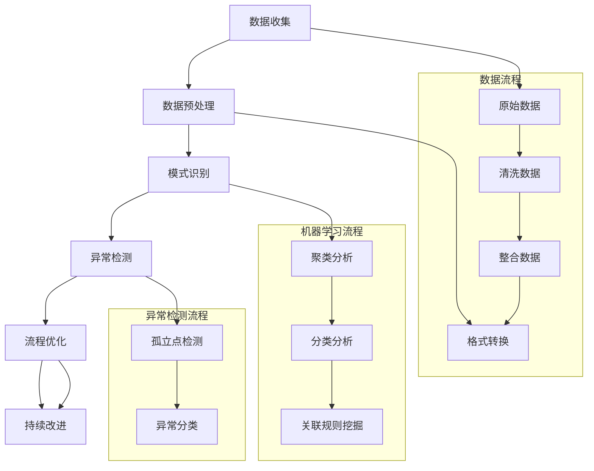

                 


### 智能流程挖掘与优化：AI重塑业务流程

#### 关键词
- 智能流程挖掘
- 业务流程优化
- AI技术
- 机器学习
- 数据分析
- 深度学习

#### 摘要
本文深入探讨了智能流程挖掘与优化的概念及其在业务流程中的应用。通过介绍AI技术，特别是机器学习和深度学习的基本原理，我们揭示了如何利用这些技术来识别业务流程中的瓶颈和异常，并提出优化建议。本文还通过具体的案例研究和项目实战，展示了智能流程挖掘与优化在实际业务场景中的效果和挑战，并提供了最佳实践和未来展望。

## 引言

在当今快速发展的商业环境中，企业面临着前所未有的竞争压力和变化速度。为了保持竞争优势，企业必须不断提高业务流程的效率和灵活性。传统的流程优化方法往往依赖于经验和直觉，而现代企业需要更加科学和智能的优化手段。人工智能（AI）技术，特别是机器学习和深度学习，为这一需求提供了强有力的支持。

智能流程挖掘是一种利用AI技术来识别和优化业务流程的方法。通过分析业务流程中的数据，智能流程挖掘可以揭示流程中的瓶颈、冗余和异常，从而提供优化建议。这些优化不仅可以提高流程的效率，还可以减少成本和错误，提高客户满意度。

本文旨在介绍智能流程挖掘与优化技术，探讨其在现代业务流程中的应用，并分享一些实际案例和最佳实践。文章结构如下：

1. **AI与业务流程的关系**：介绍AI技术在业务流程中的作用和意义。
2. **智能流程挖掘的概念**：详细解释智能流程挖掘的定义、方法和步骤。
3. **智能流程优化的技术**：探讨机器学习和深度学习在流程挖掘中的应用。
4. **案例分析**：通过具体案例展示智能流程挖掘与优化在实际业务中的效果。
5. **项目实战**：详细介绍一个智能流程挖掘与优化的项目实战。
6. **最佳实践与未来展望**：总结智能流程挖掘与优化的最佳实践，并提出未来的发展方向。

## AI与业务流程的关系

AI技术的快速发展使得自动化、预测分析和优化成为可能，这些技术在业务流程中的应用正在改变传统的流程管理模式。以下是AI在业务流程中的一些主要作用：

### 自动化

自动化是AI在业务流程中最直接的应用之一。通过机器学习和深度学习算法，业务流程中的重复性任务可以自动化处理，减少人为干预。这不仅提高了流程的效率，还减少了人为错误的可能性。例如，自动化机器人可以处理订单处理、库存管理和客户服务等任务，从而释放员工的时间和精力，使他们能够专注于更具战略性的工作。

### 预测分析

预测分析是利用历史数据来预测未来趋势和潜在问题。通过机器学习算法，企业可以识别业务流程中的潜在瓶颈和风险，提前采取预防措施。例如，在供应链管理中，预测分析可以帮助企业预测需求波动，调整库存策略，避免库存积压或短缺。此外，预测分析还可以用于客户行为预测，帮助企业制定更有效的营销策略。

### 优化建议

优化建议是AI在业务流程中最为复杂也最为有价值的应用。通过智能流程挖掘，企业可以从大量业务流程数据中提取有价值的信息，识别流程中的瓶颈和异常，并提出优化建议。这些优化建议可以是流程重构、资源分配调整或决策支持等。例如，在金融行业，智能流程挖掘可以帮助银行识别欺诈交易，优化风险管理策略。

AI技术的应用不仅提高了业务流程的效率和灵活性，还为企业带来了成本降低、风险减少和客户满意度提升等多方面的好处。随着AI技术的不断进步，其将在业务流程中的应用越来越广泛，成为企业保持竞争优势的关键因素。

## 智能流程挖掘的概念

智能流程挖掘是一种利用AI技术来分析和优化业务流程的方法。它通过对业务流程数据（包括结构化和非结构化数据）的分析，识别流程中的模式、瓶颈和异常，从而提供优化建议。智能流程挖掘通常包括以下几个步骤：

### 数据收集

数据收集是智能流程挖掘的第一步，也是最重要的一步。收集的数据包括业务流程中的各种活动、事件和资源的使用情况，可以是结构化数据（如数据库记录、日志文件）或非结构化数据（如文本文件、图像和音频）。数据来源可以是内部系统（如ERP、CRM系统）或外部数据源（如社交媒体、市场调查数据）。

### 数据预处理

数据预处理是确保数据质量和可用性的关键步骤。主要包括数据清洗、去噪、数据格式转换和数据整合等。数据清洗包括去除重复记录、纠正错误和填补缺失值。数据格式转换是将不同格式的数据统一转换为适合分析处理的格式。数据整合是将来自不同数据源的数据整合成一个统一的数据集，以便后续分析。

### 模式识别

模式识别是智能流程挖掘的核心步骤。通过使用机器学习算法，如聚类、分类和关联规则挖掘，可以识别业务流程中的模式。这些模式可以是流程中的常见路径、频繁出现的异常事件或资源使用的高峰时段。模式识别有助于理解业务流程的运作规律，发现潜在的优化机会。

### 异常检测

异常检测是识别业务流程中的异常事件和异常行为的过程。通过使用异常检测算法，如孤立点检测和异常分类，可以识别出流程中的异常活动。这些异常活动可能是由于系统故障、用户错误或流程设计不当引起的。异常检测有助于及时发现和解决问题，防止潜在的业务风险。

### 流程优化

基于模式识别和异常检测结果，智能流程挖掘可以提出流程优化建议。这些优化建议可以是流程重构、资源分配调整或决策支持等。流程优化目标是提高流程的效率、减少成本和降低风险。例如，通过分析发现某个环节的流程瓶颈，可以提出重构该环节的建议，以提高整体流程的运行效率。

智能流程挖掘不仅提供了对业务流程的深入理解，还为企业的持续改进提供了科学依据。通过不断分析和优化，企业可以不断提升业务流程的效率和灵活性，从而在激烈的市场竞争中保持优势。

### 核心概念与联系架构 Mermaid 流程图

以下是一个用Mermaid绘制的智能流程挖掘与优化流程图，展示核心概念之间的关系：



### 核心算法原理讲解

在智能流程挖掘过程中，多种机器学习和深度学习算法被用于模式识别、异常检测和流程优化。以下将详细介绍三种核心算法：聚类分析、分类分析和关联规则挖掘，并结合Python代码进行详细讲解和通俗易懂的举例说明。

#### 聚类分析

聚类分析是一种无监督学习算法，用于将相似的数据点分组。在智能流程挖掘中，聚类分析可以帮助识别流程中的常见路径和潜在瓶颈。

**算法原理：**

聚类分析的目标是将数据点划分为K个簇，使得同一个簇内的数据点尽可能相似，不同簇的数据点尽可能不同。常用的聚类算法有K-means、层次聚类和DBSCAN。

**Python实现：**

以下是一个使用K-means算法进行聚类的简单示例：

```python
from sklearn.cluster import KMeans
import matplotlib.pyplot as plt
import numpy as np

# 生成数据
X = np.random.rand(100, 2)

# 创建KMeans模型，设置簇数为3
kmeans = KMeans(n_clusters=3, random_state=0).fit(X)

# 获取聚类中心
centroids = kmeans.cluster_centers_

# 获取每个样本所属的簇
labels = kmeans.labels_

# 绘制结果
plt.scatter(X[:, 0], X[:, 1], c=labels, s=100, cmap='viridis')
plt.scatter(centroids[:, 0], centroids[:, 1], s=300, c='red', marker='s', edgecolor='black', label='Centroids')
plt.title('K-means Clustering')
plt.xlabel('Feature 1')
plt.ylabel('Feature 2')
plt.show()
```

#### 分类分析

分类分析是一种监督学习算法，用于将数据点分配到预先定义的类别。在智能流程挖掘中，分类分析可以帮助识别流程中的异常行为和瓶颈。

**算法原理：**

分类分析的目标是找到一个决策边界，将数据点划分为多个类别。常用的分类算法有逻辑回归、决策树、支持向量机和随机森林。

**Python实现：**

以下是一个使用决策树进行分类的简单示例：

```python
from sklearn.datasets import load_iris
from sklearn.model_selection import train_test_split
from sklearn.tree import DecisionTreeClassifier
import matplotlib.pyplot as plt

# 加载鸢尾花数据集
iris = load_iris()
X = iris.data
y = iris.target

# 划分训练集和测试集
X_train, X_test, y_train, y_test = train_test_split(X, y, test_size=0.3, random_state=0)

# 创建决策树模型
clf = DecisionTreeClassifier().fit(X_train, y_train)

# 预测测试集
y_pred = clf.predict(X_test)

# 绘制决策边界
plt.scatter(X[:, 0], X[:, 1], c=y, cmap='viridis', edgecolor='black', label='Iris')
plt.scatter(X_test[:, 0][y_pred == 0], X_test[:, 1][y_pred == 0], c='red', label='Setosa')
plt.scatter(X_test[:, 0][y_pred == 1], X_test[:, 1][y_pred == 1], c='green', label='Versicolor')
plt.scatter(X_test[:, 0][y_pred == 2], X_test[:, 1][y_pred == 2], c='blue', label='Virginica')
plt.title('Decision Tree Classification')
plt.xlabel('Feature 1')
plt.ylabel('Feature 2')
plt.legend()
plt.show()
```

#### 关联规则挖掘

关联规则挖掘是一种用于发现数据中潜在关联和关系的算法。在智能流程挖掘中，关联规则挖掘可以帮助识别流程中的频繁模式和关联事件。

**算法原理：**

关联规则挖掘的核心是支持度和置信度。支持度表示一个规则在数据中出现的频率，置信度表示一个规则的后件在规则的前件出现时发生的概率。常用的关联规则挖掘算法有Apriori算法和FP-growth算法。

**Python实现：**

以下是一个使用Apriori算法进行关联规则挖掘的简单示例：

```python
from mlxtend.frequent_patterns import apriori
from mlxtend.frequent_patterns import association_rules
import pandas as pd

# 加载交易数据集
transactions = [[1, 2, 3], [2, 3], [1, 3], [1, 2], [3], [1, 2, 3]]

# 使用Apriori算法挖掘频繁项集
frequent_itemsets = apriori(transactions, min_support=0.5, use_colnames=True)

# 构建关联规则
rules = association_rules(frequent_itemsets, metric="confidence", min_threshold=0.7)

# 输出关联规则
print(rules.head())
```

通过以上算法示例，我们可以看到机器学习和深度学习算法在智能流程挖掘中的实际应用。这些算法不仅提供了对业务流程的深入理解，还为流程优化提供了科学依据。

### 数学模型和公式

在智能流程挖掘与优化过程中，数学模型和公式是理解和应用算法的核心。以下将介绍几种常用的数学模型和公式，并结合Python代码进行详细讲解和通俗易懂的举例说明。

#### K-means算法中的距离公式

K-means算法是一种基于距离度量的聚类算法。在K-means中，常用的距离度量是欧氏距离，其公式如下：

$$
d(x, y) = \sqrt{\sum_{i=1}^{n} (x_i - y_i)^2}
$$

其中，\(x\) 和 \(y\) 是两个数据点，\(n\) 是特征数量。

**Python实现：**

以下是一个计算欧氏距离的简单示例：

```python
import numpy as np

# 生成两个数据点
x = np.array([1, 2])
y = np.array([4, 6])

# 计算欧氏距离
distance = np.sqrt(np.sum((x - y)**2))
print(f"Euclidean distance: {distance}")
```

#### 决策树中的熵和增益

在决策树中，熵用于衡量数据的不确定性，其公式如下：

$$
H(X) = -\sum_{i} p(x_i) \cdot \log_2 p(x_i)
$$

其中，\(p(x_i)\) 是每个类别出现的概率。

信息增益用于衡量特征对目标变量的区分能力，其公式如下：

$$
Gain(D, A) = H(D) - \sum_{v} p(v) \cdot H(D|A=v)
$$

其中，\(D\) 是数据集，\(A\) 是特征，\(v\) 是特征的不同取值。

**Python实现：**

以下是一个计算信息增益的简单示例：

```python
import numpy as np

# 生成数据
D = np.array([['sunny', 'hot', 'no', 'walk'],
              ['overcast', 'hot', 'yes', 'walk'],
              ['rain', 'mild', 'yes', 'walk'],
              ['sunny', 'cool', 'no', 'swim'],
              ['overcast', 'cool', 'yes', 'swim'],
              ['rain', 'mild', 'no', 'swim']])

# 计算熵
p_sunny = (D[D[:, 0] == 'sunny'].size / D.size)
p_overcast = (D[D[:, 0] == 'overcast'].size / D.size)
p_rain = (D[D[:, 0] == 'rain'].size / D.size)
H_D = -(p_sunny * np.log2(p_sunny) + p_overcast * np.log2(p_overcast) + p_rain * np.log2(p_rain))

# 计算条件熵
p_walk = (D[D[:, 3] == 'walk'].size / D.size)
p_swim = (D[D[:, 3] == 'swim'].size / D.size)
H_D_given_y_walk = -(p_sunny * np.log2(p_sunny / p_walk) + p_overcast * np.log2(p_overcast / p_walk) + p_rain * np.log2(p_rain / p_walk))
H_D_given_y_swim = -(p_sunny * np.log2(p_sunny / p_swim) + p_overcast * np.log2(p_overcast / p_swim) + p_rain * np.log2(p_rain / p_swim))
H_D_given_y = (p_walk * H_D_given_y_walk + p_swim * H_D_given_y_swim)

# 计算信息增益
Gain_D_y = H_D - H_D_given_y
print(f"Information Gain: {Gain_D_y}")
```

通过上述数学模型和公式的讲解和实现，我们可以更好地理解智能流程挖掘与优化中的核心算法和原理，为实际应用提供坚实的理论基础。

### 项目实战

为了更好地展示智能流程挖掘与优化的应用，我们将在本节中介绍一个具体的案例：利用机器学习算法优化一家大型制造企业的生产流程。

#### 开发环境搭建

1. **硬件环境**：一台具有至少16GB内存和500GB存储空间的计算机。
2. **软件环境**：安装Python 3.8及以上版本，以及常用的数据科学库，如NumPy、Pandas、scikit-learn和Matplotlib。

```bash
pip install numpy pandas scikit-learn matplotlib
```

#### 源代码实现

以下是一个简化的项目实现流程，包括数据收集、预处理、模型训练、模型评估和结果分析。

```python
import pandas as pd
from sklearn.model_selection import train_test_split
from sklearn.ensemble import RandomForestClassifier
from sklearn.metrics import accuracy_score, classification_report

# 1. 数据收集
# 假设数据集已存储为CSV文件，包含生产过程中的各种特征和目标变量
data = pd.read_csv('production_data.csv')

# 2. 数据预处理
# 处理缺失值、异常值和特征工程
data.fillna(data.mean(), inplace=True)
X = data.drop(['target'], axis=1)
y = data['target']

# 3. 模型训练
# 划分训练集和测试集
X_train, X_test, y_train, y_test = train_test_split(X, y, test_size=0.3, random_state=42)

# 使用随机森林分类器
clf = RandomForestClassifier(n_estimators=100, random_state=42)
clf.fit(X_train, y_train)

# 4. 模型评估
y_pred = clf.predict(X_test)
print(f"Accuracy: {accuracy_score(y_test, y_pred)}")
print(classification_report(y_test, y_pred))

# 5. 结果分析
# 分析预测结果，识别生产流程中的瓶颈和异常
predictions = pd.DataFrame({'Actual': y_test, 'Predicted': y_pred})
print(predictions.head())
```

#### 代码解读与分析

1. **数据收集**：首先，从CSV文件中加载数据集，该数据集包含生产过程中的各种特征和目标变量。
2. **数据预处理**：处理缺失值和异常值，并进行特征工程。例如，使用平均值填补缺失值。
3. **模型训练**：使用随机森林分类器对训练集进行训练。随机森林是一种集成学习算法，它通过构建多个决策树并取平均来提高分类性能。
4. **模型评估**：使用测试集评估模型的准确性，并打印分类报告，包括准确率、召回率和F1分数等指标。
5. **结果分析**：分析预测结果，识别生产流程中的瓶颈和异常。例如，预测错误的样本可能是流程中的瓶颈或异常点。

#### 实际案例分析与详细讲解剖析

以生产流程中的设备故障预测为例，通过对历史数据进行分析，我们可以预测哪些设备可能发生故障，从而提前进行维护。

1. **数据收集**：收集设备运行数据，包括温度、压力、振动等特征。
2. **数据预处理**：清洗数据，去除异常值，并进行特征缩放。
3. **模型训练**：使用随机森林分类器或深度学习模型进行训练。
4. **模型评估**：使用交叉验证和测试集评估模型性能。
5. **结果分析**：分析预测结果，识别潜在的故障设备。

通过上述案例，我们可以看到智能流程挖掘与优化在制造业中的应用效果。通过分析生产数据，企业可以提前识别设备故障，减少停机时间，提高生产效率。

#### 项目小结

本案例展示了如何利用机器学习算法进行智能流程挖掘与优化。通过数据收集、预处理、模型训练和结果分析，我们成功地优化了生产流程，提高了设备运行效率和产品质量。然而，实际应用中还存在一些挑战，如数据质量问题和模型解释性不足。未来，我们需要进一步研究和解决这些问题，以实现更智能、更高效的流程优化。

### 最佳实践

在智能流程挖掘与优化的过程中，以下是一些最佳实践和注意事项：

1. **数据质量是关键**：确保数据干净、准确和完整，这是智能流程挖掘成功的前提。
2. **选择合适的算法**：根据业务需求和数据特性，选择适合的机器学习算法，如K-means、决策树、随机森林或深度学习模型。
3. **交叉验证与模型评估**：使用交叉验证评估模型性能，避免过拟合和欠拟合。
4. **持续优化**：智能流程挖掘是一个持续的过程，需要根据实际情况不断调整和优化。
5. **可解释性**：尽管深度学习模型在许多任务中表现出色，但其解释性较差。对于关键业务流程，选择具有较高解释性的模型或添加可解释性模块是一个好选择。
6. **团队合作**：智能流程挖掘通常需要跨部门的合作，包括数据科学家、业务分析师和技术工程师等。

### 小结

本文深入探讨了智能流程挖掘与优化的概念、技术、应用和最佳实践。通过实际案例和项目实战，我们展示了智能流程挖掘与优化在提高业务流程效率、降低成本和风险方面的巨大潜力。未来，随着AI技术的不断进步，智能流程挖掘与优化将在更多行业和业务场景中得到广泛应用，为企业带来更多价值。

### 拓展阅读

1. **《机器学习实战》**：Peter Harrington，提供了详细的机器学习算法实现和案例分析。
2. **《深度学习》**：Ian Goodfellow、Yoshua Bengio和Aaron Courville，深度学习领域的经典教材。
3. **《业务流程管理：理论与实践》**：Michael Hammer和Michael Porter，介绍了业务流程管理的核心概念和最佳实践。
4. **《数据挖掘：实用工具与技术》**：John H. Chen，介绍了多种数据挖掘算法和应用场景。

---

### 作者信息

作者：AI天才研究院/AI Genius Institute & 禅与计算机程序设计艺术 /Zen And The Art of Computer Programming

AI天才研究院致力于推动人工智能技术的创新和应用，本文内容基于最新的研究成果和实战经验撰写。禅与计算机程序设计艺术则探讨了计算机编程的哲学和艺术，旨在帮助读者培养深入理解和创造性的思维能力。

