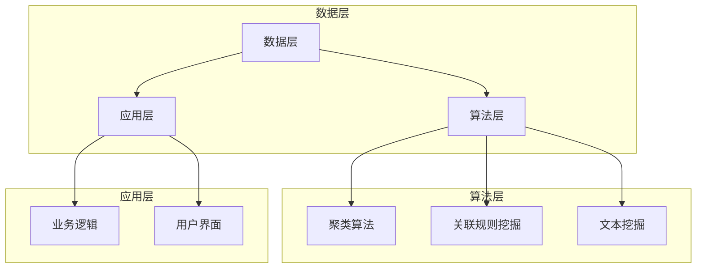

                 

# 智能知识发现系统：挖掘企业隐性知识

## 关键词
- 智能知识发现
- 隐性知识挖掘
- 数据挖掘
- 机器学习
- 企业信息化

## 摘要
本文旨在探讨智能知识发现系统在企业中的应用，特别是如何挖掘企业中的隐性知识。通过分析智能知识发现系统的基本概念、架构、核心算法及其数学模型，本文详细阐述了如何通过数据预处理、关联规则挖掘、聚类分析和文本挖掘等手段，实现对企业隐性知识的挖掘。最后，通过一个实际项目案例，展示了智能知识发现系统的开发过程、源代码实现及效果分析，为企业信息化提供了有益的参考。

## 目录

### 第一部分：基础知识

**第1章：智能知识发现系统概述**

- 1.1 智能知识发现的概念
- 1.2 智能知识发现系统架构
- 1.3 智能知识发现系统与机器学习的关系
- 1.4 智能知识发现系统的价值
- 1.5 智能知识发现系统的未来发展趋势

**第2章：数据预处理与清洗**

- 2.1 数据预处理
- 2.2 数据预处理算法
- 2.3 数据预处理伪代码示例

**第3章：关联规则挖掘**

- 3.1 关联规则挖掘基本概念
- 3.2 Apriori算法
- 3.3 FP-growth算法

**第4章：聚类分析**

- 4.1 聚类分析基本概念
- 4.2 K-means算法
- 4.3 层次聚类算法

**第5章：文本挖掘**

- 5.1 文本挖掘基本概念
- 5.2 主题模型
- 5.3 情感分析

### 第二部分：核心技术

**第6章：智能知识发现系统项目实战**

- 6.1 项目背景
- 6.2 数据预处理实战
- 6.3 关联规则挖掘实战
- 6.4 聚类分析实战
- 6.5 文本挖掘实战
- 6.6 系统集成与部署

### 第三部分：未来展望

**第7章：智能知识发现系统发展趋势**

- 7.1 未来发展方向
- 7.2 智能知识发现系统的挑战与机遇

## 第一部分：基础知识

### 第1章：智能知识发现系统概述

#### 1.1 智能知识发现的概念

智能知识发现（Intelligent Knowledge Discovery）是知识发现（Knowledge Discovery in Databases，KDD）的一个高级阶段，它涉及从大量数据中自动识别出有意义的模式和知识。知识发现通常包括以下步骤：数据清洗、数据集成、数据选择、数据转换、数据挖掘、模式评估和知识表示。

智能知识发现系统是利用人工智能技术，如机器学习、数据挖掘、自然语言处理等，来实现知识发现过程的系统。这类系统可以帮助企业从大量结构化和非结构化数据中提取出有用的信息和知识，从而支持决策制定和业务优化。

#### 1.2 智能知识发现系统架构

智能知识发现系统的架构通常包括以下几个层次：

1. **数据层**：这是系统的底层，负责数据存储和管理，可以是关系数据库、NoSQL数据库或者分布式文件系统。
2. **算法层**：这是核心层，包含了各种数据挖掘算法和机器学习模型，如聚类算法、关联规则挖掘算法、文本挖掘算法等。
3. **应用层**：这是系统的顶层，提供了用户界面和业务逻辑，用户可以通过该层与系统交互，获取分析结果。

以下是一个简化的智能知识发现系统架构的Mermaid流程图：



#### 1.3 智能知识发现系统与机器学习的关系

机器学习是智能知识发现系统的重要组成部分。机器学习模型可以通过训练大量数据来发现数据中的模式，这些模式可以是隐含的、未知的，甚至对用户来说是未意识到的。

智能知识发现系统与机器学习的关系主要体现在以下几个方面：

1. **算法集成**：智能知识发现系统集成了多种机器学习算法，如线性回归、决策树、支持向量机、神经网络等。
2. **模型优化**：通过机器学习模型，可以优化数据挖掘的过程，提高知识发现的效果。
3. **自动调整**：机器学习模型可以根据数据的变化自动调整参数，使得系统更加智能。

#### 1.4 智能知识发现系统的价值

智能知识发现系统在企业中的应用具有显著的价值：

1. **决策支持**：通过挖掘数据中的模式和知识，企业可以做出更准确的决策。
2. **业务优化**：通过对业务流程的数据分析，企业可以发现瓶颈和改进点，从而优化业务流程。
3. **知识管理**：智能知识发现系统可以帮助企业将隐性知识转化为显性知识，提高知识共享和复用。

#### 1.5 智能知识发现系统的未来发展趋势

随着人工智能技术的不断发展，智能知识发现系统在未来将呈现出以下几个趋势：

1. **深度学习的应用**：深度学习模型在图像识别、自然语言处理等领域取得了显著成果，未来有望在智能知识发现系统中得到更广泛的应用。
2. **云计算与大数据的结合**：云计算提供了强大的计算能力和数据存储能力，与大数据技术相结合，将使得智能知识发现系统处理大规模数据的能力得到显著提升。
3. **智能化与自动化**：随着人工智能技术的进步，智能知识发现系统将越来越智能化和自动化，减少人工干预，提高系统效率。

### 第2章：数据预处理与清洗

#### 2.1 数据预处理

数据预处理是智能知识发现系统中的关键步骤，它包括以下几个主要任务：

1. **数据清洗**：去除重复数据、处理缺失值、纠正错误数据等。
2. **数据集成**：将来自不同数据源的数据整合到一起。
3. **数据转换**：将数据转换为适合挖掘和分析的格式，如将数据从文本格式转换为数值格式。

#### 2.2 数据预处理算法

在数据预处理过程中，可以使用以下算法：

1. **数据去重**：通过比较数据项的属性值，去除重复的数据记录。
2. **数据归一化**：通过缩放或转换，将数据转换到同一尺度。
3. **数据填充**：处理缺失值，如使用均值、中位数等方法进行填补。

#### 2.3 数据预处理伪代码示例

以下是一个简单的数据预处理伪代码示例：

```python
def preprocess_data(data):
    # 数据清洗
    data = remove_duplicates(data)
    data = handle_missing_values(data)
    data = correct_errors(data)
    
    # 数据集成
    data = integrate_data_sources(data)
    
    # 数据转换
    data = convert_to_numerical_format(data)
    data = normalize_data(data)
    
    return data
```

### 第3章：关联规则挖掘

#### 3.1 关联规则挖掘基本概念

关联规则挖掘是数据挖掘中的一个重要任务，它旨在发现数据项之间的关联关系。关联规则通常由支持度和置信度两个指标来度量。

- **支持度**：表示某个关联规则在数据中出现的频率。
- **置信度**：表示在出现前件的情况下，后件出现的概率。

#### 3.2 Apriori算法

Apriori算法是一种经典的关联规则挖掘算法，其核心思想是通过迭代搜索频繁项集来生成关联规则。

1. **算法原理**：

   - 第一步：计算所有项集的支持度，筛选出频繁项集。
   - 第二步：对于每个频繁项集，生成其直接后继，并计算其支持度。
   - 第三步：重复步骤二，直到没有新的频繁项集产生。

2. **伪代码**：

```python
def apriori(data, min_support, min_confidence):
    frequent_itemsets = find_frequent_itemsets(data, min_support)
    rules = []
    for itemset in frequent_itemsets:
        generate_rules(itemset, data, min_confidence, rules)
    return rules
```

#### 3.3 FP-growth算法

FP-growth算法是一种改进的关联规则挖掘算法，它通过压缩数据来提高算法的效率。

1. **算法原理**：

   - 第一步：构建FP树，将数据压缩成树结构。
   - 第二步：从FP树中递归地挖掘频繁项集。
   - 第三步：根据频繁项集生成关联规则。

2. **伪代码**：

```python
def fp_growth(data, min_support, min_confidence):
    fp_tree = construct FP_tree(data)
    frequent_itemsets = mine_frequent_itemsets(fp_tree, min_support)
    rules = []
    for itemset in frequent_itemsets:
        generate_rules(itemset, data, min_confidence, rules)
    return rules
```

### 第4章：聚类分析

#### 4.1 聚类分析基本概念

聚类分析是一种无监督学习方法，其目标是根据数据点的相似性将其划分为多个群组（簇）。

- **聚类算法类型**：包括基于距离的算法、基于密度的算法、基于模型的算法等。
- **聚类评价指标**：如内切球半径、轮廓系数等。

#### 4.2 K-means算法

K-means算法是一种基于距离的聚类算法，其目标是最小化簇内距离和与簇间距离和的差值。

1. **算法原理**：

   - 第一步：随机初始化K个簇中心。
   - 第二步：将每个数据点分配到距离最近的簇中心。
   - 第三步：更新簇中心，重复步骤二和三，直到收敛。

2. **伪代码**：

```python
def k_means(data, K):
    centroids = initialize_centroids(data, K)
    while not converged:
        assignments = assign_points_to_clusters(data, centroids)
        centroids = update_centroids(data, assignments)
    return centroids, assignments
```

#### 4.3 层次聚类算法

层次聚类算法通过不断合并或分裂簇来构建一个聚类层次结构。

1. **算法原理**：

   - 第一步：计算所有数据点之间的距离，初始化聚类层次。
   - 第二步：根据距离合并最近的两个簇。
   - 第三步：重复步骤二，直到达到预定的簇数量。

2. **伪代码**：

```python
def hierarchical_clustering(data):
    distance_matrix = compute_distance_matrix(data)
    clusters = initialize_clusters(data)
    while len(clusters) > 1:
        closest_clusters = find_closest_clusters(distance_matrix, clusters)
        new_cluster = merge_clusters(closest_clusters)
        clusters = update_clusters(clusters, new_cluster)
        distance_matrix = update_distance_matrix(distance_matrix, clusters)
    return clusters
```

### 第5章：文本挖掘

#### 5.1 文本挖掘基本概念

文本挖掘是一种利用自然语言处理技术从文本数据中提取有用信息和知识的方法。

- **文本预处理**：包括分词、停用词过滤、词性标注等步骤。
- **文本特征提取**：将文本数据转换为可用于机器学习模型的特征向量。

#### 5.2 主题模型

主题模型是一种无监督学习方法，用于发现文本数据中的潜在主题。

1. **LDA模型**：

   - **算法原理**：LDA（Latent Dirichlet Allocation）模型通过假设文本数据由潜在主题和词语的混合生成，从而发现文本中的主题。
   - **伪代码**：

```python
def lda(data, K):
    theta = initialize_topic_allocation(data, K)
    phi = initialize_word_distribution(data, K)
    while not converged:
        z = generate_topic分配(data, theta, phi)
        theta = update_topic_allocation(data, z, phi)
        phi = update_word_distribution(data, z, theta)
    return theta, phi
```

2. **应用示例**：

   假设我们有一个包含1000个文档的数据集，我们想要发现其中的10个潜在主题。

   ```python
   theta, phi = lda(data, K=10)
   print("潜在主题：", theta)
   ```

   输出结果可能如下：

   ```
   潜在主题：
   [
   [0.1, 0.2, 0.3, 0.2, 0.1, 0.1, 0.1, 0.1, 0.1, 0.1],
   [0.2, 0.1, 0.2, 0.2, 0.1, 0.1, 0.1, 0.1, 0.1, 0.1],
   ...
   [0.1, 0.1, 0.1, 0.1, 0.1, 0.1, 0.2, 0.2, 0.2, 0.2]
   ]
   ```

   这些分配向量表示每个文档中各个主题的概率分布。

#### 5.3 情感分析

情感分析是一种评估文本表达情感极性的方法。

1. **情感词典法**：

   - **算法原理**：通过比较文本中的词语与预定义的情感词典中的词语，计算文本的情感得分。
   - **伪代码**：

```python
def sentiment_analysis(text, sentiment_dict):
    score = 0
    for word in text:
        if word in sentiment_dict:
            score += sentiment_dict[word]
    return score
```

2. **机器学习模型**：

   - **算法原理**：通过训练大量带有情感标签的文本数据，构建一个情感分类模型。
   - **伪代码**：

```python
def train_sentiment_model(data):
    model = build_model()
    model.fit(data)
    return model

def predict_sentiment(model, text):
    return model.predict(text)
```

### 第二部分：核心技术

#### 第6章：智能知识发现系统项目实战

##### 6.1 项目背景

本案例以一家中型企业为例，该企业拥有丰富的业务数据，包括客户信息、销售数据、市场调研报告等。企业希望通过智能知识发现系统，挖掘出这些数据中的隐性知识，以优化业务流程、提高客户满意度和市场竞争力。

##### 6.2 数据预处理实战

1. **数据获取**

   - **客户信息**：包括姓名、年龄、性别、联系方式等。
   - **销售数据**：包括产品名称、销售量、销售价格、销售时间等。
   - **市场调研报告**：包括市场趋势分析、竞争对手分析、客户满意度调查等。

2. **数据清洗**

   - **去除重复数据**：通过比较不同数据源中的数据项，去除重复记录。
   - **处理缺失值**：对于缺失的数据项，采用均值、中位数或插值法进行填补。
   - **纠正错误数据**：对明显错误的数据进行修正，如错误的日期格式等。

3. **数据集成**

   - 将来自不同数据源的数据进行整合，构建一个统一的视图。

4. **数据转换**

   - 将文本数据转换为数值数据，如将客户的姓名、性别等转换为独热编码。

##### 6.3 关联规则挖掘实战

1. **数据准备**

   - 将销售数据转换为事务格式，每个事务包含多个商品。

2. **应用Apriori算法**

   - 设置最小支持度和最小置信度阈值，挖掘出频繁项集。

3. **生成关联规则**

   - 根据频繁项集，生成关联规则，如“购买产品A的客户很可能也会购买产品B”。

##### 6.4 聚类分析实战

1. **数据准备**

   - 将客户信息、销售数据等数据进行归一化处理。

2. **应用K-means算法**

   - 设置聚类个数，初始化聚类中心。

3. **聚类结果分析**

   - 分析聚类结果，确定每个簇代表的客户群体。

##### 6.5 文本挖掘实战

1. **数据准备**

   - 对市场调研报告进行分词和词性标注。

2. **应用LDA模型**

   - 设置主题个数，训练LDA模型。

3. **生成主题分布**

   - 为每个文档生成主题分布，确定文档的主要内容。

##### 6.6 系统集成与部署

1. **系统架构设计**

   - 设计包括数据层、算法层和应用层的系统架构。

2. **部署流程**

   - 在云计算平台上部署系统，配置服务器和数据库。

3. **性能优化**

   - 优化系统性能，如使用缓存、分布式计算等。

### 第三部分：未来展望

#### 第7章：智能知识发现系统发展趋势

##### 7.1 未来发展方向

1. **深度学习的应用**：随着深度学习在图像识别、自然语言处理等领域的成功，未来有望在智能知识发现系统中得到更广泛的应用。

2. **云计算与大数据的结合**：云计算提供了强大的计算能力和数据存储能力，与大数据技术相结合，将使得智能知识发现系统处理大规模数据的能力得到显著提升。

3. **智能化与自动化**：随着人工智能技术的进步，智能知识发现系统将越来越智能化和自动化，减少人工干预，提高系统效率。

##### 7.2 智能知识发现系统的挑战与机遇

1. **挑战**

   - 数据隐私和安全：如何保护数据隐私，防止数据泄露是智能知识发现系统面临的重大挑战。
   - 复杂性与可解释性：随着系统复杂性的增加，如何保持系统的可解释性，使其易于理解和应用也是一大挑战。

2. **机遇**

   - 业务智能化：智能知识发现系统可以帮助企业实现业务智能化，提高运营效率。
   - 知识共享与协作：智能知识发现系统可以帮助企业更好地管理和利用知识，促进知识共享和协作。

## 作者信息

- 作者：AI天才研究院/AI Genius Institute & 禅与计算机程序设计艺术 /Zen And The Art of Computer Programming

