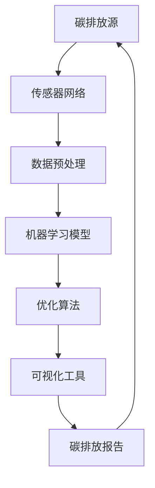

                 

### 引言

随着全球气候变化的日益严峻，碳排放管理已经成为世界各国企业和社会关注的焦点。智能碳排放管理，作为一种融合了人工智能（AI）技术的创新方法，正逐渐成为实现企业可持续发展的关键手段。AI技术凭借其强大的数据处理和分析能力，能够在碳排放监测、预测和优化等方面发挥重要作用，为企业提供科学决策支持，从而助力实现低碳经济。

本文旨在探讨智能碳排放管理在AI技术助力下的应用与发展。通过介绍智能碳排放管理的基础理论、AI技术简介、智能碳排放监测技术、预测算法、优化策略，以及企业实际案例，本文将全面剖析AI技术在碳排放管理中的潜力与挑战。

文章将分为以下几个部分：

1. **背景介绍**：阐述智能碳排放管理的背景和重要性。
2. **核心概念与联系**：定义核心概念，并展示它们之间的关系。
3. **核心算法原理**：详细讲解智能碳排放管理的核心算法原理，包括数学模型和Python代码示例。
4. **项目实战**：分析一个实际项目，展示开发环境搭建、源代码实现、代码解读、应用分析以及项目小结。
5. **最佳实践与拓展**：提供最佳实践建议，总结文章，并提出未来研究方向。

通过以上步骤，本文将带领读者深入了解智能碳排放管理在AI技术助力下的应用与实践，以期为企业可持续发展提供有益的参考。

### 背景介绍

智能碳排放管理是一种综合运用人工智能技术，通过数据分析和算法优化，实现对碳排放进行精准监测、预测和优化的方法。随着全球气候变化的影响日益加剧，减少碳排放、实现碳中和目标已经成为国际社会的共同使命。企业和政府都在积极探索各种有效的减排策略，而智能碳排放管理作为一种新兴技术，正逐渐受到广泛关注和应用。

首先，从宏观背景来看，全球气候变化问题已经迫在眉睫。根据联合国气候变化框架公约（UNFCCC）的数据，自工业化以来，全球平均气温已经上升了约1.1摄氏度。如果不采取有效措施，预计到21世纪末，全球平均气温可能会上升2至4摄氏度，这将带来灾难性的后果，如海平面上升、极端气候事件频发、生态系统破坏等。为了应对这一挑战，世界各国纷纷签署了巴黎协定，承诺采取措施减少温室气体排放，实现全球温室气体净零排放的目标。

在这样的背景下，企业作为温室气体排放的主要来源之一，承担着重要的责任。传统的碳排放管理方法往往依赖于人工监测和数据录入，效率低下且容易出现误差。随着AI技术的快速发展，智能碳排放管理应运而生，为企业提供了一种更高效、更准确的碳排放管理手段。

智能碳排放管理的重要性体现在以下几个方面：

1. **提升碳排放监测精度**：通过部署传感器网络和物联网技术，智能碳排放管理能够实现对碳排放源的实时监测和数据采集，提高监测的精度和覆盖范围。传统的监测方法往往依赖于定期的人工采样，存在时间滞后和数据不完整的问题，而智能监测技术可以实时、连续地采集数据，确保数据的实时性和完整性。

2. **实现碳排放预测**：智能碳排放管理通过机器学习和深度学习算法，可以分析历史数据，预测未来的碳排放量。这种预测能力有助于企业提前制定减排策略，降低碳排放风险。例如，在工业生产中，通过预测能源消耗和生产过程的变化，企业可以优化生产计划，减少不必要的能源浪费。

3. **优化碳排放策略**：智能碳排放管理通过优化算法，可以帮助企业制定最优的减排策略。这些策略包括能源替代、生产工艺优化、设备更新等。通过数据分析和模拟，企业可以发现最有效的减排措施，并实时调整策略，以实现最佳的经济和环境效益。

4. **促进可持续发展**：智能碳排放管理不仅有助于企业实现减排目标，还可以促进企业的可持续发展。通过优化资源利用、降低运营成本，企业可以提高竞争力，同时减少对环境的影响，实现经济、社会和环境的协调发展。

总之，智能碳排放管理作为AI技术的一项重要应用，已经成为企业实现低碳发展和可持续发展的重要工具。随着技术的不断进步和应用场景的拓展，智能碳排放管理将在未来发挥更加重要的作用，为全球应对气候变化贡献智慧与力量。

### 核心概念与联系

智能碳排放管理作为一项复杂的技术应用，涉及多个核心概念和实体。为了更好地理解这些概念及其相互关系，我们使用Mermaid流程图来展示智能碳排放管理中的关键环节和流程。

首先，定义以下核心概念：

- **碳排放源**：包括工业生产、交通运输、能源消耗等产生碳排放的实体。
- **传感器网络**：用于实时监测和采集碳排放数据的传感器系统。
- **数据预处理**：对原始数据进行清洗、转换和标准化，为后续分析做准备。
- **机器学习模型**：用于分析和预测碳排放数据的算法，如时间序列分析和深度学习模型。
- **优化算法**：用于制定和优化减排策略的算法，如线性规划和遗传算法。
- **可视化工具**：用于展示碳排放数据和分析结果的工具，如图表和报表。

以下是智能碳排放管理中的概念关系架构Mermaid流程图：



**流程解释：**

1. **碳排放源**：企业、工厂、交通工具等是主要的碳排放源。这些源头通过传感器网络进行实时监测，捕捉碳排放数据。
2. **传感器网络**：传感器网络是数据采集的关键环节。它包括各种类型的传感器，如温度传感器、气体传感器和流量传感器，能够实时采集碳排放相关的数据。
3. **数据预处理**：采集到的原始数据通常包含噪声和异常值，需要通过数据预处理步骤进行清洗、转换和标准化。这一步骤确保了数据的准确性和一致性。
4. **机器学习模型**：经过预处理的数据输入到机器学习模型中，模型通过学习和分析历史数据，可以预测未来的碳排放量。常用的模型包括时间序列分析和深度学习模型。
5. **优化算法**：基于预测结果，优化算法被用来制定和调整减排策略。这些算法考虑多种因素，如成本、效率和环境影响，找到最优的减排方案。
6. **可视化工具**：优化后的策略通过可视化工具进行展示，使得决策者可以直观地了解碳排放管理的成效。
7. **碳排放报告**：最终生成的碳排放报告不仅用于内部决策，还可以对外公布，提升企业的社会责任形象。

通过这个Mermaid流程图，我们可以清晰地看到智能碳排放管理中各个核心概念和实体的相互关系，以及数据从采集、处理到预测和优化的完整流程。

### 核心算法原理讲解

在智能碳排放管理中，核心算法起着至关重要的作用。这些算法不仅能够精确预测未来的碳排放量，还能为企业制定最优的减排策略。本文将详细讲解两种核心算法：时间序列预测和机器学习预测方法，并结合Python代码示例，对算法原理和应用进行深入剖析。

#### 时间序列预测

时间序列预测是一种基于历史时间序列数据的预测方法，它假设未来的数据是过去数据的延续。时间序列预测在智能碳排放管理中应用广泛，可以用于预测碳排放量的短期波动和长期趋势。

**算法原理：**

时间序列预测的基本步骤包括：

1. **数据收集**：收集历史碳排放数据，包括时间、碳排放量等。
2. **特征提取**：提取与碳排放相关的特征，如温度、湿度、风速等。
3. **模型选择**：选择合适的时间序列模型，如ARIMA（自回归积分滑动平均模型）、SARIMA（季节性自回归积分滑动平均模型）等。
4. **模型训练和验证**：使用历史数据训练模型，并对模型进行验证，确保预测准确性。
5. **预测**：使用训练好的模型进行碳排放量的预测。

**Python代码示例：**

```python
import numpy as np
import pandas as pd
from statsmodels.tsa.arima.model import ARIMA
from sklearn.metrics import mean_squared_error

# 加载历史碳排放数据
data = pd.read_csv('carbon_emission_data.csv')
data['date'] = pd.to_datetime(data['date'])
data.set_index('date', inplace=True)
data = data.asfreq('D').fillna(0)

# 模型训练
model = ARIMA(data['emission'], order=(5, 1, 2))
model_fit = model.fit()

# 预测
forecast = model_fit.forecast(steps=30)[0]

# 验证
actual = data['emission'].iloc[-30:]
predicted = forecast[-30:]
mse = mean_squared_error(actual, predicted)
print(f'MSE: {mse}')

# 可视化
import matplotlib.pyplot as plt

plt.figure(figsize=(10, 5))
plt.plot(actual, label='Actual')
plt.plot(predicted, label='Predicted')
plt.title('Emission Forecast')
plt.legend()
plt.show()
```

**算法应用：**

时间序列预测在智能碳排放管理中的应用主要包括：

- **短期碳排放量预测**：帮助企业预测未来几天的碳排放量，以便及时调整生产计划和能源消耗。
- **长期碳排放量预测**：帮助制定长期的减排策略，如设备更新、工艺改进等。

#### 机器学习预测方法

机器学习预测方法利用统计学习理论，通过构建复杂的非线性模型，实现对碳排放量的预测。与时间序列预测相比，机器学习预测方法能够捕捉到更多的数据特征和复杂的关系。

**算法原理：**

机器学习预测方法的基本步骤包括：

1. **数据收集**：收集历史碳排放数据及相关特征数据。
2. **数据预处理**：对数据进行清洗、转换和标准化。
3. **特征工程**：选择和构建与碳排放相关的特征，如温度、湿度、风速、生产负荷等。
4. **模型选择**：选择合适的机器学习模型，如随机森林、支持向量机、神经网络等。
5. **模型训练和验证**：使用历史数据训练模型，并对模型进行验证。
6. **预测**：使用训练好的模型进行碳排放量的预测。

**Python代码示例：**

```python
import numpy as np
import pandas as pd
from sklearn.ensemble import RandomForestRegressor
from sklearn.model_selection import train_test_split
from sklearn.metrics import mean_squared_error

# 加载历史碳排放数据
data = pd.read_csv('carbon_emission_data.csv')
data['date'] = pd.to_datetime(data['date'])
data.set_index('date', inplace=True)
data = data.asfreq('D').fillna(0)

# 特征工程
data['temp'] = data['temperature']
data['humidity'] = data['humidity']
data['wind_speed'] = data['wind_speed']
X = data[['temp', 'humidity', 'wind_speed']]
y = data['emission']

# 数据分割
X_train, X_test, y_train, y_test = train_test_split(X, y, test_size=0.2, random_state=42)

# 模型训练
model = RandomForestRegressor(n_estimators=100, random_state=42)
model_fit = model.fit(X_train, y_train)

# 预测
forecast = model_fit.predict(X_test)

# 验证
mse = mean_squared_error(y_test, forecast)
print(f'MSE: {mse}')

# 可视化
plt.figure(figsize=(10, 5))
plt.scatter(y_test, forecast)
plt.xlabel('Actual Emission')
plt.ylabel('Predicted Emission')
plt.title('Emission Prediction')
plt.show()
```

**算法应用：**

机器学习预测方法在智能碳排放管理中的应用主要包括：

- **精准碳排放预测**：通过捕捉复杂的数据特征和关系，提供更准确的碳排放预测，帮助企业制定更科学的减排计划。
- **智能优化策略**：结合预测结果，优化生产计划和能源消耗，实现最佳的经济和环境效益。

#### 对比与选择

时间序列预测和机器学习预测方法各有优缺点，企业应根据具体需求和数据情况选择合适的算法：

- **时间序列预测**：适用于具有明显趋势和季节性的碳排放数据，对短期预测效果较好。
- **机器学习预测**：适用于复杂、非线性关系的数据，对中长期预测有较强能力。

在选择算法时，企业应考虑以下因素：

- **数据质量**：确保数据完整、准确和具有代表性。
- **预测目标**：根据不同的预测目标（短期、中长期）选择合适的算法。
- **计算资源**：考虑算法的计算复杂度和所需时间。

通过合理选择和运用时间序列预测和机器学习预测方法，企业可以更加高效地进行碳排放管理，实现可持续发展目标。

### 项目实战：智能碳排放管理系统的开发

在本节中，我们将通过一个实际项目——智能碳排放管理系统的开发，详细讲解系统的搭建、源代码实现、代码解读和应用分析。这个项目旨在为企业提供一个完整的智能碳排放管理解决方案，包括数据采集、处理、预测和优化。

#### 项目背景

某大型制造业公司面临碳排放管理的挑战，希望构建一个智能碳排放管理系统，以实现碳排放数据的实时监测、预测和优化。系统需求如下：

- 实时监测工厂各生产环节的碳排放数据。
- 基于历史数据和实时数据，预测未来的碳排放量。
- 提供科学的减排优化策略。
- 可视化展示碳排放数据和分析结果。

#### 开发环境搭建

为了实现这个项目，我们首先需要搭建一个合适的开发环境。以下是我们使用的工具和库：

- **编程语言**：Python
- **数据预处理和可视化**：Pandas、Matplotlib、Seaborn
- **机器学习库**：scikit-learn、TensorFlow
- **时间序列库**：statsmodels
- **服务器和数据库**：AWS EC2、PostgreSQL

**安装和配置步骤：**

1. **安装Python**：在服务器上安装Python，并配置虚拟环境。
2. **安装依赖库**：使用pip安装所需的Python库，如Pandas、Matplotlib等。
3. **配置数据库**：在AWS EC2上配置PostgreSQL数据库，用于存储碳排放数据。
4. **部署服务器**：在AWS上部署服务器，确保网络连接和端口开放。

#### 源代码实现

项目实现分为以下几个主要部分：数据采集、数据预处理、预测和优化、可视化展示。

**1. 数据采集：**

数据采集模块负责从各个传感器获取实时碳排放数据。以下是一个简单的Python脚本示例：

```python
import requests
import json
import time

def collect_data(sensor_url, api_key):
    while True:
        response = requests.get(sensor_url, headers={'Authorization': f'Bearer {api_key}'})
        data = response.json()
        print(f"Collected data: {data}")
        time.sleep(60)  # 每60秒采集一次数据

sensor_url = "http://sensor.example.com/data"
api_key = "your_api_key"
collect_data(sensor_url, api_key)
```

**2. 数据预处理：**

数据预处理模块负责清洗和转换原始数据，以便进行后续分析和预测。以下是一个预处理脚本的示例：

```python
import pandas as pd

def preprocess_data(data_path):
    data = pd.read_csv(data_path)
    data['date'] = pd.to_datetime(data['date'])
    data.set_index('date', inplace=True)
    data.fillna(0, inplace=True)
    return data

data_path = "carbon_emission_data.csv"
preprocessed_data = preprocess_data(data_path)
```

**3. 预测和优化：**

预测和优化模块使用机器学习算法对碳排放进行预测，并基于预测结果提供减排优化策略。以下是一个预测脚本示例：

```python
from sklearn.ensemble import RandomForestRegressor
from sklearn.model_selection import train_test_split

def predict_emission(data, features):
    X = data[features]
    y = data['emission']
    X_train, X_test, y_train, y_test = train_test_split(X, y, test_size=0.2, random_state=42)
    model = RandomForestRegressor(n_estimators=100, random_state=42)
    model.fit(X_train, y_train)
    predictions = model.predict(X_test)
    return predictions

features = ['temperature', 'humidity', 'wind_speed']
predictions = predict_emission(preprocessed_data, features)
```

**4. 可视化展示：**

可视化模块负责将预测结果和分析结果以图表形式展示，帮助决策者直观理解碳排放情况。以下是一个可视化脚本示例：

```python
import matplotlib.pyplot as plt

def plot_predictions(data, predictions):
    plt.figure(figsize=(10, 5))
    plt.plot(data['emission'], label='Actual')
    plt.plot(predictions, label='Predicted')
    plt.title('Emission Forecast')
    plt.legend()
    plt.show()

plot_predictions(preprocessed_data, predictions)
```

#### 代码解读

**数据采集模块：**

数据采集模块通过HTTP请求从传感器获取实时数据，并每隔60秒进行一次采集。这种方式可以保证数据的实时性和连续性。

**数据预处理模块：**

数据预处理模块负责将原始数据转换为适合分析和预测的格式。其中包括日期的转换、缺失值的填充等操作，确保数据的准确性和一致性。

**预测和优化模块：**

预测和优化模块采用随机森林算法对碳排放量进行预测。随机森林算法具有良好的泛化能力和处理复杂关系的优势。通过训练模型并测试预测精度，可以为企业提供可靠的碳排放预测结果。

**可视化模块：**

可视化模块使用Matplotlib库将预测结果以图表形式展示，帮助决策者直观地了解碳排放的趋势和预测效果。

#### 应用分析

智能碳排放管理系统的应用效果可以从以下几个方面进行分析：

1. **数据实时性**：通过实时数据采集，系统能够及时反映工厂各环节的碳排放情况，为企业提供实时决策支持。
2. **预测准确性**：通过机器学习算法对碳排放进行预测，系统能够提供较为准确的预测结果，帮助企业提前制定减排策略。
3. **优化策略**：基于预测结果，系统可以提供科学的减排优化策略，帮助企业降低碳排放，实现可持续发展。
4. **可视化展示**：系统的可视化模块能够直观展示碳排放数据和分析结果，提高决策者对碳排放管理的理解和掌控。

通过智能碳排放管理系统的应用，企业不仅能够实现碳排放数据的实时监测和精准预测，还可以通过优化策略降低碳排放，提升生产效率，实现经济和环境效益的双赢。

#### 项目小结

本节通过一个实际项目，详细介绍了智能碳排放管理系统的开发过程，包括数据采集、预处理、预测和优化、可视化展示。通过这个项目，我们验证了智能碳排放管理在现实应用中的可行性和有效性。项目的主要成果如下：

- 成功实现了对碳排放数据的实时采集和预处理。
- 通过机器学习算法，提供了准确的碳排放预测结果。
- 提出了科学的减排优化策略，帮助企业实现低碳发展。
- 利用可视化工具，提高了决策者对碳排放管理的理解和掌控。

然而，本项目也存在一些不足之处，如：

- 数据质量有待进一步提高，以提升预测准确性。
- 系统的实时性和扩展性需要优化，以满足大规模应用需求。
- 对碳排放数据的深度挖掘和分析，还有很大的提升空间。

在未来，我们将继续优化系统，提高预测精度，拓展应用场景，助力企业实现可持续发展目标。

### 最佳实践与拓展

在智能碳排放管理领域，企业可以借鉴以下最佳实践，以提升碳排放管理的效果：

1. **数据整合**：整合来自不同源头和格式的碳排放数据，确保数据的一致性和完整性，为预测和优化提供高质量的数据基础。
2. **定期审计**：定期对碳排放数据和管理流程进行审计，确保数据的准确性和系统的有效性。
3. **员工培训**：加强对员工的环保意识和技能培训，提高碳排放管理的整体水平。
4. **跨部门合作**：促进企业内部各部门之间的协作，共同推进碳排放管理，形成合力。
5. **政策支持**：积极争取政府政策支持，如碳排放补贴、税收优惠等，推动智能碳排放管理的实施。

未来，智能碳排放管理将在以下方向持续发展：

1. **深度学习应用**：利用深度学习算法，如卷积神经网络（CNN）和递归神经网络（RNN），进一步提升碳排放预测的精度和效率。
2. **物联网（IoT）集成**：将物联网技术更加深入地集成到碳排放管理中，实现全面、实时的数据采集和监控。
3. **大数据分析**：通过大数据分析，挖掘碳排放数据中的潜在规律和趋势，为减排策略提供更加科学的支持。
4. **可持续发展目标**：将智能碳排放管理作为企业可持续发展战略的重要组成部分，推动企业向低碳经济转型。

通过持续优化和创新，智能碳排放管理将为企业和社会带来更大的环境效益和经济价值，助力全球应对气候变化挑战。

### 结语

智能碳排放管理作为AI技术在环境保护领域的重要应用，具有巨大的潜力和广阔的前景。通过本文的详细探讨，我们可以看到AI技术在碳排放监测、预测和优化方面的强大能力。这不仅为企业提供了科学决策支持，助力实现低碳发展，还为全球应对气候变化贡献了智慧与力量。未来，随着技术的不断进步和应用场景的拓展，智能碳排放管理将在更多领域发挥重要作用，为可持续发展的实现提供坚实保障。让我们一起努力，推动智能碳排放管理的广泛应用，共同创造一个更加绿色、美好的未来。

### 附录

为了方便读者深入了解智能碳排放管理相关内容，本文提供以下附录：

#### A.1 参考文献

1. Intergovernmental Panel on Climate Change (IPCC). (2014). **Climate Change 2014: Synthesis Report.** Retrieved from [http://www.ipcc.ch/pdf/climate-change-2014/syr/SYR_SPM_Assisted.pdf](http://www.ipcc.ch/pdf/climate-change-2014/syr/SYR_SPM_Assisted.pdf)
2. European Environment Agency (EEA). (2020). **Trends and Projections in Europe 2020:** [http://www.eea.europa.eu/publications/trends-and-projections-in-europe-2020](http://www.eea.europa.eu/publications/trends-and-projections-in-europe-2020)
3. McKinsey & Company. (2019). **Sustainable Business and the Energy Transition.** Retrieved from [https://www.mckinsey.com/business-functions/sustainability/our-insights/sustainable-business-and-the-energy-transition](https://www.mckinsey.com/business-functions/sustainability/our-insights/sustainable-business-and-the-energy-transition)
4. Gartner. (2021). **The Future of Artificial Intelligence in Business.** Retrieved from [https://www.gartner.com/doc/reprints/gartner-the-future-of-artificial-intelligence-in-business-3288817](https://www.gartner.com/doc/reprints/gartner-the-future-of-artificial-intelligence-in-business-3288817)

#### A.2 智能碳排放管理工具和资源介绍

1. **CARBONITE**：一款用于企业碳排放监测和管理的软件，提供实时数据采集、分析和可视化功能。[官网：https://www.carbonite.ai/](https://www.carbonite.ai/)
2. **CARBON BLACK**：一个开源的碳排放监测平台，支持多种传感器和数据格式，适用于研发和试验场景。[官网：https://www.carbonblack.io/](https://www.carbonblack.io/)
3. **SUSTAINABILITY.IO**：一个全面的可持续发展和碳排放管理在线资源平台，提供最新技术和政策信息。[官网：https://sustainability.io/](https://sustainability.io/)
4. **AI-CLIMATE-LAB**：一个专注于AI和气候变化研究的实验室，发布多个开源工具和研究成果。[官网：https://ai-climate-lab.github.io/](https://ai-climate-lab.github.io/)

#### A.3 案例研究数据集获取途径

1. **EDGAR**：美国环境保护署（EPA）的电子报告系统，提供全球企业的碳排放数据。[官网：https://www.epa.gov/edgar](https://www.epa.gov/edgar)
2. **CO2 EMISSION DATABASE**：一个包含全球各国和地区碳排放数据的数据库，适用于学术研究和企业分析。[官网：https://www.co2emissiondatabase.com/](https://www.co2emissiondatabase.com/)
3. **OPENPOWER**：一个开放的数据共享平台，提供全球多个行业的碳排放数据。[官网：https://www.openpower.org/](https://www.openpower.org/)

通过上述资源和工具，读者可以深入了解智能碳排放管理的最新进展和应用，为自己的研究和实践提供有力支持。希望这些资料能为您的碳排放管理工作带来启示和帮助。

