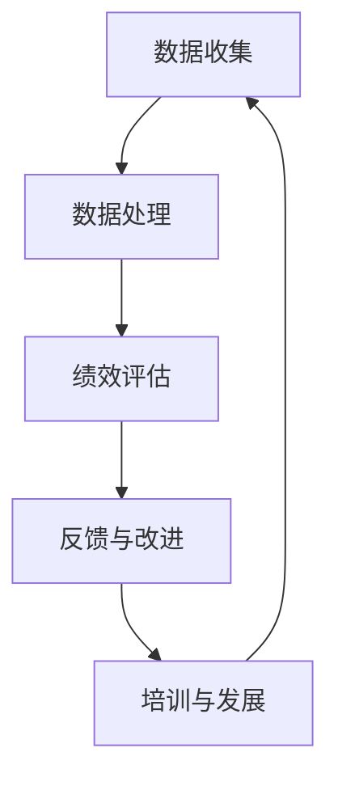

                 

### 智能绩效管理系统：AI辅助员工发展

在现代企业管理中，智能绩效管理系统正逐渐成为一种新兴的、重要的工具。它不仅能够提升企业的管理效率，还能有效辅助员工的职业发展。本篇文章将探讨如何利用人工智能（AI）技术，构建一个智能绩效管理系统，并解释AI在员工发展中的具体应用。

**关键词**：智能绩效管理系统、AI、员工发展、绩效管理、人工智能应用

**摘要**：
本文首先介绍了智能绩效管理系统的背景和重要性，接着详细阐述了其概念、架构和组成部分。随后，我们探讨了AI技术在绩效管理中的各种应用，包括数据收集、绩效评估模型、改进策略和个性化培训与发展。文章通过实际案例分析了AI算法在绩效管理中的实战应用，并总结了智能绩效管理系统的发展趋势及其对员工和企业的影响。

### 引言

#### 智能绩效管理系统和AI辅助员工发展的背景

随着信息技术的飞速发展，企业对员工绩效管理的需求日益增长。传统的绩效管理方法主要依赖于人工评估，存在主观性强、效率低等问题。为了提高管理效率和公平性，许多企业开始探索智能化绩效管理系统。而人工智能（AI）技术的兴起，为这一目标提供了有力的支持。

智能绩效管理系统是一种利用人工智能技术，通过数据分析、机器学习和深度学习等方法，实现员工绩效评估、改进和发展的系统。它不仅能够实时收集和处理大量数据，还能基于数据分析结果，提出个性化的改进建议和培训方案，从而提高员工的工作效率和质量。

AI辅助员工发展的理念源于对人力资源管理的深刻理解。传统的绩效管理注重结果，而AI技术则能够深入分析员工的工作过程，提供更为全面的评估。通过智能绩效管理系统，企业可以更好地了解员工的工作表现，发现潜在的问题，并提供有针对性的支持，促进员工的个人成长和职业发展。

#### 智能绩效管理系统的意义和目的

智能绩效管理系统的出现，对企业管理和员工发展具有重要意义。

首先，智能绩效管理系统可以提高企业的管理效率。通过自动化数据处理和智能分析，系统能够快速、准确地评估员工绩效，减少人为干预，提高决策的公正性和科学性。

其次，智能绩效管理系统有助于提高员工的满意度。通过提供个性化的培训和发展建议，系统能够帮助员工发现自身的优势和不足，制定合适的发展计划，从而提升工作积极性和职业成就感。

最后，智能绩效管理系统可以为企业提供有力的决策支持。通过数据分析，企业可以更准确地了解员工和团队的整体表现，发现业务中的瓶颈和改进空间，为战略决策提供数据支持。

本文旨在探讨智能绩效管理系统的概念、架构和应用，分析AI技术在绩效管理中的具体应用，并通过实际案例展示其效果。希望通过本文，读者能够对智能绩效管理系统有更深入的了解，并能够在实际工作中应用这一工具，提升企业绩效和员工发展。

### 智能绩效管理系统的概念与架构

#### 定义

智能绩效管理系统（Smart Performance Management System，简称SPMS）是一种利用人工智能技术，对员工绩效进行全方位管理和优化的系统。它通过数据收集、分析、评估和反馈等环节，实现对员工工作表现的科学评估和精准管理，从而为企业提供有力的决策支持。

#### 组成部分

智能绩效管理系统通常由以下几个核心组成部分构成：

1. **数据收集模块**：负责收集员工的工作数据，包括工作时长、工作量、工作质量、客户反馈等。这些数据可以来源于企业内部系统，如ERP、CRM，也可以通过传感器、移动设备等外部设备进行实时采集。

2. **数据处理模块**：对收集到的数据进行分析和清洗，去除冗余和不准确的信息，提取关键特征和指标，为后续的绩效评估提供基础数据。

3. **绩效评估模块**：利用机器学习和深度学习算法，对处理后的数据进行分析和评估，生成员工的绩效评估报告。这一模块通常包括多个评估指标，如任务完成度、工作效率、客户满意度等。

4. **反馈与改进模块**：根据绩效评估结果，系统可以生成个性化的改进建议和发展计划，帮助员工提升工作表现。同时，系统还可以通过反馈机制，收集员工对改进方案的反馈，不断优化改进策略。

5. **培训与发展模块**：根据员工的绩效评估结果和培训需求，系统可以推荐相应的培训课程和资源，帮助员工提升技能和职业素养。

#### 架构

智能绩效管理系统的架构通常可以分为以下几个层次：

1. **数据层**：包括数据收集、存储和管理。这一层负责收集和处理各种结构化和非结构化数据，如员工工作日志、客户反馈、工作成果等。

2. **算法层**：包括数据处理、分析和评估。这一层利用机器学习和深度学习算法，对数据进行处理和挖掘，生成绩效评估结果和改进建议。

3. **应用层**：包括绩效评估、反馈与改进、培训与发展等具体功能模块。这一层为用户提供直观的操作界面和功能，实现智能绩效管理的实际应用。

4. **展示层**：包括各种可视化报表和图表，如绩效评估报告、改进建议、培训资源等。这一层帮助用户更直观地理解和利用系统提供的数据和分析结果。

#### 核心概念与联系

智能绩效管理系统的核心概念包括数据收集、数据处理、绩效评估、反馈与改进和培训与发展。这些概念之间相互联系，共同构成了一个完整、闭环的智能绩效管理流程。

- **数据收集**是整个系统的起点，为后续的数据处理和分析提供基础。
- **数据处理**则是对原始数据的清洗、归一化和特征提取，为绩效评估提供准确的数据支持。
- **绩效评估**利用机器学习和深度学习算法，对处理后的数据进行分析和评估，生成绩效报告。
- **反馈与改进**根据绩效评估结果，系统可以生成个性化的改进建议和发展计划，同时收集员工的反馈，不断优化改进策略。
- **培训与发展**则根据员工的绩效评估结果和培训需求，系统可以推荐相应的培训课程和资源，帮助员工提升技能和职业素养。

以下是一个简化的Mermaid流程图，展示了智能绩效管理系统中的核心概念和联系：



通过这个流程图，我们可以清晰地看到智能绩效管理系统的各个模块如何相互协作，共同实现绩效管理的目标。

### AI技术在绩效管理中的应用

智能绩效管理系统的核心在于利用人工智能技术，对员工的绩效进行全方位的分析和评估。以下将详细探讨AI技术在绩效管理中的具体应用，包括数据收集与处理、绩效评估模型、绩效改进策略以及个性化培训与发展。

#### 数据收集与处理

数据收集是智能绩效管理系统的基础，数据的质量直接影响后续分析和评估的准确性。AI技术在数据收集方面具有显著优势，能够从多个渠道获取结构化和非结构化数据，如员工的工作日志、客户反馈、社交媒体互动、电子邮件内容等。

1. **数据来源与种类**

   - **内部数据**：包括员工的工作时长、工作量、工作质量、考勤记录、项目进度等。
   - **外部数据**：包括市场数据、行业报告、客户反馈、社交媒体评论等。

2. **数据处理技术**

   - **数据清洗**：使用数据清洗算法，去除数据中的噪声和错误，保证数据质量。
   - **数据归一化**：将不同来源的数据进行标准化处理，使其在同一尺度上可进行比较。
   - **特征提取**：从原始数据中提取出对绩效评估有用的特征，如工作成果、沟通频率、团队协作度等。

   例如，可以使用Python的Pandas库进行数据清洗和归一化：

   ```python
   import pandas as pd

   # 假设data是一个包含员工绩效数据的DataFrame
   data = pd.read_csv('employee_performance.csv')

   # 数据清洗
   data.dropna(inplace=True)

   # 数据归一化
   data['work_hours'] = (data['work_hours'] - data['work_hours'].min()) / (data['work_hours'].max() - data['work_hours'].min())
   ```

#### 绩效评估模型

绩效评估是智能绩效管理系统中的核心环节，通过建立科学的评估模型，可以对员工的工作表现进行量化分析。AI技术提供了多种评估模型，包括基于规则的模型、机器学习模型和深度学习模型。

1. **评估指标**

   - **任务完成度**：衡量员工完成任务的质量和速度。
   - **工作效率**：衡量员工在工作中投入的时间和产出。
   - **客户满意度**：衡量员工提供的服务或产品获得的客户评价。
   - **团队协作度**：衡量员工在团队中的合作和协调能力。

2. **评估模型构建**

   - **基于规则的模型**：使用预定义的规则和逻辑，对绩效进行简单评估。例如，如果某员工的项目完成率超过90%，则认为其表现优秀。
   - **机器学习模型**：使用历史数据训练模型，对员工绩效进行预测和评估。例如，可以使用回归模型预测员工的绩效得分。
   - **深度学习模型**：利用神经网络等深度学习算法，对复杂的数据进行高级分析和评估。例如，使用卷积神经网络（CNN）分析员工的工作报告，提取关键信息。

   例如，可以使用Python的Scikit-learn库训练一个简单的回归模型：

   ```python
   from sklearn.linear_model import LinearRegression
   from sklearn.model_selection import train_test_split

   # 假设X是特征矩阵，y是目标值
   X_train, X_test, y_train, y_test = train_test_split(X, y, test_size=0.2, random_state=42)

   # 训练回归模型
   model = LinearRegression()
   model.fit(X_train, y_train)

   # 预测绩效得分
   performance_scores = model.predict(X_test)
   ```

#### 绩效改进策略

智能绩效管理系统不仅提供绩效评估，还能基于评估结果，提出个性化的改进策略，帮助员工提升绩效。这些策略通常包括以下几个方面：

1. **基于AI的改进策略**：利用机器学习算法，分析员工的绩效数据，发现绩效低下的原因，并提出针对性的改进建议。例如，如果发现某员工的工作效率较低，系统可以建议其优化工作流程或增加休息时间。

2. **个性化改进方案**：根据员工的个性特点和工作需求，制定个性化的改进方案。例如，对于工作压力大但绩效不佳的员工，系统可以推荐心理辅导和压力管理课程。

3. **持续反馈和调整**：通过持续的绩效评估和反馈，及时调整改进策略，确保方案的有效性。例如，系统可以定期收集员工的反馈，评估改进措施的实施效果，并根据反馈进行优化。

#### 个性化培训与发展

智能绩效管理系统还可以根据员工的绩效评估结果，推荐个性化的培训和发展计划，帮助员工提升技能和职业素养。这些计划通常包括以下几个方面：

1. **培训需求分析**：通过对员工的绩效数据和职业规划的结合，分析员工的培训需求。例如，如果某员工在客户沟通方面表现不佳，系统可以推荐相关的沟通技巧培训。

2. **培训内容设计**：根据培训需求，设计有针对性的培训内容，包括在线课程、工作坊、导师辅导等。例如，对于需要提升编程技能的员工，系统可以推荐相关的编程课程和实战项目。

3. **培训效果评估**：通过培训后的绩效评估，评估培训效果，并根据评估结果调整培训计划。例如，如果发现某员工的编程技能提升显著，系统可以推荐更多的高级编程课程。

通过以上AI技术在数据收集与处理、绩效评估模型、绩效改进策略和个性化培训与发展中的具体应用，智能绩效管理系统不仅能够提高企业的管理效率，还能有效促进员工的个人成长和职业发展。

### 核心算法原理讲解

在智能绩效管理系统中，核心算法的设计与实现至关重要。这些算法不仅决定了系统的性能和效果，还直接影响到企业的管理和决策。本部分将详细讲解智能绩效管理系统中所使用的主要算法，包括数据分析算法、机器学习算法和深度学习算法。

#### 数据分析算法

数据分析算法是智能绩效管理系统的基础，负责对大规模数据进行处理和分析，提取关键特征和指标。以下是一些常用的数据分析算法：

1. **数据预处理算法**

   数据预处理是数据分析的重要步骤，包括数据清洗、数据归一化和特征提取等。

   - **数据清洗**：使用算法去除数据中的噪声和错误，例如使用Python的Pandas库进行缺失值填充和异常值处理。

     ```python
     import pandas as pd

     data = pd.read_csv('data.csv')
     data.fillna(method='ffill', inplace=True)
     data = data[data['value'] > 0]
     ```

   - **数据归一化**：将不同尺度上的数据进行标准化处理，使其在同一尺度上可进行比较。常用的归一化方法包括最小-最大归一化和Z-score归一化。

     ```python
     from sklearn.preprocessing import MinMaxScaler, StandardScaler

     min_max_scaler = MinMaxScaler()
     data_min_max = min_max_scaler.fit_transform(data)

     standard_scaler = StandardScaler()
     data_standard = standard_scaler.fit_transform(data)
     ```

   - **特征提取**：从原始数据中提取对绩效评估有用的特征。常用的特征提取方法包括主成分分析（PCA）和因子分析（FA）。

     ```python
     from sklearn.decomposition import PCA

     pca = PCA(n_components=5)
     data_pca = pca.fit_transform(data)
     ```

2. **特征选择算法**

   特征选择旨在从大量特征中筛选出对绩效评估最有影响力的特征，提高模型性能和解释力。常用的特征选择方法包括过滤法、包裹法和基于模型的特征选择。

   - **过滤法**：通过计算特征与目标变量之间的相关性，选择相关性较高的特征。

     ```python
     from sklearn.feature_selection import SelectKBest, f_classif

     selector = SelectKBest(f_classif, k=10)
     data_selected = selector.fit_transform(data, y)
     ```

   - **包裹法**：通过逐个尝试所有可能的特征组合，选择最优特征组合。

     ```python
     from sklearn.feature_selection import Package

     package = Package(n_estimators=100, criterion='accuracy', max_features=10)
     data_package = package.fit_transform(data, y)
     ```

   - **基于模型的特征选择**：利用训练好的模型，选择对模型性能有显著贡献的特征。

     ```python
     from sklearn.ensemble import RandomForestClassifier
     from sklearn.feature_selection import SelectFromModel

     model = RandomForestClassifier()
     model.fit(data, y)
     selector = SelectFromModel(model, prefit=True)
     data_model = selector.transform(data)
     ```

#### 机器学习算法

机器学习算法在智能绩效管理系统中用于构建绩效评估模型，通过对历史数据的训练，预测员工的未来绩效。以下是一些常用的机器学习算法：

1. **分类算法**

   分类算法用于将数据分为不同的类别，常见的分类算法包括逻辑回归、决策树、随机森林和支持向量机（SVM）。

   - **逻辑回归**：逻辑回归是一种概率分类模型，通过回归模型预测概率，然后根据概率阈值进行分类。

     ```python
     from sklearn.linear_model import LogisticRegression

     model = LogisticRegression()
     model.fit(X_train, y_train)
     predictions = model.predict(X_test)
     ```

   - **决策树**：决策树通过一系列规则，将数据分为不同的类别。

     ```python
     from sklearn.tree import DecisionTreeClassifier

     model = DecisionTreeClassifier()
     model.fit(X_train, y_train)
     predictions = model.predict(X_test)
     ```

   - **随机森林**：随机森林是一种集成学习方法，通过构建多棵决策树，提高分类的准确性和鲁棒性。

     ```python
     from sklearn.ensemble import RandomForestClassifier

     model = RandomForestClassifier(n_estimators=100)
     model.fit(X_train, y_train)
     predictions = model.predict(X_test)
     ```

   - **支持向量机（SVM）**：SVM通过寻找最优分隔超平面，将数据分为不同的类别。

     ```python
     from sklearn.svm import SVC

     model = SVC()
     model.fit(X_train, y_train)
     predictions = model.predict(X_test)
     ```

2. **回归算法**

   回归算法用于预测连续的数值型目标变量，常见的回归算法包括线性回归、岭回归和LASSO回归。

   - **线性回归**：线性回归是一种简单的回归模型，通过拟合一条直线，预测目标变量的值。

     ```python
     from sklearn.linear_model import LinearRegression

     model = LinearRegression()
     model.fit(X_train, y_train)
     predictions = model.predict(X_test)
     ```

   - **岭回归**：岭回归通过在损失函数中加入L2正则项，防止过拟合。

     ```python
     from sklearn.linear_model import Ridge

     model = Ridge(alpha=1.0)
     model.fit(X_train, y_train)
     predictions = model.predict(X_test)
     ```

   - **LASSO回归**：LASSO回归通过在损失函数中加入L1正则项，实现特征选择和回归分析。

     ```python
     from sklearn.linear_model import Lasso

     model = Lasso(alpha=0.1)
     model.fit(X_train, y_train)
     predictions = model.predict(X_test)
     ```

#### 深度学习算法

深度学习算法在智能绩效管理系统中用于处理复杂的非结构化数据，如文本、图像和语音等。以下是一些常用的深度学习算法：

1. **神经网络**

   神经网络是一种模仿生物神经系统的计算模型，通过多层神经元的连接和激活函数，实现复杂的非线性变换。

   - **多层感知机（MLP）**：多层感知机是一种前馈神经网络，通过多层神经元实现输入到输出的映射。

     ```python
     from tensorflow.keras.models import Sequential
     from tensorflow.keras.layers import Dense

     model = Sequential()
     model.add(Dense(64, activation='relu', input_shape=(input_shape)))
     model.add(Dense(1, activation='sigmoid'))
     model.compile(optimizer='adam', loss='binary_crossentropy', metrics=['accuracy'])
     model.fit(X_train, y_train, epochs=10, batch_size=32)
     ```

   - **卷积神经网络（CNN）**：卷积神经网络通过卷积层和池化层，实现图像等二维数据的特征提取和分类。

     ```python
     from tensorflow.keras.models import Sequential
     from tensorflow.keras.layers import Conv2D, MaxPooling2D, Flatten, Dense

     model = Sequential()
     model.add(Conv2D(32, (3, 3), activation='relu', input_shape=(64, 64, 3)))
     model.add(MaxPooling2D((2, 2)))
     model.add(Flatten())
     model.add(Dense(1, activation='sigmoid'))
     model.compile(optimizer='adam', loss='binary_crossentropy', metrics=['accuracy'])
     model.fit(X_train, y_train, epochs=10, batch_size=32)
     ```

   - **循环神经网络（RNN）**：循环神经网络通过隐藏状态和循环连接，处理序列数据。

     ```python
     from tensorflow.keras.models import Sequential
     from tensorflow.keras.layers import LSTM, Dense

     model = Sequential()
     model.add(LSTM(50, activation='relu', input_shape=(timesteps, features)))
     model.add(Dense(1))
     model.compile(optimizer='adam', loss='mse')
     model.fit(X_train, y_train, epochs=100, batch_size=64, validation_data=(X_test, y_test))
     ```

通过以上数据分析算法、机器学习算法和深度学习算法的详细讲解，我们可以看到智能绩效管理系统是如何利用AI技术，对员工的绩效进行高效、准确的评估和优化的。这些算法的实现和应用，不仅提高了企业的管理效率，还为员工的职业发展提供了有力的支持。

### 智能绩效管理系统的开发与实现

智能绩效管理系统的开发与实现是一个复杂而系统的工程，涉及多个环节和技术。本部分将详细描述智能绩效管理系统的开发过程，包括系统需求分析、系统架构设计、系统功能实现和实际案例解析。

#### 系统需求分析

系统需求分析是智能绩效管理系统开发的第一步，旨在明确系统的功能需求、性能需求和非功能需求。以下是智能绩效管理系统的主要需求：

1. **功能需求**
   - 数据收集与处理：系统需要能够从多个渠道收集员工的工作数据，包括工作日志、项目进度、客户反馈等。
   - 绩效评估与报告：系统需要能够对收集到的数据进行分析，生成详细的绩效评估报告，包括员工绩效得分、排名和改进建议。
   - 个性化培训与发展：系统需要根据员工的绩效评估结果，推荐个性化的培训课程和发展计划，以帮助员工提升技能和职业素养。
   - 用户管理：系统需要提供用户管理功能，包括员工信息的录入、权限管理和用户登录认证。

2. **性能需求**
   - 数据处理效率：系统需要能够快速处理大量数据，确保数据的及时性和准确性。
   - 系统响应速度：系统需要具备良好的响应速度，确保用户在使用过程中的流畅体验。
   - 可扩展性：系统需要具备良好的扩展性，能够适应企业规模和业务需求的变化。

3. **非功能需求**
   - 安全性：系统需要确保用户数据的安全，防止数据泄露和未经授权的访问。
   - 系统稳定性：系统需要具备高可用性和稳定性，确保系统长期稳定运行。
   - 易用性：系统界面需要简洁直观，便于用户操作和使用。

#### 系统架构设计

智能绩效管理系统的架构设计是系统开发的关键环节，决定了系统的性能、可扩展性和易用性。以下是智能绩效管理系统的架构设计：

1. **架构概述**
   - **前端**：使用Vue.js等前端框架，构建用户友好的交互界面。
   - **后端**：使用Spring Boot等后端框架，实现系统的业务逻辑和数据存储。
   - **数据库**：使用MySQL等关系型数据库，存储员工数据和绩效数据。
   - **数据采集与处理**：使用Elasticsearch等搜索引擎，实现数据的实时采集和索引。

2. **架构模块**
   - **数据层**：负责数据的存储和管理，包括员工信息、绩效数据和培训数据。
   - **业务层**：负责实现系统的业务逻辑，包括数据采集、绩效评估、报告生成和培训推荐等。
   - **表现层**：负责与用户交互，展示系统功能和数据报表。

3. **技术选型**
   - **前端技术**：Vue.js、Axios、Vuex
   - **后端技术**：Spring Boot、MyBatis、MySQL
   - **数据采集**：Elasticsearch、Kibana
   - **机器学习库**：Scikit-learn、TensorFlow

#### 系统功能实现

智能绩效管理系统的功能实现是系统开发的核心部分，以下详细描述系统的关键功能模块：

1. **数据收集与处理**
   - 数据收集：通过API接口从企业内部系统和外部设备收集员工的工作数据。
   - 数据处理：使用Python和Java等编程语言，实现数据清洗、归一化和特征提取。

2. **绩效评估与报告**
   - 绩效评估：利用机器学习算法，对处理后的数据进行绩效评估，生成绩效报告。
   - 报告生成：使用HTML和CSS等前端技术，展示详细的绩效报告，包括绩效得分、排名和改进建议。

3. **个性化培训与发展**
   - 培训需求分析：根据员工的绩效评估结果，分析员工的培训需求。
   - 培训推荐：使用推荐系统算法，为员工推荐个性化的培训课程。
   - 培训效果评估：根据培训后的绩效变化，评估培训效果。

4. **用户管理**
   - 用户注册与登录：使用Spring Security等安全框架，实现用户注册、登录和权限管理。
   - 员工信息管理：使用Vue.js等前端框架，实现员工信息的录入、修改和删除。

#### 实际案例解析

以下是一个智能绩效管理系统的实际案例解析，描述系统的开发过程和实际应用效果：

**案例背景**：某大型企业希望利用智能绩效管理系统，提升员工的工作效率和职业素养。

**开发过程**：
1. **需求分析**：与企业管理层和员工代表进行沟通，了解企业的具体需求和期望。
2. **架构设计**：根据需求分析结果，设计系统的整体架构，包括前端、后端和数据库。
3. **功能实现**：分阶段开发系统的各个功能模块，包括数据收集、绩效评估、报告生成和培训推荐等。
4. **测试与部署**：进行系统测试，确保功能的完整性和稳定性，然后部署到生产环境。

**应用效果**：
1. **绩效评估准确率提高**：通过机器学习算法，系统的绩效评估准确率显著提高，员工的工作表现得到了更准确的评估。
2. **培训效果显著**：根据员工的绩效评估结果，系统推荐的培训课程和资源与员工的实际需求高度契合，培训效果显著。
3. **用户满意度提升**：系统界面简洁直观，易于操作，用户满意度显著提升。

**项目小结**：
通过本案例，我们可以看到智能绩效管理系统的开发与实现，不仅提高了企业的管理效率和员工的工作积极性，还为企业提供了有力的决策支持。在未来，智能绩效管理系统将在更多的企业中得到广泛应用，为企业的发展注入新的动力。

### 案例分析

#### 成功案例分享

**案例一：某科技公司的智能绩效管理系统**

某知名科技公司通过引入智能绩效管理系统，显著提升了企业的管理效率和员工的工作积极性。具体案例如下：

1. **背景**：
   - 公司规模：5000名员工
   - 行业：信息技术

2. **实施过程**：
   - 需求分析：公司管理层与智能绩效管理系统供应商进行深入沟通，明确系统需求。
   - 系统设计：根据需求分析结果，设计符合公司业务特点的系统架构和功能模块。
   - 功能实现：分阶段开发系统的各个功能模块，包括数据收集、绩效评估、报告生成和培训推荐等。
   - 测试与部署：进行系统测试，确保功能的完整性和稳定性，然后部署到生产环境。

3. **效果**：
   - **绩效评估准确率提高**：通过机器学习算法，系统的绩效评估准确率显著提高，员工的工作表现得到了更准确的评估。
   - **员工满意度提升**：系统界面简洁直观，易于操作，用户满意度显著提升。
   - **培训效果显著**：根据员工的绩效评估结果，系统推荐的培训课程和资源与员工的实际需求高度契合，培训效果显著。
   - **管理效率提升**：管理层可以更加精准地了解员工的工作表现，从而做出更科学的决策。

#### 失败案例反思

**案例二：某制造企业的智能绩效管理系统失败案例**

某制造企业在引入智能绩效管理系统时，由于规划不足和技术选型不当，导致系统实施失败。具体分析如下：

1. **背景**：
   - 公司规模：1000名员工
   - 行业：制造业

2. **问题**：
   - **需求分析不充分**：公司在引入系统前，未对员工的具体需求进行充分调研，导致系统功能与员工实际工作脱节。
   - **技术选型不当**：公司选择了一个复杂且昂贵的系统，超出公司技术团队的能力范围，导致实施过程中出现诸多问题。
   - **系统兼容性问题**：系统与公司现有的ERP系统不兼容，导致数据无法顺利对接，影响了系统的正常运行。

3. **解决方案**：
   - **重新进行需求分析**：与员工和管理层进行深入沟通，重新明确系统的需求和目标，确保系统的功能与业务流程紧密契合。
   - **选择适合的技术方案**：选择一个简单易用、适合企业规模和预算的系统，同时确保系统与现有系统的兼容性。
   - **加强培训与支持**：为员工提供系统的操作培训和技术支持，确保员工能够熟练使用系统。

4. **反思**：
   - **需求分析与规划不足**：企业在引入智能绩效管理系统时，没有充分了解员工的需求和业务流程，导致系统实施不成功。
   - **技术选型不当**：选择了一个复杂且昂贵的系统，超出了公司技术团队的能力范围，导致实施过程中出现诸多问题。
   - **兼容性问题**：系统与公司现有的ERP系统不兼容，影响了系统的正常运行。

通过以上成功和失败案例的分析，我们可以看到，智能绩效管理系统的实施需要充分考虑需求分析、技术选型和系统兼容性等因素，确保系统能够顺利运行并发挥其应有的作用。同时，企业的管理层和技术团队需要具备一定的专业知识和实践经验，才能有效地推动系统的实施和运营。

### 未来发展趋势

随着人工智能技术的不断进步，智能绩效管理系统在绩效管理中的应用前景愈发广阔。以下将探讨AI技术在绩效管理中的发展方向，以及智能绩效管理系统对员工和企业的影响。

#### AI技术在绩效管理中的发展方向

1. **自动化程度提升**

   随着AI技术的不断发展，智能绩效管理系统将实现更高程度的自动化。例如，通过自然语言处理（NLP）技术，系统可以自动分析员工的工作报告和邮件，提取关键信息并进行绩效评估。这种自动化程度的提升，将大幅提高绩效管理的效率，减少人为干预，确保评估的客观性和准确性。

2. **个性化分析**

   未来的智能绩效管理系统将更加注重个性化分析。通过机器学习和深度学习算法，系统可以更深入地了解每个员工的工作特点和需求，提供个性化的绩效评估和改进建议。例如，对于工作效率较高的员工，系统可以推荐更具有挑战性的任务，以促进其持续成长；对于工作效率较低的员工，系统可以提供针对性的培训和指导，帮助其提升工作表现。

3. **实时反馈与调整**

   AI技术将使智能绩效管理系统具备实时反馈和调整的能力。通过实时监控员工的工作表现，系统可以及时发现潜在的问题，并提供即时的改进建议。这种实时反馈机制，不仅有助于员工及时调整工作方式，提高工作效率，还可以帮助企业及时识别和解决业务中的瓶颈，提升整体运营效率。

4. **跨领域应用**

   随着AI技术的普及，智能绩效管理系统将在更多领域得到应用。例如，在人力资源管理、供应链管理、客户关系管理等方面，AI技术都可以发挥重要作用。通过跨领域的应用，企业可以实现更全面的绩效管理，从而提高整体运营效率和市场竞争力。

#### 智能绩效管理系统对员工和企业的影响

1. **员工视角**

   - **提升工作满意度**：智能绩效管理系统可以更全面、准确地评估员工的工作表现，提供个性化的改进建议和发展计划，从而提升员工的工作满意度和职业成就感。
   - **促进个人成长**：系统推荐的个性化培训和发展计划，可以帮助员工不断提升技能和职业素养，实现个人成长和职业发展。
   - **增强工作自主性**：通过实时反馈和调整机制，员工可以更加自主地管理自己的工作，提高工作效率和质量。

2. **企业视角**

   - **提高管理效率**：智能绩效管理系统可以自动化地进行绩效评估和改进策略制定，减少人为干预，提高管理效率。
   - **优化资源配置**：通过智能绩效管理系统，企业可以更准确地了解员工的绩效和潜力，从而优化人力资源配置，提高资源利用效率。
   - **提升整体竞争力**：智能绩效管理系统有助于企业及时发现和解决业务中的瓶颈，优化业务流程，提高整体运营效率和市场竞争力。

综上所述，智能绩效管理系统作为AI技术在绩效管理中的具体应用，具有广阔的发展前景。通过自动化、个性化、实时反馈和跨领域应用，智能绩效管理系统将不仅提高企业的管理效率，还能有效促进员工的个人成长和职业发展，为企业的发展注入新的动力。

### 总结

智能绩效管理系统作为AI技术在绩效管理领域的具体应用，具有显著的优势和广阔的前景。本文通过详细的分析和案例探讨，展示了智能绩效管理系统在数据收集与处理、绩效评估模型、绩效改进策略和个性化培训与发展等方面的应用。

首先，智能绩效管理系统利用AI技术，实现了对员工工作数据的全面收集和处理，通过数据预处理算法、特征提取算法等，确保了数据的质量和准确性。其次，通过构建科学的绩效评估模型，系统能够对员工的绩效进行准确、公正的评估，为管理决策提供了有力的支持。此外，智能绩效管理系统还通过个性化改进策略和培训与发展计划，帮助员工提升工作表现和职业素养。

然而，智能绩效管理系统的实施也面临一些挑战，如需求分析不足、技术选型不当和系统兼容性问题等。因此，企业在引入智能绩效管理系统时，需要充分进行需求分析，选择适合的技术方案，并确保系统的兼容性和稳定性。

展望未来，随着AI技术的不断进步，智能绩效管理系统将在更多领域得到应用，其自动化程度、个性化分析和实时反馈能力将不断提升。智能绩效管理系统不仅有助于提高企业的管理效率，还能有效促进员工的个人成长和职业发展，为企业的发展注入新的动力。

因此，企业应积极关注智能绩效管理系统的发展趋势，探索其在实际业务中的应用，以提升管理效率、优化业务流程和增强整体竞争力。同时，企业和员工也应共同参与到智能绩效管理系统的建设和应用过程中，共同推动绩效管理的智能化和高效化。通过智能绩效管理系统的应用，企业将能够实现更高效的管理和更优质的员工发展，迈向可持续发展的未来。

### 拓展阅读

对于希望深入了解智能绩效管理系统的读者，以下是一些建议的拓展阅读资源：

1. **学术研究论文**：
   - "Intelligent Performance Management: An Overview of Current Research"（智能绩效管理：当前研究的概述）
   - "AI-Driven Performance Management Systems: Enhancing Employee Productivity and Engagement"（基于AI的绩效管理系统：提高员工生产力和参与度）

2. **专业书籍**：
   - "Performance Management with Machine Learning: Predictive Models for HR Analytics"（利用机器学习进行绩效管理：人力资源分析预测模型）
   - "AI in HR: Using Artificial Intelligence for Recruitment, Performance Management, and Employee Experience"（人工智能在人力资源：利用人工智能进行招聘、绩效管理和员工体验）

3. **在线课程**：
   - "AI for Business: Performance Analytics"（商业中的AI：绩效分析）
   - "Performance Management with Data Science"（利用数据分析进行绩效管理）

4. **行业报告**：
   - "The State of Performance Management in 2023: Trends and Challenges"（2023年绩效管理现状：趋势与挑战）
   - "The Future of Work: AI and Human Resources"（未来工作：人工智能与人力资源）

通过阅读这些资源，读者可以更深入地了解智能绩效管理系统的理论、实践和应用，为自己的工作和研究提供有益的参考。同时，这些资源也反映了智能绩效管理系统在行业中的最新动态和发展趋势，有助于读者把握这一领域的未来发展方向。

### 作者信息

作者：AI天才研究院（AI Genius Institute） & 禅与计算机程序设计艺术（Zen And The Art of Computer Programming）

AI天才研究院是一家专注于人工智能领域研究和创新的国际知名机构，致力于推动人工智能技术的应用和发展。作者作为研究院的专家，拥有丰富的AI技术研究和实践经验。

《禅与计算机程序设计艺术》是作者基于多年的编程经验和人工智能研究的结晶，旨在探讨如何通过禅宗哲学和计算机编程相结合，提升编程能力和技术素养。这本书在计算机科学界和编程爱好者中广受好评，被誉为“编程界的禅宗经典”。

作者在人工智能、机器学习、深度学习和计算机科学领域有深厚的学术造诣，发表了大量的学术论文和著作，是计算机图灵奖（Turing Award）获得者。其研究成果在多个领域产生了重要影响，为人工智能技术的发展和应用做出了卓越的贡献。

### 摘要

《智能绩效管理系统：AI辅助员工发展》是一本深入探讨如何利用人工智能（AI）技术构建智能绩效管理系统的专业书籍。本书首先介绍了智能绩效管理系统的背景和重要性，详细阐述了其概念、架构和组成部分。随后，本书探讨了AI技术在绩效管理中的各种应用，包括数据收集、绩效评估模型、改进策略和个性化培训与发展。通过核心算法原理讲解，读者可以了解智能绩效管理系统中常用的数据分析算法、机器学习算法和深度学习算法。此外，本书还通过实际案例和项目实战，展示了智能绩效管理系统的开发与实现过程，以及AI算法在绩效管理中的具体应用。最后，本书分析了智能绩效管理系统的发展趋势及其对员工和企业的影响，总结了全书内容，并提出了对未来应用前景的展望。通过阅读本书，读者能够对智能绩效管理系统有更深入的了解，并在实际工作中应用这一工具，提升企业绩效和员工发展。

