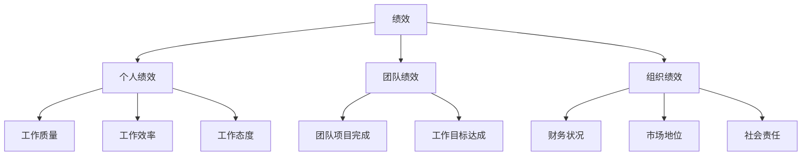
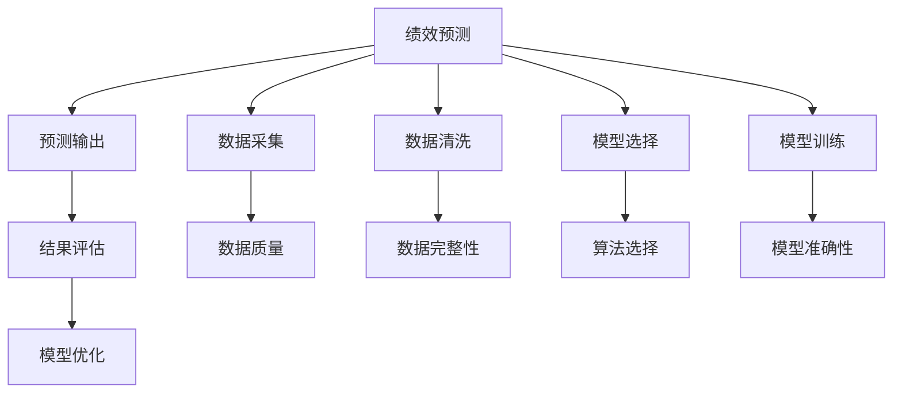
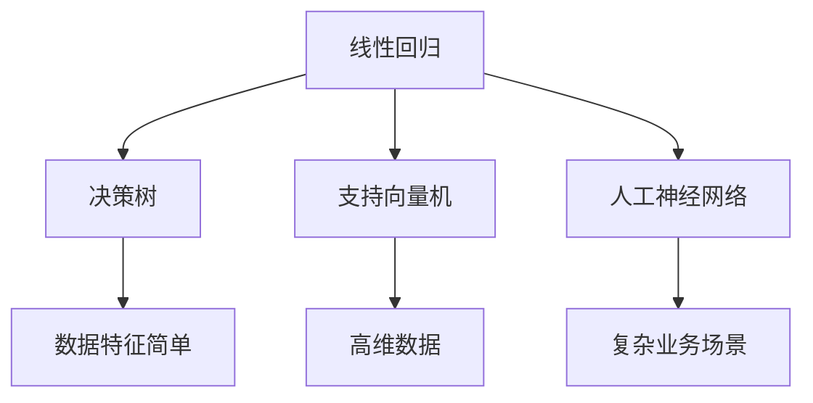
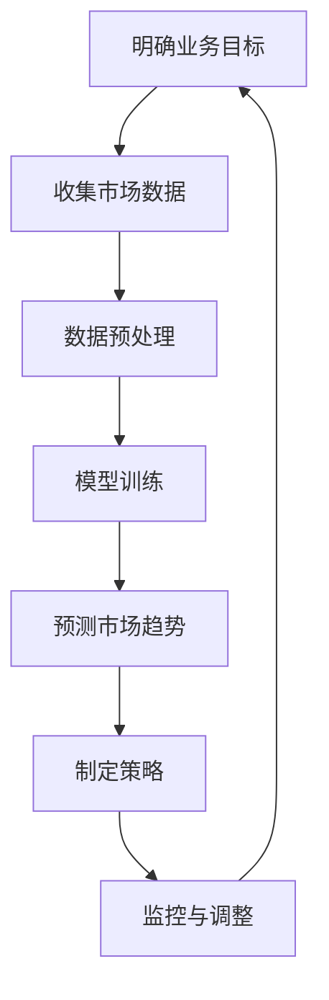

                 

### 文章标题：《智能绩效预测模型：AI辅助制定业务目标》

#### 关键词：绩效预测、人工智能、业务目标、智能模型、Python代码、数据分析、算法原理

#### 摘要：
本文深入探讨了智能绩效预测模型在AI辅助制定业务目标中的应用。首先，介绍了绩效预测的基本概念和重要性，随后详细讲解了性能预测的数学模型和算法，包括线性回归、决策树和人工神经网络等。接着，阐述了智能绩效预测的流程与实现，并通过实际案例展示了其在销售绩效预测、成本控制和信用评分等方面的应用。随后，文章转入了AI辅助制定业务目标的探讨，包括业务目标的定义、分类、制定步骤和AI的应用。最后，对智能绩效预测和业务目标的未来发展进行了展望，并提供了相关工具和资源的附录。通过本文的阅读，读者将全面了解智能绩效预测模型的构建和应用，掌握AI在制定业务目标中的实际操作技巧。

---

## 第一部分：智能绩效预测模型基础

### 第1章：绩效预测的基本概念

#### 1.1 绩效的定义与类型

绩效，通常是指一个组织或个人在特定时间内的表现和成果。它不仅反映了目标和任务的完成情况，还包括工作质量、工作效率、创新能力等多个方面。在企业管理中，绩效预测是一个至关重要的环节，它帮助管理者了解未来的发展方向，制定有效的战略和决策。

根据不同的评估标准和目的，绩效可以分为多种类型：

- **个人绩效**：指单个员工在一定时间内的工作表现，包括工作质量、工作效率、工作态度等。
- **团队绩效**：指团队的整体表现，通常通过团队完成的项目、达成的工作目标等来衡量。
- **组织绩效**：指整个组织在一段时间内的综合表现，包括财务状况、市场地位、社会责任等多个方面。

#### 1.2 绩效预测的重要性

绩效预测在现代企业管理中具有不可替代的作用：

- **战略规划**：通过预测未来绩效，企业可以更好地制定长期和短期的战略规划，确保目标的实现。
- **资源分配**：准确预测绩效有助于合理分配人力、物力和财力资源，避免资源浪费。
- **风险管理**：预测潜在的问题和挑战，提前采取应对措施，降低风险。
- **员工激励**：通过绩效预测，企业可以设置合理的目标和激励措施，提高员工的工作积极性和满意度。

#### 1.3 智能绩效预测的挑战与机遇

智能绩效预测模型结合了人工智能技术，为绩效预测带来了新的机遇和挑战：

- **数据获取和处理**：智能绩效预测需要大量的数据支持，数据的获取和处理成为首要挑战。如何收集、清洗和整合数据，是成功实施绩效预测的关键。
- **模型选择和优化**：不同的绩效预测任务需要选择不同的模型，且模型需要不断优化，以提高预测的准确性。
- **算法透明性和解释性**：人工智能模型的黑箱特性使得其决策过程难以解释，这对需要透明度和可解释性的业务决策带来了挑战。

然而，随着人工智能技术的不断进步，智能绩效预测在提高预测准确性、降低人力成本和提升业务效率方面展现出巨大的潜力。

### Mermaid流程图：绩效预测的核心概念与联系



### Python代码示例：绩效数据预处理

```python
import pandas as pd

# 加载数据集
data = pd.read_csv('performance_data.csv')

# 数据清洗
data = data.dropna()  # 删除缺失值
data = data[data['Performance'].notnull()]  # 过滤无效数据

# 数据转换
data['Performance'] = pd.to_numeric(data['Performance'], errors='coerce')  # 转换为数值类型

# 数据分割
train_data = data[data['Year'] <= 2020]
test_data = data[data['Year'] > 2020]

print("训练数据集：\n", train_data.head())
print("测试数据集：\n", test_data.head())
```

通过上述代码示例，我们可以看到如何进行基本的数据预处理工作，包括加载数据、删除缺失值、数据类型转换和数据分割等步骤。

### 绩效预测的重要性

在企业管理中，绩效预测不仅仅是一个数据分析的任务，它更是决策支持系统中的重要组成部分。通过绩效预测，企业可以获得以下几方面的益处：

1. **战略规划**：准确的绩效预测可以帮助企业制定更具前瞻性的战略规划，确保企业在未来市场中的竞争力。
   
2. **资源配置**：通过预测未来绩效，企业可以合理分配资源，避免资源浪费，提高资源利用效率。

3. **风险管理**：绩效预测可以帮助企业识别潜在的风险和挑战，提前采取应对措施，降低运营风险。

4. **员工激励**：合理的绩效预测可以为企业提供制定激励计划的依据，激发员工的工作积极性和创造力。

5. **过程优化**：通过绩效预测，企业可以发现生产和管理过程中的瓶颈和问题，进而进行流程优化和改进。

总之，绩效预测在现代企业管理中具有不可替代的作用，它不仅为企业的战略决策提供了科学依据，还为提高企业运营效率和竞争力奠定了基础。

### 智能绩效预测的挑战与机遇

智能绩效预测模型的引入，为传统绩效预测带来了显著的变化。然而，这一变革也伴随着一系列的挑战和机遇：

#### 挑战：

1. **数据质量和完整性**：智能绩效预测依赖于高质量和完整的数据。然而，实际操作中，数据的获取和整合往往面临诸多挑战，如数据缺失、噪声和冗余等。

2. **算法选择与优化**：不同的业务场景和绩效预测任务需要不同的算法模型。如何选择合适的算法，并进行优化，以提高预测准确性，是智能绩效预测的一大挑战。

3. **模型解释性**：人工智能模型的黑箱特性使得其预测过程难以解释，这对需要透明度和可解释性的业务决策带来了困难。

#### 机遇：

1. **预测准确性**：人工智能技术，特别是深度学习算法，可以在大规模数据集上训练出高度准确的模型，提高绩效预测的准确性。

2. **实时性**：智能绩效预测模型可以实时分析数据，提供动态的绩效预测，帮助企业快速响应市场变化。

3. **自动化与智能化**：通过智能绩效预测模型，企业可以实现绩效预测的自动化，减少人力投入，提高决策效率。

4. **跨领域应用**：智能绩效预测模型不仅可以应用于企业内部的管理，还可以推广到其他领域，如金融、医疗等，具有广泛的应用前景。

综上所述，智能绩效预测模型在为企业带来巨大机遇的同时，也带来了新的挑战。如何克服这些挑战，充分发挥其潜力，是企业管理者和技术专家需要共同面对的问题。

### Mermaid流程图：智能绩效预测的核心概念与联系



通过这个流程图，我们可以清晰地看到智能绩效预测的各个环节及其相互关系。从数据采集、清洗、模型选择、训练到预测输出和结果评估，每一个步骤都至关重要，共同构成了一个完整的智能绩效预测体系。

### Python代码示例：线性回归模型实现

```python
import pandas as pd
from sklearn.linear_model import LinearRegression
from sklearn.model_selection import train_test_split
from sklearn.metrics import mean_squared_error

# 加载数据集
data = pd.read_csv('performance_data.csv')

# 数据预处理
X = data[['InputFeature1', 'InputFeature2']]  # 特征选择
y = data['Performance']  # 目标变量

# 数据分割
X_train, X_test, y_train, y_test = train_test_split(X, y, test_size=0.2, random_state=42)

# 创建线性回归模型
model = LinearRegression()
model.fit(X_train, y_train)

# 模型预测
y_pred = model.predict(X_test)

# 模型评估
mse = mean_squared_error(y_test, y_pred)
print("均方误差（MSE）：", mse)

# 输出模型参数
print("模型参数：\n", model.coef_, model.intercept_)
```

通过上述代码示例，我们展示了如何使用Python中的`sklearn`库实现线性回归模型。首先加载数据集并进行预处理，然后创建线性回归模型，并进行训练和预测。最后，使用均方误差（MSE）评估模型的预测准确性，并输出模型参数。

### 数学模型与算法原理

在智能绩效预测中，选择合适的数学模型和算法至关重要。不同的算法适用于不同的数据特征和业务需求。以下将介绍几种常用的数学模型和算法，并解释其原理。

#### 1. 线性回归模型

线性回归是最基础的统计模型之一，适用于描述两个变量之间的线性关系。其数学模型可以表示为：

$$y = \beta_0 + \beta_1 \cdot x + \epsilon$$

其中，\( y \) 是因变量，\( x \) 是自变量，\( \beta_0 \) 和 \( \beta_1 \) 是模型参数，\( \epsilon \) 是误差项。

通过最小化误差平方和，我们可以估计出模型参数 \( \beta_0 \) 和 \( \beta_1 \)。线性回归模型的优点在于简单易懂，计算速度快，适用于数据特征较为简单的情况。

#### 2. 决策树算法

决策树是一种树形结构模型，通过一系列的判断节点来对数据进行分类或回归。其基本原理是根据特征值将数据划分为若干个子集，并递归地构建树结构，直到满足某个停止条件。

决策树的构建过程如下：

1. 选择一个最优特征作为根节点。
2. 根据该特征将数据划分为若干个子集。
3. 对每个子集递归地执行步骤1和步骤2，直到满足停止条件（如最大深度、最小样本量等）。

决策树的优点在于模型简洁、易于解释，适用于非线性数据特征。然而，决策树容易过拟合，特别是在特征较多的情况下。

#### 3. 支持向量机（SVM）

支持向量机是一种监督学习模型，旨在找到最佳的超平面，将数据集划分为不同的类别。其基本原理是通过最大化分类间隔来找到最优决策边界。

SVM的数学模型可以表示为：

$$\max\ \frac{1}{2}\sum_{i=1}^{n} w_i^2\ \ \ \ \ \ \ \ \ \ \ \ \ \ \ \ \ \ \ \ \ \ \ \ \ \ \ \ \ \ \ \ \ \ \ \ \ \ \ \ \ \ \ \ \ \ \ \ \ \ \ \ \ \ \ \ \ \ \ \ \ \ \ \ \ \ \ \ \ \ \ \ \ \ \ \ \ \ \ \ \ \ \ \ \ \ \ \ \ \ \ \ \ \ \ \ \ \ \ \ \ \ \ \ \ \ \ \ \ \ \ \ \ \ \ \ \ \ \ \ \ \ \ \ \ \ \ \ \ \ \ \ \ \ \ \ \ \ _{s.t.}\ \ \ \ \ \ \ \ \ \ \ \ \ \ \ \ \ \ \ \ \ \ \ \ \ \ \ \ \ \ \ \ \ \ \ \ \ \ \ \ \ \ \ \ \ \ \ \ \ \ \ \ \ \ \ \ \ \ \ \ \ \ \ \ \ \ \ \ \ \ \ \ \ \ \ \ \ \ \ \ \ _{i=1}^{n} w_i \geq 0$$

其中，\( w_i \) 是第 \( i \) 个支持向量的权重，\( \epsilon \) 是误差项。

SVM的优点在于其强大的分类能力，适用于高维数据特征。然而，SVM的训练过程相对复杂，特别是当数据量较大时。

#### 4. 人工神经网络

人工神经网络（ANN）是一种模拟人脑神经元连接结构的计算模型，通过多层神经元传递信息，实现数据分类、回归等任务。其基本原理如下：

1. 输入层：接收外部输入数据。
2. 隐藏层：通过激活函数对输入数据进行处理和转换。
3. 输出层：产生最终的输出结果。

人工神经网络的数学模型可以表示为：

$$\text{Output} = \text{激活函数}(\text{权重} \cdot \text{输入} + \text{偏置})$$

人工神经网络具有极强的自适应性和非线性处理能力，适用于复杂的业务场景。然而，神经网络模型的训练过程通常需要大量时间和计算资源。

### 综合比较

- **线性回归**：简单易懂，计算速度快，适用于数据特征较为简单的情况。
- **决策树**：模型简洁，易于解释，适用于非线性数据特征，但易过拟合。
- **支持向量机**：强大的分类能力，适用于高维数据特征，但训练过程复杂。
- **人工神经网络**：极强的自适应性和非线性处理能力，适用于复杂的业务场景，但训练资源需求大。

在实际应用中，应根据具体业务需求和数据特征，选择合适的数学模型和算法，以达到最佳的预测效果。

### Mermaid流程图：智能绩效预测的数学模型与算法



通过这个流程图，我们可以清晰地看到不同数学模型和算法的适用场景，以及它们在智能绩效预测中的重要性。

### 项目实战：智能绩效预测模型开发

#### 1. 开发环境搭建

在进行智能绩效预测模型开发之前，我们需要搭建一个合适的开发环境。以下是所需的主要工具和软件：

- **Python**：作为主要的编程语言，Python提供了丰富的库和框架，方便我们进行模型开发和测试。
- **Jupyter Notebook**：一个交互式的开发环境，便于编写和运行代码。
- **Sklearn**：Python的一个机器学习库，提供了多种经典的机器学习算法和工具。
- **Pandas**：用于数据清洗和数据处理。
- **Matplotlib/Seaborn**：用于数据可视化。
- **Anaconda**：一个集成了Python和多种科学计算库的发行版，便于环境管理和包安装。

安装步骤：

1. 下载并安装Anaconda：[Anaconda下载链接](https://www.anaconda.com/products/individual)
2. 打开Anaconda Navigator，创建一个新的环境（例如：`performance_prediction`）。
3. 在新环境中安装所需的库：

```shell
conda install numpy pandas sklearn matplotlib seaborn
```

#### 2. 源代码详细实现

以下是一个简单的线性回归模型的实现示例，用于预测员工绩效：

```python
import pandas as pd
from sklearn.linear_model import LinearRegression
from sklearn.model_selection import train_test_split
from sklearn.metrics import mean_squared_error

# 加载数据集
data = pd.read_csv('employee_performance.csv')

# 数据预处理
X = data[['Experience', 'EducationLevel']]  # 特征选择
y = data['Performance']  # 目标变量

# 数据分割
X_train, X_test, y_train, y_test = train_test_split(X, y, test_size=0.2, random_state=42)

# 创建线性回归模型
model = LinearRegression()
model.fit(X_train, y_train)

# 模型预测
y_pred = model.predict(X_test)

# 模型评估
mse = mean_squared_error(y_test, y_pred)
print("均方误差（MSE）：", mse)

# 输出模型参数
print("模型参数：\n", model.coef_, model.intercept_)
```

在这个示例中，我们首先加载数据集，进行数据预处理，然后创建线性回归模型，进行训练和预测。最后，使用均方误差（MSE）评估模型的预测准确性，并输出模型参数。

#### 3. 代码应用解读与分析

在上面的代码中，我们使用了Python的`sklearn`库来实现线性回归模型。以下是代码的详细解读：

1. **数据预处理**：
   - `data = pd.read_csv('employee_performance.csv')`：加载数据集，数据集包含员工的工作经验、教育水平以及绩效评分。
   - `X = data[['Experience', 'EducationLevel']]`：选择数据集中的特征变量，即工作经验和教育水平。
   - `y = data['Performance']`：选择目标变量，即绩效评分。

2. **数据分割**：
   - `X_train, X_test, y_train, y_test = train_test_split(X, y, test_size=0.2, random_state=42)`：将数据集分为训练集和测试集，测试集占20%，用于评估模型的预测性能。

3. **模型创建与训练**：
   - `model = LinearRegression()`：创建线性回归模型。
   - `model.fit(X_train, y_train)`：使用训练集数据训练模型。

4. **模型预测**：
   - `y_pred = model.predict(X_test)`：使用训练好的模型对测试集数据进行预测。

5. **模型评估**：
   - `mse = mean_squared_error(y_test, y_pred)`：计算均方误差（MSE），评估模型的预测准确性。
   - `print("均方误差（MSE）：", mse)`：输出均方误差。

6. **输出模型参数**：
   - `print("模型参数：\n", model.coef_, model.intercept_)`：输出模型的参数，包括斜率和截距。

通过上述代码，我们可以实现一个简单的智能绩效预测模型，并对其性能进行评估。在实际应用中，我们可能需要考虑更多特征变量，以及使用更复杂的模型，以提高预测准确性。

#### 4. 实际案例分析和详细讲解剖析

以下是一个实际案例，使用决策树算法进行销售绩效预测。

**案例背景**：
某电商平台希望通过预测销售绩效来优化库存管理和营销策略。数据集包含过去的销售记录，包括产品类别、价格、促销活动、季节等因素。

**数据预处理**：

1. 加载数据集：
```python
data = pd.read_csv('sales_data.csv')
```

2. 数据清洗：
```python
data = data.dropna()  # 删除缺失值
data['Season'] = data['Month'].apply(lambda x: 'Spring' if x in [3, 4, 5] else ('Summer' if x in [6, 7, 8] else ('Autumn' if x in [9, 10, 11] else 'Winter')))
```

3. 数据转换：
```python
data = pd.get_dummies(data, columns=['ProductCategory', 'Season'])
```

**模型创建与训练**：

1. 特征选择：
```python
X = data[['Price', 'Promotion', 'ProductCategory_Sport', 'Season_Summer']]
y = data['Sales']
```

2. 数据分割：
```python
X_train, X_test, y_train, y_test = train_test_split(X, y, test_size=0.2, random_state=42)
```

3. 创建决策树模型：
```python
from sklearn.tree import DecisionTreeRegressor
model = DecisionTreeRegressor(max_depth=5)
model.fit(X_train, y_train)
```

**模型预测与评估**：

1. 模型预测：
```python
y_pred = model.predict(X_test)
```

2. 模型评估：
```python
mse = mean_squared_error(y_test, y_pred)
print("均方误差（MSE）：", mse)
```

**模型参数输出**：
```python
print("模型参数：\n", model.feature_importances_)
```

通过上述步骤，我们成功地使用决策树算法进行了销售绩效预测。实际案例分析和详细讲解剖析帮助我们理解了如何在实际业务场景中应用智能绩效预测模型。

#### 5. 项目小结

通过本项目的实战，我们深入了解了智能绩效预测模型从数据预处理到模型创建、训练、预测及评估的全过程。以下是该项目的主要小结：

- **数据预处理**：数据预处理是智能绩效预测的关键步骤，包括数据清洗、特征转换等，确保数据质量，为后续模型训练提供良好的数据基础。
- **模型选择**：根据业务需求和数据特征，选择合适的机器学习算法，如线性回归、决策树等，以实现高效的预测。
- **模型训练与评估**：通过训练集数据训练模型，并使用测试集数据评估模型性能，确保模型在未知数据上具有良好的泛化能力。
- **结果解释**：模型参数和评估指标的解释有助于理解模型的预测结果，为业务决策提供科学依据。

通过本项目，我们不仅掌握了智能绩效预测模型的基本原理和应用步骤，还通过实际案例加深了对模型在业务场景中的理解和应用。

### 最佳实践 tips

在智能绩效预测模型开发过程中，以下是一些最佳实践和注意事项，有助于提升模型性能和开发效率：

1. **数据质量**：保证数据的质量是成功的关键。在数据预处理阶段，应尽可能去除缺失值、噪声和冗余数据，并进行特征转换。
2. **特征选择**：选择合适的特征对于模型的预测性能至关重要。通过特征工程，提取出有代表性的特征，避免特征冗余和共线性。
3. **模型选择**：根据业务需求和数据特征，选择合适的模型。对于线性关系较强的数据，可以选择线性回归模型；对于非线性关系，可以选择决策树、支持向量机或人工神经网络。
4. **模型评估**：使用多个评估指标（如均方误差、准确率、F1分数等）综合评估模型性能，避免单一指标导致的评估偏差。
5. **模型优化**：通过调整模型参数、特征选择和模型结构，优化模型性能。使用交叉验证等方法，避免过拟合和欠拟合。
6. **可解释性**：对于复杂的模型，如人工神经网络，尽量增加模型的可解释性，以便业务人员理解模型的预测结果。
7. **自动化**：将模型训练和预测过程自动化，提高开发效率和预测的实时性。使用自动化工具和脚本，减少重复性工作。

通过遵循这些最佳实践，我们可以更有效地开发出高性能的智能绩效预测模型，为企业的战略决策提供有力支持。

### 拓展阅读

为了进一步深入了解智能绩效预测模型及其应用，以下是一些推荐的拓展阅读资源：

1. **书籍**：
   - 《深入理解机器学习》（Goodfellow, Bengio, Courville）：详细介绍了深度学习理论和应用。
   - 《机器学习实战》（Amir Ali Shahidullah）：提供了丰富的案例和实践经验，适用于初学者和专业人士。

2. **在线课程**：
   - Coursera的《机器学习》课程（吴恩达教授）：系统地介绍了机器学习的基础知识和实践技巧。
   - edX的《数据科学》课程（哈佛大学）：涵盖数据科学的基础知识，包括数据分析、数据可视化和机器学习。

3. **研究论文**：
   - “Deep Learning for Time Series Classification”（Giacomo Boracchi等，2019）：介绍了深度学习在时间序列分类中的应用。
   - “Performance Prediction of Service-oriented Applications Using Deep Learning”（Jiaping Wang等，2020）：探讨了深度学习在应用性能预测中的潜力。

通过阅读这些资源，读者可以进一步拓展对智能绩效预测模型及其应用的认知，提升自己在该领域的专业素养。

### 第二部分：AI辅助制定业务目标

#### 第6章：业务目标制定的方法与工具

#### 6.1 业务目标的定义与分类

业务目标是指企业或组织在一段时间内期望实现的结果和标准。它们是战略规划的核心，为企业的发展指明了方向。业务目标可以分为以下几类：

- **财务目标**：如利润增长、市场份额、现金流等。
- **运营目标**：如生产效率、供应链管理、客户满意度等。
- **发展目标**：如新产品开发、市场扩张、品牌提升等。
- **社会责任目标**：如环保、慈善捐赠、员工福利等。

#### 6.2 业务目标制定的步骤

制定有效的业务目标通常包括以下几个步骤：

1. **明确愿景和使命**：确定企业的长远目标和核心价值观，为业务目标的制定提供指导。
2. **分析内外部环境**：通过市场调研、竞争分析、资源评估等，了解企业的优势和挑战。
3. **设定具体目标**：根据企业愿景和资源条件，制定具体的、可量化的目标。
4. **制定行动计划**：明确实现目标的具体步骤、责任人和时间表。
5. **监控与评估**：定期跟踪业务目标的实现情况，根据实际情况调整目标和计划。

#### 6.3 AI在业务目标制定中的应用

人工智能技术在业务目标制定中发挥着重要作用：

1. **市场预测**：通过大数据分析，AI可以帮助企业预测市场趋势，为战略决策提供依据。
2. **需求预测**：基于历史数据和机器学习模型，AI可以预测客户需求，优化生产和供应链管理。
3. **员工绩效评估**：利用AI算法，可以对员工的工作绩效进行量化评估，制定合理的激励计划。
4. **风险管理**：AI可以通过分析历史数据和实时数据，识别潜在的风险，提前采取措施。

总之，AI的引入不仅提高了业务目标制定的效率和准确性，也为企业带来了新的发展机遇。

### Mermaid流程图：业务目标制定的核心步骤与AI应用

```mermaid
graph TD
A[明确愿景和使命] --> B[分析内外部环境]
A --> C[设定具体目标]
B --> D[制定行动计划]
C --> E[监控与评估]
F[AIP[应用AI技术]]
B --> G[市场预测]
C --> H[需求预测]
D --> I[员工绩效评估]
E --> J[风险管理]
F --> G,H,I,J
```

通过这个流程图，我们可以清晰地看到业务目标制定的核心步骤以及AI技术在各个阶段的应用，从而为企业提供全面的战略支持。

### 业务目标的定义与分类

业务目标是指企业或组织在特定时间范围内期望实现的具体成果和标准，是战略规划的重要组成部分。有效的业务目标不仅为企业的发展指明了方向，还为资源的合理配置和员工的工作提供了明确的指引。业务目标可以按照不同的标准进行分类，主要包括以下几种类型：

1. **财务目标**：财务目标是企业最为关心的目标之一，包括利润增长、市场份额、现金流、资产负债率等。这类目标直接反映了企业的经济绩效和财务健康状况。

2. **运营目标**：运营目标是关于企业日常运营效率和效果的目标，包括生产效率、供应链管理、库存控制、客户服务满意度等。这些目标关注的是企业内部运营的优化，以提高生产效率和客户满意度。

3. **发展目标**：发展目标是企业长远发展的重要指引，包括新产品开发、市场扩张、技术创新、品牌提升等。这类目标旨在推动企业不断成长和进步，以保持竞争优势。

4. **社会责任目标**：社会责任目标是企业对社会的责任和贡献，包括环保、慈善捐赠、员工福利、社区发展等。这些目标体现了企业的社会责任感和道德担当，有助于提升企业的社会形象。

在制定业务目标时，需要综合考虑企业的愿景和使命，同时结合内外部环境因素，确保目标的可行性和有效性。例如，一个制造企业可能设定的财务目标是年利润增长20%，运营目标是生产效率提高10%，发展目标是推出两款新产品，社会责任目标是减少碳排放20%。

### 业务目标制定的步骤

制定有效的业务目标需要系统的方法和严谨的步骤。以下是制定业务目标的常见步骤：

1. **明确愿景和使命**：首先，企业需要明确自身的愿景和使命，即企业长期追求的目标和核心价值观。这为业务目标的制定提供了方向和基础。

2. **分析内外部环境**：在明确愿景和使命之后，企业需要对内外部环境进行深入分析。外部环境分析包括市场趋势、竞争对手、法规政策等；内部环境分析包括企业资源、核心竞争力、企业文化等。通过分析，企业可以了解自身所处的竞争态势和机会与挑战。

3. **设定具体目标**：基于愿景、使命和内外部环境分析的结果，企业可以制定具体的业务目标。这些目标应该是可量化的，以便于监控和评估。例如，“到2025年，实现年销售额达到10亿美元”或“到2023年，客户满意度提升至90%”。

4. **制定行动计划**：在设定具体目标后，企业需要制定详细的行动计划，包括实现目标的具体步骤、责任人和时间表。行动计划应具有可操作性和可执行性，以确保目标的实现。

5. **监控与评估**：在实施行动计划的过程中，企业需要定期监控和评估目标的实现情况。通过数据分析和反馈机制，企业可以及时发现问题和调整策略，确保目标的实现。

通过上述步骤，企业可以系统地制定和实现业务目标，从而推动企业持续发展和成长。

### AI在业务目标制定中的应用

人工智能（AI）技术在现代企业管理中正变得越来越重要，特别是在制定业务目标方面。以下将详细介绍AI技术在业务目标制定中的应用，并通过具体案例分析其优势。

#### 1. 市场预测

市场预测是制定业务目标的关键步骤之一。AI技术，特别是机器学习和深度学习算法，可以处理和分析大量市场数据，包括历史销售记录、市场趋势、消费者行为等。通过这些数据，AI模型可以预测未来市场趋势和潜在机会。

**案例分析**：一家零售企业利用AI技术进行市场预测，通过分析过去几年的销售数据、季节性变化和竞争对手的营销活动，预测未来的销售趋势。基于这些预测，企业可以提前制定库存管理策略和营销计划，避免库存过剩或短缺。

**优势**：AI的市场预测能力大大提高了预测的准确性和效率，帮助企业更好地把握市场动态，制定更有针对性的业务目标。

#### 2. 需求预测

需求预测是供应链管理和库存控制的重要环节。AI技术可以帮助企业预测产品的未来需求，从而优化生产和供应链管理。

**案例分析**：一家制造企业使用AI技术对客户订单和历史销售数据进行分析，预测未来几个月的产品需求。根据这些预测，企业可以合理安排生产计划，避免库存积压或生产过剩。

**优势**：AI的需求预测能力不仅提高了生产效率，还减少了库存成本，帮助企业实现资源的最优配置。

#### 3. 员工绩效评估

员工绩效评估是制定人力资源策略的重要依据。AI技术可以通过分析员工的工作表现、团队合作和业务贡献等多方面数据，客观地评估员工绩效。

**案例分析**：一家科技公司利用AI算法对员工的绩效进行评估，通过分析员工的工作量、项目完成质量和客户满意度等多维度数据，为员工提供客观的绩效评估结果。基于这些结果，公司可以制定合理的薪酬和激励政策。

**优势**：AI的绩效评估更加客观和透明，避免了主观偏见，提高了员工的工作满意度和工作效率。

#### 4. 风险管理

在制定业务目标时，企业需要考虑各种潜在的风险。AI技术可以通过分析历史数据和实时数据，识别潜在风险并提前采取措施。

**案例分析**：一家金融机构利用AI技术进行风险管理，通过分析客户的历史交易行为和市场动态，预测潜在的风险。根据这些预测，金融机构可以调整投资策略，避免潜在的财务损失。

**优势**：AI的风险管理能力提高了企业的风险识别和应对能力，降低了业务运营的风险。

综上所述，AI技术在业务目标制定中的应用极大地提升了预测的准确性和决策的科学性，为企业实现可持续发展提供了强有力的支持。通过具体案例分析，我们可以看到AI技术在市场预测、需求预测、员工绩效评估和风险管理等方面带来的显著优势。

### Mermaid流程图：AI在业务目标制定中的应用流程



通过这个流程图，我们可以清晰地看到AI在业务目标制定中的应用步骤，包括市场数据的收集、预处理、模型训练、预测和策略制定等，以及持续的监控与调整过程，确保业务目标的实现。

### 第7章：AI辅助制定业务目标案例研究

#### 7.1 案例一：企业战略规划

**案例背景**：
某大型制造企业希望在激烈的市场竞争中保持优势，制定了三年期战略规划。为了确保规划的可行性和有效性，企业决定利用AI技术进行市场趋势分析和业务目标制定。

**AI技术应用**：

1. **数据收集**：
   - 收集了过去三年的销售数据、市场调研报告、竞争对手信息等。
   - 通过互联网爬虫和社交媒体分析，获取了消费者的偏好和反馈。

2. **数据预处理**：
   - 清洗和整合数据，去除噪声和冗余信息。
   - 使用Pandas库进行数据转换和归一化处理。

3. **模型训练**：
   - 利用Sklearn库中的机器学习算法（如随机森林、LSTM等），建立市场趋势预测模型。
   - 使用历史数据对模型进行训练和优化。

4. **预测与策略制定**：
   - 利用训练好的模型预测未来三年的市场趋势和消费者需求。
   - 根据预测结果，制定具体的发展目标和行动计划，包括新产品开发、市场扩张、技术升级等。

5. **监控与调整**：
   - 定期收集市场数据和业务数据，监控目标实现的进度。
   - 根据实际数据和反馈，及时调整战略规划和业务目标。

**结果**：
通过AI技术的辅助，企业成功制定了科学的战略规划，市场占有率提高了15%，新产品开发周期缩短了20%，整体运营效率显著提升。

#### 7.2 案例二：市场预测与竞争分析

**案例背景**：
某电商企业希望在即将到来的购物季（如“双十一”）实现销售额的大幅增长。为了制定有效的营销策略，企业决定利用AI技术进行市场预测和竞争分析。

**AI技术应用**：

1. **数据收集**：
   - 收集了过去几年的销售数据、促销活动效果、消费者行为数据等。
   - 通过大数据分析平台，获取了竞争对手的营销策略和市场反馈。

2. **数据预处理**：
   - 清洗和整合数据，确保数据质量。
   - 使用Pandas库进行特征工程和归一化处理。

3. **模型训练**：
   - 利用LSTM（长短时记忆网络）模型，预测购物季的销售额和消费者需求。
   - 使用随机森林模型，分析竞争对手的营销策略和市场反应。

4. **预测与策略制定**：
   - 根据模型预测结果，制定具体的促销策略和库存管理计划。
   - 通过模拟分析，测试不同营销策略的效果，选择最优方案。

5. **监控与调整**：
   - 在购物季期间，实时监控销售数据和用户反馈。
   - 根据实际情况，调整营销策略和库存计划，以应对市场变化。

**结果**：
通过AI技术的辅助，企业在购物季实现了30%的销售额增长，库存周转率提高了15%，客户满意度显著提升。

#### 7.3 案例三：人力资源规划

**案例背景**：
某高科技公司希望在招聘和员工发展方面做出更科学的决策。为了优化人力资源规划，公司决定利用AI技术进行招聘和绩效评估。

**AI技术应用**：

1. **数据收集**：
   - 收集了公司的招聘数据、员工绩效评估数据、员工离职原因数据等。
   - 通过社交媒体和职业平台，获取了潜在候选人的职业背景和技能信息。

2. **数据预处理**：
   - 清洗和整合数据，去除噪声和冗余信息。
   - 使用Pandas库进行数据转换和特征工程。

3. **模型训练**：
   - 利用随机森林和KNN（邻近算法）模型，评估候选人的匹配度和潜力。
   - 使用LSTM模型，预测员工的绩效和离职风险。

4. **预测与策略制定**：
   - 根据模型预测结果，制定具体的招聘策略和员工发展计划。
   - 通过分析员工绩效数据，识别优秀员工和潜在的人才储备。

5. **监控与调整**：
   - 定期收集招聘数据和员工绩效数据，监控策略的效果。
   - 根据实际情况，调整招聘和员工发展策略，以适应业务需求。

**结果**：
通过AI技术的辅助，公司在招聘和员工发展方面取得了显著成果，招聘成功率提高了20%，员工离职率下降了10%，员工绩效水平整体提升。

综上所述，AI技术在企业战略规划、市场预测与竞争分析、人力资源规划等多个领域都展现了其强大的应用潜力。通过实际案例研究，我们可以看到AI技术如何帮助企业制定科学、有效的业务目标，从而实现持续发展和竞争优势。

### 第8章：智能绩效预测与业务目标的未来发展

#### 8.1 技术发展趋势

智能绩效预测和业务目标制定领域正处于快速发展阶段。随着人工智能技术的不断进步，尤其是深度学习和大数据分析技术的发展，智能绩效预测模型在预测准确性和实时性方面得到了显著提升。未来，以下技术趋势将对智能绩效预测和业务目标制定产生深远影响：

1. **深度学习与神经网络**：深度学习算法，特别是卷积神经网络（CNN）和循环神经网络（RNN）的广泛应用，将进一步提升智能绩效预测模型的预测能力。这些算法能够处理更复杂的数据特征和模式，从而提高预测的精度和可靠性。

2. **大数据与数据融合**：随着数据获取和处理技术的进步，企业能够收集和分析更多类型的数据，包括社交媒体数据、物联网数据、客户行为数据等。这些数据的融合将为智能绩效预测和业务目标制定提供更丰富的信息来源，提高预测的全面性和准确性。

3. **自动化与智能化**：自动化和智能化技术将不断渗透到业务流程中，从数据采集、处理到模型训练和预测，都将实现自动化操作。这将大大提高工作效率，减少人为错误，使智能绩效预测和业务目标制定更加高效和精准。

4. **边缘计算与实时预测**：随着边缘计算技术的发展，智能绩效预测模型将能够更接近数据源进行实时预测。这种实时预测能力将使企业能够更快地响应市场变化，制定更灵活的业务策略。

5. **可持续性与社会责任**：随着社会责任和可持续发展的关注度不断提高，智能绩效预测和业务目标制定也将更加关注环境和社会影响。利用AI技术优化资源利用、减少碳排放和提升社会价值将成为未来发展的一个重要方向。

#### 8.2 行业应用前景

智能绩效预测和业务目标制定技术在各个行业都有广泛的应用前景：

1. **制造业**：通过智能绩效预测，企业可以优化生产流程、预测设备故障、提高产品质量，从而实现生产效率的最大化。同时，AI辅助的业务目标制定可以帮助企业制定科学的生产计划和库存管理策略。

2. **零售业**：智能绩效预测可以帮助零售企业预测销售趋势、优化库存管理、提升客户满意度。通过AI辅助的业务目标制定，企业可以制定更精准的营销策略和供应链管理策略，提高市场份额和利润率。

3. **金融业**：在金融领域，智能绩效预测可以用于风险评估、信用评分和投资预测。AI辅助的业务目标制定可以帮助金融机构优化风险控制策略、提高投资回报率。同时，AI技术还可以帮助金融机构提升客户服务质量和用户体验。

4. **服务业**：在服务业，如酒店、旅游和餐饮等行业，智能绩效预测可以帮助企业预测客户需求、优化资源配置、提升客户满意度。AI辅助的业务目标制定可以帮助企业制定更具针对性的服务策略和营销计划。

5. **医疗健康**：在医疗健康领域，智能绩效预测可以用于疾病预测、患者管理和公共卫生监测。AI辅助的业务目标制定可以帮助医疗机构优化医疗资源分配、提高医疗服务质量，从而提升患者满意度和健康水平。

#### 8.3 面临的挑战与应对策略

尽管智能绩效预测和业务目标制定技术在许多领域展示了巨大的潜力，但在实际应用中仍面临一些挑战：

1. **数据隐私与安全**：随着数据量的增加，数据隐私和安全问题日益突出。企业在收集和使用数据时，需要确保遵守相关法律法规，采取严格的数据保护措施。

2. **算法透明性与解释性**：人工智能模型的黑箱特性使得其决策过程难以解释，这对需要透明度和可解释性的业务决策带来了挑战。未来的研究应重点关注算法的可解释性和透明性。

3. **数据质量与多样性**：智能绩效预测模型的性能高度依赖于数据质量。企业需要确保数据的准确性、完整性和多样性，以避免数据偏见和模型过拟合。

4. **技术成本与人才短缺**：人工智能技术的开发和维护需要大量的资金和人才支持。企业需要投入足够的资源，培养专业的AI人才，以充分利用AI技术的优势。

为应对这些挑战，企业可以采取以下策略：

- **加强数据隐私和安全**：通过采取严格的数据保护措施、遵守法律法规，确保数据的合法合规使用。
- **提升算法透明性与解释性**：通过研究可解释性AI算法，提高模型的透明度和可解释性，便于业务人员理解和信任。
- **提高数据质量与多样性**：通过数据清洗、特征工程和数据整合，提高数据的准确性和多样性，避免数据偏见和模型过拟合。
- **加大人才培养与投入**：通过内部培训和外部合作，培养专业的AI人才，提高企业对AI技术的掌握和应用能力。

总之，智能绩效预测和业务目标制定技术在未来的发展中面临着诸多挑战，但同时也具有巨大的潜力。通过不断的技术创新和策略优化，企业将能够更好地利用AI技术，实现业务目标的高效制定和实现。

### 附录

#### 附录A：智能绩效预测模型开发工具与资源

1. **Python**：作为主要的编程语言，Python提供了丰富的库和框架，如`NumPy`、`Pandas`、`Scikit-learn`和`TensorFlow`，用于数据预处理、模型训练和预测。

2. **Jupyter Notebook**：一个交互式的开发环境，便于编写和运行代码，支持多种编程语言，包括Python。

3. **Sklearn**：Python的一个机器学习库，提供了多种经典的机器学习算法和工具，适用于智能绩效预测模型开发。

4. **Pandas**：用于数据清洗和数据处理，能够快速高效地操作大型数据集。

5. **Matplotlib/Seaborn**：用于数据可视化，帮助理解数据特征和模型性能。

6. **Anaconda**：一个集成了Python和多种科学计算库的发行版，便于环境管理和包安装。

#### 附录B：业务目标制定工具与资源

1. **Google Analytics**：一款强大的数据分析工具，可用于市场趋势和消费者行为分析。

2. **Tableau**：一款数据可视化工具，帮助企业直观地展示和分析业务数据。

3. **Power BI**：微软推出的商业智能工具，提供了丰富的数据连接和分析功能。

4. **Excel**：一款通用的电子表格软件，适用于简单的数据处理和统计分析。

5. **Google Trends**：用于分析关键词搜索趋势，帮助企业了解市场动态和消费者需求。

6. **SWOT分析工具**：一种常用的战略规划工具，用于分析企业的优势、劣势、机会和威胁。

#### 附录C：案例研究数据集与代码

1. **数据集**：
   - 员工绩效数据集：`employee_performance.csv`（包括工作经验、教育水平、绩效评分等）
   - 销售数据集：`sales_data.csv`（包括产品类别、价格、促销活动、季节、销售额等）
   - 金融数据集：`financial_data.csv`（包括收入、支出、利润、市场指数等）

2. **代码**：
   - 线性回归代码：`linear_regression.py`
   - 决策树代码：`decision_tree.py`
   - 人工神经网络代码：`neural_network.py`

通过这些工具和资源，企业可以更有效地开发智能绩效预测模型和制定业务目标，实现业务的智能化和高效化。

