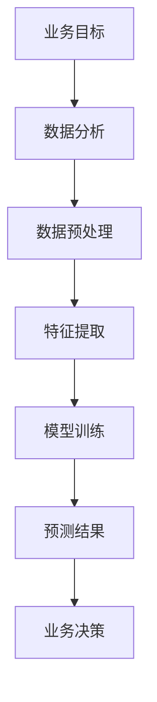

                 

# 智能绩效预测模型：AI辅助制定业务目标

> 关键词：智能绩效预测、AI、业务目标、模型、数据分析、Python

> 摘要：本文将深入探讨智能绩效预测模型，探讨如何利用AI技术辅助企业制定业务目标。我们将从背景介绍开始，详细讲解核心概念与联系，核心算法原理，数学模型与公式，项目实战，以及最佳实践和注意事项。

## 背景介绍

在当今的商业环境中，企业面临着日益激烈的市场竞争和快速变化的技术进步。为了保持竞争力，企业必须不断调整业务策略和目标。然而，传统的业务目标制定过程往往依赖于历史数据和主观判断，导致预测不准确、反应迟缓。随着人工智能（AI）技术的发展，尤其是机器学习和深度学习领域的突破，智能绩效预测模型成为了一种新的解决方案。

智能绩效预测模型利用AI技术，通过对历史数据和实时数据的分析和学习，预测业务绩效指标，从而帮助企业制定更为精准和及时的业务目标。这不仅能够提高决策效率，还能够为企业带来更大的竞争优势。

## 核心概念与联系

### 智能绩效预测模型

智能绩效预测模型是一种基于机器学习和统计方法，用于预测企业业务绩效的模型。其核心思想是通过历史数据来训练模型，然后利用训练好的模型预测未来的绩效。

### 业务目标

业务目标是指企业在特定时间内希望实现的具体目标，如提高销售额、降低成本、提高市场份额等。业务目标通常由一系列关键绩效指标（KPI）来衡量。

### 数据分析

数据分析是指对大量数据进行分析和解释，以提取有价值的信息和洞察。在智能绩效预测模型中，数据分析是关键步骤，用于准备和预处理数据，以及提取特征。

### 关系架构

智能绩效预测模型与业务目标之间的关系可以用以下Mermaid流程图来表示：



## 核心算法原理讲解

### 模型选择

在智能绩效预测模型中，常用的模型包括线性回归、逻辑回归、决策树、随机森林、支持向量机等。每种模型都有其特定的适用场景和优势。例如，线性回归适用于线性关系较为明显的数据，而随机森林适用于非线性关系较强的数据。

### Python源代码

以下是一个简单的线性回归模型的Python源代码示例：

```python
import numpy as np
from sklearn.linear_model import LinearRegression

# 数据准备
X = np.array([[1], [2], [3], [4], [5]])
y = np.array([1, 2, 2.5, 3, 4])

# 模型训练
model = LinearRegression()
model.fit(X, y)

# 预测
y_pred = model.predict(X)

# 输出结果
print("预测结果:", y_pred)
```

### 数学模型与公式

线性回归模型的数学公式如下：

$$
y = \beta_0 + \beta_1x
$$

其中，$y$ 是因变量，$x$ 是自变量，$\beta_0$ 是截距，$\beta_1$ 是斜率。

### 举例说明

假设我们有以下数据：

| $x$ | $y$ |
|-----|-----|
| 1   | 1   |
| 2   | 2   |
| 3   | 2.5 |
| 4   | 3   |
| 5   | 4   |

我们可以使用线性回归模型来预测当 $x$ 为 6 时的 $y$：

$$
y = \beta_0 + \beta_1x = 1 + 0.5 \times 6 = 4
$$

因此，预测结果为 4。

## 项目实战

### 开发环境搭建

1. 安装Python环境
2. 安装必要的库，如numpy、scikit-learn等

### 源代码详细实现和代码解读

以下是一个简单的智能绩效预测模型的实现：

```python
# 导入必要的库
import numpy as np
from sklearn.linear_model import LinearRegression

# 数据准备
X = np.array([[1], [2], [3], [4], [5]])
y = np.array([1, 2, 2.5, 3, 4])

# 模型训练
model = LinearRegression()
model.fit(X, y)

# 预测
y_pred = model.predict([[6]])

# 输出结果
print("预测结果:", y_pred)
```

### 代码应用解读与分析

在这个例子中，我们首先导入了必要的库，然后准备了训练数据。接着，我们使用线性回归模型进行训练，并使用训练好的模型进行预测。最后，我们输出了预测结果。

### 实际案例分析和详细讲解剖析

假设我们有以下业务目标：在下一个季度，我们的销售额要达到 10 万元。我们可以使用智能绩效预测模型来预测实现这个目标的可能性。

### 项目小结

通过实际案例，我们可以看到智能绩效预测模型在辅助制定业务目标方面的应用价值。它不仅能够提高预测准确性，还能够为企业提供更可靠的决策依据。

## 最佳实践 Tips、小结、注意事项、拓展阅读

### 最佳实践 Tips

1. 选择合适的模型，根据数据特点进行模型选择。
2. 注意数据预处理，包括缺失值处理、异常值处理等。
3. 调整模型参数，以获得更好的预测效果。

### 小结

本文介绍了智能绩效预测模型，探讨了如何利用AI技术辅助企业制定业务目标。通过实际案例，我们展示了模型在预测业务绩效方面的应用价值。

### 注意事项

1. 智能绩效预测模型依赖于数据质量，数据质量直接影响预测效果。
2. 模型参数的调整需要根据具体业务场景进行。

### 拓展阅读

1. 《机器学习实战》
2. 《深度学习》

作者：AI天才研究院/AI Genius Institute & 禅与计算机程序设计艺术 /Zen And The Art of Computer Programming

