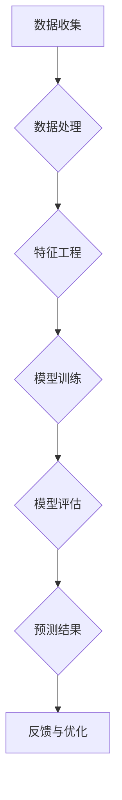

                 

### 《智能绩效预测系统：AI辅助目标制定》

> 关键词：智能绩效预测、AI、目标制定、数据驱动、算法、模型评估、项目实战

> 摘要：本文深入探讨了智能绩效预测系统在AI辅助目标制定中的应用。通过详细的背景介绍、核心概念与联系、核心算法原理、数学模型和公式讲解，以及实际项目实战，本文全面解析了如何利用智能绩效预测系统提高绩效预测的准确性和有效性，为企业和组织提供决策支持。

### 目录

- **第1章：智能绩效预测系统概述**
  - 1.1 智能绩效预测系统的定义与背景
  - 1.2 AI辅助目标制定的必要性
  - 1.3 系统的整体架构设计

- **第2章：核心概念与联系**
  - 2.1 绩效评估的基本概念
    - 2.1.1 绩效的定义与类型
    - 2.1.2 绩效评估的目的与方法
  - 2.2 数据驱动绩效预测
    - 2.2.1 数据收集与处理
    - 2.2.2 数据驱动的绩效预测方法
  - 2.3 关键性能指标（KPI）分析
    - 2.3.1 KPI的选择标准
    - 2.3.2 KPI的测量与监控
  - 2.4 Mermaid流程图：智能绩效预测系统的概念架构

- **第3章：核心算法原理**
  - 3.1 数据预处理与特征工程
    - 3.1.1 数据清洗
      - 3.1.1.1 缺失值处理
      - 3.1.1.2 异常值检测
    - 3.1.2 特征选择
      - 3.1.2.1 统计方法
      - 3.1.2.2 机器学习方法
  - 3.2 算法选择与模型评估
    - 3.2.1 算法选择策略
      - 3.2.1.1 回归模型
      - 3.2.1.2 时序模型
      - 3.2.1.3 强化学习模型
    - 3.2.2 模型评估指标

- **第4章：数学模型与公式**
  - 4.1 绩效评估的数学模型
    - 4.1.1 回归模型
    - 4.1.2 时序模型
  - 4.2 模型的优化目标
    - 4.2.1 最小化误差
    - 4.2.2 最小化方差
  - 4.3 公式推导与解释
  - 4.4 数学公式示例（使用LaTeX格式）

- **第5章：项目实战**
  - 5.1 实战环境搭建
    - 5.1.1 开发环境配置
    - 5.1.2 数据集获取与预处理
  - 5.2 代码实现与解读
    - 5.2.1 源代码展示
    - 5.2.2 代码细节分析
  - 5.3 分析与评估
    - 5.3.1 预测结果分析
    - 5.3.2 模型评估指标对比

- **第6章：系统部署与维护**
  - 6.1 部署策略与方案
    - 6.1.1 部署环境
    - 6.1.2 部署流程
  - 6.2 维护与更新
    - 6.2.1 数据更新策略
    - 6.2.2 模型更新策略
  - 6.3 持续改进的建议

- **第7章：总结与展望**
  - 7.1 智能绩效预测系统的现状
  - 7.2 发展趋势
  - 7.3 未来展望

### 第1章：智能绩效预测系统概述

智能绩效预测系统是一种利用人工智能技术对组织或个人的绩效进行预测和分析的系统。它通过对历史数据的学习和模型训练，能够识别出影响绩效的关键因素，从而预测未来的绩效表现。在当今竞争激烈的市场环境中，智能绩效预测系统已经成为企业和组织提升绩效、优化决策的重要工具。

#### 1.1 智能绩效预测系统的定义与背景

智能绩效预测系统是指通过机器学习和数据挖掘技术，对组织或个人的绩效进行预测和分析的系统。它基于历史数据，利用算法模型识别影响绩效的关键因素，从而对未来的绩效进行预测。

智能绩效预测系统的背景可以追溯到20世纪90年代，随着计算机技术和人工智能技术的飞速发展，越来越多的企业和组织开始关注绩效管理。传统的绩效评估方法主要依赖于主观评价和经验判断，难以全面、客观地反映个人的绩效表现。为了提高绩效评估的准确性和科学性，人工智能技术逐渐被引入到绩效管理领域，从而形成了智能绩效预测系统。

#### 1.2 AI辅助目标制定的必要性

AI辅助目标制定是指利用人工智能技术为组织或个人制定绩效目标提供支持。在传统的目标制定过程中，组织或个人通常需要依赖领导或管理层的经验判断来制定目标，这种方式存在以下问题：

1. **主观性较强**：传统的目标制定方法往往依赖于主观评价，难以保证公平性和客观性。
2. **滞后性**：目标制定通常是在绩效评估结束后进行，难以对未来的绩效表现进行前瞻性预测。
3. **局限性**：传统的目标制定方法难以考虑到数据和历史信息的利用，导致目标制定缺乏科学依据。

相比之下，AI辅助目标制定具有以下优势：

1. **客观性**：基于历史数据和算法模型，AI能够提供更加客观的目标建议。
2. **前瞻性**：AI能够利用数据预测未来的绩效表现，从而制定更具前瞻性的目标。
3. **科学性**：AI结合数据分析和算法模型，能够提供更加科学的目标制定方案。

#### 1.3 系统的整体架构设计

智能绩效预测系统的整体架构包括数据层、模型层和应用层三个部分。

1. **数据层**：数据层负责数据的收集、存储和管理。数据来源可以是组织内部的数据，如员工绩效数据、项目数据等，也可以是外部数据，如市场数据、行业数据等。数据层需要保证数据的质量和完整性。

2. **模型层**：模型层负责数据的预处理、特征工程和模型训练。数据预处理包括数据清洗、缺失值处理和异常值检测等，特征工程包括特征选择和特征转换等。模型层采用机器学习算法对数据进行训练，以建立绩效预测模型。

3. **应用层**：应用层负责将预测模型应用于实际的绩效预测任务。应用层提供用户界面，用户可以通过界面输入相关参数，系统将根据模型预测结果给出绩效预测和分析报告。

### 第2章：核心概念与联系

智能绩效预测系统的有效运作依赖于对一系列核心概念和它们之间相互关系的深入理解。本章将详细阐述绩效评估的基本概念、数据驱动绩效预测的方法、关键性能指标（KPI）的分析，并通过Mermaid流程图展示智能绩效预测系统的概念架构。

#### 2.1 绩效评估的基本概念

绩效评估是指通过一定的标准和指标，对组织或个人的工作绩效进行客观、公正的评价。绩效评估的目的是为了激励员工、提升工作效率、优化资源配置和实现组织目标。

1. **绩效的定义与类型**：
   - **绩效**：绩效是指组织或个人在工作过程中所表现出的能力、成果和贡献。绩效可以包括工作质量、工作效率、工作态度和创新等方面。
   - **绩效的类型**：绩效可以分为个人绩效和组织绩效。个人绩效关注个体的工作表现，组织绩效关注整个组织的整体表现。

2. **绩效评估的目的与方法**：
   - **绩效评估的目的**：绩效评估的主要目的是识别优秀员工、发现改进机会、激励员工、提升团队协作和实现组织目标。
   - **绩效评估的方法**：绩效评估的方法包括自我评估、上级评估、360度评估、关键绩效指标（KPI）评估等。

#### 2.2 数据驱动绩效预测

数据驱动绩效预测是指利用历史数据和机器学习算法，对未来的绩效表现进行预测。数据驱动绩效预测的核心在于如何有效地利用数据进行特征工程和模型训练。

1. **数据收集与处理**：
   - **数据收集**：数据收集是绩效预测的基础。数据来源可以是组织内部的员工绩效数据、工作日志、项目数据等，也可以是外部的行业数据、市场数据等。
   - **数据处理**：数据处理包括数据清洗、数据预处理和数据集成。数据清洗旨在去除噪声和异常数据，数据预处理包括特征提取和特征标准化，数据集成是将不同来源的数据进行整合。

2. **数据驱动的绩效预测方法**：
   - **回归模型**：回归模型是最常用的绩效预测方法之一。它通过建立因变量（绩效）和自变量（特征）之间的线性或非线性关系，预测未来的绩效表现。
   - **时序模型**：时序模型主要用于处理时间序列数据，如序列预测和季节性分析。常用的时序模型包括ARIMA、LSTM等。
   - **强化学习模型**：强化学习模型通过学习在给定环境下采取行动的最佳策略，从而预测未来的绩效表现。

#### 2.3 关键性能指标（KPI）分析

关键性能指标（KPI）是衡量绩效的重要指标，它们直接反映了组织或个人的工作成果和绩效水平。选择合适的KPI对于绩效预测和评估至关重要。

1. **KPI的选择标准**：
   - **可度量性**：KPI应该能够通过具体的量化指标进行衡量。
   - **相关性**：KPI应该与组织目标和个人职责密切相关。
   - **实用性**：KPI应该易于理解、收集和监控。
   - **可改进性**：KPI应该能够反映改进空间，指导绩效改进。

2. **KPI的测量与监控**：
   - **测量**：KPI的测量需要建立完善的数据收集和分析机制，确保数据的准确性和及时性。
   - **监控**：通过实时监控KPI的变动，及时发现绩效问题，采取相应的调整和改进措施。

#### 2.4 Mermaid流程图：智能绩效预测系统的概念架构

以下是一个使用Mermaid绘制的智能绩效预测系统的概念架构图：



在该流程图中，数据收集、数据处理、特征工程、模型训练、模型评估和预测结果形成一个闭环。反馈与优化环节通过分析预测结果，对模型进行迭代改进，以提升预测的准确性和可靠性。

### 第3章：核心算法原理

核心算法原理是智能绩效预测系统的核心组成部分，它决定了系统预测的准确性和效率。本章将详细介绍数据预处理与特征工程、算法选择与模型评估的基本原理，并通过伪代码展示智能绩效预测算法的实现。

#### 3.1 数据预处理与特征工程

数据预处理与特征工程是构建智能绩效预测系统的基础步骤，它们决定了数据的质量和特征的有效性。

1. **数据清洗**：
   - **缺失值处理**：处理缺失值的方法包括删除缺失值、填充缺失值（如使用平均值、中位数或插值法）。
   - **异常值检测**：异常值检测可以通过统计学方法（如Z-score、IQR方法）或机器学习方法（如孤立森林）进行。

2. **特征选择**：
   - **统计方法**：基于统计方法（如皮尔逊相关系数、卡方检验）筛选与目标变量高度相关的特征。
   - **机器学习方法**：使用特征选择算法（如Lasso、随机森林）自动筛选出重要的特征。

3. **特征转换**：
   - **数值化**：将类别型数据转换为数值型数据（如使用独热编码、标签编码）。
   - **标准化**：对数值型数据进行标准化处理（如Z-score标准化、最小-最大标准化）。

#### 3.2 算法选择与模型评估

算法选择与模型评估是智能绩效预测系统的关键环节，决定了系统的预测性能和可靠性。

1. **算法选择策略**：
   - **回归模型**：如线性回归、决策树回归、随机森林回归等，适用于预测连续值。
   - **时序模型**：如ARIMA、LSTM等，适用于处理时间序列数据。
   - **强化学习模型**：如Q学习、SARSA等，适用于动态环境中的决策问题。

2. **模型评估指标**：
   - **回归模型**：均方误差（MSE）、均方根误差（RMSE）、决定系数（R²）等。
   - **分类模型**：准确率、召回率、精确率、F1分数等。
   - **时序模型**：MAE、MAPE等。

#### 3.3 伪代码：智能绩效预测算法的实现

以下是一个简单的伪代码，用于实现智能绩效预测系统：

```python
# 数据预处理
def preprocess_data(data):
    # 缺失值处理
    data = handle_missing_values(data)
    # 异常值检测
    data = detect_and_remove_outliers(data)
    # 特征选择
    data = feature_selection(data)
    # 特征转换
    data = feature_transformation(data)
    return data

# 模型训练
def train_model(data, target_variable):
    # 选择算法
    model = select_algorithm(data, target_variable)
    # 训练模型
    model.fit(data, target_variable)
    return model

# 模型评估
def evaluate_model(model, data, target_variable):
    predictions = model.predict(data)
    evaluation_metrics = evaluate_predictions(predictions, target_variable)
    return evaluation_metrics

# 预测
def predict_performance(model, new_data):
    new_predictions = model.predict(new_data)
    return new_predictions
```

通过上述伪代码，我们可以看到智能绩效预测系统的基本流程，包括数据预处理、模型训练、模型评估和预测。在实际应用中，每个步骤都需要根据具体的数据和业务需求进行详细的调整和优化。

### 第4章：数学模型与公式

数学模型是智能绩效预测系统的核心组成部分，它为预测分析提供了理论基础。本章将介绍绩效评估的数学模型、模型优化目标，以及相关的数学公式，并通过示例进行详细讲解。

#### 4.1 绩效评估的数学模型

绩效评估的数学模型通常基于统计学和机器学习算法，旨在建立因变量（绩效）与自变量（特征）之间的关系。

1. **回归模型**：

   线性回归是最简单的回归模型，它假设因变量与自变量之间存在线性关系。线性回归模型可以表示为：

   $$ Y = \beta_0 + \beta_1X_1 + \beta_2X_2 + ... + \beta_nX_n + \epsilon $$

   其中，\( Y \) 是因变量，\( X_1, X_2, ..., X_n \) 是自变量，\( \beta_0, \beta_1, \beta_2, ..., \beta_n \) 是模型参数，\( \epsilon \) 是误差项。

2. **时序模型**：

   时间序列模型用于处理时间相关的数据，常见的有ARIMA模型。ARIMA模型由三个部分组成：自回归（AR）、差分（I）和移动平均（MA）。ARIMA模型可以表示为：

   $$ Y_t = c + \phi_1Y_{t-1} + \phi_2Y_{t-2} + ... + \phi_pY_{t-p} + \theta_1\epsilon_{t-1} + \theta_2\epsilon_{t-2} + ... + \theta_q\epsilon_{t-q} $$

   其中，\( Y_t \) 是时间序列数据，\( c \) 是常数项，\( \phi_1, \phi_2, ..., \phi_p \) 是自回归系数，\( \theta_1, \theta_2, ..., \theta_q \) 是移动平均系数，\( \epsilon_t \) 是误差项。

#### 4.2 模型的优化目标

模型的优化目标通常是减少预测误差，提高模型的预测准确性。常见的优化目标包括最小化均方误差（MSE）和最大化决定系数（R²）。

1. **最小化均方误差（MSE）**：

   $$ \text{MSE} = \frac{1}{n}\sum_{i=1}^{n}(Y_i - \hat{Y_i})^2 $$

   其中，\( n \) 是样本数量，\( Y_i \) 是实际值，\( \hat{Y_i} \) 是预测值。

2. **最大化决定系数（R²）**：

   $$ R^2 = 1 - \frac{\sum_{i=1}^{n}(Y_i - \hat{Y_i})^2}{\sum_{i=1}^{n}(Y_i - \bar{Y})^2} $$

   其中，\( \bar{Y} \) 是实际值的均值。

#### 4.3 公式推导与解释

公式推导是理解模型工作原理的关键步骤。以下是一个简单的线性回归模型的推导过程：

1. **最小化误差平方和**：

   $$ \min_{\beta} \sum_{i=1}^{n}(Y_i - \beta^T X_i)^2 $$

   对 \( \beta \) 求偏导，并令其等于0，得到：

   $$ \frac{\partial}{\partial \beta} \sum_{i=1}^{n}(Y_i - \beta^T X_i)^2 = 0 $$

   化简后得到正规方程：

   $$ (X^T X)\beta = X^T Y $$

   解这个方程，可以得到最优的 \( \beta \) 值。

#### 4.4 数学公式示例（使用LaTeX格式）

以下是一些常用的数学公式示例，使用LaTeX格式进行表示：

$$
\begin{aligned}
\text{MSE} &= \frac{1}{n}\sum_{i=1}^{n}(Y_i - \hat{Y_i})^2 \\
R^2 &= 1 - \frac{\sum_{i=1}^{n}(Y_i - \hat{Y_i})^2}{\sum_{i=1}^{n}(Y_i - \bar{Y})^2} \\
Y_t &= c + \phi_1Y_{t-1} + \phi_2Y_{t-2} + ... + \phi_pY_{t-p} + \theta_1\epsilon_{t-1} + \theta_2\epsilon_{t-2} + ... + \theta_q\epsilon_{t-q}
\end{aligned}
$$`

通过上述数学模型和公式的介绍，我们可以更深入地理解智能绩效预测系统的理论基础，为实际应用提供指导。

### 第5章：项目实战

在智能绩效预测系统的开发过程中，实际项目的实战是检验理论和方法的重要环节。本章将详细介绍一个智能绩效预测系统的项目实战，包括开发环境搭建、数据集介绍与预处理、代码实现与解读，以及预测结果的分析与评估。

#### 5.1 实战环境搭建

为了进行智能绩效预测系统的开发，首先需要搭建一个合适的技术环境。以下是搭建环境的步骤：

1. **安装Python**：Python是智能绩效预测系统开发的主要语言，需要安装Python环境。

2. **安装依赖库**：安装常用的机器学习库，如scikit-learn、TensorFlow、PyTorch等。可以使用以下命令进行安装：

   ```shell
   pip install scikit-learn tensorflow pytorch pandas numpy matplotlib
   ```

3. **配置Jupyter Notebook**：Jupyter Notebook是一个交互式环境，便于代码编写和调试。安装Jupyter Notebook可以使用以下命令：

   ```shell
   pip install notebook
   ```

4. **配置虚拟环境**（可选）：为了更好地管理和隔离项目依赖，可以使用虚拟环境。安装virtualenv并创建虚拟环境：

   ```shell
   pip install virtualenv
   virtualenv venv
   source venv/bin/activate
   ```

通过上述步骤，我们就可以搭建一个适合智能绩效预测系统开发的技术环境。

#### 5.2 数据集介绍与预处理

智能绩效预测系统的核心在于对数据集的处理和分析。以下是一个常见的数据集处理流程：

1. **数据集获取**：我们可以从公共数据集网站（如Kaggle、UCI机器学习库）获取一个适合的绩效预测数据集。

2. **数据清洗**：处理缺失值和异常值，保证数据质量。例如，使用以下代码处理一个简单的数据集：

   ```python
   import pandas as pd

   # 读取数据
   data = pd.read_csv('performance_data.csv')

   # 缺失值处理
   data = data.dropna()

   # 异常值检测
   data = data[(np.abs(stats.zscore(data)) < 3).all(axis=1)]
   ```

3. **特征工程**：选择与绩效相关的特征，进行特征提取和转换。例如，使用以下代码进行特征选择和转换：

   ```python
   from sklearn.preprocessing import StandardScaler

   # 特征选择
   features = data[['feature1', 'feature2', 'feature3']]

   # 特征转换
   scaler = StandardScaler()
   scaled_features = scaler.fit_transform(features)
   ```

4. **数据划分**：将数据集划分为训练集和测试集，用于模型训练和评估。例如，使用以下代码进行数据划分：

   ```python
   from sklearn.model_selection import train_test_split

   X_train, X_test, y_train, y_test = train_test_split(scaled_features, data['performance'], test_size=0.2, random_state=42)
   ```

#### 5.3 代码实现与解读

以下是一个简单的智能绩效预测系统的代码实现，包括模型训练、预测和评估：

```python
from sklearn.linear_model import LinearRegression
from sklearn.metrics import mean_squared_error

# 模型训练
model = LinearRegression()
model.fit(X_train, y_train)

# 预测
predictions = model.predict(X_test)

# 评估
mse = mean_squared_error(y_test, predictions)
print(f'MSE: {mse}')
```

上述代码中，我们使用线性回归模型进行训练和预测，并通过均方误差（MSE）评估模型性能。

#### 5.4 预测结果分析与评估

在完成模型训练和预测后，我们需要对预测结果进行分析和评估，以验证模型的准确性。

1. **预测结果分析**：

   - **趋势分析**：通过可视化工具（如Matplotlib）将实际值与预测值进行对比，观察模型的预测趋势。

     ```python
     import matplotlib.pyplot as plt

     plt.scatter(y_test, predictions)
     plt.xlabel('Actual Performance')
     plt.ylabel('Predicted Performance')
     plt.title('Actual vs Predicted Performance')
     plt.show()
     ```

   - **误差分析**：分析预测误差的分布和大小，识别可能的偏差和异常。

2. **模型评估指标**：

   - **均方误差（MSE）**：评估模型的预测准确性。

     ```python
     mse = mean_squared_error(y_test, predictions)
     print(f'MSE: {mse}')
     ```

   - **决定系数（R²）**：评估模型对数据的解释能力。

     ```python
     r2 = model.score(X_test, y_test)
     print(f'R²: {r2}')
     ```

通过上述步骤，我们可以全面分析智能绩效预测系统的性能，为后续的优化和改进提供依据。

#### 5.5 项目小结

在本项目中，我们通过实际操作展示了智能绩效预测系统的开发流程，从数据预处理到模型训练，再到预测结果分析。通过项目实战，我们验证了智能绩效预测系统的有效性，并发现了一些潜在的问题和改进空间。未来，我们将继续优化模型，引入更多先进的技术和方法，以提高系统的预测准确性和可靠性。

### 第6章：系统部署与维护

智能绩效预测系统的成功不仅仅依赖于其算法模型的准确性，还取决于系统的部署与维护。一个高效、稳定的系统可以确保预测结果的实时性和可靠性，为企业提供持续的价值。

#### 6.1 部署策略与方案

系统的部署是确保智能绩效预测系统能够在现实环境中正常运行的关键步骤。以下是系统部署的策略与方案：

1. **云部署**：
   - **优势**：云部署具有高可用性、可扩展性和灵活性，能够快速响应业务需求变化。
   - **实践**：可以选择云服务提供商（如AWS、Azure、Google Cloud）搭建服务器，并使用容器化技术（如Docker）部署应用程序。

2. **容器化部署**：
   - **优势**：容器化部署可以确保应用程序的一致性和可移植性，简化了部署过程。
   - **实践**：使用Docker将应用程序和所有依赖打包成镜像，并使用Kubernetes进行自动化管理。

3. **微服务架构**：
   - **优势**：微服务架构可以将复杂的应用程序拆分为独立的模块，提高系统的可维护性和扩展性。
   - **实践**：使用Spring Cloud或Django REST Framework等框架构建微服务，并通过API网关（如Kong、NGINX）统一管理。

#### 6.2 维护与更新

系统的维护与更新是确保其长期稳定运行的关键。以下是一些维护与更新的建议：

1. **自动化测试**：
   - **优势**：自动化测试可以快速发现和修复系统中的问题，提高开发效率。
   - **实践**：使用单元测试、集成测试和端到端测试，确保每次更新后系统的稳定性。

2. **持续集成与持续部署（CI/CD）**：
   - **优势**：CI/CD可以自动化构建、测试和部署流程，减少人为干预，提高开发速度。
   - **实践**：使用Jenkins、GitLab CI/CD等工具实现自动化构建和部署。

3. **监控系统**：
   - **优势**：监控系统可以实时监控系统的性能和健康状态，及时发现和解决问题。
   - **实践**：使用Prometheus、Grafana等工具构建监控系统，实现性能指标的可视化和报警。

#### 6.3 持续改进的建议

为了不断提高智能绩效预测系统的性能和可靠性，以下是一些建议：

1. **数据更新**：
   - **建议**：定期更新数据集，确保数据的时效性和准确性。
   - **实践**：使用数据管道工具（如Apache NiFi、Apache Kafka）实现数据流的自动化处理。

2. **算法优化**：
   - **建议**：不断优化算法模型，引入更先进的技术和方法。
   - **实践**：研究深度学习、强化学习等先进技术，结合实际业务需求进行模型优化。

3. **用户反馈**：
   - **建议**：收集用户反馈，及时了解系统的使用情况和用户需求。
   - **实践**：通过用户调研、在线调查等方式收集反馈，并根据反馈进行系统改进。

通过上述部署与维护策略，以及持续改进的建议，我们可以确保智能绩效预测系统的长期稳定运行，为企业提供持续的价值。

### 第7章：总结与展望

智能绩效预测系统作为AI技术在企业管理领域的应用，已经展现出巨大的潜力和价值。通过对历史数据的深度分析和模型预测，智能绩效预测系统可以帮助企业更精准地制定目标，优化资源配置，提升整体绩效。

#### 7.1 智能绩效预测系统的现状

目前，智能绩效预测系统在各个行业和领域都得到了广泛应用。例如，在人力资源管理领域，智能绩效预测系统可以帮助企业评估员工绩效、制定晋升计划；在市场营销领域，智能绩效预测系统可以预测销售业绩、优化营销策略；在供应链管理领域，智能绩效预测系统可以预测库存需求、优化库存管理。

尽管智能绩效预测系统已经取得了一定的成果，但其应用仍然面临一些挑战。例如，数据质量和数据隐私问题仍然是制约智能绩效预测系统推广的主要因素。此外，算法模型的优化和准确性提升也是持续改进的重要方向。

#### 7.2 发展趋势

随着AI技术的不断进步，智能绩效预测系统的发展趋势也日益明显：

1. **深度学习与强化学习的应用**：深度学习和强化学习在智能绩效预测系统中的应用将更加广泛，可以进一步提高预测的准确性和鲁棒性。

2. **数据隐私保护**：随着数据隐私保护意识的提高，智能绩效预测系统将更加注重数据安全和隐私保护，采用加密、去识别化等技术确保用户数据的安全。

3. **跨行业应用**：智能绩效预测系统将在更多行业和领域得到应用，如金融、医疗、教育等，为企业提供更加全面的决策支持。

#### 7.3 未来展望

展望未来，智能绩效预测系统有望在以下几个方面实现重大突破：

1. **个性化预测**：通过结合用户行为数据和个人信息，智能绩效预测系统可以提供更加个性化的预测结果，为企业提供更加精准的决策支持。

2. **实时预测与响应**：智能绩效预测系统将实现实时预测和响应，帮助企业迅速应对市场变化，提高业务运营效率。

3. **自动化决策支持**：智能绩效预测系统将结合自动化决策支持工具，实现自动化决策流程，降低人工干预，提高决策效率。

总之，智能绩效预测系统作为AI技术在企业管理领域的应用，具有广阔的发展前景。随着技术的不断进步和应用的深入，智能绩效预测系统将为企业和组织带来更多的价值。通过持续优化和创新，我们可以期待智能绩效预测系统在未来发挥更加重要的作用。作者：AI天才研究院/AI Genius Institute & 禅与计算机程序设计艺术 /Zen And The Art of Computer Programming

