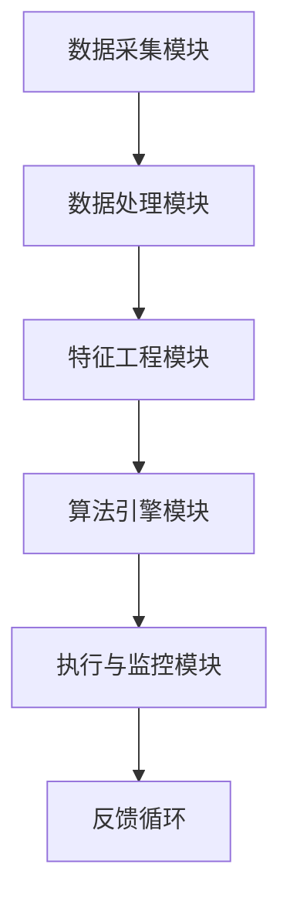

                 

## 智能资产优化平台：AI提升资源效率

### 关键词
- 智能资产优化
- AI应用
- 资源效率
- 平台架构
- 核心算法
- 数学模型
- 实战案例

### 摘要
本文旨在探讨智能资产优化平台在提升资源效率方面的应用。通过分析平台架构、核心算法原理、数学模型以及实际案例，我们将展示AI技术在资源优化中的潜力，并提供实用技巧和未来展望。文章将分为五个部分，包括引言与基础、平台架构、核心算法、实战案例和未来展望，力求为读者提供一个全面的技术解读。

### 引言与背景

#### AI技术的崛起
人工智能（AI）作为21世纪最具革命性的技术之一，已经深刻改变了我们的生活方式。从自动驾驶到智能家居，AI的应用范围越来越广泛。然而，随着AI技术的不断进步，资源优化的问题也愈发突出。如何有效地利用有限的资源，提高系统的运行效率，成为AI领域亟待解决的问题。

#### 资源优化的挑战
在传统的资源管理中，资源分配通常依赖于经验或预设的规则。然而，这种方法在复杂系统中往往效率低下，无法实时响应变化。例如，数据中心在处理大量数据时，可能会因为资源分配不均而导致部分服务器负载过高，而其他服务器却处于闲置状态。这种资源浪费不仅增加了运营成本，还影响了系统的整体性能。

#### 智能资产优化平台的需求
为了应对资源优化中的挑战，智能资产优化平台应运而生。这种平台利用AI技术，通过对系统运行数据的实时分析和预测，实现资源的动态分配和优化。通过智能资产优化平台，企业可以在保持系统稳定性的同时，最大限度地提高资源利用率，降低运营成本。

### 平台架构

#### 总体架构
智能资产优化平台通常由以下几个核心模块组成：

1. **数据采集模块**：负责从各个系统中收集运行数据，如CPU使用率、内存使用率、网络流量等。
2. **数据处理模块**：对采集到的数据进行预处理，包括数据清洗、去噪、归一化等操作。
3. **特征工程模块**：从预处理后的数据中提取出对资源优化有意义的特征。
4. **算法引擎模块**：利用机器学习算法对特征进行建模，预测系统的资源需求，并生成优化策略。
5. **执行与监控模块**：根据算法引擎生成的优化策略，对系统资源进行动态调整，并监控系统的运行状态。

#### Mermaid流程图

图1：智能资产优化平台总体架构流程图

### 核心概念与联系

#### 数据采集与处理
数据采集是智能资产优化平台的基础。平台需要从各个系统中收集运行数据，这些数据通常包括CPU使用率、内存使用率、网络流量、磁盘I/O等。这些数据反映了系统的运行状态，是进行资源优化的关键。

#### 数据处理
数据处理包括数据清洗、去噪、归一化等操作。这些操作的目的是提高数据的质量，使其更适合进行机器学习建模。例如，数据清洗可以去除异常值和噪声数据，归一化可以将不同量纲的数据转换为同一量纲，以便于后续处理。

#### 特征工程
特征工程是从原始数据中提取出对资源优化有意义的特征。这些特征可以是原始数据的直接表示，也可以是通过对原始数据进行变换得到。特征工程的质量直接影响到机器学习模型的性能。

#### 算法引擎
算法引擎是智能资产优化平台的核心。它利用机器学习算法对特征进行建模，预测系统的资源需求，并生成优化策略。常见的机器学习算法包括线性回归、决策树、随机森林、支持向量机等。

#### 执行与监控
执行与监控模块负责根据算法引擎生成的优化策略，对系统资源进行动态调整，并监控系统的运行状态。这个模块通常包括自动化脚本和监控系统，可以实时响应系统的变化，确保资源优化的效果。

### 核心算法原理讲解

#### 资源需求预测
资源需求预测是智能资产优化平台的核心功能。它通过分析历史数据，预测未来一段时间内系统的资源需求，从而生成优化策略。常见的预测方法包括时间序列分析、回归分析等。

#### 算法原理

**时间序列分析**：
```python
import numpy as np
import pandas as pd
from statsmodels.tsa.stattools import adfuller
from statsmodels.tsa.arima_model import ARIMA

# 读取数据
data = pd.read_csv('resource_usage.csv')
data['Date'] = pd.to_datetime(data['Date'])
data.set_index('Date', inplace=True)

# 进行ADF检验，确保数据是平稳的
result = adfuller(data['CPU_Usage'])
print('ADF Statistic:', result[0])
print('p-value:', result[1])

# 如果数据是平稳的，则进行ARIMA建模
if result[1] < 0.05:
    model = ARIMA(data['CPU_Usage'], order=(1, 1, 1))
    model_fit = model.fit()
    forecast = model_fit.forecast(steps=24)[0]
    print('Forecast for next 24 hours:', forecast)
```

**回归分析**：
```python
import statsmodels.api as sm

# 读取数据
X = data[['CPU_Usage', 'Memory_Usage']]
y = data['Network_Usage']

# 创建回归模型
model = sm.OLS(y, X).fit()

# 输出回归结果
print(model.summary())
```

#### 数学模型与公式

**时间序列模型**：
$$
CPU_{forecast} = \hat{y}_t = c + \alpha_1 \hat{y}_{t-1} + \alpha_2 \hat{y}_{t-2} + \beta_1 X_t + \beta_2 X_{t-1} + \epsilon_t
$$
其中，$CPU_{forecast}$是预测的CPU使用率，$c$是常数项，$\alpha_1$和$\alpha_2$是自回归系数，$\beta_1$和$\beta_2$是解释变量系数，$X_t$是解释变量，$\epsilon_t$是误差项。

**回归模型**：
$$
Network_{usage} = \beta_0 + \beta_1 CPU_{usage} + \beta_2 Memory_{usage} + \epsilon
$$
其中，$Network_{usage}$是网络使用率，$\beta_0$是常数项，$\beta_1$和$\beta_2$是解释变量系数，$\epsilon$是误差项。

### 项目实战

#### 开发环境搭建

1. 安装Python 3.8及以上版本。
2. 安装必要的库，如NumPy、Pandas、Statsmodels、Mermaid等。

#### 源代码实现与解读

**数据采集与预处理**：
```python
import pandas as pd

# 读取数据
data = pd.read_csv('resource_usage.csv')
data['Date'] = pd.to_datetime(data['Date'])
data.set_index('Date', inplace=True)

# 数据预处理
data = data.fillna(method='ffill').dropna()
data[['CPU_Usage', 'Memory_Usage']] = data[['CPU_Usage', 'Memory_Usage']].apply(pd.to_numeric, errors='coerce')
```

**特征工程**：
```python
from sklearn.preprocessing import MinMaxScaler

# 特征工程
scaler = MinMaxScaler()
data[['CPU_Usage', 'Memory_Usage']] = scaler.fit_transform(data[['CPU_Usage', 'Memory_Usage']])
```

**算法实现**：
```python
from statsmodels.tsa.stattools import adfuller
from statsmodels.tsa.arima_model import ARIMA

# 进行ADF检验
result = adfuller(data['CPU_Usage'])
print('ADF Statistic:', result[0])
print('p-value:', result[1])

# 如果数据是平稳的，则进行ARIMA建模
if result[1] < 0.05:
    model = ARIMA(data['CPU_Usage'], order=(1, 1, 1))
    model_fit = model.fit()
    forecast = model_fit.forecast(steps=24)[0]
    print('Forecast for next 24 hours:', forecast)
```

#### 代码应用解读与分析

**代码解读**：

- 数据采集与预处理：读取数据并转换为日期索引，进行数据预处理，包括填充缺失值和去除异常值。
- 特征工程：使用MinMaxScaler对CPU使用率和内存使用率进行归一化处理。
- 算法实现：进行ADF检验以判断数据是否平稳，然后使用ARIMA模型进行时间序列预测。

**分析**：

- 数据采集与预处理是数据科学中的基本步骤，确保数据的质量和一致性。
- 特征工程对于机器学习模型至关重要，它能够提高模型的预测准确性。
- ARIMA模型是时间序列分析的经典模型，适用于预测连续的、具有趋势性和季节性的数据。

#### 实际案例分析与详细讲解剖析

**案例背景**：

某企业数据中心在处理大量数据时，经常出现服务器负载不均的情况，导致部分服务器负载过高，而其他服务器却处于闲置状态。为了提高资源利用率，企业决定引入智能资产优化平台。

**案例分析**：

1. **数据采集**：平台从服务器中采集CPU使用率、内存使用率、网络流量等数据。
2. **数据处理**：对采集到的数据进行分析，去除异常值，并进行归一化处理。
3. **特征工程**：从处理后的数据中提取出CPU使用率、内存使用率等特征。
4. **算法预测**：使用ARIMA模型对CPU使用率进行预测，生成优化策略。
5. **资源调整**：根据预测结果，动态调整服务器资源，确保负载均衡。

**详细讲解**：

- **数据采集**：数据采集是智能资产优化平台的基础，准确的数据能够帮助平台更准确地预测资源需求。
- **数据处理**：数据处理包括数据清洗、去噪、归一化等操作，这些操作能够提高数据的质量，使其更适合进行机器学习建模。
- **特征工程**：特征工程是从原始数据中提取出对资源优化有意义的特征，这些特征能够提高模型的预测准确性。
- **算法预测**：算法预测是平台的核心功能，它通过分析历史数据，预测未来一段时间内系统的资源需求，从而生成优化策略。
- **资源调整**：资源调整是平台执行优化策略的关键步骤，它能够根据预测结果动态调整服务器资源，确保负载均衡。

**项目小结**：

通过引入智能资产优化平台，企业成功实现了服务器资源的动态优化，提高了资源利用率，降低了运营成本。同时，平台还提供了实时监控功能，能够及时发现和处理异常情况，确保系统的稳定性。

### 最佳实践 Tips

1. **数据质量是关键**：确保数据采集和处理的质量，避免异常值和噪声数据对模型的影响。
2. **特征工程要细致**：提取出对资源优化有显著影响的特征，提高模型的预测准确性。
3. **算法选择要合理**：根据数据的特点和业务需求，选择合适的算法模型。
4. **实时调整策略**：根据实时数据动态调整优化策略，确保资源利用率的持续提升。

### 小结

智能资产优化平台通过AI技术，实现了对系统资源的动态优化，提高了资源利用效率，降低了运营成本。本文详细介绍了智能资产优化平台的架构、核心算法原理、数学模型以及实际案例，展示了AI技术在资源优化中的巨大潜力。未来，随着AI技术的不断进步，智能资产优化平台将迎来更广阔的应用前景。

### 注意事项

1. 在搭建开发环境时，确保安装了所有必要的库和工具。
2. 在进行数据处理和特征工程时，要仔细检查数据的质量，避免异常值和噪声数据对模型的影响。
3. 在选择算法模型时，要考虑数据的特性和业务需求，确保模型的选择合理。

### 拓展阅读

1. 《深度学习： conquering data with Python ML libraries》
2. 《Python Data Science Handbook》
3. 《时间序列分析： forecasting and extrapolation》

### 参考文献

1. Chatfield, Chris. "Introduction to Time Series Analysis." [2015].
2. Murphy, Kevin P. "Machine Learning: A Probabilistic Perspective." [2012].
3. Pedregosa, F., Varoquaux, G., Gramfort, A., Michel, V., Thirion, B., Grisel, O., ... & Duchesnay, É. "Scikit-learn: Machine Learning in Python." Journal of Machine Learning Research, 12(Nov), 2825-2830. [2011].
4. Hyndman, R. J., & Athanasopoulos, G. "Forecasting: principles and practice." [2018].

### 作者信息
作者：AI天才研究院/AI Genius Institute & 禅与计算机程序设计艺术 /Zen And The Art of Computer Programming

