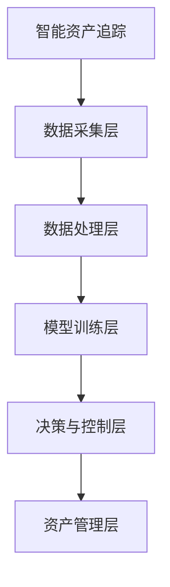

                 

### 智能资产追踪平台：AI优化资源管理

#### 关键词

- 智能资产追踪
- AI优化
- 资源管理
- 数据分析
- 机器学习
- 深度学习
- 强化学习

#### 摘要

本文深入探讨了智能资产追踪平台的构建及其在资源管理中的重要性。首先，我们介绍了智能资产追踪的基本概念和它在现代企业中的关键作用。接着，我们详细分析了智能资产追踪平台的核心架构，包括数据采集层、数据处理层、模型训练层和决策与控制层。随后，我们介绍了AI技术在这些不同层次中的具体应用，包括机器学习、深度学习和强化学习算法。然后，我们讨论了智能资产追踪平台的技术实现，包括数据采集系统、数据处理系统与存储系统、模型训练系统的设计和实现。在性能优化部分，我们探讨了算法优化、系统架构优化以及资源调度与优化。最后，我们通过一个成功案例展示了智能资产追踪平台在实际应用中的效果，并对未来趋势和应用前景进行了展望。本文旨在为读者提供一个全面、系统的智能资产追踪平台构建和优化的指南。

### 目录大纲

# 智能资产追踪平台：AI优化资源管理

## 第一部分：智能资产追踪平台的概述

### 第1章：智能资产追踪的概念与重要性

- 1.1 什么是智能资产追踪
- 1.2 智能资产追踪的关键概念
- 1.3 智能资产追踪的重要性

### 第2章：智能资产追踪平台的核心架构

- 2.1 数据采集层
- 2.2 数据处理层
- 2.3 模型训练层
- 2.4 决策与控制层

### 第3章：AI技术在智能资产追踪中的应用

- 3.1 机器学习算法在追踪中的应用
- 3.2 深度学习算法在追踪中的应用
- 3.3 强化学习算法在追踪中的应用

## 第二部分：智能资产追踪平台的实现与优化

### 第4章：智能资产追踪平台的技术实现

- 4.1 数据采集系统的设计与实现
- 4.2 数据处理系统与存储系统的设计与实现
- 4.3 模型训练系统的设计与实现

### 第5章：智能资产追踪平台的性能优化

- 5.1 算法优化
- 5.2 系统架构优化
- 5.3 资源调度与优化

### 第6章：智能资产追踪平台的部署与维护

- 6.1 部署策略
- 6.2 维护流程
- 6.3 故障排除

### 第7章：案例分析：成功智能资产追踪平台案例分析

- 7.1 案例背景
- 7.2 案例分析
- 7.3 案例启示

### 第8章：未来趋势与展望

- 8.1 智能资产追踪技术的发展趋势
- 8.2 智能资产追踪平台的应用前景
- 8.3 面临的挑战与解决方案

### 附录：智能资产追踪平台开发工具与资源

- A.1 开发工具介绍
- A.2 资源链接

---

## 核心概念与联系

### 智能资产追踪的概念与架构

智能资产追踪平台是利用人工智能技术，对企业的各类资产进行实时监控、分析和优化管理的一种综合解决方案。它的核心架构可以分为四个主要层次：数据采集层、数据处理层、模型训练层和决策与控制层。



- **数据采集层**：这一层负责从各种数据源（如传感器、数据库、日志文件等）收集数据。数据源可以是内部的，如企业内部网络设备、服务器等；也可以是外部的，如物联网设备、社交媒体等。采集的数据包括资产的状态、位置、使用情况等。

- **数据处理层**：这一层负责对采集到的原始数据进行清洗、转换和预处理，以便后续分析和模型训练。数据预处理包括去噪声、缺失值填补、数据标准化等步骤。

- **模型训练层**：这一层利用机器学习和深度学习算法，从处理过的数据中训练模型。这些模型能够自动识别资产的异常行为、预测资产的未来状态，从而提供智能决策支持。

- **决策与控制层**：这一层根据模型训练的结果，对资产进行实时决策和调控。例如，当系统检测到某台服务器负载过高时，它可以自动调整资源分配，或触发报警。

- **资产管理层**：这一层是智能资产追踪平台与企业管理系统的接口，负责将追踪结果和决策建议转化为实际的操作指令，实现资产的优化管理。

通过这四个层次的协同工作，智能资产追踪平台能够为企业提供全面、实时、精确的资产管理和优化服务，极大地提高资源利用率和管理效率。

### 数据处理算法

在数据处理层，数据处理算法是核心组成部分。以下是一个简化的数据处理算法的伪代码示例，用于说明数据处理的基本流程：

```python
# 伪代码：数据处理算法

def processData(data):
    # 数据清洗
    clean_data = clean(data)
    # 数据转换
    transformed_data = transform(clean_data)
    # 数据归一化
    normalized_data = normalize(transformed_data)
    return normalized_data

# 数据清洗
def clean(data):
    # 去除噪声
    cleaned_data = removeNoise(data)
    # 填补缺失值
    filled_data = fillMissingValues(cleaned_data)
    return filled_data

# 数据转换
def transform(data):
    # 特征提取
    extracted_features = extractFeatures(data)
    # 特征转换
    converted_features = convertFeatures(extracted_features)
    return converted_features

# 数据归一化
def normalize(data):
    # 归一化处理
    normalized_data = normalizeValues(data)
    return normalized_data
```

#### 数据清洗

数据清洗是数据处理的第一步，主要目的是去除数据中的噪声和不准确信息。以下是一个简化的数据清洗流程：

- **去除噪声**：通过过滤掉异常值、重复记录和不完整数据，提高数据的准确性和完整性。
- **填补缺失值**：采用不同的策略填补缺失值，如均值填补、中值填补、插值法等，确保数据集的完整性。

```python
# 伪代码：数据清洗

def clean(data):
    # 去除异常值
    data_without_outliers = removeOutliers(data)
    # 去除重复记录
    data_without_duplicates = removeDuplicates(data_without_outliers)
    # 填补缺失值
    data_filled = fillMissingValues(data_without_duplicates)
    return data_filled

# 去除异常值
def removeOutliers(data):
    # 根据统计方法（如标准差、四分位距）识别并去除异常值
    cleaned_data = removeStatisticalOutliers(data)
    return cleaned_data

# 去除重复记录
def removeDuplicates(data):
    # 使用数据结构（如字典）来去除重复记录
    unique_data = removeDuplicateRecords(data)
    return unique_data

# 填补缺失值
def fillMissingValues(data):
    # 根据数据类型选择合适的填补方法
    filled_data = fillMissingValuesByType(data)
    return filled_data
```

#### 数据转换

数据转换是在清洗后的数据上进行，旨在将数据转化为适合机器学习模型训练的形式。以下是一个简化的数据转换流程：

- **特征提取**：从原始数据中提取有用的特征，如时间序列数据中的趋势、周期性等。
- **特征转换**：将提取出的特征进行转换，如将类别特征编码为数值、缩放数值特征等。

```python
# 伪代码：数据转换

def transform(data):
    # 特征提取
    extracted_features = extractFeatures(data)
    # 特征转换
    converted_features = convertFeatures(extracted_features)
    return converted_features

# 特征提取
def extractFeatures(data):
    # 根据数据类型和业务需求提取特征
    features = extractTimeSeriesFeatures(data) if isTimeSeriesData(data) else extractStandardFeatures(data)
    return features

# 特征转换
def convertFeatures(features):
    # 编码类别特征
    encoded_features = encodeCategoricalFeatures(features)
    # 缩放数值特征
    scaled_features = scaleNumericFeatures(encoded_features)
    return scaled_features
```

#### 数据归一化

数据归一化是数据转换的最后一步，旨在将特征值缩放到相同的尺度，以避免数值差异过大影响模型训练的效果。以下是一个简化的数据归一化流程：

- **归一化处理**：使用标准化、归一化等算法将特征值缩放到标准范围，如[0, 1]或[-1, 1]。

```python
# 伪代码：数据归一化

def normalize(data):
    # 归一化处理
    normalized_data = normalizeValues(data)
    return normalized_data

# 归一化处理
def normalizeValues(data):
    # 标准化处理
    standardized_data = standardize(data)
    # 归一化处理
    normalized_data = normalizeToUnitRange(standardized_data)
    return normalized_data

# 标准化处理
def standardize(data):
    # 计算均值和标准差
    mean = calculateMean(data)
    std = calculateStandardDeviation(data)
    # 标准化
    standardized_data = (data - mean) / std
    return standardized_data

# 归一化处理
def normalizeToUnitRange(data):
    # 计算最小值和最大值
    min_val = calculateMinValue(data)
    max_val = calculateMaxValue(data)
    # 归一化
    normalized_data = (data - min_val) / (max_val - min_val)
    return normalized_data
```

通过上述数据处理算法，我们可以有效地提高数据的质量，为后续的机器学习模型训练打下坚实的基础。在接下来的章节中，我们将进一步探讨AI技术在智能资产追踪平台中的应用。

