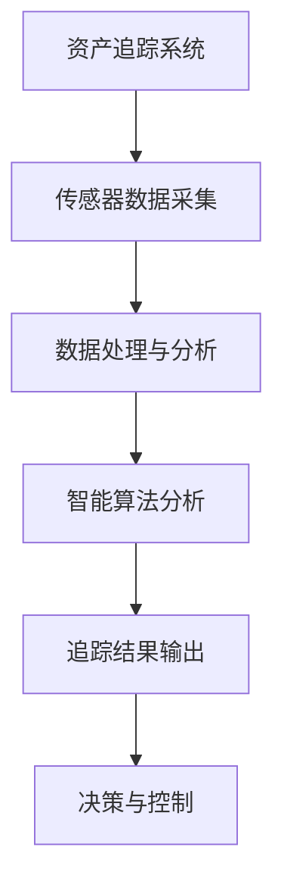
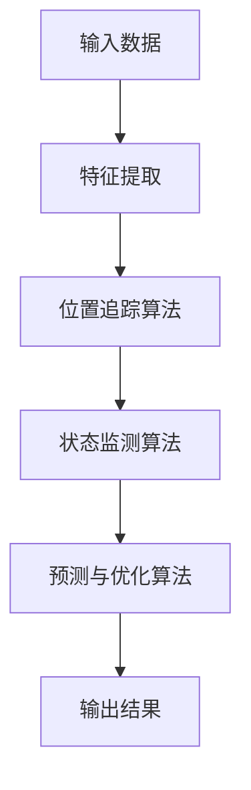

                 

### 智能资产追踪：物联网技术在供应链管理中的应用

> **关键词**：智能资产追踪、物联网、供应链管理、传感器、数据采集、算法、系统架构、部署与实施、安全与隐私保护

> **摘要**：本文深入探讨了智能资产追踪在物联网技术支持下的供应链管理中的应用。首先，我们介绍了智能资产追踪的定义和背景，随后详细解析了物联网技术在供应链管理中的重要作用。接着，我们阐述了智能资产追踪系统所需的关键技术和算法，以及系统的整体架构设计。在具体实施方面，本文讨论了系统的部署与实施流程，并着重介绍了安全与隐私保护措施。最后，我们对智能资产追踪技术的未来发展趋势进行了展望。

## 确定章节内容

为了深入探讨智能资产追踪及其在供应链管理中的应用，我们需要明确本书的各个章节内容。以下是各章节的主要概述：

### 第一部分：背景与基础

#### 第1章：智能资产追踪概述

- **智能资产追踪的定义**：介绍智能资产追踪的基本概念，解释其如何通过技术手段提高资产管理的效率和准确性。
- **智能资产追踪的发展背景**：分析智能资产追踪技术的起源、发展历程以及当前的技术成熟度。
- **物联网技术在智能资产追踪中的作用**：探讨物联网技术如何为智能资产追踪提供支持，并介绍关键的技术组件。

#### 第2章：物联网技术基础

- **物联网技术概述**：介绍物联网的基本概念、架构和主要技术，如传感器、网络通信和数据传输。
- **传感器与数据采集**：详细解释传感器的工作原理、种类和选择，以及数据采集过程中的挑战和解决方案。
- **网络通信与数据传输**：讨论物联网中的通信协议、网络架构和数据处理技术，重点介绍数据传输的可靠性和实时性。

#### 第3章：供应链管理概述

- **供应链管理的定义与流程**：介绍供应链管理的基本概念、关键环节和核心流程。
- **物流管理的关键环节**：分析物流管理中的关键环节，如仓储管理、运输管理和配送管理。
- **物联网技术在供应链管理中的应用**：探讨物联网技术如何提高供应链管理的效率和透明度，包括库存管理、需求预测和实时监控等方面。

### 第二部分：关键技术

#### 第4章：智能资产追踪算法

- **智能资产追踪算法概述**：介绍智能资产追踪算法的基本概念、类型和功能。
- **位置追踪算法**：讨论位置追踪算法的原理、实现和优化方法，包括卡尔曼滤波、粒子滤波等。
- **状态监测算法**：阐述状态监测算法的基本原理、适用场景和实现方法，如多传感器数据融合、异常检测等。
- **预测与优化算法**：介绍预测与优化算法在智能资产追踪中的应用，包括需求预测、路径优化和资源分配等。

#### 第5章：数据处理与分析

- **数据处理流程**：详细解析智能资产追踪系统的数据处理流程，包括数据采集、传输、存储和预处理等环节。
- **数据清洗与预处理**：讨论数据清洗和预处理的重要性，介绍常见的数据清洗方法和预处理技术。
- **数据分析与挖掘**：探讨数据分析与挖掘技术在智能资产追踪中的应用，包括数据可视化、聚类分析和机器学习等。

#### 第6章：智能资产追踪系统架构

- **系统架构设计原则**：介绍智能资产追踪系统架构设计的原则和最佳实践。
- **系统模块划分**：详细说明智能资产追踪系统的模块划分，包括传感器模块、数据采集模块、数据处理模块和决策模块等。
- **系统集成与部署**：讨论系统集成与部署的步骤和注意事项，包括硬件设备的选择、软件平台的选择和部署策略等。

### 第三部分：实施与应用

#### 第7章：智能资产追踪系统的部署与实施

- **部署环境与工具**：介绍智能资产追踪系统所需的部署环境、硬件设备和软件工具。
- **系统实施流程**：详细描述智能资产追踪系统的实施流程，包括系统设计、设备安装、网络配置和数据连接等。
- **部署案例与经验分享**：分享实际部署案例和经验，包括项目规划、资源分配、进度控制和问题解决等。

#### 第8章：安全与隐私保护

- **智能资产追踪系统的安全挑战**：分析智能资产追踪系统面临的安全威胁和挑战，包括数据泄露、设备篡改和攻击等。
- **数据安全保护措施**：介绍数据安全保护的基本原则和常用技术，包括数据加密、访问控制和防火墙等。
- **隐私保护机制**：讨论隐私保护机制的设计和实现，包括匿名化处理、隐私计算和隐私协议等。

#### 第9章：未来趋势与展望

- **智能资产追踪技术的发展趋势**：展望智能资产追踪技术的未来发展趋势，包括新技术的引入、应用场景的拓展和产业生态的成熟等。
- **物联网技术在供应链管理中的未来应用**：讨论物联网技术在供应链管理中的未来应用前景，包括智能物流、智能仓储和智能供应链等。
- **智能资产追踪对供应链管理的潜在影响**：分析智能资产追踪技术对供应链管理的潜在影响，包括成本优化、效率提升和风险控制等。

### 附录：资源与工具

- **附录A：智能资产追踪相关资源**：提供智能资产追踪相关的文献、论文、书籍和在线资源。
- **附录B：物联网技术常用工具**：列举物联网技术中常用的开发工具、软件平台和硬件设备。
- **附录C：智能资产追踪系统开源项目**：介绍一些智能资产追踪系统相关的开源项目，包括源代码、文档和社区资源。

### Mermaid 流程图

为了更好地理解智能资产追踪系统的整体架构和数据流动，我们使用Mermaid语法绘制了两个关键流程图。

- **智能资产追踪系统的 Mermaid 流程图**：



- **智能资产追踪算法原理的 Mermaid 流程图**：



### 伪代码示例

为了帮助读者更好地理解智能资产追踪算法的原理，我们提供了一个简单的伪代码示例。

```python
# 位置追踪算法伪代码
def track_location(data):
    # 数据预处理
    processed_data = preprocess_data(data)
    
    # 使用卡尔曼滤波算法进行位置追踪
    location = kalman_filter(processed_data)
    
    return location
```

### 数学模型和公式

在智能资产追踪中，数学模型和公式是不可或缺的部分。以下是一个简单的数学模型和公式的示例。

$$
x_t = A_t x_{t-1} + B_t u_t + w_t
$$

$$
y_t = C_t x_t + v_t
$$

这些公式通常用于位置追踪和状态估计中。

### 代码实例

为了更好地展示智能资产追踪的实际应用，我们提供了一个简单的Python代码实例，使用卡尔曼滤波算法进行位置追踪。

```python
# 实际案例：使用 Python 实现智能资产追踪系统

import numpy as np

# 初始化卡尔曼滤波器参数
A = np.array([[1, 1], [0, 1]])
B = np.array([[1], [0]])
C = np.array([[1], [0]])

# 假设输入的数据
x0 = np.array([[0], [0]])

# 初始化卡尔曼滤波器的预测值和估计值
xhat = np.array([[0], [0]])
phat = np.array([[1], [0]])

# 模拟数据采集过程
for i in range(10):
    # 输入数据
    x_input = np.array([[x0[0, 0] + np.random.normal(0, 0.1)], [x0[1, 0] + np.random.normal(0, 0.1)]])

    # 预测
    x_pred = A @ xhat
    p_pred = A @ phat @ A.T + Q

    # 更新
    K = phat @ C.T @ (C @ phat @ C.T + R)^(-1)
    xhat = x_pred + K @ (y - C @ x_pred)
    phat = (I - K @ C) @ p_pred

    # 输出结果
    print(f"Time {i}: Position x = {xhat[0, 0]:.2f}, Position y = {xhat[1, 0]:.2f}")

    # 更新输入数据
    x0 = xhat
```

通过上述示例，读者可以了解到如何使用Python实现一个简单的智能资产追踪系统，包括数据预处理、卡尔曼滤波器的初始化、预测和更新过程。

### 最佳实践 Tips、小结、注意事项、拓展阅读

- **最佳实践 Tips**：在部署智能资产追踪系统时，应充分考虑系统的可扩展性、可靠性和安全性。选择合适的硬件设备和软件平台，确保系统能够满足实际需求。此外，定期进行系统维护和更新，以保持系统的稳定性和先进性。

- **小结**：智能资产追踪技术在供应链管理中具有广泛的应用前景，通过物联网技术和先进算法的支持，可以有效提高资产管理的效率和准确性。然而，在部署和应用智能资产追踪系统时，需要关注系统的安全性、数据隐私和可靠性等问题。

- **注意事项**：在设计和实施智能资产追踪系统时，应注意以下几个方面：
  - 选择合适的传感器和数据采集设备，确保数据的准确性和实时性。
  - 设计合理的系统架构，确保系统模块之间的协调和高效运行。
  - 关注数据安全和隐私保护，采用加密、访问控制和隐私计算等技术。
  - 定期对系统进行性能评估和优化，以保持系统的稳定性和高效性。

- **拓展阅读**：对于希望深入了解智能资产追踪和物联网技术的读者，以下是一些推荐的拓展阅读资源：
  - 《物联网技术与应用》
  - 《智能交通系统设计与应用》
  - 《机器学习与数据挖掘》
  - 《卡尔曼滤波与数据融合》

通过阅读这些书籍和论文，读者可以进一步了解相关领域的深入知识和应用实践。

---

本文作为一篇专业IT领域的技术博客，旨在为读者提供一个系统而全面的智能资产追踪技术指南。从背景介绍到关键技术解析，再到实际应用案例和最佳实践，我们希望能够帮助读者深入理解智能资产追踪技术在物联网和供应链管理中的应用。希望本文能够为您的学习和实践提供有益的参考。感谢阅读！

**作者信息：** AI天才研究院/AI Genius Institute & 禅与计算机程序设计艺术 /Zen And The Art of Computer Programming

