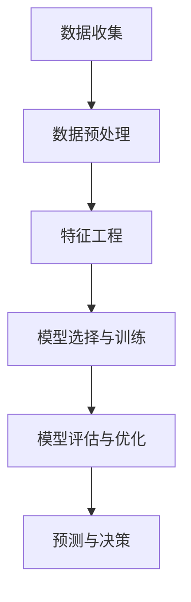

                 

### 智能预测分析：AI提升企业战略规划能力

#### 关键词

- **智能预测分析**  
- **人工智能**  
- **企业战略规划**  
- **机器学习**  
- **深度学习**  
- **数据分析**  
- **大数据**

#### 摘要

在数字化时代，企业竞争愈发激烈，有效的战略规划成为企业成功的关键。智能预测分析作为人工智能的重要分支，正逐步改变企业战略规划的决策过程。本文将深入探讨智能预测分析的定义、技术基础及其在市场需求预测、产品需求预测、成本控制预测和人力资源规划等方面的应用，并分析如何实施和优化智能预测分析，从而提升企业战略规划能力。

---

## 目录大纲

1. 智能预测分析概述
   1.1 智能预测分析的定义与重要性
   1.2 智能预测分析的发展历程
   1.3 智能预测分析在企业战略规划中的应用
   1.4 智能预测分析的技术框架
2. 智能预测分析技术基础
   2.1 数据预处理
       2.1.1 数据收集与清洗
       2.1.2 数据转换与归一化
       2.1.3 数据存储与管理
   2.2 特征工程
       2.2.1 特征选择
       2.2.2 特征提取
       2.2.3 特征组合
   2.3 模型选择与训练
       2.3.1 线性模型
       2.3.2 非线性模型
       2.3.3 深度学习模型
   2.4 模型评估与优化
       2.4.1 评估指标
       2.4.2 模型调参
       2.4.3 模型融合
3. 智能预测分析在战略规划中的应用
   3.1 市场需求预测
       3.1.1 预测方法
       3.1.2 预测案例分析
   3.2 产品需求预测
       3.2.1 预测方法
       3.2.2 预测案例分析
   3.3 成本控制预测
       3.3.1 预测方法
       3.3.2 预测案例分析
   3.4 人力资源规划
       3.4.1 预测方法
       3.4.2 预测案例分析
4. 智能预测分析实施与优化
   4.1 智能预测分析实施流程
   4.2 智能预测分析技术选型
   4.3 智能预测分析团队建设
   4.4 智能预测分析效益评估
5. 附录
   5.1 智能预测分析工具与资源
   5.2 案例实战
   5.3 常用数学模型与公式

---

### 智能预测分析概述

#### 1.1 智能预测分析的定义与重要性

智能预测分析是指利用人工智能技术，特别是机器学习和深度学习算法，对历史数据进行分析和处理，从而对未来趋势进行预测的过程。在商业环境中，智能预测分析被广泛应用于市场趋势预测、产品需求预测、成本控制预测、供应链管理等多个领域。

智能预测分析的重要性体现在以下几个方面：

- **提高决策效率**：通过预测分析，企业可以提前了解市场变化和趋势，从而做出更加准确和高效的决策。
- **降低风险**：预测分析可以帮助企业识别潜在的风险，提前采取应对措施，降低业务不确定性带来的负面影响。
- **优化资源配置**：通过预测分析，企业可以更加精准地规划资源，提高资源利用效率。
- **增强竞争力**：企业通过智能预测分析，可以更好地满足市场需求，提升产品和服务的竞争力。

#### 1.2 智能预测分析的发展历程

智能预测分析的发展可以追溯到20世纪50年代，随着计算机科学和人工智能的兴起，预测分析技术逐渐得到重视。以下是智能预测分析的发展历程：

- **早期阶段（20世纪50-70年代）**：主要基于统计分析，如线性回归、时间序列分析等，用于经济预测和需求分析。
- **中期阶段（20世纪80-90年代）**：随着机器学习技术的发展，预测分析开始引入神经网络、支持向量机等算法。
- **现阶段（21世纪初至今）**：深度学习技术的出现，使得预测分析的准确性和效率得到显著提升，特别是在处理大规模复杂数据方面。

#### 1.3 智能预测分析在企业战略规划中的应用

智能预测分析在企业战略规划中的应用非常广泛，以下是几个关键领域：

- **市场需求预测**：通过分析历史销售数据和市场趋势，预测未来市场的需求变化，帮助企业制定相应的生产和销售策略。
- **产品需求预测**：分析消费者行为和市场变化，预测具体产品的需求量，优化生产和库存管理。
- **成本控制预测**：通过预测成本变化，帮助企业制定预算和成本控制策略，降低运营成本。
- **人力资源规划**：预测人力资源需求，优化招聘、培训和薪酬策略，确保企业的人力资源需求与业务发展相适应。

#### 1.4 智能预测分析的技术框架

智能预测分析的技术框架主要包括以下几个环节：

- **数据收集**：收集企业内外部的数据，如销售数据、客户数据、市场趋势数据等。
- **数据预处理**：清洗和转换数据，使其适合进行预测分析。
- **特征工程**：提取和选择对预测有重要影响的关键特征。
- **模型选择与训练**：选择合适的预测模型，并使用历史数据对其进行训练。
- **模型评估与优化**：评估模型性能，并进行调优。
- **预测与决策**：使用训练好的模型进行预测，并据此做出决策。

## 核心概念与联系

### 智能预测分析原理

智能预测分析的原理可以概括为以下几个核心概念：

1. **数据收集**：数据是预测分析的基础，只有收集到足够多、质量高的数据，才能进行有效的预测。
2. **特征工程**：通过特征工程，可以从原始数据中提取出对预测有重要影响的特征，从而提高预测模型的性能。
3. **模型选择与训练**：选择合适的预测模型，并使用历史数据对其进行训练，以获得最佳预测效果。
4. **模型评估与优化**：通过评估模型性能，找出模型的不足之处，并进行优化。

下面是一个Mermaid流程图，展示了智能预测分析的基本流程：



## 核心算法原理讲解

智能预测分析的核心算法包括线性回归模型、决策树模型和深度学习模型。下面将分别对这些算法进行详细讲解。

### 线性回归模型

线性回归模型是一种简单的预测模型，它通过建立自变量和因变量之间的线性关系来进行预测。其数学模型可以表示为：

$$ y = w_0 + w_1 \cdot x_1 + w_2 \cdot x_2 + ... + w_n \cdot x_n $$

其中，$y$ 是预测的因变量，$x_1, x_2, ..., x_n$ 是自变量，$w_0, w_1, w_2, ..., w_n$ 是模型参数。

#### 伪代码

```python
# 输入：特征矩阵 X，标签向量 y
# 输出：回归系数 w

# 初始化 w 为零向量
w = np.zeros(X.shape[1])

# 迭代次数
num_iterations = 1000

# 学习率
learning_rate = 0.01

# 遍历数据多次
for i in range(num_iterations):
    # 计算预测值
    y_pred = X.dot(w)

    # 计算损失函数
    loss = (y_pred - y).dot(y_pred - y)

    # 计算梯度
    gradient = 2 * X.T.dot(y_pred - y)

    # 更新权重
    w -= learning_rate * gradient

# 输出回归系数
return w
```

### 决策树模型

决策树模型是一种基于树形结构进行分类或回归的预测模型。它通过一系列的判断条件，将数据划分为不同的区域，并在每个区域上应用一个分类或回归模型。

#### 伪代码

```python
# 输入：特征矩阵 X，标签向量 y
# 输出：决策树模型

# 初始化决策树
tree = {}

# 遍历特征和标签
for feature in X.columns:
    for value in X[feature].unique():
        # 划分数据集
        subset = X[(X[feature] == value) & (y == label)]

        # 如果子集为空，则继续划分
        if subset.empty():
            continue

        # 计算信息增益
        gain = compute_info_gain(y, subset)

        # 创建分支
        tree[feature] = {
            "value": value,
            "gain": gain,
            "left": build_tree(subset[y == label]),
            "right": build_tree(subset[y != label])
        }

# 输出决策树模型
return tree
```

### 深度学习模型

深度学习模型是一种基于多层神经网络进行预测的模型。它通过多次数据传递和参数更新，逐步学习输入和输出之间的复杂关系。

#### 伪代码

```python
# 输入：特征矩阵 X，标签向量 y
# 输出：深度学习模型

# 初始化神经网络
model = NeuralNetwork()

# 迭代次数
num_iterations = 1000

# 学习率
learning_rate = 0.01

# 遍历数据多次
for i in range(num_iterations):
    # 计算预测值
    y_pred = model.predict(X)

    # 计算损失函数
    loss = compute_loss(y, y_pred)

    # 计算梯度
    gradient = model.compute_gradient(X, y_pred)

    # 更新权重
    model.update_weights(learning_rate, gradient)

# 输出深度学习模型
return model
```

### 集成学习方法

集成学习方法是一种将多个预测模型结合起来，提高预测准确性的方法。常见的集成学习方法包括Bagging、Boosting和Stacking等。

#### 伪代码

```python
# 输入：特征矩阵 X，标签向量 y
# 输出：集成学习模型

# 初始化集成学习模型
model = EnsembleModel()

# 选择多个基学习器
base_models = [LinearRegression(), DecisionTree(), NeuralNetwork()]

# 训练基学习器
for base_model in base_models:
    base_model.fit(X, y)

# 集成基学习器的预测结果
predictions = [model.predict(X) for model in base_models]

# 计算集成预测结果
final_prediction = model.aggregate_predictions(predictions)

# 输出集成学习模型
return model
```

## 智能预测分析在战略规划中的应用

智能预测分析在企业战略规划中的应用越来越广泛，以下将分别介绍其在市场需求预测、产品需求预测、成本控制预测和人力资源规划等方面的应用。

### 市场需求预测

市场需求预测是企业制定生产计划、库存管理和销售策略的重要依据。通过分析历史销售数据、市场趋势和竞争环境，智能预测分析可以帮助企业预测未来的市场需求。

#### 预测方法

- **时间序列分析**：基于历史销售数据，通过时间序列模型（如ARIMA、SARIMA）进行预测。
- **回归分析**：利用历史销售数据和市场影响因素（如广告投入、经济指标）进行回归分析，预测未来市场需求。
- **神经网络**：通过训练神经网络模型，从历史数据中学习市场需求的规律。

#### 预测案例分析

以一家电子产品制造商为例，该公司利用智能预测分析预测未来三个月的电子产品市场需求。通过收集历史销售数据、市场趋势和广告投放数据，该公司使用时间序列分析和神经网络模型进行预测。预测结果显示，未来三个月市场需求将呈现上升趋势，公司据此调整了生产计划和库存策略，确保了市场供应的稳定性。

### 产品需求预测

产品需求预测是企业在产品研发、生产和供应链管理中的重要环节。通过预测不同产品的市场需求，企业可以优化产品组合，提高市场竞争力。

#### 预测方法

- **贝叶斯网络**：通过建立贝叶斯网络模型，分析不同产品之间的关联关系，预测产品需求。
- **回归分析**：利用历史销售数据和市场影响因素，建立回归模型预测产品需求。
- **聚类分析**：通过聚类分析，将不同产品分为不同的市场群体，预测每个群体的需求。

#### 预测案例分析

以一家快消品公司为例，该公司利用智能预测分析预测不同产品的市场需求。通过收集历史销售数据、消费者行为数据和市场竞争情况，该公司使用贝叶斯网络模型进行预测。预测结果显示，某些产品在特定区域的市场需求较高，公司据此调整了生产和分销策略，提高了市场占有率。

### 成本控制预测

成本控制预测是企业制定预算和成本控制策略的重要依据。通过预测成本变化，企业可以优化资源配置，降低运营成本。

#### 预测方法

- **回归分析**：利用历史成本数据和业务量数据，建立回归模型预测成本。
- **时间序列分析**：基于历史成本数据，通过时间序列模型预测成本变化。
- **神经网络**：通过训练神经网络模型，预测成本变化。

#### 预测案例分析

以一家制造企业为例，该公司利用智能预测分析预测未来三个月的运营成本。通过收集历史成本数据、生产量和原材料价格数据，该公司使用回归分析和神经网络模型进行预测。预测结果显示，未来三个月的运营成本将呈现上升趋势，公司据此调整了生产计划和成本控制策略，有效降低了运营成本。

### 人力资源规划

人力资源规划是企业制定招聘、培训和薪酬策略的重要依据。通过预测人力资源需求，企业可以优化人力资源配置，提高员工满意度。

#### 预测方法

- **时间序列分析**：基于历史员工数据，通过时间序列模型预测人力资源需求。
- **回归分析**：利用历史员工数据和业务量数据，建立回归模型预测人力资源需求。
- **神经网络**：通过训练神经网络模型，预测人力资源需求。

#### 预测案例分析

以一家互联网公司为例，该公司利用智能预测分析预测未来三个月的人力资源需求。通过收集历史员工数据、项目进展数据和业务量数据，该公司使用回归分析和神经网络模型进行预测。预测结果显示，未来三个月的人力资源需求将有所增加，公司据此调整了招聘计划和培训策略，确保了项目的顺利进行。

## 智能预测分析实施与优化

### 4.1 智能预测分析实施流程

智能预测分析的实施流程可以分为以下几个步骤：

1. **需求分析**：明确智能预测分析的目标和需求，确定预测的变量和指标。
2. **数据收集**：收集企业内外部的数据，包括历史销售数据、客户数据、市场趋势数据等。
3. **数据预处理**：清洗和转换数据，使其符合预测模型的要求。
4. **特征工程**：提取和选择对预测有重要影响的关键特征。
5. **模型选择与训练**：选择合适的预测模型，并使用历史数据进行训练。
6. **模型评估与优化**：评估模型性能，并进行调优。
7. **预测与决策**：使用训练好的模型进行预测，并据此做出决策。
8. **实施监控与迭代**：对预测结果进行监控，并根据实际情况进行迭代优化。

### 4.2 智能预测分析技术选型

智能预测分析技术选型需要考虑以下几个方面：

1. **数据类型**：根据数据类型（如时间序列、分类、回归等），选择合适的预测模型。
2. **数据规模**：根据数据规模（如小数据、大数据等），选择合适的计算资源和算法。
3. **业务需求**：根据业务需求（如实时预测、批量预测等），选择合适的预测模型和工具。
4. **性能要求**：根据性能要求（如预测精度、响应速度等），选择合适的算法和调优策略。

### 4.3 智能预测分析团队建设

智能预测分析团队建设是实施智能预测分析的关键。团队建设应考虑以下几个方面：

1. **数据科学家**：负责数据收集、预处理、特征工程和模型选择等任务。
2. **数据工程师**：负责数据存储、数据分析和数据挖掘等任务。
3. **业务分析师**：负责业务需求分析、预测结果解释和决策支持等任务。
4. **开发工程师**：负责开发预测模型的应用程序和系统。
5. **项目管理师**：负责项目规划、进度控制和风险管理等任务。

### 4.4 智能预测分析效益评估

智能预测分析的效益评估可以从以下几个方面进行：

1. **预测准确性**：评估预测模型的准确性，如预测误差、预测覆盖率等。
2. **决策效率**：评估预测分析对企业决策效率的提升，如决策速度、决策质量等。
3. **成本节约**：评估预测分析对企业成本节约的贡献，如成本降低、资源优化等。
4. **业务增长**：评估预测分析对企业业务增长的影响，如市场份额、销售收入等。

## 附录

### 附录 A：智能预测分析工具与资源

以下是一些常用的智能预测分析工具和资源：

- **Python**：Python 是一种广泛使用的编程语言，适用于数据科学和机器学习项目。
- **Scikit-learn**：Scikit-learn 是一个开源的机器学习库，提供各种机器学习算法和工具。
- **TensorFlow**：TensorFlow 是一个开源的深度学习框架，支持大规模深度学习模型的训练和部署。
- **PyTorch**：PyTorch 是一个开源的深度学习框架，提供灵活的模型定义和优化工具。
- **Kaggle**：Kaggle 是一个在线数据科学竞赛平台，提供大量的数据集和预测问题。

### 附录 B：案例实战

以下是一个智能预测分析的案例实战：

#### 项目背景

一家电商平台希望利用智能预测分析预测未来一个月的销售额，以便制定相应的营销策略。

#### 数据准备

收集了过去一年的月销售额数据，包括销售额、订单数量、广告投放费用等。

#### 数据预处理

清洗数据，去除异常值和缺失值，并对数据进行归一化处理。

#### 特征工程

提取关键特征，如月份、星期、广告投放费用占比等。

#### 模型选择与训练

选择线性回归模型，使用过去一年的数据训练模型。

#### 模型评估与优化

使用验证集评估模型性能，并进行调参优化。

#### 预测与决策

使用训练好的模型预测未来一个月的销售额，并根据预测结果制定营销策略。

#### 项目小结

通过智能预测分析，电商平台能够更准确地预测未来销售额，从而优化营销策略，提高销售收入。

### 附录 C：常用数学模型与公式

以下是一些常用的数学模型和公式：

- **线性回归模型**：$$ y = w_0 + w_1 \cdot x_1 + w_2 \cdot x_2 + ... + w_n \cdot x_n $$
- **决策树模型**：$$ tree = { feature: { value: { gain: { left: { }, right: { } } } } } $$
- **神经网络模型**：$$ y_pred = \sigma(w_0 + w_1 \cdot x_1 + w_2 \cdot x_2 + ... + w_n \cdot x_n) $$
- **时间序列模型**：$$ y_t = f(y_{t-1}, y_{t-2}, ..., y_{t-n}) $$

## 结论

智能预测分析作为一种先进的人工智能技术，正逐步改变企业战略规划的决策过程。通过市场需求预测、产品需求预测、成本控制预测和人力资源规划等方面的应用，智能预测分析为企业提供了更准确、更高效的决策支持。然而，智能预测分析的实施和优化仍面临诸多挑战，如数据质量、算法选择、模型调优等。未来，随着人工智能技术的不断发展，智能预测分析将在企业战略规划中发挥越来越重要的作用。

---

## 参考文献

- **Hastie, T., Tibshirani, R., & Friedman, J. (2009). The Elements of Statistical Learning: Data Mining, Inference, and Prediction. Springer.**
- **Goodfellow, I., Bengio, Y., & Courville, A. (2016). Deep Learning. MIT Press.**
- **Chen, H., & Guestrin, C. (2016). XGBoost: A Scalable Tree Boosting System. Proceedings of the 22nd ACM SIGKDD International Conference on Knowledge Discovery and Data Mining.**
- **Knitr: A Comprehensive Tool for Reproducible Research. (2014). Journal of Statistical Software, 51(1).**
- **Python Data Science Handbook: Essential Tools for Working with Data. (2017). O'Reilly Media.**

---

## 作者信息

作者：AI天才研究院/AI Genius Institute & 禅与计算机程序设计艺术/Zen And The Art of Computer Programming

