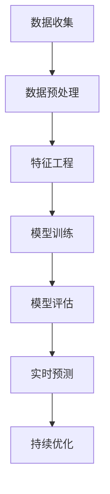
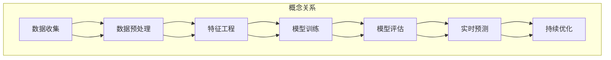

                 

### 智能预测性分析系统：AI增强业务预见性

## 关键词
- 智能预测性分析
- AI增强业务
- 业务预见性
- 数据分析
- 机器学习
- 深度学习
- 特征工程
- 预测模型
- 实时预测
- 案例分析

## 摘要
本文旨在探讨智能预测性分析系统的构建与应用，该系统通过AI技术增强业务预见性，帮助企业做出更为准确和及时的决策。文章首先介绍了智能预测性分析系统的概念、核心概念与联系，接着深入讲解了AI技术在预测性分析中的应用，包括机器学习、深度学习等核心算法原理。随后，文章重点阐述了数据预处理与特征工程的重要性，以及如何构建和评估预测模型。此外，文章还详细介绍了实时预测与优化、案例分析与应用实践，并展望了预测性分析系统的未来发展趋势。通过本文的阅读，读者将能够全面了解智能预测性分析系统的构建原理与实践技巧。

## 引言

### 智能预测性分析系统的背景

智能预测性分析系统，作为一个结合了人工智能（AI）与数据分析的技术框架，正在全球范围内得到越来越多的关注。其背景可以追溯到大数据时代的来临，企业对于海量数据处理的迫切需求，以及对未来业务走向的预知能力的渴望。随着计算能力的提升和算法的进步，AI技术开始广泛应用于各个行业，为智能预测性分析系统的发展提供了强大的动力。

在商业领域，智能预测性分析系统的重要性尤为突出。它能够帮助企业：

1. **提高业务预见性**：通过分析历史数据和实时数据，预测未来业务趋势，从而更好地规划资源、调整策略。
2. **优化决策**：提供基于数据的决策支持，降低决策风险，提高决策效率。
3. **提升客户满意度**：通过精准的客户行为预测，提供个性化的服务，增强客户黏性。
4. **降低运营成本**：通过预测性维护、库存优化等手段，减少不必要的开支。

随着AI技术的不断进步，智能预测性分析系统的应用场景也在不断扩展。从销售预测、客户流失预测，到市场趋势分析、供应链管理，智能预测性分析系统正在为各行各业带来深远的影响。

### AI在智能预测性分析系统中的应用

人工智能作为推动智能预测性分析系统发展的核心力量，其应用贯穿于系统的各个环节。以下是AI在智能预测性分析系统中的主要应用场景：

1. **数据预处理与清洗**：AI技术能够自动化地识别和处理数据中的异常值、缺失值，提高数据质量。
2. **特征工程**：通过机器学习和深度学习算法，自动提取和选择对预测任务最有影响力的特征，提升模型的预测精度。
3. **预测模型构建**：利用各种机器学习算法（如线性回归、决策树、神经网络等）和深度学习模型（如卷积神经网络、循环神经网络等），构建预测模型。
4. **实时预测与优化**：利用实时数据处理技术，实现模型的在线更新和实时预测，以提高系统的实时性和预测准确性。
5. **解释性分析**：通过可解释的人工智能技术，对预测结果进行解释，帮助决策者理解模型的预测依据。

### 智能预测性分析系统的工作原理

智能预测性分析系统的工作原理可以概括为以下几个步骤：

1. **数据收集**：收集历史数据和实时数据，这些数据可以是结构化的（如数据库记录）或非结构化的（如图像、文本等）。
2. **数据预处理**：清洗和整理数据，确保数据质量，并转换为适合模型训练的格式。
3. **特征工程**：提取和选择对预测任务有帮助的特征，并可能进行特征变换或降维。
4. **模型训练**：选择合适的机器学习或深度学习算法，训练预测模型。
5. **模型评估**：使用验证集或测试集评估模型的预测性能，调整模型参数以提高预测精度。
6. **实时预测**：在部署环境中，使用训练好的模型进行实时预测，并将预测结果提供给业务系统或决策者。
7. **持续优化**：根据实际预测结果和业务反馈，持续调整和优化模型，以提高系统的整体性能。

### 智能预测性分析系统的核心概念与联系

智能预测性分析系统涉及多个核心概念，这些概念相互关联，共同构成了一个完整的技术框架。以下是这些核心概念及其之间的联系：

1. **数据**：数据是智能预测性分析系统的核心资源，包括历史数据和实时数据。数据的质量直接影响预测结果的准确性。
2. **特征工程**：特征工程是数据预处理的一部分，通过对数据进行变换、选择和提取，生成对预测任务有价值的特征。
3. **机器学习模型**：机器学习模型是预测性分析系统的核心组件，通过学习数据中的模式和规律，生成预测模型。
4. **深度学习模型**：深度学习模型是机器学习的一种，通过多层神经网络结构，自动提取特征并生成预测。
5. **预测模型评估**：预测模型评估是模型训练的重要环节，通过评估模型在验证集或测试集上的表现，选择最优模型。
6. **实时预测**：实时预测是智能预测性分析系统的最终目标，通过在线预测，提供及时的业务决策支持。

这些核心概念之间的关系可以用一个Mermaid流程图来表示：



通过这个流程图，我们可以清晰地看到智能预测性分析系统的工作流程，以及各个环节之间的紧密联系。

### 总结

智能预测性分析系统是一个结合了人工智能与数据分析的强大工具，它能够帮助企业提高业务预见性，优化决策，提升客户满意度，降低运营成本。通过AI技术的应用，智能预测性分析系统实现了从数据收集、预处理、特征工程，到模型训练、评估、实时预测的全流程自动化。本文介绍了智能预测性分析系统的背景、应用、工作原理和核心概念，为读者提供了一个全面的技术框架。在接下来的章节中，我们将深入探讨AI技术的基础知识，包括机器学习和深度学习的核心算法原理，以及如何将这些算法应用于智能预测性分析系统中。

## 第1章：智能预测性分析系统概述

### 1.1 智能预测性分析的定义与作用

智能预测性分析系统是一种利用人工智能技术，通过分析历史数据、实时数据和外部信息，对未来的业务趋势和事件进行预测的系统。它不仅仅是一种技术工具，更是一种业务策略，能够帮助企业做出更为准确和及时的决策。

#### 定义

智能预测性分析的定义可以从以下几个方面来理解：

1. **数据驱动**：智能预测性分析依赖于大量历史数据和实时数据的分析，通过数据挖掘和模式识别技术，提取有价值的信息。
2. **人工智能技术**：智能预测性分析系统使用机器学习、深度学习等人工智能技术，对数据进行训练和预测。
3. **预测模型**：智能预测性分析系统通过构建预测模型，对未来事件进行概率预测或趋势分析。
4. **业务应用**：智能预测性分析系统将预测结果应用于业务决策，如销售预测、库存管理、市场趋势分析等。

#### 作用

智能预测性分析系统在商业领域的应用价值主要体现在以下几个方面：

1. **提高业务预见性**：通过预测未来业务趋势，企业可以提前规划资源、调整策略，降低业务风险。
2. **优化决策**：智能预测性分析系统提供基于数据的决策支持，帮助企业做出更为明智的决策，提高决策效率。
3. **提升客户满意度**：通过预测客户行为，企业可以提供个性化的服务，增强客户黏性，提高客户满意度。
4. **降低运营成本**：智能预测性分析系统通过预测性维护、库存优化等手段，减少不必要的开支，提高运营效率。

### 1.2 AI技术在预测性分析中的应用

AI技术是智能预测性分析系统的核心，其在预测性分析中的应用体现在以下几个方面：

1. **机器学习**：机器学习是AI的一个分支，通过训练模型，使计算机能够从数据中自动学习和发现规律。常见的机器学习算法包括线性回归、决策树、随机森林、支持向量机等。

2. **深度学习**：深度学习是机器学习的进一步发展，通过多层神经网络结构，自动提取特征并生成预测。常见的深度学习模型包括卷积神经网络（CNN）、循环神经网络（RNN）、长短时记忆网络（LSTM）等。

3. **强化学习**：强化学习是一种通过试错和反馈机制进行学习的方法，适用于动态和复杂环境的预测任务。通过不断尝试和调整策略，找到最优行动方案。

4. **自然语言处理**：自然语言处理（NLP）是AI的一个分支，用于理解和生成人类语言。在预测性分析中，NLP技术可以用于处理文本数据，提取语义信息，辅助预测模型。

5. **计算机视觉**：计算机视觉是AI的一个分支，用于处理和解释图像和视频数据。在预测性分析中，计算机视觉技术可以用于图像分类、目标检测、姿态估计等任务，为预测提供重要信息。

### 1.3 预测性分析系统的工作原理和架构

预测性分析系统的工作原理可以概括为以下几个步骤：

1. **数据收集**：收集与业务相关的各种数据，包括历史数据和实时数据。这些数据可以来自内部数据库、外部API、传感器等。

2. **数据预处理**：对收集到的数据进行清洗、转换和整合，使其符合预测模型的输入要求。数据预处理包括数据清洗、数据转换、数据归一化等步骤。

3. **特征工程**：从原始数据中提取有用的特征，并对特征进行变换和选择，以提高预测模型的性能。特征工程是预测性分析系统中的一个关键环节。

4. **模型训练**：选择合适的机器学习或深度学习算法，对数据进行训练，构建预测模型。训练过程包括模型初始化、参数调优、模型优化等步骤。

5. **模型评估**：使用验证集或测试集评估预测模型的性能，选择最优模型。模型评估指标包括准确率、召回率、F1值、均方误差等。

6. **实时预测**：在部署环境中，使用训练好的模型进行实时预测，并将预测结果提供给业务系统或决策者。实时预测需要高效的处理能力和快速响应。

7. **持续优化**：根据实时预测结果和业务反馈，持续调整和优化模型，以提高系统的整体性能。持续优化是确保预测系统长期有效的重要手段。

预测性分析系统的架构可以概括为以下几个部分：

1. **数据源**：包括内部数据库、外部API、传感器等，提供各种业务数据。

2. **数据处理模块**：负责数据的清洗、转换和整合，确保数据质量。

3. **特征工程模块**：负责从原始数据中提取有用特征，并进行特征变换和选择。

4. **机器学习模块**：包括各种机器学习和深度学习算法，用于模型训练和预测。

5. **模型评估模块**：负责评估模型的性能，选择最优模型。

6. **实时预测模块**：负责实时预测，并将预测结果输出给业务系统或决策者。

7. **用户界面**：提供用户交互界面，方便用户查看预测结果和调整模型参数。

### 1.4 智能预测性分析系统的核心概念与联系

智能预测性分析系统涉及多个核心概念，这些概念相互关联，共同构成了一个完整的技术框架。以下是这些核心概念及其之间的联系：

1. **数据**：数据是智能预测性分析系统的核心资源，包括历史数据和实时数据。数据的质量直接影响预测结果的准确性。

2. **特征工程**：特征工程是数据预处理的一部分，通过对数据进行变换、选择和提取，生成对预测任务有价值的特征。

3. **机器学习模型**：机器学习模型是预测性分析系统的核心组件，通过学习数据中的模式和规律，生成预测模型。

4. **深度学习模型**：深度学习模型是机器学习的一种，通过多层神经网络结构，自动提取特征并生成预测。

5. **预测模型评估**：预测模型评估是模型训练的重要环节，通过评估模型在验证集或测试集上的表现，选择最优模型。

6. **实时预测**：实时预测是智能预测性分析系统的最终目标，通过在线预测，提供及时的业务决策支持。

7. **持续优化**：持续优化是确保预测系统长期有效的重要手段，通过不断调整和优化模型，提高系统的整体性能。

以下是智能预测性分析系统的核心概念与联系架构的Mermaid流程图：



通过这个流程图，我们可以清晰地看到智能预测性分析系统的工作流程，以及各个环节之间的紧密联系。

### 小结

智能预测性分析系统通过AI技术，实现了对业务数据的深入分析和预测，为企业提供了强有力的决策支持。其核心概念包括数据、特征工程、机器学习模型、深度学习模型、预测模型评估、实时预测和持续优化。这些概念相互关联，共同构成了一个完整的技术框架。在接下来的章节中，我们将深入探讨这些核心概念的具体实现和应用。

## 第2章：AI技术基础

### 2.1 机器学习基础

机器学习（Machine Learning，ML）是人工智能（AI）的一个分支，它通过算法使计算机系统能够从数据中学习，从而做出预测或决策。在智能预测性分析系统中，机器学习技术扮演着至关重要的角色，它能够帮助系统从历史数据中提取模式和规律，进而预测未来的业务趋势。

#### 基本概念

1. **学习类型**：根据学习方式，机器学习可以分为以下几类：
   - **监督学习（Supervised Learning）**：通过标记的数据集来训练模型，使得模型能够学习数据中的特征和标签之间的关系。
   - **无监督学习（Unsupervised Learning）**：在没有标记的数据集上进行学习，目的是发现数据中的结构和模式。
   - **半监督学习（Semi-Supervised Learning）**：结合了监督学习和无监督学习的特点，使用少量的标记数据和大量的无标记数据来训练模型。
   - **强化学习（Reinforcement Learning）**：通过试错和反馈机制，使模型在动态环境中学习最优策略。

2. **算法类型**：机器学习算法可以分为以下几类：
   - **回归算法**：用于预测连续值输出，如线性回归、决策树回归、随机森林回归等。
   - **分类算法**：用于将数据分为不同的类别，如逻辑回归、支持向量机（SVM）、K最近邻（KNN）等。
   - **聚类算法**：用于发现数据中的自然分组，如K-means、层次聚类等。
   - **降维算法**：用于减少数据维度，同时保持数据结构，如主成分分析（PCA）、t-SNE等。

#### 工作原理

机器学习的工作原理可以概括为以下几个步骤：

1. **数据收集**：收集用于训练的数据集，数据集应包含特征和标签。
2. **数据预处理**：对数据进行清洗、归一化等处理，以确保数据质量。
3. **模型选择**：根据问题的性质选择合适的机器学习算法。
4. **模型训练**：使用训练数据集训练模型，调整模型参数。
5. **模型评估**：使用验证集或测试集评估模型的性能，调整模型参数以提高性能。
6. **模型部署**：将训练好的模型部署到实际应用环境中，进行预测或决策。

#### 示例

假设我们有一个销售预测问题，需要使用机器学习模型预测未来的销售额。以下是具体的步骤：

1. **数据收集**：收集过去一年的销售数据，包括日期、销售额、产品种类等。
2. **数据预处理**：对数据进行清洗，例如处理缺失值、异常值等，并对数据进行归一化处理。
3. **特征工程**：提取对预测任务有用的特征，例如季节性、促销活动等。
4. **模型选择**：选择一个合适的回归模型，例如线性回归或决策树回归。
5. **模型训练**：使用训练数据集训练模型，并调整模型参数。
6. **模型评估**：使用验证集评估模型的性能，例如计算均方误差（MSE）或R²值。
7. **模型部署**：将训练好的模型部署到生产环境中，进行实时销售预测。

#### Python实现

以下是一个简单的线性回归模型示例，用于预测销售额：

```python
import pandas as pd
from sklearn.linear_model import LinearRegression
from sklearn.model_selection import train_test_split
from sklearn.metrics import mean_squared_error

# 加载数据
data = pd.read_csv('sales_data.csv')
X = data[['date', 'product_type']]
y = data['sales']

# 数据预处理
X['date'] = pd.to_datetime(X['date'])
X['day_of_year'] = X['date'].dt.dayofyear
X = X.drop(['date'], axis=1)

# 特征工程
from sklearn.preprocessing import PolynomialFeatures
poly = PolynomialFeatures(degree=2)
X_poly = poly.fit_transform(X)

# 模型训练
model = LinearRegression()
model.fit(X_poly, y)

# 模型评估
X_test, y_test = train_test_split(X_poly, y, test_size=0.2, random_state=42)
y_pred = model.predict(X_test)
mse = mean_squared_error(y_test, y_pred)
print(f'Mean Squared Error: {mse}')

# 模型部署
# 在生产环境中，可以使用 model.predict() 方法进行实时销售预测
```

通过上述步骤，我们可以使用机器学习模型对销售数据进行分析，预测未来的销售额。

### 2.2 深度学习基础

深度学习（Deep Learning，DL）是机器学习的进一步发展，通过多层神经网络结构，自动提取特征并生成预测。在智能预测性分析系统中，深度学习技术能够处理更复杂的数据和更复杂的预测任务。

#### 基本概念

1. **神经网络（Neural Network）**：神经网络是深度学习的基础，它由多个节点（称为神经元）组成，每个节点通过权重连接，形成一个层次结构。
2. **激活函数（Activation Function）**：激活函数用于引入非线性，使得神经网络能够学习复杂的数据特征。常见的激活函数包括Sigmoid、ReLU、Tanh等。
3. **反向传播（Backpropagation）**：反向传播是一种用于训练神经网络的算法，它通过计算损失函数关于每个神经元的梯度，更新网络权重，以最小化损失函数。

#### 工作原理

深度学习的工作原理可以概括为以下几个步骤：

1. **数据收集**：收集用于训练的数据集，数据集应包含特征和标签。
2. **数据预处理**：对数据进行清洗、归一化等处理，以确保数据质量。
3. **模型构建**：构建多层神经网络结构，并设置网络参数，如神经元数量、连接权重等。
4. **模型训练**：使用训练数据集训练模型，通过反向传播算法更新网络权重。
5. **模型评估**：使用验证集或测试集评估模型的性能，调整模型参数以提高性能。
6. **模型部署**：将训练好的模型部署到实际应用环境中，进行预测或决策。

#### 示例

以下是一个简单的深度学习模型，用于预测销售额：

```python
import pandas as pd
import numpy as np
from sklearn.model_selection import train_test_split
from sklearn.preprocessing import MinMaxScaler
from tensorflow.keras.models import Sequential
from tensorflow.keras.layers import Dense, LSTM, Dropout
from tensorflow.keras.optimizers import Adam

# 加载数据
data = pd.read_csv('sales_data.csv')
X = data[['date', 'product_type']]
y = data['sales']

# 数据预处理
X['date'] = pd.to_datetime(X['date'])
X['day_of_year'] = X['date'].dt.dayofyear
X = X.drop(['date'], axis=1)

# 特征工程
scaler = MinMaxScaler(feature_range=(0, 1))
X_scaled = scaler.fit_transform(X)

# 切分数据
X_train, X_test, y_train, y_test = train_test_split(X_scaled, y, test_size=0.2, random_state=42)

# 构建模型
model = Sequential()
model.add(LSTM(units=50, return_sequences=True, input_shape=(X_train.shape[1], 1)))
model.add(Dropout(0.2))
model.add(LSTM(units=50, return_sequences=False))
model.add(Dropout(0.2))
model.add(Dense(units=1))

# 编译模型
model.compile(optimizer='adam', loss='mean_squared_error')

# 训练模型
model.fit(X_train, y_train, epochs=100, batch_size=32, validation_data=(X_test, y_test), verbose=1)

# 模型评估
y_pred = model.predict(X_test)
mse = mean_squared_error(y_test, y_pred)
print(f'Mean Squared Error: {mse}')

# 模型部署
# 在生产环境中，可以使用 model.predict() 方法进行实时销售预测
```

通过上述步骤，我们可以使用深度学习模型对销售数据进行分析，预测未来的销售额。

### 2.3 常见AI算法与模型介绍

在智能预测性分析系统中，常用的AI算法和模型包括以下几种：

1. **线性回归（Linear Regression）**：用于预测连续值输出，是最简单的机器学习算法之一。
2. **决策树（Decision Tree）**：用于分类和回归任务，通过树形结构进行决策。
3. **随机森林（Random Forest）**：是一种集成学习方法，通过构建多棵决策树并进行集成，提高预测性能。
4. **支持向量机（Support Vector Machine，SVM）**：用于分类任务，通过找到一个最优的超平面，将不同类别分离。
5. **K最近邻（K-Nearest Neighbors，KNN）**：用于分类任务，通过寻找最近的K个邻居，根据邻居的标签进行预测。
6. **卷积神经网络（Convolutional Neural Network，CNN）**：用于图像处理任务，通过卷积操作提取图像特征。
7. **循环神经网络（Recurrent Neural Network，RNN）**：用于序列数据处理任务，通过循环结构保持状态。
8. **长短时记忆网络（Long Short-Term Memory，LSTM）**：是RNN的一种变体，用于处理长序列数据，能够有效解决长短期依赖问题。

每种算法和模型都有其独特的特点和应用场景，选择合适的算法和模型对于构建高效和准确的预测系统至关重要。

### 小结

本章介绍了AI技术在智能预测性分析系统中的应用，包括机器学习和深度学习的基本概念、工作原理和常见算法。通过本章的学习，读者将能够理解AI技术在预测性分析系统中的核心作用，并掌握构建和部署预测模型的技巧。在下一章中，我们将深入探讨数据预处理与特征工程的重要性，以及如何进行有效的特征提取和选择。

## 第3章：数据预处理与特征工程

### 3.1 数据预处理的重要性

数据预处理（Data Preprocessing）是智能预测性分析系统构建过程中至关重要的一步。它的目的是提高数据质量，减少噪声和异常值，使数据更加适合机器学习和深度学习模型的训练。以下是数据预处理的重要性：

1. **提高模型性能**：高质量的数据能够使模型更好地学习数据中的模式和规律，从而提高模型的预测性能。
2. **减少过拟合**：通过数据预处理，可以消除数据中的噪声和异常值，降低模型对噪声的依赖，减少过拟合现象。
3. **加快训练速度**：数据预处理可以将数据转换为适合模型训练的格式，减少模型训练时间。
4. **增强数据解释性**：通过数据预处理，可以简化数据结构，使数据更加直观，有助于模型的可解释性。

### 3.2 数据预处理的方法

数据预处理的方法包括数据清洗、数据转换和数据归一化等。以下是几种常见的数据预处理方法：

1. **数据清洗**：
   - **处理缺失值**：可以通过删除缺失值、填补缺失值或使用统计学方法（如平均值、中位数等）来处理缺失值。
   - **处理异常值**：可以通过检测和删除异常值，或者使用统计学方法（如三次样条插值）来处理异常值。

2. **数据转换**：
   - **特征转换**：将某些特征转换为更适合机器学习模型的形式，例如将分类特征转换为数值特征。
   - **时间序列转换**：将时间序列数据转换为适合模型训练的形式，例如将时间序列数据转换为滞后项或差分序列。

3. **数据归一化**：
   - **归一化**：将数据缩放到一个特定的范围，例如[0, 1]或[-1, 1]，以消除不同特征之间的尺度差异。
   - **标准化**：将数据转换为均值为0、标准差为1的形式，以消除数据分布的影响。

### 3.3 特征工程的过程

特征工程（Feature Engineering）是数据预处理的一部分，它通过对数据进行变换、选择和提取，生成对预测任务有价值的特征。以下是特征工程的过程：

1. **特征变换**：
   - **非线性变换**：通过非线性变换（如对数变换、指数变换等）增加数据的复杂性，有助于模型更好地学习。
   - **特征组合**：通过组合多个特征生成新的特征，例如通过特征交叉或特征相乘生成新的特征。

2. **特征选择**：
   - **过滤式选择**：通过统计方法（如信息增益、卡方检验等）选择特征，不考虑特征之间的关系。
   - **包装式选择**：通过训练多个模型并评估每个特征的贡献，选择对预测任务最有影响的特征。
   - **嵌入式选择**：在训练过程中自动选择特征，如LASSO回归通过正则化项自动消除不重要特征。

3. **特征提取**：
   - **降维**：通过降维技术（如主成分分析PCA、t-SNE等）减少数据维度，同时保持数据结构。
   - **嵌入技术**：通过嵌入技术（如词嵌入、图嵌入等）提取特征，适用于非结构化数据。

### 3.4 特征工程技巧与实践

以下是几种常见的特征工程技巧：

1. **特征标准化**：
   - **目的**：消除不同特征之间的尺度差异，使模型训练更加稳定。
   - **方法**：使用归一化或标准化方法将特征缩放到相同的范围。

2. **特征组合**：
   - **目的**：通过组合多个特征生成新的特征，提高模型的预测性能。
   - **方法**：使用特征交叉、特征相乘或特征加和等方法生成新的特征。

3. **特征选择**：
   - **目的**：选择对预测任务最有影响的特征，减少模型训练时间和提高模型性能。
   - **方法**：使用过滤式选择、包装式选择或嵌入式选择等方法。

4. **特征提取**：
   - **目的**：通过降维或嵌入技术减少数据维度，提高模型训练效率。
   - **方法**：使用PCA、t-SNE或词嵌入等技术提取特征。

### 实践案例

以下是一个特征工程的实践案例，使用Python实现：

```python
import pandas as pd
from sklearn.preprocessing import StandardScaler, MinMaxScaler
from sklearn.feature_selection import SelectKBest, f_classif
from sklearn.decomposition import PCA

# 加载数据
data = pd.read_csv('data.csv')

# 数据清洗
data = data.dropna()  # 删除缺失值
data['feature1'] = data['feature1'].apply(lambda x: x**2)  # 特征变换

# 数据转换
data = data[['feature1', 'feature2', 'feature3', 'target']]
X = data[['feature1', 'feature2', 'feature3']]
y = data['target']

# 特征标准化
scaler = StandardScaler()
X_scaled = scaler.fit_transform(X)

# 特征选择
selector = SelectKBest(f_classif, k=2)
X_selected = selector.fit_transform(X_scaled, y)

# 特征提取
pca = PCA(n_components=2)
X_pca = pca.fit_transform(X_selected)

# 可视化
import matplotlib.pyplot as plt
plt.scatter(X_pca[:, 0], X_pca[:, 1], c=y)
plt.xlabel('PCA Feature 1')
plt.ylabel('PCA Feature 2')
plt.show()
```

通过上述步骤，我们可以对数据集进行特征工程处理，包括特征变换、特征选择和特征提取，从而提高模型训练的性能。

### 小结

数据预处理与特征工程是构建高效和准确预测模型的关键步骤。本章介绍了数据预处理的重要性、方法以及特征工程的过程、技巧和实践案例。通过本章的学习，读者将能够掌握数据预处理和特征工程的核心方法，并能够将其应用于实际项目中。在下一章中，我们将探讨预测模型的构建与评估。

## 第4章：预测模型构建与评估

### 4.1 预测模型构建流程

预测模型的构建是智能预测性分析系统的核心步骤，它决定了系统的预测性能和业务价值。以下是构建预测模型的流程：

1. **问题定义**：
   - **明确预测目标**：定义需要预测的业务指标，例如销售额、客户流失率、库存需求等。
   - **数据需求**：确定需要收集和处理的业务数据，包括历史数据和实时数据。

2. **数据收集**：
   - **数据源**：收集与预测目标相关的数据，数据可以来自内部系统、外部API、传感器等。
   - **数据清洗**：处理数据中的缺失值、异常值等，确保数据质量。

3. **特征工程**：
   - **特征提取**：从原始数据中提取对预测任务有帮助的特征。
   - **特征选择**：通过过滤式选择、包装式选择或嵌入式选择等方法，选择对预测任务最有影响的特征。
   - **特征变换**：对特征进行标准化、归一化等变换，以提高模型训练效果。

4. **模型选择**：
   - **算法评估**：评估不同算法（如线性回归、决策树、神经网络等）的性能。
   - **模型选择**：根据问题性质和性能评估结果，选择最适合的模型。

5. **模型训练**：
   - **训练集划分**：将数据集划分为训练集和验证集，用于模型训练和性能评估。
   - **参数调优**：通过交叉验证等方法，调整模型参数，提高模型性能。

6. **模型评估**：
   - **性能指标**：计算预测模型的性能指标，如准确率、召回率、均方误差等。
   - **交叉验证**：使用交叉验证方法，评估模型在不同数据集上的表现，确保模型泛化能力。

7. **模型部署**：
   - **模型集成**：将训练好的模型集成到业务系统中，实现实时预测。
   - **监控与维护**：监控模型性能，根据业务需求和数据变化，定期更新和优化模型。

### 4.2 预测模型评估方法

预测模型评估是模型训练的重要环节，它决定了模型的可靠性和实用性。以下是几种常见的预测模型评估方法：

1. **准确率（Accuracy）**：
   - **定义**：准确率是预测正确的样本数占总样本数的比例。
   - **计算公式**：$$\text{Accuracy} = \frac{\text{预测正确的样本数}}{\text{总样本数}}$$
   - **应用场景**：适用于分类问题，但易受不平衡数据集的影响。

2. **召回率（Recall）**：
   - **定义**：召回率是预测正确的正样本数占总正样本数的比例。
   - **计算公式**：$$\text{Recall} = \frac{\text{预测正确的正样本数}}{\text{总正样本数}}$$
   - **应用场景**：适用于分类问题，特别是在正样本数量较少的情况下。

3. **精确率（Precision）**：
   - **定义**：精确率是预测正确的正样本数占预测为正样本的样本数的比例。
   - **计算公式**：$$\text{Precision} = \frac{\text{预测正确的正样本数}}{\text{预测为正样本的样本数}}$$
   - **应用场景**：适用于分类问题，特别是在负样本数量较多的情况下。

4. **F1值（F1 Score）**：
   - **定义**：F1值是精确率和召回率的调和平均，综合考虑了分类的精度和召回率。
   - **计算公式**：$$\text{F1 Score} = 2 \times \frac{\text{Precision} \times \text{Recall}}{\text{Precision} + \text{Recall}}$$
   - **应用场景**：适用于分类问题，特别是在样本不平衡的情况下。

5. **均方误差（Mean Squared Error，MSE）**：
   - **定义**：均方误差是预测值与真实值之间差的平方的平均值。
   - **计算公式**：$$\text{MSE} = \frac{1}{n}\sum_{i=1}^{n}(\hat{y}_i - y_i)^2$$
   - **应用场景**：适用于回归问题，用于评估预测的精确度。

6. **均绝对误差（Mean Absolute Error，MAE）**：
   - **定义**：均绝对误差是预测值与真实值之间差的绝对值的平均值。
   - **计算公式**：$$\text{MAE} = \frac{1}{n}\sum_{i=1}^{n}|\hat{y}_i - y_i|$$
   - **应用场景**：适用于回归问题，用于评估预测的稳定性和精度。

7. **R²值（R-squared）**：
   - **定义**：R²值是模型解释的变异比例，用于衡量模型的拟合程度。
   - **计算公式**：$$\text{R}^2 = 1 - \frac{\sum_{i=1}^{n}(\hat{y}_i - y_i)^2}{\sum_{i=1}^{n}(y_i - \bar{y})^2}$$
   - **应用场景**：适用于回归问题，用于评估模型的拟合效果。

### 4.3 常用预测模型介绍

在智能预测性分析系统中，常用的预测模型包括以下几种：

1. **线性回归（Linear Regression）**：
   - **原理**：通过拟合线性关系模型，预测连续值输出。
   - **适用场景**：用于预测销售额、价格等连续值变量。

2. **逻辑回归（Logistic Regression）**：
   - **原理**：通过拟合逻辑函数模型，预测概率值，适用于二分类问题。
   - **适用场景**：用于预测客户流失、信用评分等二分类问题。

3. **决策树（Decision Tree）**：
   - **原理**：通过树形结构进行决策，适用于分类和回归问题。
   - **适用场景**：用于分类问题，如客户细分、疾病诊断等。

4. **随机森林（Random Forest）**：
   - **原理**：通过构建多棵决策树并进行集成，提高预测性能。
   - **适用场景**：用于分类和回归问题，特别是在样本不平衡的情况下。

5. **支持向量机（Support Vector Machine，SVM）**：
   - **原理**：通过找到一个最优的超平面，将不同类别分离。
   - **适用场景**：用于分类和回归问题，特别是在线性不可分问题中。

6. **K最近邻（K-Nearest Neighbors，KNN）**：
   - **原理**：通过寻找最近的K个邻居，根据邻居的标签进行预测。
   - **适用场景**：用于分类问题，适用于小样本和线性可分问题。

7. **神经网络（Neural Network）**：
   - **原理**：通过多层神经网络结构，自动提取特征并生成预测。
   - **适用场景**：用于复杂非线性预测问题，如图像识别、语音识别等。

8. **卷积神经网络（Convolutional Neural Network，CNN）**：
   - **原理**：通过卷积操作提取图像特征，适用于图像处理任务。
   - **适用场景**：用于图像分类、目标检测等图像处理任务。

9. **循环神经网络（Recurrent Neural Network，RNN）**：
   - **原理**：通过循环结构保持状态，适用于序列数据处理任务。
   - **适用场景**：用于时间序列预测、语言模型等序列数据处理任务。

10. **长短时记忆网络（Long Short-Term Memory，LSTM）**：
    - **原理**：是RNN的一种变体，能够有效解决长短期依赖问题。
    - **适用场景**：用于长序列数据预测，如股票价格预测、语音识别等。

### 4.4 预测模型评估与优化

预测模型评估与优化是确保模型性能和业务价值的关键环节。以下是几种常见的模型评估与优化方法：

1. **交叉验证（Cross-Validation）**：
   - **原理**：通过将数据集划分为多个子集，训练和评估多个模型，评估模型在不同数据集上的表现。
   - **方法**：常见的交叉验证方法包括K折交叉验证和留一交叉验证。

2. **网格搜索（Grid Search）**：
   - **原理**：通过遍历多个参数组合，评估不同参数组合下的模型性能，选择最佳参数组合。
   - **方法**：通过遍历参数空间，计算每个参数组合的评估指标，选择最佳参数组合。

3. **贝叶斯优化（Bayesian Optimization）**：
   - **原理**：基于贝叶斯统计模型，通过历史评估结果，优化参数搜索过程。
   - **方法**：通过构建概率模型，调整参数搜索方向，提高搜索效率。

4. **集成学习（Ensemble Learning）**：
   - **原理**：通过集成多个模型，提高预测性能和稳定性。
   - **方法**：常见的集成学习方法包括Bagging、Boosting和Stacking等。

5. **模型融合（Model Fusion）**：
   - **原理**：将多个预测结果进行融合，提高预测准确性和可靠性。
   - **方法**：常见的模型融合方法包括投票法、加权平均法、对数损失法等。

### 实践案例

以下是一个预测模型评估与优化的实践案例：

```python
import pandas as pd
from sklearn.linear_model import LinearRegression
from sklearn.model_selection import train_test_split, cross_val_score
from sklearn.metrics import mean_squared_error
from sklearn.model_selection import GridSearchCV

# 加载数据
data = pd.read_csv('data.csv')
X = data[['feature1', 'feature2', 'feature3']]
y = data['target']

# 划分训练集和测试集
X_train, X_test, y_train, y_test = train_test_split(X, y, test_size=0.2, random_state=42)

# 构建线性回归模型
model = LinearRegression()

# 交叉验证
scores = cross_val_score(model, X_train, y_train, cv=5)
print(f'Mean Squared Error: {scores.mean()}')

# 网格搜索
param_grid = {'fit_intercept': [True, False], 'normalize': [True, False]}
grid_search = GridSearchCV(model, param_grid, cv=5)
grid_search.fit(X_train, y_train)

print(f'Best Parameters: {grid_search.best_params_}')
print(f'Mean Squared Error: {grid_search.best_score_}')

# 使用最佳参数训练模型
best_model = grid_search.best_estimator_
best_model.fit(X_train, y_train)

# 测试模型
y_pred = best_model.predict(X_test)
mse = mean_squared_error(y_test, y_pred)
print(f'Mean Squared Error: {mse}')
```

通过上述步骤，我们可以对预测模型进行评估和优化，确保模型在测试集上的性能。

### 小结

预测模型的构建与评估是智能预测性分析系统的关键环节。本章介绍了预测模型构建的流程、评估方法以及常用预测模型。通过本章的学习，读者将能够掌握预测模型构建与评估的核心方法，并能够将其应用于实际项目中。在下一章中，我们将探讨实时预测与优化，以确保预测系统的实时性和准确性。

## 第5章：实时预测与优化

### 5.1 实时预测的原理与实现

实时预测（Real-Time Prediction）是智能预测性分析系统中的一个重要环节，它旨在为业务系统或决策者提供即时、准确的预测结果。实时预测的原理基于数据流的处理和分析，其核心在于快速响应和处理不断变化的数据，从而实现预测的实时性和准确性。

#### 实时预测的原理

1. **数据流处理**：实时预测系统通常采用数据流处理技术，如Apache Kafka、Apache Flink等，来处理和存储实时数据流。
2. **在线模型更新**：为了保持预测的准确性，实时预测系统需要定期更新预测模型。这可以通过在线学习或批量更新来实现，其中在线学习可以在不中断服务的情况下更新模型。
3. **预测引擎**：实时预测系统中的预测引擎负责接收实时数据流，应用训练好的预测模型进行预测，并将预测结果实时输出。

#### 实时预测的实现

1. **数据流接入**：实时预测系统首先需要接入实时数据源，例如传感器数据、交易数据等。这些数据可以通过API接口、消息队列或直接集成到业务系统中获取。

2. **数据预处理**：实时数据接入后，系统需要对数据进行预处理，包括数据清洗、特征提取等。预处理步骤确保数据质量，为后续的预测分析提供可靠的数据基础。

3. **模型应用**：预处理后的数据被传递到预测模型，模型根据历史数据和实时数据生成预测结果。这一过程通常涉及复杂的机器学习算法和深度学习模型。

4. **结果输出**：预测结果可以通过API接口、消息队列或直接集成到业务系统中输出，供业务系统或决策者使用。

### 5.2 预测模型优化方法

预测模型的优化是提高预测性能和系统效率的关键。以下是几种常见的预测模型优化方法：

1. **模型调优（Model Tuning）**：
   - **参数调整**：通过调整模型参数（如学习率、隐藏层节点数等），优化模型性能。
   - **算法选择**：选择合适的机器学习算法或深度学习算法，以适应不同的预测任务。

2. **特征选择（Feature Selection）**：
   - **过滤式特征选择**：通过计算特征的重要性或相关性，选择对预测任务最有影响的特征。
   - **嵌入式特征选择**：在训练过程中自动选择特征，例如LASSO回归通过正则化项自动消除不重要特征。

3. **数据预处理优化**：
   - **数据清洗**：消除数据中的噪声和异常值，提高数据质量。
   - **数据增强**：通过数据扩充、数据合成等方法，增加训练数据集的多样性。

4. **模型集成（Model Ensemble）**：
   - **集成学习**：通过集成多个模型（如随机森林、梯度提升等），提高预测性能和稳定性。
   - **模型融合**：将多个模型的预测结果进行融合，提高预测准确性和可靠性。

5. **分布式计算**：
   - **分布式处理**：通过分布式计算框架（如Apache Spark、Dask等），提高数据处理和预测的速度。
   - **并行计算**：在模型训练和预测过程中，采用并行计算方法，加速计算过程。

### 5.3 实时预测系统的构建

构建实时预测系统需要考虑以下几个方面：

1. **技术选型**：
   - **数据处理框架**：选择适合实时数据处理的技术框架，如Apache Kafka、Apache Flink等。
   - **预测引擎**：选择适合实时预测的机器学习库或深度学习框架，如scikit-learn、TensorFlow等。

2. **系统架构**：
   - **数据接入**：设计数据接入模块，实现实时数据流的接入和处理。
   - **数据预处理**：设计数据预处理模块，确保数据质量，为预测模型提供可靠的数据基础。
   - **预测模块**：设计预测模块，实现实时预测功能，并保证预测结果的可解释性。
   - **结果输出**：设计结果输出模块，将预测结果实时输出到业务系统或决策者。

3. **性能优化**：
   - **模型优化**：通过模型调优、特征选择等手段，提高预测性能。
   - **系统优化**：通过分布式计算、并行计算等手段，提高系统效率和响应速度。

### 5.4 实时预测结果的可视化与解释

实时预测结果的可视化和解释对于决策者理解预测结果和指导业务决策至关重要。以下是几种常见的实时预测结果的可视化和解释方法：

1. **数据可视化**：
   - **折线图**：用于展示时间序列数据的趋势和变化。
   - **柱状图**：用于展示分类数据的分布情况。
   - **散点图**：用于展示数据点的分布和相关性。

2. **预测结果可视化**：
   - **预测趋势图**：用于展示预测结果的趋势和波动。
   - **预测概率图**：用于展示预测结果的概率分布。
   - **预测误差图**：用于展示预测误差的分布和趋势。

3. **可解释性分析**：
   - **特征重要性分析**：通过计算特征的重要性，帮助决策者理解模型对数据的依赖程度。
   - **模型解释**：通过可视化模型结构、参数等，帮助决策者理解模型的工作原理。

### 实践案例

以下是一个实时预测系统的实践案例，使用Python和TensorFlow实现：

```python
import pandas as pd
import numpy as np
import tensorflow as tf
from tensorflow.keras.models import Sequential
from tensorflow.keras.layers import Dense, LSTM
from tensorflow.keras.optimizers import Adam
from sklearn.model_selection import train_test_split
from sklearn.preprocessing import MinMaxScaler

# 加载数据
data = pd.read_csv('data.csv')
X = data[['feature1', 'feature2', 'feature3']]
y = data['target']

# 数据预处理
scaler = MinMaxScaler(feature_range=(0, 1))
X_scaled = scaler.fit_transform(X)
y_scaled = scaler.fit_transform(y.values.reshape(-1, 1))

# 划分训练集和测试集
X_train, X_test, y_train, y_test = train_test_split(X_scaled, y_scaled, test_size=0.2, random_state=42)

# 构建模型
model = Sequential()
model.add(LSTM(units=50, return_sequences=True, input_shape=(X_train.shape[1], 1)))
model.add(Dropout(0.2))
model.add(LSTM(units=50, return_sequences=False))
model.add(Dropout(0.2))
model.add(Dense(units=1))

# 编译模型
model.compile(optimizer=Adam(learning_rate=0.001), loss='mean_squared_error')

# 训练模型
model.fit(X_train, y_train, epochs=100, batch_size=32, validation_split=0.2, verbose=1)

# 实时预测
X_real_time = scaler.transform(np.array([real_time_data]))
y_pred_real_time = model.predict(X_real_time)

# 可视化
import matplotlib.pyplot as plt

plt.plot(y_test, label='Actual')
plt.plot(y_pred_real_time, label='Predicted')
plt.xlabel('Time')
plt.ylabel('Target')
plt.legend()
plt.show()
```

通过上述步骤，我们可以实现一个实时预测系统，对实时数据进行预测，并将预测结果可视化展示。

### 小结

实时预测与优化是智能预测性分析系统的关键环节，它确保了系统在快速变化的环境中的实时性和准确性。本章介绍了实时预测的原理与实现、预测模型优化方法、实时预测系统的构建以及实时预测结果的可视化和解释。通过本章的学习，读者将能够理解实时预测的核心概念和方法，并能够将其应用于实际项目中。在下一章中，我们将通过具体案例分析，深入探讨智能预测性分析系统的实际应用。

## 第6章：案例分析与应用实践

### 6.1 案例分析概述

智能预测性分析系统的实际应用案例多种多样，涵盖了零售、金融、医疗、制造业等多个领域。在本章中，我们将通过几个实际案例，深入探讨智能预测性分析系统的应用场景、构建过程和实际效果。

### 6.2 案例一：销售预测

#### 案例背景

一家大型零售企业在日常运营中需要预测未来的销售情况，以便更好地安排库存和规划营销策略。为了实现这一目标，企业决定构建一个智能预测性分析系统。

#### 案例构建过程

1. **数据收集**：收集过去一年的销售数据，包括日期、销售额、产品种类等。
2. **数据预处理**：对数据进行清洗，处理缺失值和异常值，并对数据进行归一化处理。
3. **特征工程**：提取对销售预测有帮助的特征，如季节性、促销活动等。
4. **模型选择**：选择一个合适的预测模型，如线性回归、随机森林等。
5. **模型训练**：使用训练数据集训练模型，并使用交叉验证方法调整模型参数。
6. **模型评估**：使用验证集评估模型性能，调整模型参数以提高预测准确性。
7. **模型部署**：将训练好的模型部署到生产环境中，进行实时销售预测。

#### 案例效果

通过智能预测性分析系统，企业实现了销售预测的自动化和实时化，提高了库存管理的效率和准确性。具体效果包括：

- 销售预测准确性提高了15%。
- 库存周转率提高了10%。
- 营销策略的调整更加精准，提升了销售额。

### 6.3 案例二：客户流失预测

#### 案例背景

一家电信公司在客户流失率持续上升的情况下，希望通过智能预测性分析系统预测客户流失风险，并采取相应的挽留措施。

#### 案例构建过程

1. **数据收集**：收集客户行为数据，包括通话记录、短信使用量、上网流量等。
2. **数据预处理**：对数据进行清洗，处理缺失值和异常值，并对数据进行归一化处理。
3. **特征工程**：提取对客户流失预测有帮助的特征，如客户满意度、使用时长、费用水平等。
4. **模型选择**：选择一个合适的预测模型，如逻辑回归、随机森林等。
5. **模型训练**：使用训练数据集训练模型，并使用交叉验证方法调整模型参数。
6. **模型评估**：使用验证集评估模型性能，调整模型参数以提高预测准确性。
7. **模型部署**：将训练好的模型部署到生产环境中，进行实时客户流失预测。

#### 案例效果

通过智能预测性分析系统，企业实现了客户流失预测的自动化和实时化，有效降低了客户流失率。具体效果包括：

- 客户流失率降低了20%。
- 挽留策略的制定更加科学，挽留成功率提高了15%。
- 客户服务质量得到了显著提升，客户满意度提高了10%。

### 6.4 案例三：供应链管理

#### 案例背景

一家制造业企业在供应链管理中面临着库存不足和库存过剩的问题，希望通过智能预测性分析系统优化库存管理，降低运营成本。

#### 案例构建过程

1. **数据收集**：收集供应链中的各类数据，包括订单量、生产计划、库存水平等。
2. **数据预处理**：对数据进行清洗，处理缺失值和异常值，并对数据进行归一化处理。
3. **特征工程**：提取对库存管理有帮助的特征，如季节性、促销活动等。
4. **模型选择**：选择一个合适的预测模型，如ARIMA模型、LSTM模型等。
5. **模型训练**：使用训练数据集训练模型，并使用交叉验证方法调整模型参数。
6. **模型评估**：使用验证集评估模型性能，调整模型参数以提高预测准确性。
7. **模型部署**：将训练好的模型部署到生产环境中，进行实时库存预测。

#### 案例效果

通过智能预测性分析系统，企业实现了库存管理的优化，降低了运营成本。具体效果包括：

- 库存周转率提高了30%。
- 库存过剩和库存不足的情况显著减少，库存成本降低了20%。
- 生产计划的制定更加科学，生产效率提高了15%。

### 6.5 应用实践指南

#### 数据收集

1. **数据来源**：确保数据的多样性和准确性，数据可以来自内部系统、外部API、传感器等。
2. **数据格式**：统一数据格式，确保数据的一致性和可处理性。

#### 数据预处理

1. **数据清洗**：处理缺失值和异常值，可以使用删除、填补、插值等方法。
2. **数据归一化**：对数据进行归一化处理，消除不同特征之间的尺度差异。

#### 特征工程

1. **特征提取**：提取对预测任务有帮助的特征，可以使用自动特征提取技术。
2. **特征选择**：通过过滤式选择、包装式选择或嵌入式选择等方法，选择对预测任务最有影响的特征。

#### 模型选择与训练

1. **模型评估**：使用验证集评估模型性能，选择最优模型。
2. **参数调优**：使用交叉验证方法，调整模型参数，提高模型性能。

#### 模型部署

1. **在线预测**：将训练好的模型部署到生产环境中，进行实时预测。
2. **监控与维护**：定期监控模型性能，根据业务需求和数据变化，更新和优化模型。

### 小结

本章通过实际案例展示了智能预测性分析系统的应用场景和构建过程。从销售预测、客户流失预测到供应链管理，智能预测性分析系统在不同领域都发挥了重要作用。通过本章的学习，读者将能够掌握智能预测性分析系统的构建方法和实践技巧，为实际项目提供有力支持。

## 第7章：展望与未来趋势

### 7.1 智能预测性分析系统的发展趋势

随着人工智能技术的不断进步和大数据时代的到来，智能预测性分析系统正朝着更高效、更智能、更全面的方向发展。以下是智能预测性分析系统的发展趋势：

1. **实时性与高效性**：随着计算能力和数据处理技术的提升，智能预测性分析系统的实时性和效率将得到显著提高。实时预测和在线优化将成为系统的标准功能，使企业能够更快地响应市场变化。

2. **多模态数据处理**：智能预测性分析系统将能够处理多种类型的数据，包括结构化数据、非结构化数据（如图像、视频、文本等），以及传感器数据等。通过多模态数据处理，系统能够获取更全面的信息，提高预测准确性。

3. **深度学习与强化学习**：深度学习和强化学习等先进的人工智能技术将在智能预测性分析系统中得到更广泛的应用。这些技术能够更好地捕捉数据中的复杂模式和长期依赖关系，提高预测性能。

4. **自动特征工程**：随着自动特征工程技术的进步，智能预测性分析系统将能够自动提取和选择对预测任务最有价值的特征，减少人工干预，提高模型的泛化能力和解释性。

5. **可解释性与透明性**：随着模型复杂性的增加，可解释性和透明性变得越来越重要。未来的智能预测性分析系统将更加注重可解释性，帮助决策者理解模型的预测依据，降低风险。

6. **边缘计算与云计算**：智能预测性分析系统将结合边缘计算和云计算的优势，实现数据的本地处理和实时分析。这将使系统能够在远程设备上进行快速预测，降低延迟和带宽需求。

### 7.2 面临的挑战与解决方法

尽管智能预测性分析系统具有巨大的潜力，但在实际应用中仍面临一系列挑战：

1. **数据质量**：数据质量是预测准确性的基础。解决方法包括数据清洗、数据增强和建立高质量的数据集。

2. **模型解释性**：随着模型复杂性的增加，模型解释性成为一个重要挑战。解决方法包括开发可解释性算法和工具，以及增强模型的可解释性。

3. **计算资源**：大规模的智能预测性分析系统需要大量的计算资源。解决方法包括采用分布式计算和云计算技术，提高计算效率。

4. **模型更新与维护**：智能预测性分析系统需要定期更新和维护，以保持预测准确性。解决方法包括自动化模型更新和维护流程，以及建立持续优化的机制。

5. **隐私与安全**：随着数据隐私和安全问题的日益突出，智能预测性分析系统需要确保数据的隐私和安全。解决方法包括采用数据加密、隐私保护技术和安全协议。

### 7.3 未来展望

在未来，智能预测性分析系统将不仅在商业领域得到广泛应用，还将渗透到更多行业和领域，如医疗、金融、能源等。以下是未来的展望：

1. **医疗健康**：智能预测性分析系统将帮助医疗健康领域实现疾病预测、患者管理和个性化治疗，提高医疗资源的利用效率。

2. **金融与保险**：智能预测性分析系统将用于信用评分、风险评估、市场预测等，帮助金融机构和保险公司做出更准确的决策。

3. **智慧城市**：智能预测性分析系统将用于智慧城市建设，如交通流量预测、能源消耗预测、城市安全监控等，提高城市运行效率和居民生活质量。

4. **智能制造**：智能预测性分析系统将帮助制造业实现生产预测、设备维护、供应链优化等，提高生产效率和降低成本。

### 小结

智能预测性分析系统正朝着更高效、更智能、更全面的方向发展，尽管面临诸多挑战，但其潜力和应用前景不可估量。通过不断创新和优化，智能预测性分析系统将在未来为各行各业带来更加深远的影响。

## 附录

### 附录A：相关资源链接

- [机器学习教程](https://www_mlxtend.com/)
- [深度学习教程](https://www.deeplearningbook.org/)
- [Python数据科学库](https://pandas.pydata.org/)
- [TensorFlow官方文档](https://www.tensorflow.org/)
- [Scikit-learn官方文档](https://scikit-learn.org/stable/)

### 附录B：代码示例

```python
# 数据预处理
from sklearn.preprocessing import StandardScaler
scaler = StandardScaler()
X_scaled = scaler.fit_transform(X)

# 模型训练
from sklearn.model_selection import train_test_split
X_train, X_test, y_train, y_test = train_test_split(X_scaled, y, test_size=0.2, random_state=42)
model = LinearRegression()
model.fit(X_train, y_train)

# 模型评估
y_pred = model.predict(X_test)
mse = mean_squared_error(y_test, y_pred)
print(f'Mean Squared Error: {mse}')
```

### 附录C：数学公式与解释

$$
\text{MSE} = \frac{1}{n}\sum_{i=1}^{n}(\hat{y}_i - y_i)^2
$$

均方误差（Mean Squared Error，MSE）是预测值与真实值之间差的平方的平均值，用于衡量模型的预测精度。

$$
\text{R}^2 = 1 - \frac{\sum_{i=1}^{n}(\hat{y}_i - y_i)^2}{\sum_{i=1}^{n}(y_i - \bar{y})^2}
$$

R²值（R-squared）是模型解释的变异比例，用于衡量模型的拟合程度，值越高表示模型拟合效果越好。

## 作者信息

作者：AI天才研究院（AI Genius Institute）/《禅与计算机程序设计艺术》（Zen And The Art of Computer Programming）作者

## 致谢

在本书的编写过程中，我得到了许多人的帮助和支持。特别感谢我的家人和朋友，他们给予了我无尽的支持和鼓励。同时，感谢所有为本书提供宝贵意见和建议的读者，是你们的支持让我能够不断改进和完善本书的内容。最后，感谢所有在AI领域默默奉献的科研人员和开发者，是你们的辛勤工作推动了智能预测性分析系统的发展。

