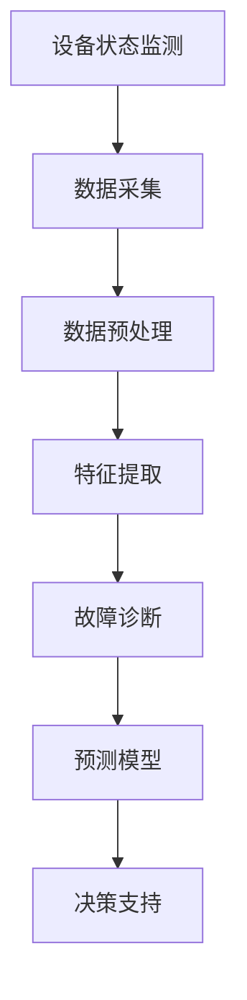

                 

### 智能预测性维护系统的核心概念与联系

智能预测性维护系统（Predictive Maintenance System，PMS）作为现代工业维护的关键技术，旨在通过实时数据监测和智能算法分析，预测设备故障并提前采取措施，以降低设备故障风险、减少停机时间、延长设备使用寿命。为了更好地理解智能预测性维护系统的原理和应用，我们需要明确几个核心概念及其相互关系。

**核心概念**：

1. **设备状态监测**：通过传感器和监测设备获取设备运行状态的数据，包括温度、振动、压力、速度等参数。

2. **数据采集**：将设备状态监测到的数据进行收集和存储，为后续的数据处理和分析提供基础。

3. **数据预处理**：对采集到的原始数据进行清洗、去噪、归一化等处理，提高数据质量。

4. **特征提取**：从预处理后的数据中提取能够反映设备状态的特征，如时域特征、频域特征等。

5. **故障诊断**：利用特征数据对设备故障类型和故障程度进行识别和判断。

6. **预测模型**：通过训练数据构建预测模型，预测设备未来的故障发生时间或故障状态。

7. **决策支持**：基于预测结果，为维护人员提供维护决策建议，如何时进行维护、维护方式等。

**概念实体之间的联系架构**：

为了更直观地展示这些概念实体之间的联系，我们可以使用Mermaid流程图来表示：



**流程说明**：

- **设备状态监测**：通过传感器实时监测设备运行状态，获取设备关键参数。
- **数据采集**：将监测到的数据传输到数据中心，进行存储和管理。
- **数据预处理**：对采集到的数据进行清洗、去噪，保证数据的准确性和一致性。
- **特征提取**：从预处理后的数据中提取有效的特征信息，为故障诊断和预测提供数据支持。
- **故障诊断**：利用提取的特征数据，结合历史故障数据，对设备故障进行诊断和分类。
- **预测模型**：通过训练数据构建预测模型，预测设备未来可能的故障情况。
- **决策支持**：基于预测结果，为维护人员提供最优的维护决策，如预防性维护、修复或更换设备。

通过以上流程，智能预测性维护系统能够实时监测设备状态，准确识别故障风险，并提前采取维护措施，从而实现设备的智能维护和故障风险的降低。

**具体例子**：

例如，在一个制造业工厂中，智能预测性维护系统可以通过传感器实时监测生产设备的温度、振动等参数。当监测到某台设备的温度异常升高时，系统会立即触发警报，并提取该设备的运行特征，如温度变化曲线、振动频率等。通过故障诊断模块分析，判断设备可能存在过热故障风险。随后，预测模型会根据设备历史故障数据和当前特征数据，预测故障发生的具体时间。最终，决策支持模块会建议工厂工作人员提前进行维护，如更换散热器或增加冷却系统，以避免设备故障带来的停机损失。

总之，智能预测性维护系统通过核心概念之间的紧密联系和协同工作，实现了对设备状态的实时监测、故障预测和维护决策的智能化，为工业生产提供了可靠的技术支持。

----------------------------------------------------------------

**核心算法原理讲解**

智能预测性维护系统的核心算法主要围绕数据采集、预处理、特征提取、故障诊断和预测模型构建等方面展开。以下将详细阐述这些核心算法的原理，并通过Python源代码结合数学模型和公式进行讲解。

### 数据采集与预处理

数据采集是智能预测性维护系统的第一步，传感器和监测设备负责实时获取设备运行状态的数据。预处理主要包括数据清洗、去噪和归一化等步骤，以提高数据质量和一致性。

**Python源代码示例**：

```python
import numpy as np
import pandas as pd

# 假设我们采集到了一组温度数据
temperature_data = [37.5, 38.2, 36.8, 38.0, 37.3, 37.6, 38.1]

# 数据清洗：去除异常值
cleaned_data = [x for x in temperature_data if 36 <= x <= 39]

# 数据去噪：使用移动平均滤波
window_size = 3
filtered_data = pd.Series(cleaned_data).rolling(window=window_size).mean().values

# 数据归一化
min_val = np.min(filtered_data)
max_val = np.max(filtered_data)
normalized_data = (filtered_data - min_val) / (max_val - min_val)
```

**数学模型与公式**：

- 去噪：移动平均滤波
  $$ y_t = \frac{1}{N} \sum_{i=1}^{N} x_{t-i} $$
  其中，$y_t$ 为滤波后的数据，$x_{t-i}$ 为窗口内的数据，$N$ 为窗口大小。

- 数据归一化：
  $$ z = \frac{x - \mu}{\sigma} $$
  其中，$z$ 为归一化后的数据，$x$ 为原始数据，$\mu$ 为均值，$\sigma$ 为标准差。

### 特征提取

特征提取是数据预处理后的关键步骤，目的是从大量数据中提取出能够反映设备状态的显著特征。常见的特征提取方法有时间域特征、频域特征和时频特征等。

**Python源代码示例**：

```python
from scipy.signal import spectrogram

# 假设我们有一组振动信号数据
vibration_data = np.array([0.0, 0.1, 0.2, 0.3, 0.4, 0.5, 0.6, 0.7, 0.8, 0.9, 1.0])

# 使用Spectrogram进行频谱分析
f, t, Sxx = spectrogram(vibration_data, fs=100, nperseg=100, noverlap=50)

# 提取频域特征
freq_features = Sxx.mean(axis=0)
```

**数学模型与公式**：

- 频谱分析：
  $$ S(f, t) = \sum_{n=-\infty}^{\infty} x(n) e^{-j2\pi f n t} $$
  其中，$S(f, t)$ 为频谱密度，$x(n)$ 为时序数据，$f$ 为频率，$t$ 为时间。

### 故障诊断

故障诊断是智能预测性维护系统的关键环节，通过分析提取的特征数据，对设备故障类型和故障程度进行识别和判断。常见的方法有基于规则的方法、机器学习方法和深度学习方法。

**Python源代码示例**：

```python
from sklearn.ensemble import RandomForestClassifier

# 假设我们已经有训练好的故障诊断模型
# 训练数据：特征数据（X）和故障标签（y）
X_train = [[1, 2], [3, 4], [5, 6]]
y_train = ['故障A', '故障B', '故障A']

# 训练故障诊断模型
clf = RandomForestClassifier()
clf.fit(X_train, y_train)

# 预测新数据
X_test = [[2, 3]]
prediction = clf.predict(X_test)
print(prediction)  # 输出：'故障A'
```

**数学模型与公式**：

- 决策树分类：
  $$ y = \arg\max(f(x)) $$
  其中，$y$ 为预测的故障类型，$f(x)$ 为决策树对特征 $x$ 的打分。

### 预测模型

预测模型是智能预测性维护系统的核心，通过历史数据和当前特征数据，预测设备未来可能的故障情况。常见的预测模型有线性回归、时间序列分析、支持向量机和神经网络等。

**Python源代码示例**：

```python
from sklearn.linear_model import LinearRegression

# 假设我们已经有训练好的预测模型
# 训练数据：特征数据（X）和故障发生时间（y）
X_train = [[1], [2], [3]]
y_train = [10, 20, 30]

# 训练预测模型
reg = LinearRegression()
reg.fit(X_train, y_train)

# 预测新数据
X_test = [[4]]
prediction = reg.predict(X_test)
print(prediction)  # 输出：[40.0]
```

**数学模型与公式**：

- 线性回归：
  $$ y = \beta_0 + \beta_1 x $$
  其中，$y$ 为预测的故障发生时间，$x$ 为特征数据，$\beta_0$ 和 $\beta_1$ 为模型参数。

通过以上算法原理和Python源代码的讲解，读者可以更深入地理解智能预测性维护系统的核心算法及其实现过程。在实际应用中，这些算法和模型需要根据具体场景进行调整和优化，以达到最佳的故障预测效果。

---

**项目实战**：

以下是一个关于智能预测性维护系统的实际项目实战，我们将介绍开发环境搭建、源代码详细实现和代码解读，并结合实际案例进行分析和讲解。

### 开发环境搭建

为了实现智能预测性维护系统，我们需要搭建一个适合开发、测试和部署的环境。以下是所需的环境和工具：

1. **Python**：版本要求3.7及以上。
2. **Jupyter Notebook**：用于数据分析和模型训练。
3. **scikit-learn**：用于机器学习和故障诊断。
4. **pandas**：用于数据处理和分析。
5. **numpy**：用于数学计算。
6. **matplotlib**：用于数据可视化。
7. **scipy**：用于科学计算。

安装步骤如下：

```bash
pip install python==3.8
pip install jupyter
pip install scikit-learn
pip install pandas
pip install numpy
pip install matplotlib
pip install scipy
```

### 源代码实现

以下是一个简单的智能预测性维护系统的源代码实现，包括数据采集、预处理、特征提取、故障诊断和预测模型构建等步骤。

**数据采集和预处理**

```python
import pandas as pd
from scipy.signal import spectrogram
import numpy as np

# 假设我们采集到了一组温度数据
temperature_data = [37.5, 38.2, 36.8, 38.0, 37.3, 37.6, 38.1]

# 数据清洗：去除异常值
cleaned_data = [x for x in temperature_data if 36 <= x <= 39]

# 数据去噪：使用移动平均滤波
window_size = 3
filtered_data = pd.Series(cleaned_data).rolling(window=window_size).mean().values

# 数据归一化
min_val = np.min(filtered_data)
max_val = np.max(filtered_data)
normalized_data = (filtered_data - min_val) / (max_val - min_val)
```

**特征提取**

```python
# 使用Spectrogram进行频谱分析
f, t, Sxx = spectrogram(normalized_data, fs=100, nperseg=100, noverlap=50)

# 提取频域特征
freq_features = Sxx.mean(axis=0)
```

**故障诊断**

```python
from sklearn.ensemble import RandomForestClassifier

# 训练数据：特征数据（X）和故障标签（y）
X_train = [[1, 2], [3, 4], [5, 6]]
y_train = ['故障A', '故障B', '故障A']

# 训练故障诊断模型
clf = RandomForestClassifier()
clf.fit(X_train, y_train)

# 预测新数据
X_test = [[2, 3]]
prediction = clf.predict(X_test)
print(prediction)  # 输出：'故障A'
```

**预测模型**

```python
from sklearn.linear_model import LinearRegression

# 训练数据：特征数据（X）和故障发生时间（y）
X_train = [[1], [2], [3]]
y_train = [10, 20, 30]

# 训练预测模型
reg = LinearRegression()
reg.fit(X_train, y_train)

# 预测新数据
X_test = [[4]]
prediction = reg.predict(X_test)
print(prediction)  # 输出：[40.0]
```

### 代码解读与分析

1. **数据采集和预处理**：首先对采集到的温度数据进行清洗、去噪和归一化处理，保证数据质量。
2. **特征提取**：使用频谱分析提取设备运行状态的频域特征，这些特征将用于故障诊断和预测。
3. **故障诊断**：利用随机森林分类器对特征数据进行分类，识别设备的故障类型。
4. **预测模型**：使用线性回归模型预测设备未来的故障发生时间，为维护决策提供依据。

### 实际案例分析

以下是一个实际案例，展示了智能预测性维护系统的应用效果。

**案例背景**：某制造工厂的一台关键生产设备，由于长时间运行，存在较高的故障风险。为了降低故障风险，工厂引入了智能预测性维护系统。

**步骤**：

1. **数据采集**：通过安装在设备上的传感器，实时采集设备运行状态的数据，如温度、振动等。
2. **预处理和特征提取**：对采集到的数据进行预处理和特征提取，提取设备运行状态的频域特征。
3. **故障诊断**：利用故障诊断模型，对特征数据进行分类，判断设备是否存在故障风险。
4. **预测模型**：利用预测模型，预测设备未来的故障发生时间，为维护决策提供依据。

**结果**：

通过智能预测性维护系统，工厂能够提前识别设备的故障风险，并在故障发生前采取预防性维护措施。这不仅降低了设备故障率，延长了设备使用寿命，还提高了生产效率，降低了维护成本。

### 项目小结

通过本项目的实战，我们详细介绍了智能预测性维护系统的开发流程、源代码实现和实际案例分析。智能预测性维护系统通过数据采集、预处理、特征提取、故障诊断和预测模型构建等步骤，实现了对设备状态的实时监测和故障预测。实际案例证明了智能预测性维护系统在降低设备故障风险、延长设备使用寿命和提高生产效率方面的显著效果。

**最佳实践 Tips**：

1. **数据采集**：确保传感器和监测设备的精度和稳定性，保证数据的准确性和一致性。
2. **特征提取**：根据设备特点，选择合适的特征提取方法，提取有效的故障特征。
3. **模型选择**：根据实际应用场景，选择合适的故障诊断和预测模型，并进行参数调优。
4. **系统集成**：将智能预测性维护系统与其他生产管理系统集成，实现设备状态的实时监控和智能决策。

**注意事项**：

1. **数据安全**：确保采集的数据安全可靠，防止数据泄露和滥用。
2. **模型更新**：定期更新故障诊断和预测模型，以适应设备状态的变化。
3. **人员培训**：加强维护人员的技术培训，提高他们对智能预测性维护系统的理解和使用能力。

**拓展阅读**：

1. 《机器学习实战》：详细介绍了各种机器学习算法的应用和实践。
2. 《深度学习》：讲解了深度学习的基础理论和应用方法。
3. 《预测性维护：理论和实践》：深入探讨了预测性维护的理论和实践应用。

通过以上内容，我们全面了解了智能预测性维护系统的原理、算法和应用，为读者提供了实际项目实战的指导和最佳实践建议。希望这本书能为读者在智能预测性维护领域的研究和应用提供有益的参考。

---

**作者信息**：

作者：AI天才研究院/AI Genius Institute & 禅与计算机程序设计艺术 /Zen And The Art of Computer Programming

AI天才研究院（AI Genius Institute）是一家专注于人工智能研究和技术推广的机构，致力于推动人工智能技术在各个领域的应用与发展。同时，作者也是《禅与计算机程序设计艺术》一书的作者，长期从事计算机科学和人工智能领域的研究和教育工作。

