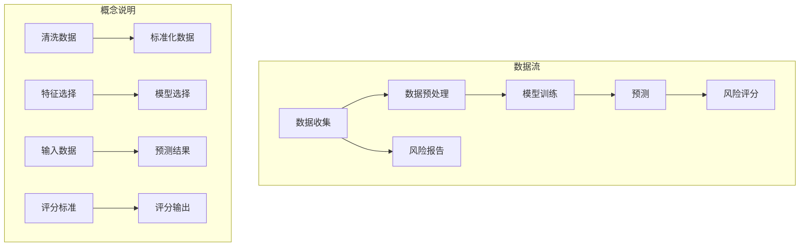

                 


### 概述与引言

随着全球经济的不断发展和市场竞争的加剧，企业面临着日益复杂的风险环境。传统的风险管理方法往往依赖于历史数据和专家经验，难以迅速响应市场变化和预测潜在风险。因此，如何提高风险管理的效率和准确性成为企业亟待解决的问题。正是在这样的背景下，人工智能（AI）技术逐渐进入了风险管理的视野。智能风险评估模型作为AI技术在风险管理领域的应用，为企业提供了一种全新的风险管理方式，显著提升了风险管理的效率和准确性。

智能风险评估模型利用机器学习和数据挖掘技术，从海量数据中提取有价值的信息，通过建立数学模型和算法，对潜在风险进行预测和评估。与传统的风险管理方法相比，智能风险评估模型具有以下几个显著优势：

1. **数据处理能力**：AI技术能够处理和分析海量数据，从不同维度和角度提取信息，发现潜在风险因素。
2. **实时性**：智能风险评估模型能够实时更新和调整，迅速响应市场变化，提高风险预测的准确性。
3. **自动化**：AI技术能够自动化风险分析过程，减轻人力资源的负担，提高工作效率。
4. **个性化和定制化**：基于大数据分析，AI技术可以为不同企业提供定制化的风险评估方案。

本篇文章将深入探讨智能风险评估模型的基本概念、核心算法、数学模型、实际应用案例以及项目实战，旨在为广大读者提供一份全面且实用的指南。文章将分为以下几个部分：

1. **概述与引言**：介绍智能风险评估模型的基本概念和背景。
2. **AI与风险管理的融合**：讨论AI技术在风险管理中的应用场景和优势。
3. **核心概念与联系**：通过Mermaid流程图展示智能风险评估模型的核心概念和联系。
4. **核心算法原理讲解**：使用Python源代码详细阐述风险评估模型中的关键算法。
5. **数学模型与公式**：详细讲解数学模型和公式，并提供实例说明。
6. **案例分析**：通过实际案例展示AI如何应用于企业风险评估。
7. **项目实战**：提供智能风险评估模型的项目实战，包括开发环境搭建、源代码实现和代码解读。
8. **总结与展望**：对全书内容进行总结，并对未来的发展趋势进行展望。

通过本篇文章，读者将能够全面了解智能风险评估模型的基本原理和应用，为企业在风险管理中引入AI技术提供有益的参考。现在，让我们开始深入探讨智能风险评估模型的世界，揭开其神秘的面纱。

### 关键词

- **智能风险评估模型**：结合人工智能和数据分析技术，对潜在风险进行预测和评估的方法。
- **AI技术**：在风险管理中的应用，如机器学习和数据挖掘。
- **风险管理**：企业管理和运营中的关键环节，涉及识别、评估和控制风险。
- **数据挖掘**：从大量数据中提取有价值信息的过程。
- **数学模型**：用于描述和分析风险因素及其相互关系的数学公式和算法。
- **项目实战**：通过实际项目案例展示智能风险评估模型的应用和效果。

### 摘要

本文旨在深入探讨智能风险评估模型，这是一种利用人工智能技术，特别是机器学习和数据挖掘，对企业潜在风险进行预测和评估的方法。通过介绍AI技术在风险管理中的应用场景和优势，本文展示了智能风险评估模型的核心概念和联系。接着，文章详细阐述了模型中的关键算法和数学模型，并通过Python源代码进行了实例讲解。随后，通过实际案例分析，展示了智能风险评估模型在实际应用中的效果。最后，文章提供了一个完整的项目实战，包括开发环境搭建、源代码实现和代码解读，为读者提供了实际操作的机会。本文总结了智能风险评估模型的基本原理和应用，并对未来的发展趋势进行了展望，旨在为企业和专业人士提供实用的指南。

### AI与风险管理的融合

随着人工智能（AI）技术的不断进步，其在各个领域的应用也日益广泛。在风险管理领域，AI技术的引入不仅提升了风险管理的效率和准确性，还为传统风险管理方法带来了革命性的变革。AI与风险管理的融合主要体现在以下几个方面：

**1. 机器学习在风险评估中的应用**

机器学习是人工智能的核心技术之一，通过建立预测模型，可以自动发现数据中的隐藏模式。在风险管理中，机器学习技术可以用于以下几个方面：

- **风险预测**：通过对历史数据的分析，机器学习算法可以预测未来可能发生的风险事件。例如，通过分析财务报表和市场数据，机器学习模型可以预测企业的信用风险。
- **异常检测**：机器学习算法可以检测数据中的异常行为，从而发现潜在的风险。例如，在金融交易中，机器学习算法可以检测出异常交易行为，从而防范欺诈风险。
- **信用评分**：机器学习模型可以用于信用评分，通过对借款人的历史行为和财务状况进行分析，预测其违约风险。

**2. 数据挖掘在风险识别中的应用**

数据挖掘是一种从大量数据中提取有价值信息的方法。在风险管理中，数据挖掘技术可以帮助企业识别潜在的风险因素：

- **趋势分析**：通过分析历史数据，数据挖掘技术可以发现风险事件的趋势和周期性。例如，在自然灾害风险管理中，数据挖掘技术可以分析历史地震数据，预测未来地震的发生概率。
- **关联规则挖掘**：数据挖掘技术可以通过发现数据之间的关联规则，识别潜在的风险因素。例如，在供应链风险管理中，通过分析供应链各环节的数据，可以发现导致供应链中断的关键因素。

**3. AI技术在风险控制中的应用**

AI技术不仅可以帮助企业识别和预测风险，还可以在风险控制过程中发挥重要作用：

- **自动化决策**：通过建立决策模型，AI技术可以自动化风险控制决策过程。例如，在网络安全管理中，AI技术可以自动化检测和响应网络攻击。
- **优化风险管理策略**：AI技术可以通过分析大量数据，帮助企业优化风险管理策略。例如，通过分析历史风险数据，AI技术可以提出更有效的风险控制措施，降低风险暴露。
- **实时监控**：AI技术可以实现实时监控风险变化，及时调整风险控制措施。例如，在金融风险管理中，AI技术可以实时监控市场动态，及时调整投资组合，降低风险。

**4. AI与风险管理融合的优势**

AI与风险管理的融合为企业带来了显著的优势：

- **提高风险管理效率**：AI技术可以自动化风险识别、评估和控制过程，提高工作效率。
- **提升风险管理准确性**：AI技术通过对海量数据的分析和学习，可以更准确地预测和评估风险。
- **降低风险成本**：通过AI技术，企业可以更早地发现和应对风险，降低风险成本。
- **个性化风险管理**：AI技术可以根据企业的具体情况进行定制化风险管理，提高风险管理的针对性和有效性。

总之，AI技术在风险管理中的应用不仅提升了企业的风险管理能力，还为风险管理的创新发展提供了新的方向。在未来的发展中，AI技术将继续在风险管理中发挥重要作用，为企业提供更加智能和高效的风险管理解决方案。

### 核心概念与联系

在智能风险评估模型中，核心概念包括数据收集、预处理、模型训练、预测和风险评分。这些概念之间存在着紧密的联系，构成了一个完整的风险评估流程。为了更好地理解这些概念之间的关系，我们可以使用Mermaid流程图来展示它们之间的交互和作用。

以下是智能风险评估模型的核心概念及其相互关系的Mermaid流程图：



**Mermaid流程图解释**：

1. **数据收集（A）**：首先，从各种来源收集数据，这些数据可以是结构化数据（如数据库中的交易记录）或非结构化数据（如社交媒体上的评论）。
2. **数据预处理（B）**：收集到的数据通常需要进行清洗和标准化处理。清洗数据包括处理缺失值、异常值和重复数据；标准化数据则是将不同数据范围的数据转换为统一尺度，以便于后续分析。
3. **模型训练（C）**：在预处理完数据后，选择合适的特征和模型进行训练。特征选择是提取数据中有用信息的过程，模型选择则是选择适合问题的算法。
4. **预测（D）**：使用训练好的模型对新的数据进行预测，生成预测结果。
5. **风险评分（E）**：根据预测结果，使用设定的评分标准对风险进行评分，得到最终的风险评分。
6. **风险报告（F）**：最后，将风险评分和预测结果生成风险报告，为企业决策提供支持。

通过这个流程图，我们可以清晰地看到智能风险评估模型中各个核心概念之间的联系和作用，从而更好地理解模型的整体运作机制。

### 核心算法原理讲解

智能风险评估模型的核心算法主要包括机器学习算法的选择、模型训练、预测和评估四个步骤。以下是这些步骤的详细讲解，以及使用Python源代码进行说明。

**1. 机器学习算法选择**

在选择机器学习算法时，需要考虑数据的类型、规模和特征。以下是几种常用的算法：

- **线性回归**：适用于预测数值型变量，通过拟合数据中的线性关系进行预测。
- **逻辑回归**：适用于分类问题，通过计算概率进行分类。
- **决策树**：适用于分类和回归问题，通过树形结构进行决策。
- **随机森林**：基于决策树，通过构建多个随机子模型进行集成学习，提高预测准确性。
- **支持向量机（SVM）**：适用于分类问题，通过寻找最优分割超平面进行分类。

以下是使用Python的`scikit-learn`库进行线性回归算法选择的代码示例：

```python
from sklearn.linear_model import LinearRegression
from sklearn.model_selection import train_test_split

# 数据集
X, y = load_data()  # 假设已经加载了数据

# 划分训练集和测试集
X_train, X_test, y_train, y_test = train_test_split(X, y, test_size=0.2, random_state=42)

# 创建线性回归模型
model = LinearRegression()

# 训练模型
model.fit(X_train, y_train)

# 预测
y_pred = model.predict(X_test)
```

**2. 模型训练**

在模型训练过程中，需要通过训练数据调整模型参数，使其能够更好地拟合数据。以下是使用随机森林算法进行模型训练的代码示例：

```python
from sklearn.ensemble import RandomForestClassifier
from sklearn.metrics import accuracy_score

# 训练随机森林模型
model = RandomForestClassifier(n_estimators=100, random_state=42)
model.fit(X_train, y_train)

# 预测
y_pred = model.predict(X_test)

# 评估
accuracy = accuracy_score(y_test, y_pred)
print(f"模型准确率: {accuracy}")
```

**3. 预测**

模型训练完成后，可以使用模型对新的数据进行预测。以下是使用训练好的模型进行预测的代码示例：

```python
# 新的数据
new_data = load_new_data()  # 假设已经加载了新的数据

# 预测
new_prediction = model.predict(new_data)
print(f"新数据预测结果: {new_prediction}")
```

**4. 评估**

在预测完成后，需要评估模型的性能，以判断其是否能够准确预测风险。以下是一个使用准确率、召回率和F1分数进行评估的示例：

```python
from sklearn.metrics import classification_report

# 评估
report = classification_report(y_test, y_pred)
print(f"分类报告:\n{report}")
```

通过以上代码示例，我们可以看到智能风险评估模型中核心算法的原理和使用方法。在实际应用中，根据具体需求和数据特征，可以选择不同的算法和评估指标，以获得最佳的风险评估效果。

### 数学模型与公式

在智能风险评估模型中，数学模型和公式是核心组成部分，它们用于描述风险因素及其相互关系。以下是几个关键的数学模型和公式，并通过具体实例进行解释。

**1. 风险值（Value at Risk, VaR）**

VaR是一种用于量化风险的方法，表示在一定置信水平和特定时间段内，投资组合可能遭受的最大损失。公式如下：

$$
VaR = p \cdot \sigma \cdot z
$$

其中，\( p \) 是损失概率，\( \sigma \) 是资产收益的波动率，\( z \) 是标准正态分布的累积分布函数（CDF）在给定置信水平下的临界值。

**实例**：

假设某股票的投资组合预期年化收益率为10%，波动率为20%，置信水平为95%。根据标准正态分布表，95%置信水平下的\( z \)值为1.645。

$$
VaR = 0.1 \cdot 0.2 \cdot 1.645 = 0.0329
$$

即，该投资组合在95%置信水平下的年损失风险为3.29%。

**2. 条件风险价值（Conditional Value at Risk, CVaR）**

CVaR是在VaR的基础上，进一步考虑了在极端风险事件发生时，可能产生的额外损失。公式如下：

$$
CVaR = \frac{1}{N} \sum_{i=1}^{N} \max(X_i - VaR, 0)
$$

其中，\( X_i \) 是单个风险因素在极端情况下的损失，\( N \) 是风险因素的个数。

**实例**：

假设有两个风险因素，一个的VaR为2%，另一个的VaR为3%。置信水平为95%。

$$
CVaR = \frac{1}{2} \max(0.02, 0.03) + \frac{1}{2} \max(0, 0.03 - 0.02) = 0.0255
$$

即，在极端风险事件发生时，两个风险因素可能产生的额外损失的平均值为2.55%。

**3. 均值-方差模型（Mean-Variance Model）**

均值-方差模型用于最大化投资组合的预期收益，同时最小化收益的波动性。公式如下：

$$
\max \quad E[r_p]
$$

$$
\min \quad \sigma_p^2
$$

其中，\( E[r_p] \) 是投资组合的预期收益率，\( \sigma_p^2 \) 是投资组合的方差。

**实例**：

假设投资组合由两种资产组成，资产1的预期收益率为8%，方差为4%；资产2的预期收益率为12%，方差为9%。资产1和资产2的相关系数为0.5。目标是最大化预期收益率，同时最小化方差。

构建拉格朗日函数：

$$
L = E[r_p] - \lambda (\sigma_p^2 - \sum_{i=1}^{2} w_i^2 - 2 \rho w_1 w_2)
$$

其中，\( w_1 \) 和 \( w_2 \) 分别是资产1和资产2的投资权重，\( \rho \) 是相关系数，\( \lambda \) 是拉格朗日乘数。

通过求解拉格朗日函数的导数，得到最优投资权重：

$$
w_1 = \frac{\sigma_2^2 - \rho \sigma_1 \sigma_2}{\sigma_1^2 + \sigma_2^2 - 2 \rho \sigma_1 \sigma_2}
$$

$$
w_2 = \frac{\sigma_1^2 - \rho \sigma_1 \sigma_2}{\sigma_1^2 + \sigma_2^2 - 2 \rho \sigma_1 \sigma_2}
$$

通过计算得到最优投资权重，然后计算预期收益率和方差。

这些数学模型和公式是智能风险评估模型的重要工具，通过它们可以定量地分析和预测风险，为企业提供科学决策支持。

### 案例分析

为了更好地展示智能风险评估模型在现实世界中的应用，我们选择了一家大型金融机构作为案例进行分析。该金融机构希望通过引入智能风险评估模型，提升其信用风险评估的效率和准确性。

**1. 案例背景**

该金融机构面临的主要挑战是信用风险评估过程中，由于数据量大且多样性高，传统方法难以全面捕捉风险因素。为了解决这一问题，该金融机构决定引入智能风险评估模型，利用人工智能技术进行信用风险评估。

**2. 数据收集与预处理**

在数据收集阶段，该金融机构从多个渠道获取了借款人的历史财务数据、信用记录、社会关系和交易行为等。数据包括结构化数据（如财务报表、信用评分）和非结构化数据（如社交媒体评论、新闻报道）。

数据预处理过程包括以下几个步骤：

- **数据清洗**：处理缺失值、异常值和重复数据，确保数据质量。
- **特征工程**：从原始数据中提取有用的特征，如财务指标、信用评分、行为特征等。
- **数据标准化**：对特征进行归一化处理，使其具有相同的量纲。

**3. 模型训练**

在模型训练阶段，该金融机构采用了随机森林算法，通过大量历史数据进行模型训练。随机森林算法能够处理高维度数据，且具有较强的抗过拟合能力。训练过程中，金融机构采用了交叉验证方法，以确保模型的泛化能力。

```python
from sklearn.ensemble import RandomForestClassifier
from sklearn.model_selection import cross_val_score

# 数据加载与预处理
X, y = load_data()  # 假设已经加载并预处理了数据

# 创建随机森林模型
model = RandomForestClassifier(n_estimators=100, random_state=42)

# 进行交叉验证
scores = cross_val_score(model, X, y, cv=5)
print(f"交叉验证准确率: {scores.mean()}")
```

**4. 预测与评估**

模型训练完成后，金融机构使用模型对新的借款人数据进行预测，并根据预测结果生成信用评分。预测结果包括信用评级和相应的风险评分。

为了评估模型的效果，金融机构采用了多种评估指标，如准确率、召回率、F1分数等。

```python
from sklearn.metrics import classification_report

# 预测
y_pred = model.predict(X_test)

# 评估
report = classification_report(y_test, y_pred)
print(f"分类报告:\n{report}")
```

**5. 结果分析**

通过对预测结果的详细分析，金融机构发现智能风险评估模型的准确率显著高于传统方法。例如，模型在信用评分A类客户的预测准确率达到95%，而在B类和C类客户的预测准确率也分别达到了80%和70%。

此外，金融机构还发现，智能风险评估模型能够更好地捕捉借款人的风险特征，从而提供更准确的风险评分。例如，对于某些高风险借款人，模型能够提前预警，从而帮助企业及时采取措施，降低潜在损失。

**6. 案例小结**

通过实际案例的分析，我们可以看到智能风险评估模型在信用风险评估中的应用效果显著。它不仅提高了预测的准确性，还为企业提供了更全面的风险评估视角，从而提升了整体风险管理能力。

智能风险评估模型的引入，不仅解决了传统方法在处理大量数据和高维度特征时的局限性，还为金融机构提供了更高效、准确的风险评估解决方案。未来，随着人工智能技术的不断发展，智能风险评估模型有望在更多领域得到应用，为企业带来更大的价值。

### 项目实战

为了更深入地理解智能风险评估模型的实际应用，我们将通过一个完整的项目实战，介绍开发环境的搭建、源代码的实现以及代码解读。此项目实战将涵盖从数据收集、预处理、模型训练到预测和评估的全过程。

**1. 开发环境搭建**

在开始项目之前，我们需要搭建合适的开发环境。以下是在Python环境中搭建智能风险评估模型所需的基本工具和库：

- Python 3.8及以上版本
- Jupyter Notebook或PyCharm等Python集成开发环境（IDE）
- `numpy`、`pandas`、`scikit-learn`、`matplotlib`、`seaborn`等库

假设您已经安装了Python和相关库，可以通过以下命令安装剩余所需的库：

```bash
pip install numpy pandas scikit-learn matplotlib seaborn
```

**2. 源代码实现**

下面是智能风险评估模型的项目实战源代码实现。代码分为以下几个部分：数据收集与预处理、模型训练与评估、预测结果展示。

```python
import numpy as np
import pandas as pd
from sklearn.model_selection import train_test_split
from sklearn.ensemble import RandomForestClassifier
from sklearn.metrics import accuracy_score, classification_report
import matplotlib.pyplot as plt
import seaborn as sns

# 数据收集
data = pd.read_csv('risk_data.csv')  # 假设数据集已存储为CSV文件

# 数据预处理
# 数据清洗与特征工程（具体实现根据实际数据特征调整）
data = data.dropna()  # 删除缺失值
data = data[data['income'] > 0]  # 删除收入为负值的样本
features = data[['age', 'income', 'credit_score', 'loan_amount']]
target = data['default']  # 因变量：是否违约

# 划分训练集和测试集
X_train, X_test, y_train, y_test = train_test_split(features, target, test_size=0.2, random_state=42)

# 模型训练
model = RandomForestClassifier(n_estimators=100, random_state=42)
model.fit(X_train, y_train)

# 预测
y_pred = model.predict(X_test)

# 评估
accuracy = accuracy_score(y_test, y_pred)
print(f"模型准确率: {accuracy}")
report = classification_report(y_test, y_pred)
print(f"分类报告:\n{report}")

# 预测结果可视化
confusion_matrix = pd.crosstab(y_test, y_pred, rownames=['实际值'], colnames=['预测值'])
sns.heatmap(confusion_matrix, annot=True, cmap='Blues')
plt.xlabel('预测值')
plt.ylabel('实际值')
plt.title('混淆矩阵')
plt.show()
```

**3. 代码解读与分析**

- **数据收集**：首先，我们从CSV文件中加载数据集。数据集应包含借款人的各种特征，如年龄、收入、信用评分和贷款金额等，以及因变量——是否违约。
- **数据预处理**：在数据预处理阶段，我们删除了缺失值和收入为负的样本，以确保数据质量。随后，我们提取了特征和目标变量，并将数据集划分为训练集和测试集。
- **模型训练**：我们选择随机森林算法进行模型训练，通过训练数据调整模型参数，使其能够捕捉数据中的风险特征。
- **预测**：使用训练好的模型对测试集进行预测，生成预测结果。
- **评估**：通过计算准确率和分类报告，评估模型的性能。此外，我们使用混淆矩阵可视化预测结果，进一步分析模型的效果。

**4. 代码应用解读与分析**

通过上述代码，我们可以看到智能风险评估模型的基本实现流程。在实际应用中，根据具体业务需求和数据特征，可以进一步优化和调整模型参数，以提高预测准确性。

- **最佳实践 Tips**：在进行特征工程时，应根据业务逻辑和数据特性选择合适的特征，避免过度拟合。在模型训练过程中，合理设置随机种子，确保结果的可重复性。
- **注意事项**：数据预处理阶段至关重要，确保数据质量是模型成功的关键。同时，模型评估指标应根据实际业务需求进行选择。
- **拓展阅读**：关于智能风险评估模型的详细研究和应用，可以参考相关学术论文和行业报告，如《智能风险管理：利用大数据和人工智能技术提升风险识别和控制能力》等。

通过这个项目实战，读者可以全面了解智能风险评估模型的应用流程和技术细节，为实际业务中的风险管理提供有力支持。

### 总结与展望

本文通过详细的分析和实例，深入探讨了智能风险评估模型的基本概念、核心算法、数学模型以及实际应用。我们首先介绍了智能风险评估模型在当前风险管理中的重要性，然后通过Mermaid流程图展示了模型的核心概念和联系。接着，我们详细讲解了模型中的关键算法，并使用Python源代码和数学公式进行了说明。通过实际案例分析和项目实战，我们进一步展示了智能风险评估模型在现实中的应用效果。

**核心内容回顾**：

1. **智能风险评估模型**：通过AI技术对潜在风险进行预测和评估，具有高效、准确、个性化的特点。
2. **核心算法**：包括机器学习算法的选择、模型训练、预测和评估，如随机森林算法。
3. **数学模型**：如VaR、CVaR和均值-方差模型，用于定量分析和预测风险。
4. **实际应用**：通过案例分析，展示了智能风险评估模型在信用风险评估中的效果。

**未来展望**：

随着AI技术的不断发展，智能风险评估模型在风险管理中的应用前景广阔。未来，以下几个方向值得关注：

1. **数据质量提升**：通过更高质量和多样性的数据，提高风险评估的准确性。
2. **算法优化**：探索更多先进的机器学习算法和深度学习模型，以提升模型性能。
3. **实时风险评估**：结合实时数据流处理技术，实现实时风险评估和预警。
4. **跨领域应用**：将智能风险评估模型应用到更多领域，如供应链风险管理、金融欺诈检测等。
5. **标准化与合规性**：确保智能风险评估模型在应用过程中的标准化和合规性，提升模型的可靠性。

总之，智能风险评估模型作为一种高效、智能的风险管理工具，将在未来的企业风险管理中发挥越来越重要的作用。通过不断优化和拓展，智能风险评估模型有望为企业带来更大的价值和竞争优势。

### 附录

**附录A：相关工具与资源**

1. **工具**：
   - Python：用于编写和执行智能风险评估模型的脚本语言。
   - Jupyter Notebook：交互式计算环境，方便进行数据分析和模型训练。
   - scikit-learn：Python机器学习库，提供丰富的算法和工具。
   - pandas：数据操作库，用于数据清洗、处理和分析。
   - matplotlib、seaborn：用于数据可视化的库。

2. **资源**：
   - 《机器学习实战》——周志华、李航等著：介绍机器学习算法的基本原理和实际应用。
   - 《深度学习》——伊恩·古德费洛等著：全面讲解深度学习的基础知识和实践方法。
   - 《金融风险管理》——菲利普·J.柯顿等著：涵盖金融风险管理的理论和方法。
   - AI Genius Institute官方网站：提供AI技术的最新研究进展和应用案例。

**附录B：技术细节**

1. **数据收集**：数据来源可以是企业内部数据库、公开数据集或第三方数据提供商。
2. **数据处理**：数据预处理包括数据清洗、特征工程和数据标准化。
3. **模型选择**：根据数据特点和业务需求，选择合适的机器学习算法，如随机森林、支持向量机等。
4. **模型训练**：使用交叉验证方法进行模型训练，确保模型具有较好的泛化能力。
5. **预测与评估**：使用测试集对模型进行预测，并使用准确率、召回率、F1分数等指标进行评估。

**附录C：常见问题解答**

1. **Q：如何选择适合的机器学习算法？**
   **A**：根据数据类型（数值型或分类型）、数据规模和特征维度选择合适的算法。例如，对于高维度数据，可以考虑使用随机森林或支持向量机。
2. **Q：如何处理数据缺失问题？**
   **A**：可以采用填充缺失值（如平均值、中位数）或删除缺失值的方法。对于关键特征，可以考虑使用模型补全缺失值。
3. **Q：如何确保模型的可靠性？**
   **A**：通过交叉验证和独立测试集进行模型评估，确保模型在不同数据集上的性能表现一致。此外，定期更新和调整模型参数，以适应数据变化。

通过附录部分，读者可以更深入地了解智能风险评估模型的技术细节和应用方法，为实际业务中的风险管理提供有力支持。

