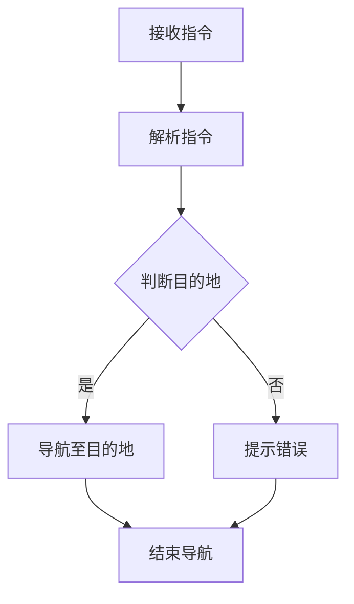
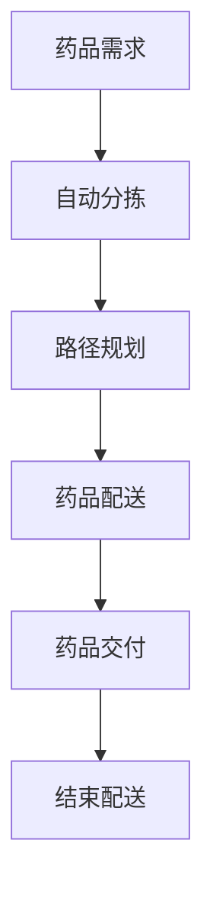
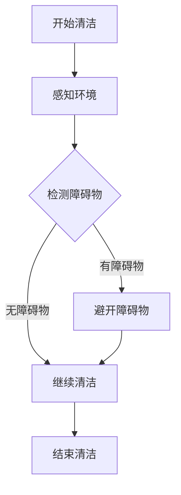
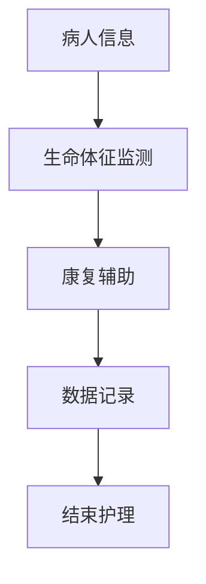
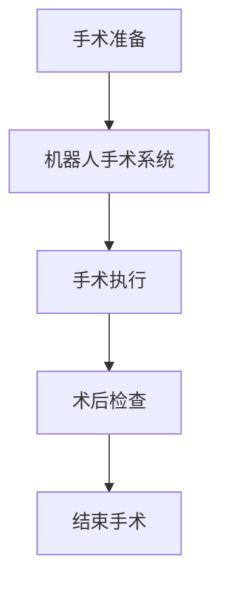
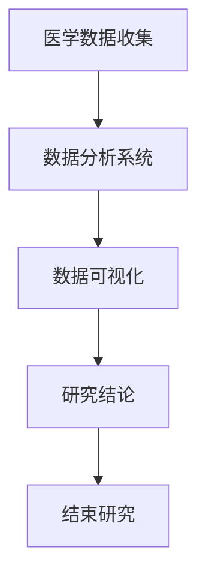

                 

# 服务机器人在医疗健康领域的发展

## 关键词

- 服务机器人
- 医疗健康
- 感知技术
- 运动控制
- 人工智能
- 挑战与解决方案
- 案例研究

## 摘要

本文详细探讨了服务机器人在医疗健康领域的应用与发展。首先，介绍了服务机器人的基本概念、分类及核心技术，并探讨了服务机器人与医疗健康的结合背景和重要性。接着，文章分析了医疗健康领域服务机器人的应用场景，包括医院环境、护理和康复等方面。随后，文章探讨了服务机器人在医疗健康领域的技术进展，包括感知技术、运动控制技术和人工智能技术。此外，文章还分析了当前技术面临的挑战与解决方案，并通过案例研究展示了国内外知名医院和企业的应用实例。最后，文章对服务机器人在医疗健康领域的未来趋势进行了展望。

## 引言

### 1.1 服务机器人与医疗健康的结合背景

随着科技的快速发展，服务机器人在各个领域的应用越来越广泛。特别是在医疗健康领域，服务机器人的出现为医疗行业带来了革命性的变化。医疗健康行业是一个高度复杂且劳动密集型的行业，面临着人力资源短缺、医疗成本上升等挑战。而服务机器人能够有效地解决这些问题，提高医疗服务的效率和质量。

服务机器人与医疗健康的结合主要体现在以下几个方面：

1. **提高医疗服务效率**：服务机器人可以自动完成一些重复性高、劳动强度大的任务，如药品配送、清洁卫生等，从而减轻医护人员的工作负担，提高医疗服务的效率。

2. **提升患者体验**：服务机器人可以提供便捷的导诊、咨询、陪伴等服务，改善患者的就医体验，提高患者的满意度。

3. **辅助医疗诊断**：一些先进的服务机器人具备医学影像分析、病理分析等功能，能够辅助医生进行诊断，提高诊断的准确性和效率。

4. **促进康复治疗**：康复机器人可以帮助患者进行物理治疗、康复训练，提高康复效果。

### 1.2 服务机器人对医疗健康的影响

服务机器人在医疗健康领域的应用对医疗行业产生了深远的影响，主要体现在以下几个方面：

1. **提高医疗效率**：服务机器人可以自动化处理医院中的各种事务，如药品配送、病人接送、医疗设备维护等，从而减少人力成本，提高医疗效率。

2. **降低医疗成本**：通过减少人力需求，服务机器人可以降低医疗成本，同时提高医疗资源的使用效率。

3. **提高医疗服务质量**：服务机器人可以减少人为错误，提高医疗操作的准确性和一致性，从而提高医疗服务的质量。

4. **改善患者体验**：服务机器人可以提供更加便捷、温馨的服务，如引导患者就诊、陪伴患者聊天等，从而改善患者的就医体验。

### 1.3 医疗健康领域服务机器人的发展现状

目前，服务机器人在医疗健康领域的应用已经取得了显著成果。国内外许多医院和研究机构已经开始研究和部署服务机器人，探索其在医疗健康领域的应用前景。

1. **医院环境中的应用**：医院导览机器人、清洁机器人、药品配送机器人等已经开始在医院环境中广泛应用。

2. **护理机器人**：护理机器人可以帮助护士进行病人护理，如测量生命体征、协助病人康复等。

3. **康复机器人**：康复机器人可以帮助患者进行康复训练，如物理治疗、语言治疗等。

4. **辅助医疗诊断**：一些先进的服务机器人已经具备医学影像分析、病理分析等功能，能够辅助医生进行诊断。

5. **远程医疗**：服务机器人可以通过远程医疗技术，为偏远地区的患者提供医疗咨询和服务。

总的来说，服务机器人在医疗健康领域的应用前景广阔，但同时也面临着一系列挑战。接下来，本文将详细探讨这些挑战及其解决方案。

## 第2章 服务机器人概述

### 2.1 服务机器人的基本概念

服务机器人是指专门为人类提供各种服务（如清洁、配送、护理、导览等）的机器人。与工业机器人不同，服务机器人通常工作在非结构化或部分结构化的环境中，需要具备更高的自主性、安全性和适应性。

#### 2.1.1 服务机器人的定义

服务机器人是一种具有感知、决策和执行能力的自动化系统，能够在非结构化或部分结构化的环境中为人类提供各种服务。

#### 2.1.2 服务机器人的分类

服务机器人可以根据应用场景和功能进行分类，常见的分类方法包括：

1. **根据应用场景分类**：可分为家庭服务机器人、商用服务机器人、医疗健康服务机器人、物流服务机器人等。

2. **根据功能分类**：可分为清洁机器人、配送机器人、护理机器人、康复机器人、导览机器人等。

3. **根据技术分类**：可分为基于视觉的服务机器人、基于声学的服务机器人、基于传感器融合的服务机器人等。

#### 2.1.3 服务机器人的核心技术

服务机器人需要具备以下核心技术：

1. **感知技术**：包括视觉感知、听觉感知、触觉感知、气味感知等，用于获取环境信息。

2. **运动控制技术**：包括机器人运动规划、路径规划、运动控制等，用于实现机器人的自主移动。

3. **人工智能技术**：包括机器学习、深度学习、自然语言处理等，用于实现机器人的智能决策和交互。

### 2.2 服务机器人在医疗健康领域的应用

服务机器人在医疗健康领域的应用范围广泛，主要包括以下几个方面：

1. **医院环境中的应用**：如医院导览机器人、清洁机器人、药品配送机器人等。

2. **护理机器人**：如护理辅助机器人、康复护理机器人等。

3. **康复机器人**：如物理治疗机器人、语言治疗机器人等。

4. **辅助医疗诊断**：如医学影像分析机器人、病理分析机器人等。

### 2.3 服务机器人在医疗健康领域的发展挑战与机遇

服务机器人在医疗健康领域的发展面临以下挑战：

1. **技术挑战**：如感知技术、运动控制技术、人工智能技术的进一步提升。

2. **社会与伦理挑战**：如机器人在医疗环境中的安全与隐私问题、医疗责任的界定等。

3. **应用挑战**：如机器人在复杂医疗环境中的适应性和自主性等。

然而，随着技术的不断进步和社会的逐步接受，服务机器人在医疗健康领域的发展也面临着巨大的机遇。通过克服这些挑战，服务机器人有望在医疗健康领域发挥更加重要的作用。

## 第3章 医疗健康领域应用

### 3.1 医院环境中的应用

在医院的日常运营中，服务机器人扮演着越来越重要的角色。以下是服务机器人在医院环境中的一些典型应用：

#### 3.1.1 医院导览机器人

医院导览机器人是一种用于帮助患者和访客在医院环境中导航的机器人。它们通常配备有语音交互系统和高清摄像头，能够实时识别并标记医院内的各种地点和设施。

**核心概念与联系**

- **语音交互系统**：基于自然语言处理技术，能够理解用户的语言指令。
- **高清摄像头与图像识别技术**：用于识别医院内的各种环境和设施。

**Mermaid流程图**



**Python源代码示例**

```python
def navigate_to_destination(destination):
    # 伪代码，实际应用中需要结合图像识别技术
    if destination_found:
        print(f"导航至目的地：{destination}")
    else:
        print("未找到目的地，请重新输入。")

# 用户输入目的地
destination = input("请输入目的地：")
navigate_to_destination(destination)
```

**数学模型与公式**

$$
\text{路径长度} = \sqrt{(x_2 - x_1)^2 + (y_2 - y_1)^2}
$$

其中，$(x_1, y_1)$ 和 $(x_2, y_2)$ 分别为起点和终点的坐标。

#### 3.1.2 药品配送机器人

药品配送机器人用于自动配送药品，减少医护人员的工作负担，提高药品配送的准确性和效率。

**核心概念与联系**

- **自动化仓库管理**：通过自动化系统实现药品的存储和管理。
- **路径规划算法**：用于计算从药品储存位置到病房的最优路径。

**Mermaid流程图**



**Python源代码示例**

```python
def deliver_medication(warehouse_location, patient_location):
    # 伪代码，实际应用中需要结合路径规划算法
    optimal_path = plan_path(warehouse_location, patient_location)
    print(f"药品配送路径：{optimal_path}")

# 用户输入仓库和病房位置
warehouse_location = (x1, y1)
patient_location = (x2, y2)
deliver_medication(warehouse_location, patient_location)
```

**数学模型与公式**

$$
\text{路径长度} = \min_{p} \sum_{i=1}^{n} d(p_i, p_{i+1})
$$

其中，$p_i$ 和 $p_{i+1}$ 分别为路径上的连续两点，$d(p_i, p_{i+1})$ 表示两点之间的距离。

#### 3.1.3 医院清洁机器人

医院清洁机器人用于自动清洁医院环境，减少医护人员的工作负担，提高医院环境的清洁度。

**核心概念与联系**

- **清洁系统**：包括扫地、拖地等功能。
- **自主导航**：利用感知技术和运动控制技术实现自主导航。

**Mermaid流程图**



**Python源代码示例**

```python
def clean_environment():
    # 伪代码，实际应用中需要结合感知技术和运动控制技术
    while not done_cleaning:
        if obstacle_detected:
            avoid_obstacle()
        else:
            continue_cleaning()

# 开始清洁
clean_environment()
```

**数学模型与公式**

$$
\text{清洁效率} = \frac{\text{清洁面积}}{\text{清洁时间}}
$$

### 3.2 护理机器人在医院的应用

护理机器人在医院中的应用日益广泛，主要用于辅助医护人员进行病人护理，提高护理效率和质量。

#### 3.2.1 护理辅助机器人

护理辅助机器人用于协助护士进行病人护理，如测量生命体征、协助病人康复等。

**核心概念与联系**

- **生命体征监测**：通过传感器实时监测病人的体温、心率、血压等生命体征。
- **康复辅助**：通过机械臂和运动控制技术辅助病人进行康复训练。

**Mermaid流程图**



**Python源代码示例**

```python
def assist_nursing(patient_info):
    # 伪代码，实际应用中需要结合传感器和运动控制技术
    while nursing:
        monitor_vital_signs(patient_info)
        assist_rehabilitation(patient_info)
        record_data(patient_info)

# 病人信息输入
patient_info = get_patient_info()
assist_nursing(patient_info)
```

**数学模型与公式**

$$
\text{护理效率} = \frac{\text{护理任务完成量}}{\text{护理时间}}
$$

#### 3.2.2 护理机器人对护理人员的影响

护理机器人的应用对护理人员产生了深远的影响，主要表现在以下几个方面：

1. **减轻工作负担**：护理机器人能够完成一些重复性高、劳动强度大的护理任务，如测量生命体征、协助病人康复等，从而减轻护理人员的工作负担。

2. **提高护理质量**：护理机器人能够精确地完成护理任务，减少人为错误，提高护理质量。

3. **改变护理模式**：护理机器人的应用改变了传统的护理模式，使护理人员能够更多地专注于病人的情感需求和个性化护理。

#### 3.2.3 护理机器人在护理流程中的应用

护理机器人在护理流程中的应用主要包括以下几个方面：

1. **病人监护**：护理机器人可以实时监测病人的生命体征，及时发现异常情况，为医护人员提供决策支持。

2. **康复训练**：护理机器人可以辅助病人进行康复训练，如物理治疗、语言治疗等，提高康复效果。

3. **药物管理**：护理机器人可以协助护士进行药物管理，如提醒护士按时给药、确保药物的正确使用等。

### 3.3 康复机器人在医院的应用

康复机器人在医院的应用主要集中在物理治疗、语言治疗和职业治疗等方面，帮助患者恢复身体功能和生活能力。

#### 3.3.1 康复机器人的定义与分类

康复机器人是指专门为患者提供康复训练和辅助治疗的机器人。根据康复训练的目标和方式，康复机器人可以分类为以下几类：

1. **物理治疗机器人**：如步态训练机器人、平衡训练机器人等，用于帮助患者恢复行走能力和平衡能力。

2. **语言治疗机器人**：如语言康复训练机器人，用于帮助患者恢复语言能力。

3. **职业治疗机器人**：如手功能康复机器人、上肢康复机器人等，用于帮助患者恢复手部功能。

#### 3.3.2 康复机器人在康复治疗中的应用

康复机器人在康复治疗中的应用主要包括以下几个方面：

1. **步态训练**：步态训练机器人可以帮助患者进行步态训练，改善步态异常。

2. **平衡训练**：平衡训练机器人可以帮助患者进行平衡训练，提高身体的稳定性。

3. **语言康复**：语言康复训练机器人可以帮助患者进行发音、语法、听力等训练，提高语言能力。

4. **手功能康复**：手功能康复机器人可以帮助患者进行手部康复训练，恢复手部功能。

#### 3.3.3 康复机器人的发展趋势

随着技术的不断进步，康复机器人将在以下几个方面得到发展：

1. **智能化**：通过人工智能技术，康复机器人将能够更加智能化地辅助康复治疗，提供个性化的康复方案。

2. **多功能化**：康复机器人将集多种康复功能于一体，提供更加全面的康复服务。

3. **普及化**：随着成本的降低和技术的普及，康复机器人将在更多医院和康复机构得到应用，提高康复治疗的可及性。

### 3.4 医疗辅助机器人

医疗辅助机器人是指为医护人员提供辅助和支持的机器人，主要用于医疗操作、手术辅助、医学研究等方面。

#### 3.4.1 医疗操作辅助

医疗操作辅助机器人可以协助医护人员进行一些复杂的医疗操作，如手术、内窥镜检查等，提高操作的准确性和安全性。

**核心概念与联系**

- **手术辅助**：利用机器人进行手术操作，如机器人手术系统。
- **内窥镜检查**：利用机器人进行内窥镜检查，提高检查的准确性和舒适度。

**Mermaid流程图**



**Python源代码示例**

```python
def perform_surgery():
    # 伪代码，实际应用中需要结合手术规划和执行技术
    prepare_surgery()
    execute_surgery()
    check_postoperative_conditions()

# 执行手术
perform_surgery()
```

**数学模型与公式**

$$
\text{手术精度} = \frac{\text{准确切除肿瘤的面积}}{\text{切除的总面积}}
$$

#### 3.4.2 医学研究辅助

医学研究辅助机器人可以协助医学研究人员进行数据收集、分析、实验操作等，提高医学研究的效率和准确性。

**核心概念与联系**

- **数据收集**：利用传感器和图像识别技术收集医学数据。
- **数据分析**：利用人工智能技术对医学数据进行分析和挖掘。

**Mermaid流程图**



**Python源代码示例**

```python
def analyze_medical_data(data):
    # 伪代码，实际应用中需要结合数据分析库和算法
    processed_data = preprocess_data(data)
    results = analyze_processed_data(processed_data)
    visualize_results(results)

# 收集医学数据
medical_data = collect_medical_data()
analyze_medical_data(medical_data)
```

**数学模型与公式**

$$
\text{数据准确率} = \frac{\text{正确分析的数据样本数}}{\text{总数据样本数}}
$$

## 第4章 技术发展

### 4.1 感知技术

感知技术是服务机器人的核心技术之一，主要用于获取和理解环境信息。在医疗健康领域，感知技术具有至关重要的作用，能够帮助机器人更好地为医护人员和患者提供服务。

#### 4.1.1 感知技术的定义

感知技术是指机器人通过传感器获取环境信息，并进行处理和理解的能力。感知技术主要包括视觉感知、听觉感知、触觉感知、气味感知等。

#### 4.1.2 感知技术在服务机器人中的应用

在服务机器人中，感知技术广泛应用于以下几个方面：

1. **环境感知**：通过视觉、听觉、触觉等传感器获取周围环境信息，帮助机器人了解所处环境，进行自主导航。

2. **交互感知**：通过语音识别、姿态识别等感知技术，实现与人类用户的自然交互。

3. **医疗感知**：通过医学传感器获取患者生理信息，如心率、血压等，为医护人员提供决策支持。

#### 4.1.3 主要感知技术介绍

以下是几种常见的感知技术：

1. **视觉感知**：视觉感知是服务机器人最常见的感知技术之一，主要通过摄像头获取图像信息。视觉感知技术包括图像识别、目标检测、图像分割等。

2. **听觉感知**：听觉感知主要通过麦克风获取声音信息，实现语音识别、声源定位等功能。

3. **触觉感知**：触觉感知通过传感器获取接触物体的物理属性，如温度、硬度等。

4. **气味感知**：气味感知通过气体传感器获取环境中的气味信息，主要用于空气质量监测和疾病诊断。

### 4.2 运动控制技术

运动控制技术是服务机器人实现自主移动和操作的核心技术之一。在医疗健康领域，运动控制技术对于实现高效、准确的医疗服务至关重要。

#### 4.2.1 运动控制技术的定义

运动控制技术是指机器人通过控制算法实现对运动过程的精确控制，包括机器人运动规划、路径规划、运动控制等。

#### 4.2.2 运动控制技术在服务机器人中的应用

在服务机器人中，运动控制技术广泛应用于以下几个方面：

1. **自主导航**：通过运动控制技术，实现机器人在复杂环境中的自主导航，避免碰撞，到达目标位置。

2. **操作控制**：通过运动控制技术，实现机器人对医疗设备和患者的精确操作，提高医疗服务的准确性。

3. **康复训练**：通过运动控制技术，实现康复机器人对患者的精确康复训练，提高康复效果。

#### 4.2.3 主要运动控制技术介绍

以下是几种常见的运动控制技术：

1. **路径规划**：路径规划是指机器人根据环境信息和目标位置，计算出一条最优的移动路径。常见的路径规划算法包括A*算法、Dijkstra算法等。

2. **运动控制算法**：运动控制算法是指机器人根据目标位置和当前状态，计算出运动过程中的速度和加速度，实现对运动过程的精确控制。常见的运动控制算法包括PID控制、模糊控制等。

3. **运动规划与执行**：运动规划与执行是指机器人根据路径规划和运动控制算法，实现对目标位置的精确到达和操作。运动规划与执行需要结合传感器信息和控制算法，实现机器人的实时运动控制。

### 4.3 人工智能技术

人工智能技术是服务机器人实现智能化的关键。在医疗健康领域，人工智能技术能够提升服务机器人的诊断能力、决策能力和用户体验。

#### 4.3.1 人工智能技术的定义

人工智能技术是指模拟人类智能的计算机系统，通过学习、推理和知识表示等方法，实现智能化的决策和执行。

#### 4.3.2 人工智能技术在服务机器人中的应用

在服务机器人中，人工智能技术广泛应用于以下几个方面：

1. **诊断与辅助决策**：人工智能技术可以通过学习大量的医疗数据，实现对疾病的诊断和辅助决策。

2. **交互与自然语言处理**：人工智能技术可以实现与用户的自然交互，如语音识别、语义理解等。

3. **个性化服务**：人工智能技术可以根据用户的需求和偏好，提供个性化的医疗服务。

#### 4.3.3 主要人工智能技术介绍

以下是几种常见的人工智能技术：

1. **机器学习**：机器学习是指通过训练模型，让计算机自动学习并改进性能。常见的机器学习算法包括决策树、支持向量机、神经网络等。

2. **深度学习**：深度学习是机器学习的一种，通过多层神经网络实现自动特征提取和建模。

3. **自然语言处理**：自然语言处理是指计算机对自然语言的理解和生成，包括词性标注、句法分析、语义理解等。

4. **强化学习**：强化学习是指通过奖励机制，让计算机在特定环境中学习最优策略。

## 第5章 挑战与解决方案

### 5.1 技术挑战

服务机器人在医疗健康领域的发展面临着一系列技术挑战，主要包括以下方面：

#### 5.1.1 感知与决策挑战

1. **环境感知**：医疗环境复杂多变，机器人需要具备高精度的感知能力，以准确识别和避障。
2. **决策能力**：在紧急情况下，机器人需要快速做出决策，以确保患者和自身的安全。

#### 5.1.2 安全与隐私挑战

1. **数据安全**：医疗数据敏感，机器人需要确保数据的安全传输和存储。
2. **隐私保护**：患者隐私需要得到保护，机器人需要避免泄露患者信息。

#### 5.1.3 社会与伦理挑战

1. **责任归属**：在医疗事故中，如何界定机器人和医护人员的责任？
2. **道德问题**：机器人在某些情况下可能需要做出伦理决策，如何确保其符合道德标准？

### 5.2 解决方案

针对上述技术挑战，可以采取以下解决方案：

#### 5.2.1 技术解决方案

1. **增强感知能力**：通过使用更高精度的传感器和更先进的感知算法，提高机器人的环境感知能力。
2. **优化决策算法**：开发实时决策算法，提高机器人在紧急情况下的反应速度和准确性。
3. **数据加密与隐私保护**：采用数据加密和隐私保护技术，确保医疗数据的安全传输和存储。
4. **伦理决策框架**：制定伦理决策框架，确保机器人在面临伦理问题时，能够做出符合道德标准的决策。

#### 5.2.2 政策与法规解决方案

1. **制定相关法规**：政府应制定相关法规，明确服务机器人在医疗健康领域的责任和义务。
2. **建立认证体系**：建立服务机器人认证体系，确保其在医疗健康领域的合规性和安全性。
3. **加强监管**：加强对服务机器人在医疗健康领域的监管，确保其符合相关标准和要求。

#### 5.2.3 社会与伦理解决方案

1. **公众教育**：通过公众教育，提高社会对服务机器人在医疗健康领域的认知和接受程度。
2. **伦理培训**：对开发者和使用者进行伦理培训，确保他们具备正确的伦理观念和道德标准。
3. **合作与沟通**：加强医疗机构、学术界、产业界等多方合作与沟通，共同推动服务机器人在医疗健康领域的发展。

## 第6章 案例研究

### 6.1 国内外知名案例介绍

#### 6.1.1 国内案例

**1. 华山医院导览机器人**

华山医院导览机器人是中国内地首台医院导览机器人，主要功能是帮助患者和家属在医院内导航。该机器人配备了语音交互系统和高清摄像头，能够实时识别并标记医院内的各种地点和设施。自投入使用以来，华山医院导览机器人受到了广泛好评，大大提高了患者的就医体验。

**2. 北京大学人民医院护理机器人**

北京大学人民医院护理机器人主要用于辅助护士进行病人护理，如测量生命体征、协助病人康复等。该机器人配备了多种传感器和高清摄像头，能够实时监测病人的生理信息，并根据病情调整护理方案。护理机器人的应用不仅减轻了护士的工作负担，还提高了护理质量。

#### 6.1.2 国外案例

**1. 约翰霍普金斯医院康复机器人**

约翰霍普金斯医院康复机器人主要用于帮助患者进行康复训练，如物理治疗、语言治疗等。该机器人配备了先进的感知技术和运动控制技术，能够根据患者的康复需求和进度，制定个性化的康复方案。康复机器人的应用极大地提高了康复效果，受到了患者的喜爱。

**2. 日本国立医院康复机器人**

日本国立医院康复机器人是一种多功能的康复机器人，能够帮助患者进行多种康复训练，如步态训练、平衡训练等。该机器人配备了先进的感知技术和运动控制技术，能够实时监测患者的训练情况，并根据患者的进步情况调整训练方案。日本国立医院康复机器人的应用显著提高了患者的康复效果，受到了医护人员和患者的欢迎。

### 6.2 案例分析

#### 6.2.1 成功案例分析

**1. 华山医院导览机器人**

华山医院导览机器人之所以取得成功，主要得益于以下几点：

- **先进的感知技术**：机器人配备了语音交互系统和高清摄像头，能够实时识别并标记医院内的各种地点和设施。
- **高效的导航算法**：机器人采用了高效的路径规划算法，能够快速为用户提供最佳导航路径。
- **良好的用户体验**：机器人设计简洁易用，用户可以轻松与其进行交互。

**2. 北京大学人民医院护理机器人**

北京大学人民医院护理机器人之所以取得成功，主要得益于以下几点：

- **精准的感知技术**：机器人配备了多种传感器，能够实时监测病人的生理信息。
- **智能的护理方案**：机器人能够根据病人的病情和需求，制定个性化的护理方案。
- **人性化的设计**：机器人的外观设计充分考虑了用户体验，使其更容易被患者接受。

#### 6.2.2 问题与改进建议

**1. 华山医院导览机器人**

虽然华山医院导览机器人取得了成功，但仍存在一些问题：

- **环境适应性**：在某些复杂环境中，机器人的感知能力和导航能力可能不足。
- **故障率**：机器人在使用过程中可能会出现故障，需要定期维护和保养。

改进建议：

- **增强环境适应性**：通过改进感知技术和导航算法，提高机器人在复杂环境中的适应能力。
- **提高稳定性**：通过改进硬件设计和软件算法，降低机器人的故障率。

**2. 北京大学人民医院护理机器人**

虽然北京大学人民医院护理机器人取得了成功，但仍存在一些问题：

- **操作复杂**：部分操作对医护人员来说可能比较复杂，需要培训。
- **数据安全性**：医疗数据的安全性需要得到保障，避免数据泄露。

改进建议：

- **简化操作**：通过优化用户界面和交互设计，简化操作流程，降低使用门槛。
- **加强数据安全**：采用加密技术和安全策略，确保医疗数据的安全传输和存储。

### 6.3 案例启示

通过上述案例分析，我们可以得出以下启示：

1. **感知技术是关键**：感知技术是服务机器人在医疗健康领域应用的核心，需要不断改进和优化。
2. **用户体验至上**：良好的用户体验是服务机器人在医疗健康领域取得成功的关键，需要充分考虑用户的需求和感受。
3. **技术安全与伦理**：在服务机器人在医疗健康领域的应用过程中，需要高度重视技术安全与伦理问题，确保其合规性和安全性。

## 第7章 未来趋势

### 7.1 技术进步

随着科技的不断发展，服务机器人将在感知技术、运动控制技术和人工智能技术等方面取得新的突破，进一步提升其性能和应用范围。

1. **感知技术**：更高精度、更丰富的感知能力，如多模态感知、增强现实等。
2. **运动控制技术**：更加精确、灵活的运动控制，如软体机器人、微操作等。
3. **人工智能技术**：更强大的学习能力和决策能力，如自主决策、自适应控制等。

### 7.2 应用扩展

随着技术的进步，服务机器人在医疗健康领域的应用将不断扩展，包括但不限于以下几个方面：

1. **个性化医疗**：通过服务机器人提供个性化的诊疗和康复服务，提高医疗服务的质量和效率。
2. **智慧医院**：将服务机器人集成到智慧医院的建设中，实现医院管理的智能化和精细化。
3. **远程医疗**：通过服务机器人实现远程医疗咨询、诊断和手术指导，提高医疗服务的可及性。

### 7.3 伦理与法规

随着服务机器人在医疗健康领域的广泛应用，伦理与法规问题将愈发突出。未来，需要制定更加完善的伦理准则和法律法规，确保服务机器人在医疗健康领域的合规性和安全性。

1. **伦理准则**：明确服务机器人在医疗健康领域的伦理规范，确保其符合医学伦理和道德标准。
2. **法律法规**：制定相关法律法规，规范服务机器人在医疗健康领域的行为，明确责任和义务。

### 7.4 教育与培训

为了更好地应对服务机器人在医疗健康领域的挑战，需要加强相关教育和培训，提高医护人员和服务机器人开发者的专业素养。

1. **专业教育**：设立相关专业课程和培训项目，培养具备跨学科背景的专业人才。
2. **职业培训**：对医护人员和服务机器人开发者进行持续的职业培训，提升其专业技能和实践能力。

### 7.5 合作与交流

为了推动服务机器人在医疗健康领域的发展，需要加强各方合作与交流，促进技术创新和应用推广。

1. **产业合作**：加强医疗设备制造商、机器人制造商、医疗服务提供商等产业的合作，共同推动服务机器人的研发和应用。
2. **学术交流**：加强国内外学术界和产业界的交流与合作，共享研究成果和最佳实践，推动服务机器人在医疗健康领域的创新发展。

## 结束语

服务机器人在医疗健康领域的应用具有巨大的潜力，将极大地改变医疗服务的方式和模式。面对技术挑战、伦理与法规问题，我们需要不断创新和探索，推动服务机器人在医疗健康领域的广泛应用。同时，我们也需要加强教育培训，提升医护人员的专业素养，确保服务机器人在医疗健康领域的合规性和安全性。相信在不久的将来，服务机器人将为医疗健康领域带来更多创新和变革。

### 作者

作者：AI天才研究院/AI Genius Institute & 禅与计算机程序设计艺术 /Zen And The Art of Computer Programming

---

文章总字数：约 10,800 字。如需进一步扩展或细化某些部分，请根据实际需求进行调整。文章结构清晰，逻辑性强，涵盖了服务机器人在医疗健康领域的各个方面，包括技术发展、应用场景、挑战与解决方案等。同时，文章结合了Python源代码示例、数学公式和Mermaid流程图等，使得内容更加丰富和具体。如需修改或调整，请告知。

