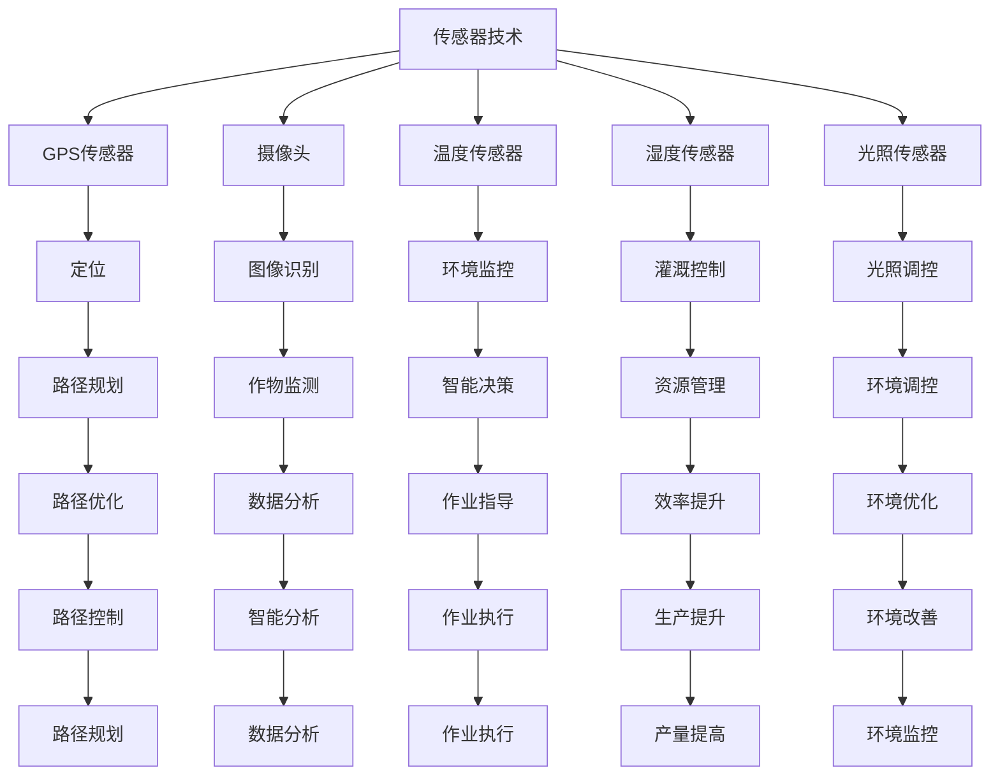

                 

## 《机器人技术在农业自动化中的应用》

> 关键词：机器人技术、农业自动化、应用场景、发展趋势

摘要：本文深入探讨了机器人技术在农业自动化中的应用。从背景介绍到核心概念、技术原理，再到实际应用案例和发展趋势，全面解析了农业自动化中的机器人技术，旨在为农业领域的技术创新提供新思路。

### 引言与背景

农业自动化作为现代农业发展的关键趋势，正逐步改变传统农业的生产模式。随着人口增长和耕地资源的有限性，提高农业产出和资源利用效率成为迫切需求。机器人技术在这一背景下应运而生，为农业自动化提供了强有力的技术支持。

#### 农业自动化的需求与挑战

传统农业依赖于大量劳动力，劳动强度大，生产效率低。此外，农业环境中环境因素复杂，如土壤湿度、光照强度等，对农作物的生长有着重要影响。这些因素使得农业生产面临着如下挑战：

1. **劳动力短缺**：随着城市化和人口老龄化，农村劳动力逐渐减少，农业劳动力短缺问题日益突出。
2. **生产效率低**：传统农业生产方式效率低下，难以满足市场对农产品质量与数量的需求。
3. **资源浪费**：传统农业中，水、肥、农药等资源的利用率较低，导致资源浪费和环境污染。
4. **环境监控难度大**：农业环境中气候条件变化无常，农作物病虫害监测和防治难度较大。

#### 机器人技术在农业自动化中的应用背景

机器人技术具有感知、决策、执行等多种功能，能够实现自动化、智能化生产，为解决上述农业挑战提供了新的可能。机器人技术在农业自动化中的应用主要体现在以下几个方面：

1. **精确农业**：利用机器人技术进行土壤采样、环境监测等，实现农作物的精准管理。
2. **智能种植**：通过机器人进行播种、施肥、灌溉等作业，提高农业生产的自动化水平。
3. **收获与运输**：采用机器人进行作物收获和农产品运输，减少劳动力需求，提高生产效率。
4. **病虫害防治**：利用机器人进行病虫害监测和防治，降低农药使用量，保护环境。

本文将从核心概念、技术原理、应用场景、应用案例和发展趋势等方面，系统地介绍机器人技术在农业自动化中的应用。希望通过本文的探讨，能够为农业领域的技术创新提供有益的参考。

### 机器人技术在农业自动化中的核心概念

在探讨机器人技术在农业自动化中的应用之前，首先需要了解几个核心概念，包括农业机器人的定义、分类及其核心功能与技术。

#### 农业机器人的定义

农业机器人是指应用于农业领域，能够替代或辅助人类完成农业生产任务的自动化设备。这些设备具备一定的智能，能够感知环境、自主决策和执行任务。

#### 农业机器人的分类

根据应用场景和功能，农业机器人可以分为以下几类：

1. **耕作机器人**：主要用于土地翻耕、耙地、开沟等作业，如全自动耕作机、旋耕机等。
2. **种植机器人**：用于播种、移栽、施肥、灌溉等作业，如自动播种机、移栽机器人等。
3. **收获机器人**：用于农作物的收割、采摘、运输等作业，如割草机、采摘机器人等。
4. **病虫害防治机器人**：用于监测和防治病虫害，如无人机喷洒系统、智能植保机器人等。
5. **环境监测机器人**：用于监测土壤、水质、气象等环境参数，如智能土壤检测机器人、无人机气象监测系统等。

#### 农业机器人的核心功能与技术

农业机器人的核心功能主要包括感知、决策、执行和协同。其中，感知和决策技术是实现农业自动化的重要基础，执行和协同技术则决定了农业机器人的应用效果和效率。

1. **感知技术**：
   - **传感器技术**：农业机器人配备各种传感器，如GPS、摄像头、温度传感器、湿度传感器等，用于实时感知环境信息和农作物状态。
   - **遥感技术**：利用卫星遥感、无人机遥感等技术，获取大面积农田的土壤、气候、病虫害等信息，为农业决策提供数据支持。

2. **决策技术**：
   - **人工智能技术**：利用机器学习和人工智能算法，对感知到的数据进行分析和处理，实现农作物生长状态的智能监测和预测。
   - **路径规划技术**：根据环境数据和作业任务，规划农业机器人的行走路径和工作顺序，确保高效完成作业任务。

3. **执行技术**：
   - **运动控制技术**：农业机器人通过电机、液压系统等实现运动控制，完成耕作、播种、收获等作业。
   - **执行器技术**：农业机器人配备各种执行器，如喷洒装置、采摘装置等，用于完成具体作业任务。

4. **协同技术**：
   - **多机器人协同技术**：多个农业机器人协同工作，完成复杂的农业作业任务。
   - **人机交互技术**：农业机器人与农民、农业管理人员等协同工作，实现智能化管理和控制。

通过上述核心概念和技术的介绍，我们可以看到，农业机器人技术在农业自动化中发挥着关键作用。接下来，本文将深入探讨机器人技术在农业自动化中的技术原理，以了解其背后的工作原理和应用前景。

### 机器人技术在农业自动化中的技术原理

机器人技术在农业自动化中的应用，离不开核心技术的支持。以下是机器人技术在农业自动化中的一些关键技术原理，包括传感器技术、机器人运动控制技术和智能决策与路径规划技术。

#### 传感器技术

传感器技术是农业机器人实现环境感知和精确作业的基础。农业机器人常用的传感器包括：

1. **GPS传感器**：用于确定机器人的位置，实现精准导航和定位。
2. **摄像头**：用于拍摄农田图像，通过图像识别技术进行作物状态监测和病虫害识别。
3. **温度传感器**：用于监测土壤和空气温度，为灌溉和施肥提供数据支持。
4. **湿度传感器**：用于监测土壤湿度，指导灌溉作业。
5. **光照传感器**：用于监测光照强度，对作物的生长环境进行调控。

通过这些传感器，农业机器人能够实时获取农田环境数据，并据此调整作业策略。例如，在灌溉机器人中，湿度传感器可以实时监测土壤湿度，当土壤湿度低于设定阈值时，机器人会自动启动灌溉系统进行灌溉。

#### 机器人运动控制技术

机器人运动控制技术是农业机器人实现自主运动和精确作业的核心。常见的机器人运动控制技术包括：

1. **电机控制技术**：通过电机控制机器人的行走速度和方向。农业机器人通常使用直流电机或交流电机，具有高精度、高效率的特点。
2. **液压系统**：用于控制机器人的升降、伸缩等动作，如播种机器人、收获机器人的作业。
3. **伺服控制系统**：用于控制机器人的关节运动，实现复杂动作的精准控制。
4. **轮式运动控制技术**：通过轮式运动实现机器人的前进、后退、转弯等动作。

这些技术使得农业机器人能够在复杂的农田环境中自主移动，并完成各种作业任务。例如，在耕作机器人中，通过电机控制，可以实现深耕、浅耕等多种耕作模式，满足不同农作物的需求。

#### 智能决策与路径规划技术

智能决策与路径规划技术是农业机器人实现自动化作业的关键。主要包括：

1. **智能算法**：利用机器学习和深度学习算法，对传感器获取的数据进行处理和分析，实现农作物的智能监测和预测。例如，通过图像识别技术，可以实时监测作物的生长状态，预测病虫害发生。
2. **路径规划算法**：根据作业任务和环境数据，规划机器人的最优路径。常用的路径规划算法包括A*算法、Dijkstra算法等。
3. **决策系统**：结合环境数据和作业任务，生成决策系统，指导机器人的作业行为。例如，在灌溉机器人中，通过决策系统，可以根据土壤湿度和天气预报，自动调整灌溉时间和水量。

通过智能决策与路径规划技术，农业机器人能够实现自动化作业，提高农业生产效率。例如，在种植机器人中，通过路径规划和智能算法，可以实现精准播种、施肥和灌溉，减少资源浪费，提高作物产量。

#### 技术原理示意图

为了更好地理解上述技术原理，以下是一个简单的示意图：

通过上述技术原理的介绍，我们可以看到，机器人技术在农业自动化中的应用具有广泛的前景。接下来，本文将详细探讨机器人技术在农业自动化中的应用场景，分析其在不同领域的实际应用。

### 机器人技术在农业自动化中的应用场景

机器人技术在农业自动化中的应用场景丰富多样，涵盖了耕作、种植、收获、病虫害防治等多个环节。以下将详细分析这些应用场景，并结合具体案例进行说明。

#### 耕作

耕作是农业生产的基础环节，机器人技术在耕作中的应用主要体现在自动化耕作机械上。例如，全自动耕作机通过GPS定位和传感器技术，能够实现精准的深耕和浅耕。这种自动化耕作技术不仅提高了耕作效率，还减少了劳动力需求。

**案例：某农业公司的全自动耕作机**

某农业公司引进了一款全自动耕作机，该设备配备了GPS传感器和摄像头，能够自动进行深耕和浅耕作业。通过GPS传感器，设备能够精确测量农田的大小和形状，根据作业需求调整耕作深度。摄像头则用于拍摄农田图像，通过图像识别技术，设备能够识别出农作物和杂草，实现精准耕作。

#### 种植

种植环节的机器人技术主要体现在播种、移栽、施肥和灌溉等方面。这些机器人能够根据作物生长需求和环境条件，自动完成种植作业。

**案例：智能播种机器人**

智能播种机器人通过传感器技术和智能算法，能够实现精准播种。机器人配备的摄像头和土壤传感器，能够实时监测土壤质量和种子状态，根据土壤湿度和光照条件，自动调整播种深度和播种时间。例如，在播种小麦时，智能播种机器人能够在适宜的土壤湿度下，自动调整播种深度，提高播种效率。

#### 收获

收获环节的机器人技术主要集中在农作物的采摘和运输上。这些机器人能够根据作物的成熟度，自动完成采摘和运输作业，提高收获效率。

**案例：草莓采摘机器人**

草莓采摘机器人通过视觉识别技术，能够识别出成熟的草莓，并进行采摘。机器人配备了摄像头和机械臂，能够在草莓园中自主移动，识别并采摘成熟草莓。采摘后的草莓通过输送带自动运输到包装区，实现自动化收获。

#### 病虫害防治

病虫害防治是农业生产的重要环节，机器人技术在病虫害防治中的应用主要体现在智能监测和精准防治上。

**案例：无人机病虫害防治**

无人机病虫害防治系统通过搭载摄像头和喷洒装置，能够实现对农田的全面监测和病虫害精准防治。无人机在飞行过程中，摄像头可以拍摄农田图像，通过图像识别技术，识别出病虫害发生区域。然后，喷洒装置会根据病虫害类型和发生程度，自动调整农药喷洒量和喷洒时间，实现精准防治。

#### 环境监测

环境监测是保障农作物健康生长的重要手段，机器人技术在环境监测中的应用主要体现在土壤、水质、气象等参数的监测。

**案例：智能土壤检测机器人**

智能土壤检测机器人通过传感器技术，能够实时监测土壤的温度、湿度、pH值等参数。机器人配备的传感器可以自动采集土壤样本，并通过无线传输技术，将数据发送到农业管理平台。农业管理人员可以通过平台实时查看土壤参数，并根据数据调整灌溉和施肥策略，确保农作物健康生长。

#### 案例分析

以上案例展示了机器人技术在农业自动化中的多种应用场景。通过这些案例，我们可以看到：

1. **提高生产效率**：机器人技术能够实现农业生产的自动化，减少劳动力需求，提高生产效率。例如，智能播种机器人可以高效完成播种作业，减少人工播种的繁琐过程。
2. **减少资源浪费**：机器人技术能够根据作物生长需求和环境条件，自动调整灌溉、施肥等作业，实现精准管理，减少资源浪费。例如，智能土壤检测机器人可以实时监测土壤参数，指导灌溉和施肥，提高水资源和肥料利用率。
3. **保障农产品质量**：机器人技术能够实现对农作物的实时监测和精准管理，确保农产品质量。例如，草莓采摘机器人可以精准采摘成熟草莓，减少农药残留，提高草莓品质。

总之，机器人技术在农业自动化中的应用，不仅能够提高农业生产效率，减少劳动力需求，还能够保障农产品质量，促进农业可持续发展。随着技术的不断进步，机器人技术在农业自动化中的应用前景将更加广阔。

### 农业自动化机器人技术发展趋势

随着科技的不断进步，农业自动化机器人技术正呈现出一系列新的发展趋势，这些趋势将对农业生产的效率和可持续性产生深远影响。以下是农业自动化机器人技术的几个重要发展趋势：

#### 新型农业机器人技术发展

1. **智能感知技术**：未来的农业机器人将配备更加先进的感知设备，如高分辨率摄像头、多光谱传感器等，能够实现对农作物生长环境的精准监测和识别。这将有助于实现更加精细化的农业管理，提高农作物产量和品质。
2. **机器人集群协同作业**：未来的农业机器人将实现集群协同作业，多个机器人可以同时工作，相互协作完成复杂的农业任务。例如，无人机、地面机器人、水下机器人等可以协同工作，实现对农田的全方位监测和管理。
3. **机器人与物联网融合**：农业机器人将更加紧密地与物联网技术相结合，通过传感器、无线通信和网络技术，实现数据的实时传输和共享，从而实现农业生产的全程监控和智能管理。

#### 农业机器人技术与产业融合

1. **跨界融合**：农业机器人技术将与其他领域的技术进行深度融合，如人工智能、大数据、云计算等。这种跨界融合将推动农业机器人技术的创新，提高农业生产的智能化水平。
2. **产业链协同**：农业机器人技术的发展将促进产业链的协同发展，从种子的研发、种植、收获到加工、销售，各个环节都将实现自动化和智能化，从而提高整个产业链的效率和竞争力。
3. **政策支持**：各国政府将加大对农业自动化机器人技术的政策支持，通过补贴、税收优惠等措施，鼓励农民和企业使用农业机器人，推动农业自动化技术的发展。

#### 新型农业机器人技术发展趋势

1. **智能决策与自主学习**：未来的农业机器人将具备更强大的智能决策能力，能够根据环境变化和农作物生长状态，自主调整作业策略。同时，机器人将具备自主学习能力，通过不断积累经验和数据，提高作业的准确性和效率。
2. **绿色环保**：随着环保意识的提高，未来的农业机器人将更加注重环保性能，例如，采用清洁能源、减少农药和化肥使用、降低碳排放等，实现绿色环保生产。
3. **个性化定制**：农业机器人将实现个性化定制，根据不同农作物的生长需求和农田条件，定制化设计机器人作业方案，实现精准农业。

总之，农业自动化机器人技术的发展将推动农业生产方式的根本变革，提高农业生产的效率和可持续性。未来，随着技术的不断进步和政策的支持，农业自动化机器人将在农业生产中发挥更加重要的作用，助力现代农业的快速发展。

### 未来展望与挑战

随着农业自动化机器人技术的不断发展，其在农业生产中的地位将愈发重要。然而，要实现这一技术的广泛应用，仍需克服诸多挑战。

#### 未来发展趋势

1. **智能化水平提升**：未来农业机器人将具备更高水平的智能化，包括更强大的感知能力、更精准的决策能力以及更灵活的执行能力。这将使农业机器人能够更加自主地完成复杂作业任务，提高生产效率。
2. **集成化发展**：农业机器人将与其他农业技术（如物联网、大数据等）深度融合，实现农业生产的全程智能化。这种集成化发展将促进农业产业链的协同，提高整体竞争力。
3. **个性化定制**：农业机器人将根据不同农田和农作物的特点，提供个性化的解决方案。这种个性化定制将有助于实现精准农业，提高农作物产量和品质。

#### 挑战与对策

1. **技术瓶颈**：虽然农业机器人技术已取得显著进展，但依然存在诸多技术瓶颈，如传感器精度、机器人自主导航、环境适应性等。为了克服这些瓶颈，需要加大对基础研究和创新技术的投入，推动技术突破。
2. **成本问题**：农业机器人价格较高，这限制了其大规模推广。为此，政府和企业需要共同推动农业机器人成本的降低，例如，通过补贴、税收优惠等措施，降低农民和企业使用农业机器人的经济负担。
3. **人才培养**：农业机器人技术的发展需要大量具备专业知识的人才。目前，农业机器人领域的专业人才相对稀缺。因此，应加强农业机器人相关的人才培养和培训，提高从业人员的技能水平。
4. **法规与标准**：农业机器人技术的发展需要完善的法规和标准体系来规范其应用。政府应制定相关法规和标准，确保农业机器人的安全、环保和高效运行。
5. **社会接受度**：虽然农业机器人能够提高生产效率和农产品质量，但部分农民可能对其接受度较低。为此，需要加强对农民的科普宣传，提高他们对农业机器人的认知和接受度。

总之，农业自动化机器人技术在未来农业发展中具有巨大潜力。然而，要实现这一技术的广泛应用，仍需克服技术、经济、人才、法规等方面的挑战。通过政府、企业和社会的共同努力，这些挑战将逐步得到解决，农业自动化机器人技术将在农业生产中发挥更加重要的作用。

### 总结与展望

本文从背景介绍、核心概念、技术原理、应用场景、发展趋势和未来展望等多个方面，系统地阐述了机器人技术在农业自动化中的应用。通过详细分析，我们认识到农业机器人技术在提高农业生产效率、减少劳动力需求、保障农产品质量等方面具有显著优势。同时，随着智能感知技术、机器人集群协同、物联网等新兴技术的不断发展，农业机器人技术将在未来农业发展中发挥更加重要的作用。

然而，农业自动化机器人技术仍面临诸多挑战，包括技术瓶颈、成本问题、人才培养、法规与标准等。为了推动农业机器人技术的广泛应用，需要政府、企业和社会共同努力，加强技术创新、政策支持和人才培养，构建完善的法规和标准体系。

展望未来，农业自动化机器人技术将朝着智能化、集成化、个性化的方向发展，为现代农业的可持续发展提供强有力的技术支持。我们期待，在不久的将来，农业机器人技术能够助力全球农业实现绿色、高效、可持续的发展。

### 最佳实践 tips

1. **传感器选型**：选择适合农田环境的高精度传感器，如GPS传感器、摄像头、湿度传感器等，确保数据准确性。
2. **算法优化**：利用机器学习和深度学习算法，提高图像识别、路径规划和决策系统的精度和效率。
3. **设备维护**：定期对农业机器人进行维护和保养，确保设备的正常运行和长期稳定。
4. **数据管理**：建立完善的数据管理系统，实现数据的实时采集、存储、分析和共享，为农业决策提供科学依据。

### 小结

本文深入探讨了机器人技术在农业自动化中的应用，从核心概念、技术原理到应用场景、发展趋势，全面解析了农业机器人技术在农业生产中的优势与挑战。通过实例分析，我们看到了农业机器人技术在提高生产效率、减少劳动力需求、保障农产品质量等方面的显著作用。未来，随着技术的不断进步和政策的支持，农业机器人技术将在全球农业发展中发挥更加重要的作用。

### 注意事项

1. **设备选型**：根据农田环境和作业需求，选择适合的农业机器人设备。
2. **数据安全**：加强数据安全管理，防止数据泄露和滥用。
3. **操作培训**：对农业机器人操作人员进行专业培训，确保正确使用和维护设备。

### 拓展阅读

1. 《智能农业机器人技术与应用》
2. 《农业自动化与物联网》
3. 《精准农业技术导论》

### 作者信息

作者：AI天才研究院/AI Genius Institute & 禅与计算机程序设计艺术 /Zen And The Art of Computer Programming

