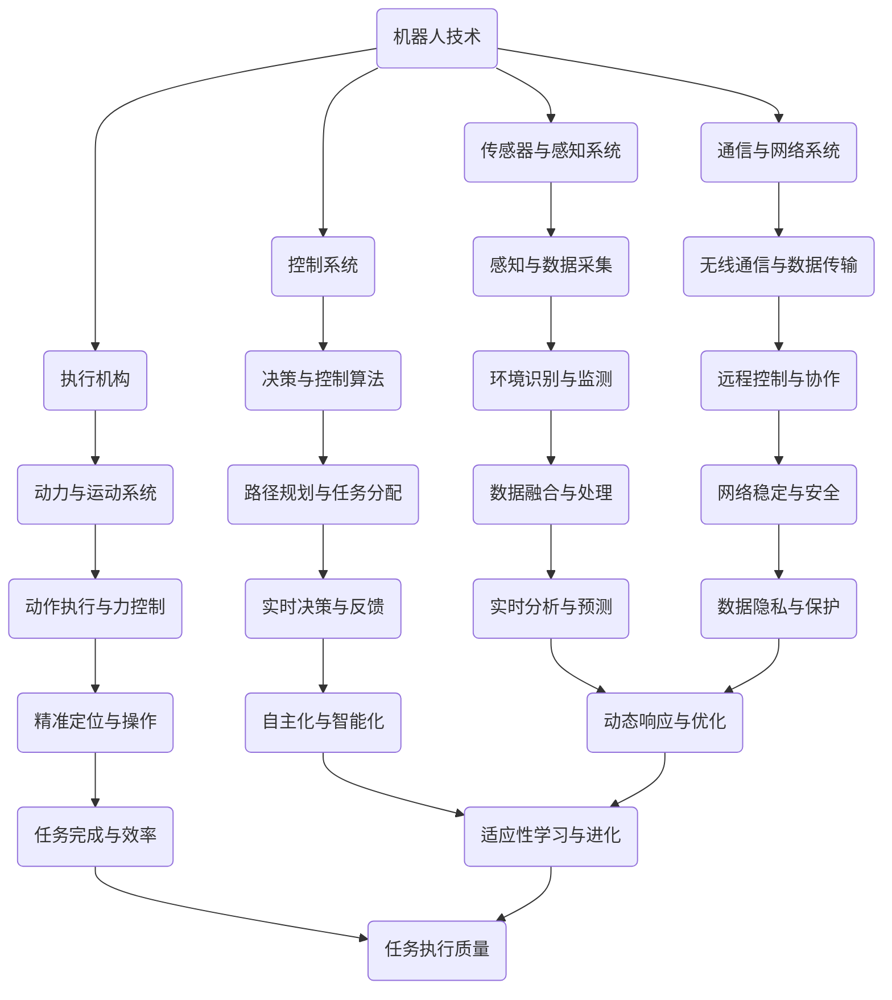

                 

### 机器人技术在危险环境作业中的应用

#### 关键词
- 机器人技术
- 危险环境
- 安全作业
- 感知与控制
- 自动化与智能化
- 应用案例

#### 摘要
本文深入探讨了机器人技术在危险环境作业中的应用。首先，我们介绍了机器人技术的发展历程及其在工业中的应用。接着，我们定义了危险环境，并探讨了评估与监测危险环境的技术。然后，本文重点分析了机器人技术在核能环境、化工环境和建筑工地等不同危险环境中的具体应用案例。随后，我们讨论了机器人技术在危险环境作业中面临的挑战，如环境感知、安全与可靠性等。最后，本文展望了机器人技术的未来发展趋势，探讨了人工智能与机器人技术的融合、新型机器人技术的研发及其在不同危险环境中的应用前景。

---

### 引言

在人类历史上，危险环境的作业一直是一个充满挑战的领域。传统的方法往往需要大量的人力和物力投入，且作业风险极高。随着机器人技术的快速发展，利用机器人进行危险环境作业逐渐成为一种新的解决方案。机器人技术不仅能够提高作业效率，还能显著降低作业风险，保护人类工人的生命安全。

本章节将首先回顾机器人技术的发展历程，从早期的工业机器人到现代的智能机器人，分析其技术演进和关键技术创新。接下来，我们将详细探讨机器人技术的核心组件，包括传感器、控制系统和执行机构等，并介绍如何通过编程与控制技术实现机器人的智能行为。随后，我们将定义危险环境，并分析危险环境的特点及其评估与监测方法。本文的核心内容将集中在机器人技术在核能环境、化工环境和建筑工地等不同危险环境中的应用，通过具体案例展示机器人技术在实际作业中的优势。接下来，我们将讨论机器人技术在危险环境作业中面临的挑战，并探讨未来的发展趋势。通过本文的探讨，我们希望能够为读者提供一幅全面而深入的机器人技术在危险环境作业中的应用图景。

### 机器人技术概述

机器人技术起源于20世纪中期，其发展历程可以说是人类科技进步的一个缩影。最早的机器人可以追溯到1960年代的美国，当时乔治·德沃尔（George Devol）发明了第一台工业机器人，随后与约瑟夫·恩格尔伯格（Joseph Engelberger）合作成立了Unimation公司，这是世界上第一家机器人制造公司。这一时期，机器人的主要应用领域是制造业，通过自动化生产线的使用，大幅提高了生产效率。

进入1970年代，随着计算机技术的发展，机器人技术也得到了显著提升。这一时期的机器人开始具备一些简单的感知能力和编程控制功能。例如，美国麻省理工学院（MIT）的研究人员开发了一种名为Shakey的机器人，它可以利用摄像头和触觉传感器进行简单的导航和对象识别。这一时期，机器人技术的核心突破在于编程和控制的智能化，使得机器人可以执行更复杂的任务。

1980年代，机器人技术进入了一个新的发展阶段。人工智能和计算机视觉技术的进步为机器人赋予了更高的感知能力和自主决策能力。例如，日本的本田公司开发了一款名为Pioneer的机器人，它可以利用激光雷达进行环境建模，并实现自主导航。这一时期，机器人开始应用于更多的非制造业领域，如服务业、医疗和农业等。

1990年代，互联网技术的兴起为机器人技术带来了新的契机。通过无线通信和云计算技术，机器人可以实现远程控制和数据共享。同时，机器人开始具备更高级的自主决策和协作能力。例如，美国波音公司开发的机器人R2，可以在生产线上与人类工人进行实时协作，提高生产效率。

进入21世纪，随着人工智能和大数据技术的快速发展，机器人技术迎来了新的变革。现代机器人不仅具备更高的感知和决策能力，还可以通过深度学习和强化学习实现自我学习和优化。例如，谷歌旗下的Waymo公司开发的自动驾驶汽车，通过海量数据训练，实现了高度智能化的驾驶能力。

机器人技术的发展历程不仅反映了技术的进步，也展示了其多样化的应用场景。从最初的工业制造到服务业、医疗、农业和军事等领域，机器人技术正在不断拓展其应用边界。在这个过程中，机器人技术的核心组件也在不断进化，包括传感器、控制系统、执行机构和通信技术等。每个组件的进步都为机器人的整体性能提升做出了重要贡献。

总的来说，机器人技术的发展历程是一个不断突破和创新的过程，它不仅推动了工业自动化和智能化，也在逐步改变人类的生活方式和工作模式。未来，随着人工智能和机器人技术的进一步融合，我们期待看到更多创新的应用场景和更高效的作业方式。

### 核心概念与联系

在深入探讨机器人技术的核心组件之前，我们首先需要理解几个关键概念，并明确它们之间的联系。以下是机器人技术中几个核心概念及其相互关系的架构图：



**核心概念解释：**

1. **传感器与感知系统（B）**：传感器是机器人获取外部环境信息的重要部件，包括视觉传感器、触觉传感器、激光雷达、红外传感器等。感知系统通过这些传感器对环境进行数据采集，生成数字信号用于后续处理。

2. **控制系统（C）**：控制系统负责处理传感器获取的数据，并对其进行解析和决策。它通常包括处理器、控制器和算法等组件，用于实现机器人的智能行为。

3. **执行机构（D）**：执行机构是机器人的“动作执行者”，它负责将控制系统的指令转换为物理动作。包括电机、液压系统、机械臂等。

4. **通信与网络系统（E）**：通信系统负责机器人与其他设备或系统之间的数据传输和通信，通过网络实现远程控制和数据共享。

**概念之间的关系架构：**

- **感知与数据采集（F）**：传感器与感知系统的核心功能是环境识别与监测（J）。通过数据采集，机器人可以获取周围环境的信息，并进行处理。

- **决策与控制算法（G）**：控制系统通过感知系统获取的数据进行决策，包括路径规划与任务分配（K）。这些算法是实现机器人智能行为的关键。

- **动力与运动系统（H）**：执行机构通过动力系统实现物理动作，如动作执行与力控制（L）。它将控制系统的指令转化为实际的运动。

- **无线通信与数据传输（I）**：通信系统通过网络实现远程控制和数据共享，包括远程控制与协作（M）。这一系统确保了机器人可以与外部环境或其他机器人进行实时交互。

通过上述架构图，我们可以清晰地看到这些核心概念之间的相互关系，以及它们在机器人技术中的重要性。每个组件的协同工作，共同构成了一个高效、智能的机器人系统。

### 机器人技术的核心组件

要深入理解机器人技术，必须了解其核心组件，包括传感器与感知系统、控制系统、执行机构和通信与网络系统。这些组件在机器人的整体性能中起着至关重要的作用。

#### 传感器与感知系统

传感器是机器人获取外部环境信息的关键部件。常见的传感器包括视觉传感器、触觉传感器、激光雷达和红外传感器等。视觉传感器通常使用摄像头来捕捉图像，并通过图像处理算法进行目标识别和位置定位。触觉传感器能够检测接触力和压力，为机器人提供触觉反馈。激光雷达通过发射激光并测量反射时间，构建三维环境地图。红外传感器则可以检测温度变化，常用于热成像和夜间监测。

感知系统不仅包括传感器，还包括数据预处理和融合算法。这些算法能够将多个传感器收集的数据进行整合，生成对环境更全面的认知。例如，视觉传感器和激光雷达的结合可以提供高度精确的3D环境模型，帮助机器人进行自主导航和避障。

#### 控制系统

控制系统是机器人的“大脑”，负责处理传感器获取的数据，并生成控制指令。它通常包括处理器、控制器和算法等组件。处理器是计算的核心，负责执行复杂的计算任务。控制器则接收处理结果，生成具体的控制指令，驱动执行机构进行动作。

控制系统中的算法是实现机器人智能行为的关键。常见的算法包括路径规划算法、避障算法、决策算法和机器学习算法等。路径规划算法用于确定机器人在环境中的移动路径，避免碰撞和障碍。避障算法则帮助机器人实时检测并避开障碍物。决策算法则使机器人能够根据环境变化做出合理的行动选择。机器学习算法则使机器人能够从数据中学习，提高其自主学习和优化能力。

#### 执行机构

执行机构是机器人的“肌肉和骨骼”，负责将控制系统的指令转换为物理动作。常见的执行机构包括电机、液压系统和机械臂等。电机可以通过电力驱动，实现旋转或线性运动，常用于驱动轮子或机械臂。液压系统利用液体压力，实现大范围的运动和力控制，常用于重型机械。机械臂则可以实现复杂的抓取和操作任务，广泛应用于工业、医疗和机器人手术等领域。

执行机构的设计和性能直接影响机器人的作业能力和效率。例如，高精度的电机和液压系统可以实现微小的运动和力控制，而强大的机械臂则能够处理重物和复杂任务。

#### 通信与网络系统

通信与网络系统是机器人的“神经系统”，负责实现机器人与其他设备或系统之间的数据传输和通信。无线通信技术如Wi-Fi、蓝牙和5G等，使机器人能够远程控制和数据共享。网络系统不仅支持实时数据传输，还提供了安全性和稳定性的保障。

通信系统在多机器人协作和远程操作中尤为重要。例如，在工业生产线中，多个机器人需要协同工作，通过通信系统实现任务分配和协调。在远程手术中，医生需要通过通信系统远程控制手术机器人，实时传输图像和数据。

#### 综合应用

这些核心组件在机器人系统中的综合应用，使机器人能够执行复杂任务，提高工作效率和安全性。例如，在核能环境中，机器人通过传感器感知环境，控制系统进行实时决策，执行机构进行操作，并通过通信系统与地面控制中心保持联系。在灾难救援中，机器人利用激光雷达和红外传感器进行环境监测，控制系统制定救援方案，执行机构执行搜救任务，并通过无线通信系统与救援队保持联系。

通过深入了解这些核心组件，我们可以更好地理解机器人技术的工作原理和应用潜力。未来，随着传感器、控制系统和通信技术的进一步发展，机器人技术将在更多领域发挥重要作用。

### 机器人编程与控制

在了解了机器人技术的核心组件之后，接下来我们将探讨机器人的编程与控制技术。这是实现机器人智能行为和高效作业的关键步骤。机器人编程主要涉及编程语言、控制算法以及路径规划等内容，下面我们将一一进行介绍。

#### 编程语言

机器人编程语言是开发者与机器人进行交互的工具。常见的机器人编程语言包括：

1. **工业机器人编程语言（Robotics Application Language, RAL）**：这是一种专门为工业机器人设计的编程语言，具有简单易用的语法和丰富的指令集，适用于各类工业场景。
   
2. **Python**：Python是一种广泛使用的编程语言，具有简洁的语法和强大的库支持。在机器人编程中，Python常用于开发复杂的算法和数据处理任务。

3. **C/C++**：C/C++是一种高性能的编程语言，适用于实时控制和性能敏感的应用。在机器人控制中，C/C++可以提供更高效的执行速度和更精细的硬件控制。

#### 控制算法

控制算法是机器人实现智能行为的核心。以下是几种常见的控制算法：

1. **PID控制（比例-积分-微分控制）**：PID控制是最常用的控制算法之一，通过调整比例、积分和微分系数，实现对系统输出的精确控制。它适用于速度控制、位置控制和力控制等场景。

2. **模糊控制**：模糊控制通过模糊逻辑来处理不确定性问题，适用于复杂和非线性系统的控制。它能够根据输入变量的模糊集合和规则库，生成控制输出。

3. **自适应控制**：自适应控制能够根据系统动态变化，自动调整控制参数，提高系统的鲁棒性和适应性。它适用于不确定性和变动态系统的控制。

#### 路径规划

路径规划是机器人自主导航和任务执行的基础。以下是几种常见的路径规划算法：

1. **A*算法**：A*算法是一种基于启发式的搜索算法，通过评估函数计算路径的最优性。它适用于静态环境中的快速路径规划。

2. **Dijkstra算法**：Dijkstra算法是一种基于图论的搜索算法，用于计算两点之间的最短路径。它适用于静态和动态环境中的路径规划。

3. **RRT（快速随机树）算法**：RRT算法是一种随机采样和树形扩展的算法，通过在配置空间中随机采样并构建扩展树，实现复杂环境中的路径规划。

#### 案例分析

为了更好地理解机器人编程与控制技术，我们来看一个简单的例子：

**任务**：编写一个Python程序，使用PID控制算法实现一个直流电机速度控制。

```python
import RPi.GPIO as GPIO
import time

# 定义PID参数
Kp = 2.0
Ki = 0.5
Kd = 1.0

# 初始化GPIO
GPIO.setmode(GPIO.BCM)
GPIO.setup(EN, GPIO.OUT)
p = GPIO.PWM(EN, 1000)  # 1000Hz频率

# 初始化PID控制器
setpoint = 10.0  # 目标速度
error = 0.0
integral = 0.0
derivative = 0.0

# PID控制函数
def pidController(setpoint, current_value):
    global error, integral, derivative
    
    error = setpoint - current_value
    integral += error
    derivative = error - previous_error
    
    output = Kp * error + Ki * integral + Kd * derivative
    previous_error = error
    
    return output

# 主程序
try:
    p.start(0)
    while True:
        # 假设当前速度为7.5
        current_value = 7.5
        # 计算PID输出
        output = pidController(setpoint, current_value)
        # 输出控制信号
        p.ChangeDutyCycle(output)
        time.sleep(0.1)

except KeyboardInterrupt:
    pass
finally:
    p.stop()
    GPIO.cleanup()
```

在这个例子中，我们使用Python编写了一个简单的PID控制器，实现对直流电机速度的精确控制。程序首先初始化GPIO，设置PWM控制信号。接着，我们定义了PID控制器的参数和PID控制函数。在主程序中，我们通过不断读取当前速度值，计算PID输出，调整电机的PWM信号，实现速度控制。

通过这个简单的例子，我们可以看到机器人编程与控制技术是如何应用到实际中的。未来，随着人工智能和机器人技术的进一步发展，我们将看到更加复杂和智能的编程与控制算法被应用于各类机器人系统中。

### 危险环境的定义与分类

危险环境是指那些对人类健康和生命安全构成威胁，并且需要特别防范和处理的场所。这些环境通常具有高温、高压、有毒有害气体、辐射、易燃易爆等危险特征，使得人类工人在这些环境中作业存在极高的风险。根据不同的危险特性，危险环境可以分类如下：

1. **高温环境**：高温环境通常指温度高于人体承受能力的场所，如锅炉房、熔炉车间、高温冶炼厂等。长时间暴露在高温环境中，会导致中暑、热衰竭甚至热射病等健康问题。

2. **高压环境**：高压环境包括高压电站、化工装置、油井开采等场所。这些环境中压力巨大，存在爆炸、泄漏和火灾等危险。高压环境下作业需要特别小心，防止设备损坏和人员伤害。

3. **有毒有害气体环境**：有毒有害气体环境常见于化工、制药、采矿等行业。例如，有毒气体如一氧化碳、硫化氢等，会对呼吸系统造成严重伤害，甚至致命。

4. **辐射环境**：辐射环境主要指放射性物质的储存、运输和处置场所，如核电站、放射性废物处理设施等。长期暴露在高辐射环境中，可能导致放射性疾病，甚至癌症。

5. **易燃易爆环境**：易燃易爆环境包括石油、天然气开采和运输设施、化工厂、加油站等。这些环境中存在的可燃气体或易燃物质，一旦遇到火源，极易引发火灾和爆炸。

6. **深井和地下环境**：深井和地下环境包括矿井、隧道、地下仓储等。这些环境中氧气含量低、湿度大、路况复杂，容易发生窒息、中毒、坍塌等事故。

7. **极端气候环境**：极端气候环境包括极寒、极热、台风、洪水等灾害现场。在这些环境中作业，需要应对极端天气对设备和人员的影响。

通过对危险环境的分类，我们可以更好地了解每种环境的危险特性，并采取相应的防范措施，确保作业人员的安全。机器人技术在危险环境中的应用，正是通过这些分类和防范措施，实现了对高危作业的替代和保障。

### 危险环境的评估与监测

在危险环境中进行作业，首要任务是确保作业安全。危险环境的评估与监测是实现这一目标的关键环节。以下将详细讨论危险环境的评估方法、监测技术以及相关设备。

#### 危险环境的评估方法

危险环境的评估主要涉及以下几个方面：

1. **风险评估**：通过分析环境中的潜在危险源，评估其对人员和设备可能造成的危害程度。风险评估通常包括识别危险源、分析危险源的可能性及其后果，并制定相应的风险缓解措施。

2. **危险分级**：根据风险评估结果，将危险环境分为不同的等级，以便采取相应的防护措施。危险分级可以基于国际标准，如ISO 45001职业健康安全管理体系，或企业内部规定。

3. **现场调查**：通过现场调查，收集危险环境的详细信息，包括温度、湿度、气体浓度、辐射水平等。现场调查通常需要专业人员进行，以确保数据的准确性和安全性。

4. **模拟测试**：在实验室或模拟环境中，对危险环境进行模拟测试，验证防护措施的有效性。模拟测试可以帮助发现潜在问题，并提出改进措施。

#### 危险环境的监测技术

为了实时了解危险环境的状态，需要采用多种监测技术。以下是几种常见的监测技术：

1. **气体检测技术**：用于检测危险环境中的有毒有害气体，如一氧化碳、硫化氢、氨气等。常用的气体检测设备包括气体传感器、气体检测仪和便携式气体检测器。

2. **辐射检测技术**：用于检测辐射环境中的辐射水平，如放射性同位素和X射线等。辐射检测设备包括辐射仪、辐射监测仪和便携式辐射探测器。

3. **温度和湿度监测技术**：用于检测高温、低温和湿度变化。常用的设备包括温度传感器、湿度传感器和智能环境监测系统。

4. **压力和流量监测技术**：用于检测高压和流量变化，确保设备运行在安全的参数范围内。常用的设备包括压力表、流量计和压力传感器。

5. **振动和噪声监测技术**：用于检测机械振动和噪声水平，评估设备的工作状态和潜在故障。常用的设备包括振动传感器和噪声监测仪。

#### 监测设备

以下是几种常用的监测设备及其功能：

1. **气体检测仪**：可以实时监测空气中的有毒有害气体浓度，并在浓度超过安全阈值时发出警报。

2. **辐射监测仪**：可以实时监测环境中的辐射水平，并记录辐射剂量率。

3. **温度传感器**：用于测量环境的温度，可以通过模拟信号或数字信号输出数据。

4. **湿度传感器**：用于测量环境的湿度，对控制空气质量和预防腐蚀等有重要作用。

5. **压力传感器**：用于测量设备的压力状态，确保设备在安全的工作范围内运行。

6. **振动传感器**：用于检测机械振动，对预防机械故障和保障设备安全至关重要。

7. **便携式检测器**：可以携带到现场进行实时监测，方便快速评估环境状况。

通过使用这些评估和监测技术，以及相应的设备，可以实时掌握危险环境的状态，及时采取防护措施，确保作业人员的安全。随着监测技术的不断进步，未来危险环境的评估与监测将变得更加精确和高效。

### 核能环境中的机器人应用

核能环境由于其极端的辐射水平和潜在的危险性，一直是人类作业的禁区。然而，随着机器人技术的快速发展，核能环境中的机器人应用逐渐成为一种可行的解决方案。核能环境中的机器人不仅能够代替人类进行危险作业，提高工作效率，还能确保作业人员的安全。

#### 特点与挑战

核能环境具有以下几个显著特点：

1. **高辐射水平**：核能环境中辐射水平极高，对人体的危害极大。长时间暴露在高辐射环境中，可能导致放射性疾病，甚至癌症。

2. **高温和高压**：核能设备通常在高温高压下运行，环境条件极为苛刻，对机器人的材料和结构设计提出了严格要求。

3. **复杂的环境**：核能设施内部结构复杂，空间狭小，通风不良，使得机器人的导航和操作具有很大难度。

4. **放射性污染**：核能事故可能导致放射性物质泄漏，环境受到污染。机器人需要具备抗污染能力，确保在污染环境中长时间作业。

核能环境中的机器人应用面临以下挑战：

1. **高辐射防护**：机器人需要采用特殊的材料和设计，以防止辐射对机器人和操作人员造成伤害。

2. **热稳定性和耐久性**：机器人需要在高温高压环境下长期运行，材料和结构设计必须具备良好的热稳定性和耐久性。

3. **自主导航和操作**：核能设施内部结构复杂，机器人需要具备高度自主的导航和操作能力，以应对各种突发情况。

4. **数据传输和通信**：由于核能环境中的电磁干扰，机器人与地面控制中心的数据传输和通信需要特别设计和优化，确保通信的稳定性和可靠性。

#### 应用案例

核能环境中的机器人应用涵盖了多个方面，以下是一些典型的应用案例：

1. **核废料处理**：核废料处理是核能环境中最危险的作业之一。机器人可以代替人类进行核废料的分类、包装和运输，降低作业风险。

   - **案例**：日本福岛核电站事故后，日本研发了多款核废料处理机器人，如“减废机器人”和“封棺机器人”。这些机器人可以自动操作，将核废料装入特制的容器中，确保作业人员的安全。

2. **核设施维护**：核能设施需要定期维护，以确保其安全运行。机器人可以在核设施内部进行巡检、维修和保养，提高维护效率。

   - **案例**：美国核能设施中使用的“维护机器人”具备高精度的传感器和执行机构，可以在核反应堆内部进行复杂的操作，如检查反应堆组件、更换部件等。

3. **环境监测**：核能环境中的环境监测是确保设施安全运行的重要环节。机器人可以实时监测辐射水平、气体浓度和温度等参数，提供精确的数据支持。

   - **案例**：国际原子能机构（IAEA）开发的“辐射监测机器人”能够在核事故现场进行快速、精确的辐射监测，为应急响应提供关键数据。

4. **灾害救援**：在核事故发生后，机器人可以进入受污染区域进行救援工作，搜索失踪人员、搬运重物和清理废墟。

   - **案例**：2011年，日本福岛核电站事故后，日本紧急部署了多款救援机器人，如“铁甲战车”和“搜索机器人”。这些机器人可以在高辐射环境中进行快速搜索和救援工作，提高救援效率。

核能环境中的机器人应用不仅提高了作业效率，降低了作业风险，还为核能设施的维护和运营提供了强有力的支持。随着机器人技术的进一步发展，未来核能环境中的机器人应用将更加广泛和深入，为人类创造更安全、更高效的核能环境。

### 化工环境中的机器人应用

化工环境因其复杂的工艺流程和潜在的危险性，一直对作业人员的安全构成重大威胁。传统的手工操作不仅效率低下，而且易引发事故。随着机器人技术的不断进步，化工环境中的机器人应用逐渐成为一种有效的解决方案，不仅提高了作业效率，还显著降低了作业风险。

#### 特点与挑战

化工环境具有以下几个显著特点：

1. **高温高压**：化工生产过程中常涉及高温高压操作，设备工作条件苛刻，这对机器人的材料和结构设计提出了高要求。

2. **腐蚀性环境**：化工环境中的介质往往具有强烈的腐蚀性，如酸性气体、碱性溶液等，这要求机器人具备良好的抗腐蚀能力。

3. **易燃易爆**：化工生产过程中存在大量的易燃易爆物质，如苯、氨、氢气等，任何微小火花或泄漏都可能引发严重事故。

4. **有毒有害气体**：许多化工产品具有高毒性，如氯化氢、二氧化硫等，这要求机器人能够在有毒有害气体环境中长时间稳定运行。

化工环境中的机器人应用面临以下挑战：

1. **高可靠性**：化工环境复杂多变，机器人需要具备高度可靠性，以应对各种突发情况，确保连续稳定运行。

2. **精确控制**：化工生产过程对控制精度要求极高，机器人需要具备精确的运动控制和参数调节能力。

3. **抗腐蚀和抗辐射**：化工设备常处于高温高压和腐蚀性环境中，机器人材料和表面处理需具备良好的抗腐蚀和抗辐射性能。

4. **安全防护**：化工环境中的危险物质对机器人和操作人员的安全构成威胁，需要设计完善的安全防护措施，如紧急停机、远程控制等。

#### 应用案例

在化工环境中，机器人的应用涵盖了多个方面，以下是一些典型的应用案例：

1. **反应釜内部清洗**：反应釜是化工生产中的关键设备，内部清洗通常需要将反应釜停机，消耗大量时间和人力资源。机器人可以进入反应釜内部，自动清洗反应釜壁，提高清洗效率，降低操作风险。

   - **案例**：某化工企业采用了一款智能清洗机器人，该机器人利用多传感器融合技术和自主导航系统，能够自动识别反应釜内部结构，精确控制清洗喷嘴，实现高效清洗。

2. **自动化检测**：机器人可以携带高精度检测设备，进行化工设备的定期检测和维护，及时发现设备故障和安全隐患。

   - **案例**：某化工企业引入了多款自动化检测机器人，这些机器人能够自动检测管道、阀门和压力表等设备，实时监测设备运行状态，及时发出警报，保障生产安全。

3. **物料搬运**：在化工生产过程中，大量的原料和产品需要搬运，机器人可以替代人工进行物料搬运，提高生产效率，降低操作风险。

   - **案例**：某化工企业采用了自动化的智能搬运机器人，这些机器人配备了高精度传感器和智能控制系统，能够自动识别搬运路径，避免碰撞和意外。

4. **实时监测与控制**：机器人可以实时监测化工生产过程中的各项参数，如温度、压力、流量等，并通过远程控制技术，对生产过程进行实时调整和优化。

   - **案例**：某化工企业通过引入智能监测与控制系统，实现了生产过程的自动化控制。机器人实时采集生产数据，通过智能算法进行数据分析，自动调整生产参数，提高生产效率和质量。

化工环境中的机器人应用不仅提高了生产效率，降低了作业风险，还为化工企业的数字化转型和智能化升级提供了有力支持。随着机器人技术的不断进步，未来化工环境中的机器人应用将更加广泛和深入，为化工行业带来更多创新和发展机遇。

### 建筑工地中的机器人应用

建筑工地是一个充满挑战和危险的作业环境，传统的建筑方法不仅效率低下，而且对工人安全构成了重大威胁。随着机器人技术的不断发展，建筑工地中的机器人应用逐渐成为一种有效的解决方案，不仅提高了施工效率，还显著降低了作业风险。

#### 特点与挑战

建筑工地具有以下几个显著特点：

1. **环境复杂**：建筑工地通常地形复杂，空间狭小，建筑材料和设备种类繁多，施工过程涉及多种作业内容，这对机器人的自主导航和作业能力提出了高要求。

2. **动态变化**：建筑工地的环境动态变化快，施工进度随时可能调整，机器人需要具备较强的适应能力和实时响应能力。

3. **高强度作业**：建筑工地的作业强度大，机器人需要能够长时间连续工作，且具备高负载能力。

4. **安全隐患**：建筑工地存在高空作业、深基坑挖掘、建筑材料倒塌等安全隐患，机器人需要具备高效的安全防护能力。

建筑工地中的机器人应用面临以下挑战：

1. **精确控制**：建筑工地的施工精度要求高，机器人需要具备高精度的运动控制和定位能力，以确保施工质量。

2. **环境适应**：建筑工地环境复杂多变，机器人需要具备适应各种施工场景的能力，如不同材质的地形、光线变化等。

3. **高可靠性**：建筑工地环境恶劣，机器人需要具备高可靠性，以应对突发状况，确保施工连续进行。

4. **远程监控与控制**：建筑工地通常地处偏远，机器人需要具备远程监控与控制能力，以便在出现问题时及时调整。

#### 应用案例

在建筑工地中，机器人的应用涵盖了多个方面，以下是一些典型的应用案例：

1. **自动化施工**：机器人可以代替人工进行混凝土浇筑、钢筋绑扎、模板搭建等自动化施工任务，提高施工效率和质量。

   - **案例**：某建筑公司采用了一款混凝土浇筑机器人，该机器人通过自动定位和精确控制，能够高效完成混凝土浇筑任务，减少人工干预，提高施工质量。

2. **自动化检测**：机器人可以携带高精度检测设备，对建筑结构进行实时检测和维护，确保施工质量。

   - **案例**：某建筑公司引入了自动化检测机器人，这些机器人能够自动检测建筑结构的裂缝、变形等隐患，及时发现施工质量问题，为施工进度提供数据支持。

3. **物料搬运**：机器人可以替代人工进行建筑材料和设备的搬运，减轻工人劳动强度，提高施工效率。

   - **案例**：某建筑工地采用了多款物料搬运机器人，这些机器人配备了高精度传感器和智能控制系统，能够自动识别搬运路径，避免碰撞和意外。

4. **智能化安全监控**：机器人可以实时监测施工现场的安全状况，及时发现安全隐患，并采取相应措施。

   - **案例**：某建筑公司引入了智能化安全监控系统，通过机器人实时采集施工现场的数据，结合大数据分析，自动识别潜在的安全隐患，及时发出警报，保障施工现场的安全。

建筑工地中的机器人应用不仅提高了施工效率，降低了作业风险，还为建筑行业带来了新的发展机遇。随着机器人技术的不断进步，未来建筑工地中的机器人应用将更加广泛和深入，为建筑行业带来更多创新和发展。

### 其他危险环境中的机器人应用

除了核能、化工和建筑工地等典型危险环境，机器人技术还在许多其他高风险环境中得到了广泛应用。这些环境包括火灾现场、矿山、海洋和极地等，机器人在这些环境中发挥着不可或缺的作用。

#### 火灾现场

火灾现场是一个极其危险的环境，高温、浓烟和有毒气体使得人类难以直接进入作业。机器人可以携带各种灭火设备和传感器，进行火灾探测、灭火和救援工作。

- **灭火机器人**：灭火机器人具备高温耐热能力，可以迅速进入火灾现场，使用灭火剂和灭火水枪进行灭火。例如，日本的灭火机器人“火防龙”能够在火灾现场自动识别火源，并迅速采取灭火措施。
- **搜救机器人**：搜救机器人具备高机动性和感知能力，可以在火灾现场进行搜索和救援工作。它们可以携带热成像相机、气体传感器和摄像头，快速发现被困人员，并通过通信设备与地面控制中心保持联系。

#### 矿山

矿山是一个充满危险的环境，地下矿井中的坍塌、瓦斯爆炸和地下水等风险对矿工的安全构成威胁。机器人可以在这些环境中执行危险作业，保障矿工的安全。

- **矿山安全监测机器人**：这些机器人可以实时监测矿山中的气体浓度、水位和岩层稳定性，及时发现潜在的安全隐患，并通过无线通信将数据传输到地面控制中心。
- **矿山挖掘机器人**：矿山挖掘机器人可以携带挖掘工具，自动进行矿洞挖掘和矿石运输工作，提高矿山生产效率。

#### 海洋

海洋环境复杂多变，海洋作业面临高成本和高风险。机器人技术在海洋勘探、海洋清洁和海洋救援等领域发挥着重要作用。

- **海洋勘探机器人**：这些机器人可以搭载声呐、取样器和传感器，进行海底地形勘探、资源勘探和环境监测。例如，美国海军的无人潜航器（UUV）可以在海底进行详细探测，为海底作战提供数据支持。
- **海洋清洁机器人**：海洋清洁机器人可以携带清理工具，自动清除海洋垃圾和污染物质，保护海洋生态。

#### 极地

极地环境极端恶劣，人类难以在极地环境中长时间生存和工作。机器人可以在极地执行科学考察、资源勘探和环境保护任务。

- **极地科考机器人**：这些机器人可以在极地冰盖上进行地质、生物和环境参数的测量，为极地研究提供宝贵数据。
- **极地救援机器人**：极地救援机器人可以在极地发生事故时进行紧急救援，快速搜索和救助遇险人员。

#### 应用效果与前景

机器人在这些危险环境中的应用显著提高了作业效率和安全性，减少了人员伤亡和设备损失。随着机器人技术的不断进步，未来机器人在其他危险环境中的应用前景将更加广阔：

1. **智能化与自主化**：未来的机器人将具备更高的智能化和自主化水平，能够自主决策和执行复杂任务，减少对人工的依赖。
2. **多机器人协作**：多机器人协作系统将实现机器人之间的信息共享和协同作业，提高整体作业效率。
3. **远程操作与监控**：随着5G和物联网技术的发展，机器人将实现更加高效的远程操作和监控，确保作业的连续性和安全性。

总之，机器人技术在各种危险环境中的应用为人类开辟了新的作业方式，提高了作业效率，保障了作业人员的安全。未来，随着技术的进一步发展，机器人将在更多危险环境中发挥重要作用，为人类创造更加安全、高效的工作环境。

### 机器人技术在危险环境作业中的挑战

尽管机器人技术在危险环境作业中展现了巨大的潜力和优势，但其广泛应用仍然面临诸多挑战。这些挑战主要集中在环境感知、安全与可靠性、以及机器人作业成本等方面。

#### 环境感知

危险环境通常具有复杂、多变和高度不确定性的特点，这对机器人的环境感知能力提出了极高要求。环境感知是机器人进行自主导航、决策和执行任务的基础，但以下几个因素限制了机器人的感知能力：

1. **多传感器融合**：机器人需要集成多种传感器（如视觉传感器、激光雷达、红外传感器等）来获取环境信息，但这些传感器的数据存在互补性和冗余性，如何有效地融合这些数据，提高感知精度，是一个重要挑战。
2. **动态环境**：危险环境中的环境变化迅速，机器人需要具备实时感知和适应能力，以应对突发情况。例如，在火灾现场，火焰的动态变化和烟雾的扩散速度极快，机器人需要及时调整行为策略。
3. **复杂干扰**：危险环境中的电磁干扰、噪音和其他障碍物会对传感器的正常工作产生影响，导致感知数据的误差增大。如何减少干扰、提高感知准确性，是一个亟待解决的问题。

#### 安全与可靠性

安全与可靠性是机器人技术应用于危险环境的核心问题。机器人需要在极端环境下稳定运行，确保作业人员和设备的安全。以下是一些主要挑战：

1. **高辐射防护**：在核能等高辐射环境中，机器人需要采用特殊的材料和设计，以防止辐射对机器人和操作人员造成伤害。然而，现有的防护材料和设计往往重量大、成本高，难以满足实际应用需求。
2. **抗干扰能力**：危险环境中的电磁干扰、振动和噪音等会对机器人的控制系统和通信系统造成干扰，可能导致系统失控或数据丢失。如何提高机器人的抗干扰能力，确保系统的稳定运行，是一个重要课题。
3. **故障处理**：在危险环境中，机器人可能会遇到各种故障，如传感器失效、执行机构损坏等。机器人需要具备自我检测和故障恢复能力，以避免因故障导致作业中断或安全事故。
4. **安全监控与应急响应**：机器人需要配备完善的安全监控与应急响应系统，以便在出现异常情况时，能够及时采取应对措施，保障作业人员的安全。

#### 作业成本

机器人技术的广泛应用受限于其高昂的作业成本。以下是一些主要成本因素：

1. **研发成本**：机器人技术涉及多个领域，包括机械工程、电子工程、计算机科学等，研发成本高昂。尤其是在危险环境中，由于环境特殊性和安全要求高，研发难度更大。
2. **维护成本**：机器人需要定期维护和保养，包括传感器校准、电池更换、系统升级等。这些维护工作通常需要专业技术人员进行，增加了维护成本。
3. **培训成本**：机器人技术的应用需要专业操作人员，这些人员需要经过系统培训，具备操作机器人的技能和安全意识。培训成本包括教材、培训设备和师资力量等。

#### 未来发展方向

为了克服这些挑战，未来的机器人技术将在以下几个方面取得重要进展：

1. **智能化与自主化**：通过人工智能和机器学习技术，提高机器人的环境感知和自主决策能力，减少对人工的依赖。
2. **多机器人协作**：通过多机器人协作系统，实现机器人之间的信息共享和协同作业，提高整体作业效率。
3. **轻量化与高效化**：通过新材料和先进制造技术，开发轻量化、高效化的机器人系统，降低作业成本。
4. **安全防护与应急响应**：通过改进防护材料和设计、增强抗干扰能力和故障处理能力，提高机器人的安全性和可靠性。

总之，机器人技术在危险环境作业中虽然面临诸多挑战，但随着技术的不断进步，这些挑战将逐步得到克服，机器人将在更多危险环境中发挥重要作用，为人类创造更加安全、高效的工作环境。

### 机器人技术在危险环境作业中的未来发展趋势

随着科技的飞速进步，机器人技术在危险环境作业中的应用前景愈发广阔。未来，机器人技术将在多个方面实现突破，推动其在危险环境作业中的广泛应用。以下是一些主要的发展趋势：

#### 人工智能与机器人技术的融合

人工智能（AI）技术的迅速发展，为机器人技术注入了新的动力。通过深度学习和强化学习算法，机器人可以实现更高层次的环境感知和决策能力。例如，自动驾驶汽车和无人机等领域的成功应用，展示了AI与机器人技术融合的巨大潜力。未来，人工智能技术将更加深入地集成到机器人系统中，使机器人能够自主学习和优化其行为，提高作业效率和安全性。

#### 新型机器人技术的研发

新型机器人技术的研发将为危险环境作业带来新的解决方案。例如，软体机器人由于其柔韧性和适应性，能够在复杂和危险的环境中执行任务，如搜救、清理和维修等。此外，纳米机器人技术的发展，使得在微观尺度上操作成为可能，未来可以在生物医学、环境监测等领域发挥重要作用。这些新型机器人技术的研发，将推动机器人技术在危险环境作业中的应用更加深入和多样化。

#### 虚拟现实与增强现实技术的应用

虚拟现实（VR）和增强现实（AR）技术将与机器人技术相结合，为危险环境作业提供更加直观和高效的辅助手段。通过VR/AR技术，操作人员可以远程实时监控机器人的工作状态，并实时提供操作指令。例如，在建筑工地或矿山中，操作人员可以通过VR头盔进行远程操作，实时调整机器人的工作策略，提高作业效率。VR/AR技术的应用，将显著降低危险环境中的作业风险，提高作业安全性。

#### 跨学科合作与集成

机器人技术在危险环境作业中的应用，需要多个学科领域的合作和集成。未来，计算机科学、机械工程、材料科学、生物医学等领域的专家将共同合作，推动机器人技术的全面发展。跨学科合作将有助于解决复杂的技术问题，提高机器人的综合性能和可靠性。例如，在核能环境中，材料科学家可以开发出抗辐射、耐高温的新型材料，机械工程师可以设计出更可靠的机器人结构，计算机科学家可以开发出更高效的算法和控制系统。

#### 机器人云平台的构建

随着物联网（IoT）和云计算技术的发展，机器人云平台将成为未来机器人技术的重要组成部分。机器人云平台可以实现机器人之间的数据共享和协同作业，提高整体作业效率。例如，在多机器人协同作业的场景中，不同机器人可以通过云平台共享环境信息和任务指令，实现无缝协作。此外，云平台还可以提供强大的数据分析和预测功能，帮助操作人员更好地了解作业环境和优化作业策略。

#### 标准化和规范化

为了确保机器人技术在危险环境作业中的安全和可靠性，标准化和规范化工作至关重要。未来，各国将制定和完善相关的机器人技术标准和规范，确保机器人系统的设计、制造和运行符合安全要求。例如，制定机器人环境感知、控制算法、通信和数据传输等方面的标准，有助于提高机器人系统的互操作性和兼容性。

总之，随着人工智能、新型机器人技术、VR/AR、跨学科合作、机器人云平台和标准化等趋势的发展，机器人技术将在危险环境作业中发挥越来越重要的作用。通过不断创新和优化，机器人技术将为危险环境作业带来更高效、更安全的解决方案，为人类创造更加美好的未来。

### 结论

本文深入探讨了机器人技术在危险环境作业中的应用。首先，我们回顾了机器人技术的发展历程及其在工业中的应用，并介绍了机器人技术的核心组件，包括传感器、控制系统和执行机构。随后，我们定义了危险环境，并分析了评估和监测危险环境的方法。接着，本文详细探讨了机器人技术在核能环境、化工环境和建筑工地等不同危险环境中的应用案例，展示了机器人技术在这些领域的实际应用优势。随后，我们讨论了机器人技术在危险环境作业中面临的挑战，并展望了其未来发展趋势。

通过本文的探讨，我们可以看到机器人技术在危险环境作业中的重要性。它们不仅能够提高作业效率，降低作业风险，还能保护作业人员的生命安全。随着人工智能和机器人技术的进一步融合，未来机器人技术在危险环境作业中的应用将更加广泛和深入，为人类创造更加安全、高效的工作环境。

为了进一步推动机器人技术在危险环境作业中的应用，我们提出以下建议：

1. **加强技术创新**：研发更先进、更智能的机器人技术，提高机器人在复杂和危险环境中的适应能力和作业效率。
2. **完善标准和规范**：制定和完善相关标准和规范，确保机器人系统的设计、制造和运行符合安全要求。
3. **加强人才培养**：培养更多具备机器人技术专业知识和实际操作能力的复合型人才，为机器人技术在危险环境中的应用提供人才保障。
4. **推进跨学科合作**：鼓励计算机科学、机械工程、材料科学、生物医学等领域的专家共同合作，推动机器人技术的全面发展。
5. **构建机器人云平台**：通过构建机器人云平台，实现机器人之间的数据共享和协同作业，提高整体作业效率。

通过以上措施，我们可以进一步推动机器人技术在危险环境作业中的应用，为人类创造更加美好的未来。

### 拓展阅读

为了深入了解机器人技术在危险环境作业中的应用，以下是几篇推荐的拓展阅读资料：

1. **《机器人技术与自动化在危险环境中的应用研究》**：这篇论文详细探讨了机器人技术在危险环境中的应用，包括核能、化工、建筑工地等场景，分析了现有技术及其局限性。

2. **《危险环境作业机器人系统设计与应用》**：这本书系统地介绍了危险环境作业机器人的系统设计方法，涵盖了感知、控制、执行和通信等关键组件，以及实际应用案例。

3. **《基于人工智能的机器人自主导航与控制技术》**：该论文集中讨论了人工智能在机器人自主导航和控制中的应用，介绍了最新的深度学习和强化学习算法，以及其在实际场景中的表现。

4. **《机器人技术在灾难救援中的应用》**：这篇报告详细描述了机器人技术在灾难救援中的多种应用，包括搜救、灭火和清理等任务，分析了机器人在灾难救援中的优势和挑战。

通过阅读这些资料，您将能够更全面地了解机器人技术在危险环境作业中的最新研究进展和应用实例，从而更好地把握这一领域的未来发展动态。

### 作者信息

本文作者为AI天才研究院（AI Genius Institute）的专家团队，致力于探索人工智能和机器人技术的最新应用。同时，作者也是《禅与计算机程序设计艺术》（Zen And The Art of Computer Programming）一书的资深作者，该书在全球范围内广受好评，为计算机编程领域提供了深刻的见解和指导。通过本文，我们希望能为读者提供关于机器人技术在危险环境作业中应用的专业知识和实用建议，共同推动这一领域的创新与发展。

