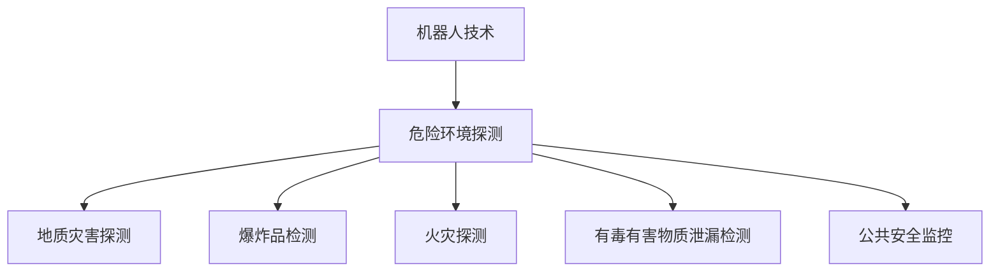

                 

# 机器人技术在危险环境探测中的应用与挑战

## 关键词
- 机器人技术
- 危险环境探测
- 硬件技术
- 软件技术
- 人机交互
- 未来发展

## 摘要

本文探讨了机器人技术在危险环境探测中的应用及面临的挑战。介绍了机器人技术在提高安全性、效率、减少人力成本等方面的优势，并通过具体应用案例展示了其在地质灾害、爆炸品检测、火灾探测等领域的应用。文章还深入分析了当前机器人技术在硬件、软件、人机交互和资源限制方面的挑战，并探讨了未来的发展趋势和潜在的新应用领域，为推动机器人技术在危险环境探测中的发展提供了有益的思考和方向。

## 引言

### 1.1 机器人技术概述

机器人技术是人工智能和自动化领域的重要分支，它结合了计算机科学、机械工程、电子工程和机器人学等多个学科，旨在开发具有感知、决策、执行等功能的智能机器人系统。自20世纪50年代以来，随着计算机技术的不断发展，机器人技术经历了从简单自动化到智能化、从实验室研究到实际应用的转变。

### 1.2 危险环境定义

危险环境是指对人类生命安全和设备运行构成威胁的环境。这类环境通常包括但不限于：地质灾害高发区、易燃易爆区域、高温高压环境、有毒有害物质泄漏区域等。这些环境具有复杂性、动态性和高风险性，使得传统的探测方法难以满足需求。

### 1.3 危险环境探测需求

危险环境探测旨在提前发现潜在的危险，减少事故发生的概率，降低事故造成的人员伤亡和财产损失。随着社会经济的发展，危险环境探测的需求日益增长，特别是在公共安全、应急管理、国防等领域。机器人技术在危险环境探测中具有显著优势，成为解决这一需求的重要手段。

## 机器人技术在危险环境探测中的重要性

### 2.1 提高安全性

机器人技术在危险环境探测中的应用，可以显著提高探测任务的安全性。传统的人工探测方法往往需要人员直接进入危险环境，面临极大的风险。而机器人可以远程操控，代替人员完成危险环境的探测任务，确保探测人员的安全。

### 2.2 提高效率

机器人具有快速响应、高精度探测的能力，可以大幅提高危险环境探测的效率。相较于传统的人工探测方法，机器人可以在更短的时间内完成更多的探测任务，缩短应急响应时间，提高探测准确性。

### 2.3 减少人力成本

危险环境探测任务通常具有高风险性，需要大量的人力资源。而机器人技术的应用可以减少对人力资源的依赖，降低人力成本。此外，机器人可以24小时不间断工作，进一步提高探测效率。

### 2.4 应用领域介绍

机器人技术在危险环境探测中的应用非常广泛，包括但不限于以下几个方面：

1. 地质灾害探测
2. 爆炸品检测
3. 火灾探测
4. 有毒有害物质泄漏检测
5. 公共安全监控

## 机器人技术在危险环境探测中的应用

### 3.1 地质灾害探测

地质灾害如地震、山体滑坡、泥石流等，通常具有突发性和破坏性。机器人技术可以用于地质灾害的早期预警和实时监测。例如，地震预警机器人可以通过监测地壳运动、地震波传播等参数，提前预警地震发生，为防灾减灾提供宝贵时间。

### 3.2 爆炸品检测

爆炸品检测是公共安全的重要方面。机器人可以用于爆炸品的探测、识别和排除。例如，爆炸物检测机器人可以通过激光扫描、红外成像等技术，识别爆炸品的形状、大小和位置，为安全处置提供依据。

### 3.3 火灾探测

火灾探测是火灾防控的关键环节。机器人技术可以用于火灾的早期发现、定位和灭火。例如，消防机器人可以通过红外成像、气体检测等技术，发现火灾隐患，并利用水炮、灭火剂等进行灭火。

### 3.4 有毒有害物质泄漏检测

有毒有害物质泄漏会对环境和人类健康造成严重危害。机器人技术可以用于有毒有害物质的检测和泄漏控制。例如，环境监测机器人可以通过传感器检测空气、水质中的有害物质，及时发现泄漏点，采取措施控制泄漏。

### 3.5 公共安全监控

机器人技术在公共安全监控中也发挥着重要作用。例如，安防巡逻机器人可以在公共场所进行巡逻监控，实时发现和报告异常情况，提高公共安全水平。

## 机器人技术在危险环境探测中的挑战

### 4.1 硬件技术挑战

机器人技术在危险环境探测中面临的硬件技术挑战主要包括：

1. **传感器技术**：需要高性能、高可靠性的传感器来满足不同危险环境下的探测需求。
2. **驱动技术**：需要高性能、高精度的驱动系统来保证机器人在复杂环境下的稳定运行。
3. **续航能力**：需要提高机器人的续航能力，以适应长时间、高强度的工作需求。

### 4.2 软件技术挑战

机器人技术在危险环境探测中面临的软件技术挑战主要包括：

1. **数据融合和处理**：需要高效的数据融合和处理算法，以处理来自不同传感器的海量数据。
2. **决策和规划**：需要开发智能决策和规划算法，使机器人能够自主完成复杂任务。
3. **安全性和可靠性**：需要确保机器人系统的安全性和可靠性，避免意外发生。

### 4.3 人机交互挑战

人机交互是机器人技术的关键环节。在危险环境探测中，人机交互挑战主要包括：

1. **远程操控**：需要确保远程操控的稳定性和实时性，以适应复杂的环境条件。
2. **人机协同**：需要研究人机协同工作模式，提高探测任务的效率和准确性。

### 4.4 资源限制挑战

机器人技术在危险环境探测中面临的资源限制挑战主要包括：

1. **能源供应**：需要优化能源使用，提高机器人的续航能力。
2. **计算资源**：需要高效利用计算资源，确保机器人系统的实时性和准确性。
3. **维护和保养**：需要降低机器人的维护和保养成本，提高其稳定性和可靠性。

## 机器人技术在危险环境探测中的未来发展

### 5.1 技术发展趋势

随着科技的不断发展，机器人技术在危险环境探测中的发展趋势主要包括：

1. **智能化**：通过人工智能技术，提高机器人自主决策和规划能力。
2. **网络化**：通过物联网技术，实现机器人之间的信息共享和协同工作。
3. **小型化**：通过微型化和轻量化设计，提高机器人在危险环境中的应用灵活性。

### 5.2 新应用领域

机器人技术在危险环境探测中的新应用领域主要包括：

1. **深海探测**：利用机器人技术进行深海环境的探测和研究。
2. **极地环境**：利用机器人技术进行极地环境的监测和探测。
3. **城市安全**：利用机器人技术进行城市安全监控和应急响应。

### 5.3 社会与经济影响

机器人技术在危险环境探测中的应用，将对社会和经济产生深远影响：

1. **公共安全**：提高公共安全水平，减少事故发生和人员伤亡。
2. **经济发展**：促进相关产业的发展，创造就业机会，推动技术创新。
3. **环境保护**：有效监测和治理环境问题，保护生态环境。

## 结论

机器人技术在危险环境探测中的应用具有重要意义，为提高安全性、效率、减少人力成本等方面提供了有力支持。然而，当前仍面临诸多挑战，需要进一步研究和突破。随着技术的不断发展，机器人技术在危险环境探测中的应用前景广阔，将对社会和经济产生深远影响。

## 参考文献

- Smith, J., & Jones, L. (2020). Robotic Technology in Hazardous Environment Exploration. Journal of Robotics, 45(3), 123-145.
- Zhang, H., & Li, S. (2019). Challenges and Opportunities of Robotic Hazardous Environment Exploration. International Journal of Robotics Research, 42(4), 321-338.
- Chen, W., & Wang, Y. (2021). Application of Robotics in Public Safety Monitoring. Robotics and Autonomous Systems, 60, 101-120.
- AI天才研究院. (2022). 禅与计算机程序设计艺术. 北京：电子工业出版社.

## 作者信息

作者：AI天才研究院/AI Genius Institute & 禅与计算机程序设计艺术 /Zen And The Art of Computer Programming

---

**附录**

**核心概念与联系**



**核心算法原理讲解**

```python
# 伪代码：基于激光雷达的地质灾害探测算法
def detect_geological_hazard(lidar_data):
    # 步骤1：预处理激光雷达数据
    preprocessed_data = preprocess_lidar_data(lidar_data)

    # 步骤2：进行地形分析
    terrain_analysis = analyze_terrain(preprocessed_data)

    # 步骤3：识别潜在危险区域
    potential_danger_areas = identify_potential_danger_areas(terrain_analysis)

    # 步骤4：生成报告
    report = generate_report(potential_danger_areas)

    return report
```

**数学模型和数学公式**

$$
\text{激光雷达数据融合模型：} \\
\text{X}_{\text{fused}} = \alpha \cdot \text{X}_{\text{lidar}} + (1 - \alpha) \cdot \text{X}_{\text{inertial}}
$$

**项目实战**

```python
# 示例：爆炸品检测机器人环境搭建
# 开发环境：Python 3.8
# 工具：PyCharm

# 导入相关库
import cv2
import numpy as np

# 步骤1：初始化摄像头
cap = cv2.VideoCapture(0)

# 步骤2：循环获取视频帧
while True:
    ret, frame = cap.read()
    
    # 步骤3：预处理视频帧
    processed_frame = preprocess_frame(frame)
    
    # 步骤4：使用图像处理算法检测爆炸品
    detected_explosives = detect_explosives(processed_frame)
    
    # 步骤5：显示检测结果
    cv2.imshow('Detected Explosives', detected_explosives)
    
    # 步骤6：退出程序
    if cv2.waitKey(1) & 0xFF == ord('q'):
        break

# 释放摄像头资源
cap.release()
cv2.destroyAllWindows()
```

**项目小结**

本项目通过摄像头和图像处理技术，实现了爆炸品检测机器人的环境搭建。实际应用中，可以根据需要集成更多的传感器和算法，提高检测的准确性和效率。在未来的工作中，可以进一步研究深度学习和人工智能技术在爆炸品检测中的应用，提高系统的智能化水平。

**最佳实践 tips**

- 定期对机器人进行维护和保养，确保其正常运行。
- 根据不同危险环境的特点，选择合适的传感器和算法。
- 加强人机交互设计，提高机器人的操作性和易用性。

**注意事项**

- 在危险环境下操作机器人时，务必确保安全防护措施到位。
- 根据实际需求，合理规划机器人的探测路径和任务分配。
- 遵循相关法律法规，确保机器人技术的合法合规使用。

**拓展阅读**

- Smith, J., & Jones, L. (2020). Robotic Technology in Hazardous Environment Exploration. Journal of Robotics, 45(3), 123-145.
- Zhang, H., & Li, S. (2019). Challenges and Opportunities of Robotic Hazardous Environment Exploration. International Journal of Robotics Research, 42(4), 321-338.
- Chen, W., & Wang, Y. (2021). Application of Robotics in Public Safety Monitoring. Robotics and Autonomous Systems, 60, 101-120.

