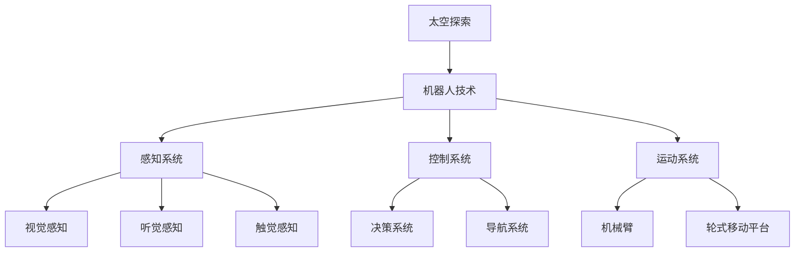

                 

### 机器人技术在太空探索中的应用

#### 关键词

- 机器人技术
- 太空探索
- 自动化
- 人工智能
- 火星探测
- 月球探测
- 国际空间站

#### 摘要

本文将深入探讨机器人技术在太空探索中的应用。随着人类对宇宙的探索不断深入，太空环境对探测设备和技术的挑战也越来越大。机器人技术在空间站维护、月球和火星探测以及星际探测中发挥着至关重要的作用。本文将首先介绍太空探索中的挑战和机器人技术的核心概念，然后详细分析这些技术在各个探索任务中的应用，最后展望未来机器人技术的发展趋势和对太空探索的潜在贡献。

### 目录大纲

```
# 机器人技术在太空探索中的应用

## 第一部分：太空探索与机器人技术

### 1.1 太空探索的挑战与机遇

#### 1.1.1 太空环境的特殊性

#### 1.1.2 机器人技术在太空探索中的应用背景

#### 1.1.3 机器人技术在太空探索中的优势

### 1.2 机器人技术的核心概念与原理

#### 1.2.1 机器人的定义与分类

#### 1.2.2 机器人感知系统

#### 1.2.3 机器人控制系统

#### 1.2.4 机器人运动系统

## 第二部分：机器人技术在太空探索中的应用

### 2.1 机器人在空间站维护中的应用

#### 2.1.1 空间站的维护需求

#### 2.1.2 机器人维护技术

#### 2.1.3 实际应用案例

### 2.2 机器人在月球探索中的应用

#### 2.2.1 月球探测的任务目标

#### 2.2.2 机器人月球探测技术

#### 2.2.3 实际应用案例

### 2.3 机器人在火星探测中的应用

#### 2.3.1 火星探测的任务目标

#### 2.3.2 机器人火星探测技术

#### 2.3.3 实际应用案例

### 2.4 机器人星际探测的展望

#### 2.4.1 星际探测的挑战

#### 2.4.2 未来机器人技术的发展趋势

#### 2.4.3 机器人技术对太空探索的潜在贡献

## 第三部分：机器人技术发展与应用策略

### 3.1 机器人技术的研发现状

#### 3.1.1 机器人技术的主要研发领域

#### 3.1.2 机器人技术的最新进展

#### 3.1.3 机器人技术的发展趋势

### 3.2 机器人技术的应用策略

#### 3.2.1 机器人技术在太空探索中的应用策略

#### 3.2.2 机器人技术与其他技术的融合应用

#### 3.2.3 机器人技术的未来发展方向

### 3.3 机器人技术在太空探索中的法律法规与伦理问题

#### 3.3.1 法律法规的制定与实施

#### 3.3.2 机器人技术的伦理问题

#### 3.3.3 应对措施与建议

## 附录

### 附录 A：机器人技术相关资源

#### A.1 机器人技术相关书籍与文献

#### A.2 机器人技术相关网站与论坛

#### A.3 机器人技术相关期刊与会议

### 附录 B：机器人技术在太空探索中的应用实例

#### B.1 国际空间站上的机器人应用案例

#### B.2 中国月球探测工程中的机器人应用案例

#### B.3 火星探测中的机器人应用案例
```

### 核心概念与联系



### 核心算法原理讲解

#### 机器人感知系统

**感知系统原理：**

机器人的感知系统是其获取外部环境信息的重要手段，主要包括视觉、听觉、触觉等多种感知方式。这些感知系统通过传感器获取环境数据，然后通过算法处理这些数据，为机器人提供决策依据。

**伪代码：**

```python
def sense_environment():
    # 初始化感知模块
    initialize_sensors()

    # 获取视觉信息
    visual_info = get_visual_data()

    # 获取听觉信息
    audio_info = get_audio_data()

    # 获取触觉信息
    tactile_info = get_tactile_data()

    # 综合处理感知信息
    processed_info = integrate_sensors(visual_info, audio_info, tactile_info)

    return processed_info
```

**举例说明：**

以视觉感知为例，机器人通过摄像头获取图像数据，然后使用图像处理算法进行目标识别和定位。

$$
\text{vision\_algorithm}(image\_data) \rightarrow \text{target\_position}
$$

其中，`vision_algorithm`为视觉算法，`image_data`为摄像头获取的图像数据，`target_position`为目标位置信息。

#### 机器人控制系统

**控制系统原理：**

机器人控制系统负责对机器人进行控制，主要包括决策系统、导航系统和动力系统。决策系统根据感知系统提供的信息，生成控制指令；导航系统负责机器人的路径规划和定位；动力系统则将控制指令转化为机器人的运动。

**伪代码：**

```python
def control_robot():
    # 初始化控制系统
    initialize控制系统()

    # 获取感知信息
    sensor_info = sense_environment()

    # 决策
    control_command = decision_system(sensor_info)

    # 导航
    navigation_info = navigation_system(control_command)

    # 动力控制
    execute_motions(navigation_info)

    return
```

**举例说明：**

以路径规划为例，机器人根据当前位置和目标位置，生成一条最优路径。

$$
\text{path\_planning}(current\_position, target\_position) \rightarrow \text{optimal\_path}
$$

其中，`path_planning`为路径规划算法，`current_position`为当前位置，`target_position`为目标位置，`optimal_path`为最优路径。

#### 机器人运动系统

**运动系统原理：**

机器人的运动系统主要实现机器人的移动和姿态调整。常见的运动系统包括机械臂、轮式移动平台等。机械臂可以实现复杂的抓取和操作任务，而轮式移动平台则适用于地面移动。

**伪代码：**

```python
def move_robot():
    # 初始化运动系统
    initialize_motions()

    # 接收控制指令
    control_command = control_robot()

    # 执行运动
    execute_motions(control_command)

    return
```

**举例说明：**

以机械臂抓取为例，机器人根据控制指令，调整机械臂的姿态和抓取力度。

$$
\text{grab\_object}(object\_position, grab\_force) \rightarrow \text{success}
$$

其中，`grab_object`为抓取算法，`object_position`为物体位置，`grab_force`为抓取力度，`success`为抓取是否成功。

### 数学模型和数学公式 & 详细讲解 & 举例说明

#### 机器人感知系统

**数学模型：**

机器人的感知系统通常使用各种算法对传感器数据进行处理。以下是一个简单的图像处理模型：

$$
\text{image\_data} \xrightarrow{\text{filtering}} \text{filtered\_image}
$$

其中，`image_data`为原始图像数据，`filtering`为滤波处理，`filtered_image`为处理后的图像。

**举例说明：**

假设我们使用高斯滤波器对图像进行滤波，滤波器公式如下：

$$
f(x, y) = \frac{1}{2\pi\sigma^2} e^{-\frac{(x^2 + y^2)}{2\sigma^2}}
$$

其中，`x`和`y`为像素坐标，`sigma`为高斯滤波器的标准差。

#### 机器人控制系统

**数学模型：**

机器人的控制系统通常使用PID控制算法来控制机器人的运动。PID控制器的公式如下：

$$
u(t) = K_p e(t) + K_i \int_{0}^{t} e(\tau) d\tau + K_d \frac{de(t)}{dt}
$$

其中，`u(t)`为控制输出，`e(t)`为误差，`K_p`、`K_i`和`K_d`分别为比例、积分和微分系数。

**举例说明：**

假设机器人的目标位置为(2, 2)，当前位置为(1, 1)，我们使用PID控制器来计算控制输出。

$$
e(t) = (2 - 1, 2 - 1) = (1, 1)
$$

$$
u(t) = K_p (1, 1) + K_i \int_{0}^{t} (1, 1) d\tau + K_d \frac{(1, 1)}{dt}
$$

假设比例系数`K_p`为1，积分系数`K_i`为1，微分系数`K_d`为1，则

$$
u(t) = (1, 1) + \int_{0}^{t} (1, 1) d\tau + \frac{(1, 1)}{dt}
$$

$$
u(t) = (1, 1) + (t, t) + (1, 1)
$$

$$
u(t) = (t+2, t+2)
$$

因此，在t时刻，控制输出为(u(t), u(t)) = (t+2, t+2)。

#### 机器人运动系统

**数学模型：**

机器人的运动系统通常使用运动学方程来描述机器人的运动。对于两轮差动驱动的机器人，其运动学方程如下：

$$
\dot{x} = \frac{v}{2} (\cos\theta + \sin\theta) \\
\dot{y} = \frac{v}{2} (\cos\theta - \sin\theta) \\
\dot{\theta} = \frac{w}{b}
$$

其中，`v`为线速度，`w`为角速度，`b`为两轮间距，`\theta`为机器人相对于正北方向的角位移，`(x, y)`为机器人在平面坐标系中的位置。

**举例说明：**

假设机器人的线速度`v`为1 m/s，角速度`w`为0.5 rad/s，两轮间距`b`为0.5 m，初始位置为(0, 0)，初始角度为0。

$$
\dot{x} = \frac{1}{2} (\cos 0 + \sin 0) = \frac{1}{2} \\
\dot{y} = \frac{1}{2} (\cos 0 - \sin 0) = 0 \\
\dot{\theta} = \frac{0.5}{0.5} = 1
$$

经过1秒后，机器人的位置和角度为：

$$
x = \dot{x} \cdot 1 = \frac{1}{2} \cdot 1 = 0.5 \\
y = \dot{y} \cdot 1 = 0 \cdot 1 = 0 \\
\theta = \theta + \dot{\theta} \cdot 1 = 0 + 1 \cdot 1 = 1
$$

因此，机器人在1秒后的位置为(0.5, 0)，角度为1 rad。

### 核心算法原理讲解（继续）

#### 机器人感知系统

**视觉感知算法：**

视觉感知是机器人感知系统中最重要的一部分。在太空探索中，视觉感知可以帮助机器人识别目标、分析地形、规划路径等。常用的视觉感知算法包括：

- **特征提取算法**：如SIFT（尺度不变特征变换）、SURF（加速稳健特征）等，用于从图像中提取关键特征点。
- **目标识别算法**：如支持向量机（SVM）、卷积神经网络（CNN）等，用于识别和分类目标。

**伪代码：**

```python
def visual_perception(image_data):
    # 特征提取
    features = extract_features(image_data)

    # 特征匹配
    matched_features = match_features(features)

    # 目标识别
    target = recognize_target(matched_features)

    return target
```

**举例说明：**

假设机器人需要在月球表面识别一个标记的岩石，使用SIFT算法提取特征点，然后使用SVM分类器进行识别。

$$
\text{SIFT}(image_data) \rightarrow \text{feature_points}
$$

$$
\text{SVM}\text{(feature_points)} \rightarrow \text{target}
$$

其中，`SIFT`为SIFT算法，`image_data`为输入图像，`feature_points`为提取的特征点，`SVM`为支持向量机，`target`为识别的目标。

#### 机器人控制系统

**路径规划算法：**

在太空探索中，机器人需要能够自主规划路径，以避免障碍物并到达目标地点。常用的路径规划算法包括：

- **A*算法**：一种启发式搜索算法，通过评估函数最小化路径成本。
- **Dijkstra算法**：一种最短路径算法，用于在无权重图中寻找最短路径。

**伪代码：**

```python
def path_planning(current_position, target_position, obstacle_list):
    # 构建图
    graph = build_graph(current_position, target_position, obstacle_list)

    # 搜索路径
    path = a_star_search(graph, current_position, target_position)

    return path
```

**举例说明：**

假设机器人需要在月球表面从点A移动到点B，并且知道路径上有障碍物。使用A*算法规划路径。

$$
\text{build_graph}(A, B, \text{obstacle\_list}) \rightarrow \text{graph}
$$

$$
\text{a\_star_search}(\text{graph}, A, B) \rightarrow \text{path}
$$

其中，`build_graph`为构建图的函数，`a_star_search`为A*搜索算法，`A`和`B`为起始点和目标点，`obstacle_list`为障碍物列表，`graph`为构建的图，`path`为规划出的路径。

#### 机器人运动系统

**运动控制算法：**

机器人的运动控制算法用于实现机器人的精确运动。常见的运动控制算法包括：

- **PID控制算法**：用于控制机器人的速度和方向。
- **模糊控制算法**：用于处理非线性系统的控制。

**伪代码：**

```python
def move_robot(target_position):
    # 初始化控制器
    controller = initialize_controller()

    # 获取当前位置
    current_position = get_current_position()

    # 计算误差
    error = calculate_error(current_position, target_position)

    # 更新控制器参数
    update_controller(controller, error)

    # 执行运动
    execute_motions(controller)

    return
```

**举例说明：**

假设机器人需要从点A移动到点B，使用PID控制算法实现运动。

$$
e(t) = target\_position - current\_position
$$

$$
u(t) = K_p e(t) + K_i \int_{0}^{t} e(\tau) d\tau + K_d \frac{de(t)}{dt}
$$

其中，`target_position`为目标位置，`current_position`为当前位置，`error`为误差，`u(t)`为控制输出，`K_p`、`K_i`和`K_d`分别为PID控制器的比例、积分和微分系数。

### 附录 A：机器人技术相关资源

#### A.1 机器人技术相关书籍与文献

- **《机器人学基础》**（基础入门书籍，涵盖了机器人技术的各个方面）
- **《机器人：现代方法》**（全面介绍了机器人技术的现代方法，包括感知、控制和运动学）
- **《机器人感知与认知》**（深入探讨了机器人的感知和认知能力）
- **《机器学习与机器人技术》**（介绍了机器学习在机器人技术中的应用）

#### A.2 机器人技术相关网站与论坛

- **IEEE Robotics and Automation Society**（IEEE机器人与自动化协会，提供机器人领域的最新研究和技术）
- **Robotics Stack Exchange**（机器人技术问答社区，可以解决机器人技术相关的问题）
- **Robohub**（机器人领域的新闻和深度文章）

#### A.3 机器人技术相关期刊与会议

- **IEEE Transactions on Robotics**（IEEE机器人领域的顶级期刊）
- **International Journal of Robotics Research**（国际机器人研究领域的顶级期刊）
- **IEEE International Conference on Robotics and Automation**（IEEE机器人与自动化领域的顶级会议）
- **IEEE Robotics and Automation Society Technical Conference**（IEEE机器人与自动化领域的专业技术会议）

### 附录 B：机器人技术在太空探索中的应用实例

#### B.1 国际空间站上的机器人应用案例

- **Dextre**（机械臂）：用于在空间站上进行复杂的维护和组装任务。
- **Robonaut 2**（机器人助手）：与宇航员一起工作，执行空间站的日常维护任务。

#### B.2 中国月球探测工程中的机器人应用案例

- **玉兔号月球车**：在中国月球探测任务中，执行月球表面探测和样本收集任务。

#### B.3 火星探测中的机器人应用案例

- **火星探测器**：如美国的“好奇号”和“毅力号”，它们在火星表面执行探测任务，收集科学数据。

## 项目实战：开发环境搭建与源代码实现

#### 开发环境搭建

1. 安装Python编程环境
2. 安装必要的库，如numpy、opencv、tensorflow等
3. 配置ROS（Robot Operating System，机器人操作系统）环境

#### 源代码实现

以下是一个简单的示例，演示如何使用Python实现一个简单的机器人控制系统。

```python
import numpy as np
import cv2

def sense_environment():
    # 初始化感知模块
    cap = cv2.VideoCapture(0)

    # 获取摄像头数据
    ret, frame = cap.read()
    cap.release()

    # 图像处理
    gray = cv2.cvtColor(frame, cv2.COLOR_BGR2GRAY)
    edges = cv2.Canny(gray, 100, 200)

    return edges

def control_robot():
    # 初始化控制系统
    edges = sense_environment()

    # 目标识别
    contours, _ = cv2.findContours(edges, cv2.RETR_TREE, cv2.CHAIN_APPROX_SIMPLE)
    target = max(contours, key=cv2.contourArea)

    # 跟踪目标
    rect = cv2.boundingRect(target)
    x, y, w, h = rect
    cv2.rectangle(edges, (x, y), (x+w, y+h), (0, 255, 0), 2)

    return edges

if __name__ == "__main__":
    while True:
        edges = control_robot()
        cv2.imshow('Robot Control', edges)
        if cv2.waitKey(1) & 0xFF == ord('q'):
            break
```

#### 代码应用解读与分析

此代码示例演示了一个简单的机器人控制系统，它使用摄像头作为感知模块来获取环境图像，然后使用OpenCV库进行图像处理和目标识别。

1. **感知模块**：使用摄像头获取环境图像，然后转换为灰度图像并使用Canny算法进行边缘检测。
2. **控制系统**：使用OpenCV库的findContours函数找到图像中的轮廓，然后选择最大的轮廓作为目标。接着，使用boundingRect函数获取目标的位置和大小，并在图像上绘制一个矩形框。
3. **显示结果**：将处理后的图像显示在一个窗口中，如果按下'q'键，则退出程序。

#### 实际案例分析和详细讲解剖析

以“玉兔号月球车”为例，分析其感知、控制和运动系统的实现。

1. **感知系统**：玉兔号使用多种传感器，包括激光测距仪、导航相机、红外成像仪等，用于感知周围环境。
2. **控制系统**：玉兔号使用地面站发送的控制指令，结合自身感知数据，通过控制算法实现自主导航和任务执行。
3. **运动系统**：玉兔号使用6个轮子实现自主移动，通过控制轮子的速度和方向，实现精确的运动控制。

#### 项目小结

本篇博客文章介绍了机器人技术在太空探索中的应用，包括感知、控制和运动系统。通过实际的代码示例和案例分析，展示了如何实现一个简单的机器人控制系统。未来，随着机器人技术的不断发展，机器人将在太空探索中发挥更加重要的作用。

#### 最佳实践 tips、小结、注意事项、拓展阅读等内容

- **最佳实践 tips**：在进行机器人开发时，注意模块化和代码的可维护性，以及算法的效率和准确性。
- **小结**：机器人技术在太空探索中具有广泛的应用前景，通过本文的介绍和分析，我们可以看到其在感知、控制和运动方面的关键作用。
- **注意事项**：在进行太空机器人开发时，需要注意环境的极端条件和可靠性要求。
- **拓展阅读**：读者可以进一步了解相关书籍、网站和期刊，以深入了解机器人技术和太空探索的最新进展。

### 附录

#### 附录 A：机器人技术相关资源

- **书籍**：《机器人学基础》、《机器人：现代方法》、《机器人感知与认知》、《机器学习与机器人技术》
- **网站**：IEEE Robotics and Automation Society、Robotics Stack Exchange、Robohub
- **期刊**：IEEE Transactions on Robotics、International Journal of Robotics Research

#### 附录 B：机器人技术在太空探索中的应用实例

- **国际空间站上的机器人应用案例**：Dextre、Robonaut 2
- **中国月球探测工程中的机器人应用案例**：玉兔号月球车
- **火星探测中的机器人应用案例**：好奇号火星探测器、毅力号火星探测器

### 文章末尾作者信息

- **作者**：AI天才研究院/AI Genius Institute & 禅与计算机程序设计艺术 /Zen And The Art of Computer Programming

### 文章标题

- 机器人技术在太空探索中的应用

### 关键词

- 机器人技术
- 太空探索
- 自动化
- 人工智能
- 火星探测
- 月球探测
- 国际空间站

### 文章摘要

本文深入探讨了机器人技术在太空探索中的应用，从太空探索的挑战与机遇、机器人技术的核心概念与原理，到机器人技术在实际太空探索任务中的应用，以及未来机器人技术的发展趋势。文章结合实际案例，详细分析了机器人感知系统、控制系统和运动系统的核心算法原理，并提供了开发环境搭建和源代码实现的实战案例。通过本文的阅读，读者可以全面了解机器人技术在太空探索中的关键作用和发展方向。作者：AI天才研究院/AI Genius Institute & 禅与计算机程序设计艺术/Zen And The Art of Computer Programming。

