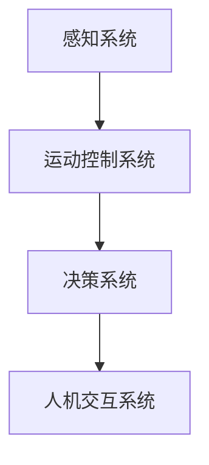
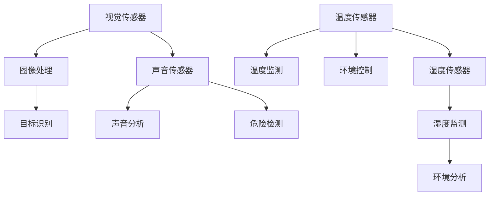
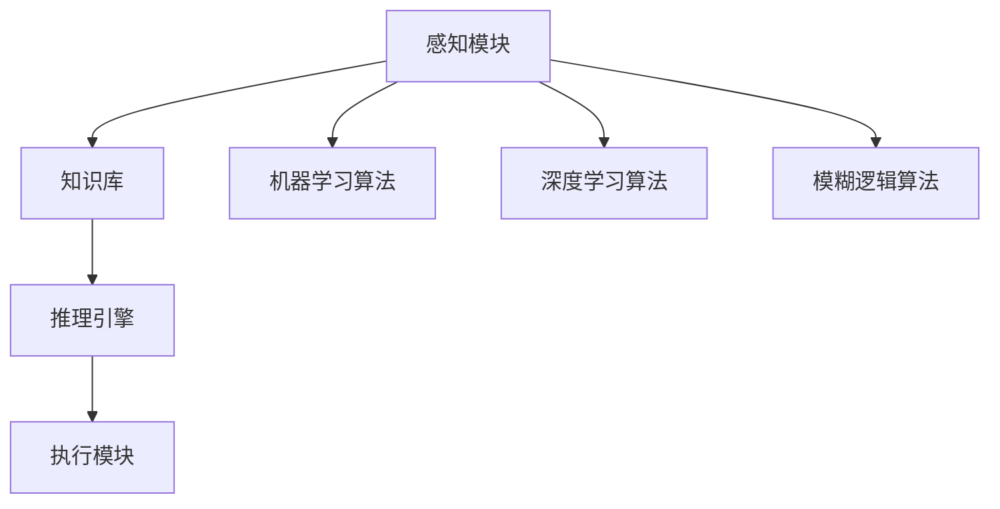
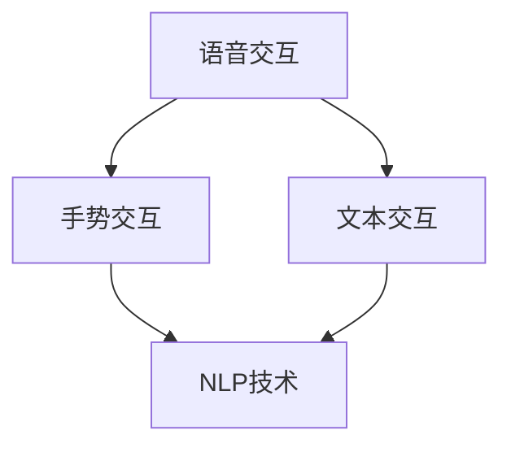
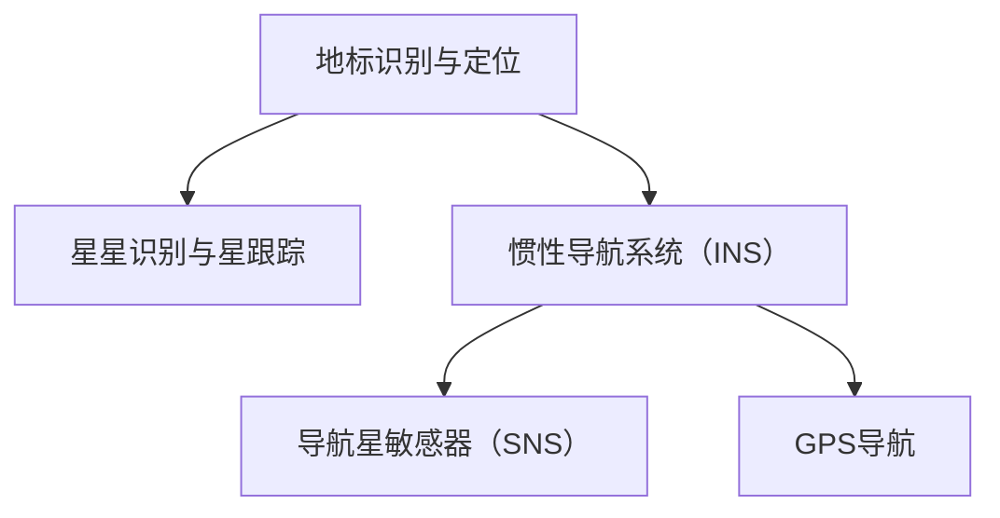
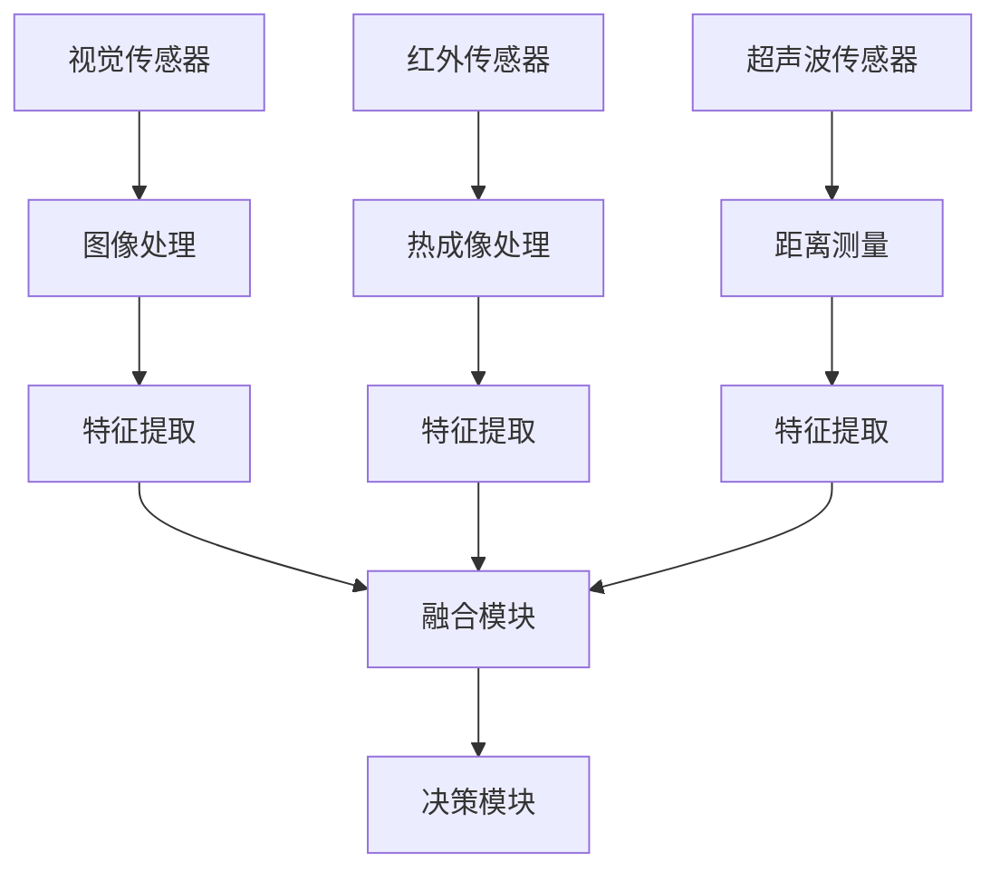
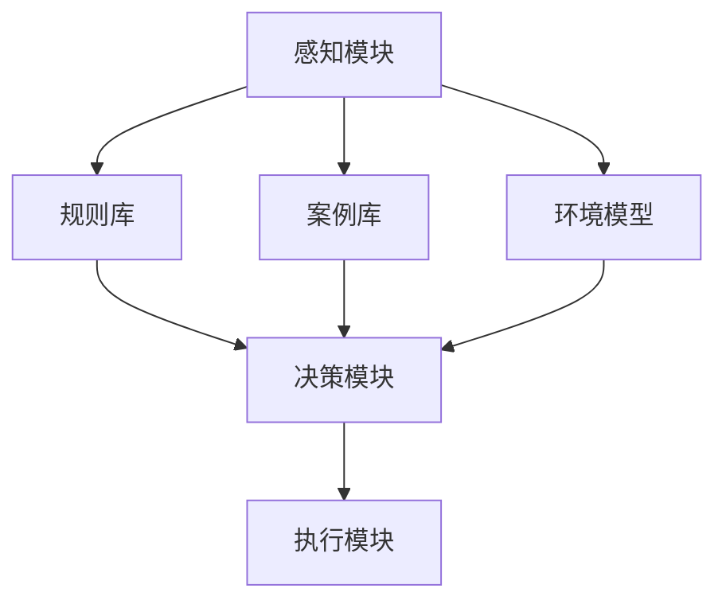
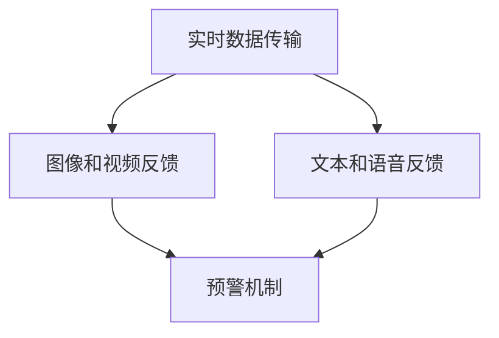
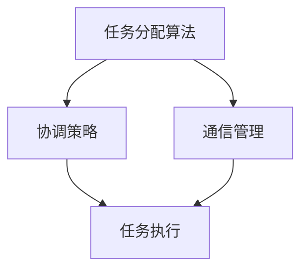
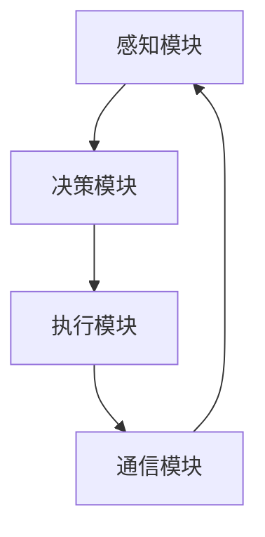

                 

# 《机器人技术在太空探索中的自主应用》目录大纲

# 引言
- 太空探索背景与机器人技术的重要性

## 1. 机器人技术基础
### 1.1 机器人系统概述
- 机器人系统基本组成
- 机器人技术发展趋势
### 1.2 机器人感知系统
- 感知系统在太空探索中的应用
- 传感器类型及其性能指标
### 1.3 机器人运动控制系统
- 运动控制系统原理
- 运动控制算法
### 1.4 机器人自主决策系统
- 自主决策系统结构
- 智能算法基础
### 1.5 机器人人机交互系统
- 人机交互界面设计
- 自然语言处理技术

## 2. 太空机器人自主导航与定位
### 2.1 导航与定位概述
- 导航与定位的重要性
- 导航与定位方法
### 2.2 地标识别与地标定位
- 地标识别算法
- 地标定位算法
### 2.3 星星识别与星跟踪
- 星星识别算法
- 星跟踪算法
### 2.4 惯性导航系统（INS）与导航星敏感器（SNS）
- INS工作原理
- SNS工作原理
- INS与SNS融合算法

## 3. 太空机器人感知与识别
### 3.1 感知与识别概述
- 感知与识别在太空探索中的应用
- 感知与识别技术挑战
### 3.2 图像处理与目标检测
- 图像处理算法
- 目标检测算法
### 3.3 深度学习在感知与识别中的应用
- 深度学习基础
- 深度学习算法在感知与识别中的应用
### 3.4 传感器融合与多模态感知
- 传感器融合算法
- 多模态感知系统设计

## 4. 太空机器人运动控制与自主操控
### 4.1 运动控制概述
- 运动控制原理
- 运动控制算法
### 4.2 自主导控策略
- 自主导控策略概述
- 自主导控算法
### 4.3 任务规划与执行
- 任务规划方法
- 任务执行策略
### 4.4 机器人人机交互与任务反馈
- 人机交互设计
- 任务反馈机制

## 5. 太空机器人协同工作与网络通信
### 5.1 协同工作概述
- 协同工作原理
- 协同工作算法
### 5.2 网络通信系统
- 网络通信原理
- 网络通信协议
### 5.3 协同机器人系统设计
- 协同机器人系统架构
- 协同机器人系统实现

## 6. 太空机器人自主应用项目实例
### 6.1 国际空间站机器人应用案例
- 空间站机器人功能
- 空间站机器人自主应用
### 6.2 太空探索任务机器人应用案例
- 探索任务机器人设计
- 探索任务机器人应用
### 6.3 未来太空机器人应用展望
- 未来太空机器人技术发展趋势
- 太空机器人应用前景

## 7. 结论
- 太空探索与机器人技术的未来发展
- 本书内容总结与展望

### 1.1 机器人系统概述

机器人系统是由多个组件组成的复杂系统，这些组件协同工作以实现特定的任务。在太空探索中，机器人系统的基本组成主要包括以下几个部分：

1. **感知系统**：负责感知环境信息，包括视觉、听觉、触觉等。在太空探索中，感知系统主要用于获取太空环境中的图像、声音和触觉信息，以便机器人能够自主识别目标、导航和执行任务。

2. **运动控制系统**：负责控制机器人的运动，包括移动、旋转和抓取等。运动控制系统通常包括电机驱动、关节控制、轮式移动等模块，以实现机器人灵活的移动和操作。

3. **决策系统**：负责处理感知系统获取的信息，并做出决策。决策系统通常包括自主导航、目标识别、任务规划等模块，以实现机器人在未知或动态环境中的自主操作。

4. **人机交互系统**：负责人与机器人之间的交互，包括语音、手势和文本等。人机交互系统使得操作人员能够远程控制机器人，并通过语音和文本与机器人进行交流。

以下是机器人系统的基本组成 Mermaid 流程图：



随着机器人技术的不断发展，其在太空探索中的应用越来越广泛。例如，机器人被用于空间站维修、探测任务、天体采样等。未来，随着技术的进一步成熟，机器人将有望在更多的太空任务中发挥关键作用。

### 1.2 机器人感知系统

在太空探索中，机器人感知系统是获取外部信息的关键。感知系统的主要任务是通过传感器收集环境信息，包括图像、声音、温度、湿度等。以下是机器人感知系统在太空探索中的应用：

1. **图像感知**：在太空探索中，视觉传感器主要用于获取太空环境中的图像信息。这些图像信息可以帮助机器人识别目标、进行导航和执行任务。例如，在国际空间站上，机器人的视觉传感器被用来进行空间站的维护和修理。

2. **声音感知**：声音传感器可以捕捉太空环境中的声音信息。这些信息对于识别危险情况、分析太空环境具有重要意义。例如，机器人可以通过分析太空环境中的声音信息来检测微陨石或其他潜在的威胁。

3. **温度感知**：温度传感器用于测量太空环境中的温度。这对于确保机器人和宇航员的安全至关重要。例如，机器人可以通过测量温度来监测空间站内部的温度变化，以确保宇航员的生活环境适宜。

4. **湿度感知**：湿度传感器用于测量太空环境中的湿度。这对于理解太空环境的特点、规划任务具有重要意义。例如，机器人可以通过测量湿度来监测空间站的湿度变化，以确保实验设备的正常工作。

传感器类型及其性能指标包括：

1. **视觉传感器**：视觉传感器的性能指标包括分辨率、帧率、视角范围等。高分辨率的视觉传感器可以提供更清晰的图像信息，而高帧率的视觉传感器可以捕捉更快速的运动。

2. **声音传感器**：声音传感器的性能指标包括灵敏度和频率响应范围。高灵敏度的声音传感器可以检测到更微弱的声音，而宽频率响应范围的声音传感器可以捕捉到不同频率的声音。

3. **温度传感器**：温度传感器的性能指标包括测量范围、精度和响应时间。宽测量范围的温度传感器可以适应不同的温度环境，高精度的温度传感器可以提供更准确的测量结果，而快速的响应时间可以实时监测温度变化。

以下是机器人感知系统的 Mermaid 流程图：



通过这些传感器，机器人可以获取外部环境信息，从而实现自主导航、目标识别和任务执行。随着传感器技术的不断进步，机器人感知系统将在太空探索中发挥越来越重要的作用。

### 1.3 机器人运动控制系统

在太空探索中，机器人的运动控制是确保其能够执行任务的关键。运动控制系统主要负责控制机器人的移动、旋转和抓取等动作。以下是机器人运动控制系统的工作原理：

1. **电机驱动**：电机驱动是运动控制系统的核心，通过控制电机的转速和方向来实现机器人的运动。常见的电机驱动方式包括直流电机驱动、步进电机驱动和伺服电机驱动等。

2. **关节控制**：对于具有多个关节的机器人，关节控制是实现其灵活运动的关键。关节控制通过控制各个关节的角度和速度来实现机器人的各种动作。

3. **轮式移动**：轮式移动是机器人地面移动的一种常用方式。轮式移动通过控制轮子的转速和方向来实现机器人的前进、后退和转向等动作。

运动控制算法是实现机器人运动控制的核心。以下是几种常见的运动控制算法：

1. **PID控制算法**：PID控制算法是一种常见的运动控制算法，通过比例、积分和微分三个部分来调节系统的输出，以达到预期的运动效果。

2. **模糊控制算法**：模糊控制算法通过模糊逻辑来模拟人类的决策过程，实现对机器人运动的控制。模糊控制算法具有较强的适应性和鲁棒性。

3. **神经网络控制算法**：神经网络控制算法通过训练神经网络来学习系统的控制策略，从而实现对机器人运动的控制。神经网络控制算法具有较强的自学习和自适应能力。

以下是运动控制算法的 Python 伪代码示例：

```python
import numpy as np

# PID控制算法伪代码
def pid_control(setpoint, current_position, kp, ki, kd):
    error = setpoint - current_position
    integral = np.sum(error) * dt
    derivative = (error - last_error) / dt
    output = kp * error + ki * integral + kd * derivative
    last_error = error
    return output

# 模糊控制算法伪代码
def fuzzy_control(input_value):
    if input_value < low_threshold:
        output = low_output
    elif input_value < middle_threshold:
        output = middle_output
    else:
        output = high_output
    return output

# 神经网络控制算法伪代码
def neural_network_control(input_vector):
    output = neural_network.predict(input_vector)
    return output
```

通过这些运动控制算法，机器人可以在复杂的太空环境中实现精确的运动控制。随着控制算法的不断优化，机器人运动控制系统的性能将得到进一步提升，从而为太空探索提供更强大的支持。

### 1.4 机器人自主决策系统

在太空探索中，机器人自主决策系统是确保其能够自主执行任务的核心。自主决策系统通过处理感知系统获取的信息，并根据预设的规则和策略，做出相应的决策。以下是机器人自主决策系统的工作原理：

1. **感知模块**：感知模块负责收集外部环境信息，如视觉、听觉、触觉等。这些信息为决策系统提供了重要的输入。

2. **知识库**：知识库是决策系统的核心，存储了大量的规则和策略。这些规则和策略是机器人根据经验和学习得到的，用于指导决策过程。

3. **推理引擎**：推理引擎负责根据感知模块提供的信息和知识库中的规则，进行逻辑推理和决策。常见的推理方法包括基于规则的推理、基于案例的推理和基于模型的推理等。

4. **执行模块**：执行模块负责将决策结果转化为具体的行动，如控制机器人的运动、执行任务等。

智能算法是自主决策系统的关键技术。以下是几种常见的智能算法：

1. **机器学习算法**：机器学习算法通过从数据中学习模式，用于决策过程。常见的机器学习算法包括监督学习、无监督学习和强化学习等。

2. **深度学习算法**：深度学习算法是机器学习的一种，通过多层神经网络来提取特征和模式。常见的深度学习算法包括卷积神经网络（CNN）、循环神经网络（RNN）和生成对抗网络（GAN）等。

3. **模糊逻辑算法**：模糊逻辑算法通过模糊集和模糊规则来处理不确定性和模糊性。模糊逻辑算法在决策系统中具有较好的鲁棒性和适应性。

以下是自主决策系统的 Mermaid 流程图：



通过这些智能算法，机器人可以自主地处理复杂环境中的任务，实现高效、精准的决策。随着智能算法的不断进步，机器人自主决策系统的性能将得到进一步提升，为太空探索提供更强大的支持。

### 1.5 机器人人机交互系统

在太空探索中，机器人人机交互系统是确保操作人员能够有效控制机器人和获取任务反馈的关键。人机交互系统主要包括以下组成部分：

1. **语音交互**：语音交互是机器人人机交互的主要方式之一，通过语音识别和语音合成技术，实现人与机器人之间的语音交流。语音交互的优势在于其自然、便捷，可以减少宇航员在操作机器人时的体力劳动。

2. **手势交互**：手势交互通过摄像头和图像处理技术，捕捉操作人员的手势，并将其转换为机器人的行动指令。手势交互具有直观、快速的特点，可以增强宇航员与机器人之间的互动体验。

3. **文本交互**：文本交互通过文本输入和文本输出，实现人与机器人之间的信息交流。文本交互在复杂任务或需要精确指令的情况下具有优势，可以确保操作指令的准确传达。

自然语言处理（NLP）技术是人机交互系统的重要组成部分。NLP技术通过解析和生成自然语言，实现人与机器人之间的有效沟通。以下是NLP技术在机器人人机交互中的应用：

1. **语音识别**：语音识别技术将语音信号转换为文本，使机器人能够理解操作人员的语音指令。常见的语音识别算法包括隐马尔可夫模型（HMM）、深度神经网络（DNN）和卷积神经网络（CNN）等。

2. **语音合成**：语音合成技术将文本转换为自然流畅的语音，使机器人能够向操作人员反馈信息。常见的语音合成算法包括合成语音编码器（AVEC）、循环神经网络（RNN）和 WaveNet等。

3. **文本分析**：文本分析技术用于理解文本中的语义和情感，从而更好地满足操作人员的需求。常见的文本分析算法包括词性标注（POS）、命名实体识别（NER）和情感分析（SA）等。

以下是机器人人机交互系统的 Mermaid 流程图：



通过NLP技术，机器人人机交互系统能够更好地理解操作人员的指令和反馈，提高交互的效率和准确性。随着NLP技术的不断进步，人机交互系统将为太空探索带来更多的便利和可能性。

## 2. 太空机器人自主导航与定位

在太空探索中，自主导航与定位是机器人能够有效执行任务的基础。导航与定位技术旨在确保机器人能够准确地确定自身位置，并规划出最优的路径以完成任务。以下是导航与定位在太空探索中的重要性以及常用的导航与定位方法。

### 2.1 导航与定位的重要性

导航与定位在太空探索中具有重要意义：

1. **任务规划**：精确的导航与定位能够帮助机器人制定详细的任务计划，包括路径规划、目标识别和资源分配等。

2. **安全性**：导航与定位技术能够确保机器人在复杂、动态的太空环境中避免碰撞，保障任务的安全。

3. **环境适应**：通过实时感知和定位，机器人可以更好地适应不断变化的环境，提高任务执行的成功率。

4. **资源利用**：精确的导航与定位有助于机器人高效利用有限的资源，如能源、计算能力和通信带宽。

### 2.2 导航与定位方法

在太空探索中，常用的导航与定位方法包括以下几种：

1. **地标识别与定位**：通过识别和标记特定的地标，如行星表面特征、恒星和星系等，来定位自身位置。地标识别与定位方法通常包括图像识别、光谱分析和雷达测距等。

2. **星星识别与星跟踪**：利用天体的运动轨迹和位置信息，通过识别星星并跟踪其运动，来确定自身位置。星星识别与星跟踪方法需要高精度的天体数据库和高效的算法支持。

3. **惯性导航系统（INS）**：利用加速度计、陀螺仪等惯性传感器，测量机器人的加速度和角速度，通过积分运算得到机器人的位置和速度。惯性导航系统具有实时性强、不受外部环境影响的特点。

4. **导航星敏感器（SNS）**：通过测量天体的方位角和高度角，来确定机器人的位置和姿态。导航星敏感器通常使用光学传感器和红外传感器。

5. **GPS导航**：在地球轨道附近，可以使用GPS卫星信号进行导航。GPS导航具有定位精度高、实时性好的优点。

以下是导航与定位方法的 Mermaid 流程图：



通过这些导航与定位方法，机器人能够在复杂、动态的太空环境中实现精确的位置和路径规划。随着技术的不断进步，导航与定位技术将在太空探索中发挥越来越重要的作用。

### 2.3 地标识别与地标定位

地标识别与地标定位是机器人自主导航与定位技术的重要组成部分。通过识别和标记特定地标，如行星表面的岩石、陨石坑或宇宙中的恒星和星系，机器人可以准确确定自身位置。以下是地标识别与地标定位的方法和算法。

#### 地标识别算法

地标识别算法主要通过以下步骤实现：

1. **特征提取**：从图像或传感器数据中提取具有代表性的特征，如颜色、形状、纹理等。常用的特征提取方法包括SIFT、SURF和HOG等。

2. **特征匹配**：将提取的特征与已知的地标特征库进行匹配，以确定是否存在相似的地标。特征匹配算法通常使用最近邻搜索、K-近邻（KNN）或基于度量空间的算法。

3. **决策与确认**：通过计算特征匹配的得分，对地标进行决策和确认。常用的决策方法包括阈值法、投票法和动态规划等。

以下是地标识别算法的 Python 伪代码示例：

```python
import cv2
import numpy as np

# 特征提取
def extract_features(image):
    gray = cv2.cvtColor(image, cv2.COLOR_BGR2GRAY)
    sift = cv2.SIFT_create()
    keypoints, descriptors = sift.detectAndCompute(gray, None)
    return keypoints, descriptors

# 特征匹配
def match_features(descriptors1, descriptors2):
    matcher = cv2.BFMatcher()
    matches = matcher.knnMatch(descriptors1, descriptors2, k=2)
    good_matches = []
    for m, n in matches:
        if m.distance < 0.75 * n.distance:
            good_matches.append(m)
    return good_matches

# 决策与确认
def identify_landmark(image1, image2, landmark_descriptors):
    keypoints1, descriptors1 = extract_features(image1)
    keypoints2, descriptors2 = extract_features(image2)
    good_matches = match_features(descriptors1, landmark_descriptors)
    if len(good_matches) > min_matches:
        return "Landmark identified"
    else:
        return "Landmark not identified"
```

#### 地标定位算法

地标定位算法通常基于地标识别结果，计算机器人相对于地标的位置。以下是地标定位算法的基本步骤：

1. **三角测量**：利用至少两个已知的地标和机器人当前的位置，通过三角测量方法计算机器人相对于地标的位置。三角测量算法包括二维和三维三角测量。

2. **优化与调整**：对定位结果进行优化，以消除测量误差。常用的优化方法包括最小二乘法（LS）和迭代最近点（IRLS）算法。

以下是地标定位算法的 Python 伪代码示例：

```python
import numpy as np

# 三角测量
def triangulation(points1, points2, camera_matrix, distortion_coeffs):
    points1 = np.array(points1).reshape(-1, 1, 2)
    points2 = np.array(points2).reshape(-1, 1, 2)
    points3D = cv2.triangulatePoints(camera_matrix, distortion_coeffs, points1, points2)
    return points3D

# 优化与调整
def optimize_position(points3D, landmarks):
    points3D = np.array(points3D).reshape(-1, 3)
    distances = np.linalg.norm(points3D - landmarks, axis=1)
    minimized_distances = np.argmin(distances)
    return points3D[minimized_distances]
```

通过地标识别与定位算法，机器人能够在复杂、动态的环境中实现精确的位置和路径规划。这些算法在太空探索任务中具有广泛的应用前景。

### 2.4 星星识别与星跟踪

在太空探索中，星星识别与星跟踪是机器人导航与定位的关键技术。通过识别和跟踪星星，机器人可以准确确定自身位置和姿态。以下是星星识别与星跟踪的方法和算法。

#### 星星识别算法

星星识别算法主要基于光学传感器捕获的图像或视频数据。以下是星星识别的基本步骤：

1. **图像预处理**：对捕获的图像进行预处理，以提高星星识别的准确性。预处理步骤包括去噪、滤波、对比度增强等。

2. **星星候选检测**：从预处理后的图像中检测可能的星星候选。常用的方法包括使用星图模板匹配、形态学操作和基于颜色特征的检测等。

3. **星星确认**：通过分析星星候选的形状、亮度、颜色等特征，确认真实星星。常用的确认方法包括阈值法、模式识别和机器学习算法等。

以下是星星识别算法的 Python 伪代码示例：

```python
import cv2
import numpy as np

# 图像预处理
def preprocess_image(image):
    gray = cv2.cvtColor(image, cv2.COLOR_BGR2GRAY)
    blurred = cv2.GaussianBlur(gray, (5, 5), 0)
    threshold = cv2.threshold(blurred, 0, 255, cv2.THRESH_BINARY_INV + cv2.THRESH_OTSU)[1]
    return threshold

# 星星候选检测
def detect_star_candidates(image):
    star_candidates = []
    circles = cv2.HoughCircles(image, cv2.HOUGH_GRADIENT, dp=1.2, minDist=100,
                               param1=50, param2=30, minRadius=10, maxRadius=0)
    if circles is not None:
        for circle in circles[0, :]:
            x, y, r = circle
            star_candidates.append((x, y, r))
    return star_candidates

# 星星确认
def confirm_stars(image, star_candidates):
    confirmed_stars = []
    for x, y, r in star_candidates:
        mask = cv2.circle(image, (x, y), r, (0, 0, 255), 2)
        star_region = image[y-r:y+r, x-r:x+r]
        avg_color = cv2.mean(star_region)[0]
        if avg_color[0] > 200 and avg_color[1] < 50 and avg_color[2] < 50:
            confirmed_stars.append((x, y, r))
    return confirmed_stars
```

#### 星跟踪算法

星跟踪算法旨在连续识别和跟踪已识别的星星，以实现稳定的导航与定位。以下是星跟踪的基本步骤：

1. **初始识别**：在初始帧中，使用星星识别算法确定星星位置。

2. **跟踪初始化**：将初始识别的星星位置作为跟踪的初始状态。

3. **连续跟踪**：在后续帧中，通过检测和匹配当前帧中的星星与已识别的星星，更新跟踪状态。常用的方法包括卡尔曼滤波、粒子滤波和光流法等。

以下是星跟踪算法的 Python 伪代码示例：

```python
import cv2
import numpy as np

# 初始识别
def initial_detection(image, confirmed_stars):
    return confirmed_stars

# 跟踪初始化
def initialize_tracking(confirmed_stars):
    tracking_stars = []
    for x, y, r in confirmed_stars:
        tracking_stars.append([x, y, r])
    return tracking_stars

# 连续跟踪
def track_stars(image, tracking_stars):
    new_stars = detect_stars(image)
    tracked_stars = []
    for star in tracking_stars:
        x, y, r = star
        min_distance = np.inf
        for new_star in new_stars:
            new_x, new_y, new_r = new_star
            distance = np.sqrt((x - new_x) ** 2 + (y - new_y) ** 2)
            if distance < min_distance:
                min_distance = distance
                best_match = new_star
        tracked_stars.append(best_match)
    return tracked_stars

# 主函数
def star_tracking(image_sequence):
    image = image_sequence[0]
    confirmed_stars = initial_detection(image, [])
    tracking_stars = initialize_tracking(confirmed_stars)
    for i in range(1, len(image_sequence)):
        image = image_sequence[i]
        new_stars = detect_stars(image)
        tracking_stars = track_stars(image, tracking_stars)
        # 更新跟踪状态
        # ...
    return tracking_stars
```

通过星星识别与星跟踪算法，机器人可以在动态、复杂的太空环境中实现稳定、准确的导航与定位。这些算法为太空探索任务提供了强大的技术支持。

### 2.5 惯性导航系统（INS）与导航星敏感器（SNS）

在太空探索中，惯性导航系统（Inertial Navigation System，INS）与导航星敏感器（Spectral Navigation Sensor，SNS）是两种关键导航与定位技术。它们各自独立工作，但当结合使用时，可以显著提高导航精度。以下是INS与SNS的工作原理以及它们之间的融合算法。

#### 惯性导航系统（INS）

惯性导航系统利用加速度计和陀螺仪来测量物体的加速度和角速度。通过这些测量值，INS可以计算出物体的速度和位置。以下是INS的工作原理：

1. **加速度测量**：加速度计测量物体在各个方向上的加速度。这些加速度值可以通过积分得到速度，再通过两次积分得到位置。

2. **角速度测量**：陀螺仪测量物体的角速度。角速度可以通过积分得到姿态，进而用于确定物体的方向。

3. **数据处理**：INS通过计算加速度和角速度的积分，更新物体的速度和位置。然而，由于传感器存在噪声和误差，INS的定位精度会随时间累积误差。

以下是INS的基本算法伪代码：

```python
def ins_integration(accelerometer_data, gyro_data, initial_state, time_step):
    # 初始化状态向量
    state = initial_state
    # 时间步积分
    for t in range(time_step):
        # 更新位置和速度
        state['position'] += state['velocity'] * time_step
        state['velocity'] += accelerometer_data * time_step
        # 更新姿态
        state['orientation'] = integrate_angle(state['orientation'], gyro_data * time_step)
    return state
```

#### 导航星敏感器（SNS）

导航星敏感器通过测量天体的方位角和高度角来确定物体的位置和姿态。SNS通常使用光学传感器和红外传感器。以下是SNS的工作原理：

1. **天体测量**：SNS测量天体的方位角和高度角。这些测量值提供了关于物体相对于天体的方向信息。

2. **姿态计算**：通过测量天体的方位角和高度角，SNS可以计算出物体的姿态，进而用于定位。

3. **数据处理**：SNS的测量数据经过滤波和校准，以提高定位精度。

以下是SNS的基本算法伪代码：

```python
def sns测量(t):
    # 测量天体方位角和高度角
    azimuth, elevation = sns_measurements()
    # 数据处理
    filtered_azimuth, filtered_elevation = filter_and校准(azimuth, elevation)
    return filtered_azimuth, filtered_elevation
```

#### INS与SNS融合算法

INS与SNS融合算法通过结合INS的高频测量精度和SNS的长距离测量能力，实现更精确的导航与定位。以下是常用的融合算法：

1. **卡尔曼滤波**：卡尔曼滤波是一种线性融合算法，通过预测和更新状态估计，减少测量误差。以下是卡尔曼滤波的基本算法伪代码：

```python
def kalman_filter(state, measurement, state_estimate, measurement_estimate):
    # 预测
    predicted_state = predict_state(state, measurement)
    # 更新
    updated_state = update_state(predicted_state, measurement, state_estimate, measurement_estimate)
    return updated_state
```

2. **扩展卡尔曼滤波**：扩展卡尔曼滤波（Extended Kalman Filter，EKF）用于非线性系统的状态估计。以下是EKF的基本算法伪代码：

```python
def ekf_state_estimate(state, measurement):
    # 线性化系统模型
    linearized_model = linearize_model(state, measurement)
    # 预测
    predicted_state = predict_state(state, linearized_model)
    # 更新
    updated_state = update_state(predicted_state, measurement)
    return updated_state
```

通过INS与SNS的融合，太空探索任务中的导航与定位精度得到了显著提升。融合算法不断优化，为未来更复杂的太空任务提供了坚实的技术基础。

### 2.6 导航与定位在太空探索中的应用

导航与定位技术在太空探索中扮演着至关重要的角色。以下是一些关键的太空探索任务及其对导航与定位技术的需求：

#### 国际空间站（ISS）的轨道维持与维修

国际空间站（ISS）的轨道维持与维修任务需要高精度的导航与定位技术。ISS必须在特定的轨道上运行，以维持稳定的运行状态。导航系统必须能够实时确定ISS的位置和速度，以确保其在正确的轨道上运行。此外，ISS的维修任务需要机器人进行精确的定位和操作，以确保安全地进行空间站结构的维护和修理。

解决方案：ISS使用惯性导航系统（INS）和导航星敏感器（SNS）进行导航与定位。INS提供高频率、短距离的精确定位，而SNS提供长距离的测量。两种技术相结合，确保了ISS在轨道上的稳定运行和精确定位。

#### 行星探测任务

行星探测任务，如NASA的火星探测器和欧空局的罗塞塔号彗星探测器，需要可靠的导航与定位技术来确保探测器能够准确到达目标行星或彗星，并在其表面执行科学实验。这些任务通常涉及长时间的飞行、复杂的空间环境以及有限的能源和计算资源。

解决方案：行星探测器通常使用太阳敏感器、星跟踪系统和雷达测距等导航与定位技术。太阳敏感器帮助探测器确定自身方向，星跟踪系统用于长时间飞行中的导航，雷达测距则用于在接近目标行星时进行精确测量。这些技术共同确保了探测器能够安全、准确地完成任务。

#### 深空探测任务

深空探测任务，如NASA的火星车和欧空局的彗星探测器，需要实现自主导航与定位，以应对长时间无人干预的情况。这些任务通常在无人干预的情况下进行，因此导航与定位系统必须具备高度自主性，能够在复杂环境中自主识别地标、规划路径并执行任务。

解决方案：深空探测器通常使用地标识别、星星识别和惯性导航系统（INS）等技术进行自主导航与定位。地标识别和星星识别技术帮助探测器确定自身位置，而INS提供短时间内的精确定位。这些技术共同确保了探测器在无人干预的情况下能够安全、高效地执行任务。

#### 星际探测任务

星际探测任务，如NASA的旅行者号探测器，需要实现星际飞行中的导航与定位。这些任务涉及长时间的星际飞行，需要高度精确的导航与定位技术来确保探测器能够按照预定的轨迹到达目标星际目的地。

解决方案：星际探测器通常使用太阳敏感器、恒星星跟踪系统和惯性导航系统（INS）进行导航与定位。太阳敏感器帮助探测器确定自身方向，恒星星跟踪系统用于长时间飞行中的导航，而INS提供短时间内的精确定位。这些技术共同确保了探测器能够在星际飞行中保持正确的轨迹。

通过结合多种导航与定位技术，太空探索任务能够应对复杂的空间环境和各种挑战，实现精确、高效的导航与定位，为科学家提供宝贵的数据和发现。

### 3. 太空机器人感知与识别

在太空探索任务中，机器人的感知与识别能力至关重要。这些能力使机器人能够自主地感知环境、识别目标并采取相应行动。以下是感知与识别在太空探索中的应用、面临的挑战以及解决方法。

#### 感知与识别在太空探索中的应用

1. **环境监测**：机器人需要感知并识别太空环境中的各种参数，如温度、湿度、大气成分等，以便为宇航员提供必要的生活和工作条件。

2. **目标识别**：在太空任务中，机器人需要识别并跟踪卫星、空间站和其他航天器，以确保任务的安全和成功。

3. **地质勘探**：在行星探测任务中，机器人需要识别行星表面的地质特征，如陨石坑、岩石类型等，以便科学家进行进一步研究和分析。

4. **故障检测**：在空间站维护中，机器人需要识别潜在的故障和损坏，如管道泄漏、电缆损坏等，以便及时进行修复。

#### 面临的挑战

1. **环境复杂性**：太空环境复杂，包括微流星、空间碎片和辐射等。这些因素会影响机器人的感知与识别能力。

2. **信号衰减**：在太空中，信号传输距离远，信号衰减严重，影响传感器数据的准确性。

3. **低能环境**：太空任务通常在低能环境中进行，对传感器的功耗和能源效率要求较高。

4. **动态变化**：太空环境动态变化，如行星自转、航天器的轨道变化等，给机器人感知与识别带来了挑战。

#### 解决方法

1. **多模态感知**：结合多种传感器（如视觉、红外、超声波等），实现多模态感知。这种方法可以提高机器人对复杂环境的感知能力。

2. **人工智能与机器学习**：利用人工智能和机器学习算法，从大量数据中学习并提取有用的特征，以提高识别准确性。例如，卷积神经网络（CNN）和循环神经网络（RNN）在图像和语音识别中具有显著优势。

3. **传感器融合**：将多个传感器数据融合，利用传感器融合算法（如卡尔曼滤波、贝叶斯滤波等），提高感知与识别的准确性。

4. **冗余设计**：设计冗余的传感器和系统，以提高系统的可靠性和容错能力。例如，使用多个视觉传感器进行目标识别，以提高识别的准确性。

#### 具体方法

1. **多模态感知系统设计**：设计一个集成多种传感器的系统，包括视觉、红外、超声波等。通过传感器融合算法，将不同传感器获取的数据进行融合，以提高感知与识别的准确性。

2. **机器学习算法应用**：使用卷积神经网络（CNN）对图像进行分类和识别，使用循环神经网络（RNN）处理序列数据，如语音信号。通过训练模型，提高机器人在复杂环境中的识别能力。

3. **传感器融合算法实现**：使用卡尔曼滤波等传感器融合算法，将多个传感器数据融合，以提高系统的感知与识别精度。

4. **实际应用案例**：在国际空间站（ISS）上，机器人使用多模态感知系统进行环境监测和目标识别。例如，机器人使用视觉传感器识别空间站内的设备和工具，使用红外传感器检测温度和湿度，以提高环境监测的准确性。

通过感知与识别技术的不断发展，太空机器人将能够更好地适应复杂、动态的太空环境，为未来的太空探索任务提供有力支持。

### 3.1 图像处理与目标检测

在太空探索任务中，图像处理与目标检测是机器人感知与识别的核心技术。这些技术使机器人能够从图像中提取有用的信息，识别并定位感兴趣的目标。以下是图像处理与目标检测在太空探索中的应用、算法和方法。

#### 图像处理

图像处理是对图像进行预处理和增强，以提取有用信息的过程。以下是图像处理在太空探索中的应用：

1. **图像去噪**：在太空环境中，图像传感器容易受到噪声干扰。图像去噪技术可以帮助去除图像中的噪声，提高图像质量。

2. **图像增强**：图像增强技术可以增强图像的对比度和亮度，使目标更易于识别。例如，直方图均衡化和图像锐化技术可以显著提高图像的清晰度。

3. **图像分割**：图像分割是将图像分成多个区域，以便更好地识别目标。常用的图像分割算法包括阈值分割、边缘检测和区域生长等。

以下是常用的图像处理算法和方法：

1. **去噪算法**：高斯滤波、中值滤波和小波变换等算法可以有效地去除图像中的噪声。

2. **增强算法**：直方图均衡化、对比度增强和图像锐化等技术可以显著提高图像质量。

3. **分割算法**：Otsu阈值分割、Canny边缘检测和区域生长等算法可以实现图像的精确分割。

以下是图像处理算法的 Python 伪代码示例：

```python
import cv2
import numpy as np

# 去噪算法
def denoise_image(image):
    return cv2.GaussianBlur(image, (5, 5), 0)

# 增强算法
def enhance_image(image):
    return cv2.equalizeHist(image)

# 分割算法
def segment_image(image):
    _, thresh = cv2.threshold(image, 0, 255, cv2.THRESH_BINARY + cv2.THRESH_OTSU)
    return thresh
```

#### 目标检测

目标检测是在图像中识别和定位感兴趣的目标的过程。以下是目标检测在太空探索中的应用：

1. **航天器识别**：在空间站维护和太空垃圾清理任务中，机器人需要识别并跟踪航天器，以确保任务的安全和成功。

2. **行星表面特征识别**：在行星探测任务中，机器人需要识别行星表面的陨石坑、岩石等特征，以便进行地质研究。

3. **空间碎片检测**：在空间碎片清理任务中，机器人需要识别并跟踪空间碎片，以防止对航天器造成损害。

以下是常用的目标检测算法：

1. **传统算法**：基于特征匹配的算法，如SIFT、SURF和HOG等。这些算法通过提取图像特征并进行匹配，实现目标的识别和定位。

2. **深度学习算法**：基于卷积神经网络（CNN）的算法，如YOLO、Faster R-CNN和SSD等。这些算法通过训练大量数据集，提取图像特征并实现目标的分类和定位。

以下是目标检测算法的 Python 伪代码示例：

```python
import cv2
import numpy as np

# 特征匹配算法
def detect_object(image, template):
    template = cv2.cvtColor(template, cv2.COLOR_BGR2GRAY)
    template�名，_ = cv2.threshold(template, 0, 255, cv2.THRESH_BINARY_INV + cv2.THRESH_OTSU)
    w, h = template.shape[::-1]
    res = cv2.matchTemplate(image, template, cv2.TM_CCOEFF_NORMED)
    loc = np.where(res >= 0.8)
    return loc

# 深度学习算法
def detect_object_dnn(image, model_path, config_path):
    net = cv2.dnn.readNetFromDarknet(model_path, config_path)
    blob = cv2.dnn.blobFromImage(image, 1/255.0, (416, 416), swapRB=True, crop=False)
    net.setInput(blob)
    layer_names = net.getLayerNames()
    output_layers = [layer_names[i[0] - 1] for i in net.getUnconnectedOutLayers()]
    outputs = net.forward(output_layers)
    return outputs
```

通过图像处理与目标检测技术，太空机器人能够在复杂、动态的太空环境中准确识别目标，为任务的成功执行提供有力支持。

### 3.2 深度学习在感知与识别中的应用

深度学习在图像处理和目标检测中扮演了关键角色，通过训练大量数据集，深度学习算法能够自动提取图像特征，实现高效的目标识别和分类。以下是深度学习在太空机器人感知与识别中的应用、常用算法、挑战及其解决方案。

#### 深度学习在太空机器人感知中的应用

1. **图像分类**：在太空探索中，机器人需要识别各种物体和场景，如航天器、行星表面特征、空间碎片等。深度学习图像分类算法可以帮助机器人准确识别这些目标。

2. **目标检测**：在太空任务中，机器人需要实时检测和定位感兴趣的目标。深度学习目标检测算法能够在复杂的背景中准确检测和跟踪目标。

3. **图像分割**：机器人需要精确分割图像，以提取有用的信息。深度学习图像分割算法可以自动分割图像，提取目标的边界和内部区域。

#### 常用深度学习算法

1. **卷积神经网络（CNN）**：CNN通过卷积层、池化层和全连接层提取图像特征，实现图像分类和目标检测。常见的CNN模型包括LeNet、AlexNet、VGG、ResNet等。

2. **目标检测算法**：基于CNN的目标检测算法，如YOLO、SSD、Faster R-CNN、RetinaNet等。这些算法在图像中同时进行特征提取和目标检测，提高了检测速度和准确性。

3. **图像分割算法**：基于CNN的图像分割算法，如U-Net、SegNet、DeepLabV3+等。这些算法通过端到端训练，实现图像像素级的精确分割。

以下是深度学习算法的 Python 伪代码示例：

```python
import tensorflow as tf
import numpy as np

# 加载预训练模型
model = tf.keras.applications.VGG16(weights='imagenet', include_top=True)

# 输入图像
image = np.array([np.expand_dims(image, 0)])

# 图像分类
classifications = model.predict(image)
predicted_class = np.argmax(classifications[0])

# 目标检测
model = tf.keras.models.load_model('faster_rcnn_model.h5')
boxes, scores, labels = model.detect(image, threshold=0.5)

# 图像分割
model = tf.keras.models.load_model('u_net_model.h5')
segmentation_map = model.predict(image)
```

#### 挑战与解决方案

1. **数据不足**：太空探索任务通常数据量有限，难以训练大规模深度学习模型。解决方案：使用数据增强技术，如旋转、翻转、缩放等，增加数据多样性；采用迁移学习，利用预训练模型进行微调。

2. **实时性能**：太空任务要求实时处理图像，深度学习模型可能过于复杂，影响实时性能。解决方案：使用轻量级模型，如MobileNet、EfficientNet等，提高模型效率；采用硬件加速，如GPU、TPU等，加快模型推理速度。

3. **环境复杂性**：太空环境复杂，图像质量可能受到噪声、光照变化等因素影响。解决方案：使用鲁棒性强的深度学习算法，如SSD、YOLO等，提高模型对噪声和光照变化的适应性；结合传统图像处理技术，如去噪、增强等，提高图像质量。

通过深度学习在感知与识别中的应用，太空机器人能够更好地适应复杂环境，提高任务执行的准确性和效率。随着技术的不断进步，深度学习将在太空探索中发挥越来越重要的作用。

### 3.3 传感器融合与多模态感知

在太空探索中，传感器融合与多模态感知是提高机器人感知与识别能力的关键技术。传感器融合通过结合多个传感器数据，消除单一传感器带来的误差和不确定性，从而提高系统的整体性能。多模态感知则通过整合不同类型的传感器数据，实现更全面的环境感知。以下是传感器融合与多模态感知的方法和算法。

#### 传感器融合方法

1. **卡尔曼滤波**：卡尔曼滤波是一种线性传感器融合算法，通过预测和更新状态估计，减小误差。其基本原理是利用当前传感器的测量值和先前的状态估计，计算出当前的状态。

2. **扩展卡尔曼滤波（EKF）**：EKF是一种非线性滤波器，用于处理非线性系统。它通过泰勒级数展开非线性模型，将其线性化，从而应用于卡尔曼滤波。

3. **无迹卡尔曼滤波（UKF）**：UKF是一种改进的扩展卡尔曼滤波器，通过无迹变换，直接处理非线性系统，避免了泰勒级数展开的误差。

以下是卡尔曼滤波的 Python 伪代码示例：

```python
import numpy as np

def kalman_filter(x_pred, P_pred, z_measure, H, R):
    x Estimate = x_pred + np.dot(H.T, (z_measure - np.dot(H, x_pred)))
    P_estimate = P_pred - np.dot(H.T, np.dot(P_pred, H)) + R
    return x_estimate, P_estimate
```

#### 多模态感知系统设计

1. **多传感器数据整合**：整合不同类型的传感器数据，如视觉、红外、超声波等，以获取更全面的环境信息。

2. **特征级融合**：在特征提取阶段，将不同传感器提取的特征数据进行融合，以提高感知能力。

3. **决策级融合**：在决策阶段，将不同传感器提供的检测结果进行融合，以获得更可靠的决策。

以下是多模态感知系统的 Mermaid 流程图：



通过传感器融合与多模态感知，太空机器人能够在复杂、动态的太空环境中实现更精确的感知与识别，为任务的成功执行提供有力支持。

### 4. 太空机器人运动控制与自主操控

在太空探索中，运动控制和自主操控是确保机器人能够执行复杂任务的关键技术。运动控制负责机器人的机械运动，而自主操控则使机器人能够在无人类干预的情况下自主决策和执行任务。以下是运动控制和自主操控在太空探索中的应用、技术方法和实现策略。

#### 4.1 运动控制概述

运动控制是机器人能够执行各种任务的基础。以下是运动控制的主要应用和技术方法：

1. **移动控制**：机器人需要在太空环境中进行移动，包括在地面上移动和在轨道上移动。移动控制通常使用轮式移动、腿式移动和悬挂式移动等方法。

2. **旋转控制**：机器人在执行任务时需要调整自身姿态，以适应不同的工作环境。旋转控制通过电机驱动和关节控制实现。

3. **抓取控制**：在空间站维护和行星探测任务中，机器人需要抓取和操作物体。抓取控制包括爪式抓取、夹式抓取和机械臂控制等。

以下是运动控制的基本算法和实现策略：

1. **PID控制算法**：PID（比例-积分-微分）控制算法是运动控制中最常用的方法，通过调节比例、积分和微分系数，实现精确的运动控制。

2. **模糊控制算法**：模糊控制通过模糊逻辑模拟人类决策过程，适用于处理复杂、不确定的运动控制问题。

3. **神经网络控制算法**：神经网络控制通过训练神经网络，实现自主运动控制，具有较强的自适应能力。

以下是运动控制算法的 Python 伪代码示例：

```python
import numpy as np

# PID控制算法
def pid_control(setpoint, current_value, kp, ki, kd):
    error = setpoint - current_value
    integral = np.sum(error) * dt
    derivative = (error - last_error) / dt
    output = kp * error + ki * integral + kd * derivative
    last_error = error
    return output

# 模糊控制算法
def fuzzy_control(input_value):
    if input_value < low_threshold:
        output = low_output
    elif input_value < middle_threshold:
        output = middle_output
    else:
        output = high_output
    return output

# 神经网络控制算法
def neural_network_control(input_vector):
    output = neural_network.predict(input_vector)
    return output
```

#### 4.2 自主导控策略

自主操控策略使机器人能够在复杂环境中自主决策和执行任务。以下是自主操控的主要方法和实现策略：

1. **基于规则的策略**：通过预设规则和条件，实现简单的自主操控。这种方法适用于任务环境相对简单的情况。

2. **基于案例的推理**：通过学习历史任务案例，实现自主决策。这种方法适用于任务环境复杂且变化频繁的情况。

3. **基于模型的推理**：通过建立环境模型和任务模型，实现自主决策。这种方法适用于对任务环境和过程有深入了解的情况。

以下是自主操控策略的 Mermaid 流程图：



通过运动控制和自主操控技术的结合，太空机器人能够在复杂、动态的太空环境中自主执行任务，提高任务执行效率和安全性。

### 4.3 任务规划与执行

在太空探索中，任务规划与执行是确保机器人能够高效、安全地完成复杂任务的关键环节。任务规划涉及机器人对任务的总体安排和执行策略，而任务执行则是机器人根据规划进行具体操作的过程。以下是任务规划与执行的方法、算法以及实际应用案例。

#### 4.3.1 任务规划方法

任务规划方法主要包括以下几种：

1. **基于规则的任务规划**：这种方法通过预设的规则和条件来规划任务，适用于任务环境相对简单和规则明确的情况。例如，在空间站维护任务中，可以预先定义每个步骤的规则，如清洁某一块面板、更换某个零件等。

2. **基于案例的推理**：这种方法通过分析历史任务案例，总结经验并将其应用于新任务中。例如，在行星探测任务中，可以基于过去的探测经验来规划新的探测路线和操作步骤。

3. **基于模型的推理**：这种方法通过建立环境模型和任务模型，结合当前任务情况和机器人状态，动态规划任务。例如，在自主导航任务中，可以建立地图模型和路径模型，根据当前环境和目标位置，规划最佳路径。

以下是任务规划方法的 Python 伪代码示例：

```python
def rule_based_planning(task):
    # 根据规则库规划任务
    planning_steps = []
    for rule in rule_base:
        if rule_applies(task):
            planning_steps.append(rule)
    return planning_steps

def case_based_planning(case_library, current_task):
    best_case = find_best_case(case_library, current_task)
    return best_case['planning_steps']

def model_based_planning(environment_model, task_model, current_state):
    # 根据模型规划任务
    planning_steps = model规划的步骤(environment_model, task_model, current_state)
    return planning_steps
```

#### 4.3.2 任务执行策略

任务执行策略主要包括以下几种：

1. **顺序执行**：按照预设的顺序逐个执行任务步骤。这种方法简单易实现，但灵活性较低。

2. **并行执行**：同时执行多个任务步骤，以提高执行效率。这种方法适用于任务步骤之间没有依赖关系的情况。

3. **条件执行**：根据任务执行的实际情况，动态调整任务步骤的执行顺序。例如，在遇到障碍时，可以暂停当前任务步骤，执行绕过障碍的任务步骤。

以下是任务执行策略的 Python 伪代码示例：

```python
def sequential_execution(task_plan):
    for step in task_plan:
        execute_step(step)

def parallel_execution(task_plan):
    tasks = [execute_step(step) for step in task_plan]
    results = parallel_task_execution(tasks)
    return results

def conditional_execution(task_plan, environment):
    execution_plan = []
    for step in task_plan:
        if condition_satisfied(step, environment):
            execution_plan.append(step)
        else:
            alternative_step = find_alternative_step(step, environment)
            execution_plan.append(alternative_step)
    return execution_plan
```

#### 4.3.3 实际应用案例

以下是几个典型的太空探索任务及其任务规划与执行：

1. **国际空间站（ISS）维修任务**：
   - **规划**：基于历史维修任务案例和空间站的当前状态，规划维修任务步骤，如清洁太阳能板、更换电池等。
   - **执行**：按照规划步骤，顺序或条件执行任务，确保维修任务高效、安全完成。

2. **火星探测任务**：
   - **规划**：建立火星环境模型和任务模型，根据探测目标，规划探测路线和实验步骤。
   - **执行**：在火星表面自主导航，同时执行科学实验，如土壤分析、气候监测等。

3. **空间碎片清理任务**：
   - **规划**：分析空间碎片分布，规划清理路线，确保清理任务安全、高效。
   - **执行**：在太空中自主导航，使用机械臂抓取空间碎片，并将其安全摧毁或拖离轨道。

通过任务规划与执行方法，太空机器人能够在复杂、动态的太空环境中高效、安全地完成各种任务，为人类太空探索提供有力支持。

### 4.4 机器人人机交互与任务反馈

在太空探索中，机器人人机交互与任务反馈是确保操作人员能够有效控制机器人并实时了解任务状态的关键。人机交互系统通过多种方式实现人与机器人之间的沟通，任务反馈机制则使操作人员能够及时获取任务执行结果，以便进行调整和优化。

#### 4.4.1 人机交互系统设计

人机交互系统设计包括以下方面：

1. **语音交互**：通过语音识别和语音合成技术，实现操作人员与机器人之间的语音交流。语音交互具有自然、直观的特点，可以减少宇航员在操作机器人时的体力劳动。

2. **手势交互**：利用摄像头和图像处理技术，捕捉操作人员的手势，并将其转换为机器人的行动指令。手势交互直观、快速，可以增强宇航员与机器人之间的互动体验。

3. **文本交互**：通过文本输入和文本输出，实现人与机器人之间的信息交流。文本交互在复杂任务或需要精确指令的情况下具有优势，可以确保操作指令的准确传达。

自然语言处理（NLP）技术是人机交互系统的重要组成部分。NLP技术通过解析和生成自然语言，实现人与机器人之间的有效沟通。以下是NLP技术在人机交互中的应用：

1. **语音识别**：语音识别技术将语音信号转换为文本，使机器人能够理解操作人员的语音指令。常见的语音识别算法包括隐马尔可夫模型（HMM）、深度神经网络（DNN）和卷积神经网络（CNN）等。

2. **语音合成**：语音合成技术将文本转换为自然流畅的语音，使机器人能够向操作人员反馈信息。常见的语音合成算法包括合成语音编码器（AVEC）、循环神经网络（RNN）和 WaveNet等。

3. **文本分析**：文本分析技术用于理解文本中的语义和情感，从而更好地满足操作人员的需求。常见的文本分析算法包括词性标注（POS）、命名实体识别（NER）和情感分析（SA）等。

以下是机器人人机交互系统的 Mermaid 流程图：


#### 4.4.2 任务反馈机制

任务反馈机制是确保操作人员能够实时了解任务状态的重要环节。以下是任务反馈机制的设计：

1. **实时数据传输**：通过无线通信技术，将机器人获取的数据实时传输回地面控制中心，以便操作人员进行监控和分析。

2. **图像和视频反馈**：机器人通过摄像头和视觉传感器捕捉任务执行现场，并将图像和视频数据实时传输回操作人员，以便他们直观了解任务进展。

3. **文本和语音反馈**：机器人通过语音合成和文本输出，向操作人员反馈任务执行结果和异常情况，确保操作人员能够及时了解任务状态。

4. **预警机制**：在任务执行过程中，机器人可以检测到潜在的风险或异常情况，并通过任务反馈机制及时通知操作人员，以便采取相应的应对措施。

以下是任务反馈机制的 Mermaid 流程图：



通过人机交互系统设计和完善的任务反馈机制，操作人员能够更好地控制机器人并实时了解任务状态，从而提高太空探索任务的成功率和安全性。

### 4.5 自主导控策略在太空机器人中的应用

自主主导控策略是太空机器人能够有效执行任务的关键。以下是自主主导控策略的原理、实现方法和在太空机器人中的应用实例。

#### 4.5.1 自主导控策略原理

自主主导控策略通过以下原理实现：

1. **感知与决策**：机器人通过传感器感知外部环境信息，如图像、声音、触觉等。然后，利用自主决策系统对感知到的信息进行处理，生成相应的行动指令。

2. **规划与执行**：根据任务目标和当前状态，机器人规划出最优的行动路径和策略。然后，通过运动控制系统执行这些策略，实现任务目标。

3. **反馈与调整**：在执行任务过程中，机器人实时监测任务进展和外部环境变化，根据反馈信息调整行动策略，确保任务成功完成。

#### 4.5.2 实现方法

自主主导控策略的实现方法包括：

1. **基于规则的策略**：这种方法通过预设的规则和条件实现自主决策。适用于任务环境相对简单且规则明确的情况。

2. **基于案例的推理**：这种方法通过分析历史任务案例，总结经验并将其应用于新任务。适用于任务环境复杂且变化频繁的情况。

3. **基于模型的推理**：这种方法通过建立环境模型和任务模型，结合当前任务情况和机器人状态，实现自主决策。适用于对任务环境和过程有深入了解的情况。

以下是自主主导控策略的 Python 伪代码示例：

```python
# 基于规则的策略
def rule_based_control(sensor_data):
    if sensor_data['temperature'] > threshold:
        action = 'cooling'
    elif sensor_data['position'] == 'target':
        action = 'stop'
    else:
        action = 'move'
    return action

# 基于案例的推理
def case_based_control(sensor_data, case_library):
    best_case = find_best_case(case_library, sensor_data)
    return best_case['action']

# 基于模型的推理
def model_based_control(sensor_data, environment_model, task_model):
    action = model规划的步骤(environment_model, task_model, sensor_data)
    return action
```

#### 4.5.3 应用实例

以下是自主主导控策略在太空机器人中的应用实例：

1. **国际空间站（ISS）维修任务**：
   - **规划**：机器人通过感知系统获取空间站的结构和设备信息，利用自主决策系统规划维修任务步骤，如清洁太阳能板、更换电池等。
   - **执行**：机器人根据规划步骤，自主执行维修任务，如移动到指定位置、使用工具进行操作等。
   - **反馈**：在执行过程中，机器人实时监测维修进展和设备状态，根据反馈信息调整任务执行策略，确保维修任务高效、安全完成。

2. **火星探测任务**：
   - **规划**：机器人通过感知系统获取火星表面的地形和气象信息，利用自主决策系统规划探测路线和实验步骤，如采集土壤样本、测量大气成分等。
   - **执行**：机器人根据规划步骤，自主导航到指定位置，执行探测任务，并将数据实时传输回地球控制中心。
   - **反馈**：机器人实时监测任务执行情况，根据反馈信息调整探测策略，确保探测任务成功完成。

通过自主主导控策略，太空机器人能够在复杂、动态的太空环境中高效、自主地执行任务，为人类太空探索提供有力支持。

### 5. 太空机器人协同工作与网络通信

在太空探索中，多机器人协同工作是提高任务执行效率和完成复杂任务的关键。协同工作通过多个机器人之间的协作，实现更复杂的任务。网络通信则是确保机器人之间以及机器人与地面控制中心之间信息传输的基石。以下是协同工作与网络通信的概述、通信协议、网络通信系统的设计以及协同机器人系统的实现。

#### 5.1 协同工作概述

协同工作是指多个机器人通过相互合作，共同完成复杂任务的过程。协同工作的核心在于机器人之间的信息共享、任务分配和协调行动。以下是协同工作的主要原理：

1. **信息共享**：机器人需要共享环境感知、任务执行和状态信息，以便更好地理解整个任务环境和任务目标。

2. **任务分配**：通过协同决策，将任务分配给最合适的机器人，以提高任务执行效率和资源利用率。

3. **协调行动**：机器人需要协调各自的行为，以避免碰撞、资源冲突和任务冗余。

#### 5.2 网络通信协议

网络通信协议是确保机器人之间以及机器人与地面控制中心之间信息传输的标准和规则。以下是几种常用的网络通信协议：

1. **TCP/IP协议**：TCP/IP协议是互联网通信的基础，用于确保可靠的数据传输。它通过三次握手和四次挥手机制，确保数据包的可靠传输和连接的稳定。

2. **UDP协议**：UDP协议是一种无连接的通信协议，适用于实时性和低延迟要求较高的应用。它不保证数据包的可靠传输，但传输速度更快。

3. **DDS协议**：DDS（Data Distribution Service）是一种分布式数据交换协议，适用于实时数据通信。它通过数据话题（Data Topics）实现数据的发布和订阅，适用于高性能、低延迟的应用场景。

#### 5.3 网络通信系统设计

网络通信系统设计主要包括以下几个方面：

1. **通信链路设计**：通信链路设计包括地面控制中心与机器人之间的无线通信链路和机器人之间的短距离通信链路。无线通信链路通常使用卫星通信或地面通信，而短距离通信链路则使用Wi-Fi、蓝牙或RFID等。

2. **数据传输设计**：数据传输设计包括数据格式、传输速率和传输策略等。数据格式应确保数据的高效传输和解析，传输速率应根据任务需求和通信链路条件进行优化，传输策略则应根据数据重要性和延迟要求进行选择。

3. **安全设计**：网络通信系统设计应考虑数据安全和通信安全。数据安全通过加密和认证等手段实现，通信安全则通过防火墙、入侵检测等手段实现。

#### 5.4 协同机器人系统实现

协同机器人系统实现包括以下几个方面：

1. **任务分配算法**：任务分配算法用于将任务分配给不同的机器人。常用的算法包括基于距离的分配算法、基于能力分配算法和基于优先级分配算法等。

2. **协调策略**：协调策略用于确保机器人之间协调行动，避免碰撞和资源冲突。常用的协调策略包括集中式协调策略、分布式协调策略和混合式协调策略等。

3. **通信管理**：通信管理负责管理机器人之间的通信，包括数据传输、通信链路管理和错误处理等。

以下是协同机器人系统的 Mermaid 流程图：



通过协同工作和网络通信技术的结合，太空机器人能够高效、安全地完成复杂任务，为人类太空探索提供强大支持。

### 5.5 协同机器人系统设计

协同机器人系统设计是确保多个机器人能够高效协同工作，共同完成复杂任务的关键。以下是协同机器人系统的架构、模块设计以及实现方法。

#### 5.5.1 协同机器人系统架构

协同机器人系统架构通常包括以下几个模块：

1. **感知模块**：负责收集环境信息，如图像、声音、温度、湿度等。感知模块是协同工作的基础，为协同决策提供实时数据。

2. **决策模块**：负责处理感知模块收集的数据，并根据任务目标和环境信息，生成协同决策。决策模块通常包括任务分配算法和协调策略。

3. **执行模块**：负责根据决策模块的指令，执行具体任务。执行模块通常包括运动控制、操作控制等。

4. **通信模块**：负责管理机器人之间的通信，确保实时数据传输和协调行动。通信模块通常包括无线通信、短距离通信和通信安全等。

以下是协同机器人系统的 Mermaid 流程图：



#### 5.5.2 模块设计

协同机器人系统各个模块的设计如下：

1. **感知模块设计**：
   - **传感器选择**：选择适合的传感器，如摄像头、麦克风、温度传感器、湿度传感器等，确保感知数据的准确性和实时性。
   - **数据处理**：对感知数据进行预处理和融合，以提高感知准确性。例如，使用多模态感知技术，将视觉、听觉和触觉数据融合。

2. **决策模块设计**：
   - **任务分配算法**：设计基于距离、能力、优先级等任务分配算法，确保任务分配的公平性和效率。例如，使用贪婪算法、遗传算法等。
   - **协调策略**：设计基于集中式、分布式、混合式等协调策略，确保机器人之间协调行动。例如，使用协同规划算法、分布式协调算法等。

3. **执行模块设计**：
   - **运动控制**：设计运动控制算法，如PID控制、模糊控制等，确保机器人能够精确执行任务。例如，使用基于模型预测控制的运动控制算法。
   - **操作控制**：设计操作控制算法，如机械臂控制、抓取控制等，确保机器人能够执行复杂的操作任务。例如，使用基于力控制的操作控制算法。

4. **通信模块设计**：
   - **通信协议**：选择适合的通信协议，如TCP/IP、UDP、DDS等，确保数据传输的可靠性和实时性。
   - **通信链路**：设计通信链路，包括地面控制中心与机器人之间的无线通信链路和机器人之间的短距离通信链路。例如，使用卫星通信、Wi-Fi、蓝牙等。

#### 5.5.3 实现方法

协同机器人系统实现方法如下：

1. **软件开发**：使用Python、C++等编程语言，实现协同机器人系统的各个模块。例如，使用PyTorch、TensorFlow等框架实现感知和决策模块的算法。

2. **硬件选型**：选择适合的硬件平台，如嵌入式系统、机器人控制板等，实现系统的硬件部分。

3. **系统集成**：将各个模块集成到协同机器人系统中，确保各模块之间的通信和协同工作。

4. **测试与验证**：对协同机器人系统进行测试和验证，确保系统能够在真实环境中高效、稳定地运行。

通过协同机器人系统设计，多个机器人能够协同工作，共同完成复杂任务，为太空探索提供强大支持。

### 6. 太空机器人自主应用项目实例

#### 6.1 国际空间站（ISS）机器人应用案例

国际空间站（ISS）是一个典型的太空机器人自主应用场景。以下是一个关于ISS机器人应用案例的详细描述。

**背景**：
国际空间站（ISS）是一个由多个国家合作建造的太空实验室，宇航员在空间站内进行科学实验、技术验证和空间维护工作。由于空间站结构的复杂性和维护任务的繁重，机器人被广泛应用于空间站的维护任务。

**任务**：
机器人需要完成空间站的清洁、设备维修、组件更换等任务。例如，清洁太阳能板、更换电池、维修电缆、清理空间碎片等。

**技术实现**：
1. **感知与导航**：机器人通过视觉传感器和激光雷达获取空间站的环境信息，利用地标识别和GPS定位技术，实现自主导航。

2. **运动控制与抓取**：机器人使用电机驱动和机械臂控制系统，实现自主移动和抓取。运动控制算法采用PID控制和模糊控制，确保机器人精确移动和抓取。

3. **任务规划与执行**：机器人利用自主决策系统，根据任务要求和环境信息，规划任务步骤并执行。决策系统基于规则和案例推理，实现自主任务规划。

4. **人机交互**：机器人通过语音合成和文本输出，与宇航员进行交互，报告任务进展和请求指令。同时，宇航员可以通过语音和文本与机器人沟通，实时监控任务执行。

**结果**：
通过机器人自主应用，空间站维护任务效率显著提高。机器人能够快速、准确地进行空间站结构维护，降低了宇航员的工作负荷，提高了空间站运行的安全性。

**小结**：
国际空间站机器人应用案例展示了机器人技术在太空探索中的自主应用潜力。未来，随着机器人技术的进一步发展，机器人将在更多的太空任务中发挥关键作用。

#### 6.2 太空探索任务机器人应用案例

太空探索任务机器人应用案例涉及火星探测、小行星采样等任务。以下是一个关于火星探测机器人应用案例的详细描述。

**背景**：
火星探测是当前太空探索的重要任务之一。机器人被用于火星表面的地质勘探、气候监测、土壤分析等科学实验。

**任务**：
火星探测机器人需要完成以下任务：探测火星地形、采集土壤样本、测量大气成分、分析岩石结构等。

**技术实现**：
1. **感知与导航**：机器人通过视觉传感器、雷达和激光雷达获取火星表面的环境信息，利用地标识别和GPS定位技术，实现自主导航。

2. **运动控制与抓取**：机器人使用轮式移动和机械臂控制系统，实现自主移动和抓取。运动控制算法采用PID控制和神经网络控制，确保机器人精确移动和抓取。

3. **任务规划与执行**：机器人利用自主决策系统，根据任务要求和环境信息，规划任务步骤并执行。决策系统基于模型推理和案例推理，实现自主任务规划。

4. **通信与数据传输**：机器人通过卫星通信与地球控制中心进行通信，将实验数据实时传输回地球。通信系统采用TCP/IP和UDP协议，确保数据传输的可靠性和实时性。

**结果**：
通过火星探测机器人自主应用，科学家获得了大量关于火星地质、气候和环境的宝贵数据。机器人能够自主完成探测任务，降低了宇航员的工作负荷，提高了任务执行的成功率。

**小结**：
火星探测机器人应用案例展示了机器人技术在深空探索中的自主应用潜力。未来，随着机器人技术的进一步发展，机器人将在更多深空任务中发挥关键作用。

### 6.3 未来太空机器人应用展望

随着机器人技术的不断进步，太空机器人将在未来太空探索中发挥越来越重要的作用。以下是未来太空机器人应用的一些发展趋势和展望。

#### 6.3.1 更高的自主性

未来太空机器人将具备更高的自主性，能够在更复杂和未知的环境中自主执行任务。这包括更先进的感知系统、更智能的决策系统和更精确的运动控制。随着人工智能和深度学习技术的应用，机器人将能够从海量数据中学习，不断提高自主决策能力。

#### 6.3.2 更广泛的任务范围

未来太空机器人将能够执行更广泛的任务，包括深空探测、行星采样、空间站维护、卫星部署和维修等。机器人将能够适应不同的任务环境，完成从低地球轨道到深空的各种任务。

#### 6.3.3 更高效的协作

未来太空机器人将能够实现更高效的协作，通过多机器人协同工作，完成复杂的任务。机器人之间将采用更先进的通信技术和协调算法，确保高效的任务分配和行动协调。

#### 6.3.4 更强大的能源管理

未来太空机器人将具备更先进的能源管理系统，以延长在太空中的续航时间。这包括更高效的能源转换技术、能源存储技术和能源优化策略。

#### 6.3.5 更安全的任务执行

未来太空机器人将采用更先进的安全技术和防护措施，确保在极端环境下的任务执行安全。例如，机器人将具备自我保护和自我修复能力，以应对潜在的风险和故障。

#### 6.3.6 更广泛的国际合作

未来太空机器人应用将涉及更多国家的合作，共享技术和资源，共同推动太空探索的进步。国际合作将有助于提高太空机器人技术的整体水平，推动人类太空探索的可持续发展。

通过以上发展趋势，未来太空机器人将在人类太空探索中扮演更加重要的角色，为科学家提供更多的数据和发现，推动人类太空探索的进步。

### 7. 结论

本文从多个角度探讨了机器人技术在太空探索中的自主应用，包括机器人技术基础、自主导航与定位、感知与识别、运动控制与自主操控、协同工作与网络通信以及项目实例和未来展望。以下是本文的核心结论和未来展望：

#### 核心结论

1. **机器人技术在太空探索中的重要性**：机器人技术在太空探索中发挥着不可替代的作用，从空间站的维护到深空探测，再到空间碎片的清理，机器人提高了任务执行效率和安全性。

2. **自主导航与定位技术**：通过地标识别、星星跟踪、惯性导航系统等，机器人能够在复杂、动态的太空环境中实现精确的位置和路径规划。

3. **感知与识别技术**：结合图像处理、目标检测和深度学习算法，机器人能够从海量数据中提取有用的信息，识别并定位感兴趣的目标。

4. **运动控制与自主操控**：先进的运动控制算法和自主决策系统使机器人能够自主移动、操作和执行任务，提高了任务执行能力。

5. **协同工作与网络通信**：通过多机器人协同工作和先进的网络通信协议，机器人能够高效地完成复杂任务，确保信息的实时传输和协调行动。

#### 未来展望

1. **更高的自主性**：未来机器人将具备更高的自主性，通过不断学习和优化，实现更复杂的任务和更精确的操作。

2. **更广泛的任务范围**：随着技术的进步，机器人将在更多的太空任务中发挥作用，包括行星采样、小行星探测和深空探索。

3. **更高效的协作**：多机器人协同工作将更加高效，机器人之间将通过更先进的算法和协议实现更好的协作和任务分配。

4. **更强大的能源管理**：未来机器人将采用更先进的能源管理技术，延长在太空中的续航时间，确保任务持续执行。

5. **更安全的任务执行**：机器人将具备更先进的安全技术和防护措施，提高任务执行的安全性，减少故障和风险。

通过以上结论和展望，我们可以看到，机器人技术在太空探索中具有巨大的发展潜力。随着技术的不断进步，机器人将在未来的太空探索中扮演更加重要的角色，为人类探索宇宙提供强有力的支持。同时，我们也期待未来机器人技术能够在更广泛的领域得到应用，为人类的科技发展和生活质量带来更多进步。

