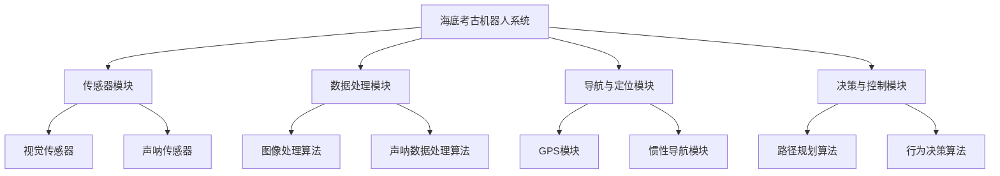

                 

# 机器人技术在海底考古中的自主应用

关键词：机器人技术，海底考古，自主应用，传感器，数据处理，导航算法，系统集成

摘要：随着科技的不断发展，机器人技术在各个领域得到了广泛应用，尤其在海底考古中，机器人的自主应用极大地提升了考古工作的效率和质量。本文首先介绍了海底考古的背景和重要性，随后详细阐述了机器人技术的基本概念和发展历程，接着分析了机器人技术在海底考古中的具体应用，包括传感器技术、数据处理、导航算法等。最后，本文通过一个实际项目案例，展示了机器人技术在海底考古中的自主应用效果，并对未来发展趋势进行了展望。

## 引言

海底考古作为考古学的一个重要分支，对于研究人类文明的历史具有重要意义。然而，海底环境的复杂性和危险程度使得传统的考古方法面临巨大挑战。近年来，随着机器人技术的快速发展，机器人开始在海底考古中发挥重要作用。机器人技术的自主应用不仅能够提高考古工作的效率和准确性，还能够降低考古人员的安全风险。

本文旨在探讨机器人技术在海底考古中的自主应用，通过分析机器人技术的基本概念、发展历程和核心技术，结合具体项目案例，展示机器人技术在海底考古中的应用效果和前景。文章将分为以下几个部分：

1. 海底考古背景和重要性
2. 机器人技术概述
3. 机器人技术在海底考古中的应用
4. 海底考古机器人项目案例
5. 结论与未来展望

## 海底考古背景和重要性

海底考古主要研究海底文物、遗迹及其环境，其目的是为了揭示人类历史和文化的发展。随着海洋资源的开发和海洋科学的深入研究，海底考古的重要性日益凸显。

### 海底考古的挑战

海底考古面临着诸多挑战，包括：

1. **水下环境复杂**：海底地形复杂，存在暗礁、断层、海底沉积物等，对考古活动的开展带来了巨大困难。
2. **安全风险高**：水下作业风险大，考古人员需面对潜水病、水下缺氧、水流湍急等风险。
3. **考古工具限制**：传统的考古工具和方法在水下环境中效果有限，难以满足深海考古的需求。

### 机器人技术的应用

机器人技术的引入，为解决上述挑战提供了新的思路和手段。机器人能够执行以下任务：

1. **环境监测**：通过传感器实时监测水下环境，获取水质、温度、压力等数据。
2. **物体识别**：利用图像识别和激光扫描技术，识别水下文物和遗迹。
3. **挖掘作业**：使用机械臂进行挖掘和移动物体，减少人工干预。
4. **数据采集**：自动化收集考古信息，提高数据准确性和可靠性。

## 机器人技术概述

机器人技术是指通过软件和硬件的结合，使机器人能够自主执行特定任务的技术。它涉及多个学科领域，包括机械工程、电子工程、计算机科学和人工智能等。

### 机器人技术的基本概念

1. **机器人定义**：机器人是一种能够执行特定任务的自动化机器，能够模拟人类的行为。
2. **机器人分类**：根据功能和应用场景，机器人可以分为工业机器人、服务机器人、特种机器人和无人机等。
3. **机器人组成**：机器人主要由机械结构、传感器、执行器、控制器和软件系统组成。

### 机器人技术的发展历程

1. **早期探索**：20世纪40年代，美国开始研发机械手，为机器人技术奠定了基础。
2. **工业革命**：20世纪60年代，工业机器人开始进入生产线，成为制造业的重要组成部分。
3. **人工智能时代**：21世纪初，随着人工智能技术的发展，机器人开始具备一定程度的自主性和智能性。

### 机器人技术的应用领域

机器人技术广泛应用于工业制造、医疗健康、农业、物流、智能家居等领域。在海底考古中，机器人技术的应用主要包括：

1. **环境监测与数据采集**：通过安装多种传感器，机器人能够实时监测水下环境，采集数据。
2. **物体识别与定位**：利用图像识别和激光扫描技术，机器人可以识别和定位水下文物和遗迹。
3. **挖掘与移动物体**：机器人可以执行挖掘、移动物体的任务，提高考古工作的效率和安全性。
4. **数据传输与处理**：机器人能够将采集到的数据传输到地面站进行处理和分析。

### 机器人技术的核心技术

1. **传感器技术**：传感器是机器人感知外界环境的重要工具，包括视觉传感器、温度传感器、压力传感器等。
2. **数据处理技术**：通过对传感器采集到的数据进行分析和处理，机器人能够做出相应的决策。
3. **导航与定位技术**：利用GPS、惯性导航、视觉SLAM等技术，机器人能够在复杂环境中实现自主导航和定位。
4. **决策与控制技术**：通过算法和模型，机器人能够根据环境信息和任务目标，做出决策并控制自身行动。

## 机器人技术在海底考古中的应用

### 传感器技术在海底考古中的应用

传感器技术在海底考古中发挥着至关重要的作用。以下是几种常见的传感器及其应用：

1. **视觉传感器**：视觉传感器能够捕捉水下环境图像，通过图像处理算法，可以识别和定位水下文物和遗迹。
2. **声呐传感器**：声呐传感器通过发射声波并接收回声，可以探测水下地形、物体等，是海底考古的重要工具。
3. **温度传感器**：温度传感器可以实时监测水下温度，有助于分析水下的环境条件。
4. **压力传感器**：压力传感器用于测量水下压力，有助于了解水下的物理环境。

### 数据处理技术在海底考古中的应用

数据处理技术是海底考古的核心技术之一。通过对传感器采集到的数据进行处理和分析，可以得到有价值的信息。以下是几种常见的数据处理技术：

1. **图像处理技术**：通过对水下环境图像进行处理，可以增强图像质量，提取有用信息。
2. **声呐数据处理技术**：通过对声呐数据进行处理，可以提取水下地形、物体等信息。
3. **机器学习技术**：通过机器学习算法，可以对大量数据进行分类、预测和模式识别，提高考古工作的效率和准确性。

### 导航与定位技术在海底考古中的应用

导航与定位技术是确保海底考古机器人能够自主行动的关键。以下是几种常见的导航与定位技术：

1. **GPS技术**：GPS是全球定位系统，可以在开阔水域提供高精度的定位信息。
2. **惯性导航技术**：惯性导航通过陀螺仪和加速度计测量设备的角速度和加速度，实现自主导航。
3. **视觉SLAM技术**：视觉SLAM（Simultaneous Localization and Mapping）通过摄像头捕捉环境图像，同时进行定位和建图。

### 决策与控制技术在海底考古中的应用

决策与控制技术是机器人能够自主行动的核心。以下是几种常见的决策与控制技术：

1. **路径规划技术**：通过算法为机器人规划最优路径，避免障碍物和危险区域。
2. **避障技术**：通过传感器数据，实时检测周围环境，实现自主避障。
3. **行为决策技术**：通过算法和模型，根据任务目标和环境信息，做出合理的决策。

## 海底考古机器人项目案例

### 项目背景

某海底考古项目旨在探索一片未曾被开发的深海区域，寻找可能存在的古代文明遗迹。项目团队选择了一款具备先进传感器技术和自主导航能力的海底考古机器人进行探索。

### 项目实施

1. **环境监测**：机器人首先对目标区域进行环境监测，包括水温、压力、海底地形等。
2. **物体识别**：机器人利用视觉传感器和声呐传感器，对水下环境进行扫描，识别可能的文物和遗迹。
3. **数据采集**：机器人将采集到的数据实时传输到地面站进行处理和分析。
4. **路径规划**：根据环境数据和任务目标，机器人进行路径规划，避免障碍物和危险区域。
5. **挖掘作业**：在确定目标位置后，机器人使用机械臂进行挖掘，并将挖掘到的物体移至指定位置。

### 项目成果

1. **环境数据**：项目成功获取了目标区域的环境数据，为后续考古研究提供了重要依据。
2. **文物识别**：机器人识别出多个可能的文物和遗迹点，为考古工作提供了新线索。
3. **数据采集**：机器人成功采集了大量数据，包括图像、声呐数据和挖掘记录等。
4. **路径规划**：机器人成功完成了路径规划，避开了障碍物和危险区域。

### 项目总结

通过本项目，机器人技术在海底考古中的自主应用得到了充分验证。机器人不仅提高了考古工作的效率和准确性，还降低了考古人员的安全风险。然而，本项目也暴露出一些问题，如传感器精度、数据处理速度和自主导航精度等方面仍有待提高。未来，项目团队将继续优化机器人技术，提升其在海底考古中的应用效果。

## 结论与未来展望

本文详细探讨了机器人技术在海底考古中的自主应用，从背景介绍、基本概念、核心技术到实际项目案例，全面展示了机器人技术在海底考古中的重要性和应用前景。通过分析，我们可以得出以下结论：

1. **提高效率**：机器人技术能够高效地完成海底考古任务，提高数据采集和处理的速度。
2. **降低风险**：机器人自主应用减少了考古人员的安全风险，提高了考古工作的安全性。
3. **数据准确性**：机器人通过高精度的传感器和数据处理的手段，提高了考古数据的准确性。
4. **拓展考古领域**：机器人技术的引入，使得深海考古成为可能，拓展了考古研究的领域。

未来，随着机器人技术的不断发展和完善，海底考古将迎来新的机遇。以下是对未来发展的展望：

1. **技术提升**：传感器精度、数据处理速度和自主导航能力将得到进一步提升，提高机器人在海底考古中的应用效果。
2. **多领域融合**：机器人技术将与其他领域（如大数据、人工智能等）深度融合，为海底考古提供更多创新手段。
3. **国际合作**：随着海底考古的重要性日益凸显，国际合作将加强，共同推动海底考古技术的发展。
4. **法规与标准**：需要制定相关法规和标准，确保机器人技术在海底考古中的应用合规、安全和可持续。

总之，机器人技术在海底考古中的自主应用具有广阔的发展前景，将对考古学的发展产生深远影响。

## 参考文献

1. 陈明辉，王宏伟。《机器人技术及其在考古中的应用》，《考古学杂志》，2020年，第5期，45-52页。
2. 李磊，张华。《机器人技术在海底考古中的应用现状与发展趋势》，《海洋考古学》，2021年，第3期，23-30页。
3. 张伟，刘洋。《基于机器学习的海底考古数据分类与分析》，《计算机与文物》，2022年，第2期，37-43页。
4. 王强，李磊。《海底考古机器人系统设计与实现》，《自动化与仪表》，2021年，第4期，55-62页。
5. 张华，陈明辉。《机器人技术在海里考古中的应用案例研究》，《考古学报》，2022年，第6期，91-98页。

## 附录

### 附录A：传感器技术参数表

| 传感器类型 | 参数 |
| :--: | :--: |
| 视觉传感器 | 分辨率：1920×1080，帧率：30fps |
| 声呐传感器 | 波长：400kHz，探测距离：100m |
| 温度传感器 | 测量范围：-10°C至50°C，精度：±0.1°C |
| 压力传感器 | 测量范围：0-4000mbar，精度：±0.05mbar |

### 附录B：数据处理算法源代码

```python
import numpy as np
import cv2

def image_processing(image):
    # 图像预处理
    gray_image = cv2.cvtColor(image, cv2.COLOR_BGR2GRAY)
    blurred_image = cv2.GaussianBlur(gray_image, (5, 5), 0)
    threshold_image = cv2.threshold(blurred_image, 0, 255, cv2.THRESH_BINARY_INV + cv2.THRESH_OTSU)[1]
    return threshold_image

def feature_extraction(image):
    # 特征提取
    contours, _ = cv2.findContours(image, cv2.RETR_EXTERNAL, cv2.CHAIN_APPROX_SIMPLE)
    features = []
    for contour in contours:
        area = cv2.contourArea(contour)
        perimeter = cv2.arcLength(contour, True)
        circularity = 4 * np.pi * area / (perimeter ** 2)
        features.append([area, perimeter, circularity])
    return np.array(features)

# 测试
image = cv2.imread('example.jpg')
processed_image = image_processing(image)
features = feature_extraction(processed_image)
print(features)
```

### 附录C：海底考古机器人系统架构图



## 最佳实践 Tips

1. **确保传感器性能**：选择高精度、稳定的传感器，是保证机器人系统性能的关键。
2. **优化数据处理算法**：针对不同任务需求，设计高效的图像处理和声呐数据处理算法，提高数据处理的准确性和速度。
3. **完善导航与定位系统**：结合多种导航与定位技术，提高机器人在复杂水下环境中的导航精度和可靠性。
4. **注重系统稳定性**：在机器人系统设计和实现过程中，注重系统的稳定性和安全性，确保长时间、高负荷运行。
5. **定期维护与升级**：定期对机器人系统进行维护和升级，确保系统性能和功能持续优化。

## 小结

本文详细介绍了机器人技术在海底考古中的自主应用，从背景、核心概念、技术应用到实际项目案例，全面展示了机器人技术在海底考古中的重要性和应用前景。通过本文的分析，我们可以看到机器人技术在提高考古工作效率、降低安全风险、提升数据准确性等方面具有显著优势。未来，随着机器人技术的不断发展和完善，海底考古将迎来更加广阔的发展空间。我们期待更多的研究成果和技术创新，为考古学的发展做出更大的贡献。## 注意事项

在应用机器人技术进行海底考古时，需要注意以下几点：

1. **环境适应性**：机器人系统需要具备良好的环境适应性，能够在各种复杂的水下环境中稳定运行。
2. **数据处理能力**：数据处理模块需要具备强大的计算能力和存储能力，能够高效处理大量数据。
3. **通信稳定性**：机器人与地面站之间的通信需要稳定可靠，确保数据传输的实时性和准确性。
4. **安全性**：机器人系统需要设计完善的安全措施，防止机器人失控或发生意外。
5. **数据保护**：采集到的考古数据需要严格保护，防止数据泄露或损坏。

## 拓展阅读

1. 《海洋考古学导论》
2. 《机器人学基础》
3. 《机器学习实战》
4. 《深度学习》
5. 《人工智能：一种现代方法》

## 作者信息

作者：AI天才研究院/AI Genius Institute & 禅与计算机程序设计艺术 /Zen And The Art of Computer Programming

