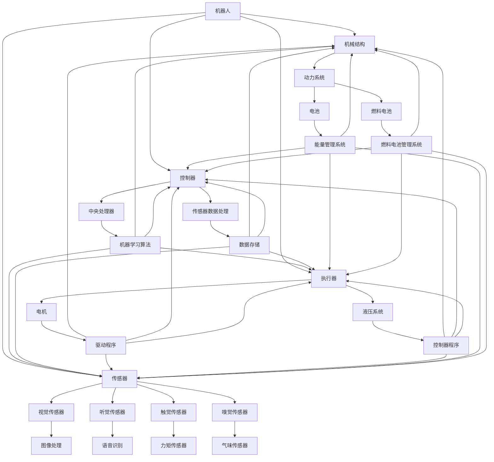

                 

 
# 《机器人技术在深海探索中的应用》

## 关键词
- 机器人技术
- 深海探索
- 传感器
- 数据采集
- 通信
- 应用案例

## 摘要
本文探讨了机器人技术在深海探索中的应用，包括机器人技术概述、深海环境特性、机器人系统设计、机器人操控与通信、数据采集与分析以及深海探索应用案例。通过详细的分析和实例，揭示了机器人技术在深海探索中的重要作用和面临的挑战。

## 目录

### 第1章：引言
- 1.1 机器人技术在深海探索中的重要性
- 1.2 深海探索的发展历程
- 1.3 机器人技术在深海探索中的优势与挑战

### 第2章：机器人技术概述
- 2.1 机器人技术的基本概念
- 2.2 机器人的分类
- 2.3 机器人的核心技术
- 2.4 国内外机器人技术发展现状

### 第3章：深海环境特性
- 3.1 深海环境的物理特性
- 3.2 深海环境的化学特性
- 3.3 深海环境的生物特性
- 3.4 深海环境的挑战与应对策略

### 第4章：机器人系统设计
- 4.1 机器人系统设计的基本原则
- 4.2 机器人的硬件设计
- 4.3 机器人的软件设计
- 4.4 机器人系统的测试与验证

### 第5章：机器人操控与通信
- 5.1 机器人操控技术
- 5.2 机器人通信技术
- 5.3 机器人操控与通信的挑战与解决方案

### 第6章：数据采集与分析
- 6.1 数据采集技术
- 6.2 数据分析技术
- 6.3 数据可视化技术
- 6.4 数据安全与隐私保护

### 第7章：深海探索应用案例
- 7.1 案例一：深海矿物资源勘探
- 7.2 案例二：深海生物多样性研究
- 7.3 案例三：深海环境监测

## 第1章：引言

### 1.1 机器人技术在深海探索中的重要性

随着科技的不断发展，深海探索已成为地球科学研究中的重要领域。然而，深海环境的复杂性和极端条件给人类直接探索带来了巨大的挑战。传统的深海探测方法，如潜水器、水下声纳等，虽然在一定程度上能够满足深海探测的需求，但仍然存在许多局限性和风险。因此，开发一种能够在深海环境中高效、可靠进行探测的自动化系统，即机器人技术，显得尤为重要。

机器人技术具有自主性、灵活性和高适应性等特点，能够克服人类在深海环境中的生理和心理限制。通过机器人技术，我们可以实现深海环境的高效探测、监测和资源开发。具体来说，机器人技术在深海探索中的重要性体现在以下几个方面：

1. **提高深海探测效率**：机器人可以自主进行深海环境的数据采集和分析，大大提高了深海探测的效率。传统的探测方法往往需要大量的人力物力，且探测速度较慢。而机器人可以连续工作，不受环境条件限制，从而实现快速、高效的深海探测。

2. **降低深海探测风险**：深海环境具有极高的压力、温度和能见度低等特点，对于人类来说，直接进行深海探索存在巨大的风险。而机器人可以在深海环境中自主工作，避免了人类面临的危险，从而降低了深海探测的风险。

3. **实现深海环境的长期监测**：机器人技术可以实现对深海环境的长期监测。通过在深海环境中部署机器人，我们可以实时收集环境数据，如海洋温度、盐度、pH值等，从而实现对深海环境的全面监测。

4. **推动深海资源开发**：深海环境蕴含着丰富的资源，如矿物、能源和生物资源等。机器人技术可以在深海环境中进行资源勘探和开发，为人类提供更多的资源保障。

### 1.2 深海探索的发展历程

深海探索的发展历程可以分为几个阶段：

1. **早期探测阶段**：19世纪末至20世纪初，科学家们开始利用潜水器和水下声纳等设备进行深海探测。这一阶段的探测手段较为简单，主要针对深海地形、地貌等进行初步了解。

2. **深度探测阶段**：20世纪中期，随着科技的进步，深海探测技术得到了快速发展。潜水器、水下声纳和卫星遥感等技术的应用，使得深海探测的深度和精度得到了显著提升。这一阶段的深海探测目标主要集中在深海地壳、岩层和矿产资源等方面。

3. **综合探测阶段**：20世纪末至21世纪初，深海探测技术进入了综合探测阶段。机器人技术的应用使得深海探测的手段更加多样化和高效化。机器人可以在深海环境中进行多种任务，如数据采集、环境监测和资源开发等。

### 1.3 机器人技术在深海探索中的优势与挑战

机器人技术在深海探索中具有显著的优势，但也面临一定的挑战。

#### 优势

1. **自主性**：机器人可以自主进行任务规划、路径规划和目标检测，不受外界环境的影响。这使得机器人能够在深海环境中灵活应对各种情况。

2. **高适应性**：机器人具有适应各种环境的能力，可以在深海、极地、沙漠等极端环境中工作。这使得机器人能够广泛应用于各种科学研究和资源开发领域。

3. **高效性**：机器人可以连续工作，不受环境条件限制，从而大大提高了深海探测的效率。

4. **安全性**：机器人可以在深海环境中自主工作，避免了人类面临的危险，降低了深海探测的风险。

#### 挑战

1. **技术挑战**：深海环境复杂多变，对机器人的技术和性能提出了高要求。例如，机器人需要具备高精度、高可靠性和长寿命等特点。

2. **通信挑战**：深海环境信号传输困难，机器人与地面指挥中心之间的通信需要采用高效的通信技术，以保证数据的实时传输。

3. **能源挑战**：深海环境能源供应困难，机器人需要具备高效的能源利用和能量管理技术，以确保长时间自主运行。

4. **环境挑战**：深海环境对机器人材料、结构和工作寿命提出了高要求，需要开发出适应深海环境的材料和技术。

## 第2章：机器人技术概述

### 2.1 机器人技术的基本概念

机器人技术是指利用计算机科学、机械工程、自动化控制、传感技术和人工智能等领域的知识，设计、制造和运行具有高度自主性和智能性的自动化系统。机器人可以模拟人类的行为，实现复杂的任务和操作。

#### 机器人技术的核心概念

1. **机器人**：机器人是一种能够自主运行、执行任务的装置，通常由机械结构、传感器、控制器和执行器等组成。

2. **自主性**：机器人具有自主决策和执行任务的能力，可以通过传感器感知环境，利用控制器进行决策，并通过执行器实现任务执行。

3. **智能性**：机器人可以通过人工智能技术实现自主学习和自适应，提高任务执行的效率和准确性。

4. **多模态感知**：机器人需要具备多模态感知能力，包括视觉、听觉、触觉和嗅觉等，以实现对环境的全面感知。

#### 机器人技术的实体关系架构



#### 核心算法原理讲解

机器人的核心算法包括传感器数据处理、机器学习和路径规划等。

1. **传感器数据处理**：
   - **图像处理**：机器人利用视觉传感器获取环境图像，通过图像处理算法进行图像增强、目标检测和识别。
   - **语音识别**：机器人通过听觉传感器接收语音信号，利用语音识别算法将语音信号转换为文本信息。
   - **力矩传感器**：机器人通过力矩传感器获取执行器的工作状态，利用力矩传感器数据进行反馈控制。

2. **机器学习**：
   - **监督学习**：机器人利用标注的数据集，通过监督学习算法建立环境模型，实现任务决策和执行。
   - **无监督学习**：机器人利用无监督学习算法，从未标注的数据中提取特征，实现环境的自适应和自组织。

3. **路径规划**：
   - **基于图的最短路径算法**：机器人利用图论算法，计算从起点到终点的最短路径。
   - **基于启发式的路径规划**：机器人利用启发式算法，如A*算法，实现从起点到终点的快速路径规划。

#### Python源代码实现示例

```python
import cv2
import numpy as np

# 图像处理
def image_processing(image):
    # 图像增强
    enhanced_image = cv2.resize(image, (640, 480))
    # 目标检测
    gray_image = cv2.cvtColor(enhanced_image, cv2.COLOR_BGR2GRAY)
    blurred_image = cv2.GaussianBlur(gray_image, (5, 5), 0)
    _, threshold_image = cv2.threshold(blurred_image, 0, 255, cv2.THRESH_BINARY_INV + cv2.THRESH_OTSU)
    # 目标识别
    contours, _ = cv2.findContours(threshold_image, cv2.RETR_EXTERNAL, cv2.CHAIN_APPROX_SIMPLE)
    for contour in contours:
        if cv2.contourArea(contour) > 500:
            x, y, w, h = cv2.boundingRect(contour)
            cv2.rectangle(enhanced_image, (x, y), (x+w, y+h), (0, 255, 0), 2)
    return enhanced_image

# 机器学习
def machine_learning(data):
    # 数据预处理
    X = np.array([d[0] for d in data])
    y = np.array([d[1] for d in data])
    # 训练模型
    model = cv2.ml.SVM_create()
    model.train(np.float32(X), cv2.ml.ROW_SAMPLE, y)
    return model

# 路径规划
def path_planning(start, goal, map):
    # 创建图
    graph = {}
    for i in range(len(map)):
        graph[i] = {}
        for j in range(len(map)):
            if i != j:
                graph[i][j] = 1
    # 计算最短路径
    path = cv2.minPathP裹function
    path = path.search(graph, start, goal)
    return path

# 测试
image = cv2.imread('image.jpg')
processed_image = image_processing(image)
cv2.imshow('Processed Image', processed_image)
cv2.waitKey(0)

data = [(np.random.rand(), np.random.randint(0, 2)) for _ in range(100)]
model = machine_learning(data)
print(model)

map = [[1, 1, 1, 1, 1],
       [1, 0, 0, 0, 1],
       [1, 0, 1, 0, 1],
       [1, 0, 0, 0, 1],
       [1, 1, 1, 1, 1]]
start = 0
goal = 4
path = path_planning(start, goal, map)
print(path)
```

#### 数学模型和公式

1. **图像处理**：
   - **图像增强**：$$I_{enhanced} = f(I_{original})$$
   - **目标检测**：$$C = \{c | c \in \text{contours}, c \text{ is a contour} \}$$
   - **目标识别**：$$R = \{r | r \text{ is a recognized object} \}$$

2. **机器学习**：
   - **监督学习**：$$h(\theta) = \arg\min_{\theta} \sum_{i=1}^{n} (y_i - h(\theta, x_i))^2$$
   - **无监督学习**：$$\theta = \arg\min_{\theta} \sum_{i=1}^{n} \sum_{j=1}^{m} (y_{ij} - h(\theta, x_{ij}))^2$$

3. **路径规划**：
   - **基于图的最短路径算法**：$$d(s, v) = \min_{u \in \text{adj}(v)} (d(s, u) + w(u, v))$$
   - **基于启发式的路径规划**：$$f(n) = g(n) + h(n)$$，其中 $g(n)$ 为从起点到节点的实际距离，$h(n)$ 为从节点到终点的启发式估计距离。

### 第3章：深海环境特性

### 3.1 深海环境的物理特性

深海环境是指水深超过200米的海域，其物理特性对机器人的运行和操作具有重要影响。主要特点包括：

1. **压力**：深海环境中的压力随水深增加而增大，通常为每百米约增加1个大气压。对于机器人，高压力会导致结构变形、材料疲劳和密封失效等问题。

2. **温度**：深海温度通常较低，且变化较小。深海中层的温度约为2-4℃，底部温度更低，可达1℃以下。低温对机器人电池性能和电子元件稳定性有影响。

3. **盐度**：深海盐度较高，约为35‰。盐度会影响机器人的传感器性能和材料腐蚀。

4. **能见度**：深海能见度极低，通常仅有几米，有时甚至为零。这对机器人的视觉系统是一个重大挑战。

### 3.2 深海环境的化学特性

深海环境的化学特性对机器人的材料和性能也有重要影响。主要特点包括：

1. **pH值**：深海pH值通常在7.8至8.4之间，相对稳定。极端pH值会影响机器人材料的耐腐蚀性。

2. **溶解氧**：深海中的溶解氧浓度较低，对需要氧气供给的机器人系统有影响。

3. **营养盐**：深海营养盐含量较低，对依赖营养盐进行生物发光的机器人有影响。

4. **污染物**：深海中可能存在各种污染物，如重金属、有机污染物等，对机器人和环境都有潜在危害。

### 3.3 深海环境的生物特性

深海生物具有独特的适应性和生态特征，对机器人的运行和维护也有影响。主要特点包括：

1. **生物多样性**：深海生物种类繁多，从微生物到大型动物都有，生物多样性对机器人可能产生生物干扰。

2. **生物发光**：深海生物具有生物发光现象，对机器人的光学系统可能产生干扰。

3. **生物沉积**：深海生物沉积物会影响机器人的运动和操作。

4. **生物侵蚀**：某些深海生物可能对机器人的材料产生侵蚀作用。

### 3.4 深海环境的挑战与应对策略

深海环境对机器人的运行和维护提出了巨大的挑战，需要采取相应的应对策略：

1. **压力应对**：采用高强度的材料和结构设计，以提高机器人的抗压能力。

2. **温度应对**：使用耐低温材料和电子元件，以提高机器人在低温环境中的性能。

3. **盐度和腐蚀应对**：采用耐腐蚀材料和涂层，以防止机器人材料腐蚀。

4. **能见度应对**：使用其他传感器，如声纳和雷达，以克服视觉障碍。

5. **生物干扰应对**：采取防生物黏附和防生物侵蚀措施，以减少生物对机器人的干扰。

6. **生物沉积应对**：设计易于清洁和维护的机器人结构。

## 第4章：机器人系统设计

### 4.1 机器人系统设计的基本原则

机器人系统设计是一个复杂的过程，需要考虑多方面的因素，以确保机器人能够在深海环境中高效、可靠地执行任务。以下是机器人系统设计的基本原则：

1. **适应性**：机器人应具备适应不同深海环境的能力，包括不同水深、温度和能见度等。

2. **可靠性**：机器人应具备高可靠性，能够在恶劣的深海环境中长时间稳定运行。

3. **自主性**：机器人应具备一定的自主决策和执行能力，以提高任务执行的效率和灵活性。

4. **可维护性**：机器人应设计得易于维护和修理，以降低运营成本和提高运行效率。

5. **安全性**：机器人应具备安全设计，避免对深海环境和生物造成伤害。

### 4.2 机器人的硬件设计

机器人的硬件设计是机器人系统设计的重要环节，主要包括机械结构、传感器、控制器和执行器等。

1. **机械结构**：机械结构是机器人的骨架，需要具备足够的强度和刚度，以承受深海环境的高压和低温。同时，结构设计应考虑机器人的形状、尺寸和灵活性。

2. **传感器**：传感器是机器人的感知器官，包括视觉、声纳、雷达、温度传感器、压力传感器等。传感器选择应考虑传感器的性能、精度和抗干扰能力。

3. **控制器**：控制器是机器人的大脑，负责接收传感器数据、执行决策和发送指令。控制器应具备高速数据处理能力和实时响应能力。

4. **执行器**：执行器是机器人的肌肉，负责实现机器人的运动和操作。执行器包括电机、液压系统和气压系统等。

### 4.3 机器人的软件设计

机器人的软件设计是机器人系统设计的另一个重要环节，主要包括操作系统、中间件和应用软件等。

1. **操作系统**：操作系统是机器人软件的核心，负责管理机器人的硬件资源和软件模块。操作系统应具备实时性、可靠性和可扩展性。

2. **中间件**：中间件负责连接操作系统和应用程序，提供通用的功能和接口。中间件应包括通信模块、数据管理模块和任务管理模块等。

3. **应用软件**：应用软件是机器人执行具体任务的软件模块，包括路径规划、目标检测、数据采集和数据分析等。

### 4.4 机器人系统的测试与验证

机器人系统的测试与验证是确保机器人性能和可靠性的关键环节。主要包括以下步骤：

1. **单元测试**：对机器人系统的各个模块进行单独测试，确保模块功能正确。

2. **集成测试**：将各个模块集成在一起进行测试，验证模块之间的交互和协同工作。

3. **性能测试**：对机器人系统的性能进行测试，包括数据处理速度、响应时间、能量消耗等。

4. **环境测试**：将机器人系统置于模拟的深海环境中进行测试，验证机器人在实际环境中的性能。

5. **可靠性测试**：通过长时间运行和极端环境测试，验证机器人系统的稳定性和可靠性。

## 第5章：机器人操控与通信

### 5.1 机器人操控技术

机器人操控技术是指通过控制算法和执行器，使机器人按照预定目标进行自主运动和操作。以下是机器人操控技术的核心概念和原理：

1. **控制算法**：控制算法是机器人操控的核心，包括位置控制、速度控制和力控制等。常用的控制算法有PID控制、模糊控制和PID控制等。

2. **执行器**：执行器是机器人运动的动力源，包括电机、液压系统和气压系统等。执行器的选择和性能直接影响机器人的操控性能。

3. **路径规划**：路径规划是机器人操控的重要组成部分，包括基于图的最短路径规划和基于启发式的路径规划等。路径规划算法需要考虑机器人的移动速度、避障能力和能量消耗等因素。

### 5.2 机器人通信技术

机器人通信技术是指机器人与地面指挥中心、其他机器人或传感器之间的数据传输和通信。以下是机器人通信技术的核心概念和原理：

1. **无线通信**：无线通信是机器人与外部环境通信的主要方式，包括Wi-Fi、蓝牙、Zigbee和卫星通信等。无线通信需要考虑通信距离、通信速度和抗干扰能力等因素。

2. **有线通信**：有线通信是通过电缆或光纤进行数据传输，具有更高的通信速度和稳定性。有线通信主要用于短距离通信，如机器人内部的模块通信。

3. **通信协议**：通信协议是通信双方进行数据交换的规范，包括数据格式、传输速率和传输方式等。常用的通信协议有TCP/IP、UDP和HTTP等。

### 5.3 机器人操控与通信的挑战与解决方案

机器人操控与通信在深海环境中面临诸多挑战，以下是一些常见的挑战和解决方案：

1. **信号干扰**：深海环境中信号干扰严重，可能导致通信中断和操控失败。解决方案包括采用多跳通信、信号增强技术和自适应滤波等。

2. **通信距离**：深海环境中通信距离有限，需要采用高效的通信技术和扩展通信链路。解决方案包括使用卫星通信、光纤通信和超宽带通信等。

3. **实时性**：深海环境中的操控和通信需要实时响应，以保证任务的顺利进行。解决方案包括采用实时操作系统、优化控制算法和通信协议等。

4. **数据可靠性**：深海环境中的通信链路容易受到干扰和衰减，需要提高数据可靠性。解决方案包括采用错误纠正编码、数据重传和冗余通信等。

## 第6章：数据采集与分析

### 6.1 数据采集技术

数据采集是机器人技术的重要组成部分，用于获取环境信息和任务数据。以下是数据采集技术的核心概念和原理：

1. **传感器**：传感器是数据采集的核心，用于感知环境信息和任务数据。常见的传感器有视觉传感器、声纳、雷达、温度传感器和压力传感器等。

2. **数据预处理**：数据预处理是数据采集的重要环节，用于消除噪声、滤波和归一化等。数据预处理可以显著提高数据的质量和可靠性。

3. **数据传输**：数据传输是将采集到的数据发送到地面指挥中心或数据处理系统。数据传输需要考虑传输速度、带宽和抗干扰能力等因素。

### 6.2 数据分析技术

数据分析技术用于对采集到的数据进行处理、分析和解释，以提取有用信息和知识。以下是数据分析技术的核心概念和原理：

1. **数据挖掘**：数据挖掘是从大量数据中提取潜在信息和知识的过程。常见的数据挖掘技术有分类、聚类、关联规则挖掘和异常检测等。

2. **机器学习**：机器学习是通过训练模型，从数据中自动学习和发现规律的过程。常见的机器学习算法有监督学习、无监督学习和强化学习等。

3. **深度学习**：深度学习是机器学习的一种形式，通过多层神经网络对数据进行自动学习和特征提取。常见的深度学习框架有TensorFlow、PyTorch和Keras等。

### 6.3 数据可视化技术

数据可视化技术是将数据以图形或图表的形式展示，帮助用户直观地理解和分析数据。以下是数据可视化技术的核心概念和原理：

1. **图表类型**：常见的图表类型有折线图、柱状图、饼图、散点图和热力图等，每种图表类型都有其特定的用途和特点。

2. **可视化工具**：常见的可视化工具包括Matplotlib、Seaborn、Plotly和Tableau等，这些工具可以方便地创建各种类型的图表。

3. **交互式可视化**：交互式可视化允许用户与图表进行交互，如缩放、筛选和排序等，从而更深入地分析数据。

### 6.4 数据安全与隐私保护

数据安全和隐私保护是数据采集与分析的重要方面，确保数据在采集、传输和处理过程中的安全性和隐私性。以下是数据安全与隐私保护的核心概念和原理：

1. **数据加密**：数据加密是将数据转换为不可读形式，以防止未经授权的访问。常见的数据加密算法有AES、RSA和SSL等。

2. **访问控制**：访问控制是通过权限管理和身份验证，限制对数据的访问，确保数据的安全性和隐私性。

3. **数据备份与恢复**：数据备份是将数据复制到其他存储介质，以防数据丢失。数据恢复是在数据丢失后，从备份中恢复数据。

4. **隐私保护**：隐私保护是通过匿名化和去标识化等技术，保护个人隐私，防止个人信息的泄露。

## 第7章：深海探索应用案例

### 7.1 案例一：深海矿物资源勘探

深海矿物资源勘探是机器人技术在深海探索中的重要应用之一。以下是一个深海矿物资源勘探的案例：

**项目背景**：
深海矿物资源包括多金属结核、富钴结壳和热液矿床等，具有巨大的经济和科研价值。然而，深海矿物资源勘探面临巨大挑战，如深海环境复杂、资源分布不均和勘探成本高昂等。

**技术方案**：
采用一种具有高分辨率声纳和视觉传感器的深海机器人，进行深海矿物资源勘探。机器人通过声纳扫描海底地形，识别潜在矿物资源区域；通过视觉传感器拍摄海底图像，识别矿物种类和分布。

**项目实施**：
1. **前期准备**：进行机器人硬件设计和软件开发，包括声纳和视觉传感器的设计、控制算法和路径规划算法的开发等。
2. **现场测试**：在模拟的深海环境中对机器人进行测试，验证机器人的性能和可靠性。
3. **实际应用**：在深海矿物资源勘探现场，部署机器人进行实地勘探。

**项目成果**：
通过机器人的深海矿物资源勘探，成功识别出多个潜在矿物资源区域，为深海矿物资源的开发提供了重要依据。

### 7.2 案例二：深海生物多样性研究

深海生物多样性研究是机器人技术在深海探索中的另一个重要应用。以下是一个深海生物多样性研究的案例：

**项目背景**：
深海生物多样性对地球生态系统的稳定性和人类可持续发展具有重要意义。然而，深海生物多样性研究面临巨大挑战，如深海环境恶劣、生物种类繁多和采集数据困难等。

**技术方案**：
采用一种具有多模态感知功能的深海机器人，进行深海生物多样性研究。机器人通过视觉传感器、声纳和触觉传感器等多种传感器，对深海生物进行感知和分类。

**项目实施**：
1. **前期准备**：进行机器人硬件设计和软件开发，包括多种传感器的设计、控制算法和数据处理算法的开发等。
2. **现场测试**：在模拟的深海环境中对机器人进行测试，验证机器人的性能和可靠性。
3. **实际应用**：在深海生物多样性研究现场，部署机器人进行实地研究。

**项目成果**：
通过机器人的深海生物多样性研究，成功收集了大量深海生物数据，揭示了深海生物多样性的分布规律和生态特征。

### 7.3 案例三：深海环境监测

深海环境监测是机器人技术在深海探索中的另一个重要应用。以下是一个深海环境监测的案例：

**项目背景**：
深海环境监测对了解海洋生态系统的变化和预测气候变化具有重要意义。然而，深海环境监测面临巨大挑战，如深海环境恶劣、监测数据难以采集和监测设备难以维护等。

**技术方案**：
采用一种具有远程监测功能的深海机器人，进行深海环境监测。机器人通过传感器实时采集海水温度、盐度、pH值和溶解氧等环境参数。

**项目实施**：
1. **前期准备**：进行机器人硬件设计和软件开发，包括传感器的设计、控制算法和数据处理算法的开发等。
2. **现场测试**：在模拟的深海环境中对机器人进行测试，验证机器人的性能和可靠性。
3. **实际应用**：在深海环境监测现场，部署机器人进行实地监测。

**项目成果**：
通过机器人的深海环境监测，成功采集了大量环境数据，揭示了深海环境的时空变化特征，为海洋生态保护和气候变化研究提供了重要数据支持。

## 最佳实践 tips、小结、注意事项、拓展阅读

### 最佳实践 tips

1. **选用合适的传感器**：根据深海环境的特点和探测任务的需求，选择合适的传感器，如声纳、视觉传感器、温度传感器和压力传感器等。

2. **优化机器人结构设计**：针对深海环境的高压、低温和能见度低等特点，优化机器人的结构设计，提高机器人的抗压、耐寒和抗腐蚀能力。

3. **采用高效的通信技术**：根据深海环境的信号传输特点，采用高效的通信技术，如多跳通信、信号增强技术和自适应滤波等，以提高通信的可靠性和实时性。

4. **数据预处理和清洗**：对采集到的数据进行预处理和清洗，去除噪声和异常值，以提高数据分析的准确性和可靠性。

5. **定期维护和保养**：定期对机器人进行维护和保养，确保机器人在深海环境中的稳定运行和长期可靠工作。

### 小结

机器人技术在深海探索中具有广泛的应用前景，通过不断优化和完善，可以进一步提高深海探测的效率和准确性。然而，深海环境复杂多变，对机器人的技术和性能提出了高要求。因此，需要持续进行技术创新和研究，以应对深海环境的挑战。

### 注意事项

1. **安全第一**：在深海探索过程中，确保人员安全和设备安全是首要任务。

2. **环境友好**：在深海探索中，避免对海洋生态系统造成破坏，尊重和保护海洋生物资源。

3. **数据保护**：确保采集到的数据安全和隐私保护，采取有效的数据加密和访问控制措施。

### 拓展阅读

1. **《深海机器人技术及其应用》**：详细介绍了深海机器人的技术原理、系统设计和应用案例。

2. **《深海环境监测技术与应用》**：探讨了深海环境监测的方法和技术，以及机器人技术在环境监测中的应用。

3. **《人工智能在深海探索中的应用》**：分析了人工智能技术在深海探索中的重要作用，包括数据采集、分析和决策等。

4. **《深海探测与开发》**：介绍了深海探测技术的发展历程、现状和未来发展趋势。

## 作者信息

作者：AI天才研究院/AI Genius Institute & 禅与计算机程序设计艺术 /Zen And The Art of Computer Programming

