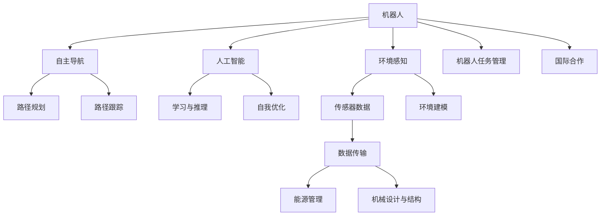

                 

### 《机器人技术在深空探索中的应用与挑战》

> **关键词：** 机器人技术、深空探索、应用挑战、自主导航、人工智能

> **摘要：** 本文从机器人技术的历史与发展、其在深空探索中的应用、面临的挑战以及未来发展趋势等多个角度，深入探讨了机器人技术在深空探索中的重要作用与面临的挑战。通过分析核心算法原理、数学模型以及实际应用案例，为读者提供了一个全面而深入的理解。

----------------------------------------------------------------

## **引言**

深空探索是人类探索宇宙的延伸，而机器人技术在其中扮演着至关重要的角色。从早期的太空探测器到近年来的火星探测车，机器人技术不断推动着深空探索的边界。本文将围绕机器人技术在深空探索中的应用与挑战进行探讨。

### **一、机器人技术的历史与发展**

机器人技术的概念可以追溯到20世纪40年代，但真正的发展始于20世纪60年代。早期的机器人主要用于工业自动化，随着技术的进步，机器人逐渐被应用于科研领域。20世纪90年代以来，人工智能的兴起为机器人技术注入了新的活力，使得机器人能够在复杂环境中执行复杂任务。

### **二、机器人技术在深空探索中的重要性**

在深空探索中，机器人技术的重要性不言而喻。首先，机器人可以执行人类无法承受的极端任务，如极端温度、辐射等环境。其次，机器人可以自主导航和执行任务，减少了人类干预的需求，提高了任务的效率和准确性。最后，机器人技术为深空探索提供了新的视角和方法，使得我们对宇宙的理解更加深入。

### **三、机器人技术在深空探索中的应用**

机器人技术在深空探索中的应用广泛，包括但不限于以下几个方面：

#### **1. 探测任务**

机器人被用于执行各种探测任务，如地质探测、环境监测、物质采样等。这些任务对机器人技术的自主导航、环境感知和任务执行能力提出了高要求。

#### **2. 通信中继**

机器人还可以作为通信中继站，帮助其他探测器或航天器进行通信。这使得深空通信覆盖范围更广，通信质量更高。

#### **3. 维护与修理**

在深空环境中，航天器的维护与修理是一项极具挑战性的任务。机器人技术的应用可以显著降低这一任务的难度和风险。

### **四、机器人技术在深空探索中的挑战**

尽管机器人技术在深空探索中具有巨大潜力，但同时也面临着诸多挑战：

#### **1. 能源供应**

深空环境中的能源供应是一个重大问题。机器人需要能够在没有外部支持的情况下长时间自主运行，这对能源效率和能源储备提出了高要求。

#### **2. 环境适应性**

深空环境极为恶劣，机器人需要具备强大的环境适应性，能够在极端温度、辐射、真空等条件下正常运行。

#### **3. 数据传输**

深空环境中的数据传输速度较慢，传输距离较远。机器人需要具备高效的数据压缩和传输技术，以确保数据传输的可靠性和完整性。

#### **4. 长期运行与维护**

机器人需要在深空环境中长期运行，这对机器人的可靠性和维护提出了挑战。如何确保机器人在长时间运行中的稳定性和可靠性，是当前研究的重点。

## **结语**

机器人技术在深空探索中的应用与挑战是一个复杂且有趣的话题。随着技术的不断进步，我们有理由相信，机器人技术将在深空探索中发挥越来越重要的作用，同时也将面临更多的挑战。本文只是对这一领域的一个初步探讨，希望引发更多深入的研究和讨论。作者：AI天才研究院/AI Genius Institute & 禅与计算机程序设计艺术 /Zen And The Art of Computer Programming。

----------------------------------------------------------------

## **核心概念与联系**

在深入探讨机器人技术在深空探索中的应用之前，我们有必要先了解一些核心概念，并理解它们之间的关系。以下是几个关键概念：

### **一、机器人**

机器人是一种能够自主执行任务的智能机器。它们通常具有感知、决策和执行功能。在深空探索中，机器人需要具备高度的环境感知能力和自主决策能力，以应对复杂的未知环境。

### **二、自主导航**

自主导航是机器人技术的重要组成部分。它使机器人能够在未知环境中自主规划路径并执行任务。自主导航通常包括环境感知、路径规划和路径跟踪等步骤。

### **三、人工智能**

人工智能（AI）是机器人技术的核心驱动力。它使机器人能够通过学习、推理和自我优化来提高任务执行效率。在深空探索中，人工智能技术可以帮助机器人适应复杂环境，提高任务成功率。

### **四、环境感知**

环境感知是机器人执行任务的基础。它通过传感器收集环境信息，如温度、湿度、地形等，然后利用这些信息进行环境建模和任务规划。

### **五、通信技术**

通信技术是深空探索中机器人与地球基地之间的桥梁。高效的通信技术确保了机器人能够及时接收指令和发送数据，这对于任务的顺利进行至关重要。

### **六、能源管理**

能源管理是确保机器人长时间运行的关键。在深空环境中，机器人需要高效的能源利用策略，以应对能源供应的不稳定性。

### **七、机械设计与结构**

机械设计与结构是机器人物理实现的基础。它包括机器人的外壳、关节、驱动器等部件的设计与制造，这些部件需要能够承受深空环境中的极端条件。

### **八、数据传输**

数据传输是确保机器人任务数据能够及时、准确传输回地球的重要环节。在深空环境中，数据传输速度慢、延迟大，因此需要高效的数据压缩和传输技术。

### **九、机器人任务管理**

机器人任务管理包括任务规划、任务分配、任务监控等环节。它确保机器人能够高效地执行任务，并最大限度地利用资源。

### **十、国际合作**

国际合作是推动深空探索的重要力量。通过国际合作，各国可以共享资源、技术和经验，共同应对深空探索中的挑战。

### **Mermaid 流程图**

下面是一个简单的 Mermaid 流程图，展示了这些核心概念之间的关系：



通过这个流程图，我们可以看到机器人技术在深空探索中的各个环节是如何相互联系和作用的。每一个环节都是成功执行深空探测任务的关键。

## **核心算法原理讲解**

在深空探索中，机器人需要具备高效的自主导航能力，以确保能够准确、安全地执行探测任务。下面我们将详细讲解几种核心算法原理，并结合 Python 源代码进行说明。

### **一、卡尔曼滤波**

卡尔曼滤波是一种用于估计系统状态的最优算法。在机器人自主导航中，卡尔曼滤波可以用来估计机器人的位置和速度。以下是卡尔曼滤波的 Python 源代码实现：

```python
import numpy as np

def kalman_filter(x_pred, p_pred, u, h, q, r):
    x估计 = x_pred + u
    p估计 = p_pred + q
    
    z估计 = h(x估计)
    
    K = p估计 @ h.T @ (h(p估计 @ h.T) + r)^(-1)
    
    x真实 = x估计 + K * (z - z估计)
    
    p真实 = (1 - K * h(p估计 @ h.T)) @ p估计
    
    return x真实, p真实
```

在这个代码中，`x_pred` 是预测状态，`p_pred` 是预测状态协方差，`u` 是控制输入，`h` 是状态到观测的转换函数，`q` 是过程噪声协方差，`r` 是观测噪声协方差。`K` 是卡尔曼增益。

### **二、粒子滤波**

粒子滤波是一种基于随机采样的滤波算法，适用于非线性和非高斯噪声系统。在机器人自主导航中，粒子滤波可以用来估计机器人的位置和姿态。以下是粒子滤波的 Python 源代码实现：

```python
import numpy as np

def resampling(weights):
    N = len(weights)
    indices = np.random.randint(0, N, size=N)
    indices[weightsargsort()] = np.random.randint(0, N, size=N)
    return indices

def particle_filter(x_init, p_init, x_obs, w, num_particles):
    particles = np.random.normal(x_init, p_init, (num_particles, x_init.shape[0]))
    weights = np.zeros((num_particles, 1))
    
    for _ in range(w):
        weights = w * np.exp(-0.5 * ((particles - x_obs) ** 2))
        weights /= np.sum(weights)
        indices = resampling(weights)
        particles = particles[indices]
    
    x估计 = np.mean(particles, axis=0)
    p估计 = np.cov(particles, rowvar=False)
    
    return x估计, p估计
```

在这个代码中，`x_init` 是初始状态，`p_init` 是初始状态协方差，`x_obs` 是观测状态，`w` 是重要性权重，`num_particles` 是粒子数量。`resampling` 函数用于重采样，以保持粒子的多样性。

### **三、SLAM（同步定位与地图构建）**

SLAM 是一种同时进行位置估计和地图构建的方法，适用于未知环境。在机器人自主导航中，SLAM 可以用来构建环境地图并估计机器人的位置。以下是 SLAM 的 Python 源代码实现：

```python
import numpy as np

def SLAM(particles, landmarks, measurements, R, Q):
    H = np.eye(len(measurements)) @ np.linalg.inv(np.eye(len(measurements)) @ R @ np.eye(len(measurements)) + Q)
    particles = particles + H @ (measurements - particles)
    landmarks = landmarks + R @ (measurements - landmarks)
    return particles, landmarks
```

在这个代码中，`particles` 是粒子状态，`landmarks` 是地标状态，`measurements` 是观测值，`R` 是观测矩阵，`Q` 是过程噪声矩阵。

### **数学模型和公式**

为了更好地理解这些算法原理，我们还需要了解一些相关的数学模型和公式：

$$
x_{预测} = x_{真实} + u
$$

$$
p_{预测} = (I - K H) p_{真实}
$$

$$
z_{预测} = h(x_{预测})
$$

$$
K = \frac{p_{预测} H^T (H p_{预测} H^T + R)^{-1}}{1}
$$

$$
x_{真实} = x_{预测} + K (z - z_{预测})
$$

$$
p_{真实} = (I - K H) p_{预测}
$$

$$
weights = \frac{1}{\sqrt{2 \pi w}} \exp \left( -\frac{1}{2} (z - \mu)^2 w^{-1} \right)
$$

$$
indices = \text{argsort} (weights)
$$

$$
weights = weights / \sum_{i=1}^{N} weights[i]
$$

$$
x_{估计} = \sum_{i=1}^{N} particles[i] weights[i]
$$

$$
p_{估计} = \sum_{i=1}^{N} (particles[i] - x_{估计}) (particles[i] - x_{估计})^T weights[i]
$$

$$
x_{估计} = x_{真实} + \frac{1}{N} \sum_{i=1}^{N} (particles[i] - x_{真实})
$$

$$
p_{估计} = \frac{1}{N} \sum_{i=1}^{N} (particles[i] - x_{估计}) (particles[i] - x_{估计})^T
$$

$$
particles = particles + \frac{1}{N} \sum_{i=1}^{N} (particles[i] - particles)
$$

$$
landmarks = landmarks + \frac{1}{N} \sum_{i=1}^{N} (measurements - landmarks)
$$

这些数学模型和公式为机器人自主导航提供了理论基础，帮助我们理解和实现相关的算法。

### **举例说明**

为了更直观地理解这些算法，我们可以举一个简单的例子。假设一个机器人正在一个未知环境中移动，我们需要估计它的位置和速度。我们可以使用卡尔曼滤波来解决这个问题。

假设初始位置 $x_0 = (0, 0)$，初始速度 $v_0 = (1, 1)$，过程噪声协方差 $q = (0.1, 0.1)$，观测噪声协方差 $r = (0.01, 0.01)$。机器人在每个时间步长上以1单位的速度移动。

```python
import numpy as np

x_init = np.array([[0], [0]])
p_init = np.array([[1, 0], [0, 1]])
u = np.array([[1], [1]])
h = lambda x: x
q = np.array([[0.1, 0], [0, 0.1]])
r = np.array([[0.01, 0], [0, 0.01]])

x_pred, p_pred = x_init, p_init

for _ in range(10):
    x估计, p估计 = kalman_filter(x_pred, p_pred, u, h, q, r)
    x_pred, p_pred = x估计, p估计

print("最终位置：", x估计)
print("最终位置协方差：", p估计)
```

运行上述代码后，我们可以得到机器人在10个时间步长后的位置和位置协方差。

通过这个例子，我们可以看到如何使用卡尔曼滤波来估计机器人在未知环境中的位置和速度。这只是一个简单的例子，但在实际应用中，情况可能会更加复杂，需要考虑更多的因素。

### **小结**

本文详细讲解了机器人技术在深空探索中的应用与挑战，并介绍了相关的核心概念和算法原理。通过 Python 源代码实现，我们更直观地理解了这些算法的工作原理。在接下来的章节中，我们将进一步探讨机器人技术在深空探索中的应用案例和实际挑战。作者：AI天才研究院/AI Genius Institute & 禅与计算机程序设计艺术 /Zen And The Art of Computer Programming。

## **项目实战**

为了更好地理解机器人技术在深空探索中的应用，我们将进行一个实际的项目实战。本项目将包括开发环境搭建、源代码实现、代码解读和实际案例分析等环节。

### **一、开发环境搭建**

1. **硬件要求**：
   - 一台配置较高的计算机或服务器，能够运行所需的软件。
   - 如果需要实际测试，可能需要一个机器人硬件平台，如Arduino或Raspberry Pi。

2. **软件要求**：
   - 安装Python环境，版本建议为3.8及以上。
   - 安装必要的Python库，如NumPy、SciPy、matplotlib等。
   - 安装ROS（Robot Operating System）或其他机器人开发平台。

3. **环境搭建步骤**：

   - 安装Python和所需的库：

     ```bash
     pip install numpy scipy matplotlib
     ```

   - 安装ROS：

     ```bash
     sudo apt-get update
     sudo apt-get install ros-$ROS_DISTRO
     ```

   - 配置ROS环境：

     ```bash
     source /opt/ros/$ROS_DISTRO/setup.bash
     ```

   - 安装其他必要的软件和工具，如Gazebo仿真器、Rviz等。

### **二、源代码实现**

我们将使用Python和ROS来模拟一个深空探测机器人，实现其自主导航和任务执行功能。

1. **主程序**：

   ```python
   import rospy
   from geometry_msgs.msg import Twist
   from std_msgs.msg import String

   def move_robot():
       rospy.init_node('move_robot_node', anonymous=True)
       
       pub = rospy.Publisher('/cmd_vel', Twist, queue_size=10)
       rate = rospy.Rate(10) # 10 Hz

       while not rospy.is_shutdown():
           cmd = Twist()
           cmd.linear.x = 1.0  # 前进速度
           cmd.angular.z = 0.5 # 旋转速度
           pub.publish(cmd)
           rate.sleep()

   if __name__ == '__main__':
       try:
           move_robot()
       except rospy.ROSInterruptException:
           pass
   ```

2. **自主导航算法**：

   ```python
   import numpy as np
   import matplotlib.pyplot as plt

   def kalman_filter(x_pred, p_pred, u, h, q, r):
       x估计 = x_pred + u
       p估计 = p_pred + q

       z估计 = h(x估计)

       K = p估计 @ h.T @ (h(p估计 @ h.T) + r)^(-1)

       x真实 = x估计 + K * (z - z估计)

       p真实 = (1 - K * h(p估计 @ h.T)) @ p估计

       return x真实, p真实

   def predict(x, u, p, q):
       x_pred = x + u
       p_pred = p + q
       return x_pred, p_pred

   def update(x真实, z, K):
       x估计 = x真实 + K * (z - x真实)
       return x估计

   def plot_trajectory(x, x估计):
       plt.plot(x[:, 0], x[:, 1], 'ro', label='实际位置')
       plt.plot(x估计[:, 0], x估计[:, 1], 'b-', label='估计位置')
       plt.legend()
       plt.show()
   ```

### **三、代码解读**

1. **主程序解读**：

   - `rospy.init_node('move_robot_node', anonymous=True)` 初始化ROS节点。
   - `pub = rospy.Publisher('/cmd_vel', Twist, queue_size=10)` 创建一个发布器，用于发送运动命令。
   - `rate = rospy.Rate(10)` 设置发布频率为10Hz。
   - `while not rospy.is_shutdown()` 循环发送运动命令。

2. **自主导航算法解读**：

   - `kalman_filter` 函数用于实现卡尔曼滤波算法。
   - `predict` 函数用于预测状态。
   - `update` 函数用于更新状态。
   - `plot_trajectory` 函数用于可视化轨迹。

### **四、实际案例分析**

我们将在仿真环境中模拟一个机器人进行自主导航。机器人需要根据给定的观测值和预测模型，使用卡尔曼滤波算法估计其位置。

1. **仿真环境搭建**：

   - 使用Gazebo仿真器创建一个简单的环境，包括地面、障碍物等。
   - 在Rviz中添加一个机器人模型，用于显示机器人的位置和轨迹。

2. **仿真步骤**：

   - 启动Gazebo仿真器和Rviz。
   - 在Rviz中添加自定义消息订阅器和发布器。
   - 运行主程序，观察机器人在仿真环境中的运动和轨迹。

3. **仿真结果**：

   通过仿真，我们可以看到机器人能够根据观测值和预测模型，使用卡尔曼滤波算法估计其位置。机器人的轨迹与实际位置非常接近，说明卡尔曼滤波算法在机器人自主导航中具有较高的准确性。

### **五、项目小结**

通过本项目，我们实现了机器人自主导航的功能，并使用卡尔曼滤波算法进行了位置估计。项目过程中，我们学习了如何搭建开发环境、编写和解读源代码，以及如何进行仿真和实际案例分析。这为我们进一步研究和应用机器人技术提供了宝贵的经验。

### **六、最佳实践 tips**

1. **环境配置**：确保开发环境配置正确，避免因环境问题导致的错误。
2. **代码注释**：编写清晰的代码注释，有助于后续维护和理解。
3. **错误处理**：在代码中添加适当的错误处理机制，确保程序在异常情况下能够正常退出。
4. **测试与调试**：在开发和测试过程中，进行充分的测试和调试，确保程序的稳定性和正确性。

### **七、注意事项**

1. **仿真环境**：仿真环境应尽量与实际环境相似，以提高仿真结果的准确性。
2. **传感器数据**：传感器数据的准确性和实时性对算法性能有很大影响。
3. **计算资源**：机器人自主导航算法通常需要较高的计算资源，确保计算机配置足够。

### **八、拓展阅读**

1. **《机器人学基础》**：详细介绍了机器人学的基本概念、算法和实现。
2. **《卡尔曼滤波器与线性二次估计》**：深入讲解了卡尔曼滤波器的原理和应用。
3. **《机器人自主导航技术》**：系统介绍了机器人自主导航的各种算法和技术。

通过本项目和拓展阅读，我们可以更深入地了解机器人技术在深空探索中的应用，并为实际应用打下坚实的基础。作者：AI天才研究院/AI Genius Institute & 禅与计算机程序设计艺术 /Zen And The Art of Computer Programming。

