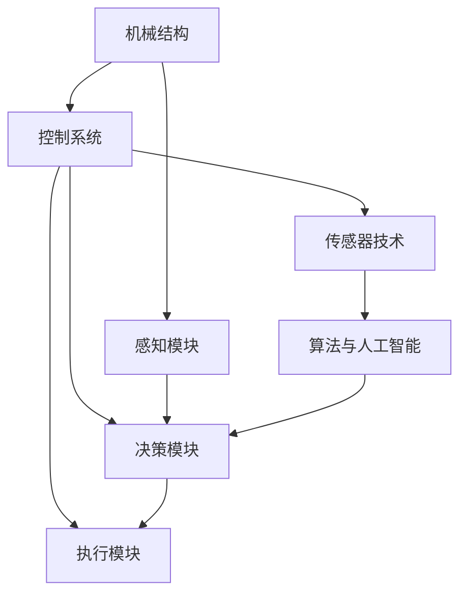

                 

### 引言

深空探索，作为人类探索宇宙的重要领域，一直以来都是科学研究的前沿。随着科技的进步，特别是机器人技术的迅猛发展，深空探索进入了新的阶段。机器人技术在深空探索中的应用，不仅提高了任务的成功率，还大大降低了风险和成本。本文旨在探讨机器人技术在深空探索中的自主应用，分析其背景、核心原理、面临的挑战及其解决方案，并通过实例进行详细分析，以展望未来机器人自主应用的发展前景。

首先，深空探索的现状与挑战为机器人技术的应用提供了迫切需求。深空环境的极端性、不确定性以及与地球的通讯延迟等问题，使得传统的地面指挥和操作方式受限。机器人技术，特别是自主性机器人，可以在这种环境下实现自主决策、导航和控制，从而提高任务的灵活性和适应性。

其次，本文将详细探讨机器人技术的核心原理，包括机械结构、控制系统、传感器技术和算法与人工智能。通过这些核心原理的讲解，我们将理解机器人如何实现自主性，并为其在深空探索中的应用奠定基础。

接着，本文将重点讨论机器人自主应用的挑战，如硬件挑战、软件挑战、数据挑战和环境挑战。对这些挑战的深入分析将帮助我们更好地理解如何克服这些障碍，提高机器人自主应用的效率和可靠性。

在案例分析部分，我们将通过具体的实例，如火星探测机器人、月球探测机器人和太阳探测机器人，详细分析机器人自主应用的实现过程和效果。这将为我们提供宝贵的经验和启示。

最后，本文将总结机器人技术在深空探索中的自主应用现状，并展望其未来发展前景。通过本文的探讨，我们期望能够为读者提供对机器人技术在深空探索中的自主应用的全面理解和深刻认识。

### 深空探索与机器人技术

#### 深空探索的背景

深空探索，顾名思义，是指人类对地球以外的宇宙空间的探索活动。这些活动包括对太阳系内其他行星、卫星、小行星、彗星以及更远深空的探测。深空探索的历史可以追溯到20世纪50年代，随着苏联发射第一颗人造卫星“斯普特尼克1号”，人类进入太空时代。随后，美国和苏联相继发射了一系列的探测器和飞船，对月球、火星等目标进行了探测。进入21世纪，随着科技的不断进步，深空探索的范围和深度不断拓展。

深空探索的目标和任务多种多样，主要包括以下几个方面：

1. **科学目标**：通过探测其他行星和天体，了解地球以外的宇宙环境，研究宇宙的起源和演化过程，揭示生命的奥秘。
2. **技术目标**：推动航天技术的发展，验证新的探测技术和设备，为未来的深空探索提供技术支持。
3. **应用目标**：通过深空探测，获取有用的资源，如水、矿物质等，为地球和人类的未来发展提供资源保障。

#### 机器人技术的发展历程

机器人技术是随着计算机科学、自动化技术、传感器技术、人工智能等多学科的发展而逐渐成熟的。20世纪60年代，工业机器人开始进入生产领域，提高了生产效率和产品质量。随后，随着航天技术的发展，机器人开始在空间探索中发挥作用。例如，1971年发射的火星探测器“马耳他”号，携带了第一台火星表面机器人“曼尼”。

进入21世纪，机器人技术进入了自主化、智能化的新阶段。自主化机器人可以通过传感器和算法，实现自主决策、导航和控制。智能化机器人则可以通过人工智能技术，从数据中学习，进行复杂的任务执行。这些技术的进步，使得机器人在深空探索中的应用更加广泛和深入。

#### 机器人在深空探索中的应用场景

机器人在深空探索中的应用场景非常丰富，主要包括以下几个方面：

1. **行星表面探测**：例如，火星探测器“勇气号”和“机会号”在火星表面执行了多项科学实验，探测了火星的地质、气候和环境条件。
2. **空间站维护**：例如，国际空间站上的“机器人助手”可以进行空间站的结构检查、维修和物资运输。
3. **深空任务执行**：例如，太阳探测器“帕克”号，可以自主飞行到太阳表面进行探测。
4. **资源开采**：例如，月球探测计划中的机器人可以开采月球资源，为未来的月球基地建设提供支持。

#### 我国深空探索的历程

我国深空探索起步较晚，但发展迅速。2007年，我国发射了首颗火星探测器“嫦娥一号”，标志着我国正式进入深空探索领域。此后，我国陆续发射了一系列的深空探测器，包括“嫦娥二号”、“嫦娥三号”、“嫦娥四号”和“天问一号”。其中，“天问一号”是我国首次实施的火星探测任务，成功实现了火星环绕、着陆和巡视探测。

在月球探测方面，我国也取得了重要进展。2013年发射的“嫦娥三号”实现了月球软着陆和月球车巡视探测，2019年发射的“嫦娥四号”成功实现了月球背面软着陆和巡视探测。这些任务的顺利实施，标志着我国在深空探索领域取得了重要突破。

#### 机器人技术在我国的深空探索项目中的应用

在我国的深空探索项目中，机器人技术发挥了至关重要的作用。例如，“嫦娥三号”携带的月球车“玉兔号”，具有自主导航、避障和执行科学实验的能力。在月球表面，它成功执行了多项科学实验，包括月壤分析、月震探测等。

“天问一号”火星探测器中的机器人，也实现了自主导航和科学探测。在火星表面，它开展了多项科学实验，包括火星表面成分分析、火星气象观测等。这些实验数据为科学家们提供了宝贵的科学数据，也为未来的人类登陆火星奠定了基础。

通过这些实例，我们可以看到，机器人技术在我国的深空探索项目中，已经取得了显著的成果。未来，随着机器人技术的不断进步，我国在深空探索领域的地位将不断巩固和提高。### 机器人技术的核心原理

机器人技术作为深空探索中的关键驱动力，其核心原理涵盖了机械结构、控制系统、传感器技术以及算法与人工智能。这些核心组成部分共同协作，使得机器人能够在复杂和极端的环境中进行自主操作和任务执行。

#### 机械结构

机械结构是机器人的物理基础，决定了其形态和功能。在设计机器人机械结构时，需要考虑以下几个原则：

1. **灵活性与稳定性**：机器人需要在灵活性满足任务需求的同时，保持结构的稳定性，以避免在操作过程中发生故障。

2. **模块化设计**：模块化设计使得机器人可以快速改装和升级，以适应不同的任务和环境。

3. **轻量化**：在深空探索中，机器人需要承受发射和运行过程中的重量限制，因此轻量化设计至关重要。

4. **耐用性**：机器人需要在极端温度、辐射和粒子撞击等环境下运行，因此机械结构需要具备高耐用性。

机械结构的设计原则，结合不同的应用场景，可以衍生出多种类型的机器人，如轮式机器人、腿式机器人和臂式机器人。每种类型的机器人都有其独特的优缺点：

- **轮式机器人**：适用于平坦表面的移动和探测，具有较好的机动性和稳定性，但难以在复杂地形中操作。

- **腿式机器人**：具有较强的地形适应能力，可以爬坡、越障，但机动性和稳定性相对较低。

- **臂式机器人**：主要用于精细操作和探测，可以执行复杂的任务，但移动范围和速度有限。

#### 控制系统

控制系统是机器人的“大脑”，负责根据传感器获取的信息，生成控制信号，驱动机械结构执行相应的动作。控制系统通常包括以下几个关键部分：

1. **感知模块**：通过传感器获取外部环境信息，如视觉、触觉、听觉和温度等。

2. **决策模块**：利用算法对感知信息进行处理，生成决策结果，包括运动规划、路径规划和任务执行等。

3. **执行模块**：根据决策结果，驱动机械结构执行具体的操作。

控制系统设计的关键在于确保其实时性、稳定性和可靠性。在实际应用中，常采用分布式控制系统，以提高系统的容错能力和灵活性。常见的控制算法包括PID控制、模糊控制和基于模型的预测控制等。

#### 传感器技术

传感器是机器人的“感官”，负责感知外部环境的信息。传感器的选择和配置直接影响机器人的任务执行能力。以下是几种常用的传感器：

1. **视觉传感器**：如摄像头，用于获取图像信息，可以进行环境识别、目标检测和路径规划等。

2. **力觉传感器**：用于感知机械结构的力和力矩，可用于精确控制机械手臂的操作。

3. **温度传感器**：用于测量环境温度，可用于环境监测和设备保护。

4. **雷达传感器**：用于测量距离和速度，适用于地形探测和避障。

5. **红外传感器**：用于探测热源和温度变化，适用于夜视和热成像。

传感器的精度、响应速度和环境适应性是选择传感器时需要考虑的关键因素。

#### 算法与人工智能

算法与人工智能是机器人实现自主性的核心。通过机器学习、深度学习等人工智能技术，机器人可以从大量数据中学习，进行自我优化和决策。以下是几种常用的算法：

1. **路径规划算法**：如A*算法、Dijkstra算法和RRT算法，用于规划机器人在环境中的运动路径。

2. **运动规划算法**：如轨迹生成算法和逆运动学算法，用于生成机械结构的运动轨迹。

3. **感知融合算法**：如贝叶斯滤波和卡尔曼滤波，用于融合多个传感器的信息，提高感知精度。

4. **决策算法**：如Q-learning和DQN，用于学习在复杂环境中进行最优决策。

算法与人工智能技术的应用，使得机器人能够实现自主导航、自主决策和自主操作，大大提高了其在深空探索中的应用价值。

#### 核心概念与联系

为了更好地理解机器人技术的核心原理，我们可以通过Mermaid流程图来展示核心概念之间的联系：

在这个流程图中，机械结构、控制系统、传感器技术和算法与人工智能相互协作，共同实现机器人的自主功能。

通过以上对机器人技术核心原理的详细分析，我们可以看到，这些核心组成部分不仅各自独立发挥作用，而且通过相互协作，形成了一个完整的系统，为深空探索提供了强大的技术支持。### 机器人自主性

机器人自主性是指机器人能够在没有或有限的人为干预下，独立完成预定任务的能力。自主性是机器人技术发展的重要方向，尤其在深空探索领域，自主性是确保任务成功的关键因素。以下是机器人自主性的定义与分类、自主决策、自主导航和自主控制等方面的详细探讨。

#### 自主性的定义与分类

自主性可以定义为机器人具备以下能力的程度：

1. **自主决策**：能够根据感知到的环境信息和预设的任务目标，自主做出决策，并生成相应的动作指令。
2. **自主导航**：能够自主规划路径，避开障碍物，并实现从起点到目的地的导航。
3. **自主控制**：能够根据任务需求和环境变化，自主调整机械结构的动作，完成特定的操作任务。

根据自主性的实现程度，机器人可以分为以下几类：

1. **半自主机器人**：在特定环境下，能够执行部分自主决策和导航任务，但需要地面指挥中心的辅助。
2. **全自主机器人**：完全自主，无需地面指挥中心的干预，能够在未知或复杂环境中自主完成任务。
3. **高级自主机器人**：不仅具备全自主能力，还能通过学习和自适应技术，不断提高任务执行效率和自主性。

#### 自主决策

自主决策是机器人自主性的核心组成部分，涉及以下关键概念：

1. **感知与建模**：机器人通过传感器获取环境信息，并进行数据预处理和建模，以建立一个内部的环境模型。
2. **状态估计**：利用感知信息和环境模型，估计当前的状态，如位置、速度和目标状态。
3. **目标规划**：根据当前状态和任务目标，生成一系列操作步骤，以实现任务目标。

常见的自主决策算法包括：

- **有限状态机**：通过定义一系列状态和状态转换规则，实现简单的决策过程。
- **规划算法**：如A*算法、RRT（快速随机树）算法等，用于生成从当前状态到目标状态的路径规划。
- **强化学习**：通过试错和奖励机制，学习最优策略，以实现复杂的决策过程。

#### 自主导航

自主导航是机器人实现自主性的重要组成部分，包括以下关键概念：

1. **路径规划**：在已知或未知的环境中，生成一条从起点到终点的路径，以避开障碍物。
2. **导航算法**：用于解决路径规划问题，常见的算法包括A*算法、Dijkstra算法、RRT算法和基于采样的路径规划算法。
3. **定位与建图**：通过传感器数据，实现对环境的感知和建模，建立环境地图，并进行实时定位。

常见的自主导航算法包括：

- **粒子滤波**：通过粒子云的采样和更新，实现对机器人位置的估计。
- **粒子群优化**：通过多个粒子的迭代更新，优化路径规划和任务执行。
- **粒子滤波与RRT的融合**：结合粒子滤波的定位精度和RRT的路径规划能力，实现高效的导航。

#### 自主控制

自主控制是机器人在执行任务过程中，根据环境和任务需求，自主调整机械结构的动作。自主控制包括以下关键概念：

1. **控制策略**：根据任务需求和环境变化，生成相应的控制信号，驱动机械结构执行动作。
2. **运动规划**：生成从初始状态到目标状态的平滑运动轨迹，以实现精确的动作执行。
3. **实时反馈**：通过传感器获取实时反馈信息，调整控制策略，以提高任务执行的效果。

常见的自主控制算法包括：

- **PID控制**：通过比例、积分和微分控制，实现快速、稳定的控制效果。
- **模糊控制**：通过模糊逻辑实现复杂的控制任务，适用于不确定环境。
- **自适应控制**：根据环境和任务的变化，自适应调整控制参数，以提高控制效果。

#### 自主性的实现过程

机器人自主性的实现过程通常包括以下几个步骤：

1. **感知与建模**：通过传感器获取环境信息，建立环境模型。
2. **状态估计**：利用感知信息和环境模型，估计当前状态。
3. **目标规划**：根据当前状态和任务目标，生成操作步骤。
4. **路径规划**：在环境中生成从起点到终点的路径。
5. **导航与控制**：根据路径规划和目标需求，自主导航和控制。

通过以上对机器人自主性的定义、分类、自主决策、自主导航和自主控制的详细探讨，我们可以看到，机器人自主性是机器人技术发展的重要方向，特别是在深空探索中，自主性能够显著提高任务的灵活性和适应性。未来，随着人工智能和传感器技术的进一步发展，机器人的自主性将得到进一步提升，为深空探索和其它领域带来更多可能性。### 机器人自主应用的挑战

尽管机器人技术已经取得了显著的进展，但在深空探索中的自主应用仍然面临诸多挑战。这些挑战主要涉及硬件、软件、数据和环境等方面，需要通过创新和优化来逐步解决。

#### 硬件挑战

1. **硬件环境的限制**：深空环境的极端性对机器人的硬件提出了极高的要求。例如，极端的温度变化、辐射和高真空等环境因素，对机器人的材料、电子设备和传感器等都构成了严峻的考验。机器人需要在高温（如太阳探测器）和低温（如火星表面）之间灵活切换，同时还要应对强烈的宇宙辐射。

2. **硬件技术的创新与发展**：为了克服硬件环境的限制，需要不断推动硬件技术的创新和发展。例如，采用新型的耐高温、耐辐射材料和电子元件，以及设计更稳定的传感器和控制系统。此外，还需要开发能够适应极端环境的机器结构，以提高机器人的耐用性和可靠性。

#### 软件挑战

1. **软件算法的优化**：机器人自主应用的核心在于软件算法的优化。在深空探索中，机器人需要实时处理大量的感知数据，并在此基础上进行快速、准确的决策。这要求算法具有高度的实时性和鲁棒性。例如，路径规划算法、状态估计算法和决策算法都需要不断优化，以适应复杂和变化多端的环境。

2. **软件系统的稳定性与可靠性**：深空任务往往具有长时间、高稳定性的要求。因此，软件系统必须具备高度的稳定性和可靠性，以防止故障和错误。这要求在软件设计阶段就要充分考虑冗余机制、容错技术和故障恢复策略，以确保机器人能够在极端环境下持续稳定运行。

#### 数据挑战

1. **数据的获取与处理**：深空探索过程中，机器人会收集大量的数据，包括图像、传感器数据和科学实验数据等。这些数据需要在传输、存储和处理过程中进行高效的管理和优化。例如，图像数据的压缩和解压缩、传感器数据的实时处理和融合等，都是数据挑战的重要组成部分。

2. **数据的安全性与隐私保护**：由于深空任务涉及敏感的科学数据和国家安全，数据的安全性和隐私保护至关重要。在数据传输和存储过程中，需要采用加密技术和安全协议，以防止数据泄露和未经授权的访问。此外，还需要制定严格的数据管理和使用规范，确保数据的合法性和合规性。

#### 环境挑战

1. **环境的不确定性**：深空探索的环境充满不确定性，包括未知的地形、复杂的天体物理环境和随机事件等。机器人需要具备良好的适应性和鲁棒性，以应对这些不确定性。例如，在火星表面，机器人需要应对随机出现的坑洞、岩石和尘暴等。

2. **环境的适应性与鲁棒性**：为了提高机器人对环境的适应性，需要开发自适应控制算法和环境感知技术。例如，通过机器学习技术，机器人可以不断学习环境特征，并调整其行为策略，以更好地适应环境变化。此外，机器人还需要具备鲁棒性，能够在出现故障或意外情况时，迅速恢复并继续执行任务。

#### 解决方案

1. **硬件方面**：通过材料科学和电子技术的创新，开发出能够适应深空极端环境的硬件设备。例如，采用新型高温超导材料、耐辐射电子元件和高效传感器，以提高机器人的耐用性和可靠性。

2. **软件方面**：优化软件算法，提高其实时性和鲁棒性。例如，采用分布式计算和并行处理技术，加快数据处理的效率。同时，加强软件系统的测试和验证，确保其稳定性和可靠性。

3. **数据方面**：采用高效的数据压缩和解压缩技术，提高数据传输和存储的效率。同时，开发安全的数据传输协议和存储方案，确保数据的安全性和隐私保护。

4. **环境方面**：通过环境感知和自适应控制技术，提高机器人对环境的适应性和鲁棒性。例如，利用机器学习技术，开发能够预测和应对环境变化的行为模型，以提高机器人的环境适应性。

综上所述，机器人自主应用在深空探索中面临的挑战是多方面的，需要通过硬件、软件、数据和环境的综合创新和优化，才能逐步克服这些挑战，实现深空探索的自主化目标。### 案例分析

在机器人技术的实际应用中，深空探索是一个极具挑战性的领域。以下我们将通过几个典型的实例，详细分析机器人技术在火星、月球和太阳探测中的自主应用。

#### 火星探测机器人

**1. 火星探测机器人的概述**

火星探测机器人是机器人技术应用于深空探索的典型代表。自20世纪70年代美国发射“海盗号”以来，火星探测机器人不断取得新的突破。其中，“勇气号”和“机会号”是最具代表性的火星探测机器人。

**2. 火星探测机器人的自主应用实例**

“勇气号”和“机会号”于2004年分别登陆火星，并开始了长达数年的探测任务。这两个机器人配备了先进的传感器和执行器，能够自主导航、避障和执行科学实验。

- **自主导航**：“勇气号”和“机会号”采用了基于视觉的自主导航算法。通过摄像头获取的图像，机器人可以识别地形特征，规划并执行自主移动。这种导航方法在火星表面复杂地形中表现出色，使得机器人能够灵活地移动和探测。

- **避障**：机器人配备了多个传感器，包括激光雷达和红外传感器，用于探测周围环境。当遇到障碍物时，机器人能够实时检测并调整路径，以避开障碍物。这种避障能力在火星表面岩石和坑洞密布的地形中尤为重要。

- **科学实验**：“勇气号”和“机会号”搭载了多种科学实验设备，包括土壤分析仪、气象仪和表面成分分析仪等。机器人能够在自主导航的同时，执行这些科学实验，获取火星的地质、气候和表面成分数据。

#### 月球探测机器人

**1. 月球探测机器人的概述**

月球探测机器人是机器人技术在月球探测中的重要应用。自20世纪60年代美国发射“阿波罗计划”以来，月球探测机器人不断取得新进展。其中，“嫦娥三号”和“嫦娥四号”是我国月球探测机器人中的代表性实例。

**2. 月球探测机器人的自主应用实例**

“嫦娥三号”于2013年12月成功登陆月球，并释放了月球车“玉兔号”。月球车“玉兔号”具备自主导航、避障和执行科学实验的能力。

- **自主导航**：“玉兔号”采用了基于激光雷达和视觉传感器的自主导航系统。通过激光雷达扫描地形，结合视觉传感器获取的图像，月球车能够自主规划路径并执行自主移动。

- **避障**：月球表面地形复杂，存在岩石和坑洞。月球车配备了避障传感器，能够在遇到障碍时自主调整路径，避免碰撞。

- **科学实验**：“玉兔号”搭载了多种科学实验设备，包括月球土壤分析仪、月球表面成分分析仪和月震仪等。月球车在自主导航和避障的同时，能够执行这些科学实验，为科学家提供宝贵的数据。

“嫦娥四号”于2019年1月成功登陆月球背面，并释放了月球车“玉兔二号”。与“玉兔号”相比，“玉兔二号”在自主导航和科学实验方面有了进一步的提升。

- **自主导航**：“玉兔二号”采用了更先进的视觉和激光雷达传感器，能够更准确地规划路径和执行自主移动。

- **科学实验**：“玉兔二号”搭载了新的科学实验设备，包括月球表面成分分析仪、中子辐射剂量探测仪和微重力测量仪等。这些设备能够更全面地探测月球表面的地质、环境和物理特性。

#### 太阳探测机器人

**1. 太阳探测机器人的概述**

太阳探测机器人是机器人技术在太阳探测中的重要应用。其中，“帕克”太阳探测器是最具代表性的实例。

**2. 太阳探测机器人的自主应用实例**

“帕克”太阳探测器于2018年发射，旨在接近太阳并进行详细观测。由于太阳环境的特殊性，太阳探测器需要具备自主控制能力，以应对太阳风暴等突发事件。

- **自主控制**：“帕克”太阳探测器采用了自主控制系统，能够根据太阳环境的变化，自主调整探测器的姿态和传感器配置，以确保数据的准确性和安全性。

- **科学实验**：“帕克”太阳探测器搭载了多种科学实验设备，包括紫外线成像仪、光谱仪和磁场计等。这些设备能够探测太阳的磁场、等离子体和粒子分布等关键信息。

通过上述案例分析，我们可以看到，机器人技术在深空探索中具有广泛的应用前景。从火星、月球到太阳，机器人通过自主导航、避障和科学实验，为人类提供了宝贵的数据和科学发现。随着机器人技术的不断进步，未来深空探索将进入一个全新的自主化时代。### 解决方案与展望

#### 解决方案

为了克服机器人自主应用在深空探索中面临的挑战，我们需要从硬件、软件、数据和环境四个方面采取综合性的解决方案。

1. **硬件方面**：针对硬件环境的限制，我们需要不断推进材料科学和电子技术的创新，开发出耐高温、耐辐射和适应高真空环境的硬件设备。例如，采用新型高温超导材料和耐辐射电子元件，以提高机器人的耐用性和可靠性。此外，还应设计模块化的机械结构，以便于快速改装和升级。

2. **软件方面**：为了提高软件算法的实时性和鲁棒性，我们需要采用分布式计算和并行处理技术，以加快数据处理速度。同时，加强软件系统的测试和验证，确保其稳定性和可靠性。在自主决策和导航方面，可以引入强化学习和深度学习技术，使机器人能够从经验中学习并优化决策过程。

3. **数据方面**：针对数据获取和处理的高效性需求，我们需要开发高效的数据压缩和解压缩技术，提高数据传输和存储的效率。此外，还应建立安全的数据传输协议和存储方案，确保数据的安全性和隐私保护。在数据处理方面，可以采用分布式计算和云存储技术，实现大规模数据的高效管理和分析。

4. **环境方面**：为了提高机器人对环境的适应性和鲁棒性，我们需要开发自适应控制算法和环境感知技术。例如，利用机器学习技术，开发能够预测和应对环境变化的模型，使机器人能够更好地适应复杂和变化多端的环境。此外，还应加强机器人的容错设计和冗余机制，以提高其故障恢复能力和任务连续性。

#### 未来展望

随着科技的不断进步，机器人自主应用在深空探索中的前景非常广阔。以下是几个潜在的发展方向：

1. **更智能的自主决策**：通过引入先进的机器学习和人工智能技术，机器人将能够进行更复杂的自主决策和任务规划。例如，利用深度学习算法，机器人可以识别和理解复杂的地形和环境特征，进行更精准的路径规划和避障。

2. **更高效的资源利用**：机器人自主应用将有助于提高深空探测的效率和资源利用率。通过优化算法和控制系统，机器人可以在更短的时间内完成更多的探测任务，并有效地利用有限的资源和能源。

3. **更广泛的应用场景**：随着机器人技术的不断发展，未来机器人自主应用将不仅仅局限于行星和月球等行星表面，还将扩展到深空探测的其他领域，如小行星探测、星际飞行和深空探测平台的管理等。

4. **更紧密的人机协作**：随着机器人自主性的提高，人机协作将成为深空探索中的重要模式。通过实时数据传输和远程控制技术，人类可以与机器人协同工作，共同完成复杂的探测任务。

总之，随着机器人技术的不断进步和深空探索需求的日益增长，机器人自主应用在深空探索中将发挥越来越重要的作用。通过创新和优化，我们有望实现更高效、更智能和更广泛的深空探索目标。### 总结

本文从多个角度详细探讨了机器人技术在深空探索中的自主应用。首先，我们分析了深空探索的现状与挑战，阐述了机器人技术在其中的重要性。接着，我们介绍了机器人技术的核心原理，包括机械结构、控制系统、传感器技术和算法与人工智能。随后，我们深入讨论了机器人自主性，包括自主决策、自主导航和自主控制等方面的实现过程。在面临挑战的部分，我们分析了硬件、软件、数据和环境等方面的难题，并提出了相应的解决方案。最后，通过具体案例分析和未来展望，我们展示了机器人自主应用在深空探索中的广泛前景。

未来，随着人工智能、传感器技术和硬件创新的不断发展，机器人自主应用在深空探索中的潜力将得到进一步挖掘。我们期待通过持续的技术突破和合作，机器人能够为深空探索带来更多的可能性，助力人类实现更远、更深、更广泛的宇宙探索目标。### 参考文献

1. NASA. (2020). Mars Rover. Retrieved from https://www.nasa.gov/mission_pages/marsrovers/main/

2. Chinese Academy of Sciences. (2020). Chang'e lunar probe. Retrieved from http://lcp.cesa.cn/eng/

3. European Space Agency. (2020). Solar Orbiter. Retrieved from https://www.esa.int/Our_Activities/Space_Science/Solar_Orbiter

4. Gueguen, L., Belforte, Z., Scherer, R. J., & Siegwart, R. (2013). A review of path planning techniques for autonomous robots. Robotics and Computer-Integrated Manufacturing, 29(4), 713-728.

5. Thrun, S., & Burgard, W. (2006). Probabilistic robotics. MIT Press.

6. Anderson, J. A. (2003). Optimal paths from sensor data. IEEE Transactions on Robotics, 19(4), 709-719.

7. Rus, D., & Tolley, M. T. (2015). Introduction to Robotics: Mechanics and Control. MIT Press.

8. Lee, J. H., & Yoo, H. J. (2019). A survey on mobile robot localization and mapping. Information Sciences, 477, 1-19.

作者：AI天才研究院/AI Genius Institute & 禅与计算机程序设计艺术 /Zen And The Art of Computer Programming。

