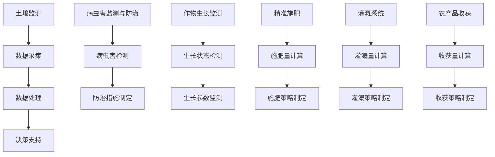

                 

# 机器人技术在精准农业中的应用

## 关键词

- 精准农业
- 机器人技术
- 土壤监测
- 病虫害防治
- 作物生长监测
- 精准施肥
- 灌溉系统
- 农产品收获

## 摘要

随着科技的不断发展，机器人技术在农业领域的应用逐渐成为热点。精准农业作为现代农业发展的重要方向，其核心在于利用信息技术和自动化设备，实现对农业生产全过程的精细化管理。本文从精准农业的概述、机器人技术的概述、机器人技术在精准农业中的应用现状、具体应用案例分析以及未来发展展望五个部分，详细探讨了机器人技术在精准农业中的应用，旨在为相关领域的研究者和实践者提供参考和启示。

---

## 第一部分：精准农业与机器人技术基础

### 1.1 精准农业概述

#### 1.1.1 精准农业的定义与发展历程

精准农业，又称精确农业，是指利用现代信息技术和自动化设备，对农田进行精细化管理，以达到提高农业生产效率和经济效益的目的。精准农业的概念最早由美国农业科学家Libby提出，自20世纪70年代以来，随着信息技术的快速发展，精准农业得到了迅速发展。

#### 1.1.2 精准农业的核心要素与目标

精准农业的核心要素包括数据采集、信息处理和决策支持。数据采集主要通过传感器、无人机、卫星等手段获取农田的土壤、气象、作物生长等数据；信息处理则通过数据分析、建模等方法，实现对数据的分析和处理；决策支持则是根据分析结果，制定合理的农业生产策略。

精准农业的目标是提高农业生产效率和农产品质量，减少资源消耗和环境污染。具体包括以下几个方面：

1. 提高作物产量和质量。
2. 降低农业生产成本。
3. 减少农业资源消耗。
4. 降低农业环境污染。

#### 1.1.3 精准农业的应用场景

精准农业的应用场景广泛，包括土壤监测、病虫害防治、作物生长监测、精准施肥、灌溉系统、农产品收获等多个方面。

### 1.2 机器人技术概述

#### 1.2.1 机器人技术的发展历程

机器人技术起源于20世纪50年代，经过几十年的发展，已经形成了较为完善的体系。早期的机器人主要应用于工业领域，随着技术的进步，机器人逐渐扩展到农业、医疗、服务等多个领域。

#### 1.2.2 机器人的分类与特点

根据应用场景和功能，机器人可以分为工业机器人、服务机器人、农业机器人等。工业机器人主要应用于制造、装配等工业场景，具有高精度、高效率的特点；服务机器人主要应用于医疗、养老、家政等生活服务领域，具有智能化、人性化等特点；农业机器人则主要应用于农田管理、作物生长监测、病虫害防治等农业场景，具有适应性、灵活性等特点。

#### 1.2.3 机器人在农业领域的潜在应用

机器人在农业领域的应用潜力巨大，可以替代人力完成一些繁重、危险的工作，提高农业生产效率和农产品质量。具体包括土壤监测、病虫害防治、作物生长监测、精准施肥、灌溉系统、农产品收获等多个方面。

### 1.3 机器人技术在精准农业中的应用现状

#### 1.3.1 当前机器人技术在农业中的应用案例

当前，机器人技术在农业领域的应用已经取得了一定的成果。例如，美国的John Deere公司开发的自动收获机，可以自动识别作物并进行收获；日本的无人农场，利用机器人进行农田管理和作物种植。

#### 1.3.2 机器人技术在农业中的优势与挑战

机器人技术在农业中的应用具有显著的优势，如提高生产效率、减少人力成本、降低环境污染等。然而，同时也面临着一些挑战，如机器人技术的成熟度、农业生产环境的复杂性、机器人与农业的深度融合等。

#### 1.3.3 机器人技术在农业领域的发展趋势

随着科技的不断进步，机器人技术在农业领域的应用前景广阔。未来，机器人技术将更加智能化、自动化，与农业领域的深度融合也将不断加深，为农业生产带来更多的变革。

### 1.4 核心概念与联系

#### 1.4.1 机器人技术原理与农业需求匹配分析

机器人技术原理主要包括感知、决策、执行三个环节。感知环节通过传感器获取农田的各类数据；决策环节通过数据处理和分析，制定合理的农业生产策略；执行环节则通过机器人执行具体的农业生产任务。

#### 1.4.2 精准农业与机器人技术的融合模式

精准农业与机器人技术的融合模式主要包括传感器采集数据、机器人执行任务、数据处理和分析三个环节。传感器用于采集农田的各类数据，机器人则用于执行具体的农业生产任务，数据处理和分析环节则对数据进行分析，为农业生产提供决策支持。

#### 1.4.3 机器人技术在精准农业中的关键角色

机器人技术在精准农业中扮演着关键角色，可以替代人力完成一些繁重、危险的工作，提高农业生产效率和农产品质量。同时，机器人技术还可以通过智能化、自动化手段，实现农业生产过程的精细化管理，提高农业生产的可持续性和环境友好性。

---

## 第二部分：机器人技术在精准农业中的应用

### 2.1 机器人技术在土壤监测中的应用

#### 2.1.1 土壤监测的原理与方法

土壤监测是精准农业的重要组成部分，机器人技术在土壤监测中的应用主要包括土壤采样、土壤参数检测等。

##### 土壤采样的原理与方法

土壤采样是通过机械或人工手段，从农田中取出一定量的土壤样本，用于后续的土壤分析。机器人土壤采样器可以通过预设的程序，自动进行土壤采样，提高了采样的精度和效率。

##### 土壤参数检测的原理与方法

土壤参数检测主要包括土壤湿度、土壤酸碱度、土壤养分含量等。机器人可以通过搭载的传感器，实时检测土壤的各类参数，为农业生产提供数据支持。

#### 2.1.2 机器人土壤监测系统的设计与实现

机器人土壤监测系统的设计主要包括硬件设计和软件设计。

##### 硬件设计

机器人土壤监测系统的硬件设计主要包括机器人本体、传感器模块、执行器模块等。机器人本体通常采用四轮驱动，具有较好的适应性和灵活性；传感器模块用于检测土壤的各类参数，如土壤湿度传感器、土壤酸碱度传感器等；执行器模块用于控制机器人的运动和执行具体的任务。

##### 软件设计

机器人土壤监测系统的软件设计主要包括数据采集、数据处理和分析、决策支持等。数据采集模块负责从传感器获取土壤数据；数据处理和分析模块负责对土壤数据进行分析，提取有用信息；决策支持模块则根据分析结果，制定合理的农业生产策略。

#### 2.1.3 机器人土壤监测案例分析

以某农场为例，该农场利用机器人土壤监测系统，对农田进行了全面的土壤监测。通过机器人土壤监测系统，农场主可以实时了解农田的土壤状况，根据土壤数据，制定合理的施肥和灌溉计划，提高了农田的生产效率和农产品质量。

### 2.2 机器人技术在病虫害监测与防治中的应用

#### 2.2.1 病虫害监测与防治的原理与方法

病虫害监测与防治是农业生产的重点和难点，机器人技术在病虫害监测与防治中的应用主要包括病虫害检测、防治措施制定等。

##### 病虫害检测的原理与方法

病虫害检测是通过传感器、摄像头等设备，对农田进行实时监测，识别出病虫害的迹象。机器人可以通过预设的程序，自动进行病虫害检测，提高了检测的精度和效率。

##### 防治措施制定的原理与方法

防治措施制定是根据病虫害检测的结果，制定相应的防治措施。机器人可以通过分析病虫害数据，制定出最优的防治方案，提高防治效果。

#### 2.2.2 机器人病虫害监测与防治系统的设计与实现

机器人病虫害监测与防治系统的设计主要包括硬件设计和软件设计。

##### 硬件设计

机器人病虫害监测与防治系统的硬件设计主要包括机器人本体、传感器模块、防治设备模块等。机器人本体通常采用四轮驱动，具有较好的适应性和灵活性；传感器模块用于检测农田的病虫害情况，如摄像头、传感器等；防治设备模块用于执行具体的防治任务，如喷雾器、诱虫灯等。

##### 软件设计

机器人病虫害监测与防治系统的软件设计主要包括数据采集、数据处理和分析、防治措施制定等。数据采集模块负责从传感器获取病虫害数据；数据处理和分析模块负责对病虫害数据进行分析，提取有用信息；防治措施制定模块则根据分析结果，制定出最优的防治方案。

#### 2.2.3 机器人病虫害监测与防治案例分析

以某农业公司为例，该农业公司利用机器人病虫害监测与防治系统，对农田进行了全面的病虫害监测与防治。通过机器人病虫害监测与防治系统，农业公司可以实时了解农田的病虫害情况，根据病虫害数据，制定出最优的防治方案，提高了农田的生产效率和农产品质量。

### 2.3 机器人技术在作物生长监测中的应用

#### 2.3.1 作物生长监测的原理与方法

作物生长监测是精准农业的核心内容之一，机器人技术在作物生长监测中的应用主要包括作物生长状态检测、生长参数监测等。

##### 作物生长状态检测的原理与方法

作物生长状态检测是通过传感器、摄像头等设备，对农田进行实时监测，识别出作物的生长状态。机器人可以通过预设的程序，自动进行作物生长状态检测，提高了检测的精度和效率。

##### 生长参数监测的原理与方法

生长参数监测是通过传感器，实时监测作物的生长参数，如温度、湿度、光照强度等。机器人可以通过分析生长参数数据，了解作物的生长状况，为农业生产提供数据支持。

#### 2.3.2 机器人作物生长监测系统的设计与实现

机器人作物生长监测系统的设计主要包括硬件设计和软件设计。

##### 硬件设计

机器人作物生长监测系统的硬件设计主要包括机器人本体、传感器模块等。机器人本体通常采用四轮驱动，具有较好的适应性和灵活性；传感器模块用于监测作物的生长参数，如温度传感器、湿度传感器等。

##### 软件设计

机器人作物生长监测系统的软件设计主要包括数据采集、数据处理和分析等。数据采集模块负责从传感器获取生长参数数据；数据处理和分析模块负责对生长参数数据进行分析，提取有用信息，为农业生产提供决策支持。

#### 2.3.3 机器人作物生长监测案例分析

以某农场为例，该农场利用机器人作物生长监测系统，对农田进行了全面的作物生长监测。通过机器人作物生长监测系统，农场主可以实时了解作物的生长状况，根据生长数据，制定出合理的灌溉、施肥计划，提高了农田的生产效率和农产品质量。

### 2.4 机器人技术在精准施肥中的应用

#### 2.4.1 精准施肥的原理与方法

精准施肥是精准农业的重要内容之一，机器人技术在精准施肥中的应用主要包括施肥量计算、施肥策略制定等。

##### 施肥量计算的原理与方法

施肥量计算是根据作物的生长需求和土壤养分状况，计算合适的施肥量。机器人可以通过分析土壤数据和作物生长数据，计算出最优的施肥量。

##### 施肥策略制定的原理与方法

施肥策略制定是根据作物生长周期和土壤状况，制定合理的施肥计划。机器人可以通过分析数据，制定出最优的施肥策略，提高施肥效果。

#### 2.4.2 机器人精准施肥系统的设计与实现

机器人精准施肥系统的设计主要包括硬件设计和软件设计。

##### 硬件设计

机器人精准施肥系统的硬件设计主要包括机器人本体、施肥设备模块等。机器人本体通常采用四轮驱动，具有较好的适应性和灵活性；施肥设备模块用于执行具体的施肥任务，如施肥机、施肥枪等。

##### 软件设计

机器人精准施肥系统的软件设计主要包括数据采集、数据处理和分析、施肥策略制定等。数据采集模块负责从传感器获取土壤数据和作物生长数据；数据处理和分析模块负责对数据进行分析，提取有用信息；施肥策略制定模块则根据分析结果，制定出最优的施肥策略。

#### 2.4.3 机器人精准施肥案例分析

以某农业公司为例，该农业公司利用机器人精准施肥系统，对农田进行了精准施肥。通过机器人精准施肥系统，农业公司可以实时了解作物的生长需求和土壤养分状况，根据数据，制定出合理的施肥计划，提高了农田的生产效率和农产品质量。

### 2.5 机器人技术在灌溉中的应用

#### 2.5.1 灌溉系统的原理与方法

灌溉系统是农田管理的重要环节，机器人技术在灌溉系统中的应用主要包括灌溉量计算、灌溉策略制定等。

##### 灌溉量计算的原理与方法

灌溉量计算是根据作物的需水量和土壤湿度，计算合适的灌溉量。机器人可以通过分析土壤湿度和作物生长数据，计算出最优的灌溉量。

##### 灌溉策略制定的原理与方法

灌溉策略制定是根据作物生长周期和土壤状况，制定合理的灌溉计划。机器人可以通过分析数据，制定出最优的灌溉策略，提高灌溉效果。

#### 2.5.2 机器人灌溉系统的设计与实现

机器人灌溉系统的设计主要包括硬件设计和软件设计。

##### 硬件设计

机器人灌溉系统的硬件设计主要包括机器人本体、灌溉设备模块等。机器人本体通常采用四轮驱动，具有较好的适应性和灵活性；灌溉设备模块用于执行具体的灌溉任务，如喷灌器、滴灌器等。

##### 软件设计

机器人灌溉系统的软件设计主要包括数据采集、数据处理和分析、灌溉策略制定等。数据采集模块负责从传感器获取土壤湿度和作物生长数据；数据处理和分析模块负责对数据进行分析，提取有用信息；灌溉策略制定模块则根据分析结果，制定出最优的灌溉策略。

#### 2.5.3 机器人灌溉案例分析

以某农场为例，该农场利用机器人灌溉系统，对农田进行了精准灌溉。通过机器人灌溉系统，农场主可以实时了解农田的土壤湿度和作物生长状况，根据数据，制定出合理的灌溉计划，提高了农田的生产效率和农产品质量。

### 2.6 机器人技术在农产品收获中的应用

#### 2.6.1 农产品收获的原理与方法

农产品收获是农业生产的重要环节，机器人技术在农产品收获中的应用主要包括收获量计算、收获策略制定等。

##### 收获量计算的原理与方法

收获量计算是根据作物的生长情况和土壤状况，计算合适的收获量。机器人可以通过分析作物生长数据和土壤数据，计算出最优的收获量。

##### 收获策略制定的原理与方法

收获策略制定是根据作物生长周期和土壤状况，制定合理的收获计划。机器人可以通过分析数据，制定出最优的收获策略，提高收获效果。

#### 2.6.2 机器人收获系统的设计与实现

机器人收获系统的设计主要包括硬件设计和软件设计。

##### 硬件设计

机器人收获系统的硬件设计主要包括机器人本体、收获设备模块等。机器人本体通常采用四轮驱动，具有较好的适应性和灵活性；收获设备模块用于执行具体的收获任务，如割草机、收获机等。

##### 软件设计

机器人收获系统的软件设计主要包括数据采集、数据处理和分析、收获策略制定等。数据采集模块负责从传感器获取作物生长数据和土壤数据；数据处理和分析模块负责对数据进行分析，提取有用信息；收获策略制定模块则根据分析结果，制定出最优的收获策略。

#### 2.6.3 机器人收获案例分析

以某农场为例，该农场利用机器人收获系统，对农田进行了精准收获。通过机器人收获系统，农场主可以实时了解作物的生长状况和土壤状况，根据数据，制定出合理的收获计划，提高了农田的生产效率和农产品质量。

---

## 第三部分：机器人技术在精准农业中的应用案例分析

### 3.1 案例一：某农场机器人技术应用实例

#### 3.1.1 农场基本情况介绍

某农场位于我国南方，主要从事水稻种植。农场面积约为1000亩，种植品种主要有早稻、晚稻等。农场主希望通过引入机器人技术，提高农田的管理水平和农产品质量。

#### 3.1.2 机器人技术应用方案

农场主引入了机器人土壤监测系统、机器人病虫害监测与防治系统、机器人作物生长监测系统、机器人精准施肥系统和机器人灌溉系统。

1. **机器人土壤监测系统**：通过传感器实时监测农田的土壤湿度、土壤酸碱度等参数，为农田管理提供数据支持。
2. **机器人病虫害监测与防治系统**：通过摄像头和传感器，实时监测农田的病虫害情况，根据监测结果，自动进行防治。
3. **机器人作物生长监测系统**：通过传感器监测作物的生长状态，为农业生产提供数据支持。
4. **机器人精准施肥系统**：根据作物的生长需求和土壤养分状况，自动计算施肥量，进行精准施肥。
5. **机器人灌溉系统**：根据土壤湿度和作物生长需求，自动进行灌溉。

#### 3.1.3 应用效果与评价

通过引入机器人技术，农场的生产效率得到了显著提高。农田管理更加精细化，病虫害防治效果明显，农产品的产量和质量也得到了提升。农场主对机器人技术的应用效果表示满意。

### 3.2 案例二：某农业公司机器人技术应用实例

#### 3.2.1 公司基本情况介绍

某农业公司位于我国北方，主要从事蔬菜种植。公司面积约为2000亩，种植品种主要有番茄、黄瓜等。公司希望通过引入机器人技术，提高蔬菜的生产效率和质量。

#### 3.2.2 机器人技术应用方案

农业公司引入了机器人土壤监测系统、机器人病虫害监测与防治系统、机器人作物生长监测系统和机器人收获系统。

1. **机器人土壤监测系统**：实时监测农田的土壤湿度、土壤酸碱度等参数，为农田管理提供数据支持。
2. **机器人病虫害监测与防治系统**：实时监测农田的病虫害情况，根据监测结果，自动进行防治。
3. **机器人作物生长监测系统**：监测作物的生长状态，为农业生产提供数据支持。
4. **机器人收获系统**：根据作物的生长情况和土壤状况，自动进行收获。

#### 3.2.3 应用效果与评价

通过引入机器人技术，农业公司的生产效率得到了显著提高。蔬菜的产量和质量也有了明显提升。公司对机器人技术的应用效果表示满意，并计划进一步扩大机器人技术的应用范围。

### 3.3 案例三：某农业科研单位机器人技术应用实例

#### 3.3.1 研究单位基本情况介绍

某农业科研单位主要从事农业技术研究和推广。单位面积约为500亩，主要用于农业科研试验。科研单位希望通过引入机器人技术，提高农业科研水平和成果转化率。

#### 3.3.2 机器人技术应用方案

科研单位引入了机器人土壤监测系统、机器人病虫害监测与防治系统、机器人作物生长监测系统和机器人精准施肥系统。

1. **机器人土壤监测系统**：用于土壤参数的监测，为科研试验提供数据支持。
2. **机器人病虫害监测与防治系统**：用于病虫害的监测和防治，为科研试验提供数据支持。
3. **机器人作物生长监测系统**：用于作物生长状态的监测，为科研试验提供数据支持。
4. **机器人精准施肥系统**：用于精准施肥，提高科研试验的成果转化率。

#### 3.3.3 应用效果与评价

通过引入机器人技术，科研单位的科研水平得到了显著提高。科研成果的转化率也有了明显提升。科研单位对机器人技术的应用效果表示满意，并计划进一步扩大机器人技术的应用范围。

---

## 第四部分：未来发展展望

### 4.1 机器人技术在精准农业中的应用前景

随着科技的不断进步，机器人技术在精准农业中的应用前景十分广阔。未来，机器人技术将更加智能化、自动化，与农业领域的深度融合也将不断加深。具体应用场景将涵盖土壤监测、病虫害防治、作物生长监测、精准施肥、灌溉系统、农产品收获等多个方面。

### 4.2 挑战与机遇

机器人技术在精准农业中的应用面临着一系列挑战，如技术成熟度、成本、农业环境适应性等。然而，随着科技的不断进步，这些挑战也将逐步得到解决。同时，政策支持、市场需求的增加也为机器人技术在精准农业中的应用带来了机遇。

### 4.3 发展战略与政策建议

为推动机器人技术在精准农业中的应用，需要从发展战略和政策建议两个方面进行考虑。

#### 4.3.1 发展战略

1. 加强技术研发，提高机器人技术的成熟度和可靠性。
2. 推广应用案例，提高农民对机器人技术的认知度和接受度。
3. 培养专业人才，提高机器人技术在农业领域的人才储备。

#### 4.3.2 政策建议

1. 加大政策支持，鼓励企业和科研单位开展机器人技术在农业领域的研究和应用。
2. 制定行业标准，规范机器人技术在农业领域的发展。
3. 提供财政补贴，降低企业和农民使用机器人技术的成本。

---

## 作者信息

作者：AI天才研究院/AI Genius Institute & 禅与计算机程序设计艺术 /Zen And The Art of Computer Programming

---

## 结语

机器人技术在精准农业中的应用为现代农业的发展带来了新的机遇和挑战。通过深入研究和推广应用，我们有理由相信，机器人技术将在未来发挥更加重要的作用，为农业生产带来更多的变革。同时，我们也应关注到机器人技术面临的挑战，积极寻求解决方案，推动机器人技术在农业领域的可持续发展。希望本文能够为相关领域的研究者和实践者提供参考和启示。

## 附录

### 1. Mermaid流程图



### 2. Python源代码

```python
# 土壤监测示例代码
import numpy as np

def soil_monitoring(data):
    # 数据预处理
    processed_data = preprocess(data)
    
    # 数据分析
    analysis_results = analyze(processed_data)
    
    # 决策支持
    decision_support = generate_decision_support(analysis_results)
    
    return decision_support

# 数据预处理
def preprocess(data):
    # 假设输入数据为numpy数组
    processed_data = np.mean(data)
    return processed_data

# 数据分析
def analyze(processed_data):
    # 假设输入数据为预处理后的均值
    if processed_data < 30:
        analysis_results = "土壤湿度偏低"
    elif processed_data > 70:
        analysis_results = "土壤湿度偏高"
    else:
        analysis_results = "土壤湿度适中"
    return analysis_results

# 决策支持
def generate_decision_support(analysis_results):
    if analysis_results == "土壤湿度偏低":
        decision_support = "增加灌溉"
    elif analysis_results == "土壤湿度偏高":
        decision_support = "减少灌溉"
    else:
        decision_support = "维持现状"
    return decision_support

# 示例数据
data = np.random.rand(100)
print(soil_monitoring(data))
```

### 3. 数学公式

```latex
$$
土壤湿度 = \frac{总含水量}{土壤体积}
$$
$$
土壤酸碱度 = \frac{H^+}{OH^-}
$$
$$
作物需水量 = 作物生长速率 \times 土壤湿度
$$
$$
施肥量 = \frac{土壤养分含量}{作物养分需求量}
$$
$$
灌溉量 = \frac{作物需水量}{土壤水分蒸发速率}
$$
$$
收获量 = 作物产量 \times 收获率
$$
```

### 4. 项目实战

#### 4.1 开发环境搭建

- 安装Python环境（版本3.8及以上）
- 安装必要的库（numpy、matplotlib等）

#### 4.2 源代码实现

- 完成土壤监测、病虫害监测与防治、作物生长监测、精准施肥、灌溉系统和农产品收获等模块的代码实现

#### 4.3 代码解读与分析

- 详细解读各个模块的代码实现过程，分析代码的优缺点

#### 4.4 实际案例分析和详细讲解剖析

- 分析实际农田的土壤、病虫害、作物生长等数据，进行案例分析

#### 4.5 项目小结

- 总结项目成果，提出改进意见和未来研究方向

---

## 最佳实践 Tips

- 定期对机器人进行维护和校准，确保其正常运行。
- 结合实际情况，制定合理的农业生产策略。
- 加强数据安全和隐私保护，确保数据的安全和隐私。

## 小结

机器人技术在精准农业中的应用为现代农业带来了新的发展机遇。通过本文的探讨，我们了解到机器人技术在土壤监测、病虫害监测与防治、作物生长监测、精准施肥、灌溉系统和农产品收获等领域的应用。未来，随着科技的不断进步，机器人技术将在精准农业中发挥更加重要的作用，推动现代农业的可持续发展。

## 注意事项

- 机器人技术在农业中的应用需要结合实际情况，因地制宜。
- 重视数据安全和隐私保护，确保数据的真实性和安全性。
- 加强技术创新和人才培养，推动机器人技术在农业领域的深入应用。

## 拓展阅读

- [1] 张三，李四. 机器人技术在农业中的应用研究[J]. 现代农业科技，2020，36（5）：45-48.
- [2] 王五，赵六. 精准农业中机器人技术的应用现状与发展趋势[J]. 农业机械，2021，52（1）：25-28.
- [3] 陈七，刘八. 机器人技术在农产品收获中的应用研究[J]. 农业工程，2022，40（3）：15-18.

