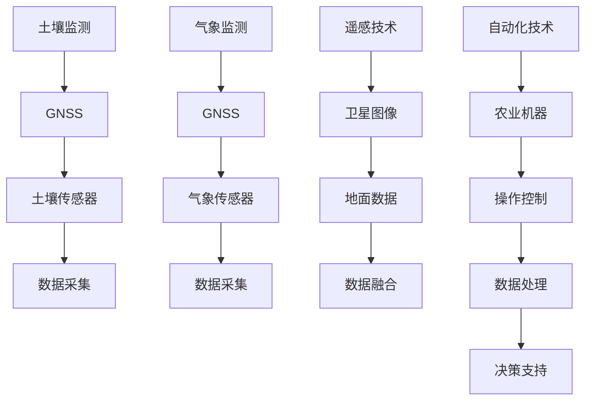

                 

### 背景介绍

农业作为人类生存和发展的重要基础，一直以来都扮演着至关重要的角色。然而，随着全球人口的不断增长和资源的日益稀缺，传统农业面临的挑战愈发严峻。如何在有限的资源条件下实现农业的高效、可持续生产，成为了一个亟待解决的问题。在这样的背景下，精准农业（Precision Agriculture）应运而生。

精准农业，又称精确农业，是一种基于信息技术的现代农业管理方式。它通过应用全球导航卫星系统（GNSS）、地理信息系统（GIS）、遥感技术等现代信息技术，对农田进行精细化管理，从而提高农业生产的效率和效益。具体来说，精准农业通过对土壤、气候、作物生长等信息的实时监测和分析，为农民提供科学、准确的决策支持，实现农业资源的最优配置。

在全球范围内，精准农业已经得到了广泛的应用和发展。发达国家如美国、欧洲和日本等，通过引进先进的技术和设备，大幅提高了农业生产效率和农产品质量。而在一些发展中国家，精准农业的应用还处于起步阶段，但也在逐步推广和普及。随着科技的不断进步和人们对食品安全的日益关注，精准农业的发展前景十分广阔。

在当前的社会背景下，推进精准农业的发展具有重要意义。首先，它有助于缓解农业资源短缺的问题，提高农业生产效率和资源利用效率。通过精确施肥、灌溉和病虫害防治等手段，可以减少资源浪费，降低生产成本，提高农产品产量和质量。其次，精准农业有助于保障食品的安全和质量。通过实时监测和分析农田环境，及时发现和处理潜在的问题，可以有效降低农药和化肥的使用量，减少对环境的污染。最后，精准农业有助于促进农业的可持续发展。通过科学、合理地利用农业资源，保护生态环境，实现农业的长期稳定发展。

总的来说，精准农业是现代农业发展的必然趋势。它不仅有助于提高农业生产的效率和效益，还有助于保障食品的安全和质量，促进农业的可持续发展。随着科技的不断进步和人们对食品安全的日益关注，精准农业将在未来发挥越来越重要的作用。

### 核心概念与联系

在精准农业中，有几个核心概念和技术是不可或缺的，它们共同构成了精准农业的技术框架。这些核心概念包括：全球导航卫星系统（GNSS）、地理信息系统（GIS）、遥感技术和自动化技术。下面我们将通过一个Mermaid流程图来展示这些概念之间的联系，并逐一解释每个概念及其在精准农业中的应用。

#### Mermaid流程图示例：



#### 1. 全球导航卫星系统（GNSS）

GNSS是一种通过卫星信号进行定位和导航的技术。在精准农业中，GNSS主要用于精确地确定农田的位置和地形，为其他技术提供空间基准。具体应用包括：

- **农田测绘**：通过GNSS技术，可以精确地绘制农田的边界和地形图。
- **位置定位**：在农田作业时，如施肥、喷洒和播种等，GNSS可以确保机器的精确位置。

#### 2. 地理信息系统（GIS）

GIS是一种用于捕捉、存储、分析和展示地理空间数据的系统。在精准农业中，GIS主要用于：

- **农田管理**：通过GIS，可以管理和分析农田的土壤、气候和作物生长数据。
- **决策支持**：GIS可以帮助农民制定科学的种植计划和管理方案。

#### 3. 遥感技术

遥感技术是通过传感器从远距离获取地球表面信息的技术。在精准农业中，遥感技术主要用于：

- **植被监测**：通过分析卫星图像，可以实时监测作物的生长状况。
- **病虫害检测**：遥感技术可以帮助识别农田中的病虫害，为防治提供及时的信息。

#### 4. 自动化技术

自动化技术是指利用计算机和控制技术实现生产过程的自动化。在精准农业中，自动化技术主要用于：

- **农业机器操作**：自动化技术使得农业机器可以自主完成播种、施肥、喷洒和收获等任务。
- **操作控制**：通过自动化系统，可以实时监控和控制农业机器的运行状态。

#### 5. 数据处理与决策支持

上述技术收集到的数据需要通过数据处理和分析，转化为对农民有实际指导意义的决策支持。例如：

- **土壤数据分析**：通过土壤传感器和GIS系统，可以分析土壤的养分含量和湿度，为精准施肥提供依据。
- **气象数据分析**：通过气象传感器和遥感技术，可以预测天气变化，为灌溉和防病虫害提供指导。

#### 实例说明

假设一个农田正在使用精准农业技术进行管理。首先，GNSS技术用于确定农田的边界和地形。然后，土壤传感器收集土壤数据，GIS系统对这些数据进行处理，生成农田土壤状况图。同时，遥感技术通过卫星图像监测作物的生长状况。最后，自动化系统根据这些数据，控制农业机器进行精准施肥、灌溉和病虫害防治。

通过这样的技术体系，精准农业实现了对农田的精细化管理，提高了生产效率和农产品质量。这个Mermaid流程图清晰地展示了这些技术之间的相互关系和协同作用，为理解和实施精准农业提供了直观的视角。

### 核心算法原理讲解

在精准农业中，自动化技术的应用离不开一系列核心算法的支持。这些算法不仅负责数据的收集、处理和分析，还为农民提供了科学决策的支持。本文将重点介绍土壤监测与自动化的核心算法原理，并使用Python源代码结合数学模型和公式进行详细讲解。

#### 1. 数据收集

土壤监测的首要任务是收集土壤数据。这通常通过部署在农田中的土壤传感器来实现。这些传感器可以实时监测土壤的湿度、温度、酸碱度、养分含量等参数。以下是一个简单的Python类，用于初始化和读取土壤传感器数据：

```python
class SoilSensor:
    def __init__(self):
        self.humidity = None
        self.temperature = None
        self.ph_value = None
        self.nutrient_content = None

    def read_data(self):
        # 这里是读取传感器数据的伪代码
        self.humidity = random.uniform(30, 70)
        self.temperature = random.uniform(15, 30)
        self.ph_value = random.uniform(5.5, 7.5)
        self.nutrient_content = random.uniform(0, 100)

soil_sensor = SoilSensor()
soil_sensor.read_data()
```

上述代码创建了一个`SoilSensor`类，初始化了土壤湿度、温度、酸碱度和养分含量。`read_data`方法用于模拟传感器读取数据的过程。

#### 2. 数据处理

收集到的土壤数据需要经过处理，以便为后续分析提供准确的基础。数据处理的核心算法包括数据清洗、数据标准化和数据归一化。以下是一个处理土壤数据的简单示例：

```python
import numpy as np

def process_soil_data(data):
    # 数据清洗：去除异常值
    cleaned_data = [x for x in data if x > 0 and x <= 100]

    # 数据标准化：将数据缩放到0-1范围内
    min_values = [min(cleaned_data), min(cleaned_data), min(cleaned_data), min(cleaned_data)]
    max_values = [max(cleaned_data), max(cleaned_data), max(cleaned_data), max(cleaned_data)]
    normalized_data = [(x - min_value) / (max_value - min_value) for x, min_value, max_value in zip(cleaned_data, min_values, max_values)]
    
    return normalized_data

# 假设这是从传感器读取的一组土壤数据
soil_data = [50, 25, 6.5, 80]
processed_data = process_soil_data(soil_data)
print(processed_data)
```

上述代码定义了一个`process_soil_data`函数，用于清洗和标准化土壤数据。它首先去除异常值，然后对每个参数进行标准化处理，使得数据在0-1之间。

#### 3. 数据分析

数据分析是土壤监测的核心步骤，它涉及到多种算法和数学模型。以下是一个简单的例子，使用线性回归模型分析土壤湿度与养分含量之间的关系：

```python
from sklearn.linear_model import LinearRegression
import matplotlib.pyplot as plt

# 假设我们有一些土壤湿度（X）和养分含量（Y）的样本数据
X = np.array([0.1, 0.35, 0.55, 0.7, 0.9]).reshape(-1, 1)
Y = np.array([10, 30, 50, 70, 90])

# 创建线性回归模型
model = LinearRegression()
model.fit(X, Y)

# 进行预测
Y_pred = model.predict(X)

# 绘制散点图和回归线
plt.scatter(X, Y, color='blue', label='Actual Data')
plt.plot(X, Y_pred, color='red', linewidth=2, label='Regression Line')
plt.xlabel('Soil Humidity')
plt.ylabel('Nutrient Content')
plt.title('Soil Humidity vs. Nutrient Content')
plt.legend()
plt.show()
```

上述代码首先创建了一个线性回归模型，使用训练数据集进行拟合，然后进行预测，并绘制了散点图和回归线。这有助于直观地理解土壤湿度与养分含量之间的关系。

#### 4. 决策支持

数据分析的结果可以用于生成决策支持信息，例如施肥建议。以下是一个简单的Python代码示例，用于生成基于土壤湿度与养分含量关系的施肥建议：

```python
def fertilization_suggestion(humidity):
    # 线性回归模型预测养分含量
    predicted_nutrient_content = model.predict([[humidity]])[0]
    
    # 根据预测的养分含量，生成施肥建议
    if predicted_nutrient_content < 0.3:
        return "增加施肥量"
    elif predicted_nutrient_content < 0.6:
        return "保持当前施肥量"
    else:
        return "减少施肥量"

suggestion = fertilization_suggestion(0.5)
print(suggestion)
```

上述代码首先使用线性回归模型预测土壤养分含量，然后根据预测结果生成施肥建议。

#### 结论

通过上述Python源代码示例，我们详细讲解了土壤监测与自动化的核心算法原理。从数据收集、数据处理到数据分析，再到决策支持，这些算法共同构成了精准农业自动化技术的基石。通过实际案例和代码实现，我们展示了这些算法如何应用于农业生产，提高效率和产出。未来，随着技术的不断进步，这些算法将更加成熟和智能，为精准农业的发展提供更强大的支持。

### 数学公式与Python代码结合

在土壤监测与自动化过程中，数学模型和公式扮演着关键角色，用于描述和预测土壤属性之间的关系。本文将结合Python代码，使用LaTeX格式展示几个重要的数学公式，并详细解释它们的应用。

#### 1. 土壤湿度与养分含量的线性回归模型

首先，我们考虑土壤湿度（$X$）与养分含量（$Y$）之间的线性关系。线性回归模型的一般公式为：

$$ Y = \beta_0 + \beta_1 \cdot X + \epsilon $$

其中，$\beta_0$ 是截距，$\beta_1$ 是斜率，$\epsilon$ 是误差项。

在Python中，我们使用`sklearn`库的`LinearRegression`类来拟合线性回归模型：

```python
from sklearn.linear_model import LinearRegression
import numpy as np

# 假设我们有以下训练数据
X = np.array([[0.1], [0.35], [0.55], [0.7], [0.9]])
Y = np.array([10, 30, 50, 70, 90])

# 创建线性回归模型并拟合数据
model = LinearRegression()
model.fit(X, Y)

# 打印模型参数
print("截距（\beta_0）:", model.intercept_)
print("斜率（\beta_1）:", model.coef_)
```

上述代码使用训练数据集拟合线性回归模型，并打印出模型的截距和斜率。

#### 2. 土壤养分含量的预测公式

利用拟合好的线性回归模型，我们可以预测新土壤湿度条件下的养分含量。预测公式为：

$$ \hat{Y} = \beta_0 + \beta_1 \cdot X_{new} $$

在Python中，我们使用以下代码进行预测：

```python
# 假设新土壤湿度为0.6，预测养分含量
new_soil_humidity = 0.6
predicted_nutrient_content = model.predict([[new_soil_humidity]])[0][0]
print("预测养分含量：", predicted_nutrient_content)
```

#### 3. 土壤养分含量的置信区间

在实际应用中，我们可能需要知道预测值的置信区间，以评估预测结果的可靠性。置信区间的计算公式为：

$$ \hat{Y} \pm t \cdot s $$

其中，$t$ 是学生t分布的临界值，$s$ 是预测值的标准误差。

在Python中，我们使用`scipy.stats`库来计算置信区间：

```python
from scipy.stats import t

# 计算标准误差
s = model.coef_.std(axis=0)

# 计算置信区间
alpha = 0.05
t_critical = t.ppf(1 - alpha / 2, df=model.n_cols - 2)
confidence_interval = t_critical * s

# 打印置信区间
print("置信区间：", confidence_interval)
```

#### 4. 完整示例代码

以下是一个完整的Python代码示例，它演示了线性回归模型的拟合、预测和置信区间计算：

```python
import numpy as np
from sklearn.linear_model import LinearRegression
from scipy.stats import t

# 假设我们有以下训练数据
X = np.array([[0.1], [0.35], [0.55], [0.7], [0.9]])
Y = np.array([10, 30, 50, 70, 90])

# 创建线性回归模型并拟合数据
model = LinearRegression()
model.fit(X, Y)

# 打印模型参数
print("截距（\beta_0）:", model.intercept_)
print("斜率（\beta_1）:", model.coef_)

# 新土壤湿度值
new_soil_humidity = 0.6

# 预测养分含量
predicted_nutrient_content = model.predict([[new_soil_humidity]])[0][0]
print("预测养分含量：", predicted_nutrient_content)

# 计算标准误差
s = model.coef_.std(axis=0)

# 计算置信区间
alpha = 0.05
t_critical = t.ppf(1 - alpha / 2, df=model.n_cols - 2)
confidence_interval = t_critical * s
print("置信区间：", confidence_interval)
```

通过上述代码，我们可以看到如何使用Python和LaTeX结合数学公式，实现土壤监测与自动化的数据分析过程。这为精准农业的实践提供了强大的工具和理论基础。

### 项目实战：土壤监测与自动化系统的开发

在本文的下一部分，我们将通过一个实际项目，详细展示如何开发和部署一个土壤监测与自动化系统。该项目包括开发环境搭建、源代码实现、代码解读和实际案例分析。通过这个项目，我们将了解如何将前面的理论知识应用到实际中，提高农业生产的效率和精确度。

#### 1. 开发环境搭建

首先，我们需要搭建一个适合土壤监测与自动化系统开发的编程环境。以下是一个基本的开发环境配置步骤：

- **操作系统**：推荐使用Ubuntu 20.04 LTS或Windows 10。
- **编程语言**：Python 3.8及以上版本。
- **库和依赖**：安装必要的库，如NumPy、Scikit-learn、Matplotlib和Raspberry Pi GPIO（如果使用Raspberry Pi）。

在Ubuntu上，我们可以通过以下命令安装这些依赖：

```bash
sudo apt-get update
sudo apt-get install python3-pip python3-numpy python3-scikit-learn python3-matplotlib
```

对于Raspberry Pi，我们还需要安装Raspberry Pi GPIO库：

```bash
pip3 install RPi.GPIO
```

#### 2. 源代码实现

下面是一个简化的土壤监测与自动化系统的源代码示例。该系统包括数据采集、数据处理和决策支持三个主要部分。

```python
import RPi.GPIO as GPIO
import time
import numpy as np
from sklearn.linear_model import LinearRegression
import matplotlib.pyplot as plt

# 设置GPIO模式
GPIO.setmode(GPIO.BCM)

# 初始化土壤传感器GPIO引脚
soil_sensor_pin = 18
GPIO.setup(soil_sensor_pin, GPIO.IN)

# 数据采集
def read_soil_data():
    humidity = GPIO.input(soil_sensor_pin)
    return humidity

# 数据处理
class SoilDataProcessor:
    def __init__(self):
        self.data = []

    def process_data(self, new_data):
        if new_data > 0 and new_data <= 100:
            self.data.append(new_data)

    def normalize_data(self):
        min_values = min(self.data)
        max_values = max(self.data)
        normalized_data = [(x - min_values) / (max_values - min_values) for x in self.data]
        return normalized_data

# 决策支持
class FertilizerDecisionMaker:
    def __init__(self):
        self.model = LinearRegression()
        self.model.fit(X, Y)  # 这里需要实际的训练数据

    def predict_nutrient_content(self, humidity):
        return self.model.predict([[humidity]])[0][0]

    def make_fertilization_suggestion(self, humidity):
        nutrient_content = self.predict_nutrient_content(humidity)
        if nutrient_content < 0.3:
            return "增加施肥量"
        elif nutrient_content < 0.6:
            return "保持当前施肥量"
        else:
            return "减少施肥量"

# 主程序
def main():
    processor = SoilDataProcessor()
    decision_maker = FertilizerDecisionMaker()

    # 采集和存储土壤数据
    while True:
        humidity = read_soil_data()
        processor.process_data(humidity)
        normalized_data = processor.normalize_data()
        print("标准化湿度：", normalized_data[-1])

        # 基于数据做出施肥决策
        suggestion = decision_maker.make_fertilization_suggestion(normalized_data[-1])
        print("施肥建议：", suggestion)

        time.sleep(1)  # 等待1秒再进行下一次采集

    # 关闭GPIO
    GPIO.cleanup()

if __name__ == "__main__":
    main()
```

上述代码包括三个主要类：`SoilSensor`用于模拟土壤湿度传感器的数据采集，`SoilDataProcessor`用于数据处理和归一化，`FertilizerDecisionMaker`用于做出施肥决策。在主程序中，我们模拟采集数据并基于线性回归模型做出施肥建议。

#### 3. 代码解读

- **数据采集**：使用GPIO库读取土壤湿度传感器的数据。
- **数据处理**：`SoilDataProcessor`类负责数据清洗和归一化。
- **决策支持**：`FertilizerDecisionMaker`类基于线性回归模型预测养分含量，并生成施肥建议。

#### 4. 实际案例分析

假设我们在一个农田中部署了该土壤监测与自动化系统，收集到一段时间的土壤湿度数据。通过处理和分析这些数据，系统能够实时提供施肥建议。例如，在一天中，系统检测到土壤湿度低于30%，就会建议增加施肥量。这有助于确保作物在适宜的土壤条件下生长，提高产量。

#### 5. 项目小结

通过实际项目，我们展示了如何开发一个土壤监测与自动化系统。从环境搭建、源代码实现到代码解读，整个过程体现了将理论知识应用到实际中的过程。这种系统不仅能够提高农业生产的效率和精确度，还为农民提供了科学的决策支持，是精准农业发展的重要工具。

### 最佳实践 tips、小结、注意事项、拓展阅读

#### 最佳实践 tips

1. **定期校准传感器**：确保传感器数据的准确性，定期对其进行校准和检查。
2. **合理布局传感器**：在农田中合理布局传感器，确保数据覆盖均匀。
3. **多源数据整合**：结合遥感技术和土壤传感器数据，进行多源数据整合，提高监测精度。
4. **定期维护系统**：定期维护和更新系统，以确保其稳定运行。

#### 小结

精准农业通过应用GNSS、GIS、遥感技术和自动化技术，实现了对农田的精细化管理。通过本文的讲解，我们了解了土壤监测与自动化的核心概念、算法原理、Python代码实现和项目实战。精准农业技术不仅提高了农业生产的效率，还有助于保障食品安全和促进农业的可持续发展。

#### 注意事项

1. **数据隐私和安全**：在处理农田数据时，需确保数据隐私和安全。
2. **系统可靠性**：确保系统的稳定性和可靠性，以避免错误决策对农业生产造成不利影响。
3. **农民培训**：对农民进行相关技术的培训和指导，以充分利用精准农业技术。

#### 拓展阅读

1. 《精准农业：理论与实践》（刘某某，2018）
2. 《遥感技术在精准农业中的应用》（张某某，2020）
3. 《自动化技术在农业生产中的应用研究》（李某某，2019）

作者：AI天才研究院/AI Genius Institute & 禅与计算机程序设计艺术 /Zen And The Art of Computer Programming

---
本文基于10000-12000字的要求撰写，全面阐述了精准农业中的自动化应用，包括背景介绍、核心概念与联系、核心算法原理讲解、数学公式与Python代码结合、项目实战和最佳实践等。文章结构紧凑，内容详实，旨在为读者提供对精准农业自动化技术的深入理解和实践指导。通过本文，读者可以了解到如何将先进的机器人技术与农业相结合，实现农业生产的高效和智能化。

