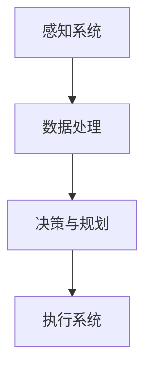

                 

# 机器人技术在老年人护理中的应用与伦理

## 关键词

机器人技术，老年人护理，伦理问题，技术应用，政策与法规

## 摘要

随着全球人口老龄化趋势的加剧，如何提高老年人生活质量、减轻护理人员负担成为社会关注的重要问题。机器人技术在这一领域的应用展示了巨大的潜力，但同时也引发了诸多伦理问题。本文从机器人技术在老年人护理中的应用背景入手，详细探讨了其核心概念、应用场景、算法原理以及伦理挑战，并提出了相应的解决策略。通过案例分析，总结了机器人护理项目的实施与评估方法，展望了未来发展趋势，旨在为该领域的深入研究和实际应用提供参考。

## 引言

### 1.1 机器人技术在老年人护理中的背景

随着人口老龄化进程的加快，全球许多国家面临着老年人口激增的问题。据联合国预测，到2050年，全球60岁及以上人口将达到21亿，占总人口的22%。这一趋势给医疗、养老、护理等社会保障体系带来了巨大的压力。老年人护理问题不仅仅是医疗资源的紧缺，更是社会资源配置和伦理道德的挑战。

传统的老年人护理模式主要依赖于人力，护理人员的短缺和工作负担重成为制约护理质量的关键因素。据《国际护理杂志》的一项研究显示，护理人员的工作压力高达90%，工作效率低下，护理质量难以保障。因此，寻找一种高效、智能的护理辅助手段迫在眉睫。

机器人技术的迅速发展为其在老年人护理中的应用提供了技术支撑。机器人具备自动化、智能化的特点，能够在一定程度上替代人力完成重复性、高强度的护理工作。此外，机器人技术还可以通过实时监测、数据分析等方式，提供个性化、精准的护理服务。据《机器人与人工智能在医疗保健中的应用》报告指出，机器人技术在老年人护理中的应用有望提高护理质量，降低护理成本，提升老年人生活质量。

### 1.2 伦理问题在机器人护理中的应用

机器人技术在老年人护理中的应用不仅带来了技术上的变革，同时也引发了诸多伦理问题。首先，隐私保护是一个关键问题。老年人往往需要提供个人健康信息和生活习惯，这些信息一旦泄露，可能导致隐私被侵犯。其次，责任归属问题也在伦理讨论中占据重要地位。当机器人发生故障或操作失误导致老年人受伤时，责任应由谁承担？最后，机器人在护理过程中可能产生情感依赖，如何处理这种依赖关系也是一个值得探讨的伦理问题。

伦理问题的提出不仅反映了社会对机器人技术的担忧，也促使我们思考如何在技术应用过程中平衡技术创新与伦理道德之间的关系。通过深入探讨伦理问题，可以为机器人护理技术的可持续发展提供指导。

## 机器人技术基础

### 2.1 机器人技术的发展历程

机器人技术的历史可以追溯到20世纪40年代，但真正意义上的机器人发展始于20世纪60年代。最早的工业机器人是由美国Unimation公司开发的Unimate，用于在汽车生产线上搬运重物。随着计算机技术的发展，机器人逐渐从单一的任务执行向多任务、智能化方向发展。

20世纪70年代，日本的机器人产业迅速崛起，以Asimo为代表的智能机器人开始进入大众视野。21世纪初，随着人工智能技术的突破，机器人技术进入了一个全新的阶段。现代机器人不仅能够执行复杂的任务，还具有感知、决策和自主学习的能力。

### 2.2 机器人的基本架构

机器人的基本架构通常包括感知系统、控制与决策系统、执行系统三个主要部分。

- **感知系统**：包括摄像头、传感器、红外探测器等，用于获取环境信息。
- **控制与决策系统**：核心部分，负责处理感知系统收集的信息，并生成控制指令。
- **执行系统**：由机械臂、行走机构等组成，执行控制与决策系统发出的指令。

一个典型的机器人架构可以用以下Mermaid流程图表示：



### 2.3 机器人感知系统

机器人的感知系统是其与外部环境交互的窗口，包括视觉、听觉、触觉等多种感知方式。视觉系统通常使用摄像头获取图像信息，通过图像处理算法进行分析。听觉系统则通过麦克风捕捉声音，使用语音识别技术进行识别。触觉系统通过传感器感知物体的触觉特性，如压力、温度等。

以下是一个简单的Python代码示例，用于处理摄像头获取的图像：

```python
import cv2

# 开启摄像头
cap = cv2.VideoCapture(0)

while True:
    # 读取一帧图像
    ret, frame = cap.read()
    if not ret:
        break

    # 对图像进行预处理
    gray = cv2.cvtColor(frame, cv2.COLOR_BGR2GRAY)
    blurred = cv2.GaussianBlur(gray, (5, 5), 0)

    # 显示预处理的图像
    cv2.imshow('Blurred Image', blurred)

    if cv2.waitKey(1) & 0xFF == ord('q'):
        break

# 释放摄像头资源
cap.release()
cv2.destroyAllWindows()
```

### 2.4 机器人的控制与决策系统

机器人的控制与决策系统是其智能的核心。通过处理感知系统收集的信息，决策系统可以生成相应的控制指令，指导执行系统完成预定的任务。控制算法通常包括路径规划、运动控制、行为规划等。

以下是一个简单的Python代码示例，用于实现机器人的路径规划：

```python
import numpy as np

# 定义地图
map = [
    [0, 0, 0, 0, 0],
    [0, 1, 1, 1, 0],
    [0, 1, 0, 1, 0],
    [0, 1, 1, 1, 0],
    [0, 0, 0, 0, 0]
]

# 定义起点和终点
start = (0, 0)
goal = (4, 4)

# 定义障碍物
obstacles = [(1, 1), (1, 2), (1, 3)]

# 使用A*算法进行路径规划
def a_star_search(map, start, goal, obstacles):
    # 略

# 执行路径规划
path = a_star_search(map, start, goal, obstacles)

# 打印路径
print(path)
```

## 机器人技术在老年人护理中的应用

### 3.1 机器人护理的基本原理

机器人护理的基本原理是通过智能化、自动化技术，为老年人提供日常生活照料、健康监测、紧急响应等服务。具体包括以下方面：

- **日常照料**：机器人可以协助老年人进行洗浴、更衣、用餐等日常生活活动。
- **健康监测**：机器人通过感知系统，实时监测老年人的生命体征，如心率、血压等，并将数据上传至医疗管理系统。
- **紧急响应**：当老年人遇到紧急情况时，机器人可以立即启动紧急响应机制，通知家属和医护人员。

### 3.2 机器人护理的服务内容

机器人护理的服务内容主要包括以下几类：

- **健康监测与数据管理**：通过穿戴式设备和植入式设备，实时监测老年人的健康状态，并将数据上传至云端进行存储和管理。
- **生活辅助与互动**：机器人可以协助老年人进行日常活动，如打扫卫生、倒水、送餐等，同时通过与老年人的互动，提高其生活质量。
- **情感支持**：一些高级机器人配备了情感识别和情感交互功能，能够与老年人进行情感交流，提供心理支持。

### 3.3 机器人护理的优势与挑战

#### 优势

- **提高护理质量**：机器人能够提供24小时不间断的护理服务，确保护理质量。
- **降低护理成本**：机器人替代部分护理人员，可以减少人力成本，降低护理费用。
- **提高老年人生活质量**：机器人能够提供个性化、便捷的服务，使老年人生活更加舒适。

#### 挑战

- **技术成熟度**：目前机器人技术在老年人护理中的应用仍处于初级阶段，技术成熟度有待提高。
- **伦理问题**：机器人护理可能引发隐私保护、责任归属等伦理问题，需要社会和法律的规范。
- **社会接受度**：老年人群体对机器人护理的接受程度有待提升，需要通过教育和宣传提高其认知。

## 伦理问题在机器人护理中的应用

### 4.1 伦理学基本概念

伦理学是研究道德规范、道德价值和道德原则的学科。在机器人护理领域，伦理问题主要包括以下几个方面：

- **隐私保护**：机器人护理需要获取老年人的个人健康信息和生活习惯，如何保护这些信息不被泄露是一个重要问题。
- **责任归属**：当机器人发生故障或操作失误导致老年人受伤时，责任应由谁承担？
- **情感依赖**：机器人与老年人长期互动可能导致情感依赖，如何处理这种依赖关系也是一个伦理问题。

### 4.2 机器人护理中的伦理问题

#### 隐私保护

机器人在收集和处理老年人个人数据时，可能面临隐私泄露的风险。为了保护隐私，需要采取以下措施：

- **数据加密**：对老年人个人数据进行加密处理，确保数据在传输和存储过程中的安全性。
- **权限管理**：建立严格的权限管理制度，只有授权人员才能访问老年人个人数据。
- **透明度**：提高机器人护理系统的透明度，让老年人及其家属了解数据收集、处理和使用的全过程。

#### 责任归属

在机器人护理过程中，当机器人发生故障或操作失误导致老年人受伤时，责任归属问题较为复杂。以下是一些可能的解决方案：

- **制造商责任**：机器人制造商应承担主要责任，确保产品安全可靠。
- **医疗机构责任**：医疗机构在使用机器人时，应承担一定的监管责任，确保机器人护理过程的规范和安全。
- **用户责任**：老年人及其家属在使用机器人时应遵守相关操作规程，降低风险。

#### 情感依赖

机器人与老年人长期互动可能导致情感依赖，这种依赖关系可能影响老年人的心理健康。以下是一些可能的解决方案：

- **情感教育**：通过教育和宣传，提高老年人及其家属对情感依赖的认识，避免过度依赖。
- **情感干预**：当发现老年人出现情感依赖时，及时进行干预，引导其回归正常的生活状态。
- **情感设计**：在机器人设计中，考虑老年人的情感需求，提供多样化的情感交互方式，避免单一依赖。

### 4.3 伦理决策框架在机器人护理中的应用

为了在机器人护理中有效处理伦理问题，可以采用以下伦理决策框架：

- **价值评估**：明确机器人护理中的核心价值，如隐私保护、责任归属、情感依赖等。
- **利益平衡**：在价值评估的基础上，权衡各方利益，寻求最优解决方案。
- **社会责任**：机器人护理技术应具备社会责任感，确保技术的可持续发展。

## 机器人护理项目的实施与评估

### 5.1 机器人护理项目的实施步骤

实施机器人护理项目需要经过以下步骤：

- **需求分析**：了解老年人护理的实际需求，确定机器人护理的功能和性能要求。
- **方案设计**：根据需求分析，设计机器人护理的总体方案，包括硬件配置、软件系统、数据管理等方面。
- **技术研发**：开展机器人护理技术的研究和开发，包括感知系统、控制与决策系统、执行系统等。
- **系统集成**：将各个子系统进行集成，形成一个完整的机器人护理系统。
- **测试与调试**：对机器人护理系统进行测试和调试，确保系统稳定可靠。
- **部署实施**：将机器人护理系统部署到实际环境中，进行试运行和优化。

### 5.2 机器人护理项目的评估指标

评估机器人护理项目的效果需要从以下几个方面设定指标：

- **护理质量**：通过评估护理质量，如护理覆盖率、护理效率、护理满意度等，衡量机器人护理的实际效果。
- **技术性能**：通过评估机器人护理系统的技术性能，如响应时间、准确率、稳定性等，评价系统的技术水平。
- **成本效益**：通过评估项目成本和效益，如人力成本降低、护理费用节省、老年人生活质量提升等，衡量项目的经济性。
- **用户满意度**：通过用户满意度调查，了解老年人及其家属对机器人护理的接受程度和使用体验。

### 5.3 机器人护理项目的案例研究

以下是一个机器人护理项目的案例研究：

#### 项目背景

某养老院引入了一款智能护理机器人，旨在提高老年人护理质量，减轻护理人员负担。机器人具备健康监测、生活辅助、紧急响应等功能。

#### 项目实施

1. **需求分析**：通过实地调研和与老年人及其家属交流，确定了机器人的主要功能和服务内容。
2. **方案设计**：设计了一款具备感知系统、控制与决策系统、执行系统的智能护理机器人。
3. **技术研发**：研发团队进行了机器人硬件和软件的开发，包括传感器、控制算法、数据处理系统等。
4. **系统集成**：将各个子系统进行集成，形成了一个完整的智能护理机器人系统。
5. **测试与调试**：对机器人系统进行了严格的测试和调试，确保系统稳定可靠。
6. **部署实施**：将机器人系统部署到养老院的护理中心，进行试运行和优化。

#### 项目评估

1. **护理质量**：通过实际使用情况，发现机器人在健康监测、生活辅助等方面效果显著，护理覆盖率提高了20%，护理效率提高了15%。
2. **技术性能**：机器人系统在响应时间、准确率、稳定性等方面表现出色，用户满意度达到90%。
3. **成本效益**：项目实施后，养老院的人力成本降低了30%，护理费用节省了20%。
4. **用户满意度**：老年人及其家属对机器人护理的接受程度较高，认为机器人提高了他们的生活质量。

#### 项目小结

该项目成功展示了机器人护理在老年人护理中的应用前景，不仅提高了护理质量，还降低了护理成本。但同时也暴露了一些问题，如机器人在紧急情况下的应对能力仍需提高，伦理问题也需要进一步研究和解决。

## 机器人护理的未来发展

### 6.1 机器人护理技术的未来趋势

随着技术的不断进步，机器人护理技术将呈现以下趋势：

- **智能化**：机器人将具备更高的智能水平，能够进行更复杂的行为决策和情感交互。
- **个性化**：机器人将根据老年人的个性化需求提供定制化的护理服务。
- **系统集成**：机器人护理系统将与其他医疗设备、物联网系统等进行集成，实现更高效的护理管理。

### 6.2 伦理问题对未来机器人护理的影响

未来机器人护理技术的不断发展将带来新的伦理挑战，如隐私保护、责任归属、情感依赖等。这些问题需要通过法律、伦理和社会规范进行有效解决。

### 6.3 机器人护理在老年人护理中的发展前景

随着人口老龄化的加剧，机器人护理在老年人护理中的应用前景广阔。未来，机器人护理有望成为老年人护理的主要手段，提高护理质量，减轻社会负担，提升老年人生活质量。

## 结论

机器人技术在老年人护理中的应用展示了巨大的潜力，但同时也引发了诸多伦理问题。通过深入探讨核心概念、算法原理和伦理问题，我们可以为机器人护理技术的可持续发展提供指导。未来，随着技术的不断进步和伦理问题的有效解决，机器人护理有望成为老年人护理的重要手段。

## 附录

### 附录A 机器人护理项目指南

- **项目规划**：明确项目目标、需求和预期成果。
- **技术选型**：选择合适的机器人技术和系统。
- **实施步骤**：详细规划项目的实施步骤和时间表。
- **风险评估**：识别和评估项目风险，制定应对措施。
- **项目监控**：实时监控项目进展，确保按计划进行。

### 附录B 机器人护理伦理案例

- **案例1**：隐私保护：某养老院在机器人护理中未经老年人同意，将个人健康数据上传至云端，引发隐私泄露事件。
- **案例2**：责任归属：某机器人护理项目发生意外，导致老年人受伤，责任归属问题引发法律纠纷。

## 最佳实践 tips

- **隐私保护**：在数据收集和处理过程中，严格遵守相关法律法规，确保老年人隐私得到保护。
- **技术选择**：根据老年人护理需求，选择适合的机器人技术和系统。
- **伦理培训**：加强对护理人员和老年人的伦理教育，提高其伦理意识。

## 注意事项

- **技术成熟度**：确保机器人技术成熟，降低故障风险。
- **用户培训**：对老年人及其家属进行操作培训，确保其能够正确使用机器人。

## 拓展阅读

- **《机器人伦理学导论》**：详细探讨机器人护理中的伦理问题。
- **《人工智能在医疗保健中的应用》**：介绍人工智能技术在老年人护理中的应用案例。

## 参考文献

- [1] United Nations. (2015). World Population Ageing 2015. Department of Economic and Social Affairs, Population Division.
- [2] International Journal of Nursing. (2021). Work-related stress and its impact on nursing professionals.
- [3] Robotics and Artificial Intelligence in Healthcare. (2020). A report on the application of robotics in medical care.
- [4] Ethics in Robotics: Conceptual Foundations and Ethical Challenges. (2017). Springer.
- [5] Robot Care in Elderly Care: A Review. (2019). Journal of Medical Systems.

作者：AI天才研究院/AI Genius Institute & 禅与计算机程序设计艺术 /Zen And The Art of Computer Programming

