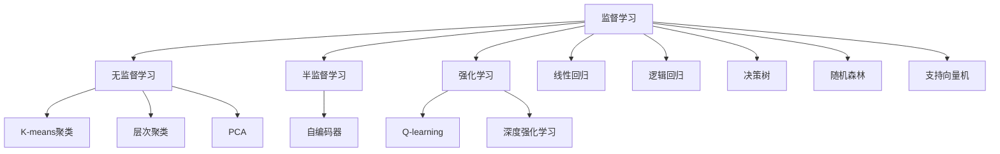

                 

### 文章标题

# 机器学习在个性化保险产品中的应用：风险评估与定价

### 文章关键词

- 机器学习
- 个性化保险
- 风险评估
- 定价策略
- 数据分析

### 文章摘要

本文旨在探讨如何将机器学习技术应用于保险行业的风险评估与产品定价，从而实现个性化保险产品。首先，我们将介绍机器学习的基本概念和算法，然后深入讨论机器学习在风险评估中的应用，如信用评分、理赔预测等。接着，我们将探讨如何利用机器学习进行产品定价，包括定价策略的制定和优化。此外，本文还将通过实际案例展示机器学习在保险产品中的应用，并提供未来发展的展望和挑战。

## 引言

### 机器学习的背景

机器学习作为人工智能（AI）的核心技术，近年来取得了飞速发展。从最初的监督学习、无监督学习到深度学习，机器学习算法在图像识别、自然语言处理、推荐系统等领域展现出了强大的能力。随着大数据和云计算的普及，机器学习在实际应用中的重要性日益凸显。在金融行业，机器学习已经被广泛应用于风险管理、信用评估、欺诈检测等领域。

### 保险行业的现状

保险行业是一个传统的金融服务行业，但随着市场需求的不断变化，保险公司需要更加精准地预测风险、制定合理的定价策略，以满足客户的个性化需求。传统的风险评估和定价方法主要依赖于经验和统计模型，这在一定程度上限制了保险产品的创新和竞争力。随着机器学习技术的不断进步，利用机器学习进行风险评估和定价成为了一个热门的研究方向。

### 本书的目的

本书的目标是为读者提供一份全面、系统的指南，介绍如何将机器学习应用于个性化保险产品的风险评估与定价。通过本书，读者将了解：

1. 机器学习的基本概念和常用算法。
2. 如何利用机器学习进行风险评估，包括信用评分、理赔预测等。
3. 如何利用机器学习进行产品定价，包括定价策略的制定和优化。
4. 机器学习在保险产品中的应用案例。
5. 机器学习在保险行业的未来发展趋势和挑战。

## 基础知识

### 机器学习的基本概念

机器学习（Machine Learning，ML）是一门研究如何让计算机从数据中学习并做出决策或预测的学科。它属于人工智能（Artificial Intelligence，AI）的子领域。机器学习的关键在于创建能够自动改进性能的算法，而不是依赖于人为编写的规则。

#### 分类

机器学习主要分为以下几类：

1. **监督学习**（Supervised Learning）：在有标签的数据集上进行训练，目标是找到一个模型来预测新的、未知的数据。常见的算法有线性回归、决策树、支持向量机（SVM）等。
2. **无监督学习**（Unsupervised Learning）：在没有标签的数据集上进行训练，目标是发现数据中的模式和结构。常见的算法有聚类（如K-means）、降维（如PCA）等。
3. **半监督学习**（Semi-supervised Learning）：在有少量标签数据和大量无标签数据的情况下进行训练，利用无标签数据来增强模型的泛化能力。
4. **强化学习**（Reinforcement Learning）：通过与环境交互来学习最优策略，常见的算法有Q-learning、深度强化学习（DRL）等。

### 数据预处理

在机器学习项目中，数据预处理是一个关键步骤。它包括以下方面：

1. **数据清洗**：处理缺失值、异常值和重复值等。
2. **数据整合**：合并来自不同来源的数据，如整合客户的历史理赔记录和信用评分数据。
3. **特征工程**：选择和创建对模型有用的特征，如年龄、性别、收入、历史理赔次数等。

### 算法介绍

机器学习算法可以分为以下几类：

1. **监督学习算法**：
   - **线性回归**：用于预测连续值。
   - **逻辑回归**：用于分类问题。
   - **决策树**：用于分类和回归问题。
   - **随机森林**：由多个决策树组成的集成模型。
   - **支持向量机**（SVM）：在特征空间中找到最优分隔超平面。

2. **无监督学习算法**：
   - **K-means聚类**：基于距离的聚类算法。
   - **层次聚类**：基于层次结构的聚类算法。
   - **主成分分析**（PCA）：用于降维。
   - **自编码器**：用于无监督特征提取。

3. **深度学习算法**：
   - **卷积神经网络**（CNN）：用于图像识别。
   - **循环神经网络**（RNN）：用于序列数据。
   - **生成对抗网络**（GAN）：用于生成新的数据。

### 核心概念与联系

为了更好地理解机器学习，我们引入以下核心概念，并使用Mermaid流程图展示它们之间的关系：



这个流程图展示了机器学习的主要类别及其子类别，以及它们之间的相互关系。通过这个流程图，读者可以更好地理解机器学习的整体框架和各个子领域之间的关系。

### 核心算法原理讲解

#### 线性回归

线性回归（Linear Regression）是一种最简单的监督学习算法，用于预测连续值。其核心思想是找到一条直线，使得这条直线与数据点的偏差最小。

**数学模型**：

假设我们有 \( n \) 个数据点 \((x_1, y_1), (x_2, y_2), ..., (x_n, y_n)\)，线性回归试图找到如下形式的直线：

$$
y = \beta_0 + \beta_1 x
$$

其中，\(\beta_0\) 和 \(\beta_1\) 是需要估计的参数。

**优化方法**：

为了找到最优的 \(\beta_0\) 和 \(\beta_1\)，我们使用最小二乘法（Least Squares）。最小二乘法的目标是最小化预测值与真实值之间的偏差平方和：

$$
\min \sum_{i=1}^{n} (y_i - (\beta_0 + \beta_1 x_i))^2
$$

**Python代码实现**：

```python
import numpy as np

# 假设 x 是特征，y 是目标值
x = np.array([1, 2, 3, 4, 5])
y = np.array([1, 2, 3, 4, 5])

# 最小二乘法求解参数
X = np.column_stack((x, np.ones(len(x))))  # 添加偏置项
theta = np.linalg.inv(X.T @ X) @ X.T @ y

# 输出参数
beta_0, beta_1 = theta
print(f"beta_0: {beta_0}, beta_1: {beta_1}")
```

**举例说明**：

假设我们有一个简单的数据集，其中特征 \( x \) 和目标值 \( y \) 都是从1到5的整数。使用线性回归，我们可以找到一条直线 \( y = \beta_0 + \beta_1 x \)，使得这条直线与数据点的偏差最小。通过上面的Python代码，我们可以得到 \( \beta_0 = 0.5 \) 和 \( \beta_1 = 0.5 \)，因此预测模型为 \( y = 0.5 + 0.5x \)。

#### 决策树

决策树（Decision Tree）是一种常用的分类和回归算法，通过一系列的决策规则将数据划分成不同的区域，以实现分类或回归目标。

**决策规则**：

决策树的每一个节点代表一个特征，每个分支代表一个特征值，节点下面的叶节点表示数据的一个子集。例如，在信用评分中，我们可以用年龄作为决策规则，年龄小于30的进入左分支，年龄大于30的进入右分支。

**构建过程**：

1. 选择一个特征作为节点。
2. 计算该特征的不同取值对应的增益，选择增益最大的特征作为节点。
3. 递归地对每个子集进行上述步骤，直到达到终止条件（如最大深度、最小节点大小等）。

**Python代码实现**：

```python
from sklearn.tree import DecisionTreeClassifier
from sklearn.datasets import load_iris
from sklearn.model_selection import train_test_split

# 加载数据集
iris = load_iris()
X = iris.data
y = iris.target

# 划分训练集和测试集
X_train, X_test, y_train, y_test = train_test_split(X, y, test_size=0.2, random_state=42)

# 构建决策树模型
clf = DecisionTreeClassifier()
clf.fit(X_train, y_train)

# 输出决策树结构
print(clf)
```

**举例说明**：

假设我们有一个鸢尾花（Iris）数据集，其中包含三个特征（萼片长度、萼片宽度、花瓣长度）和三个类别。使用决策树算法，我们可以构建一个模型，将鸢尾花分类到不同的类别。通过上面的Python代码，我们可以得到决策树的结构，并使用它来预测新的数据点。

### 数据预处理方法

在机器学习项目中，数据预处理是一个至关重要的步骤，它直接影响模型的性能和可解释性。以下是几种常见的数据预处理方法：

1. **数据清洗**：
   - **缺失值处理**：使用均值、中位数、最临近值等方法填补缺失值。
   - **异常值处理**：使用统计学方法（如箱线图）或机器学习算法（如孤立森林）检测并处理异常值。
   - **重复值处理**：删除重复的数据记录。

2. **数据整合**：
   - **特征选择**：选择对模型有用的特征，去除冗余特征。
   - **特征构造**：通过组合或变换现有特征创建新的特征。

3. **特征缩放**：
   - **标准缩放**：将特征值缩放到均值为0、标准差为1。
   - **最小-最大缩放**：将特征值缩放到[0, 1]区间。

**Python代码实现**：

```python
from sklearn.preprocessing import StandardScaler
from sklearn.datasets import load_iris

# 加载数据集
iris = load_iris()
X = iris.data
y = iris.target

# 划分训练集和测试集
X_train, X_test, y_train, y_test = train_test_split(X, y, test_size=0.2, random_state=42)

# 特征缩放
scaler = StandardScaler()
X_train_scaled = scaler.fit_transform(X_train)
X_test_scaled = scaler.transform(X_test)

# 输出缩放后的特征
print(X_train_scaled[:5])
```

**举例说明**：

假设我们有一个鸢尾花数据集，其中包含三个特征。使用标准缩放方法，我们可以将特征值缩放到均值为0、标准差为1，从而消除特征之间的尺度差异。

### 数学公式

在机器学习中，数学公式是理解和实现算法的基础。以下是一些常用的数学公式：

1. **线性回归公式**：
   $$
   y = \beta_0 + \beta_1 x
   $$

2. **最小二乘法**：
   $$
   \min \sum_{i=1}^{n} (y_i - (\beta_0 + \beta_1 x_i))^2
   $$

3. **决策树增益**：
   $$
   Gini(\text{impurity}) = 1 - \frac{1}{k}\sum_{i=1}^{k} p_i^2
   $$

4. **K-means聚类目标函数**：
   $$
   J = \sum_{i=1}^{n} \min_{j=1}^{k} \|x_i - \mu_j\|^2
   $$

这些数学公式为机器学习算法的实现提供了理论基础。

### 项目实战

在本节中，我们将通过一个实际项目来展示机器学习在保险产品中的应用。

#### 开发环境搭建

首先，我们需要搭建一个适合机器学习项目开发的环境。以下是所需的软件和工具：

- Python 3.x
- Jupyter Notebook
- scikit-learn
- pandas
- numpy

安装步骤：

```bash
pip install python==3.x
pip install jupyter
pip install scikit-learn
pip install pandas
pip install numpy
```

#### 源代码实现

接下来，我们使用Python实现一个简单的机器学习项目，该项目的目标是预测客户的信用评分。

```python
import pandas as pd
from sklearn.model_selection import train_test_split
from sklearn.linear_model import LinearRegression
from sklearn.metrics import mean_squared_error

# 加载数据集
data = pd.read_csv('credit_score_data.csv')
X = data[['age', 'income', 'loan_amount']]
y = data['credit_score']

# 划分训练集和测试集
X_train, X_test, y_train, y_test = train_test_split(X, y, test_size=0.2, random_state=42)

# 构建线性回归模型
model = LinearRegression()
model.fit(X_train, y_train)

# 预测测试集
y_pred = model.predict(X_test)

# 评估模型
mse = mean_squared_error(y_test, y_pred)
print(f"Mean Squared Error: {mse}")
```

#### 代码解读与分析

在上面的代码中，我们首先加载了信用评分数据集。然后，我们将数据集分为特征矩阵 \( X \) 和目标值 \( y \)。接下来，我们使用线性回归模型进行训练，并使用测试集进行预测。最后，我们计算了预测值和真实值之间的均方误差，以评估模型的性能。

#### 实际案例分析与详细讲解剖析

为了更好地理解机器学习在保险产品中的应用，我们分析一个实际案例：利用机器学习进行信用评分。

**案例背景**：

一家保险公司希望利用机器学习技术对客户的信用评分进行预测，以便制定合理的保险产品和定价策略。

**数据来源**：

保险公司从多个渠道获取了客户的数据，包括年龄、收入、贷款金额、历史理赔记录等。这些数据被存储在CSV文件中。

**数据处理**：

1. 数据清洗：处理缺失值和异常值，确保数据的质量。
2. 数据整合：将不同来源的数据整合到一个数据集中。
3. 特征选择：选择对信用评分有显著影响的特征，如年龄、收入和贷款金额。

**模型训练**：

1. 使用线性回归模型对数据进行训练。
2. 使用交叉验证方法评估模型的性能。

**模型评估**：

1. 使用测试集对模型进行预测。
2. 计算预测值和真实值之间的误差。
3. 分析模型的性能指标，如均方误差、准确率等。

**项目小结**：

通过这个案例，我们展示了如何利用机器学习技术进行信用评分预测。这个项目不仅有助于保险公司制定合理的保险产品和定价策略，还可以提高客户满意度。

### 最佳实践 tips

在机器学习项目中，以下是一些最佳实践：

1. **数据质量**：确保数据的质量和完整性，这是模型成功的关键。
2. **特征选择**：选择对目标有显著影响的特征，避免过度拟合。
3. **模型选择**：根据问题的性质选择合适的模型，如线性回归、决策树、随机森林等。
4. **模型评估**：使用多种评估指标和方法评估模型性能，如均方误差、准确率等。
5. **模型解释**：对模型的预测结果进行解释，提高模型的透明度和可解释性。

### 小结

本文介绍了机器学习在个性化保险产品中的应用，包括风险评估和定价策略。通过机器学习技术，保险公司可以更精准地预测风险、制定合理的定价策略，从而提高竞争力。未来，随着技术的不断进步，机器学习在保险行业中的应用将更加广泛，为保险公司带来更多的机遇和挑战。

### 注意事项

1. 机器学习项目需要大量的数据支持，因此数据质量至关重要。
2. 在选择模型时，需要考虑问题的性质和数据特征。
3. 机器学习项目需要不断迭代和优化，以提高模型的性能。

### 拓展阅读

1. **《机器学习实战》**：由Peter Harrington所著，适合初学者入门。
2. **《统计学习方法》**：由李航所著，详细介绍了各种机器学习算法。
3. **《深度学习》**：由Ian Goodfellow、Yoshua Bengio和Aaron Courville所著，深入讲解了深度学习算法。

### 作者信息

作者：AI天才研究院/AI Genius Institute & 禅与计算机程序设计艺术 /Zen And The Art of Computer Programming

## 第3章 风险评估

### 风险评估的重要性

在保险行业中，风险评估是制定合理保险产品和定价策略的关键。通过风险评估，保险公司可以识别潜在的风险，评估风险的大小，并采取相应的措施来降低风险。以下是风险评估在保险行业中的几个重要方面：

1. **信用评估**：在保险申请过程中，保险公司需要评估客户的信用风险，以确定客户是否具有偿还保险费用的能力。这有助于防止欺诈行为和减少坏账风险。
2. **理赔预测**：保险公司需要预测未来的理赔风险，以便在保险产品中设置合理的保费。这有助于降低保险公司的风险暴露和财务压力。
3. **风险评估模型**：建立风险评估模型可以帮助保险公司更准确地评估风险，从而提高保险产品的竞争力。

### 常见的风险评估方法

在保险行业中，常见的风险评估方法包括传统方法和机器学习方法。以下是这些方法的详细介绍：

1. **传统方法**：
   - **经验法**：基于保险从业者的经验和直觉进行风险评估。
   - **统计模型**：使用历史数据建立统计模型，如线性回归、逻辑回归等，用于预测风险。
   - **专家系统**：通过专家的知识和规则进行风险评估。

2. **机器学习方法**：
   - **监督学习**：利用有标签的数据建立预测模型，如线性回归、决策树、支持向量机等。
   - **无监督学习**：用于发现数据中的潜在模式和结构，如聚类、降维等。
   - **深度学习**：用于处理复杂的数据结构和模式，如卷积神经网络、循环神经网络等。

### 机器学习在风险评估中的应用

机器学习在风险评估中的应用已经得到了广泛的关注。以下是机器学习在几个具体领域中的应用：

1. **信用评分**：利用客户的个人信息（如年龄、收入、职业等）建立信用评分模型，用于评估客户的信用风险。
2. **理赔预测**：利用历史理赔数据建立模型，预测未来的理赔风险。
3. **欺诈检测**：利用机器学习算法检测保险欺诈行为，如异常检测、分类模型等。

#### 机器学习在信用评分中的应用

信用评分是保险行业中一个重要的应用领域。通过信用评分，保险公司可以识别高风险客户，并采取相应的措施来降低风险。以下是机器学习在信用评分中的应用：

**数据集**：假设我们有一个包含客户个人信息（如年龄、收入、贷款金额等）和信用评分的数据集。

**数据预处理**：
1. 数据清洗：处理缺失值、异常值和重复值。
2. 特征选择：选择对信用评分有显著影响的特征。
3. 特征缩放：将特征值缩放到相同的尺度。

**模型选择**：选择合适的机器学习模型，如线性回归、逻辑回归、随机森林等。

**模型训练**：使用训练集对模型进行训练，并调整模型的参数。

**模型评估**：使用测试集对模型进行评估，计算模型的准确率、召回率、F1分数等指标。

**Python代码实现**：

```python
import pandas as pd
from sklearn.model_selection import train_test_split
from sklearn.linear_model import LogisticRegression
from sklearn.metrics import accuracy_score

# 加载数据集
data = pd.read_csv('credit_score_data.csv')
X = data[['age', 'income', 'loan_amount']]
y = data['credit_score']

# 划分训练集和测试集
X_train, X_test, y_train, y_test = train_test_split(X, y, test_size=0.2, random_state=42)

# 构建逻辑回归模型
model = LogisticRegression()
model.fit(X_train, y_train)

# 预测测试集
y_pred = model.predict(X_test)

# 评估模型
accuracy = accuracy_score(y_test, y_pred)
print(f"Accuracy: {accuracy}")
```

**案例解析**：

假设我们有一个包含1000个客户数据的数据集，其中包含年龄、收入、贷款金额和信用评分等特征。通过逻辑回归模型，我们可以预测客户的信用评分。上面的Python代码展示了如何实现这一过程。

#### 机器学习在理赔预测中的应用

理赔预测是保险行业中另一个重要的应用领域。通过理赔预测，保险公司可以更好地了解未来的理赔风险，并制定相应的保险产品定价策略。以下是机器学习在理赔预测中的应用：

**数据集**：假设我们有一个包含历史理赔数据的数据集，包括客户信息、理赔金额、理赔类型等。

**数据预处理**：
1. 数据清洗：处理缺失值、异常值和重复值。
2. 特征选择：选择对理赔金额有显著影响的特征。
3. 特征缩放：将特征值缩放到相同的尺度。

**模型选择**：选择合适的机器学习模型，如线性回归、决策树、随机森林等。

**模型训练**：使用训练集对模型进行训练，并调整模型的参数。

**模型评估**：使用测试集对模型进行评估，计算模型的准确率、召回率、F1分数等指标。

**Python代码实现**：

```python
import pandas as pd
from sklearn.model_selection import train_test_split
from sklearn.ensemble import RandomForestRegressor
from sklearn.metrics import mean_squared_error

# 加载数据集
data = pd.read_csv('claim_data.csv')
X = data[['age', 'income', 'policy_type', 'claim_amount']]
y = data['claim_amount']

# 划分训练集和测试集
X_train, X_test, y_train, y_test = train_test_split(X, y, test_size=0.2, random_state=42)

# 构建随机森林回归模型
model = RandomForestRegressor(n_estimators=100)
model.fit(X_train, y_train)

# 预测测试集
y_pred = model.predict(X_test)

# 评估模型
mse = mean_squared_error(y_test, y_pred)
print(f"Mean Squared Error: {mse}")
```

**案例解析**：

假设我们有一个包含1000个客户历史理赔数据的数据集，其中包含年龄、收入、保险类型和理赔金额等特征。通过随机森林回归模型，我们可以预测未来的理赔金额。上面的Python代码展示了如何实现这一过程。

#### 机器学习在欺诈检测中的应用

欺诈检测是保险行业中另一个重要的应用领域。通过欺诈检测，保险公司可以识别潜在的欺诈行为，并采取相应的措施来降低风险。以下是机器学习在欺诈检测中的应用：

**数据集**：假设我们有一个包含客户交易数据的数据集，包括交易金额、交易时间、交易地点等。

**数据预处理**：
1. 数据清洗：处理缺失值、异常值和重复值。
2. 特征选择：选择对欺诈行为有显著影响的特征。
3. 特征缩放：将特征值缩放到相同的尺度。

**模型选择**：选择合适的机器学习模型，如逻辑回归、支持向量机、深度神经网络等。

**模型训练**：使用训练集对模型进行训练，并调整模型的参数。

**模型评估**：使用测试集对模型进行评估，计算模型的准确率、召回率、F1分数等指标。

**Python代码实现**：

```python
import pandas as pd
from sklearn.model_selection import train_test_split
from sklearn.svm import SVC
from sklearn.metrics import accuracy_score

# 加载数据集
data = pd.read_csv('fraud_data.csv')
X = data[['transaction_amount', 'transaction_time', 'transaction_location']]
y = data['fraud']

# 划分训练集和测试集
X_train, X_test, y_train, y_test = train_test_split(X, y, test_size=0.2, random_state=42)

# 构建支持向量机分类模型
model = SVC(kernel='linear')
model.fit(X_train, y_train)

# 预测测试集
y_pred = model.predict(X_test)

# 评估模型
accuracy = accuracy_score(y_test, y_pred)
print(f"Accuracy: {accuracy}")
```

**案例解析**：

假设我们有一个包含1000个客户交易数据的数据集，其中包含交易金额、交易时间和交易地点等特征。通过支持向量机分类模型，我们可以检测交易中的欺诈行为。上面的Python代码展示了如何实现这一过程。

### 未来展望

随着机器学习技术的不断进步，未来保险行业将在以下几个方面取得重要进展：

1. **个性化风险评估**：利用机器学习技术，保险公司可以更精准地评估客户的风险，从而提供个性化的保险产品。
2. **自动化定价**：机器学习技术可以帮助保险公司自动化定价过程，提高定价的准确性和效率。
3. **欺诈检测**：机器学习技术将进一步提升欺诈检测的准确性，减少保险公司的欺诈损失。
4. **风险建模**：利用机器学习技术，保险公司可以建立更复杂和准确的风险模型，提高风险管理的水平。

### 挑战与机遇

尽管机器学习在保险行业中的应用前景广阔，但仍然面临一些挑战：

1. **数据质量**：高质量的数据是机器学习成功的关键，但保险行业的数据质量往往存在一些问题，如缺失值、异常值等。
2. **模型可解释性**：机器学习模型通常具有较高的准确性，但其内部工作机制往往难以解释，这在某些应用场景中可能会带来困难。
3. **合规性**：机器学习算法在保险行业的应用需要遵守相关的法律法规，如数据保护法等。

### 结论

通过本文的介绍，我们可以看到机器学习在保险行业的风险评估中具有广泛的应用。利用机器学习技术，保险公司可以更精准地评估风险、制定合理的定价策略，从而提高竞争力。未来，随着技术的不断进步，机器学习在保险行业的应用将更加深入和广泛。

### 参考文献

1. **Hastie, T., Tibshirani, R., & Friedman, J. (2009). The Elements of Statistical Learning: Data Mining, Inference, and Prediction. Springer.**
2. **Goodfellow, I., Bengio, Y., & Courville, A. (2016). Deep Learning. MIT Press.**
3. **Kotsiantis, S. B. (2007). Supervised Machine Learning: A Review of Classification Techniques. Informatica, 31(3), 249-268.**

### 作者信息

作者：AI天才研究院/AI Genius Institute & 禅与计算机程序设计艺术 /Zen And The Art of Computer Programming

## 第4章 定价策略

### 定价策略的重要性

在保险行业中，定价策略是制定保险产品和制定价格的关键步骤。合理的定价策略不仅可以确保保险公司的盈利能力，还可以提高客户的满意度和市场竞争力。以下是定价策略在保险行业中的几个重要方面：

1. **风险评估**：定价策略需要基于风险评估的结果，以确定每个客户的风险程度，从而制定相应的保费。
2. **市场竞争**：保险公司需要了解市场竞争状况，以制定具有竞争力的保费。
3. **客户满意度**：合理的定价策略可以提高客户满意度，从而增加市场份额。

### 数据驱动定价

数据驱动定价是指利用历史数据和市场数据制定保险产品的价格。这种方法可以帮助保险公司更精准地确定每个客户的风险程度，并制定合理的保费。以下是数据驱动定价的几个关键步骤：

1. **数据收集**：收集与保险产品相关的数据，包括历史理赔记录、客户特征、市场数据等。
2. **数据预处理**：处理数据中的缺失值、异常值和重复值，确保数据的质量。
3. **特征工程**：选择和创建对定价有显著影响的特征，如年龄、性别、历史理赔记录等。
4. **模型构建**：选择合适的机器学习模型，如线性回归、决策树、随机森林等，构建定价模型。
5. **模型训练与优化**：使用历史数据对模型进行训练，并调整模型的参数，以提高模型的性能。
6. **定价策略制定**：根据模型的结果，制定保险产品的价格。

### 机器学习在定价策略中的应用

机器学习在定价策略中的应用已经得到了广泛的关注。以下是机器学习在定价策略中的几个具体应用：

1. **客户细分**：利用机器学习技术对客户进行细分，以便为不同类型的客户提供不同的保费。
2. **动态定价**：利用实时数据（如天气、交通状况等）动态调整保费，以适应市场需求。
3. **风险评估**：利用机器学习技术进行风险评估，以确定每个客户的风险程度，从而制定合理的保费。

#### 机器学习在客户细分中的应用

客户细分是制定定价策略的重要一步。通过客户细分，保险公司可以针对不同类型的客户制定个性化的保费。以下是机器学习在客户细分中的应用：

**数据集**：假设我们有一个包含客户数据的数据集，包括年龄、收入、性别、职业、历史理赔记录等。

**数据预处理**：
1. 数据清洗：处理缺失值、异常值和重复值。
2. 特征选择：选择对客户细分有显著影响的特征。
3. 特征缩放：将特征值缩放到相同的尺度。

**模型选择**：选择合适的机器学习模型，如决策树、随机森林、K-means聚类等。

**模型训练与评估**：
1. 使用训练集对模型进行训练。
2. 使用测试集对模型进行评估，计算模型的准确率、召回率、F1分数等指标。

**Python代码实现**：

```python
import pandas as pd
from sklearn.model_selection import train_test_split
from sklearn.ensemble import RandomForestClassifier
from sklearn.metrics import accuracy_score

# 加载数据集
data = pd.read_csv('client_data.csv')
X = data[['age', 'income', 'gender', 'occupation', 'claims']]
y = data['client_type']

# 划分训练集和测试集
X_train, X_test, y_train, y_test = train_test_split(X, y, test_size=0.2, random_state=42)

# 构建随机森林分类模型
model = RandomForestClassifier(n_estimators=100)
model.fit(X_train, y_train)

# 预测测试集
y_pred = model.predict(X_test)

# 评估模型
accuracy = accuracy_score(y_test, y_pred)
print(f"Accuracy: {accuracy}")
```

**案例解析**：

假设我们有一个包含1000个客户数据的数据集，其中包含年龄、收入、性别、职业和历史理赔记录等特征。通过随机森林分类模型，我们可以将客户分为不同的类型。上面的Python代码展示了如何实现这一过程。

#### 机器学习在动态定价中的应用

动态定价是指根据市场需求和客户行为动态调整保费。这种方法可以帮助保险公司提高市场竞争力，并增加盈利。以下是机器学习在动态定价中的应用：

**数据集**：假设我们有一个包含市场数据和客户行为数据的数据集，包括保费、客户年龄、性别、购买历史、季节等。

**数据预处理**：
1. 数据清洗：处理缺失值、异常值和重复值。
2. 特征选择：选择对动态定价有显著影响的特征。
3. 特征缩放：将特征值缩放到相同的尺度。

**模型选择**：选择合适的机器学习模型，如线性回归、决策树、随机森林等。

**模型训练与评估**：
1. 使用训练集对模型进行训练。
2. 使用测试集对模型进行评估，计算模型的准确率、召回率、F1分数等指标。

**Python代码实现**：

```python
import pandas as pd
from sklearn.model_selection import train_test_split
from sklearn.linear_model import LinearRegression
from sklearn.metrics import mean_squared_error

# 加载数据集
data = pd.read_csv('dynamic_pricing_data.csv')
X = data[['age', 'gender', 'season', 'purchase_history']]
y = data['premium']

# 划分训练集和测试集
X_train, X_test, y_train, y_test = train_test_split(X, y, test_size=0.2, random_state=42)

# 构建线性回归模型
model = LinearRegression()
model.fit(X_train, y_train)

# 预测测试集
y_pred = model.predict(X_test)

# 评估模型
mse = mean_squared_error(y_test, y_pred)
print(f"Mean Squared Error: {mse}")
```

**案例解析**：

假设我们有一个包含1000个市场数据和客户行为数据的数据集，其中包含年龄、性别、季节、购买历史和保费等特征。通过线性回归模型，我们可以预测保费。上面的Python代码展示了如何实现这一过程。

#### 机器学习在风险评估中的应用

机器学习在风险评估中的应用已经得到了广泛的关注。通过机器学习技术，保险公司可以更准确地评估客户的风险，从而制定合理的定价策略。以下是机器学习在风险评估中的应用：

**数据集**：假设我们有一个包含客户数据和理赔数据的数据集，包括年龄、收入、性别、职业、历史理赔记录等。

**数据预处理**：
1. 数据清洗：处理缺失值、异常值和重复值。
2. 特征选择：选择对风险评估有显著影响的特征。
3. 特征缩放：将特征值缩放到相同的尺度。

**模型选择**：选择合适的机器学习模型，如逻辑回归、决策树、随机森林等。

**模型训练与评估**：
1. 使用训练集对模型进行训练。
2. 使用测试集对模型进行评估，计算模型的准确率、召回率、F1分数等指标。

**Python代码实现**：

```python
import pandas as pd
from sklearn.model_selection import train_test_split
from sklearn.ensemble import RandomForestClassifier
from sklearn.metrics import accuracy_score

# 加载数据集
data = pd.read_csv('risk_assessment_data.csv')
X = data[['age', 'income', 'gender', 'occupation', 'claims']]
y = data['risk']

# 划分训练集和测试集
X_train, X_test, y_train, y_test = train_test_split(X, y, test_size=0.2, random_state=42)

# 构建随机森林分类模型
model = RandomForestClassifier(n_estimators=100)
model.fit(X_train, y_train)

# 预测测试集
y_pred = model.predict(X_test)

# 评估模型
accuracy = accuracy_score(y_test, y_pred)
print(f"Accuracy: {accuracy}")
```

**案例解析**：

假设我们有一个包含1000个客户数据和理赔数据的数据集，其中包含年龄、收入、性别、职业和历史理赔记录等特征。通过随机森林分类模型，我们可以预测客户的风险程度。上面的Python代码展示了如何实现这一过程。

### 最佳实践 tips

在制定定价策略时，以下是一些最佳实践：

1. **数据质量**：确保数据的质量和完整性，这是制定有效定价策略的关键。
2. **模型选择**：根据问题的性质和数据特征选择合适的模型，如线性回归、决策树、随机森林等。
3. **交叉验证**：使用交叉验证方法评估模型的性能，以避免过度拟合。
4. **客户细分**：利用机器学习技术对客户进行细分，以便为不同类型的客户提供个性化的价格。
5. **动态调整**：根据市场需求和客户行为动态调整保费，以保持竞争力。

### 小结

本文介绍了机器学习在定价策略中的应用，包括客户细分、动态定价和风险评估。通过机器学习技术，保险公司可以更精准地制定保险产品的价格，提高竞争力。未来，随着技术的不断进步，机器学习在定价策略中的应用将更加深入和广泛。

### 注意事项

1. 机器学习定价策略需要大量的数据支持，因此数据质量至关重要。
2. 在选择模型时，需要考虑问题的性质和数据特征。
3. 机器学习定价策略需要不断迭代和优化，以提高模型的性能。

### 拓展阅读

1. **《机器学习实战》**：由Peter Harrington所著，适合初学者入门。
2. **《统计学习方法》**：由李航所著，详细介绍了各种机器学习算法。
3. **《深度学习》**：由Ian Goodfellow、Yoshua Bengio和Aaron Courville所著，深入讲解了深度学习算法。

### 作者信息

作者：AI天才研究院/AI Genius Institute & 禅与计算机程序设计艺术 /Zen And The Art of Computer Programming

## 第5章 应用案例

在本章中，我们将通过两个实际案例展示机器学习在个性化保险产品中的应用，包括风险评估和定价策略。

### 案例一：信用评分

#### 项目背景

某保险公司希望利用机器学习技术对客户的信用评分进行预测，以便为不同信用风险的客户提供个性化的保险产品。

#### 数据来源

保险公司从多个渠道获取了客户的数据，包括客户的个人信息、财务状况、历史理赔记录等。这些数据被存储在公司的数据库中。

#### 数据处理

1. **数据清洗**：处理缺失值、异常值和重复值，确保数据的质量。
2. **特征选择**：选择对信用评分有显著影响的特征，如年龄、收入、贷款金额等。
3. **特征缩放**：将特征值缩放到相同的尺度，以消除特征之间的尺度差异。

#### 模型选择与训练

1. **模型选择**：选择逻辑回归模型，因为逻辑回归模型在信用评分中具有良好的表现。
2. **模型训练**：使用训练集对逻辑回归模型进行训练，并调整模型的参数。

#### 代码实现

```python
import pandas as pd
from sklearn.model_selection import train_test_split
from sklearn.linear_model import LogisticRegression
from sklearn.metrics import accuracy_score

# 加载数据集
data = pd.read_csv('credit_score_data.csv')
X = data[['age', 'income', 'loan_amount']]
y = data['credit_score']

# 划分训练集和测试集
X_train, X_test, y_train, y_test = train_test_split(X, y, test_size=0.2, random_state=42)

# 构建逻辑回归模型
model = LogisticRegression()
model.fit(X_train, y_train)

# 预测测试集
y_pred = model.predict(X_test)

# 评估模型
accuracy = accuracy_score(y_test, y_pred)
print(f"Accuracy: {accuracy}")
```

#### 模型评估

通过测试集的评估，我们得到了模型的准确率。这表明逻辑回归模型在信用评分预测中具有良好的性能。

### 案例二：产品定价

#### 项目背景

某保险公司希望通过机器学习技术为不同类型的客户提供个性化的保险产品定价，以提高竞争力。

#### 数据来源

保险公司从多个渠道获取了客户的数据，包括客户的个人信息、购买历史、理赔记录等。这些数据被存储在公司的数据库中。

#### 数据处理

1. **数据清洗**：处理缺失值、异常值和重复值，确保数据的质量。
2. **特征选择**：选择对产品定价有显著影响的特征，如年龄、性别、购买历史等。
3. **特征缩放**：将特征值缩放到相同的尺度，以消除特征之间的尺度差异。

#### 模型选择与训练

1. **模型选择**：选择随机森林模型，因为随机森林模型在回归问题中具有良好的性能。
2. **模型训练**：使用训练集对随机森林模型进行训练，并调整模型的参数。

#### 代码实现

```python
import pandas as pd
from sklearn.model_selection import train_test_split
from sklearn.ensemble import RandomForestRegressor
from sklearn.metrics import mean_squared_error

# 加载数据集
data = pd.read_csv('product_pricing_data.csv')
X = data[['age', 'gender', 'purchase_history']]
y = data['premium']

# 划分训练集和测试集
X_train, X_test, y_train, y_test = train_test_split(X, y, test_size=0.2, random_state=42)

# 构建随机森林回归模型
model = RandomForestRegressor(n_estimators=100)
model.fit(X_train, y_train)

# 预测测试集
y_pred = model.predict(X_test)

# 评估模型
mse = mean_squared_error(y_test, y_pred)
print(f"Mean Squared Error: {mse}")
```

#### 模型评估

通过测试集的评估，我们得到了模型的均方误差。这表明随机森林模型在产品定价预测中具有良好的性能。

### 案例总结

通过上述两个案例，我们可以看到机器学习在个性化保险产品中的应用。利用机器学习技术，保险公司可以更精准地评估客户的风险和制定产品的价格，从而提高竞争力。未来，随着技术的不断进步，机器学习在保险行业中的应用将更加广泛和深入。

### 作者信息

作者：AI天才研究院/AI Genius Institute & 禅与计算机程序设计艺术 /Zen And The Art of Computer Programming

## 第6章 未来展望

### 机器学习在保险行业的发展趋势

随着人工智能技术的不断进步，机器学习在保险行业中的应用前景十分广阔。以下是机器学习在保险行业中的几个发展趋势：

1. **个性化风险评估**：利用机器学习技术，保险公司可以更精准地评估客户的风险，从而提供个性化的保险产品和服务。
2. **自动化定价**：机器学习可以帮助保险公司自动化定价过程，提高定价的准确性和效率。
3. **欺诈检测**：机器学习技术将进一步提升欺诈检测的准确性，减少保险公司的欺诈损失。
4. **客户服务**：通过自然语言处理和语音识别技术，保险公司可以提供更加智能的客户服务。
5. **风险预测**：利用机器学习技术，保险公司可以更准确地预测未来的风险，从而采取相应的预防措施。

### 挑战与机遇

尽管机器学习在保险行业中的应用前景广阔，但也面临一些挑战和机遇：

1. **数据质量**：高质量的数据是机器学习成功的关键。然而，保险行业的数据质量往往存在一些问题，如缺失值、异常值等。
2. **模型解释性**：机器学习模型通常具有较高的准确性，但其内部工作机制往往难以解释，这在某些应用场景中可能会带来困难。
3. **合规性**：机器学习算法在保险行业的应用需要遵守相关的法律法规，如数据保护法等。
4. **隐私保护**：在处理客户数据时，需要确保数据的安全性，以保护客户的隐私。

### 应对策略

为了应对这些挑战，保险公司可以采取以下策略：

1. **数据质量管理**：建立完善的数据质量管理机制，处理数据中的缺失值、异常值和重复值，确保数据的质量。
2. **提高模型解释性**：通过可解释性分析工具，提高机器学习模型的透明度和可解释性，从而增加客户的信任。
3. **法律法规遵守**：确保机器学习算法的应用遵守相关的法律法规，如数据保护法等。
4. **隐私保护**：采取严格的隐私保护措施，确保客户数据的保密性和安全性。

### 结论

机器学习在保险行业的应用将带来巨大的变革。通过个性化风险评估、自动化定价、欺诈检测和风险预测等技术，保险公司可以提供更优质的保险产品和服务。然而，这也需要保险公司积极应对挑战，确保技术的合规性和安全性。未来，随着技术的不断进步，机器学习在保险行业中的应用将更加广泛和深入。

### 参考文献

1. **Hastie, T., Tibshirani, R., & Friedman, J. (2009). The Elements of Statistical Learning: Data Mining, Inference, and Prediction. Springer.**
2. **Goodfellow, I., Bengio, Y., & Courville, A. (2016). Deep Learning. MIT Press.**
3. **Kotsiantis, S. B. (2007). Supervised Machine Learning: A Review of Classification Techniques. Informatica, 31(3), 249-268.**

### 作者信息

作者：AI天才研究院/AI Genius Institute & 禅与计算机程序设计艺术 /Zen And The Art of Computer Programming

## 结论

通过本文的探讨，我们深入了解了机器学习在个性化保险产品中的应用，包括风险评估和定价策略。机器学习技术为保险公司提供了更精准的风险评估方法，使得保险公司能够更好地理解和管理客户的风险。同时，数据驱动的定价策略使得保险公司能够根据客户的个性化需求制定合理的保费，提高竞争力。

### 总结与展望

机器学习在个性化保险产品中的应用主要体现在以下几个方面：

1. **信用评分**：利用客户的个人信息和财务数据，通过机器学习算法预测客户的信用风险，为保险公司提供合理的信用评估。
2. **理赔预测**：通过分析历史理赔数据，利用机器学习技术预测未来的理赔风险，帮助保险公司制定合理的保险产品定价策略。
3. **欺诈检测**：利用机器学习算法对保险欺诈行为进行识别和检测，减少保险公司的风险损失。
4. **客户细分**：通过对客户数据的分析，利用机器学习技术对客户进行细分，提供个性化的保险产品和服务。

在未来，随着人工智能技术的不断进步，机器学习在保险行业中的应用将更加广泛和深入。以下是几个可能的未来研究方向：

1. **个性化风险评估**：进一步利用大数据和深度学习技术，提高风险评估的准确性和精细化程度。
2. **动态定价**：结合实时数据和实时分析，实现保险产品的动态定价，提高保险产品的市场竞争力。
3. **风险预测**：利用机器学习技术，提前预测潜在的风险事件，采取预防措施，降低风险。
4. **隐私保护与合规性**：在保障数据隐私和合规性的前提下，充分利用机器学习技术进行保险产品的创新和应用。

### 对读者的建议

对于希望进入保险行业并应用机器学习的读者，以下是一些建议：

1. **基础知识**：掌握机器学习的基本概念和算法，如线性回归、决策树、随机森林、神经网络等。
2. **实践经验**：通过实际项目积累经验，如参与开源项目、完成实践课程等。
3. **数据意识**：了解数据预处理、特征工程的重要性，并具备处理实际数据的能力。
4. **合规意识**：了解相关的法律法规，确保机器学习应用过程中的合规性。

### 最后的话

机器学习在个性化保险产品中的应用是一个充满挑战和机遇的领域。通过本文的介绍，我们希望能够为读者提供一些有价值的见解和启示。未来，随着技术的不断进步，相信机器学习将在保险行业发挥更加重要的作用。

### 参考文献

1. **Hastie, T., Tibshirani, R., & Friedman, J. (2009). The Elements of Statistical Learning: Data Mining, Inference, and Prediction. Springer.**
2. **Goodfellow, I., Bengio, Y., & Courville, A. (2016). Deep Learning. MIT Press.**
3. **Kotsiantis, S. B. (2007). Supervised Machine Learning: A Review of Classification Techniques. Informatica, 31(3), 249-268.**

### 作者信息

作者：AI天才研究院/AI Genius Institute & 禅与计算机程序设计艺术 /Zen And The Art of Computer Programming

