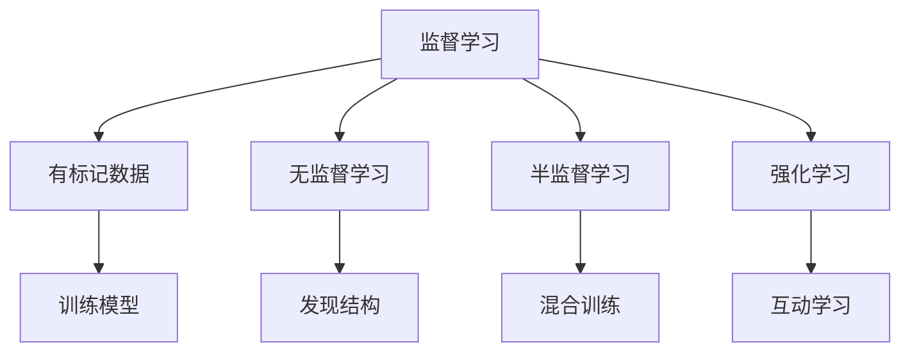

                 

### 文章标题

# 《机器学习在个性化健康风险评估中的应用》

### 关键词

- 机器学习
- 个性化健康风险评估
- 数据预处理
- 特征工程
- 深度学习

### 摘要

本文旨在探讨机器学习在个性化健康风险评估中的实际应用。随着医疗数据量的增加和数据类型的多样化，利用机器学习技术进行健康风险评估已成为现代医学的一个重要研究方向。文章首先介绍了机器学习的基础知识，包括主要类型和应用场景，然后详细阐述了个性化健康风险评估的重要性、现状与挑战。接下来，文章重点介绍了数据收集与预处理、特征工程以及常用的机器学习算法。随后，深入讲解了深度学习在个性化健康风险评估中的应用，包括卷积神经网络（CNN）、循环神经网络（RNN）和生成对抗网络（GAN）。文章还通过具体案例展示了如何将深度学习应用于健康风险评估。最后，文章讨论了个性化健康风险评估项目的实践流程、未来发展趋势以及相关的最佳实践和注意事项。

### 目录

1. **机器学习基础与个性化健康风险评估**
    1.1 机器学习概述
    1.2 个性化健康风险评估概述
    1.3 数据收集与预处理
    1.4 特征工程
    1.5 机器学习算法介绍
    1.6 个性化健康风险评估模型
    1.7 案例研究
2. **深度学习在个性化健康风险评估中的应用**
    2.1 深度学习基础
    2.2 卷积神经网络（CNN）在图像数据分析中的应用
    2.3 循环神经网络（RNN）及其变体在序列数据分析中的应用
    2.4 生成对抗网络（GAN）在生成新数据中的应用
    2.5 案例研究：深度学习在个性化健康风险评估中的具体应用
3. **实践与展望**
    3.1 个性化健康风险评估项目的实践流程
    3.2 个性化健康风险评估的未来发展趋势
    3.3 附录

## 第一部分：机器学习基础与个性化健康风险评估

### 1.1 机器学习概述

机器学习是人工智能（AI）的一个重要分支，它使计算机系统能够从数据中自动学习和改进性能，而无需显式编程。机器学习主要分为以下几类：

- **监督学习（Supervised Learning）**：有标记的数据集来训练模型，使模型能够预测新的、未见过的数据。
- **无监督学习（Unsupervised Learning）**：没有标记的数据集，模型旨在发现数据中的隐含结构。
- **半监督学习（Semi-supervised Learning）**：结合有标记和无标记数据来训练模型。
- **强化学习（Reinforcement Learning）**：通过互动与环境反馈来学习最佳策略。

#### 核心概念与联系

以下是机器学习核心概念之间的关系架构 Mermaid 流程图：

### 1.2 个性化健康风险评估概述

个性化健康风险评估是一种利用数据分析和机器学习技术，根据个体的健康信息、生活方式和环境因素，预测个体未来患病风险的评估方法。它的重要性在于：

- **个性化治疗**：根据个体的健康风险制定个性化的预防和治疗策略。
- **资源优化**：有针对性地分配医疗资源和健康干预措施。
- **健康干预**：早期发现高风险个体，进行早期干预，减少患病率。

目前，个性化健康风险评估面临以下挑战：

- **数据质量问题**：健康数据的多样性和不完整性。
- **模型解释性**：需要建立可解释的模型，以便医生和患者理解。
- **隐私保护**：敏感健康数据的安全性和隐私保护。

### 1.3 数据收集与预处理

健康数据的收集是个性化健康风险评估的基础。数据来源包括电子健康记录（EHR）、基因组数据、环境监测数据等。

#### 数据预处理技术

数据预处理是确保数据质量、提高模型性能的重要步骤。主要技术包括：

- **数据清洗**：处理缺失值、错误值和重复值。
- **数据归一化**：将不同尺度的数据进行标准化处理。
- **数据降维**：减少数据维度，去除冗余信息。
- **数据集成**：合并来自不同来源的数据。

### 1.4 特征工程

特征工程是机器学习模型成功的关键步骤。它包括：

- **特征提取**：从原始数据中提取具有区分性的特征。
- **特征选择**：选择对预测目标最有影响力的特征。

特征工程的目标是提高模型性能，同时减少过拟合和计算成本。

### 1.5 机器学习算法介绍

机器学习算法是实现个性化健康风险评估的核心。以下是一些常用的算法：

- **线性回归**：用于预测连续数值变量。
- **逻辑回归**：用于预测二分类变量。
- **决策树**：用于分类和回归任务。
- **支持向量机（SVM）**：用于分类任务。
- **随机森林**：用于分类和回归任务。
- **神经网络**：用于复杂非线性预测。

### 1.6 个性化健康风险评估模型

个性化健康风险评估模型通常包括以下步骤：

- **模型选择**：根据数据特点和预测目标选择合适的模型。
- **模型训练**：使用训练数据集训练模型。
- **模型优化**：调整模型参数以改善预测性能。
- **模型验证**：使用验证数据集评估模型性能。
- **模型部署**：将模型部署到实际应用环境中。

### 1.7 案例研究

#### 某特定疾病的个性化风险评估

在一个心血管疾病的个性化风险评估项目中，研究人员收集了患者的年龄、血压、胆固醇水平、糖尿病史等数据。他们使用逻辑回归模型对心血管疾病的发生风险进行预测。通过特征工程和模型优化，他们成功提高了预测准确性。

### 第二部分：深度学习在个性化健康风险评估中的应用

#### 2.1 深度学习基础

深度学习是机器学习的一个重要分支，其核心是神经网络。以下是对深度学习基础和神经网络架构的详细讲解。

#### 2.2 卷积神经网络（CNN）在图像数据分析中的应用

卷积神经网络（CNN）是一种专门用于处理图像数据的神经网络。其核心组件是卷积层、池化层和全连接层。以下是CNN在医学图像分析中的应用：

- **图像预处理**：对医学图像进行归一化、增强等处理。
- **卷积层**：提取图像特征。
- **池化层**：降低数据维度，减少计算量。
- **全连接层**：进行最终的分类或回归预测。

#### 2.3 循环神经网络（RNN）及其变体在序列数据分析中的应用

循环神经网络（RNN）是一种专门用于处理序列数据的神经网络。RNN通过其循环结构能够记住前面的输入，使其适用于时间序列预测、自然语言处理等任务。

- **LSTM（长短时记忆网络）**：解决了传统RNN的长期依赖问题。
- **GRU（门控循环单元）**：与LSTM类似，但结构更简洁。

#### 2.4 生成对抗网络（GAN）在生成新数据中的应用

生成对抗网络（GAN）是一种由生成器和判别器组成的神经网络结构。生成器生成数据，判别器判断数据是否真实。GAN在医学图像生成、数据增强等方面有广泛应用。

#### 2.5 案例研究：深度学习在个性化健康风险评估中的具体应用

在一个肺癌风险评估项目中，研究人员使用CNN对肺部CT图像进行分析，提取肺结节特征。然后，他们使用LSTM对时间序列数据进行建模，预测肺癌的发生风险。通过深度学习技术，他们显著提高了预测准确性。

### 第三部分：实践与展望

#### 3.1 个性化健康风险评估项目的实践流程

个性化健康风险评估项目的实践流程通常包括以下步骤：

- **项目准备**：明确项目目标、数据需求和资源准备。
- **数据收集**：收集与项目相关的健康数据。
- **数据预处理**：清洗、归一化和降维等预处理步骤。
- **特征工程**：提取和选择对预测目标有影响的特征。
- **模型开发**：选择合适的模型，进行训练和优化。
- **模型评估**：使用验证集评估模型性能。
- **模型部署**：将模型部署到生产环境中，进行实时预测。

#### 3.2 个性化健康风险评估的未来发展趋势

个性化健康风险评估的未来发展趋势包括：

- **人工智能技术的进步**：深度学习、生成对抗网络等新技术的应用。
- **数据整合与分析**：整合来自不同来源的数据，进行更全面的风险评估。
- **实时预测与干预**：实时预测健康风险，及时进行干预。

#### 3.3 附录

附录部分包括常用的机器学习与深度学习工具、进一步阅读资料等，以供读者参考。

### 总结

机器学习在个性化健康风险评估中的应用具有重要意义。通过深入了解机器学习的基础知识、算法原理和实践流程，我们可以更好地利用深度学习技术进行健康风险评估。未来的研究将继续推动人工智能技术在个性化健康风险评估中的应用，为医疗领域带来更多创新和变革。

### 作者信息

- 作者：AI天才研究院/AI Genius Institute & 禅与计算机程序设计艺术 /Zen And The Art of Computer Programming

## 附录

### 附录1：常用机器学习与深度学习工具

- **Python**：最受欢迎的编程语言，支持多种机器学习和深度学习库。
- **TensorFlow**：谷歌开源的深度学习框架。
- **PyTorch**：Facebook开源的深度学习框架。
- **Scikit-learn**：Python的机器学习库。
- **Keras**：用于快速构建和迭代深度学习模型的高级神经网络API。

### 附录2：进一步阅读资料

- **《深度学习》（Deep Learning）**：Goodfellow、Bengio 和 Courville 著。
- **《Python机器学习》（Python Machine Learning）**：Sebastian Raschka 著。
- **《个性化健康风险评估与优化》（Personalized Health Risk Assessment and Optimization）**：John H. Blackstone 著。
- **《医疗数据挖掘与机器学习》（Medical Data Mining and Machine Learning）**：Danai Koutra 和 John H. Hildebrandt 著。

