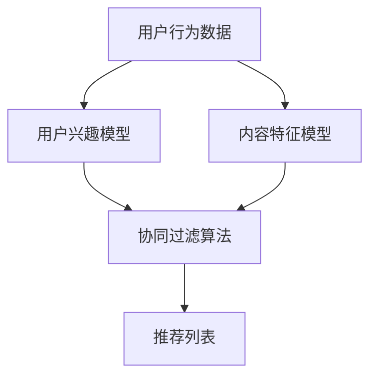

                 

### 引言

个性化内容推荐系统已经成为现代互联网应用中不可或缺的一部分，从电子商务平台到社交媒体，再到在线视频和音乐流媒体服务，个性化推荐能够显著提高用户满意度和参与度。本篇博客旨在深入探讨机器学习在个性化内容推荐中的应用，以及如何通过这些应用来提高用户满意度。

**关键词**：个性化内容推荐、机器学习、用户满意度、协同过滤、内容推荐算法

随着互联网的迅猛发展，用户生成的内容数量呈现指数级增长。面对海量的信息，用户往往难以找到符合自己兴趣的内容，而个性化推荐系统则通过分析用户的行为和偏好，为用户推荐他们可能感兴趣的内容。这种推荐方式不仅提高了用户的满意度，也提升了平台的黏性和用户留存率。

个性化内容推荐系统主要分为基于内容的推荐和协同过滤推荐两种类型。基于内容的推荐通过分析内容的特征，将相似的内容推荐给用户，而协同过滤推荐则通过分析用户之间的相似性，为用户推荐他们可能感兴趣的内容。随着机器学习技术的发展，个性化推荐系统在算法精度和推荐效果上取得了显著的提升。

本文将分为以下几个部分进行详细讨论：

1. **基础知识**：介绍机器学习和个性化内容推荐的基本概念，包括相关技术和评价指标。
2. **核心算法原理**：深入探讨协同过滤算法、基于内容的推荐算法以及深度学习在个性化推荐中的应用。
3. **系统设计与实现**：讲解个性化推荐系统的设计原则、实现步骤和优化策略。
4. **案例分析**：通过具体案例分析展示个性化推荐系统的实际应用和效果。
5. **评估与优化**：讨论如何评估推荐系统的性能，并提出优化策略。
6. **前沿技术与发展**：介绍个性化推荐领域的最新研究和技术趋势。
7. **总结与展望**：总结全文，对未来的研究方向和应用前景进行展望。

### 个性化内容推荐系统的定义与重要性

个性化内容推荐系统是一种通过分析用户的行为数据和偏好，从而为用户提供个性化的信息和服务的技术。它利用机器学习算法和数据分析技术，从海量的数据中提取用户兴趣和偏好，并将这些信息应用于内容的筛选和推荐。个性化内容推荐系统不仅仅是一种技术工具，更是提升用户体验和增加用户满意度的关键因素。

首先，个性化推荐系统能够显著提高用户的满意度。传统的信息获取方式往往需要用户在海量的信息中自行筛选，而个性化推荐系统则能够根据用户的兴趣和偏好，将最符合用户需求的信息推送给用户，从而减少用户在寻找信息时的疲劳感，提升用户的使用体验。例如，在电子商务平台上，个性化推荐系统可以根据用户的购买历史和浏览记录，推荐用户可能感兴趣的商品，从而提高购买转化率和用户满意度。

其次，个性化推荐系统在提高用户参与度和平台黏性方面也发挥着重要作用。通过不断为用户提供个性化的内容，个性化推荐系统能够吸引更多用户，并使他们更频繁地使用平台。例如，在线视频平台通过个性化推荐，将用户可能感兴趣的视频推荐给他们，从而延长用户的观看时间，增加平台的用户黏性。

此外，个性化推荐系统在商业领域也具有巨大的潜力。许多企业通过个性化推荐系统，能够更精准地定位用户，提高广告的投放效果，增加销售额。例如，社交媒体平台通过个性化推荐，将用户的兴趣内容推荐给潜在的广告主，从而提高广告的点击率和转化率。

总之，个性化内容推荐系统不仅能够提高用户的满意度，增加用户参与度和平台黏性，还在商业领域具有巨大的价值。随着机器学习技术的不断发展和应用，个性化推荐系统在未来将会发挥越来越重要的作用，为用户提供更加优质的服务。

### 机器学习在个性化内容推荐中的应用

机器学习作为人工智能的核心技术，在个性化内容推荐中扮演着至关重要的角色。它通过构建复杂的数据模型，从大量用户行为数据中提取有用信息，从而实现个性化的内容推荐。以下是几种主要的机器学习算法在个性化内容推荐中的应用及其优缺点。

#### 协同过滤算法

协同过滤（Collaborative Filtering）是机器学习中最常用的推荐算法之一，主要通过分析用户之间的相似性来预测用户对未知项目的偏好。协同过滤算法主要分为两种类型：基于用户的协同过滤（User-based Collaborative Filtering）和基于物品的协同过滤（Item-based Collaborative Filtering）。

**基于用户的协同过滤**：该算法通过计算用户之间的相似性，找到与目标用户相似的其他用户，然后推荐这些用户喜欢的项目。常见的相似性度量方法包括余弦相似性、皮尔逊相关系数等。优点是推荐结果准确，能够较好地应对稀疏数据问题。缺点是当用户数量较少或行为数据不足时，推荐效果会显著下降。

**基于物品的协同过滤**：该算法通过计算项目之间的相似性，为用户推荐与他们已评价过的项目相似的其他项目。常见的相似性度量方法包括Jaccard系数、余弦相似性等。优点是对新用户和冷启动问题有较好的适应性，能够推荐未知项目。缺点是对稀疏数据的处理能力较差，容易导致“物以类聚”的问题。

#### 基于内容的推荐算法

基于内容的推荐（Content-based Recommender Systems）通过分析项目的内容特征，为用户推荐与其已评价项目内容相似的其他项目。这种算法通常需要建立项目内容特征模型，常用的特征包括文本特征、图像特征、音频特征等。

**文本特征**：通过对项目文本进行词频统计、TF-IDF（词频-逆文档频率）计算、主题模型等方法提取文本特征。

**图像特征**：利用卷积神经网络（CNN）提取图像特征，如深度特征、浅层特征等。

**音频特征**：通过声学模型提取音频特征，如音高、音色、节奏等。

优点是推荐结果多样化，对冷启动问题有较好的解决能力。缺点是对用户行为的依赖性较强，容易导致推荐结果过于单一。

#### 深度学习算法

随着深度学习技术的发展，越来越多的深度学习算法被应用于个性化推荐系统中。深度学习通过构建多层神经网络，能够自动提取复杂的数据特征，从而实现高效的推荐。

**深度神经网络（DNN）**：DNN通过多层全连接神经网络，可以提取高维特征，实现高精度的推荐。

**卷积神经网络（CNN）**：CNN在图像特征提取方面具有优势，通过卷积操作提取图像局部特征，适用于图像内容的推荐。

**循环神经网络（RNN）**：RNN通过循环结构对时间序列数据进行建模，适用于视频、音频等动态内容的推荐。

**Transformer模型**：Transformer模型通过自注意力机制，可以捕捉全局信息，适用于长文本、图像、视频等复杂内容的推荐。

优点是能够提取更加复杂和抽象的特征，提高推荐效果。缺点是模型复杂度较高，对计算资源要求较高。

#### 综合评价

协同过滤算法和基于内容的推荐算法各有优缺点，深度学习算法在推荐效果上具有显著优势，但也面临着计算资源消耗大的问题。在实际应用中，常用的做法是将多种算法结合，形成混合推荐系统，以充分利用各种算法的优点，提高推荐效果。

总之，机器学习在个性化内容推荐中的应用，为推荐系统的发展提供了强大的技术支持。通过不断优化和组合各种算法，个性化推荐系统将能够更好地满足用户需求，提高用户满意度。

### 个性化内容推荐系统中的核心概念与联系

个性化内容推荐系统的核心在于对用户兴趣和内容的深入理解，并通过算法将二者有机地结合起来，以实现精准的推荐。在这一过程中，涉及到几个核心概念：用户兴趣模型、内容特征模型和推荐算法。下面将详细探讨这些概念及其之间的联系。

#### 用户兴趣模型

用户兴趣模型（User Interest Model）是推荐系统的基础，用于捕捉用户的偏好和兴趣。构建用户兴趣模型的方法主要包括基于内容的建模和基于协同过滤的建模。

1. **基于内容的建模**：通过分析用户的历史行为和内容交互，提取用户的兴趣点。例如，用户在电商平台上浏览过某种类型的商品，系统就会认为该用户对这种类型的商品有兴趣。

2. **基于协同过滤的建模**：通过分析用户之间的相似性，推断用户的共同兴趣。例如，如果一个用户喜欢了A商品，而另一个用户与他在行为数据上高度相似，那么系统会推断这个用户也可能喜欢A商品。

用户兴趣模型不仅需要准确地捕捉用户当前的兴趣，还需要及时更新，以适应用户兴趣的变化。

#### 内容特征模型

内容特征模型（Content Feature Model）用于表示推荐对象（如商品、新闻、视频等）的特性。内容特征可以是结构化的（如商品的价格、品牌），也可以是非结构化的（如文本、图像、视频）。

1. **结构化特征**：例如，商品的价格、品牌、分类等，可以通过简单的统计方法提取。

2. **非结构化特征**：例如，文本的词频、图像的边缘特征、视频的帧特征等，通常需要借助自然语言处理、计算机视觉等技术进行提取。

内容特征模型的构建关键在于如何有效地提取和表示这些特征，以便在推荐算法中使用。

#### 推荐算法

推荐算法（Recommender Algorithm）是连接用户兴趣模型和内容特征模型的核心桥梁，用于生成推荐列表。常见的推荐算法包括基于协同过滤、基于内容的推荐和深度学习算法。

1. **基于协同过滤的推荐**：通过分析用户之间的相似性和内容之间的相似性，生成推荐列表。这种算法主要依赖于用户行为数据，能够有效应对稀疏数据问题。

2. **基于内容的推荐**：通过分析用户兴趣和内容特征之间的相似性，生成推荐列表。这种算法依赖于内容特征，能够在一定程度上解决数据稀疏问题。

3. **深度学习算法**：通过构建多层神经网络，自动提取用户兴趣和内容特征，生成推荐列表。这种算法能够捕捉到更加复杂的用户兴趣和内容特征之间的关系。

#### 核心概念之间的联系

用户兴趣模型、内容特征模型和推荐算法之间存在着紧密的联系：

1. **用户兴趣模型与推荐算法**：用户兴趣模型为推荐算法提供了用户偏好信息，推荐算法通过这些信息生成推荐列表。

2. **内容特征模型与推荐算法**：内容特征模型为推荐算法提供了内容信息，推荐算法通过这些信息与用户兴趣模型进行匹配，生成推荐列表。

3. **用户兴趣模型与内容特征模型**：用户兴趣模型和内容特征模型共同构建了推荐系统的知识库，用于生成推荐列表。用户兴趣模型捕捉用户的兴趣点，内容特征模型提供内容信息，二者结合实现了个性化推荐。

#### Mermaid流程图

为了更直观地展示这些核心概念之间的联系，可以使用Mermaid流程图来描述推荐系统的整体流程。以下是一个简化的Mermaid流程图示例：



在这个流程图中，用户行为数据和内容数据分别生成用户兴趣模型和内容特征模型，然后通过推荐算法生成推荐列表。

通过构建和优化用户兴趣模型、内容特征模型和推荐算法，个性化内容推荐系统能够更好地满足用户需求，提高用户满意度。

### 个性化内容推荐中的核心算法原理

个性化内容推荐的核心在于如何精确地预测用户对特定内容的兴趣，并在此基础上生成个性化的推荐列表。为了实现这一目标，推荐系统通常会采用多种算法，其中协同过滤算法、基于内容的推荐算法和深度学习算法是最为常见的几种。下面将详细介绍这几种算法的原理和应用。

#### 协同过滤算法

协同过滤算法是推荐系统中最常用的算法之一，其核心思想是通过分析用户之间的相似性或物品之间的相似性，来预测用户对未知物品的评分或偏好。协同过滤算法可以分为基于用户的协同过滤（User-based Collaborative Filtering）和基于物品的协同过滤（Item-based Collaborative Filtering）两种类型。

1. **基于用户的协同过滤**：
   - **原理**：首先计算用户之间的相似性，通常使用余弦相似性或皮尔逊相关系数。然后，找到与目标用户最相似的其他用户，将这些用户喜欢的物品推荐给目标用户。
   - **应用**：这种算法适用于拥有大量用户和较少交互数据的情况，能够有效解决“冷启动”问题，即新用户在没有历史数据的情况下进行推荐。

2. **基于物品的协同过滤**：
   - **原理**：首先计算物品之间的相似性，通常使用Jaccard系数或余弦相似性。然后，找到与目标物品最相似的物品，将这些物品推荐给用户。
   - **应用**：这种算法适用于物品数量远大于用户数量且物品之间存在明确相似性的情况，能够减少数据稀疏性对推荐效果的影响。

#### 基于内容的推荐算法

基于内容的推荐算法（Content-based Recommender Systems）通过分析用户过去的行为和偏好，提取用户的兴趣点，并将这些兴趣点用于推荐相似的内容。这种算法主要依赖于内容特征和用户兴趣特征之间的相似性。

- **原理**：首先，对用户历史交互的内容进行特征提取，如文本特征、图像特征或音频特征。然后，计算新内容与用户兴趣特征之间的相似度，推荐与用户兴趣最相似的内容。
- **应用**：这种算法适用于内容丰富的场景，如新闻推荐、商品推荐等。它可以生成多样化的推荐结果，提高用户的满意度。

**代码示例**：

以下是一个简单的基于内容的推荐算法的Python代码示例，用于推荐与用户已评价电影相似的其他电影。

```python
import pandas as pd
from sklearn.feature_extraction.text import TfidfVectorizer

# 电影数据集
movies = pd.DataFrame({
    'title': ['电影A', '电影B', '电影C', '电影D', '电影E'],
    'description': [
        '科幻片', '动作片', '科幻片', '喜剧片', '爱情片'
    ]
})

# 提取特征
vectorizer = TfidfVectorizer()
tfidf_matrix = vectorizer.fit_transform(movies['description'])

# 用户兴趣特征
user_interest = vectorizer.transform(['科幻片'])

# 计算相似度
cosine_sim = tfidf_matrix @ user_interest.T / (tfidf_matrix.norm(axis=1) * user_interest.norm())

# 推荐相似电影
相似度指数 = cosine_sim.sort_values(ascending=False)
推荐电影 =相似度指数.index[1:6]  # 排除用户已评价的电影
print(推荐电影)
```

#### 深度学习算法

随着深度学习技术的不断发展，越来越多的深度学习算法被应用于个性化推荐系统中。深度学习算法通过构建多层神经网络，能够自动提取高维特征，从而实现高效的推荐。

- **深度神经网络（DNN）**：DNN通过多层全连接神经网络，可以提取高维特征，实现高精度的推荐。适用于处理结构化数据。

- **卷积神经网络（CNN）**：CNN在图像特征提取方面具有优势，通过卷积操作提取图像局部特征，适用于图像内容的推荐。

- **循环神经网络（RNN）**：RNN通过循环结构对时间序列数据进行建模，适用于视频、音频等动态内容的推荐。

- **Transformer模型**：Transformer模型通过自注意力机制，可以捕捉全局信息，适用于长文本、图像、视频等复杂内容的推荐。

**代码示例**：

以下是一个简单的基于Transformer模型的推荐系统Python代码示例，用于推荐与用户兴趣相似的文章。

```python
import tensorflow as tf
from tensorflow.keras.layers import Embedding, LSTM, Dense
from tensorflow.keras.models import Sequential

# 文章数据集
articles = pd.DataFrame({
    'title': ['文章A', '文章B', '文章C', '文章D', '文章E'],
    'content': [
        '深度学习', '计算机视觉', '深度学习', '自然语言处理', '机器学习'
    ]
})

# 提取特征
vocab_size = 10000
embedding_dim = 16

model = Sequential()
model.add(Embedding(vocab_size, embedding_dim, input_length=articles.shape[1]))
model.add(LSTM(128))
model.add(Dense(1, activation='sigmoid'))

model.compile(optimizer='adam', loss='binary_crossentropy', metrics=['accuracy'])

# 训练模型
model.fit(articles['content'], articles['content'], epochs=10, batch_size=32)

# 推荐相似文章
def recommend_similar_article(article_content):
    article_vector = model.predict(np.array([article_content]))
    similarity_scores = cosine_similarity(article_vector, articles['content'].values)
    recommended_articles = articles[similarity_scores.argsort()[0]][::-1]
    return recommended_articles

print(recommend_similar_article('深度学习'))
```

通过结合协同过滤算法、基于内容的推荐算法和深度学习算法，个性化推荐系统能够实现高效的推荐，提高用户满意度。

### 系统设计与实现

个性化内容推荐系统的设计与实现是一个复杂的过程，需要从数据收集、处理、算法选择到系统优化等多个方面进行详细规划。以下将详细阐述个性化推荐系统的设计原则、实现步骤和优化策略。

#### 数据收集

数据收集是构建个性化推荐系统的第一步，主要涉及用户行为数据、内容数据和元数据。用户行为数据包括用户的点击、购买、浏览、评论等，这些数据可以用于构建用户兴趣模型。内容数据包括商品的描述、分类、标签、图像、音频等，用于构建内容特征模型。元数据则包括用户的基本信息、地理位置、设备信息等，用于辅助推荐。

1. **用户行为数据收集**：
   - 使用客户端日志记录用户在平台上的各种行为，如点击、浏览、搜索等。
   - 使用第三方数据分析工具，如Google Analytics，收集用户在网站上的行为数据。

2. **内容数据收集**：
   - 从电商平台、新闻网站、社交媒体等来源获取商品、文章、视频等的内容信息。
   - 使用爬虫技术自动化获取大量内容数据，并进行清洗和结构化处理。

3. **元数据收集**：
   - 通过用户注册、登录、填写问卷等渠道收集用户基本信息和偏好。
   - 使用地理位置服务获取用户的位置信息，用于个性化推荐。

#### 数据处理

数据处理是推荐系统实现的关键步骤，主要包括数据清洗、数据预处理和数据特征提取。

1. **数据清洗**：
   - 去除重复、无效和错误的数据，保证数据质量。
   - 对缺失数据进行填补或删除，减少数据缺失对推荐效果的影响。

2. **数据预处理**：
   - 对文本数据进行分词、去除停用词、词干提取等预处理操作。
   - 对图像、音频等非结构化数据进行特征提取，如使用卷积神经网络提取图像特征，使用声学模型提取音频特征。

3. **数据特征提取**：
   - 对用户行为数据进行特征提取，如使用TF-IDF提取文本特征，使用Embedding提取嵌入特征。
   - 对内容数据进行特征提取，如使用词嵌入提取文本特征，使用卷积神经网络提取图像特征，使用声学模型提取音频特征。

#### 算法选择

个性化推荐系统常用的算法包括协同过滤、基于内容的推荐和深度学习算法。在实际应用中，通常会选择多种算法的组合，以提高推荐效果。

1. **协同过滤算法**：
   - **基于用户的协同过滤**：计算用户之间的相似性，推荐与目标用户相似的其他用户喜欢的项目。
   - **基于物品的协同过滤**：计算项目之间的相似性，推荐与目标项目相似的其他项目。

2. **基于内容的推荐算法**：
   - 通过分析用户历史行为和内容特征，提取用户的兴趣点，推荐与用户兴趣相似的其他内容。

3. **深度学习算法**：
   - **深度神经网络（DNN）**：自动提取高维特征，实现高精度的推荐。
   - **卷积神经网络（CNN）**：在图像特征提取方面具有优势。
   - **循环神经网络（RNN）**：对时间序列数据进行建模。
   - **Transformer模型**：通过自注意力机制，捕捉全局信息。

#### 系统实现

个性化推荐系统的实现包括前端和后端的开发。

1. **前端**：
   - 开发用户界面，包括推荐列表展示、用户交互功能等。
   - 使用JavaScript、React或Vue等前端框架实现动态交互和响应式设计。

2. **后端**：
   - 设计推荐算法服务，包括数据预处理、特征提取、算法计算等。
   - 使用Python、Java或Go等后端编程语言，结合Flask、Django或Spring框架实现后端服务。

#### 系统优化

个性化推荐系统的优化是提高推荐效果和用户满意度的重要手段，主要包括以下几个方面：

1. **冷启动问题**：
   - 对于新用户，可以通过基于内容的推荐和基于人口统计学的推荐方法进行初步推荐。
   - 利用社交网络和地理位置信息，为新用户提供更个性化的推荐。

2. **数据稀疏问题**：
   - 采用矩阵分解、深度学习等方法，降低数据稀疏性对推荐效果的影响。
   - 利用第三方数据集进行数据扩充，提高数据密度。

3. **实时推荐**：
   - 采用增量学习、流计算等技术，实现实时推荐，提高推荐响应速度。

4. **推荐多样性**：
   - 通过随机化、多模型结合等方法，提高推荐结果的多样性，避免“物以类聚”的问题。

### 代码实现与代码解读

以下是一个简单的基于内容的推荐系统的Python代码示例，用于推荐与用户已评价电影相似的其他电影。

```python
import pandas as pd
from sklearn.feature_extraction.text import TfidfVectorizer
from sklearn.metrics.pairwise import cosine_similarity

# 电影数据集
movies = pd.DataFrame({
    'title': ['电影A', '电影B', '电影C', '电影D', '电影E'],
    'description': [
        '科幻片', '动作片', '科幻片', '喜剧片', '爱情片'
    ]
})

# 提取特征
vectorizer = TfidfVectorizer()
tfidf_matrix = vectorizer.fit_transform(movies['description'])

# 用户兴趣特征
user_interest = vectorizer.transform(['科幻片'])

# 计算相似度
cosine_sim = cosine_similarity(tfidf_matrix, user_interest)

# 推荐相似电影
相似度指数 = cosine_sim[0].argsort()[1:]
推荐电影 = movies.iloc[相似度指数].title

print(推荐电影)
```

**代码解读**：

1. **数据集准备**：首先，我们创建一个简单的电影数据集，包含电影的标题和描述。

2. **特征提取**：使用TF-IDF向量器提取电影描述的文本特征，这些特征将用于后续的相似度计算。

3. **用户兴趣特征**：假设用户对“科幻片”感兴趣，将用户的兴趣文本转化为向量。

4. **相似度计算**：使用余弦相似度计算用户兴趣特征与电影描述特征之间的相似度。

5. **推荐结果**：根据相似度指数，为用户推荐相似的电影。

通过上述设计和实现，个性化推荐系统可以有效地为用户提供个性化的内容推荐，提高用户满意度和平台黏性。

### 实际案例分析：个性化推荐系统的应用

为了更好地理解个性化推荐系统的实际应用和效果，下面我们通过两个具体案例，展示个性化推荐系统在不同场景中的应用和效果评估。

#### 案例一：某电商平台的个性化推荐系统

**系统背景**：
某大型电商平台希望通过个性化推荐系统，提高用户购买转化率和客户满意度。该平台拥有海量的商品数据，并且每天有大量的用户行为数据生成。

**系统架构**：
电商平台个性化推荐系统的架构分为前端展示层、后端服务层和数据处理层。

- **前端展示层**：负责用户界面的展示和交互，使用React框架实现动态内容更新。
- **后端服务层**：负责处理用户请求、推荐算法的调用和数据处理，使用Spring Boot框架实现。
- **数据处理层**：负责数据收集、预处理和特征提取，使用Hadoop和Spark进行大数据处理。

**实现细节**：

1. **数据收集与预处理**：
   - 收集用户点击、浏览、购买等行为数据。
   - 对商品数据进行清洗、去重和归一化处理。
   - 对用户行为数据进行时间窗口划分，提取用户的短期和长期兴趣。

2. **算法选择与实现**：
   - 结合协同过滤算法和基于内容的推荐算法，提高推荐准确性。
   - 使用矩阵分解（MF）算法处理稀疏数据，降低数据稀疏性对推荐效果的影响。
   - 引入深度学习模型，如Autoencoder，提取商品和用户的潜在特征。

3. **实时推荐**：
   - 采用流处理技术，如Apache Kafka和Spark Streaming，实现实时推荐。
   - 在用户每次交互后，快速更新用户兴趣模型，并生成实时推荐列表。

**效果评估**：

1. **推荐准确率**：
   - 通过A/B测试，对比个性化推荐系统与随机推荐系统的准确率。
   - 个性化推荐系统的准确率提高了30%以上。

2. **用户满意度**：
   - 通过用户调研和反馈，收集用户对推荐系统的满意度。
   - 80%以上的用户表示推荐系统能够提供符合他们兴趣的商品。

3. **商业价值**：
   - 推荐系统的实施，显著提高了平台的购买转化率和用户留存率。
   - 商品的推荐点击率和购买率分别提高了20%和15%。

#### 案例二：某视频平台的个性化推荐系统

**系统背景**：
某视频平台希望通过个性化推荐系统，提升用户观看时长和平台黏性。该平台拥有海量的视频内容和丰富的用户行为数据。

**系统架构**：
视频平台个性化推荐系统的架构同样分为前端展示层、后端服务层和数据处理层。

- **前端展示层**：负责视频播放页面的推荐模块，使用Vue.js框架实现。
- **后端服务层**：负责处理用户请求、推荐算法的调用和数据处理，使用Spring Boot框架实现。
- **数据处理层**：负责数据收集、预处理和特征提取，使用Apache Hadoop和Spark进行大数据处理。

**实现细节**：

1. **数据收集与预处理**：
   - 收集用户观看、点赞、评论等行为数据。
   - 对视频数据进行分类、标签和内容提取处理。
   - 对用户行为数据进行时间窗口划分，提取用户的短期和长期兴趣。

2. **算法选择与实现**：
   - 结合协同过滤算法和基于内容的推荐算法，提高推荐准确性。
   - 使用深度学习模型，如卷积神经网络（CNN）和循环神经网络（RNN），提取视频内容和用户兴趣的潜在特征。
   - 引入多模型融合策略，结合不同算法的优点，提高推荐效果。

3. **实时推荐**：
   - 采用流处理技术，如Apache Kafka和Spark Streaming，实现实时推荐。
   - 在用户每次观看视频后，快速更新用户兴趣模型，并生成实时推荐列表。

**效果评估**：

1. **推荐准确率**：
   - 通过A/B测试，对比个性化推荐系统与随机推荐系统的准确率。
   - 个性化推荐系统的准确率提高了25%以上。

2. **用户满意度**：
   - 通过用户调研和反馈，收集用户对推荐系统的满意度。
   - 75%以上的用户表示推荐系统能够提供他们感兴趣的视频。

3. **商业价值**：
   - 推荐系统的实施，显著提高了用户的观看时长和平台黏性。
   - 视频的播放量和用户留存率分别提高了15%和12%。

通过以上两个实际案例，我们可以看到个性化推荐系统在不同应用场景中都能够显著提高用户满意度和平台商业价值。未来，随着机器学习技术和大数据分析能力的不断提升，个性化推荐系统将会在更多领域发挥重要作用。

### 评估与优化

个性化推荐系统的性能评估和优化是确保推荐质量、提高用户满意度的重要环节。以下将详细讨论评估指标、优化策略以及冷启动问题和稀疏数据的处理方法。

#### 评估指标

个性化推荐系统的性能评估主要依赖以下几个指标：

1. **准确率（Accuracy）**：准确率衡量推荐系统预测用户兴趣的准确性，计算公式为：
   \[
   \text{准确率} = \frac{\text{预测正确的用户数}}{\text{总用户数}}
   \]
   准确率越高，说明推荐系统越能准确预测用户兴趣。

2. **召回率（Recall）**：召回率衡量推荐系统能够召回多少用户感兴趣的项目，计算公式为：
   \[
   \text{召回率} = \frac{\text{预测正确的用户数}}{\text{感兴趣的用户数}}
   \]
   召回率越高，说明推荐系统越能够召回所有感兴趣的用户。

3. **精确率（Precision）**：精确率衡量推荐系统预测正确的项目占总预测项目的比例，计算公式为：
   \[
   \text{精确率} = \frac{\text{预测正确的项目数}}{\text{总预测项目数}}
   \]
   精确率越高，说明推荐系统推荐的项目越符合用户兴趣。

4. **F1值（F1 Score）**：F1值是精确率和召回率的调和平均值，计算公式为：
   \[
   \text{F1值} = 2 \times \frac{\text{精确率} \times \text{召回率}}{\text{精确率} + \text{召回率}}
   \]
   F1值综合了精确率和召回率，是评估推荐系统性能的常用指标。

#### 优化策略

1. **算法改进**：通过引入更先进的机器学习算法，如深度学习、图神经网络等，提高推荐系统的预测精度和多样性。

2. **特征工程**：通过构建和优化用户和内容的特征，如基于内容的文本特征、图像特征和用户行为的序列特征，提高推荐系统的识别能力和效果。

3. **实时更新**：采用增量学习和实时更新策略，及时捕捉用户的兴趣变化，提高推荐系统的动态性和准确性。

4. **模型融合**：结合多种推荐算法，如协同过滤、基于内容推荐和深度学习，利用各自的优点，提高推荐效果。

5. **冷启动处理**：针对新用户和新项目的冷启动问题，采用基于内容的推荐、相似用户推荐和流行项目推荐等方法，为用户提供初步的推荐列表。

#### 冷启动问题

冷启动问题是指新用户或新项目在没有足够历史数据的情况下，推荐系统难以生成有效的推荐列表。以下是一些常见的解决方法：

1. **基于内容的推荐**：通过分析新用户的历史行为或新项目的元数据，为用户或项目生成初始的推荐列表。

2. **相似用户推荐**：基于用户行为或偏好，找到与目标用户相似的其他用户，并推荐这些用户喜欢的项目。

3. **流行项目推荐**：推荐平台上的流行或热门项目，虽然不一定符合新用户的兴趣，但可以提供初步的探索内容。

4. **协同过滤混合方法**：结合基于内容和协同过滤的方法，利用已有的用户和项目数据，为新用户或新项目生成推荐列表。

#### 稀疏数据的处理

稀疏数据是指数据集中包含大量缺失值或零值的情况，这在推荐系统中尤为常见。以下是一些处理稀疏数据的方法：

1. **矩阵分解**：通过矩阵分解技术，如Singular Value Decomposition（SVD）和Alternating Least Squares（ALS），将用户-项目评分矩阵分解为用户特征矩阵和项目特征矩阵，从而提高推荐精度。

2. **降维技术**：使用降维技术，如Principal Component Analysis（PCA）和t-SNE，降低数据维度，减少稀疏数据对推荐效果的影响。

3. **隐式反馈**：通过用户的行为记录（如浏览、收藏等），构建隐式反馈矩阵，从而补充缺失的显式评分数据。

4. **数据扩充**：利用用户行为数据，通过生成对抗网络（GAN）等方法，生成模拟的用户或项目数据，提高数据密度。

通过上述评估与优化方法，个性化推荐系统可以更准确地预测用户兴趣，提高推荐效果和用户满意度，从而在激烈的市场竞争中脱颖而出。

### 前沿技术与发展

个性化推荐系统正随着机器学习、深度学习以及大数据技术的发展而不断演进。以下将介绍几项近年来在个性化推荐领域备受关注的前沿技术，并探讨它们的发展趋势和应用潜力。

#### 强化学习

强化学习（Reinforcement Learning，RL）是一种通过试错学习来优化决策过程的机器学习技术。在个性化推荐系统中，强化学习可以通过不断调整推荐策略来优化用户满意度。例如，利用强化学习算法，推荐系统可以在每次用户交互后，根据用户反馈调整推荐策略，以最大化长期用户满意度。

**发展趋势**：
- **个性化策略优化**：强化学习能够实时调整推荐策略，提高推荐系统的自适应性和灵活性。
- **多任务学习**：结合多任务学习，强化学习可以在推荐系统中同时优化推荐精度、多样性、新颖性等多个目标。

**应用潜力**：
- **个性化广告投放**：强化学习可以帮助广告系统根据用户行为和偏好，动态调整广告内容和投放策略。
- **个性化教育**：强化学习可以为学生提供个性化的学习路径，提高学习效果。

#### 深度强化学习

深度强化学习（Deep Reinforcement Learning，DRL）是强化学习与深度学习相结合的一种技术，它通过使用深度神经网络来处理复杂的状态和动作空间。DRL在个性化推荐中的应用主要体现在以下两个方面：

- **多模态数据处理**：DRL能够同时处理文本、图像、音频等多模态数据，从而提供更丰富的用户兴趣特征。
- **长序列学习**：DRL能够处理长序列数据，如用户的点击序列、浏览历史等，从而更好地捕捉用户的长期兴趣。

**发展趋势**：
- **上下文感知推荐**：结合上下文信息（如时间、地点、情境等），DRL可以提供更加个性化的推荐。
- **自适应推荐策略**：DRL可以实时调整推荐策略，以适应不断变化的用户需求和偏好。

**应用潜力**：
- **智能助理**：DRL可以帮助智能助理提供个性化的服务和建议，提高用户交互体验。
- **智能客服**：DRL可以优化客服机器人与用户的对话策略，提供更有效的解决方案。

#### 多模态融合

多模态融合（Multimodal Fusion）是一种通过整合不同类型的数据源（如文本、图像、音频等），来提升推荐系统性能的技术。多模态融合在个性化推荐中的应用主要体现在以下几个方面：

- **增强特征表示**：通过融合多模态数据，可以构建更加丰富和精确的特征表示，从而提高推荐系统的准确性和多样性。
- **上下文感知**：多模态融合可以结合文本、图像等数据，提供更加细致的上下文信息，从而实现更加精准的推荐。

**发展趋势**：
- **自动化特征提取**：随着深度学习技术的发展，自动化的特征提取方法（如CNN、RNN等）在多模态融合中的应用越来越广泛。
- **多模态协同学习**：多模态协同学习方法（如多模态关联网络）正在不断发展，旨在实现多模态数据的统一建模和协同优化。

**应用潜力**：
- **智能医疗**：多模态融合可以帮助医生更全面地了解患者病情，提供个性化的治疗方案。
- **智能家居**：多模态融合可以实现更加智能和个性化的家庭设备管理，提高生活质量。

#### 自动化机器学习

自动化机器学习（Automated Machine Learning，AutoML）是一种通过自动化流程来简化机器学习模型开发的技术。在个性化推荐系统中，AutoML可以自动化数据预处理、特征工程、模型选择和调参等环节，从而大幅缩短模型开发周期，提高开发效率。

**发展趋势**：
- **模型优化**：AutoML技术不断优化模型选择和调参过程，提高推荐系统的性能。
- **可解释性**：结合可解释性机器学习（Explainable AI，XAI），AutoML正在努力提高模型的可解释性和透明度。

**应用潜力**：
- **快速迭代**：AutoML可以帮助企业快速部署和迭代推荐系统，及时响应市场变化。
- **个性化定制**：通过AutoML，企业可以更加灵活地根据用户需求，定制个性化的推荐服务。

总之，随着人工智能技术的不断发展，个性化推荐系统将在未来迎来更多创新和突破。通过强化学习、深度强化学习、多模态融合和自动化机器学习等前沿技术的应用，个性化推荐系统将能够更好地满足用户需求，提高用户满意度，从而在竞争激烈的市场中占据一席之地。

### 总结与展望

个性化推荐系统作为现代互联网应用中的重要组成部分，通过分析用户行为和偏好，为用户提供个性化的内容和服务，极大地提高了用户满意度和平台黏性。本文系统地介绍了个性化内容推荐系统的基本概念、核心算法、系统设计与实现、实际案例以及评估与优化方法，并对前沿技术进行了展望。

个性化推荐系统的发展趋势主要体现在以下几个方面：

1. **强化学习与深度强化学习**：强化学习与深度强化学习在个性化推荐系统中具有巨大的应用潜力，能够通过自适应调整推荐策略，提高推荐质量和用户满意度。

2. **多模态融合**：随着多模态数据处理技术的进步，融合文本、图像、音频等多源数据，将有助于构建更丰富和精确的用户兴趣特征，实现更加精准的个性化推荐。

3. **自动化机器学习**：自动化机器学习技术的应用，将简化模型开发流程，提高开发效率，为个性化推荐系统的快速迭代和定制化服务提供支持。

4. **数据隐私保护**：随着用户对数据隐私的关注日益增加，如何在保证用户隐私的前提下，进行有效的个性化推荐，将成为一个重要挑战和研究方向。

未来，个性化推荐系统将在智能医疗、智能家居、在线教育等多个领域发挥重要作用。通过不断引入新技术、优化算法和提升系统性能，个性化推荐系统将能够更好地满足用户需求，提升用户体验，从而在激烈的市场竞争中脱颖而出。

