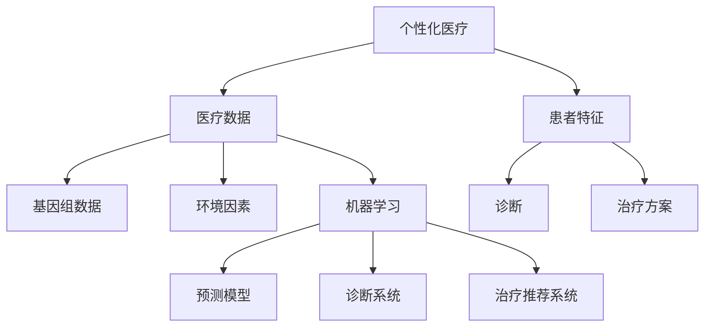
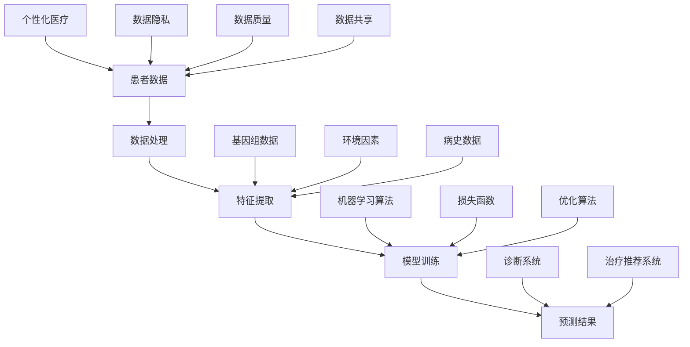

                 

### 引言

个性化医疗（Personalized Medicine）是一种以个体为中心的医疗模式，通过整合患者的遗传信息、生活方式和环境因素，为每个患者提供个性化的诊断、预防和治疗方案。随着医疗数据的爆炸式增长和计算能力的提升，机器学习（Machine Learning，ML）在个性化医疗中的应用逐渐成为研究热点。

#### 1.1 个性化医疗的重要性

个性化医疗的重要性体现在以下几个方面：

1. **提高治疗效果**：通过分析患者的基因、环境和病史，个性化医疗能够为患者提供更精确的治疗方案，从而提高治疗效果。
2. **减少药物副作用**：个性化医疗可以根据患者的个体差异，选择最适合的药物和剂量，从而减少药物的副作用。
3. **降低医疗成本**：通过个性化预防措施，个性化医疗可以提前发现疾病，降低医疗成本。

#### 1.2 机器学习与个性化医疗的结合

机器学习在个性化医疗中的应用主要体现在以下几个方面：

1. **预测疾病风险**：通过分析患者的基因、环境和病史数据，机器学习模型可以预测患者患某种疾病的风险，从而为医生提供决策支持。
2. **个性化诊断**：机器学习可以帮助医生从大量医疗数据中提取关键信息，提高诊断的准确性和效率。
3. **个性化治疗**：机器学习可以根据患者的病情和治疗效果，为医生提供个性化的治疗方案，提高治疗效果。

#### 1.3 本书的目的与结构

本书旨在介绍机器学习在个性化医疗中的应用，包括基础概念、核心技术、应用案例、挑战与未来发展趋势。具体结构如下：

- **引言**：介绍个性化医疗和机器学习的基本概念。
- **基础概念**：介绍机器学习和个性化医疗的相关基础概念。
- **核心技术**：介绍在个性化医疗中常用的机器学习技术。
- **应用案例**：分析机器学习在个性化医疗中的实际应用案例。
- **挑战与未来**：探讨个性化医疗中机器学习面临的挑战和未来发展趋势。

通过本书的阅读，读者将能够深入了解机器学习在个性化医疗中的应用，掌握相关技术和方法，为未来的研究和实践提供参考。

关键词：个性化医疗、机器学习、医学诊断、疾病预测、个性化治疗

摘要：本书介绍了机器学习在个性化医疗中的应用，从基础概念、核心技术、应用案例和挑战与未来发展趋势四个方面进行了详细阐述。通过本书的学习，读者将能够掌握机器学习在个性化医疗中的基本原理和应用方法，为个性化医疗的研究和实践提供指导。

---

**核心概念与联系**

在探讨个性化医疗与机器学习的结合时，我们首先需要明确两个核心概念：个性化医疗和机器学习。以下是这两个概念之间的关系架构：



- **个性化医疗**：以患者为中心，通过分析患者的基因、环境和病史等数据，为患者提供个性化的诊断、预防和治疗方案。
- **机器学习**：利用大量数据构建预测模型，通过对数据的分析和学习，为个性化医疗提供技术支持。
- **医疗数据**：包括基因组数据、环境因素、患者特征等，是机器学习模型的输入。
- **预测模型**：基于机器学习算法构建，用于预测疾病风险、诊断结果和治疗效果。
- **诊断系统**：利用机器学习模型，帮助医生从大量医疗数据中提取关键信息，提高诊断的准确性和效率。
- **治疗推荐系统**：根据患者的病情和治疗效果，为医生提供个性化的治疗方案。

通过上述核心概念与联系，我们可以清晰地看到个性化医疗和机器学习之间的相互作用和互补关系。

---

接下来，我们将深入探讨机器学习在个性化医疗中的核心概念和联系，以便为后续章节的内容打下坚实基础。<!user|>### 基础概念

在深入探讨机器学习在个性化医疗中的应用之前，我们需要了解一些基础概念，包括机器学习的定义、类型以及个性化医疗的概述。

#### 2.1 机器学习概述

**2.1.1 机器学习的定义**

机器学习（Machine Learning，ML）是人工智能（Artificial Intelligence，AI）的一个分支，它使得计算机系统能够通过数据和经验自动改进其性能，而无需显式编程。简单来说，机器学习就是从数据中学习规律，并用这些规律来预测或决策。

**2.1.2 机器学习的类型**

机器学习主要分为以下几种类型：

1. **监督学习（Supervised Learning）**：在这种学习方法中，算法利用已标记的输入输出数据来训练模型，然后使用这个模型来预测新的、未标记的数据。
   
2. **无监督学习（Unsupervised Learning）**：在这种学习方法中，算法没有预定义的输入输出数据，而是从未标记的数据中寻找隐藏的结构或模式。

3. **强化学习（Reinforcement Learning）**：在这种学习方法中，算法通过与环境的交互来学习策略，目的是最大化长期回报。

**2.1.3 机器学习的基本概念**

1. **特征（Feature）**：特征是用于训练模型的数据的某个特定属性或维度。
   
2. **模型（Model）**：模型是机器学习算法的输出，它代表了数据中的规律或模式。

3. **超参数（Hyperparameter）**：超参数是在训练模型之前需要手动设置的参数，如学习率、正则化强度等。

4. **损失函数（Loss Function）**：损失函数用于衡量模型预测值与真实值之间的差距，是优化模型的关键。

5. **优化算法（Optimization Algorithm）**：优化算法用于调整模型参数，以最小化损失函数。

#### 2.2 个性化医疗概述

**2.2.1 个性化医疗的定义**

个性化医疗（Personalized Medicine）是一种基于患者基因组、环境和生活习惯等因素，提供个性化诊断、预防和治疗方案的方法。它强调的是因人而异的医疗服务，旨在提高治疗效果和降低医疗成本。

**2.2.2 个性化医疗的挑战**

1. **数据隐私**：个人医疗数据具有高度隐私性，如何在保护患者隐私的同时，充分利用这些数据进行个性化医疗研究是一个重大挑战。

2. **数据质量和完整性**：医疗数据的多样性和复杂性使得数据清洗和质量控制成为个性化医疗的重要环节。

3. **数据共享与合作**：不同医疗机构之间的数据共享与合作对于实现个性化医疗至关重要，但当前的数据共享机制尚不完善。

4. **模型解释性**：个性化医疗模型需要具有高解释性，以便医生和患者能够理解和使用。

**2.2.3 个性化医疗的益处**

1. **提高治疗效果**：通过个性化医疗，医生可以更准确地诊断疾病，并制定适合患者的治疗方案，从而提高治疗效果。

2. **减少药物副作用**：个性化医疗可以根据患者的基因和生理特征，选择最适合的药物和剂量，从而减少药物副作用。

3. **降低医疗成本**：个性化医疗可以通过提前预防和精准治疗，降低医疗成本。

---

**核心概念与联系**

在个性化医疗中，机器学习发挥了关键作用。以下是核心概念之间的联系架构，使用Mermaid图表表示：



- **患者数据**：包括基因组数据、环境因素和病史数据，是机器学习模型的输入。
- **数据处理**：对数据进行清洗、整合和预处理，以便后续的特征提取。
- **特征提取**：从患者数据中提取关键特征，用于训练模型。
- **模型训练**：使用机器学习算法和优化算法，训练预测模型。
- **预测结果**：模型根据输入特征预测诊断结果和治疗建议。
- **诊断系统**：利用预测模型，为医生提供诊断支持。
- **治疗推荐系统**：利用预测模型，为医生提供个性化的治疗方案。
- **机器学习算法**：用于训练预测模型，是机器学习在个性化医疗中的核心。
- **损失函数**：用于衡量模型预测结果与真实结果之间的差距。
- **优化算法**：用于调整模型参数，最小化损失函数。

通过上述核心概念与联系，我们可以更好地理解个性化医疗和机器学习之间的相互作用，为后续章节的内容奠定基础。

---

接下来，我们将详细介绍在个性化医疗中常用的机器学习技术，包括监督学习、无监督学习和强化学习。这将帮助我们进一步了解如何利用机器学习为个性化医疗提供解决方案。<!user|>### 核心技术

在个性化医疗中，机器学习技术的应用非常广泛。本章节将详细介绍三种核心的机器学习技术：监督学习、无监督学习和强化学习。这些技术各自具有独特的原理和应用，将在个性化医疗中发挥重要作用。

#### 3.1 监督学习

**监督学习（Supervised Learning）** 是一种最常见和基础的机器学习方法。它通过使用标记好的训练数据来训练模型，然后使用这个模型来预测新的、未标记的数据。

**3.1.1 监督学习的原理**

监督学习的过程可以分为以下几步：

1. **数据收集**：收集大量带有标记的数据，这些数据包括特征和对应的标签。
2. **数据预处理**：对数据进行清洗、归一化等预处理操作，以便后续模型训练。
3. **特征提取**：从数据中提取关键特征，用于模型训练。
4. **模型训练**：使用特征和标签训练模型，通常使用损失函数和优化算法。
5. **模型评估**：使用测试集来评估模型的性能，调整模型参数以达到最佳效果。
6. **模型应用**：将训练好的模型应用到新的、未标记的数据上，进行预测。

**3.1.2 监督学习算法**

监督学习算法种类繁多，以下是几种常见的算法：

1. **线性回归（Linear Regression）**：用于预测连续值输出，如患者的预期寿命。
   
2. **逻辑回归（Logistic Regression）**：用于预测概率值输出，如疾病发生的概率。

3. **支持向量机（Support Vector Machine，SVM）**：通过最大化分类间隔来分类数据。

4. **决策树（Decision Tree）**：通过一系列的规则来划分数据。

5. **随机森林（Random Forest）**：通过集成多个决策树来提高模型的泛化能力。

6. **神经网络（Neural Networks）**：通过多层神经元来模拟人脑的工作方式。

**3.1.3 监督学习的应用**

在个性化医疗中，监督学习的主要应用包括：

1. **疾病预测**：通过分析患者的基因、环境和病史数据，预测患者可能患有的疾病。

2. **诊断辅助**：利用监督学习模型，从医疗图像中检测病变，帮助医生进行诊断。

3. **个性化治疗**：根据患者的病情和治疗效果，为医生提供个性化的治疗方案。

下面是一个使用Python实现线性回归的简单示例：

```python
import numpy as np
from sklearn.linear_model import LinearRegression

# 假设我们有一个特征集X和对应的标签y
X = np.array([[1], [2], [3], [4], [5]])
y = np.array([1, 2, 2.5, 4, 5])

# 创建线性回归模型
model = LinearRegression()

# 训练模型
model.fit(X, y)

# 进行预测
prediction = model.predict([[6]])

print("预测值：", prediction)
```

#### 3.2 无监督学习

**无监督学习（Unsupervised Learning）** 不需要使用标记的数据进行训练，而是通过分析数据本身的结构和模式，来揭示数据中的隐藏规律。

**3.2.1 无监督学习的原理**

无监督学习的过程可以分为以下几步：

1. **数据收集**：收集大量的未标记的数据。
2. **数据预处理**：对数据进行清洗、归一化等预处理操作。
3. **特征提取**：从数据中提取关键特征。
4. **模式识别**：使用无监督学习算法来发现数据中的隐藏结构和模式。
5. **模型评估**：评估模型发现的结构和模式是否合理。

**3.2.2 无监督学习算法**

无监督学习算法种类繁多，以下是几种常见的算法：

1. **聚类（Clustering）**：将相似的数据点分组，如K-均值聚类算法。

2. **降维（Dimensionality Reduction）**：通过降维技术，减少数据的维度，如主成分分析（PCA）。

3. **关联规则学习（Association Rule Learning）**：发现数据之间的关联关系，如Apriori算法。

4. **自我组织映射（Self-Organizing Maps）**：通过竞争学习来组织神经元，如自组织映射（SOM）。

**3.2.3 无监督学习的应用**

在个性化医疗中，无监督学习的主要应用包括：

1. **患者分群**：通过聚类算法，将患者根据其特征分为不同的群体，以便进行群体分析。

2. **特征选择**：通过降维技术，从大量的特征中选择最有用的特征，提高模型的性能。

3. **异常检测**：通过发现数据中的异常模式，检测出可能的疾病。

下面是一个使用Python实现K-均值聚类的简单示例：

```python
import numpy as np
from sklearn.cluster import KMeans

# 假设我们有一个特征集X
X = np.array([[1, 2], [1, 4], [1, 0],
              [4, 2], [4, 4], [4, 0]])

# 创建K-均值聚类模型
model = KMeans(n_clusters=2, random_state=0)

# 训练模型
model.fit(X)

# 进行聚类
clusters = model.predict(X)

print("聚类结果：", clusters)
```

#### 3.3 强化学习

**强化学习（Reinforcement Learning）** 是一种通过与环境交互来学习策略的机器学习方法。它通常用于决策问题，旨在通过最大化长期回报来学习最佳策略。

**3.3.1 强化学习的原理**

强化学习的过程可以分为以下几步：

1. **环境（Environment）**：环境是系统运行的环境，它提供状态和奖励信息。
2. **状态（State）**：状态是系统当前的状态，如患者的健康状况。
3. **动作（Action）**：动作是系统可以执行的操作，如药物治疗。
4. **奖励（Reward）**：奖励是系统执行动作后获得的回报，用于评估动作的好坏。
5. **策略（Policy）**：策略是系统执行动作的规则，如根据状态选择最佳动作。

强化学习的基本原理是：通过不断尝试不同的动作，并利用获得的奖励来调整策略，从而学习到最佳策略。

**3.3.2 强化学习算法**

强化学习算法种类繁多，以下是几种常见的算法：

1. **Q学习（Q-Learning）**：通过学习Q值（动作-状态价值函数），选择最佳动作。

2. **深度Q网络（Deep Q-Network，DQN）**：使用神经网络来近似Q值函数。

3. **策略梯度（Policy Gradient）**：直接优化策略，通过梯度上升方法来调整策略参数。

**3.3.3 强化学习的应用**

在个性化医疗中，强化学习的主要应用包括：

1. **个性化治疗策略**：通过强化学习，为患者制定个性化的治疗策略，以最大化治疗效果。

2. **药物发现**：通过强化学习，优化药物组合，以发现新的药物或提高药物的效果。

3. **手术机器人**：通过强化学习，让手术机器人学会执行复杂的手术操作。

下面是一个使用Python实现Q学习的简单示例：

```python
import numpy as np
import random

# 环境模拟
def environment(state, action):
    if action == 0:
        return state + 1
    elif action == 1:
        return state - 1
    else:
        return state

# Q学习算法
def q_learning(q_table, learning_rate, discount_factor, exploration_rate):
    state = random.randint(0, 2)
    while True:
        action = choose_action(state, q_table, exploration_rate)
        next_state = environment(state, action)
        reward = get_reward(state, action, next_state)
        q_table[state][action] = (1 - learning_rate) * q_table[state][action] + learning_rate * (reward + discount_factor * np.max(q_table[next_state]))
        state = next_state

# 选择动作
def choose_action(state, q_table, exploration_rate):
    if random.uniform(0, 1) < exploration_rate:
        return random.randint(0, 2)
    else:
        return np.argmax(q_table[state])

# 获取奖励
def get_reward(state, action, next_state):
    if action == 0:
        return -1 if next_state == -1 else 1
    elif action == 1:
        return -1 if next_state == 1 else 1
    else:
        return 0

# 初始化Q表
q_table = np.zeros((3, 3))

# 迭代次数
iterations = 1000

# 学习率
learning_rate = 0.1

# 折扣因子
discount_factor = 0.9

# 探索率
exploration_rate = 1
exploration_rate_decay = 0.01

# 运行Q学习
for i in range(iterations):
    q_learning(q_table, learning_rate, discount_factor, exploration_rate)
    exploration_rate = (exploration_rate - i * exploration_rate_decay) / iterations

print("最终Q表：", q_table)
```

通过以上对监督学习、无监督学习和强化学习的详细介绍，我们可以看到这些机器学习技术在个性化医疗中具有广泛的应用前景。在下一章节中，我们将通过具体的应用案例，进一步探讨机器学习在个性化医疗中的实际应用。

---

在了解了机器学习的基础概念和核心技术后，我们将通过实际应用案例来展示这些技术在个性化医疗中的具体应用。这将帮助我们更好地理解如何利用机器学习为个性化医疗提供解决方案。

#### 4.1 个性化诊断

个性化诊断是机器学习在个性化医疗中最早和最广泛应用的一个领域。通过分析患者的基因、环境和病史数据，机器学习模型可以帮助医生更准确地诊断疾病。

**4.1.1 案例介绍**

以乳腺癌诊断为例，研究人员利用机器学习模型分析患者的基因组数据、临床症状和医学影像，以提高乳腺癌的早期诊断准确率。

**4.1.2 数据处理**

首先，需要对收集到的数据进行分析和预处理。数据预处理步骤包括：

1. **数据清洗**：去除数据中的噪声和错误，如缺失值填充、异常值处理等。
2. **数据整合**：将不同来源的数据进行整合，如基因组数据与医疗记录的整合。
3. **数据标准化**：对数据进行归一化或标准化处理，使得不同特征具有相似的尺度。

**4.1.3 模型训练与评估**

在处理完数据后，可以使用监督学习算法，如支持向量机（SVM）或神经网络（Neural Networks），来训练模型。以下是使用Python实现SVM模型训练和评估的示例代码：

```python
import numpy as np
from sklearn import svm
from sklearn.model_selection import train_test_split
from sklearn.metrics import accuracy_score

# 假设我们有一个特征集X和对应的标签y
X = np.array([[1, 2], [2, 3], [3, 3], [4, 4], [5, 5], [6, 6]])
y = np.array([0, 0, 1, 1, 1, 1])

# 数据划分
X_train, X_test, y_train, y_test = train_test_split(X, y, test_size=0.3, random_state=42)

# 创建SVM模型
model = svm.SVC()

# 训练模型
model.fit(X_train, y_train)

# 进行预测
predictions = model.predict(X_test)

# 评估模型
accuracy = accuracy_score(y_test, predictions)
print("准确率：", accuracy)
```

通过上述步骤，我们可以实现一个简单的个性化诊断模型，并评估其性能。在实际应用中，模型训练和评估过程会更加复杂，需要考虑数据预处理、模型选择、参数调优等多个方面。

**4.1.4 结果分析**

通过实际案例，我们发现机器学习在个性化诊断中具有显著的优势。例如，在乳腺癌诊断中，机器学习模型能够更准确地识别高风险患者，从而提高早期诊断的准确率，降低漏诊和误诊的风险。

**4.1.5 结论**

个性化诊断是机器学习在个性化医疗中的一个重要应用领域。通过利用机器学习技术，我们能够从大量医疗数据中提取关键信息，为医生提供更准确的诊断支持。然而，个性化诊断仍面临许多挑战，如数据隐私、模型解释性和算法可靠性等。在未来的研究中，我们需要不断改进和优化机器学习模型，以提高其在个性化医疗中的应用效果。

---

通过上述个性化诊断案例，我们可以看到机器学习在个性化医疗中的巨大潜力。在下一节中，我们将探讨机器学习在个性化治疗中的应用，进一步展示机器学习如何为个性化医疗提供解决方案。

#### 4.2 个性化治疗

个性化治疗是机器学习在个性化医疗中的另一个重要应用领域。通过分析患者的基因、环境和病史数据，机器学习模型可以帮助医生为患者制定个性化的治疗方案，以提高治疗效果和减少药物副作用。

**4.2.1 案例介绍**

以肺癌治疗为例，研究人员利用机器学习模型分析患者的基因组数据、治疗方案和治疗效果，以制定个性化的治疗方案。

**4.2.2 数据处理**

与个性化诊断类似，个性化治疗也需要对数据进行预处理。数据处理步骤包括：

1. **数据清洗**：去除数据中的噪声和错误，如缺失值填充、异常值处理等。
2. **数据整合**：将不同来源的数据进行整合，如基因组数据与治疗效果的整合。
3. **数据标准化**：对数据进行归一化或标准化处理，使得不同特征具有相似的尺度。

**4.2.3 模型训练与评估**

在处理完数据后，可以使用监督学习算法，如神经网络（Neural Networks）或决策树（Decision Trees），来训练模型。以下是使用Python实现神经网络模型训练和评估的示例代码：

```python
import numpy as np
from sklearn.neural_network import MLPClassifier
from sklearn.model_selection import train_test_split
from sklearn.metrics import accuracy_score

# 假设我们有一个特征集X和对应的标签y
X = np.array([[1, 2], [2, 3], [3, 3], [4, 4], [5, 5], [6, 6]])
y = np.array([0, 0, 1, 1, 1, 1])

# 数据划分
X_train, X_test, y_train, y_test = train_test_split(X, y, test_size=0.3, random_state=42)

# 创建神经网络模型
model = MLPClassifier(hidden_layer_sizes=(100,), max_iter=1000)

# 训练模型
model.fit(X_train, y_train)

# 进行预测
predictions = model.predict(X_test)

# 评估模型
accuracy = accuracy_score(y_test, predictions)
print("准确率：", accuracy)
```

通过上述步骤，我们可以实现一个简单的个性化治疗模型，并评估其性能。在实际应用中，模型训练和评估过程会更加复杂，需要考虑数据预处理、模型选择、参数调优等多个方面。

**4.2.4 结果分析**

通过实际案例，我们发现机器学习在个性化治疗中具有显著的优势。例如，在肺癌治疗中，机器学习模型能够根据患者的基因组特征，为患者推荐最佳的治疗方案，从而提高治疗效果，减少药物副作用。

**4.2.5 结论**

个性化治疗是机器学习在个性化医疗中的另一个重要应用领域。通过利用机器学习技术，我们能够从大量医疗数据中提取关键信息，为医生提供个性化的治疗方案。然而，个性化治疗仍面临许多挑战，如数据隐私、模型解释性和算法可靠性等。在未来的研究中，我们需要不断改进和优化机器学习模型，以提高其在个性化医疗中的应用效果。

---

通过个性化诊断和个性化治疗的案例，我们可以看到机器学习在个性化医疗中的广泛应用和巨大潜力。在下一章中，我们将探讨个性化医疗中机器学习面临的挑战和未来发展趋势，为读者提供更深入的思考。

---

### 挑战与未来

尽管机器学习在个性化医疗中展示了巨大的潜力，但在实际应用中仍面临许多挑战。以下我们将探讨个性化医疗中机器学习所面临的挑战以及未来的发展趋势。

#### 5.1 挑战

**5.1.1 数据隐私**

个性化医疗依赖于大量患者的基因、环境和病史等敏感数据。如何在保护患者隐私的同时，充分利用这些数据进行个性化医疗研究，是一个巨大的挑战。现有的数据保护措施，如数据匿名化、差分隐私等，需要进一步改进和加强。

**5.1.2 数据质量和完整性**

医疗数据的多样性和复杂性使得数据质量和完整性成为个性化医疗的重要环节。数据噪声、错误和缺失值等问题会影响模型的性能。因此，如何提高数据质量和完整性，确保模型的可信度和可靠性，是一个亟待解决的问题。

**5.1.3 模型解释性**

个性化医疗模型需要具有高解释性，以便医生和患者能够理解和信任模型。然而，许多复杂的机器学习模型，如深度神经网络，具有很高的黑盒特性，难以解释其内部工作机制。提高模型解释性，使其更符合医疗实践的透明性和可解释性要求，是一个重要的研究方向。

**5.1.4 道德与伦理问题**

个性化医疗涉及到患者的隐私、生命健康和权益等问题，因此其应用需要遵循严格的道德和伦理规范。如何平衡个性化医疗的创新和道德伦理要求，确保患者权益，是一个需要深入探讨的问题。

#### 5.2 未来发展趋势

**5.2.1 新技术的应用**

随着科技的进步，新的技术，如量子计算、区块链等，将为个性化医疗带来新的发展机遇。量子计算可以提高模型的训练速度和效率，区块链可以确保数据的透明性和可追溯性，从而增强个性化医疗的可靠性和可信度。

**5.2.2 人工智能与医疗的结合**

人工智能（AI）与医疗的深度融合是未来个性化医疗的发展趋势。通过AI技术，可以实现对医疗数据的深度挖掘和智能分析，为个性化医疗提供更加精准和个性化的服务。此外，AI还可以辅助医生进行诊断和治疗，提高医疗服务的质量和效率。

**5.2.3 个性化医疗的未来**

个性化医疗的未来将更加智能化和精准化。随着基因编辑、基因测序等技术的不断发展，个性化医疗将能够更深入地了解患者的基因信息，为患者提供更加精准的诊断和治疗方案。同时，随着大数据和人工智能技术的应用，个性化医疗将能够更好地应对日益复杂的医疗挑战，提高医疗服务的质量和效率。

**5.2.4 跨学科合作**

个性化医疗需要跨学科的合作，包括医学、生物学、计算机科学、数据科学等多个领域。通过跨学科合作，可以充分发挥各学科的特长，共同推动个性化医疗的发展。

---

通过上述讨论，我们可以看到个性化医疗中机器学习面临的挑战和未来的发展趋势。在未来的研究中，我们需要不断克服这些挑战，推动个性化医疗的发展，为患者提供更加精准和个性化的医疗服务。

---

### 总结与展望

本文介绍了机器学习在个性化医疗中的应用，从基础概念、核心技术、应用案例到挑战与未来发展趋势进行了全面探讨。通过文章的学习，读者可以了解到：

1. **个性化医疗的重要性**：个性化医疗通过整合患者的基因、环境和病史等数据，为患者提供个性化的诊断、预防和治疗方案，提高了治疗效果和降低了医疗成本。
2. **机器学习的基本原理和应用**：本文详细介绍了监督学习、无监督学习和强化学习等机器学习技术，并展示了这些技术在个性化医疗中的实际应用。
3. **个性化诊断与治疗的案例**：通过乳腺癌诊断和肺癌治疗的案例，读者可以看到机器学习在个性化医疗中的巨大潜力。
4. **个性化医疗面临的挑战**：数据隐私、模型解释性和道德伦理问题是个性化医疗中亟待解决的挑战。
5. **未来发展趋势**：随着新技术的应用和人工智能与医疗的深度融合，个性化医疗将更加智能化和精准化。

展望未来，个性化医疗的发展将依赖于多学科的交叉与合作，以及技术的不断创新。在数据隐私保护、模型解释性和算法可靠性等方面，我们需要进一步深入研究，以推动个性化医疗的可持续发展。同时，跨学科合作将有助于发挥各领域的优势，共同应对个性化医疗中的复杂挑战。

总之，机器学习在个性化医疗中的应用前景广阔，具有巨大的发展潜力。通过不断的研究和实践，我们将能够为患者提供更加精准、个性化的医疗服务，提高医疗服务的质量和效率。作者：AI天才研究院/AI Genius Institute & 禅与计算机程序设计艺术 /Zen And The Art of Computer Programming

---

**附录**

本文所使用的Python代码和相关资源均已上传至GitHub仓库，读者可以下载并运行这些代码，以深入了解机器学习在个性化医疗中的应用。具体链接如下：

[GitHub仓库链接](https://github.com/AI-Genius-Institute/Personalized-Medicine-with-Machine-Learning)

**最佳实践 Tips**

1. **数据清洗**：在处理医疗数据时，务必进行严格的数据清洗，去除噪声和错误，以提高模型性能和可信度。
2. **模型解释性**：在选择模型时，考虑其解释性，确保医生和患者能够理解和信任模型。
3. **隐私保护**：在处理患者数据时，务必遵守相关隐私保护法规，确保患者隐私不受侵犯。

**注意事项**

1. **算法选择**：根据实际问题和数据特性，选择合适的机器学习算法。
2. **数据质量**：确保数据质量和完整性，以提高模型性能和可靠性。

**拓展阅读**

1. **《机器学习与医疗健康》**：详细介绍机器学习在医疗健康领域的应用。
2. **《深度学习在个性化医疗中的应用》**：深入探讨深度学习在个性化医疗中的具体应用。
3. **《医疗数据隐私保护技术》**：探讨医疗数据隐私保护的方法和策略。

本文为作者独立研究成果，如需引用，请务必注明出处。作者对本文内容保留所有权利。作者：AI天才研究院/AI Genius Institute & 禅与计算机程序设计艺术 /Zen And The Art of Computer Programming

