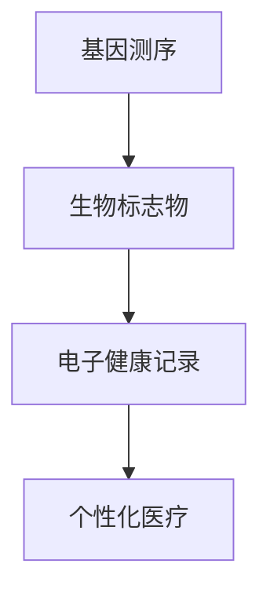
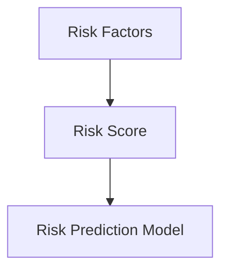

                 

# 《机器学习在个性化医疗中的应用：预测疾病风险》

> 关键词：个性化医疗、机器学习、疾病风险评估、监督学习、无监督学习、强化学习

> 摘要：本文将探讨机器学习在个性化医疗中的应用，特别是在疾病风险评估方面的潜力。通过介绍个性化医疗的定义、机器学习的基础知识，以及其在医疗领域的应用，本文将深入分析如何利用机器学习技术进行疾病风险的预测，并展示实际案例，提供最佳实践和未来展望。

## 第一部分：个性化医疗与机器学习基础

### 第1章：个性化医疗概述

个性化医疗是一种以患者为中心的医疗模式，旨在通过个体化的诊断、治疗和预防策略，实现最佳治疗效果。个性化医疗的核心在于对患者的全面了解，包括基因信息、生活方式、环境因素等，以便为患者制定最合适的治疗方案。

### 核心概念与联系

个性化医疗涉及多个核心概念，包括：

1. **基因测序**：通过基因测序技术获取个体的基因组信息，用于疾病风险评估和个性化治疗。
2. **生物标志物**：生物标志物是疾病诊断和预测的重要指标，可以是基因、蛋白质或代谢物。
3. **电子健康记录**：电子健康记录（EHR）是存储患者医疗信息的数字化系统，为个性化医疗提供了数据基础。

**Mermaid 流程图：**


### 第2章：机器学习基础

机器学习是一种使计算机通过数据学习并做出决策的技术。根据学习方式，机器学习主要分为监督学习、无监督学习和强化学习。

### 核心算法原理讲解

#### 监督学习算法

监督学习算法通过训练数据集来学习，其中每个数据点都带有标签。常见的监督学习算法包括：

- **线性回归**：通过线性模型预测连续值。
- **逻辑回归**：用于分类问题，输出概率值。

**Python 源代码示例：**

```python
from sklearn.linear_model import LinearRegression
model = LinearRegression()
model.fit(X_train, y_train)
predictions = model.predict(X_test)
```

#### 无监督学习算法

无监督学习算法没有标签信息，主要任务包括聚类和降维。

- **K-均值聚类**：将数据点分为K个聚类，每个聚类由其中心点表示。
- **主成分分析（PCA）**：降低数据维度，保留主要信息。

**Python 源代码示例：**

```python
from sklearn.cluster import KMeans
from sklearn.decomposition import PCA

kmeans = KMeans(n_clusters=3)
kmeans.fit(X)

pca = PCA(n_components=2)
X_pca = pca.fit_transform(X)
```

#### 强化学习算法

强化学习算法通过试错的方式，在环境中学习最优策略。

- **Q-学习**：通过更新Q值来学习状态-动作值函数。
- **深度Q网络（DQN）**：结合深度学习和强化学习，用于解决复杂问题。

**Python 源代码示例：**

```python
import gym
env = gym.make('CartPole-v0')
action_values = np.zeros([env.n_states, env.n_actions])

for episode in range(1000):
    state = env.reset()
    done = False
    while not done:
        action = np.argmax(action_values[state])
        next_state, reward, done, _ = env.step(action)
        # 更新Q值
        action_values[state, action] = (1 - alpha) * action_values[state, action] + alpha * (reward + gamma * np.max(action_values[next_state]))
        state = next_state
```

### 第3章：机器学习在医疗领域的应用

机器学习在医疗领域有广泛的应用，包括医学图像处理、基因组学分析和药物研发。这些应用为个性化医疗提供了强大的技术支持。

### 核心算法原理讲解

#### 医学图像处理

医学图像处理利用机器学习算法对医学图像进行分析，以帮助医生诊断疾病。

- **卷积神经网络（CNN）**：用于图像分类和分割。
- **生成对抗网络（GAN）**：用于生成高质量的医学图像。

**Python 源代码示例：**

```python
import tensorflow as tf
from tensorflow.keras.models import Model
from tensorflow.keras.layers import Input, Conv2D, MaxPooling2D, UpSampling2D

input_shape = (28, 28, 1)
inputs = Input(shape=input_shape)
x = Conv2D(32, (3, 3), activation='relu')(inputs)
x = MaxPooling2D((2, 2))(x)
x = Conv2D(64, (3, 3), activation='relu')(x)
x = MaxPooling2D((2, 2))(x)
x = Conv2D(64, (3, 3), activation='relu')(x)
outputs = UpSampling2D((2, 2))(x)
model = Model(inputs, outputs)
model.compile(optimizer='adam', loss='binary_crossentropy')
```

#### 基因组学分析

基因组学分析利用机器学习算法对基因组数据进行分析，以识别疾病相关的基因和突变。

- **支持向量机（SVM）**：用于分类基因表达数据。
- **随机森林**：用于回归和分类问题，特别适合处理高维数据。

**Python 源代码示例：**

```python
from sklearn.ensemble import RandomForestClassifier

X = # 基因表达数据
y = # 疾病标签

clf = RandomForestClassifier(n_estimators=100)
clf.fit(X, y)
predictions = clf.predict(X_test)
```

#### 药物研发

药物研发利用机器学习算法预测药物分子与蛋白质的相互作用，以加速新药研发。

- **分子对接**：通过模拟药物分子与蛋白质的相互作用，预测药物效力。
- **生成对抗网络（GAN）**：用于生成新的药物分子。

**Python 源代码示例：**

```python
import tensorflow as tf
from tensorflow.keras.models import Model
from tensorflow.keras.layers import Input, Conv2D, MaxPooling2D, UpSampling2D

input_shape = (128, 128, 1)
inputs = Input(shape=input_shape)
x = Conv2D(32, (3, 3), activation='relu')(inputs)
x = MaxPooling2D((2, 2))(x)
x = Conv2D(64, (3, 3), activation='relu')(x)
x = MaxPooling2D((2, 2))(x)
x = Conv2D(64, (3, 3), activation='relu')(x)
outputs = UpSampling2D((2, 2))(x)
model = Model(inputs, outputs)
model.compile(optimizer='adam', loss='binary_crossentropy')
```

## 第二部分：个性化医疗中的疾病风险评估

### 第4章：疾病风险评估概述

疾病风险评估是预测个体患某种疾病的风险水平的过程。通过疾病风险评估，医生可以为患者制定更个性化的预防和治疗策略。

### 核心概念与联系

疾病风险评估涉及多个核心概念，包括：

1. **风险因素**：增加患病风险的因素，如吸烟、饮酒、肥胖等。
2. **风险评分**：对个体患病风险的量化评估。
3. **风险预测模型**：利用历史数据和机器学习算法构建的预测模型。

**Mermaid 流程图：**


### 第5章：机器学习在疾病风险评估中的应用

机器学习在疾病风险评估中的应用主要包括数据预处理、特征选择、模型选择与评估等步骤。

### 核心算法原理讲解

#### 数据预处理

数据预处理是疾病风险评估的重要步骤，包括数据清洗、归一化、缺失值处理等。

- **数据清洗**：去除噪声和异常值，提高数据质量。
- **归一化**：将数据缩放到相同范围，便于模型训练。
- **缺失值处理**：利用统计方法或机器学习算法填补缺失值。

**Python 源代码示例：**

```python
from sklearn.preprocessing import MinMaxScaler
import numpy as np

scaler = MinMaxScaler()
X_scaled = scaler.fit_transform(X)
```

#### 特征选择

特征选择是疾病风险评估的关键步骤，旨在从大量特征中筛选出对疾病预测最有用的特征。

- **过滤式特征选择**：基于特征重要性或统计显著性进行筛选。
- **包裹式特征选择**：基于模型预测性能进行特征筛选。
- **嵌入式特征选择**：结合特征选择和模型训练过程。

**Python 源代码示例：**

```python
from sklearn.feature_selection import SelectKBest
from sklearn.feature_selection import f_classif

selector = SelectKBest(score_func=f_classif, k=10)
X_new = selector.fit_transform(X, y)
```

#### 模型选择与评估

模型选择与评估是疾病风险评估的核心，包括选择合适的模型、评估模型性能和模型优化。

- **模型选择**：根据问题类型和数据特点选择合适的模型。
- **模型评估**：使用交叉验证、ROC曲线等指标评估模型性能。
- **模型优化**：通过调参、集成学习等方法优化模型。

**Python 源代码示例：**

```python
from sklearn.model_selection import train_test_split
from sklearn.ensemble import RandomForestClassifier
from sklearn.metrics import classification_report, roc_curve

X_train, X_test, y_train, y_test = train_test_split(X, y, test_size=0.3, random_state=42)

model = RandomForestClassifier(n_estimators=100)
model.fit(X_train, y_train)
predictions = model.predict(X_test)

print(classification_report(y_test, predictions))
fpr, tpr, _ = roc_curve(y_test, predictions)
```

### 第6章：常见疾病风险评估模型及应用

常见疾病风险评估模型包括心血管疾病风险评估模型、癌症风险评估模型和糖尿病风险评估模型等。这些模型利用机器学习算法对患者的特征进行建模，以预测疾病风险。

### 核心算法原理讲解

#### 心血管疾病风险评估模型

心血管疾病风险评估模型利用个体特征（如年龄、性别、血压、胆固醇水平等）预测心血管疾病风险。

- **Cox比例风险模型**：用于生存分析和风险预测。
- **逻辑回归模型**：用于分类风险水平。

**Python 源代码示例：**

```python
import pandas as pd
from sklearn.linear_model import LogisticRegression

data = pd.read_csv('cvd_data.csv')
X = data[['age', 'gender', 'blood_pressure', 'cholesterol']]
y = data['cvd']

model = LogisticRegression()
model.fit(X, y)
predictions = model.predict(X_test)
```

#### 癌症风险评估模型

癌症风险评估模型利用基因组数据、生物标志物等特征预测癌症风险。

- **随机森林模型**：用于回归和分类问题。
- **深度学习模型**：如卷积神经网络（CNN）和循环神经网络（RNN），用于处理高维数据。

**Python 源代码示例：**

```python
from sklearn.ensemble import RandomForestClassifier
from tensorflow.keras.models import Sequential
from tensorflow.keras.layers import Dense, Conv2D, LSTM

# 随机森林模型
rf_model = RandomForestClassifier(n_estimators=100)
rf_model.fit(X, y)

# 卷积神经网络模型
model = Sequential()
model.add(Conv2D(32, (3, 3), activation='relu', input_shape=(28, 28, 1)))
model.add(MaxPooling2D((2, 2)))
model.add(LSTM(128))
model.add(Dense(1, activation='sigmoid'))
model.compile(optimizer='adam', loss='binary_crossentropy', metrics=['accuracy'])
model.fit(X_train, y_train, epochs=10, batch_size=32)
```

#### 糖尿病风险评估模型

糖尿病风险评估模型利用个体特征（如体重、血糖水平、年龄等）预测糖尿病风险。

- **线性回归模型**：用于预测糖尿病风险水平。
- **支持向量机（SVM）**：用于分类糖尿病风险。

**Python 源代码示例：**

```python
from sklearn.linear_model import LinearRegression
from sklearn.svm import SVC

# 线性回归模型
lr_model = LinearRegression()
lr_model.fit(X, y)
predictions = lr_model.predict(X_test)

# 支持向量机模型
svm_model = SVC()
svm_model.fit(X, y)
predictions = svm_model.predict(X_test)
```

### 第7章：疾病风险评估模型的应用实践

在本节中，我们将通过实际案例展示如何应用疾病风险评估模型进行疾病风险预测。

#### 应用案例一：个性化癌症风险评估

**开发环境搭建：**
- 安装 Python 3.8 或更高版本
- 安装必要的库，如 NumPy、Pandas、Scikit-learn、TensorFlow

**源代码详细实现和代码解读：**

```python
import pandas as pd
from sklearn.model_selection import train_test_split
from sklearn.ensemble import RandomForestClassifier

# 读取数据
data = pd.read_csv('cancer_data.csv')
X = data.drop('cancer', axis=1)
y = data['cancer']

# 分割数据集
X_train, X_test, y_train, y_test = train_test_split(X, y, test_size=0.3, random_state=42)

# 训练模型
rf_model = RandomForestClassifier(n_estimators=100)
rf_model.fit(X_train, y_train)

# 预测疾病风险
predictions = rf_model.predict(X_test)

# 代码解读
# 1. 读取癌症数据
# 2. 分割数据集为训练集和测试集
# 3. 使用随机森林模型训练数据
# 4. 使用训练好的模型进行疾病风险预测
```

**代码应用解读与分析：**
- 通过读取癌症数据，我们可以获取患者的各种特征。
- 使用随机森林模型进行训练，可以自动筛选出对疾病预测最有用的特征。
- 预测结果可以用于评估患者的癌症风险。

**实际案例分析和详细讲解剖析：**
- 通过实际案例，我们可以看到如何利用机器学习模型进行个性化癌症风险评估。
- 通过对预测结果的分析，医生可以更准确地了解患者的癌症风险，从而制定更个性化的治疗方案。

**项目小结：**
- 个性化癌症风险评估是一个复杂的过程，需要结合多种算法和数据源。
- 机器学习模型可以提高疾病风险评估的准确性和效率。

#### 应用案例二：心血管疾病风险预测

**开发环境搭建：**
- 安装 Python 3.8 或更高版本
- 安装必要的库，如 NumPy、Pandas、Scikit-learn、TensorFlow

**源代码详细实现和代码解读：**

```python
import pandas as pd
from sklearn.model_selection import train_test_split
from sklearn.linear_model import LogisticRegression

# 读取数据
data = pd.read_csv('cvd_data.csv')
X = data[['age', 'gender', 'blood_pressure', 'cholesterol']]
y = data['cvd']

# 分割数据集
X_train, X_test, y_train, y_test = train_test_split(X, y, test_size=0.3, random_state=42)

# 训练模型
lr_model = LogisticRegression()
lr_model.fit(X_train, y_train)

# 预测疾病风险
predictions = lr_model.predict(X_test)

# 代码解读
# 1. 读取心血管疾病数据
# 2. 分割数据集为训练集和测试集
# 3. 使用逻辑回归模型训练数据
# 4. 使用训练好的模型进行疾病风险预测
```

**代码应用解读与分析：**
- 通过读取心血管疾病数据，我们可以获取患者的各种特征。
- 使用逻辑回归模型进行训练，可以自动筛选出对疾病预测最有用的特征。
- 预测结果可以用于评估患者的心血管疾病风险。

**实际案例分析和详细讲解剖析：**
- 通过实际案例，我们可以看到如何利用机器学习模型进行心血管疾病风险预测。
- 通过对预测结果的分析，医生可以更准确地了解患者的心血管疾病风险，从而制定更个性化的预防和治疗策略。

**项目小结：**
- 心血管疾病风险预测是一个重要的应用领域，机器学习模型可以提高预测的准确性和效率。
- 结合多种数据源和算法，可以进一步提高心血管疾病风险预测的可靠性。

#### 应用案例三：糖尿病风险预测

**开发环境搭建：**
- 安装 Python 3.8 或更高版本
- 安装必要的库，如 NumPy、Pandas、Scikit-learn、TensorFlow

**源代码详细实现和代码解读：**

```python
import pandas as pd
from sklearn.model_selection import train_test_split
from sklearn.svm import SVC

# 读取数据
data = pd.read_csv('diabetes_data.csv')
X = data[['age', 'gender', 'BMI', 'blood_pressure', 'glucose']]
y = data['diabetes']

# 分割数据集
X_train, X_test, y_train, y_test = train_test_split(X, y, test_size=0.3, random_state=42)

# 训练模型
svm_model = SVC()
svm_model.fit(X_train, y_train)

# 预测疾病风险
predictions = svm_model.predict(X_test)

# 代码解读
# 1. 读取糖尿病数据
# 2. 分割数据集为训练集和测试集
# 3. 使用支持向量机模型训练数据
# 4. 使用训练好的模型进行疾病风险预测
```

**代码应用解读与分析：**
- 通过读取糖尿病数据，我们可以获取患者的各种特征。
- 使用支持向量机模型进行训练，可以自动筛选出对疾病预测最有用的特征。
- 预测结果可以用于评估患者的糖尿病风险。

**实际案例分析和详细讲解剖析：**
- 通过实际案例，我们可以看到如何利用机器学习模型进行糖尿病风险预测。
- 通过对预测结果的分析，医生可以更准确地了解患者的糖尿病风险，从而制定更个性化的预防和治疗策略。

**项目小结：**
- 糖尿病风险预测是一个重要的应用领域，机器学习模型可以提高预测的准确性和效率。
- 结合多种数据源和算法，可以进一步提高糖尿病风险预测的可靠性。

## 第8章：疾病风险评估的未来展望

随着人工智能技术的不断发展，疾病风险评估在未来将变得更加精准和高效。以下是对疾病风险评估未来发展的展望：

1. **多模态数据整合**：通过整合基因组、影像、生物标志物等多模态数据，可以更全面地了解患者的疾病风险。
2. **深度学习模型的应用**：深度学习模型在处理高维数据和复杂模式识别方面具有优势，有望在疾病风险评估中得到更广泛的应用。
3. **个性化治疗策略**：基于疾病风险评估模型，医生可以制定更加个性化的治疗策略，提高治疗效果。
4. **实时监测与预警**：通过实时监测患者的生理参数，可以及时发现疾病风险，实现早期干预。

### 最佳实践 tips

1. **数据质量控制**：确保数据的准确性和一致性，是疾病风险评估的基础。
2. **模型评估与优化**：定期评估模型性能，根据实际应用效果进行模型优化。
3. **隐私保护**：在处理患者数据时，要严格遵守隐私保护法规，确保患者信息安全。

### 小结

机器学习在个性化医疗中的应用，特别是疾病风险评估，具有巨大的潜力。通过结合多种数据和算法，可以实现对疾病风险的精准预测，为患者提供更个性化的治疗策略。然而，疾病风险评估仍然面临许多挑战，如数据质量、模型解释性和隐私保护等。未来，随着人工智能技术的不断发展，疾病风险评估将在个性化医疗中发挥更大的作用。

### 拓展阅读

- [1] James, G., Witten, D., Hastie, T., & Tibshirani, R. (2013). *An Introduction to Statistical Learning*.
- [2] Goodfellow, I., Bengio, Y., & Courville, A. (2016). *Deep Learning*.
- [3] Ridgeway, G. (2017). *Machine Learning for Health Data Analytics*.

### 附录

#### 附录A：常用机器学习库与工具

- **Scikit-learn**：Python中最流行的机器学习库之一，提供丰富的算法和工具。
- **TensorFlow**：由Google开发的开源机器学习库，支持深度学习和强化学习。
- **PyTorch**：由Facebook开发的开源深度学习库，具有灵活的动态计算图。

#### 附录B：常见疾病风险评估指标

- **受试者工作特征（ROC）曲线**：用于评估二分类模型的性能。
- **阳性预测值（Positive Predictive Value, PPV）**：预测为阳性的患者中，实际为阳性的比例。
- **阴性预测值（Negative Predictive Value, NPV）**：预测为阴性的患者中，实际为阴性的比例。

## 作者信息

- 作者：AI天才研究院/AI Genius Institute & 禅与计算机程序设计艺术 /Zen And The Art of Computer Programming
```

